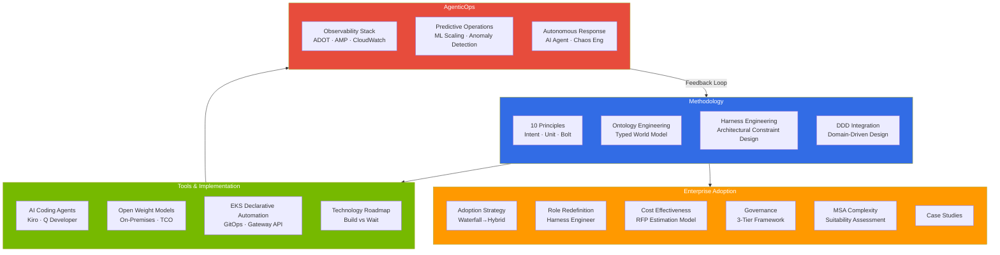

# AIDLC: AI-Driven Development Lifecycle

AIDLC (AI-Driven Development Lifecycle) organizes AI-assisted requirements analysis, design, implementation, and testing around **Intent → Unit → Bolt**. An Intent states a business goal, a Unit divides that goal into a bounded piece of work, and a Bolt is a short iteration for carrying out the work. AI proposes plans and artifacts; people review them against the project's requirements and constraints.

## 4 Tracks

The AIDLC guide is organized into 4 tracks based on the reader's role and interests.

```mermaid
flowchart TB
    subgraph METHOD["Methodology"]
        direction TB
        P["10 Principles<br/>Intent · Unit · Bolt"]
        O["Ontology Engineering<br/>Typed World Model"]
        H["Harness Engineering<br/>Architectural Constraint Design"]
        D["DDD Integration<br/>Domain-Driven Design"]
    end

    subgraph ENTER["Enterprise Adoption"]
        direction TB
        A["Adoption Strategy<br/>Waterfall→Hybrid"]
        R["Role Redefinition<br/>Harness Engineer"]
        C["Cost Effectiveness<br/>RFP Estimation Model"]
        G["Governance<br/>3-Tier Framework"]
        M["MSA Complexity<br/>Suitability Assessment"]
        CS["Case Studies"]
    end

    subgraph TOOL["Tools & Implementation"]
        direction TB
        AI["AI Coding Agents<br/>Kiro · Q Developer"]
        OW["Open Weight Models<br/>On-Premises · TCO"]
        EKS["EKS Declarative Automation<br/>GitOps · Gateway API"]
        TR["Technology Roadmap<br/>Build vs Wait"]
    end

    subgraph OPS["AgenticOps"]
        direction TB
        OB["Observability Stack<br/>ADOT · AMP · CloudWatch"]
        PR["Predictive Operations<br/>ML Scaling · Anomaly Detection"]
        AR["Autonomous Response<br/>AI Agent · Chaos Eng"]
    end

    METHOD --> TOOL
    METHOD --> ENTER
    TOOL --> OPS
    OPS -->|"Feedback Loop"| METHOD

    style METHOD fill:#326ce5,color:#fff
    style ENTER fill:#ff9900,color:#fff
    style TOOL fill:#76b900,color:#fff
    style OPS fill:#e74c3c,color:#fff
```

## Learning Path by Role

| Role | Recommended Path |
|------|----------|
| **Executives · PM** | [Enterprise Adoption](/docs/aidlc/enterprise) → [Cost Effectiveness](/docs/aidlc/enterprise/cost-estimation) → [Case Studies](/docs/aidlc/enterprise/case-studies) |
| **Architects** | [Methodology](/docs/aidlc/methodology) → [Ontology](/docs/aidlc/methodology/ontology-engineering) → [Harness](/docs/aidlc/methodology/harness-engineering) → [MSA Complexity](/docs/aidlc/enterprise/msa-complexity) |
| **Developers** | [10 Principles](/docs/aidlc/methodology/principles-and-model) → [DDD Integration](/docs/aidlc/methodology/ddd-integration) → [AI Coding Agents](/docs/aidlc/toolchain/ai-coding-agents) |
| **Operations · SRE** | [AgenticOps](/docs/aidlc/operations) → [Observability](/docs/aidlc/operations/observability-stack) → [Autonomous Response](/docs/aidlc/operations/autonomous-response) |
| **Security · Compliance** | [Governance](/docs/aidlc/enterprise/governance-framework) → [Harness Engineering](/docs/aidlc/methodology/harness-engineering) → [Open Weight Models](/docs/aidlc/toolchain/open-weight-models) |

## Core Concepts

### Dual Axes of Reliability: Ontology × Harness

This playbook’s optional reliability framework separates domain definitions from the mechanisms that check and enforce them:

- **[Ontology](/docs/aidlc/methodology/ontology-engineering) (WHAT + WHEN)**: Defines entities, relationships, and domain constraints in a typed schema. Inner/Middle/Outer feedback loops provide input for revising those definitions.
- **[Harness Engineering](/docs/aidlc/methodology/harness-engineering) (HOW)**: Implements checks and execution limits around agent work, including circuit breakers, retry budgets, and output gates. Reliability depends on which constraints are enforced and how the controls are validated.

## References

- [AWS AI-Driven Development Life Cycle](https://aws.amazon.com/blogs/devops/ai-driven-development-life-cycle/)
- [AWS Labs AIDLC Workflows (GitHub)](https://github.com/awslabs/aidlc-workflows)
