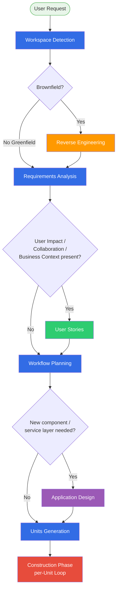
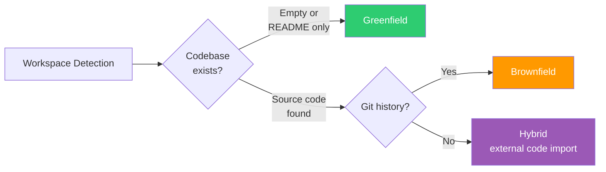
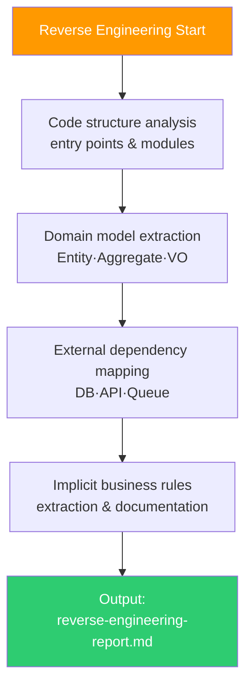
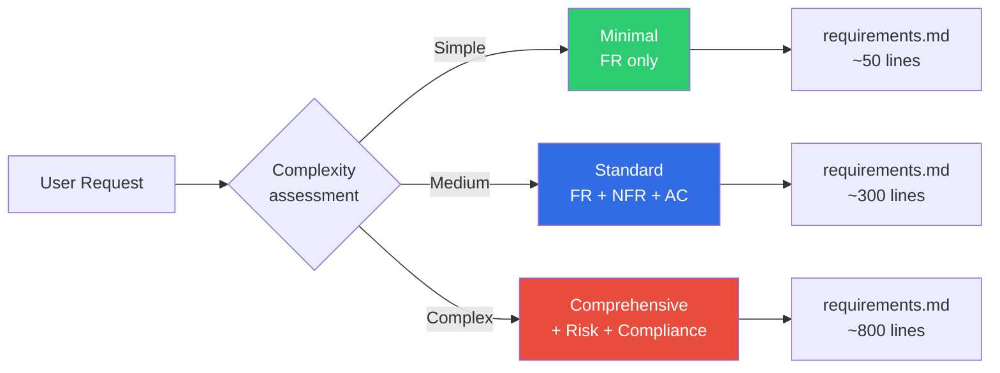
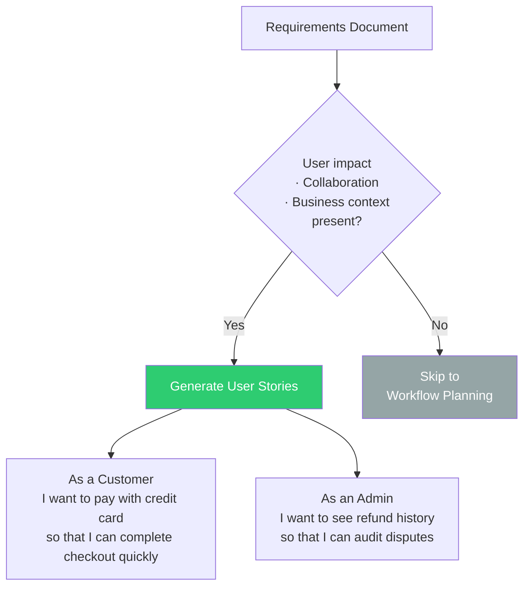
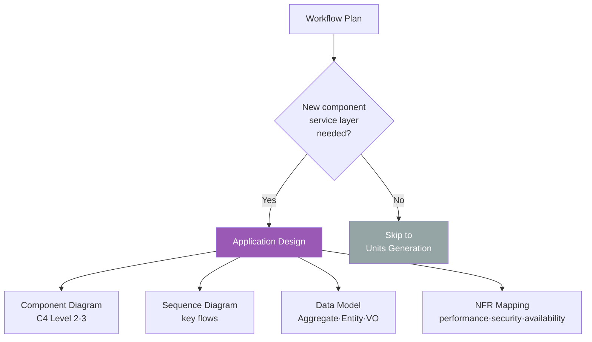
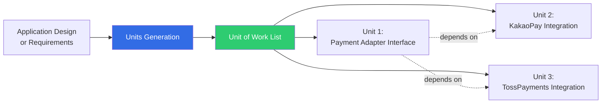
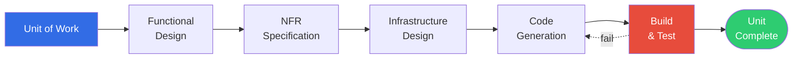
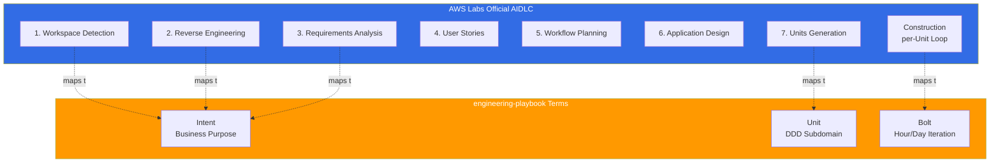

# AIDLC Adaptive Execution

> 📅 **Written**: 2026-04-18 | ⏱️ **Reading Time**: ~20 minutes

---

## 1. Overview: Why Adaptive?

AWS Labs [AIDLC Workflows](https://github.com/awslabs/aidlc-workflows) defaults to **conditional (adaptive) execution rather than fixed workflows**. Where traditional SDLC stages were "always sequential," AIDLC **selects and reorders only necessary stages** based on project characteristics, codebase state, and requirement complexity.



**Key Messages:**
- **Workspace Detection** and **Workflow Planning** are **mandatory** (always executed)
- **Reverse Engineering · User Stories · Application Design** are **conditional** (executed/skipped based on project characteristics)
- **Requirements Analysis** and **Units Generation** nearly always execute but **depth (Minimal/Standard/Comprehensive) adjusts**

:::info AWS Labs Official Statement
> "AIDLC is adaptive rather than prescriptive. Each stage's execution is conditional on the workspace state and user needs, allowing teams to skip stages that aren't relevant to their specific project."
>
> — [AWS Labs AIDLC Workflows, v0.1.7](https://github.com/awslabs/aidlc-workflows)
:::

---

## 2. Inception Phase: 7-Stage Decision Tree

### 2.1 Stage 1: Workspace Detection (Mandatory)

**Purpose**: Determine whether the current workspace is **Greenfield** (new) or **Brownfield** (existing codebase).



**Execution Condition**: Always executed (starting point of all AIDLC sessions)

**Artifact**: `.aidlc/workspace.md`
```markdown
## Workspace Detection Result

**Type**: Brownfield
**Primary Language**: TypeScript (72%), Go (18%), YAML (10%)
**Framework**: Next.js 14 (detected from package.json)
**Infrastructure**: EKS 1.35 (detected from k8s/ directory)
**Git**: main branch, 847 commits
**Test Coverage**: 68% (jest coverage report found)
```

### 2.2 Stage 2: Reverse Engineering (Brownfield Condition)

**Purpose**: Extract **implicit requirements, domain models, and architectural constraints** from existing codebase through reverse engineering.

**Execution Conditions**:
- Workspace Detection resulted in **Brownfield** or **Hybrid**
- User explicitly stated "extending existing system"

**Skip Conditions**:
- Greenfield (no code)
- User explicitly stated "rewrite from scratch, ignore existing"



**Artifact**: `.aidlc/reverse-engineering-report.md`

### 2.3 Stage 3: Requirements Analysis (Nearly Always Executed, Depth Adjusted)

**Purpose**: Refine User Request into **structured Requirements Document**.

**Three Execution Depth Levels:**

| Level | Application Criteria | Included Elements | Estimated Duration |
|-------|---------------------|-------------------|-------------------|
| **Minimal** | Bug fixes · Simple refactoring | FR list, impact scope | 10-20 minutes |
| **Standard** | New features · Feature extensions | FR, NFR, Acceptance Criteria, dependencies | 1-3 hours |
| **Comprehensive** | New services · Architecture changes | Standard + Risk Analysis, Compliance, Performance Model | Half day-1 day |



**Skip Condition**:
- User Request already provided in FR/NFR structure (only Content Validation executed)

### 2.4 Stage 4: User Stories (Conditional)

**Purpose**: Transform Requirements into **user-perspective scenarios (As a X, I want Y, so that Z)**.

**Execution Conditions**:
- Requirements specify **user impact** (UX changes, workflow changes)
- **Collaboration context** is important (multiple teams/roles involved)
- **Business context** needs clarification (stakeholder explanation required)

**Skip Conditions**:
- Pure infrastructure/backend changes (users don't directly perceive)
- DevOps automation (CI/CD pipeline improvements, etc.)
- Data migration



### 2.5 Stage 5: Workflow Planning (Mandatory)

**Purpose**: Decide **list of stages to execute in this session** and **draft Unit of Work list**.

**Execution Condition**: Always executed (core of Adaptive)

**Artifact**: `.aidlc/workflow-plan.md`
```markdown
## Workflow Plan

**Scope**: Payment Service payment method expansion (credit card → + quick pay)

**Stages to Execute**:
- [x] workspace_detection (completed)
- [x] reverse_engineering (completed, brownfield)
- [x] requirements_analysis (Standard level)
- [x] user_stories (completed, 4 stories)
- [ ] **workflow_planning** (current)
- [ ] application_design (new payment adapter service layer needed → execute)
- [ ] units_generation
- [ ] construction (per-unit loop)

**Estimated Units**: 3
1. Payment Adapter Interface
2. KakaoPay Integration
3. TossPayments Integration

**Estimated Duration**: 3-5 days
```

### 2.6 Stage 6: Application Design (Conditional)

**Purpose**: Generate design documents when **new components, service layers, or architectural patterns** are needed.

**Execution Conditions**:
- New microservice · new Bounded Context required
- Architectural layer changes (e.g., monolith → modular monolith → MSA)
- Adding cross-cutting concerns (e.g., authentication layer, audit layer)

**Skip Conditions**:
- Adding features within existing service (Workflow Planning confirms extending existing Bounded Context)
- UI changes only
- Configuration changes



### 2.7 Stage 7: Units Generation (Conditional)

**Purpose**: Decompose Application Design or Requirements into **multiple Units of Work (independent work units)**.

**Execution Conditions**:
- Scope exceeds a single atomic change (< 100 lines)
- Changes span multiple services or files
- Parallelizable work exists

**Skip Condition**:
- Single function · single file modification → enter Construction immediately (1 Unit auto-generated)



**Artifact**: `.aidlc/units/` directory
```
.aidlc/units/
  unit-001-payment-adapter-interface.md
  unit-002-kakaopay-integration.md
  unit-003-tosspayments-integration.md
  dependencies.md  ← Inter-unit dependency graph
```

---

## 3. Construction Phase: Per-Unit Loop

Each Unit of Work has an internal loop that **executes 5 sub-stages sequentially**.



### 3.1 Sub-stage 1: Functional Design

**Purpose**: Specify the Unit's **inputs, outputs, and business rules**.

**Artifact Example:**
```markdown
## Unit-002: KakaoPay Integration — Functional Design

### Inputs
- OrderID (string, UUID v4)
- Amount (int, KRW, min 100, max 10_000_000)
- UserID (string, UUID v4)

### Outputs
- Success: PaymentToken (string), RedirectURL (string)
- Failure: ErrorCode (enum), ErrorMessage (string)

### Business Rules
- KakaoPay session must complete within 15 minutes
- Duplicate payment prevention: idempotency key based on OrderID
- Amount in KRW integer units
```

### 3.2 Sub-stage 2: NFR Specification

**Purpose**: Define the Unit's **non-functional requirements** in measurable form.

**Artifact Example:**
```markdown
## Unit-002 NFR

| ID | NFR | Metric | Target |
|----|-----|--------|--------|
| KP-NFR-001 | Performance | API latency P99 | < 500ms |
| KP-NFR-002 | Availability | Monthly availability | 99.9% |
| KP-NFR-003 | Security | Card info logging | Strictly prohibited |
| KP-NFR-004 | Observability | Payment failure rate dashboard | Grafana real-time |
```

### 3.3 Sub-stage 3: Infrastructure Design

**Purpose**: Design **infrastructure resources** (EKS Deployment, SQS Queue, Secret, etc.) needed for Unit execution.

**Artifact Example:**
```yaml
## Unit-002 Infrastructure

resources:
  - type: eks.Deployment
    name: kakaopay-adapter
    replicas: 2
    hpa:
      min: 2
      max: 10
      cpu_target: 70
  - type: ack.SecretsManager.Secret
    name: kakaopay-api-key
    rotation: 90d
  - type: ack.SQS.Queue
    name: kakaopay-retry-dlq
    visibility_timeout: 300
```

### 3.4 Sub-stage 4: Code Generation

**Purpose**: Generate **actual code** using the above 3 sub-stage artifacts as input.

- Apply TDD principles: tests first, implementation later
- Comply with Harness Engineering constraints
- Verify Ontology terminology consistency

### 3.5 Sub-stage 5: Build & Test

**Purpose**: **Auto-build + unit test + integration test** the generated code.

**Loss Function Role:**
- Build failure → Retry Sub-stage 4
- Unit Test failure → Fix code or fix test
- Integration Test failure → Review Infrastructure Design

---

## 4. Summary Table: Execution and Skip Conditions by Stage

| Stage | Mandatory? | Execution Condition | Skip Condition | Avg Duration |
|-------|-----------|---------------------|----------------|--------------|
| **Workspace Detection** | Mandatory | Every session | - | 1-2 min |
| **Reverse Engineering** | Conditional | Brownfield | Greenfield | 30 min-2 hrs |
| **Requirements Analysis** | Nearly mandatory | Always (depth adjusted) | User Request already in FR/NFR structure | 10 min-1 day |
| **User Stories** | Conditional | User impact·collaboration·business context | Pure infra·DevOps changes | 30 min-3 hrs |
| **Workflow Planning** | Mandatory | Every session | - | 15-30 min |
| **Application Design** | Conditional | New component·service layer | Changes within existing service | 1 hr-1 day |
| **Units Generation** | Conditional | Multi-file · Multi-service | Single atomic change | 15 min-2 hrs |
| **Construction (per Unit)** | Mandatory | Every Unit | - | 1 hr-1 day per Unit |

---

## 5. Mapping to engineering-playbook Intent/Unit/Bolt

| engineering-playbook Term | Position in Official AIDLC | Mapping Description |
|--------------------------|----------------------------|---------------------|
| **Intent** | Input + artifacts of Stage 1-3 (Workspace Detection → Requirements Analysis) | Intent is synthesis of User Request + Requirements Document |
| **Unit** | Artifacts of Stage 7 (Units Generation) | 1:1 correspondence with Unit of Work |
| **Bolt** | Full Construction Phase (5 sub-stages) single execution | Short iteration replacing Sprint |

**Visual Mapping:**



---

## 6. Real-World Workflow Examples by Scenario

### 6.1 Scenario A: New Microservice (Greenfield)

```
workspace_detection (1min) → [SKIP reverse_engineering]
  → requirements_analysis (Comprehensive, half day)
  → user_stories (2 hrs)
  → workflow_planning (30min)
  → application_design (1 day)
  → units_generation (1 hr) → 5 Units
  → construction x 5 (parallel Units, 1 day per Unit)

Total Duration: 5-7 days
```

### 6.2 Scenario B: Existing Service Bug Fix

```
workspace_detection (1min)
  → reverse_engineering (Minimal, bug vicinity code only 30min)
  → requirements_analysis (Minimal, 10min)
  → [SKIP user_stories]
  → workflow_planning (10min)
  → [SKIP application_design]
  → [SKIP units_generation, single Unit auto-generated]
  → construction (2-4 hrs)

Total Duration: 3-5 hours
```

### 6.3 Scenario C: Legacy System Migration

```
workspace_detection (5min, legacy complexity analysis)
  → reverse_engineering (Comprehensive, 2-3 days)
  → requirements_analysis (Comprehensive, 1 day)
  → user_stories (1 day, map existing user workflows)
  → workflow_planning (half day, migration roadmap)
  → application_design (2 days, Strangler Fig pattern)
  → units_generation (half day, 20+ Units)
  → construction x 20 (incremental execution, several months)

Total Duration: 3-6 months
```

### 6.4 Scenario D: DevOps Automation (CI/CD Improvement)

```
workspace_detection (1min)
  → [SKIP reverse_engineering]
  → requirements_analysis (Standard, 1 hr)
  → [SKIP user_stories, internal developer tool]
  → workflow_planning (20min)
  → [SKIP application_design, improving existing pipeline]
  → units_generation (30min, 3-5 Units)
  → construction x 3-5 (1-2 hrs each Unit)

Total Duration: 1-2 days
```

---

## 7. Adaptive Execution Implementation Checklist

Items to verify when adopting AIDLC Adaptive Execution in your organization:

- [ ] **Workspace Detection Automation**: Integrate codebase analysis tools (e.g., `cloc`, `git log`, AST parser)
- [ ] **Complexity Scorer**: Auto-classify Requirements into Minimal/Standard/Comprehensive
- [ ] **User Stories Trigger**: Define user impact keyword dictionary
- [ ] **Application Design Trigger**: Rules for determining new Bounded Context
- [ ] **Units Generation Splitter**: Define Unit decomposition criteria (file count, LOC, team ownership)
- [ ] **Stage Skip Logging**: Record **audit logs** for skipped stages (linked to Audit Logging rule)
- [ ] **Checkpoint Approval Gates**: Implement approval gates between stages
- [ ] **Session Continuity**: Restore next stage to execute when session is interrupted/resumed

---

## 8. References

### Official Repositories
- [AWS Labs AIDLC Inception Stages](https://github.com/awslabs/aidlc-workflows/tree/main/aws-aidlc-rule-details/inception) — Detailed rules for 7 stages
- [AWS Labs AIDLC Construction](https://github.com/awslabs/aidlc-workflows/tree/main/aws-aidlc-rule-details/construction) — per-Unit loop specification
- [Open-Sourcing Adaptive Workflows for AI-DLC (AWS Blog)](https://aws.amazon.com/blogs/devops/open-sourcing-adaptive-workflows-for-ai-driven-development-life-cycle-ai-dlc/) — Original Adaptive concept

### Related Documentation
- [10 Principles and Execution Model](./principles-and-model.md) — Intent/Unit/Bolt overview and official terminology mapping
- [Common Rules](./common-rules.md) — 11 common rules (including Workflow Changes, Checkpoint Approval)
- [DDD Integration](./ddd-integration.md) — How to map Units to DDD Bounded Contexts
- [AI Coding Agents](../toolchain/ai-coding-agents.md) — Tool selection for Construction Phase
