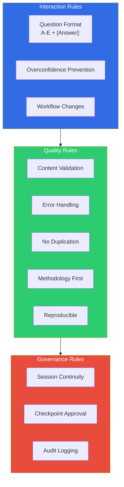
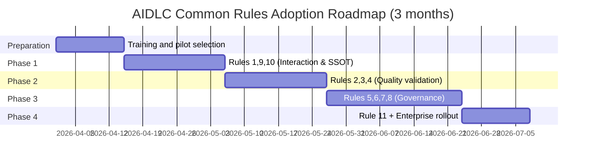

# AIDLC Common Rules

> 📅 **Written**: 2026-04-18 | ⏱️ **Reading Time**: ~18 minutes

The `aws-aidlc-rule-details/common/` directory in AWS Labs [AIDLC Workflows](https://github.com/awslabs/aidlc-workflows) defines **11 rules that all stages must comply with**. These rules govern how AI agents and humans collaborate across Inception → Construction → Operations phases, ensuring **reproducibility, auditability, and safety** of outcomes.

This document explains each rule using a "What / Why / How" three-tier structure, with practical tips for enterprise environments.

---

## 1. Overview: 11 Common Rules



| # | Rule | Category | Core Value |
|---|------|----------|-----------|
| 1 | Question Format | Interaction | Enforce structured Q&A format |
| 2 | Content Validation | Quality | Validate requirements & responses |
| 3 | Error Handling | Quality | Standardized exception handling |
| 4 | Overconfidence Prevention | Interaction | Control AI confidence levels |
| 5 | Session Continuity | Governance | Preserve context across sessions |
| 6 | Workflow Changes | Interaction | Explicit approval for workflow modifications |
| 7 | Checkpoint Approval | Governance | Stage transition gates |
| 8 | Audit Logging | Governance | ISO 8601 timestamped audit logs |
| 9 | No Duplication | Quality | Single Source of Truth (SSOT) |
| 10 | Methodology First | Quality | Tool independence |
| 11 | Reproducible | Quality | Consistent results across models |

:::info Why Common Rules Matter
AIDLC must work identically across **Kiro · Q Developer · Cursor · Cline · Claude Code · GitHub Copilot · AGENTS.md** — seven platforms. Common Rules are the shared contract that guarantees **consistent quality outputs for the same inputs**, regardless of platform or model differences.
:::

---

## 2. Rule 1: Question Format

### What
AI agents must always use **A-E multiple choice + `[Answer]:` tag** format when asking humans questions.

### Why
- **Reproducibility**: Free-form answers vary by model and session. Multiple choice eliminates interpretation ambiguity
- **Speed**: Humans don't need to write long responses. Single-letter selection moves things forward
- **Auditability**: Structured Q&A pairs enable audit logs and replay

### How

**Question Template:**
```markdown
Q1. How should authentication be configured for the Payment Service?

A. OAuth2 + JWT (with Refresh Token)
B. API Key (header-based)
C. mTLS (service-to-service auth)
D. AWS IAM + SigV4
E. Other (please specify)

[Answer]:
```

**Human Response:**
```markdown
[Answer]: A
```

Or when free-form context is needed:
```markdown
[Answer]: E - Cognito User Pool + JWT (following existing org standard)
```

### Enterprise Adoption Tips
- Keep **5 options or fewer** per question. More causes decision fatigue
- Standardize option D as "most common default", option E as "Other"
- Copy question blocks to PR descriptions or Slack channels for **team consensus before writing `[Answer]:`**

---

## 3. Rule 2: Content Validation

### What
AI must run **self-validation checklists** on all generated artifacts (Requirements Documents, Design Documents, Code, etc.) and **explicitly report failures** to humans.

### Why
- AI often produces omissions, contradictions, or hallucinations
- Humans lack time to exhaustively review every artifact
- AI self-validation as first-line filter reduces human review burden

### How

**Self-Validation Checklist Example (Requirements Document):**
```markdown
## Content Validation Report

- [x] All functional requirements include Acceptance Criteria
- [x] Non-functional requirements (NFRs) specify measurable metrics (P99 latency, availability, etc.)
- [ ] **FAIL**: FR-004 error handling path not specified
- [x] Terminology matches ontology/Ubiquitous Language
- [x] External dependencies (DB, SQS, etc.) declared
- [ ] **FAIL**: NFR-002 contains vague phrase "fast enough"

**Failed Checks**: 2
**Action Required**: User confirmation and rewrite needed
```

### Enterprise Adoption Tips
- Store **validation checklists for each artifact type** in ontology or organizational extensions
- Add `aidlc-validate` step to CI pipeline to auto-post reports as PR comments
- Auto-create GitHub Issues for failed items and block Checkpoint Approval until resolved

---

## 4. Rule 3: Error Handling

### What
All exceptions during AIDLC execution (missing files, tool errors, user non-response, etc.) must be recorded as **structured error reports**, with **explicit decisions on retry or user intervention**.

### Why
- Silent failures break audit trails
- Different error contexts require different responses: **auto-retry / user intervention / session termination**
- Error pattern analysis drives AIDLC improvement

### How

**Error Report Format:**
```yaml
error:
  id: ERR-2026-04-18-001
  timestamp: 2026-04-18T10:23:45Z
  stage: inception.requirements_analysis
  type: missing_context
  message: "Workspace Detection results missing from session"
  severity: medium
  recovery:
    auto_retry: false
    user_action_required: true
    suggested_fix: "Execute Workspace Detection stage first"
  context:
    session_id: sess-20260418-abc123
    prior_stage: workspace_detection
```

**Error Classification:**
| Severity | Example | Response |
|----------|---------|----------|
| Low | Free-form response instead of A-E option | AI auto-interprets and confirms with question |
| Medium | Required prerequisite stage not executed | Guide user to run stages in reverse order |
| High | Tool invocation failure (MCP server down, etc.) | Pause session, collect logs |
| Critical | Ontology contract violation (e.g., disallowed domain term) | Immediate halt, human intervention |

### Enterprise Adoption Tips
- Send error reports to **CloudWatch Logs Insights** for pattern analysis
- Integrate High/Critical errors with PagerDuty
- Monthly error review meetings to improve AIDLC itself

---

## 5. Rule 4: Overconfidence Prevention

### What
AI responses must declare **confidence levels**, and when confidence is low, must **request additional context** from users.

### Why
- LLMs often generate incorrect answers with very confident tone (hallucination)
- Confidence indicators signal users **where to focus review effort**
- Transparently manage trust levels in AI decision-making within organizations

### How

**Confidence Declaration:**
```markdown
## Proposal: Payment Service Authentication Architecture

**Confidence**: High (90%)

Recommend Cognito User Pool + JWT. Rationale...

---

## Proposal: DynamoDB Table Design

**Confidence**: Medium (60%)
**Reason for lower confidence**: Missing read/write ratio information for Payment domain,
GSI design may not be optimal.

**Additional Context Needed**:
- Daily transaction volume?
- Query patterns (by user? by time range?)

[Answer]:
```

### Enterprise Adoption Tips
- **Low confidence (< 50%) responses automatically pause at Checkpoint Approval gates**
- Track confidence distribution statistics to identify AI improvement priorities
- Regulated industries (finance, healthcare): auto-adopt only High confidence, require human approval for Medium/Low

---

## 6. Rule 5: Session Continuity

### What
Persist AIDLC session state so that **previous context (questions, answers, artifacts) can be fully restored** when sessions are interrupted and resumed.

### Why
- Enterprise projects span multiple days and teams
- Context loss at session end = duplicate questions · rework · information loss
- Team handoffs require answering "where did we leave off?"

### How

**Session State File (`.aidlc/session.md`):**
```markdown
# AIDLC Session State

**Session ID**: sess-20260418-payment-service
**Started**: 2026-04-17T09:00:00Z
**Last Active**: 2026-04-18T10:30:00Z
**Owner**: yjeong@example.com

## Progress

| Stage | Status | Artifacts | Approved By | Approved At |
|-------|--------|-----------|-------------|-------------|
| workspace_detection | complete | `.aidlc/workspace.md` | yjeong | 2026-04-17T09:15:00Z |
| requirements_analysis | complete | `requirements.md` | yjeong | 2026-04-17T11:00:00Z |
| user_stories | complete | `user-stories.md` | yjeong | 2026-04-17T14:00:00Z |
| workflow_planning | in_progress | - | - | - |

## Pending Questions

Q3. Authentication method (A-E) — Asked at 2026-04-18T10:30:00Z, awaiting answer
```

### Enterprise Adoption Tips
- Version-control session state with **Git** (enables PR-based collaboration)
- Back up session state to S3 + Versioning (for audit)
- Auto-archive sessions inactive for 30+ days

---

## 7. Rule 6: Workflow Changes

### What
Prevent AI from **arbitrarily adding, skipping, or modifying workflow steps**. Changes require **explicit user approval**.

### Why
- AI skipping stages "for efficiency" breaks audit trails
- Organizational regulations (e.g., financial oversight) mandate certain stage execution
- Workflow change history is organizational learning asset

### How

**Workflow Change Request Template:**
```markdown
## Workflow Change Request

**Current Workflow**: workspace_detection → requirements_analysis → user_stories → workflow_planning

**Proposed Change**: Skip user_stories and proceed directly to workflow_planning

**Reason**: `user-stories.md` already exists, no re-review needed

**Impact**:
- Save 1 hour of session time
- However, risk missing recent requirement changes

**Approval Required**: A. Approve / B. Reject / C. Conditional approval (after additional review)

[Answer]:
```

### Enterprise Adoption Tips
- Define **non-skippable stage list** in organizational extensions (e.g., finance prohibits skipping security-review)
- Review change history in monthly governance meetings
- "Outlier change" patterns signal workflow improvement opportunities

---

## 8. Rule 7: Checkpoint Approval

### What
Require **explicit human approval** at each stage transition (e.g., requirements_analysis → user_stories).

### Why
- Reverting after stage transitions is difficult (non-reversible)
- Approval functions as both **quality gate + governance evidence**
- Concrete implementation of human-in-the-loop principle

### How

**Approval Template:**
```markdown
## Checkpoint Approval Gate

**Completing Stage**: requirements_analysis
**Next Stage**: user_stories

**Artifacts Produced**:
- `requirements.md` (1,234 lines)
- `.aidlc/validation-report.md` (Content Validation passed)
- `.aidlc/audit/stage-requirements-analysis.md`

**Review Checklist**:
- [x] All business requirements included
- [x] NFRs measurable
- [x] Stakeholder review completed

**Approver**: yjeong@example.com
**Approval Decision**:

A. Approve (proceed to next stage)
B. Reject (current stage requires rework)
C. Approve with comments

[Answer]:
```

### Enterprise Adoption Tips
- **Multi-approver pattern**: Implement multi-sig gates for cases requiring approval from architect + security + PM
- Approval records auto-link to **audit logs (Rule 8)**
- Attempting next stage without approval triggers error (handled by Rule 3)

---

## 9. Rule 8: Audit Logging

### What
Record all AIDLC events (questions, answers, approvals, errors) in audit logs using **ISO 8601 timestamps + original text preservation** format.

### Why
- Regulated industries (finance, healthcare) require complete reproducibility of decision rationale
- Root cause analysis when incidents occur
- Data accumulation for AIDLC improvement

### How

**Audit Log Format (`audit.md`):**
```markdown
## Event: Checkpoint Approval Granted

**Event ID**: evt-2026-04-18-042
**Timestamp**: 2026-04-18T10:45:12.345Z
**Session**: sess-20260418-payment-service
**Actor**: yjeong@example.com
**Stage Transition**: requirements_analysis → user_stories

**Original User Response** (preserved):
```
[Answer]: A
```

**AI Interpretation**: Approve (proceed to next stage)

**Artifacts Hash**:
- requirements.md: sha256:abc123...
- validation-report.md: sha256:def456...

---

## Event: Question Asked

**Event ID**: evt-2026-04-18-041
**Timestamp**: 2026-04-18T10:42:00.000Z
**Session**: sess-20260418-payment-service
**Stage**: requirements_analysis
**Question Text** (preserved):
```
Q15. What data store should be selected for Payment Service?
A. DynamoDB
B. Aurora PostgreSQL
...
```
```

**Audit Log Principles:**
1. **Append-only**: Never modify existing logs
2. **Original preservation**: Store **original text** from users and AI, not AI interpretations/summaries
3. **ISO 8601 timestamps**: Millisecond precision + UTC notation
4. **Artifact hashing**: SHA-256 for integrity verification

### Enterprise Adoption Tips
- Store audit logs in **S3 + Object Lock** (WORM) to prevent tampering
- Retention policies: minimum 7 years for finance, 10 years for healthcare
- Detailed specs at [Audit & Governance Logging](../operations/audit-governance.md)

---

## 10. Rule 9: No Duplication

### What
**Never duplicate information** across AIDLC artifacts. Information lives in one place (Single Source of Truth, SSOT) and is referenced elsewhere.

### Why
- Duplication leads to inconsistency (updating one place creates contradictions)
- AI agents learning from duplicated information increase hallucination
- Maintenance costs explode

### How

**Duplication Example (Wrong Pattern):**
```markdown
# requirements.md
- API latency P99 < 200ms

# design.md
- API latency P99 < 200ms
- Additionally need P95 < 100ms

# nfr.md
- API P99 latency < 150ms  ← Inconsistency!
```

**Correct Pattern (SSOT):**
```markdown
# nfr.md (SSOT)
- PAY-NFR-001: API latency P99 < 200ms, P95 < 100ms

# requirements.md
- Performance requirements: See PAY-NFR-001

# design.md
- Performance target: See PAY-NFR-001, HPA threshold derived from this target
```

### Enterprise Adoption Tips
- Assign **unique IDs** to all requirements, NFRs, and decisions (`PAY-NFR-001`)
- Only allow **ID-based links** for cross-artifact references
- CI duplicate string detection (warn when >20 identical words found)

---

## 11. Rule 10: Methodology First

### What
AIDLC must operate as a **tool/platform-agnostic methodology**. Same artifacts should be producible in Kiro, Claude Code, Cursor, etc.

### Why
- Tool lock-in hinders organizational agility
- Methodology > tool ordering enables long-term asset accumulation
- Foundation for industry standardization (7 supported platforms)

### How

**Tool-Independent Design Principles:**
1. Artifacts use **plain Markdown + YAML** only
2. No dependencies on specific IDE features (e.g., Kiro Spec files) — provide generic templates
3. Tool-specific integrations (MCP servers, etc.) separated into **extensions**

**Bad (Tool-Dependent):**
```markdown
# design.md
Refer to Kiro's `.kiro/spec/design.md`
```

**Good (Tool-Independent):**
```markdown
# design.md
For detailed MCP integration, see `extensions/kiro-mcp/` in this repository (Kiro users only)
```

### Enterprise Adoption Tips
- Validate organizational standard templates **work on all platforms** (test on minimum 2 platforms)
- Allow team tool preferences, but unify artifact formats
- Platform switching should require only **simple file copying** for artifact migration

---

## 12. Rule 11: Reproducible

### What
For identical inputs (Workspace state · Requirements · question responses), **same model + same prompt** should produce **nearly identical artifacts**.

### Why
- Non-reproducible systems cannot be audited, debugged, or improved
- Enables knowledge transfer across teams (same inputs → same results)
- Makes AIDLC itself a **trustworthy process**

### How

**Reproducibility Mechanisms:**
1. **Structured question format (Rule 1)** — Consistent answer interpretation
2. **Temperature 0 or low value** — Stabilize LLM output
3. **Frozen model version** — Explicit version pinning like `claude-opus-4-7`
4. **Fixed seed** (supported models) — Identical seed → identical output

**Reproducibility Test:**
```bash
# Run 3 times with identical input, then diff artifacts
aidlc run --input requirements.md --session test-1
aidlc run --input requirements.md --session test-2
aidlc run --input requirements.md --session test-3

diff .aidlc/test-1/requirements.md .aidlc/test-2/requirements.md
# Expected: 90%+ identical
```

### Enterprise Adoption Tips
- **Reproducibility regression testing on model upgrades** required (maintain golden input set)
- Roll back if model change causes **artifact drift > 20%**
- Regulated industries should freeze model versions for 3-5 years (NIST SP 800-218A recommendation)

---

## 13. Enterprise Adoption Integration Guide

### 13.1 Common Rules → Governance Mapping

| Rule | ISO 27001 Control | SOC 2 Criteria | Korea ISMS-P Control |
|------|-------------------|----------------|---------------------|
| Checkpoint Approval (7) | A.5.15 Access Control | CC6.2 | 2.8.3 Change Management |
| Audit Logging (8) | A.8.15 Logging | CC7.2 | 2.9.4 Log Management |
| Content Validation (2) | A.8.29 Security Testing | CC8.1 | 2.11.2 Software Validation |
| Error Handling (3) | A.5.24 Incident Management | CC7.3 | 2.10.4 Incident Response |

### 13.2 Adoption Roadmap



### 13.3 Tool/Platform Implementation Status (as of 2026.04)

| Platform | Rules 1-4 | Rules 5-8 | Rules 9-11 | Notes |
|----------|-----------|-----------|------------|-------|
| **Kiro** | Full | Full | Full | Spec-Driven built-in |
| **Claude Code** | Full | Full | Partial | reproducibility lacks seed support |
| **Cursor** | Partial | Partial | Partial | extensions needed |
| **Q Developer** | Full | Full | Full | excellent AWS integration |
| **Cline** | Partial | Partial | Full | CLI-centric |
| **Copilot** | Partial | Limited | Limited | interaction constraints |
| **AGENTS.md** | Full | Full | Full | document-based |

---

## 14. References

### Official Repositories
- [AWS Labs AIDLC Common Rules](https://github.com/awslabs/aidlc-workflows/tree/main/aws-aidlc-rule-details/common) — Original text of 11 rules
- [AWS Labs AIDLC Workflows (v0.1.7)](https://github.com/awslabs/aidlc-workflows) — Complete repository

### Related Documentation
- [10 Principles and Execution Model](./principles-and-model.md) — engineering-playbook's 10 principles (official 5 + extensions)
- [Adaptive Execution](./adaptive-execution.md) — Conditional stage execution (linked to Rule 6 Workflow Changes)
- [Audit & Governance Logging](../operations/audit-governance.md) — Operational implementation of Rules 7, 8
- [Harness Engineering](./harness-engineering.md) — Architectural enforcement of Rule 2 (Content Validation)

### Regulatory Mapping
- [ISO/IEC 27001:2022](https://www.iso.org/standard/27001)
- [AICPA SOC 2 Trust Services Criteria](https://www.aicpa-cima.com/)
- [KISA ISMS-P Certification Criteria](https://isms.kisa.or.kr/)
