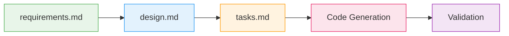
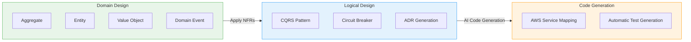
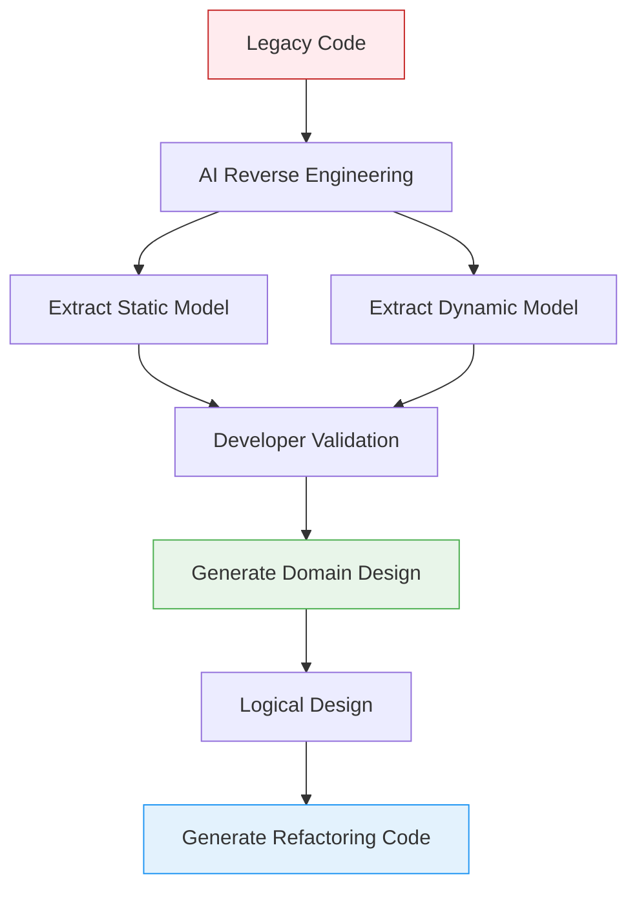

# DDD Integration — Essential Core in AI-Driven Development

> **Key Message**: In AIDLC, DDD is not optional but a built-in element of the methodology. AI automatically models business logic according to DDD principles, and teams validate and adjust.

---

## 1. Why DDD is an Essential Core of AIDLC

In traditional Scrum, DDD (Domain-Driven Design) was a **team choice**. If architects preferred DDD, they adopted it; otherwise, they proceeded with transaction scripts or layered architecture. The choice of design technique depended on team capability and preference.

In AIDLC, the situation is fundamentally different.

```
Traditional SDLC                          AIDLC
━━━━━━━━━━━━━━                      ━━━━━━━━━━━━━━━━━━━
Design techniques are team choice          DDD/BDD/TDD built into methodology
Architects manually model                  AI models automatically, team validates
Design docs gradually drift from code      Spec → Code consistency auto-maintained
Domain knowledge exists only in heads      Formalized as ontology, understood by AI
```

### 1.1 Why is DDD Built-In

AI performs best with structured patterns. DDD provides clear vocabulary and rules for organizing business logic into **Aggregate, Entity, Value Object, Domain Event**. This acts as consistent guardrails when AI transforms requirements into code.

```
Unstructured requirements + AI = Arbitrary implementation (different style each time)
DDD patterns + AI = Predictable implementation (Aggregate-first, Event-driven)
```

### 1.2 Scrum vs AIDLC: DDD's Positional Change

| Aspect | Scrum + DDD (Optional) | AIDLC + DDD (Essential) |
|------|-------------------|-------------------|
| **Adoption** | Architect discretion | Built into methodology |
| **Modeling Lead** | Architect + Developers | AI draft → Team validation |
| **Maintenance** | Manual doc synchronization | Automatic Spec file reflection |
| **Learning Curve** | High (Red/Blue Book) | Low (AI applies patterns) |
| **Application Scope** | Core domain only | Consistent across all Units |

---

## 2. Inception Phase: From Requirements to Design

DDD integration begins in the **Inception phase**. The core ritual of this phase is **Mob Elaboration**, where AI automatically models requirements into DDD patterns and the team validates them.

### 2.1 Mob Elaboration Ritual

Mob Elaboration is a requirements refinement session where Product Owner, developers, and QA gather in one room to collaborate with AI.

```
┌──────────────────────────────────────────────────┐
│              Mob Elaboration Ritual                │
├──────────────────────────────────────────────────┤
│                                                   │
│  [AI] Proposes Intent decomposition into         │
│       User Stories + Units                        │
│    ↓                                              │
│  [PO + Dev + QA] Review · Adjust over/under-     │
│                  design                           │
│    ↓                                              │
│  [AI] Reflects modifications → Generates          │
│       additional NFRs · Risks                     │
│    ↓                                              │
│  [Team] Final validation → Confirm Bolt plan      │
│                                                   │
├──────────────────────────────────────────────────┤
│  Deliverables:                                    │
│  PRFAQ · User Stories · NFR definitions           │
│  Risk Register · Metrics · Bolt plan              │
└──────────────────────────────────────────────────┘
```

**Time Compression Effect**: Sequential requirements analysis that took **weeks to months** in traditional methodologies is compressed to **hours** as AI generates drafts and teams review simultaneously.

### 2.2 Kiro Spec-Driven Inception

Kiro systematizes Mob Elaboration deliverables as **Spec files**. It structures the entire process from natural language requirements to code.



#### 2.2.1 Payment Service Example

**requirements.md**:

```markdown
# Payment Service Deployment Requirements

## Functional Requirements
- REST API endpoint: /api/v1/payments
- Integration with DynamoDB table
- Asynchronous event processing via SQS

## Non-Functional Requirements
- P99 latency: < 200ms
- Availability: 99.95%
- Auto-scaling: 2-20 Pods
- EKS 1.35+ compatibility
```

**design.md**:

```markdown
# Payment Service Architecture

## Domain Model (DDD)
- Aggregate: Payment (transactionId, amount, status)
- Entity: PaymentMethod, Customer
- Value Object: Money, Currency
- Domain Event: PaymentCreated, PaymentCompleted, PaymentFailed

## Infrastructure Configuration
- EKS Deployment (3 replicas min)
- ACK DynamoDB Table (on-demand)
- ACK SQS Queue (FIFO)
- HPA (CPU 70%, Memory 80%)
- Karpenter NodePool (graviton, spot)

## Observability
- ADOT sidecar (traces → X-Ray)
- Application Signals (automatic SLI/SLO)
- CloudWatch Logs (/eks/payment-service)

## Security
- Pod Identity (IRSA replacement)
- NetworkPolicy (namespace isolation)
- Secrets Manager CSI Driver
```

**tasks.md**:

```markdown
# Implementation Tasks

## Bolt 1: Domain Model
- [ ] Implement Payment Aggregate
- [ ] Define Value Objects (Money, Currency)
- [ ] Define Domain Events
- [ ] Define Repository interface

## Bolt 2: Infrastructure
- [ ] Write ACK DynamoDB Table CRD
- [ ] Write ACK SQS Queue CRD
- [ ] Configure Karpenter NodePool

## Bolt 3: Application
- [ ] Implement Go REST API
- [ ] Implement DynamoDB Repository
- [ ] Implement SQS Event Publisher
- [ ] Dockerfile + multi-stage build

## Bolt 4: Deployment & Observability
- [ ] Write Helm chart
- [ ] Configure ADOT sidecar
- [ ] Application Signals annotation
```

:::tip Core Value of Spec-Driven
**Directive Approach**: "Create DynamoDB" → "Need SQS too" → "Now deploy" → Manual instructions each time, risk of context loss

**Spec-Driven**: Kiro analyzes requirements.md → generates design.md → decomposes tasks.md → auto-generates code → connects validation with consistent Context Memory
:::

### 2.3 MCP-Based Real-Time Context Collection

Kiro is MCP native, collecting real-time infrastructure state through AWS Hosted MCP servers during the Inception phase.

```
[Kiro + MCP Interaction]

Kiro: "Check EKS cluster status"
  → EKS MCP Server: get_cluster_status()
  → Response: { version: "1.35", nodes: 5, status: "ACTIVE" }

Kiro: "Analyze costs"
  → Cost Analysis MCP Server: analyze_cost(service="EKS")
  → Response: { monthly: "$450", recommendations: [...] }

Kiro: "Analyze current workloads"
  → EKS MCP Server: list_deployments(namespace="payment")
  → Response: { deployments: [...], resource_usage: {...} }
```

This enables **design reflecting current cluster state and costs** when generating design.md.

---

## 3. Construction Phase: DDD Pattern Implementation

In the Construction phase, AI transforms domain models defined in Inception into **actual code**. During this process, DDD patterns are mapped to AWS services and Kubernetes resources.

### 3.1 From Domain Design to Logical Design



#### 3.1.1 Payment Service Implementation Steps

**Step 1: Domain Design** — AI models business logic

```go
// Aggregate
type Payment struct {
    TransactionID string
    Amount        Money
    Status        PaymentStatus
    Customer      Customer
    Method        PaymentMethod
    Events        []DomainEvent
}

// Value Object
type Money struct {
    Amount   decimal.Decimal
    Currency Currency
}

// Domain Event
type PaymentCreated struct {
    TransactionID string
    Timestamp     time.Time
}
```

**Step 2: Logical Design** — Apply NFRs + Select architecture patterns

- **CQRS Pattern**: Separate payment creation (Command) / lookup (Query)
  - Command: POST /api/v1/payments → DynamoDB write + SQS publish
  - Query: GET /api/v1/payments/\{id\} → DynamoDB Streams → ElastiCache read
- **Circuit Breaker**: Envoy sidecar + Istio for external payment gateway calls
- **ADR (Architecture Decision Record)**: Record "DynamoDB on-demand vs provisioned" decision

**Step 3: Code Generation** — AWS service mapping

| DDD Element | AWS/Kubernetes Mapping |
|---------|-------------------|
| **Aggregate (Payment)** | EKS Deployment + DynamoDB Table |
| **Domain Event** | SQS FIFO Queue |
| **Repository** | DynamoDB SDK with ACK CRDs |
| **Circuit Breaker** | Envoy sidecar (Istio) |
| **Event Publisher** | SQS SDK with retry logic |

### 3.2 Detailed AWS Service Mapping

#### 3.2.1 DynamoDB Table (Aggregate Persistence)

AI analyzes Aggregate definitions in design.md to auto-generate ACK CRDs.

```yaml
apiVersion: dynamodb.services.k8s.aws/v1alpha1
kind: Table
metadata:
  name: payment-table
spec:
  tableName: payment-service
  attributeDefinitions:
    - attributeName: transactionId
      attributeType: S
  keySchema:
    - attributeName: transactionId
      keyType: HASH
  billingMode: PAY_PER_REQUEST  # Decided in ADR
  tags:
    - key: DomainAggregate
      value: Payment
```

#### 3.2.2 SQS Queue (Domain Event Publishing)

```yaml
apiVersion: sqs.services.k8s.aws/v1alpha1
kind: Queue
metadata:
  name: payment-events
spec:
  queueName: payment-service-events.fifo
  fifoQueue: true
  contentBasedDeduplication: true
  tags:
    DomainEvent: PaymentCreated,PaymentCompleted,PaymentFailed
```

#### 3.2.3 Repository Implementation

AI implements DDD Repository pattern with DynamoDB SDK.

```go
type PaymentRepository interface {
    Save(ctx context.Context, payment *Payment) error
    FindByID(ctx context.Context, id string) (*Payment, error)
}

type DynamoDBPaymentRepository struct {
    client *dynamodb.Client
}

func (r *DynamoDBPaymentRepository) Save(ctx context.Context, p *Payment) error {
    item, _ := attributevalue.MarshalMap(p)
    _, err := r.client.PutItem(ctx, &dynamodb.PutItemInput{
        TableName: aws.String("payment-service"),
        Item:      item,
    })
    
    // Publish Domain Events
    for _, event := range p.Events {
        publishToSQS(event)
    }
    
    return err
}
```

### 3.3 NFR Application: CQRS, Circuit Breaker, ADR

#### 3.3.1 CQRS Pattern

AI analyzes NFR (P99 < 200ms) to propose Command/Query separation.

```
Command Side (Write):
  POST /api/v1/payments
    → Aggregate.CreatePayment()
    → DynamoDB.PutItem()
    → SQS.SendMessage(PaymentCreated)

Query Side (Read):
  GET /api/v1/payments/\{id\}
    → ElastiCache.Get(id)  # DynamoDB Streams → Cache
    → Fallback: DynamoDB.GetItem()
```

#### 3.3.2 Circuit Breaker (External Gateway)

Auto-configures Istio Circuit Breaker for failure isolation when calling payment gateway.

```yaml
apiVersion: networking.istio.io/v1beta1
kind: DestinationRule
metadata:
  name: payment-gateway-circuit-breaker
spec:
  host: external-payment-gateway.com
  trafficPolicy:
    outlierDetection:
      consecutiveErrors: 5
      interval: 30s
      baseEjectionTime: 60s
```

#### 3.3.3 Automatic ADR Generation

AI records architecture decisions in ADR format when writing design.md.

```markdown
# ADR-001: Choosing DynamoDB On-Demand

## Context
Payment Service has irregular and unpredictable traffic patterns.

## Decision
Choose On-Demand instead of Provisioned Capacity.

## Consequences
- Cost: 15% more expensive than predictable traffic
- Advantage: Automatic spike traffic handling, no scaling operations
- Disadvantage: Cost optimization limitations
```

---

## 4. Mob Construction Ritual

The core ritual of Construction is **Mob Construction**. Teams gather in one room to develop their respective Units, exchanging Integration Specifications generated during the Domain Design stage.

```
[Mob Construction Flow]

Team A: Payment Unit        Team B: Notification Unit
  │                            │
  ├─ Domain Design complete    ├─ Domain Design complete
  │                            │
  └────── Exchange Integration Spec ──────┘
          (Domain Event contract)
  │                            │
  ├─ Logical Design            ├─ Logical Design
  ├─ Code generation           ├─ Code generation
  ├─ Testing                   ├─ Testing
  └─ Bolt delivery             └─ Bolt delivery
```

### 4.1 Domain Event-Based Integration

Each Unit is loosely coupled enabling **parallel development**, integrated through Domain Events.

**Integration Specification**:

```yaml
# payment-unit-events.yaml
events:
  - name: PaymentCompleted
    schema:
      transactionId: string
      amount: decimal
      currency: string
      timestamp: ISO8601
    consumers:
      - notification-unit  # Subscribed by Notification team
      - analytics-unit     # Subscribed by Analytics team
```

AI auto-generates integration tests based on this spec.

```go
func TestPaymentNotificationIntegration(t *testing.T) {
    // Payment Unit publishes PaymentCompleted event
    payment := CreatePayment(amount)
    payment.Complete()
    
    // Verify event received from SQS
    event := sqsClient.ReceiveMessage("payment-events.fifo")
    assert.Equal(t, "PaymentCompleted", event.Type)
    
    // Verify Notification Unit sent email
    notification := notificationClient.GetLastNotification()
    assert.Contains(t, notification.Body, payment.TransactionID)
}
```

### 4.2 AI Extension of Pair Programming

Mob Construction is traditional Pair Programming extended with AI.

| Aspect | Pair Programming | Mob Construction (AI) |
|------|-----------------|----------------------|
| **Participants** | 2 (Driver + Navigator) | N people + AI Agent |
| **Roles** | 1 codes, 1 reviews | N people validate, AI codes |
| **Speed** | 1x (human speed) | 10-50x (AI speed) |
| **Parallelism** | Sequential work | Multiple Units parallel |
| **Knowledge Transfer** | Only 2 learn | Entire team learns simultaneously |

---

## 5. Brownfield (Existing System) Approach

When adding features or refactoring existing systems, the Construction phase requires **additional steps**.

:::warning Brownfield Strategy: Optimize First
Prioritize **optimizing existing systems** over building new. AI reverse-engineers legacy code into DDD models for gradual refactoring.
:::

### 5.1 Reverse Engineering Process



**Step 1: AI reverse-engineers existing code into semantic model** (promote code → model)

- **Static Model**: Components, responsibilities, relationships
  ```
  [PaymentController] → [PaymentService] → [PaymentDAO]
  - PaymentService responsibilities: Business logic + Transaction management
  - PaymentDAO responsibilities: Data access
  ```

- **Dynamic Model**: Component interactions in major use cases
  ```
  Payment Creation Flow:
  Controller.createPayment() 
    → Service.processPayment()
    → DAO.insertPayment()
    → DAO.insertPaymentEvent()
  ```

**Step 2: Developers validate and modify reverse-engineered model**

Verify that AI-extracted model accurately reflects actual business intent.

**Step 3: Proceed with same Construction flow as Green-field**

Redesign reverse-engineered model into DDD Aggregate/Entity/Value Object, AI generates refactoring code.

### 5.2 Gradual Refactoring Strategy

Don't refactor entire system at once, perform **gradual transition in Bolt units**.

```
Bolt 1: Extract Payment Aggregate
  - Before: PaymentService (God Object 900 lines)
  - After: Payment Aggregate + PaymentRepository

Bolt 2: Introduce Domain Events
  - Before: Direct Notification call on payment completion
  - After: Publish PaymentCompleted event → SQS → Notification subscription

Bolt 3: CQRS Separation
  - Before: Read/write mixed in single Service
  - After: Separate PaymentCommandService / PaymentQueryService
```

---

## 6. Extension to Ontology: From DDD to Formal Ontology

> "Prompt engineering is ontology engineering" — 2026 AI Community Consensus

DDD's Ubiquitous Language is an **informal agreement** for team communication. In the AI era, this must be elevated to **formal ontology (typed world model)** so AI can mechanically understand and comply.

### 6.1 DDD vs Ontology

| Aspect | DDD (Ubiquitous Language) | Formal Ontology |
|------|--------------------------|-------------|
| **Definition** | Natural language agreement | Machine-interpretable schema |
| **Primary Target** | Humans (team communication) | AI + Humans |
| **Validation** | Manual during code review | Automatic (at prompt time) |
| **Evolution** | Documentation lag | Schema version control |
| **Example** | "Payments have created, completed, failed states" | `Payment.status: enum(CREATED, COMPLETED, FAILED)` |

### 6.2 Ontology Engineering Workflow

```
1. Define DDD model (requirements.md, design.md)
   ↓
2. AI generates ontology schema (JSON Schema/OWL)
   ↓
3. Ontology validation (team review)
   ↓
4. AI generates code based on ontology
   ↓
5. Runtime validation (ontology ↔ actual behavior match)
```

This process is covered in detail in the [Ontology Engineering](./ontology-engineering.md) document.

---

## 7. Quality Gates: DDD Pattern Validation

Automatically validate that AI-generated code in the Construction phase complies with DDD principles.

### 7.1 Harness Engineering Integration

Quality Gates defined in [Harness Engineering](./harness-engineering.md) validate DDD patterns.

```yaml
# quality-gates.yaml
gates:
  - name: DDD Pattern Compliance
    rules:
      - check: "Does Aggregate maintain single transaction boundary?"
        tool: static-analysis
      - check: "Are Domain Events named in past tense?"
        tool: naming-convention
      - check: "Do Value Objects ensure immutability?"
        tool: immutability-checker
      - check: "Does Repository only persist Aggregates?"
        tool: dependency-analysis
```

### 7.2 Automatic Validation Example

```go
// ❌ Anti-pattern: Aggregate directly references another Aggregate
type Order struct {
    OrderID  string
    Customer Customer  // ❌ Direct Customer Aggregate reference
}

// ✅ Best practice: Reference only by ID
type Order struct {
    OrderID    string
    CustomerID string  // ✅ Store only ID, retrieve via Repository when needed
}
```

AI automatically detects these patterns and generates modification suggestions.

---

## 8. AI Coding Agents: DDD Implementation Automation

AI coding agents used in AIDLC Construction phase automatically apply DDD patterns.

### 8.1 Kiro's DDD Automation

**Kiro** is an AI coding agent developed by AWS Labs that performs **Spec-Driven DDD implementation**.

```
Kiro Workflow:

1. Analyze requirements.md → Extract domain concepts
2. Generate design.md → Identify Aggregate/Entity/Value Object
3. Decompose tasks.md → Plan Bolt-unit implementation
4. Auto-generate code → Apply DDD patterns
5. Auto-generate tests → Validate domain logic
```

### 8.2 Amazon Q Developer's Real-Time Validation

**Amazon Q Developer** announced in February 2025 immediately validates DDD implementation through **real-time code execution**.

```
Traditional Approach:
  AI generates code → Developer manually builds → Discovers test failures → Repeat fixes

Q Developer:
  AI generates code → Auto-build → Auto-test → Immediate regeneration on failure
```

This is a core mechanism that activates AIDLC's **Loss Function** early in the Construction phase, preventing downstream error propagation.

Refer to the [AI Coding Agents](../toolchain/ai-coding-agents.md) document for detailed comparison.

---

## 9. DDD Application in MSA Environments

In complex Microservices Architecture (MSA) environments, DDD is core to setting service boundaries and integration strategies.

### 9.1 Bounded Context and Service Boundaries

DDD's **Bounded Context** naturally maps to MSA's **service boundaries**.

```
Payment Bounded Context → Payment Service
Notification Bounded Context → Notification Service
Analytics Bounded Context → Analytics Service
```

AI analyzes requirements.md to auto-identify Bounded Contexts, mapping each Context to independent EKS Deployments.

### 9.2 Context Mapping Patterns

Apply DDD Context Mapping patterns when multiple services interact.

| Pattern | Description | Implementation |
|------|------|------|
| **Customer-Supplier** | One team provides API to another | REST API + API Gateway |
| **Conformist** | Downstream team adopts upstream model as-is | Common Proto/Schema |
| **Anticorruption Layer** | Isolation from legacy systems | Adapter pattern |
| **Shared Kernel** | Share common domain model | Shared Library (minimize) |
| **Published Language** | Standard event format | CloudEvents + SQS |

Refer to the [MSA Complexity](../enterprise/msa-complexity/index.md) document for DDD application strategies in complex MSA environments.

---

## 10. Key Summary

### 10.1 Why is DDD an Essential Core of AIDLC

1. **AI performs best with structured patterns** — DDD provides clear vocabulary and rules
2. **Automatic Spec → Code transformation** — requirements.md → design.md → tasks.md → code
3. **Team validation is Loss Function** — AI draft → Team adjustment → AI improvement → Repeat
4. **Evolution to ontology** — Informal language → Formal schema → AI mechanical understanding

### 10.2 Core Rituals

- **Mob Elaboration** (Inception): Requirements → DDD model, weeks → hours compression
- **Mob Construction**: Parallel Unit development, Domain Event-based integration

### 10.3 Automation Scope

| Phase | AI Automation | Human Role |
|------|----------|----------|
| **Domain Design** | Aggregate/Entity/VO draft | Validate business accuracy |
| **Logical Design** | Apply CQRS/Circuit Breaker | Decide NFR priorities |
| **Code Generation** | Implement DDD patterns | Code review |
| **Test Generation** | Domain logic tests | Validate scenarios |
| **ADR Writing** | Record architecture decisions | Approve decisions |

---

## 11. Next Steps

- **[Ontology Engineering](./ontology-engineering.md)** — Extension from DDD to formal ontology
- **[Harness Engineering](./harness-engineering.md)** — Validate DDD patterns in Quality Gates
- **[AI Coding Agents](../toolchain/ai-coding-agents.md)** — Kiro, Q Developer details
- **[MSA Complexity](../enterprise/msa-complexity/index.md)** — DDD application in complex MSA

---

**📚 References**

- AWS Labs AI-DLC Research: [arxiv.org/abs/2501.03604](https://arxiv.org/abs/2501.03604)
- Eric Evans, "Domain-Driven Design" (2003)
- Vaughn Vernon, "Implementing Domain-Driven Design" (2013)
- Chris Richardson, "Microservices Patterns" (2018)
