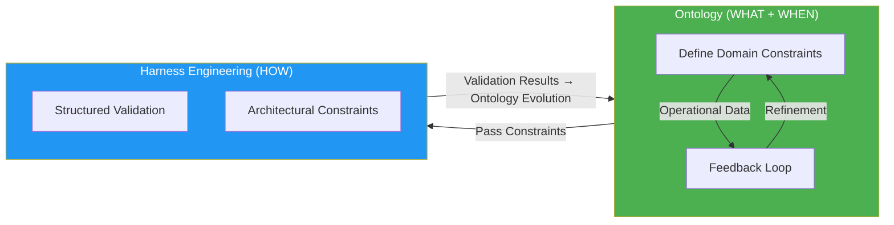
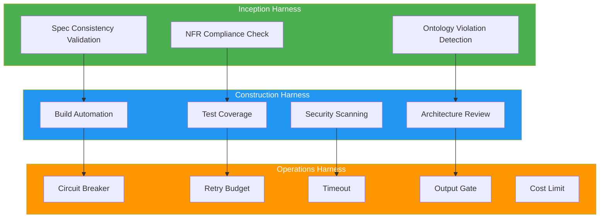
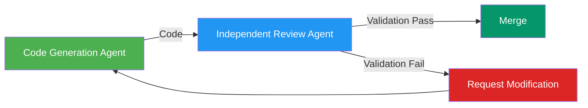

import { QualityGates } from '@site/src/components/AidlcTables';

# Harness Engineering

> "Agents aren't hard, harnesses are" — NxCode, 2026

## Overview

**Harness Engineering** is the second axis of AIDLC's reliability dual axes, a structure that **architecturally validates and enforces** constraints defined by ontology. The key lesson of AI development in 2026 is:

> When OpenAI Codex generated 1 million lines of code, human engineers wrote 0 lines. The engineer's role has shifted from **writing code to designing harnesses**.



**Role of Harness:**
- Architecturally validate constraints defined by ontology
- Design retry budgets, timeouts, output gates, circuit breakers
- Ensure independent validation (code generation agent ≠ validation agent)
- Feed validation results back to ontology evolution

---

## Harness vs Guardrails

Many teams use "guardrails" and "harness" interchangeably, but they are **fundamentally different in scope and timing**.

| Aspect | Guardrails | Harness |
|------|---------------------|----------------|
| **Scope** | Runtime input/output filtering | Entire architecture design |
| **Role** | PII masking, prompt injection defense | Retry budgets, timeouts, output gates, circuit breakers |
| **Timing** | During execution | From design time |
| **Failure Mode** | Block individual requests | Protect entire system |
| **Examples** | Bedrock Guardrails, NeMo Guardrails | AIDLC Quality Gates, Independent validation agents |

**Key Difference:**
- **Guardrails** are "filters that block bad inputs" — e.g., prompt injection detection, PII masking
- **Harness** is "architecture that constrains AI to operate safely" — e.g., preventing 847 retries, blocking cost runaway

---

## Fintech Runaway Case: AI Failure Without Harness

:::danger Real Case: $2,200 Loss Incident

A fintech startup's AI agent executed **847 API retries in a single loop**, resulting in:
- **$2,200 in LLM API costs**
- **14 incomplete emails** sent to customers
- **3 hours of service outage** (manual intervention required)

**Root Cause Analysis:**
- ❌ Not a model problem (used GPT-4)
- ❌ Not a prompt problem (prompts were clear)
- ✅ **Architectural failure** — Absence of harness

**Missing Harness Patterns:**
1. No retry budget (unlimited retries)
2. No timeout (loop could run infinitely)
3. No output gate (failed to block incomplete emails)
4. No circuit breaker (continued attempting after 847 failures)
5. No cost limit (no alerts until $2,200 charge)

:::

**Lesson:** Most AI system failures stem not from models or prompts but from **absence of architectural design**.

---

## Harness Patterns Across AIDLC 3 Phases

| Phase | Harness Type | Validation Target | Implementation Method |
|------|-----------|----------|----------|
| **Inception** | Spec validation harness | Requirements completeness, conflicts, NFR compliance | Ontology-based automatic Spec consistency validation |
| **Construction** | Build/test harness | Code accuracy, security, architecture compliance | Independent agent review + ontology violation detection |
| **Operations** | Runtime harness | AI Agent behavior constraints, cost limits | Circuit breakers, retry budgets, output gates |



---

## Harness Pattern Catalog

### 1. Circuit Breaker

**Purpose:** Block additional attempts on repeated failures to protect entire system

**Pattern:**
```yaml
circuit_breaker:
  failure_threshold: 5        # Open after 5 failures
  timeout: 60s               # Half-Open after 60 seconds
  success_threshold: 2       # Closed after 2 successes
```

**Application Cases:**
- LLM API calls (Bedrock, OpenAI)
- External service integration (payment, email)
- Agent-to-agent communication (multi-agent systems)

---

### 2. Retry Budget

**Purpose:** Prevent unlimited retries, control overall costs

**Pattern:**
```yaml
retry_budget:
  max_attempts: 3            # Maximum 3 retries
  backoff: exponential       # Exponential backoff
  max_backoff: 30s          # Maximum 30 second wait
  budget_limit: 10          # Allow 10 retries per hour
```

**Fintech Runaway Prevention:**
- ✅ 847 retries → Limited to 3
- ✅ Immediate retries → Exponential backoff (1s, 2s, 4s)
- ✅ $2,200 cost → Maximum $50 limit

---

### 3. Timeout

**Purpose:** Prevent infinite loops, ensure response time

**Pattern:**
```yaml
timeout:
  request: 30s              # Single request timeout
  total: 300s               # Total operation timeout
  idle: 60s                 # Idle timeout on no response
```

**Application Cases:**
- LLM inference (abort after 30 seconds)
- Code generation (5 minute total limit)
- Test execution (terminate after 1 minute idle)

---

### 4. Output Gate

**Purpose:** Block incomplete or harmful outputs

**Pattern:**
```yaml
output_gate:
  validators:
    - syntax_check          # Code syntax validation
    - schema_validation     # JSON schema validation
    - pii_detection        # PII detection and masking
    - toxicity_filter      # Harmful content filtering
  action_on_failure: reject # Reject output on failure
```

**Fintech Runaway Prevention:**
- ✅ 14 incomplete emails → Blocked at output gate
- ✅ Prevent PII exposure
- ✅ Filter harmful content

---

### 5. PII Masking

**Purpose:** Protect sensitive information (both input and output)

**Pattern:**
```yaml
pii_masking:
  patterns:
    - email: "***@***.***"
    - ssn: "***-**-****"
    - credit_card: "****-****-****-****"
  redact_in_logs: true      # Mask in logs as well
```

---

### 6. Prompt Injection Defense

**Purpose:** Block malicious prompts

**Pattern:**
```yaml
prompt_injection_defense:
  techniques:
    - instruction_hierarchy  # System prompt priority
    - delimiter_isolation    # Isolate user input with delimiters
    - output_validation     # Output schema validation
```

---

### 7. Cost Limit

**Purpose:** Prevent LLM API cost runaway

**Pattern:**
```yaml
cost_limit:
  per_request: 0.50         # $0.50 limit per request
  per_hour: 10.00          # $10 limit per hour
  per_day: 100.00          # $100 daily limit
  alert_threshold: 0.80    # Alert at 80% threshold
```

---

## Quality Gates — End-to-End Quality Assurance

Human validation in AI-DLC is a **Loss Function** — it catches errors early at each stage to prevent downstream propagation. Quality Gates systematize this Loss Function.

```
Inception          Construction          Operations
    │                   │                    │
    ▼                   ▼                    ▼
[Mob Elaboration    [DDD Model         [Pre-deployment
 Output Validation]  Validation]        Validation]
    │                   │                    │
    ▼                   ▼                    ▼
[Spec Consistency]  [Code + Security   [SLO-based
                     Scanning]          Monitoring]
    │                   │                    │
    ▼                   ▼                    ▼
[NFR Compliance]    [Test Coverage]    [AI Agent Response
                                        Validation]
```

<QualityGates />

---

## AI-Based PR Review Automation

Traditional code review relies on lint rules and static analysis, but **AI-based review validates architecture patterns, security best practices, and business logic consistency**.

### Validation Items

**1. DDD Pattern Compliance**
- Detect Aggregate encapsulation violations
- Prevent direct Entity modifications
- Validate Value Object immutability

**Example:**
```go
// ❌ Violation: Direct Entity modification outside Aggregate
func UpdateUserEmail(userID string, email string) error {
    user, _ := userRepo.FindByID(userID)
    user.Email = email  // ❌ Direct Entity modification
    return userRepo.Save(user)
}

// ✅ Recommended: Modification through Aggregate method
func UpdateUserEmail(userID string, email string) error {
    user, _ := userRepo.FindByID(userID)
    return user.ChangeEmail(email)  // ✅ Use Aggregate method
}
```

**2. Microservice Communication**
- Synchronous calls: Use gRPC
- Asynchronous events: Use SQS/SNS
- External APIs: HTTP REST (OpenAPI spec required)

**3. Observability**
- OpenTelemetry instrumentation in all handlers
- Expose business metrics as Prometheus custom metrics
- Structured logging (JSON format, include contextual fields)

**4. Security**
- Authentication: JWT (prohibit HS256, use RS256)
- Sensitive information: Retrieve from AWS Secrets Manager
- SQL queries: Use Prepared Statements (prohibit string concatenation)

---

## Independent Validation Principle

:::caution The Same Agent's Test Trap

"Tests written by the same AI agent cannot catch that agent's errors" — This is like AI grading its own homework.

**Symptoms:**
- Tests pass ✅
- CI is green ✅
- PR merge complete ✅
- **3 days later, feature half-working** ❌

**Cause:**
- Tests optimized for 'completion' not 'accuracy'
- Code generation agent and test generation agent are identical
- Share the same bias

:::

**Solution: Independent Validation Harness**



**Implementation Principles:**
1. **Use different agents** — Code generation ≠ Test generation
2. **Use different models** — GPT-4 generation → Claude validation
3. **Human validation** — Humans give final approval for core logic

---

## Harness Design Checklist

Harness pattern checklist for AIDLC 3 phases:

### Inception Harness
- [ ] Automatic Spec consistency validation
- [ ] NFR compliance check
- [ ] Ontology violation detection
- [ ] Requirements conflict inspection

### Construction Harness
- [ ] Build automation (CI/CD)
- [ ] Test coverage 80%+ 
- [ ] Security scanning (SAST, SCA)
- [ ] Architecture pattern validation
- [ ] Independent agent review
- [ ] Quality Gates pass

### Operations Harness
- [ ] Circuit breaker implementation
- [ ] Retry budget configuration
- [ ] Timeout definition
- [ ] Output gate activation
- [ ] PII masking
- [ ] Prompt injection defense
- [ ] Cost limit configuration
- [ ] SLO-based alerting

---

## References

- **[Ontology Engineering](./ontology-engineering.md)** — Definition of constraints validated by harness (WHAT axis)
- **[Role Redefinition](../enterprise/role-composition.md)** — Harness engineer role
- **[Cost Effectiveness](../enterprise/cost-estimation.md)** — Harness ROI calculation
- **[MSA Complexity](../enterprise/msa-complexity.md)** — Harness patterns by MSA

### External References
- [Harness Engineering: Governing AI Agents through Architectural Rigor](https://harness-engineering.ai/blog/harness-engineering-governing-ai-agents-through-architectural-rigor/) — Kai Renner, 2026.03
- [Harness Engineering Complete Guide](https://www.nxcode.io/resources/news/harness-engineering-complete-guide-ai-agent-codex-2026) — NxCode, 2026.03
- [Specwright: Closes the Loop](https://obsidian-owl.github.io/engineering-blog/posts/specwright-spec-driven-development-that-closes-the-loop/) — Obsidian Owl, 2026.02
- [EleutherAI LM Evaluation Harness](https://github.com/EleutherAI/lm-evaluation-harness) — GitHub 11.7k+ stars
