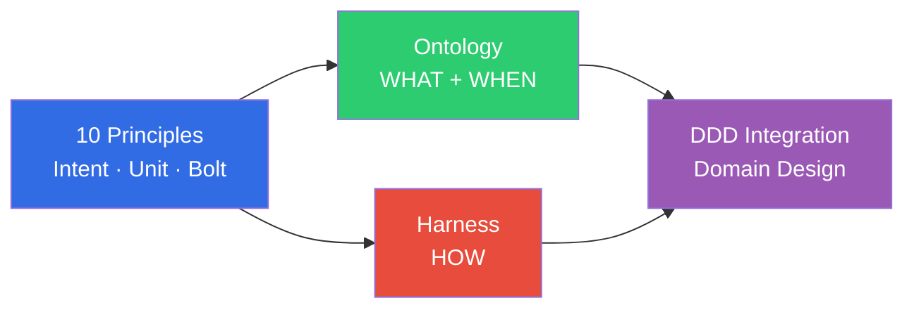

# AIDLC Methodology

> **Reading time**: Approximately 2 minutes

The AIDLC methodology provides the **theoretical foundation** for AI-driven development. While traditional SDLC was designed around human-centric long iteration cycles, AIDLC reconstructs AI from **First Principles** and integrates it as a core collaborator in the development lifecycle.

## Structure

The methodology track consists of 4 core documents. Reading them in order will help you understand the entire theoretical framework of AIDLC.

| Order | Document | Core Question |
|------|------|----------|
| 1 | [10 Principles and Execution Model](./principles-and-model.md) | What is AIDLC and how does it work? |
| 2 | [Ontology Engineering](./ontology-engineering.md) | How do we ensure the **accuracy** of AI-generated code? |
| 3 | [Harness Engineering](./harness-engineering.md) | How do we architecturally enforce the **safety** of AI execution? |
| 4 | [DDD Integration](./ddd-integration.md) | How do we transform business domains into designs that AI can understand? |

## Relationship with Other Tracks

- **[Enterprise Adoption](/docs/aidlc/enterprise)**: Interprets the methodology's concepts (ontology, harness) as organizational transformation and cost effectiveness.
- **[Tools & Implementation](/docs/aidlc/toolchain)**: Covers concrete tools (Kiro, Q Developer, EKS) that realize the methodology.
- **[AgenticOps](/docs/aidlc/operations)**: Builds a circular structure where operational data feeds back into the ontology Outer Loop.
