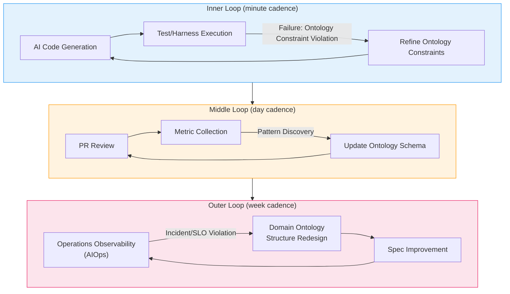
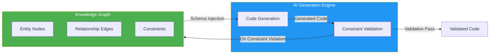
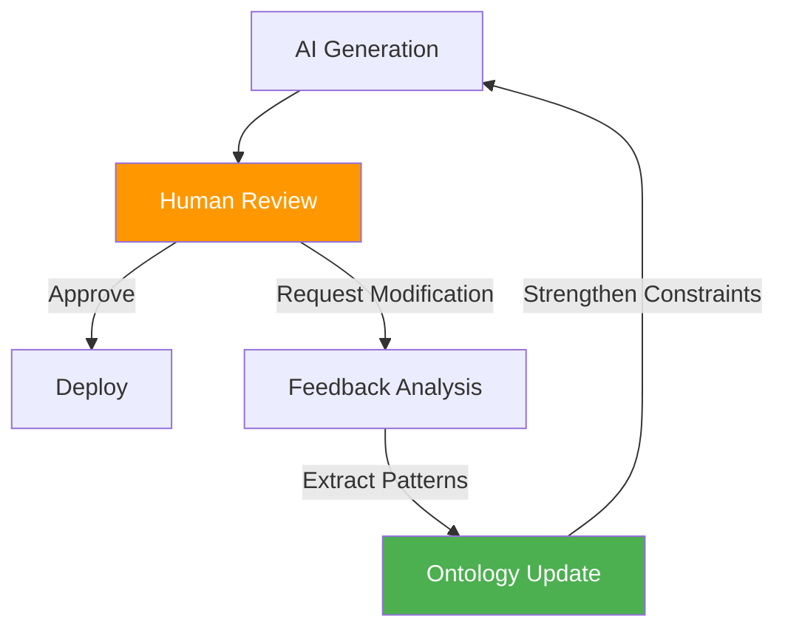
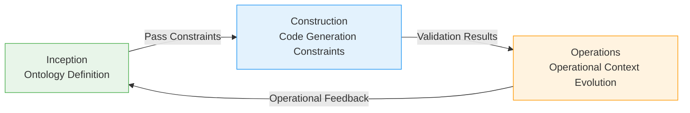
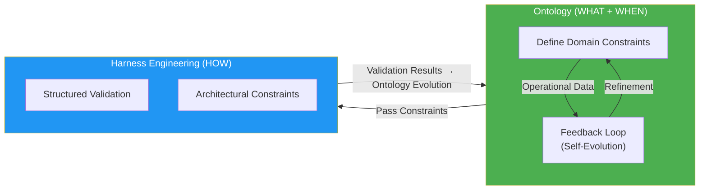

# Ontology Engineering

> "Prompt engineering is ontology engineering" — 2026 AI Community Consensus

**Ontology Engineering**, the first axis of AIDLC reliability, elevates DDD's Ubiquitous Language to a **formal schema (typed world model)** that AI can mechanically understand and comply with. This is a fundamental approach to block AI agent hallucination at the source and ensure domain accuracy.

## 1. What is Ontology

### 1.1 Ontology as a Typed World Model

**Ontology** is a "typed world model" that formalizes domain knowledge. While DDD's Ubiquitous Language was an informal agreement for team communication, ontology transforms it into a structured schema that AI can mechanically understand and comply with.

**Key Characteristics:**

- **Formality**: Entities, relationships, and constraints are explicitly defined
- **Type Safety**: All domain concepts are expressed through a type system
- **Verifiability**: Constraints can be automatically verified
- **Evolvability**: Continuously refined through operational data

### 1.2 Relationship with DDD Ubiquitous Language

| Aspect | Ubiquitous Language | Ontology |
|------|---------------------|----------|
| **Formality** | Informal agreement (natural language) | Formal schema (type definitions) |
| **Scope** | Team communication | AI agents + team + code |
| **Verification** | Manual review | Automatic constraint validation |
| **Evolution** | Document updates | Auto-refinement based on feedback loops |
| **AI Understanding** | Impossible (implicit context) | Possible (explicit structure) |

DDD's Aggregate, Entity, Value Object, Domain Event become the **basic building blocks** of ontology. The difference is that their relationships and constraints are expressed in machine-readable format.

## 2. Why is Ontology Needed

### 2.1 Root Cause of AI Agent Failures

The root cause of AI agent failures is not weak models or inaccurate prompts, but **the absence of semantic structure in the architecture**.

**Typical Failure Patterns:**

- **Context Loss**: When definitions of users, orders, tasks, rules are scattered in prompts, AI loses context
- **Hallucination Generation**: Without explicit constraints, AI generates "logically plausible" but incorrect reasoning
- **Lack of Consistency**: Definitions of the same concept vary across sessions, causing unpredictable behavior

### 2.2 Problems Solved by Ontology

**1. Preventing Hallucination**
- All domain concepts are explicitly defined, eliminating room for AI to interpret arbitrarily
- Relationships between entities are formalized, preventing creation of non-existent connections

**2. Ensuring Domain Accuracy**
- Invariants are encoded in ontology for automatic detection of violations
- Transition paths of domain events are specified, blocking incorrect state transitions

**3. Context Consistency**
- Ontology is injected into AI agent's context window, becoming the baseline for all generation tasks
- Ensures same domain understanding across sessions and agents

### 2.3 Real-World Evidence

:::info Quantitative Improvement Effects
When integrating HITL (Human-in-the-Loop) based ontology feedback loops:
- **31% improvement in accuracy**
- **67% reduction in False Positives**
- **Error rate 8.3% → 1.2%** (achieved in 31 days)

Without feedback loops: $28K cost with minimal improvement in error rate 8.3%→7.9%.
:::

## 3. Ontology Structure

### 3.1 Ontology Mapping of DDD Concepts

```yaml
domain_ontology:
  aggregates:
    Payment:
      description: "Transaction boundary for payment processing"
      invariants:
        - "amount must be greater than 0"
        - "status transition: CREATED → PROCESSING → COMPLETED | FAILED"
        - "Maximum 2 retries from FAILED state"
      entities:
        - PaymentMethod:
            type: "enum"
            values: ["CARD", "BANK", "WALLET"]
        - Customer:
            attributes:
              - customerId: "UUID"
              - tier: "enum[BASIC, PREMIUM, ENTERPRISE]"
      value_objects:
        - Money:
            currency: "ISO 4217"
            amount: "decimal(19,4)"
            invariants:
              - "amount >= 0"
              - "currency cannot be null"
      domain_events:
        - PaymentCreated:
            trigger: "Payment request received"
            data: ["paymentId", "amount", "customerId"]
            timestamp: "ISO 8601"
        - PaymentCompleted:
            trigger: "PG approval completed"
            data: ["paymentId", "pgTransactionId"]
        - PaymentFailed:
            trigger: "PG rejection or timeout"
            data: ["paymentId", "errorCode", "reason"]
  
  relationships:
    - "Payment CONTAINS PaymentMethod (1:1)"
    - "Customer INITIATES Payment (1:N)"
    - "Payment EMITS PaymentCreated (1:1)"
    - "Payment EMITS PaymentCompleted | PaymentFailed (1:1, mutually exclusive)"
  
  constraints:
    - "Maximum 3 concurrent payments per Customer"
    - "PROCESSING state maintained for max 30 seconds, auto-transition to FAILED if exceeded"
    - "PaymentMethod changes only allowed in CREATED state"
```

### 3.2 Knowledge Source Hierarchy

When building ontology, manage knowledge source reliability in tiers.

| Priority | Source | Example | Reliability | Usage Method |
|---------|------|------|--------|----------|
| **1** | Actual implementation code/PRs | awslabs/ai-on-eks, Helm chart source code | Highest | Based on actually working code |
| **2** | Project GitHub issues/releases | NVIDIA/KAI-Scheduler, ai-dynamo/dynamo | High | Fact exchange between developers |
| **3** | Official documentation | docs.nvidia.com, docs.aws.amazon.com | Medium | General theory, may have update delays |
| **4** | Blogs/tutorials | Medium, AWS Blog | Low | Snapshot at specific point in time |

:::caution Real-World Lesson: Official Documentation Alone is Insufficient
When building ontology, **referencing only Official Documentation causes AI to confuse "logically plausible reasoning" with "verified facts"**.

**Real Case:**
- **Problem**: AWS EKS Auto Mode official docs state "AWS manages GPU drivers" → AI extrapolates to "GPU Operator installation impossible" → Entire comparison tables, architectures, and recommendations become contaminated
- **Cause**: Didn't verify actual implementation repo ([awslabs/ai-on-eks PR #288](https://github.com/awslabs/ai-on-eks/pull/288)), only relied on general statements in official docs
- **Result**: False premise of "technical impossibility" propagated throughout docs, corrupting 12+ comparison tables and architecture recommendations

**Principle**: AI-generated technical documentation must always be **cross-validated with actual implementation code**. Official docs saying "cannot do" may mean "not yet documented".
:::

### 3.3 Rule Template Hierarchy

Ontology extends beyond simple schemas to **executable rules**.

```yaml
rule_templates:
  validation_rules:
    - rule_id: "PAYMENT_AMOUNT_POSITIVE"
      condition: "Payment.amount > 0"
      error_message: "Payment amount must be greater than 0"
      severity: "ERROR"
    
    - rule_id: "PAYMENT_STATUS_TRANSITION"
      condition: |
        IF current_status == "CREATED" THEN next_status IN ["PROCESSING", "FAILED"]
        ELIF current_status == "PROCESSING" THEN next_status IN ["COMPLETED", "FAILED"]
        ELSE invalid_transition
      error_message: "Invalid payment status transition"
      severity: "ERROR"
  
  business_rules:
    - rule_id: "MAX_CONCURRENT_PAYMENTS"
      condition: "COUNT(Payment WHERE customer_id = X AND status = 'PROCESSING') <= 3"
      error_message: "Maximum concurrent payments exceeded"
      severity: "WARNING"
      action: "QUEUE_PAYMENT"
```

These rule templates:
1. **During code generation**: Auto-converted to validation logic
2. **During test generation**: Auto-derived as boundary condition test cases
3. **During runtime**: Operate as guardrails

## 4. Triple Feedback Loop: Living Ontology

Ontology is not a static schema defined once and done. It's a **living model that continuously evolves through operational data and development experience**.

### 4.1 Feedback Loop Structure



### 4.2 Role of Each Loop

| Loop | Cadence | Trigger | Ontology Change | Example |
|------|------|--------|-------------|------|
| **Inner Loop** | Minute cadence | Test failure, harness violation | Add/modify constraints | Missing invariant found: add "amount > 0" constraint |
| **Middle Loop** | Day cadence | Repeated patterns in PR review | Update entity/relationship schema | Repeated error pattern → add new Value Object |
| **Outer Loop** | Week cadence | Operational incident, SLO violation | Redesign domain model structure | P99 latency increase → redefine Aggregate boundaries |

### 4.3 Inner Loop: Immediate Constraint Refinement

**Scenario**: AI-generated code fails tests

```python
# AI-generated code (1st attempt)
def create_payment(amount: float, customer_id: str):
    payment = Payment(
        amount=amount,  # Overlooked that amount can be negative
        customer_id=customer_id,
        status="CREATED"
    )
    return payment

# Test failure
def test_negative_amount():
    with pytest.raises(ValueError):
        create_payment(-100, "customer-123")
    # AssertionError: ValueError not raised

# Add ontology constraint
invariants:
  - "amount > 0"

# AI-regenerated code (2nd attempt)
def create_payment(amount: float, customer_id: str):
    if amount <= 0:
        raise ValueError("Payment amount must be greater than 0")
    payment = Payment(...)
    return payment
```

**Effect**: Constraints refined at minute cadence to prevent same error recurrence.

### 4.4 Middle Loop: Schema Structure Improvement

**Scenario**: Repeated pattern found in PR review

```markdown
## PR Review Metrics (7 days)
- "Currency mismatch" errors: 12 instances
- "Amount precision loss" errors: 8 instances
- Common pattern: Handling Money as float causing precision loss

## Ontology Update
value_objects:
  - Money:
      currency: "ISO 4217"
      amount: "decimal(19,4)"  # Changed from float → decimal
      invariants:
        - "amount >= 0"
        - "currency cannot be null"
```

**Effect**: Repeated error patterns reflected in ontology schema for structural prevention.

### 4.5 Outer Loop: Domain Model Redesign

**Scenario**: Operational incident — P99 latency SLO violation

```markdown
## Incident Analysis
- Cause: Payment Aggregate excessively bloated by including customer history
- Impact: Unnecessary data loading during payment lookup → DB query increase

## Ontology Redesign
# Before
aggregates:
  Payment:
    entities:
      - Customer (includes full history)

# After
aggregates:
  Payment:
    entities:
      - CustomerReference (ID reference only)
  
  CustomerProfile:  # Separated into distinct Aggregate
    entities:
      - PaymentHistory
```

**Effect**: Aggregate boundary redefinition reduces P99 latency by 42%.

## 5. SemanticForge Pattern: Knowledge Graph Integration

### 5.1 Knowledge Graph as Constraint Satisfaction Harness

When concretizing ontology as a Knowledge Graph, the **SemanticForge pattern** can be applied. The Knowledge Graph acts as a constraint satisfaction harness, blocking logical/structural hallucinations in AI-generated code at the source.



### 5.2 SemanticForge Application Example

**Knowledge Graph Structure:**

```cypher
// Entity definitions
CREATE (p:Aggregate {name: "Payment"})
CREATE (pm:Entity {name: "PaymentMethod", type: "enum"})
CREATE (m:ValueObject {name: "Money"})

// Relationship definitions
CREATE (p)-[:CONTAINS {cardinality: "1:1"}]->(pm)
CREATE (p)-[:USES {cardinality: "1:1"}]->(m)

// Constraints
CREATE (p)-[:INVARIANT {rule: "amount > 0"}]->(m)
CREATE (p)-[:INVARIANT {rule: "status transition: CREATED → PROCESSING → COMPLETED|FAILED"}]->(p)
```

**Validation During AI Generation:**

```python
# AI-generated code
payment.amount = -100  # Constraint violation

# SemanticForge queries Knowledge Graph for validation
query = """
MATCH (p:Aggregate {name: "Payment"})-[:INVARIANT]->(m:ValueObject {name: "Money"})
WHERE m.rule CONTAINS "amount > 0"
RETURN m.rule
"""
# Constraint violation detected → Request AI to regenerate
```

**Effect**: AI cannot generate code that violates constraints encoded in the Knowledge Graph.

### 5.3 References

- [SemanticForge: Hallucination Prevention via Knowledge Graph](https://arxiv.org/html/2511.07584v1)
- Presents concrete patterns for using Knowledge Graph as constraint satisfaction harness

## 6. HITL (Human-in-the-Loop) Integration

### 6.1 Strategic Role of HITL

Position HITL not as a transitional phase of autonomy but as a **strategic design element of ontology evolution**. Human feedback is the core signal for ontology refinement.



### 6.2 HITL Integration Effects

:::info Quantitative Evidence
- **31% improvement in accuracy**: Domain accuracy of AI-generated code
- **67% reduction in False Positives**: Decrease in unnecessary error alerts
- **Error rate 8.3% → 1.2%**: Achieved in 31 days

**Cost Comparison:**
- Without feedback loops: $28K cost, error rate 8.3%→7.9% (minimal improvement)
- With HITL-based feedback loops: Significant reduction in operational costs, 85% error reduction
:::

### 6.3 HITL Feedback Collection Points

| Stage | HITL Intervention Point | Ontology Improvement Direction |
|------|---------------|------------------|
| **Inception** | Mob Elaboration review | Refine domain constraint definitions |
| **Construction** | PR review | Update entity relationship schema |
| **Operations** | Incident postmortem | Redesign domain model structure |

### 6.4 References

- [Human-in-the-Loop in Agentic AI](https://atalupadhyay.wordpress.com/2026/03/16/human-in-the-loop-in-agentic-ai/) — 2026.03
- [How to Build an AI Agent Feedback Loop](https://www.braincuber.com/blog/how-to-build-feedback-loop-ai-agent-improvement) — Braincuber, 2026.03

## 7. Kiro Spec + Ontology Integration

### 7.1 Embedding Ontology in Spec

Include ontology directly in Kiro Spec's `requirements.md` so AI agents recognize domain constraints from the requirements analysis stage.

**requirements.md Example:**

```markdown
# Payment Service Deployment Requirements

## Functional Requirements
- REST API endpoint: /api/v1/payments
- Integration with DynamoDB table
- Asynchronous event processing via SQS

## Non-Functional Requirements
- P99 latency: < 200ms
- Availability: 99.95%
- Auto-scaling: 2-20 Pods

## Domain Ontology

### Aggregates
#### Payment
- **Invariants:**
  - amount must be greater than 0
  - status transition: CREATED → PROCESSING → COMPLETED | FAILED
  - Maximum 2 retries from FAILED state

- **Entities:**
  - PaymentMethod: enum[CARD, BANK, WALLET]
  - Customer: { customerId: UUID, tier: enum[BASIC, PREMIUM, ENTERPRISE] }

- **Value Objects:**
  - Money: { currency: ISO 4217, amount: decimal(19,4) }

- **Domain Events:**
  - PaymentCreated: { trigger: "Payment request received", data: [paymentId, amount, customerId] }
  - PaymentCompleted: { trigger: "PG approval completed", data: [paymentId, pgTransactionId] }
  - PaymentFailed: { trigger: "PG rejection or timeout", data: [paymentId, errorCode, reason] }

### Relationships
- Payment CONTAINS PaymentMethod (1:1)
- Customer INITIATES Payment (1:N)

### Constraints
- Maximum 3 concurrent payments per Customer
- PROCESSING state maintained for max 30 seconds, auto-transition to FAILED if exceeded
```

### 7.2 Ontology-Based Code Generation

Kiro AI agent injects this ontology into the context window to:

1. **During code generation**: Automatically comply with entity relationships and invariants
   ```go
   func CreatePayment(amount decimal.Decimal, customerID uuid.UUID) (*Payment, error) {
       if amount.LessThanOrEqual(decimal.Zero) {
           return nil, errors.New("Payment amount must be greater than 0")
       }
       // Ontology constraints automatically applied
   }
   ```

2. **During test generation**: Automatically derive boundary cases based on domain event transition paths
   ```go
   func TestPaymentStatusTransition(t *testing.T) {
       // Auto-generated based on ontology state transition rules
       t.Run("CREATED to PROCESSING", ...)
       t.Run("PROCESSING to COMPLETED", ...)
       t.Run("Invalid transition: COMPLETED to CREATED", ...)
   }
   ```

3. **During code review**: Automatically detect ontology violations
   ```markdown
   ## Ontology Violation Detection
   - ❌ Line 42: amount can be negative (invariant violation)
   - ❌ Line 58: Attempting COMPLETED → PROCESSING transition (incorrect state transition)
   ```

## 8. Ontology and Productivity: ROI Evidence

### 8.1 Error Rate Reduction Case

:::tip Real-World Data
**Before (without ontology):**
- Initial error rate: 8.3%
- Investment: $28K
- Error rate after 31 days: 7.9%
- Improvement: 0.4%p (minimal)

**After (with ontology + feedback loops):**
- Initial error rate: 8.3%
- Error rate after 31 days: 1.2%
- Improvement: 7.1%p (85% reduction)
- Additional effects: 67% False Positive reduction, 31% accuracy improvement
:::

### 8.2 Productivity Metrics

| Metric | Without Ontology | With Ontology | Improvement |
|------|---------------|-------------|--------|
| **PR Review Time** | Average 45 min | Average 18 min | 60% reduction |
| **Test Coverage** | 68% | 89% | 31%p increase |
| **Production Incidents** | 12/month | 2/month | 83% reduction |
| **Average Fix Time** | 2.3 days | 0.4 days | 83% reduction |

### 8.3 References

- [Why Ontology Matters for Agentic AI in 2026](https://kenhuangus.substack.com/p/why-ontology-matters-for-agentic) — Ken Huang & Bhavya Gupta
- [Why AI Agents Fail Without Ontologies](https://medium.com/@itznihal/why-ai-agents-fail-without-ontologies-production-lessons-beb9fe9c3af9) — Nihal Parmar, 2026.03

## 9. Ontology Application Across AIDLC 3 Phases

### 9.1 Inception: Domain Ontology Definition

**Activities:**
- Extract domain concepts through Mob Elaboration
- Define Aggregate, Entity, Value Object, Domain Event
- Specify constraints (invariants)
- Initial Knowledge Graph construction

**Deliverables:**
- Domain ontology section in `requirements.md`
- Knowledge Graph schema (Neo4j/RDF)

**Ontology Feedback:**
- Inner Loop: Immediate refinement within Mob Elaboration sessions
- Goal: Complete ontology draft through requirements refinement loop

### 9.2 Construction: Code Generation Constraints

**Activities:**
- Inject ontology into AI agent context
- Ontology-based code generation and test generation
- Automatically detect ontology violations during PR review

**Deliverables:**
- Code complying with ontology constraints
- Integration tests based on domain events
- PR review metrics (ontology violation count)

**Ontology Feedback:**
- Inner Loop: Add constraints on test failures
- Middle Loop: PR review pattern analysis → schema updates
- Goal: Reflect repeated error patterns in ontology for structural prevention

### 9.3 Operations: Operational Context Model Evolution

**Activities:**
- Use operational observability data as ontology feedback
- Redesign domain model through incident analysis
- Encode SLO violation patterns as constraints

**Deliverables:**
- Ontology updates based on operational data
- Incident postmortem → ontology redesign documents
- AIOps integration: Observability data → automatic ontology refinement

**Ontology Feedback:**
- Outer Loop: Weekly incident review → domain structure redesign
- Goal: Continuously reflect operational experience in ontology (AIOps → AIDLC)

### 9.4 Three-Phase Integration Effect



**Effects:**
- Ontology defined in Inception constrains code generation in Construction
- Patterns discovered in Construction refine ontology
- Incidents in Operations redesign ontology structure
- Ontology continuously evolves through circular feedback

## 10. Related Documents

### 10.1 AIDLC Reliability Dual Axes

Ontology handles **WHAT + WHEN** (domain constraint definition), while **HOW** (verification mechanism) is handled by [Harness Engineering](./harness-engineering.md). Collaboration between the two axes ensures reliability of AI-generated code.



### 10.2 Methodology Integration

- **[DDD Integration](./ddd-integration.md)**: Concrete methods for formalizing DDD concepts into ontology
- **[Harness Engineering](./harness-engineering.md)**: Methods for architecturally validating constraints defined by ontology

### 10.3 Enterprise Application

- **[Cost Effectiveness](../enterprise/cost-estimation.md)**: ROI analysis of ontology investment
- **[Adoption Strategy](../enterprise/adoption-strategy.md)**: Strategy for gradually introducing ontology-based development to existing organizations

### 10.4 Operations Integration

- **[Autonomous Response](../operations/autonomous-response.md)**: AIOps integration automating Outer Loop operational feedback

## References

### Core Papers and Articles

1. [Why Ontology Matters for Agentic AI in 2026](https://kenhuangus.substack.com/p/why-ontology-matters-for-agentic) — Ken Huang & Bhavya Gupta
2. [Why AI Agents Fail Without Ontologies](https://medium.com/@itznihal/why-ai-agents-fail-without-ontologies-production-lessons-beb9fe9c3af9) — Nihal Parmar, 2026.03
3. [SemanticForge: Hallucination Prevention via Knowledge Graph](https://arxiv.org/html/2511.07584v1)
4. [How to Build an AI Agent Feedback Loop](https://www.braincuber.com/blog/how-to-build-feedback-loop-ai-agent-improvement) — Braincuber, 2026.03
5. [Human-in-the-Loop in Agentic AI](https://atalupadhyay.wordpress.com/2026/03/16/human-in-the-loop-in-agentic-ai/) — 2026.03

### Related Frameworks

- **Kiro**: MCP native AI coding agent, supports ontology-based code generation
- **Neo4j**: Knowledge Graph construction and constraint validation
- **SemanticForge**: Hallucination prevention pattern via Knowledge Graph
