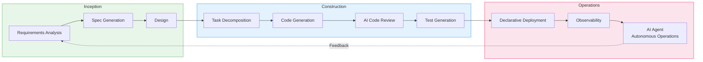
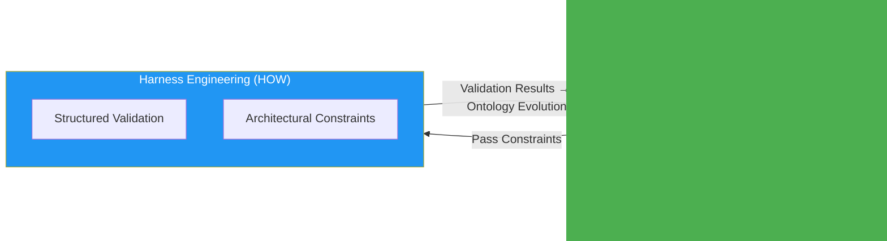

import { AidlcPrinciples, AidlcArtifacts, AidlcPhaseMapping, AidlcPhaseActivities } from '@site/src/components/AidlcTables';

# AIDLC 10 Principles and Execution Model

> 📅 **Created**: 2026-04-07 | ⏱️ **Reading time**: Approximately 15 minutes

---

## 1. Why AIDLC

Traditional Software Development Life Cycle (SDLC) was designed around human-centric long iteration cycles (weekly/monthly cadence). Rituals like daily standups, sprint reviews, and retrospectives are optimized for these long cycles. The emergence of AI disrupts this premise.

AI performs requirements analysis, task decomposition, code generation, and testing at **hour/day cadence**. Retrofitting AI into existing SDLC limits this potential — like building faster carriages in the automobile era.

**AIDLC (AI-Driven Development Lifecycle)** is a methodology proposed by AWS Labs that reconstructs AI from **First Principles** and integrates it as a core collaborator in the development lifecycle.

### 1.1 SDLC vs AIDLC Comparison

```
Traditional SDLC                      AIDLC
━━━━━━━━━━━━━━                      ━━━━━━━━━━━━━━━━━━━
Humans plan and execute                AI proposes, humans validate
Weekly/monthly iterations (Sprint)     Hour/day iterations (Bolt)
Design techniques are team choice      DDD/BDD/TDD built into methodology
Role silos (FE/BE/DevOps)            AI transcends role boundaries
Manual requirements analysis          AI decomposes Intent into Units
Sequential handoffs                   Continuous flow + Loss Function validation
```

### 1.2 Core Shift: Reversing the Conversation Direction

In traditional development, humans command computers ("implement this feature"). In AIDLC, **AI proposes plans first** and humans validate them. This is not a simple role swap, but a structure that **optimally combines AI's exploration capability and human judgment**.

The Google Maps analogy is appropriate. The driver sets the destination (Intent), AI proposes a route, and the driver validates and adjusts the route as needed. AI analyzes real-time traffic conditions (codebase, technical debt, dependencies) to find the optimal route, while the driver applies business context (priorities, risk tolerance) to make final decisions.

:::info Reference Source
Core concepts of AIDLC are defined in AWS Labs' [AI-DLC Method Definition](https://prod.d13rzhkk8cj2z0.amplifyapp.com/). This document organizes the philosophy and execution model of that methodology as a conceptual guide.
:::

---

## 2. AIDLC 10 Principles

<AidlcPrinciples />

### 2.1 Deep Dive into Core 3 Principles

#### 1. Reverse the Conversation Direction

**Traditional Approach:**
```
Developer: "Add API endpoint /users"
AI: "Done"
Developer: "No, it needs authentication"
AI: "Modified"
```

**AIDLC Approach:**
```
Developer: "I need user management functionality" (Intent)
AI: "Analysis shows 3 Units are needed:
     1. User Authentication Service (OAuth2 + JWT)
     2. User CRUD API (REST + GraphQL)
     3. User Profile Storage (DynamoDB)
     I propose Domain Design and Logical Design for each Unit..."
Developer: "Remove GraphQL, change to RDS"
AI: "Generating revised plan..."
```

AI proposes the **entire architecture** before generating code, and developers validate it by reflecting business context. This is **collaboration at the design level**, not the code level.

#### 2. Integration of Design Techniques

In Scrum, DDD/BDD/TDD were "optional choices for teams." AIDLC embeds them as **essential cores of the methodology**.

- **DDD (Domain-Driven Design)** — AI automatically models business logic into Aggregate, Entity, Value Object. Combined with [Ontology Engineering](./ontology-engineering.md) to structure domain knowledge.
- **BDD (Behavior-Driven Development)** — AI generates Given-When-Then scenarios to clarify business behaviors.
- **TDD (Test-Driven Development)** — AI writes tests first, then generates minimal code to pass tests.

These are not choices but **standard workflows for AI code generation**.

#### 3. Minimize Stages, Maximize Flow

Traditional SDLC handoffs (Planning → Design → Development → Testing → Deployment) cause knowledge loss and delays at each stage. AIDLC pursues **Continuous Flow**.

Human validation at each stage acts as a **Loss Function**. Just as Loss Functions in machine learning measure model error and guide learning, human validation in AIDLC catches errors in AI-generated artifacts early to prevent downstream propagation.

```
Intent validation (human) → Unit decomposition validation (human) → Design validation (human) → Code validation (human)
     ↓                    ↓                      ↓                    ↓
  Loss 1              Loss 2                 Loss 3               Loss 4
```

The smaller the Loss, the more we proceed to the next stage; if Loss is large, AI regenerates. This is an **adaptive workflow** that executes only necessary stages based on context.

---

## 3. Intent → Unit → Bolt Execution Model

AIDLC redefines traditional SDLC terminology for the AI era.

```
┌─────────┐    ┌─────────┐    ┌─────────┐
│  Intent  │───▶│  Unit   │───▶│  Bolt   │
│High-level│    │Independent│   │Fast     │
│ Purpose │    │Work Unit │   │Iteration│
│Business │    │(DDD Sub- │   │(Sprint  │
│  Goals  │    │ domain)  │   │Replace) │
└─────────┘    └─────────┘    └─────────┘
                    │
              ┌─────┴─────┐
              ▼           ▼
        ┌──────────┐ ┌──────────┐
        │ Domain   │ │ Logical  │
        │ Design   │ │ Design   │
        │Business  │ │NFR+      │
        │  Logic   │ │Patterns  │
        └──────────┘ └──────────┘
              │           │
              └─────┬─────┘
                    ▼
            ┌──────────────┐
            │ Deployment   │
            │    Unit      │
            │Container+Helm│
            │  +Terraform  │
            └──────────────┘
```

<AidlcArtifacts />

### 3.1 Intent (Purpose)

**AI Redefinition of Epic/Feature**

Traditional Epics were "bundles of big User Stories." In AIDLC, Intent is a **high-level goal that specifies business purpose**.

**Example:**
```
Traditional Epic: "Implement user authentication"
            → Vague, unclear scope, includes technical details

AIDLC Intent: "Customers can access the platform using social login 
               (Google, GitHub) to use a personalized dashboard"
            → Business value clear, AI proposes technical choices
```

Intent specifies **WHAT (what) and WHY (why)**, delegating **HOW (how)** to AI.

### 3.2 Unit (Work Unit)

**AI Redefinition of User Story**

Traditional User Stories were manually written by humans using the "As a X, I want Y, so that Z" template. In AIDLC, a Unit is an **independent work unit where AI automatically decomposes Intent into DDD Subdomains**.

**Intent → Unit Decomposition Example:**
```
Intent: "Customers can access the platform using social login to use a personalized dashboard"

AI-generated Units:
1. Authentication Service (Core Subdomain)
   - OAuth2 integration (Google, GitHub)
   - JWT token issuance/verification
   - Refresh Token management

2. User Profile Management (Core Subdomain)
   - User profile CRUD
   - Profile image upload (S3)
   - Profile data storage (RDS)

3. Dashboard Service (Supporting Subdomain)
   - Per-user widget configuration
   - Dashboard layout storage
   - Real-time data aggregation

4. IAM Integration (Generic Subdomain)
   - AWS Cognito integration
   - Permission management
   - Audit logs
```

Each Unit includes:
- **Domain Design** — DDD Aggregate, Entity, Value Object
- **Logical Design** — NFR (non-functional requirements), architecture patterns, tech stack
- **Deployment Unit** — Container, Helm Chart, Terraform module

### 3.3 Bolt (Iteration)

**AI Redefinition of Sprint**

Traditional Sprints were fixed 2-4 week cycles. In AIDLC, a Bolt is a **short iteration at hour/day cadence matched to AI's fast execution speed**.

**Sprint vs Bolt Comparison:**
```
Sprint (Traditional)                   Bolt (AIDLC)
━━━━━━━━━━━━━━                  ━━━━━━━━━━━━━━
Fixed 2-4 week cycle                   Flexible hour/day cadence
Planning → Daily → Review         AI proposes → Validate → Execute → Validate
Humans decompose tasks                 AI auto-decomposes tasks
Manual code writing                     AI code generation + human validation
Deploy at Sprint end                   Deploy immediately on completion (GitOps)
```

A Bolt is the **minimum deployable unit with clear completion criteria**. It maps 1:1 with actual infrastructure components like Kubernetes Deployment, Helm Release, Terraform Module.

:::tip Context Memory and Traceability
All artifacts (Intent, Unit, Domain Design, Logical Design, Deployment Unit) are stored as **Context Memory** for AI to reference throughout the lifecycle. Bidirectional traceability between artifacts (Domain Model ↔ User Story ↔ Test Plan) is guaranteed, ensuring AI always works with accurate context.
:::

---

## 4. AI-Driven Recursive Workflow

The core of AIDLC is the **recursive refinement process where AI proposes plans and humans validate**.

```
Intent (Business Purpose)
  │
  ▼
AI: Generate Level 1 Plan ◀──── Human: Validate · Modify
  │
  ├─▶ Step 1 ──▶ AI: Level 2 Decomposition ◀── Human: Validate
  │                 ├─▶ Sub-task 1.1 ──▶ AI Execute ◀── Human: Validate
  │                 └─▶ Sub-task 1.2 ──▶ AI Execute ◀── Human: Validate
  │
  ├─▶ Step 2 ──▶ AI: Level 2 Decomposition ◀── Human: Validate
  │                 └─▶ ...
  └─▶ Step N ──▶ ...

[All Artifacts → Context Memory → Bidirectional Traceability]
```

### 4.1 Human Validation as Loss Function

In machine learning, a Loss Function measures the difference between model predictions and actual values to guide learning. Human validation in AIDLC plays the same role.

**Loss Function Hierarchy:**

```
┌─────────────────────────────────────────────┐
│ Intent Loss                                 │
│ "Is the business purpose clear?"             │
│ If Loss is large → Rewrite Intent            │
└─────────────────────────────────────────────┘
              ▼
┌─────────────────────────────────────────────┐
│ Unit Decomposition Loss                     │
│ "Is Unit decomposition appropriate?          │
│  Any missing/duplicate items?"               │
│ If Loss is large → Re-decompose Units        │
└─────────────────────────────────────────────┘
              ▼
┌─────────────────────────────────────────────┐
│ Design Loss                                 │
│ "Does the DDD model accurately reflect       │
│  the domain?"                                │
│ If Loss is large → Regenerate Design         │
└─────────────────────────────────────────────┘
              ▼
┌─────────────────────────────────────────────┐
│ Code Loss                                   │
│ "Does the generated code accurately          │
│  implement the design?"                      │
│ If Loss is large → Regenerate code           │
└─────────────────────────────────────────────┘
```

If Loss at each stage is small, proceed to the next stage; if Loss is large, re-execute that stage. This **prevents downstream error propagation** and ensures overall quality.

### 4.2 Adaptive Workflow

AI provides an adaptive workflow that **executes only necessary stages** based on context.

**Workflow by Scenario:**

```
New Feature Development:
  Intent → Unit Decomposition → Domain Design → Logical Design → Code Generation → Testing

Bug Fix:
  Intent → Existing Code Analysis → Fix Code Generation → Testing

Refactoring:
  Intent → Existing Design Analysis → Improved Design → Code Regeneration → Testing

Technical Debt Resolution:
  Intent → Identify Debt Areas → Refactoring Plan → Phased Execution
```

AI doesn't enforce fixed workflows by path, but provides a flexible approach that **proposes Level 1 Plans appropriate to context**.

---

## 5. AIDLC 3-Phase Overview

AIDLC consists of 3 phases: **Inception**, **Construction**, **Operations**.

<AidlcPhaseMapping />



<AidlcPhaseActivities />

### 5.1 Inception (Initiation)

**Goal:** Clarify Intent and decompose into Units

**AI Role:**
- Analyze Intent and ask questions about unclear parts
- Decompose Intent into DDD Subdomains (Core/Supporting/Generic)
- Generate initial Domain Design for each Unit

**Human Role:**
- Validate Intent (business purpose clarity)
- Validate Unit decomposition (check for missing/duplicate items)
- Validate Domain Design (reflect domain knowledge)

**Deliverables:**
- Intent Document
- Unit List (DDD Subdomain)
- Domain Design (Aggregate, Entity, Value Object)

### 5.2 Construction (Build)

**Goal:** Implement Units as executable code and infrastructure

**AI Role:**
- Generate Logical Design (NFR, architecture patterns, tech stack)
- Generate code (TDD: tests first, implementation later)
- Code review (static analysis, security scanning)
- Generate Deployment Unit (Dockerfile, Helm Chart, Terraform)

**Human Role:**
- Validate Logical Design (NFR compliance)
- Validate code (business logic accuracy)
- Security validation (review sensitive logic)

**Deliverables:**
- Logical Design Document
- Source Code + Tests
- Deployment Unit (containers, IaC)

### 5.3 Operations (Operations)

**Goal:** Post-deployment monitoring, auto-recovery, continuous improvement

**AI Role:**
- GitOps automated deployment (ArgoCD)
- Real-time monitoring (log, metric, trace analysis)
- Anomaly detection and auto-recovery
- Transform feedback into Intent and pass to Inception

**Human Role:**
- Deployment approval (production environment)
- Incident response (validate AI suggestions)
- Provide business feedback

**Deliverables:**
- Observability dashboards (Grafana, CloudWatch)
- Incident reports
- Improvement Intent (next cycle)

---

## 6. Reliability Assurance: Ontology × Harness

To systematically ensure the reliability of AI-generated code, AIDLC introduces a reliability framework with two axes: **Ontology** and **Harness Engineering**.



**Role of the Two Axes:**

- **[Ontology](./ontology-engineering.md)** — A "typed world model" that formalizes domain knowledge. It elevates DDD's Ubiquitous Language into structured schemas that AI can understand. Ontology is not a static schema but a **living model that continuously evolves through self-feedback loops**.

- **[Harness Engineering](./harness-engineering.md)** — A structure that architecturally validates and enforces constraints defined by ontology. "Agents aren't hard, harnesses are" is a key lesson from 2026. Harness validation results promote ontology evolution.

:::tip Core of the Reliability Framework
Ontology and Harness **do not operate independently**. When ontology defines "what to validate," harness implements "how to validate." Harness validation results in turn drive ontology evolution, creating a **self-improving reliability system**.
:::

---

## 7. Adoption Roadmap

AIDLC is adopted in phases to gradually increase organizational maturity.

```
Phase 1: AI Coding Tool Adoption
  └── Start code generation·review with Q Developer/Copilot
      (Maturity Level 2)

Phase 2: Spec-Driven Development
  └── Systematic requirements → code workflow with AI Agent
      Pilot Mob Elaboration ritual
      (Maturity Level 3)

Phase 3: Declarative Automation
  └── Deployment automation with GitOps
      AI/CD pipeline transition
      (Maturity Level 3→4)

Phase 4: AI Agent Expansion
  └── Autonomous operations with AI Agent
      Spread Mob Construction ritual
      (Maturity Level 4)
```

### 7.1 Phase 1: AI Coding Tool Adoption (2-4 weeks)

**Goal:** Developers become familiar with AI coding tools

**Activities:**
- Install Amazon Q Developer or GitHub Copilot
- Practice code auto-completion, function generation, test generation
- Establish AI-generated code validation process

**Success Metrics:**
- 80%+ of developers use AI coding tools daily
- 30%+ improvement in code writing speed

### 7.2 Phase 2: Spec-Driven Development (1-2 months)

**Goal:** Establish workflow where AI analyzes requirements and proposes designs

**Activities:**
- Practice Intent → Unit decomposition with AI Agent (Q Developer, open-source Agent)
- Introduce Mob Elaboration ritual (weekly, full team participation)
- Build Context Memory (project docs, architecture, codebase)

**Success Metrics:**
- 50%+ of new features start with AI-proposed designs
- 40%+ reduction in requirements analysis time

### 7.3 Phase 3: Declarative Automation (2-3 months)

**Goal:** Automate deployment with GitOps, AI generates infrastructure code

**Activities:**
- Build GitOps with ArgoCD or Flux
- AI auto-generates Helm Charts, Terraform modules
- AI/CD pipeline transition (CI/CD → AI/CD)

**Success Metrics:**
- 50%+ reduction in deployment lead time
- 70%+ of infrastructure code is AI-generated

### 7.4 Phase 4: AI Agent Expansion (3-6 months)

**Goal:** AI Agents perform operations autonomously

**Activities:**
- AI Agent for log/metric analysis, anomaly detection, auto-recovery
- Spread Mob Construction ritual (normalize)
- Build [Ontology](./ontology-engineering.md) + [Harness](./harness-engineering.md) reliability framework

**Success Metrics:**
- 60%+ reduction in incident response time
- 40%+ of incidents auto-recovered by AI

---

## 8. Next Steps

Now that you understand AIDLC's core concepts and execution model, refer to the following documents:

- **[Ontology Engineering](./ontology-engineering.md)** — Transform domain knowledge into structured schemas AI can understand
- **[Harness Engineering](./harness-engineering.md)** — Architecturally validate and enforce AI Agent behavior
- **[DDD Integration](./ddd-integration.md)** — Concrete methods for practicing DDD in AIDLC

---

## References

### AIDLC Source
- [AWS AI-DLC Method Definition](https://prod.d13rzhkk8cj2z0.amplifyapp.com/) — AIDLC source (Raja SP, AWS)
- [AWS AI-Driven Development Life Cycle Blog](https://aws.amazon.com/blogs/devops/ai-driven-development-life-cycle/)
- [AWS Labs AIDLC Workflows (GitHub)](https://github.com/awslabs/aidlc-workflows)
- [Open-Sourcing Adaptive Workflows for AI-DLC](https://aws.amazon.com/blogs/devops/open-sourcing-adaptive-workflows-for-ai-driven-development-life-cycle-ai-dlc/) — AWS, 2025.11

### Design Techniques
- [Domain-Driven Design Reference](https://domainlanguage.com/ddd/reference/) — Eric Evans
- [Behavior-Driven Development](https://dannorth.net/introducing-bdd/) — Dan North
- [Test-Driven Development: By Example](https://www.amazon.com/Test-Driven-Development-Kent-Beck/dp/0321146530) — Kent Beck
