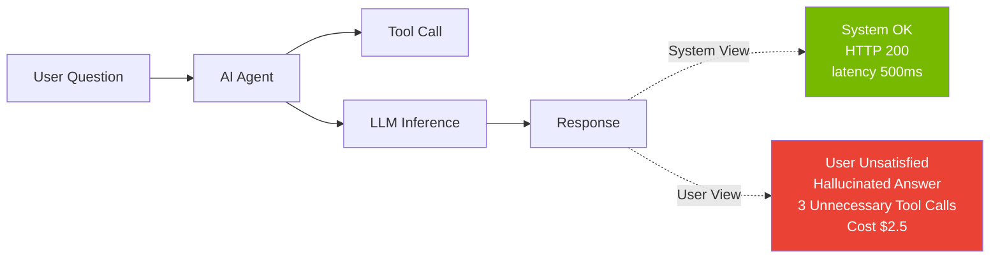
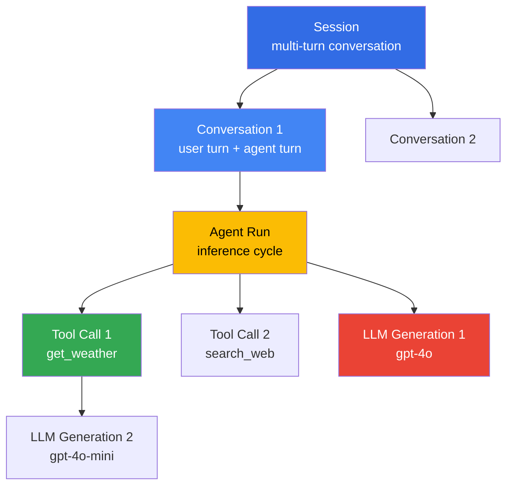

# AgenticOps Metrics — Agent KPIs for Operations Monitoring

> **Reading Time**: ~5 minutes

When AI Agents are deployed to production, **system health alone cannot determine quality**. We must measure **Perceived Quality** metrics such as "Did it understand user intent correctly?", "Did it call the right tools?", and "Is the answer faithful?". This document covers essential **KPI categories** and **Langfuse·OTel-based instrumentation methods** for Agent operations.

---

## 1. Why Agent-Specific Metrics are Necessary

### 1.1 Limitations of Traditional APM

Traditional APM (Application Performance Monitoring) is designed around **system metrics** such as HTTP success rate, response time, and error rate. However, Agents require additional metrics for the following reasons:

| Traditional APM | Agent Quality Metric | Gap |
|----------------|---------------------|-----|
| HTTP 200 OK | Correct answer | Request success ≠ Result quality |
| Response time (total) | Time to First Token | User-perceived speed differs in streaming |
| Error rate | Hallucination rate | LLM errors return HTTP 200, not 500 |
| CPU/Memory | Token cost | Cloud LLMs charge per token |
| N/A | Tool-call accuracy | Wrong tool call is not a system error |

### 1.2 Perceived Quality vs System Metrics



Agent quality is ultimately judged by **whether it accurately performed the user's desired task**, which is independent of system success metrics.

---

## 2. Core KPI Categories

### 2.1 Task Success

Measures whether the user's requested task was completed.

| Metric | Definition | Measurement Method |
|--------|-----------|-------------------|
| **Task success rate** | Percentage of successful conversation sessions | Automated eval (goal attainment) + HITL sampling (10%) |
| **Completion time (p50/p95)** | Time to task completion | Session duration (seconds) |
| **Goal attainment scale** | User goal achievement (1-5) | Explicit feedback (thumbs up/down) or LLM-as-Judge |

**Example (Customer Support Agent)**:

```python
# Langfuse automated evaluation example
from langfuse import Langfuse
langfuse = Langfuse()

trace = langfuse.trace(
    name="customer-support-session",
    session_id="sess_abc123",
    metadata={"intent": "refund_request", "channel": "web"}
)

# Evaluate at session end
trace.score(
    name="task_success",
    value=1.0,  # 0.0 = failure, 1.0 = success
    comment="Refund processed and confirmation sent"
)
```

### 2.2 Tool Use Accuracy

Measures whether the Agent correctly calls the right tools.

| Metric | Definition | Measurement Method |
|--------|-----------|-------------------|
| **Tool-call accuracy** | Percentage of correct tool calls | (Correct tool calls) / (Total tool calls) |
| **Tool invocation rate** | Average tool calls per session | Span hierarchy analysis |
| **Tool failure rate** | Tool call failure percentage | HTTP 5xx, Timeout, JSON parsing error |

**Example**:

```python
# Record tool call span
span = trace.span(
    name="tool_call",
    input={"tool": "get_weather", "args": {"location": "Seoul"}},
    metadata={"tool_name": "get_weather", "tool_version": "v1.2"}
)

# Evaluation criteria: intent="weather question" → correct tool="get_weather"
# Wrong example: calling "search_web" instead of "get_weather" → accuracy 0.0
span.score(
    name="tool_call_accuracy",
    value=1.0,  # Correct tool selected
    comment="Correct tool selected for weather intent"
)
```

### 2.3 Quality & Safety

Measures answer quality and safety violations.

| Metric | Definition | Measurement Method |
|--------|-----------|-------------------|
| **Hallucination rate** | Percentage of unfounded information | Ragas Faithfulness / SelfCheckGPT |
| **Guardrails violation rate** | Input/output filter block rate | input/output filter block count |
| **Toxicity incidence** | Harmful content generation rate | Perspective API / OpenAI Moderation |

**Hallucination Measurement Example (Ragas Faithfulness)**:

```python
from ragas.metrics import faithfulness
from ragas import evaluate

# RAG Agent evaluation
result = evaluate(
    dataset=test_dataset,
    metrics=[faithfulness],
    llm=ChatOpenAI(model="gpt-4o-mini")
)

# Record Faithfulness score to Langfuse
trace.score(
    name="faithfulness",
    value=result["faithfulness"],  # 0.0~1.0
    comment=f"Context: {len(context)} chars, Answer: {len(answer)} chars"
)
```

**Guardrails Violation Measurement**:

```python
# OpenClaw AI Gateway PII redaction block
if gateway_response.status == "blocked_pii":
    trace.score(
        name="guardrails_violation",
        value=1.0,  # Blocked
        comment="PII detected: email, phone"
    )
```

### 2.4 Cost & Efficiency

Measures Agent operational cost and resource efficiency.

| Metric | Definition | Measurement Method |
|--------|-----------|-------------------|
| **Cost per interaction** | Average cost per session (USD) | Σ(input_tokens × price_in + output_tokens × price_out) |
| **Token efficiency** | Effective token ratio | (Response tokens) / (Total consumed tokens) |
| **Cache hit rate** | Semantic cache hit rate | (cache hits) / (total queries) |

**Cost Tracking Example**:

```python
# Record tokens and cost in generation span
generation = trace.generation(
    name="llm_call",
    model="gpt-4o-2025-01-31",
    input="What is the weather in Seoul?",
    output="The current weather in Seoul is...",
    usage={
        "input": 1200,
        "output": 80,
        "total": 1280,
        "input_cost": 0.012,   # $10 / 1M tokens
        "output_cost": 0.024,  # $30 / 1M tokens
        "total_cost": 0.036
    }
)
```

**Cache Hit Rate Measurement**:

```python
# When semantic cache hit occurs
if cache_hit:
    trace.event(
        name="cache_hit",
        metadata={"cache_key": cache_key, "latency_saved_ms": 2500}
    )
```

### 2.5 User Experience

Measures user-perceived quality.

| Metric | Definition | Measurement Method |
|--------|-----------|-------------------|
| **Time to First Token (TTFT)** | Time to first response | streaming start time - request time |
| **Task-length quartiles** | Task complexity distribution | METR Task Standard-based classification |
| **Escalation rate** | Human handoff ratio | (human handoff count) / (total sessions) |

**TTFT Measurement Example**:

```python
import time

request_time = time.time()
# LLM call (streaming)
first_token_time = None

async for chunk in llm_stream():
    if first_token_time is None:
        first_token_time = time.time()
        ttft_ms = (first_token_time - request_time) * 1000
        
        trace.event(
            name="time_to_first_token",
            metadata={"ttft_ms": ttft_ms, "model": "gpt-4o"}
        )
```

**Escalation Rate Measurement**:

```python
# Human handoff when Agent detects uncertainty
if confidence_score < 0.7:
    trace.event(
        name="escalation",
        metadata={
            "reason": "low_confidence",
            "confidence": confidence_score,
            "fallback": "human_agent"
        }
    )
```

### 2.6 System Reliability

Measures Agent service stability.

| Metric | Definition | Measurement Method |
|--------|-----------|-------------------|
| **Availability** | Service uptime ratio | (uptime) / (total time) |
| **Error budget** | SLO violation allowance consumption | 1 - (actual SLI / SLO target) |
| **Session continuity rate** | Uninterrupted session completion ratio | (Completed sessions) / (Started sessions) |
| **Retry exhaustion rate** | Retry limit exceeded ratio | (max retries exceeded) / (total requests) |

**SLO Example (Task success rate)**:

```
Target SLO: Task success rate ≥ 95% (30-day window)
Error budget: 5% → 36 hours outage allowed per month
```

---

## 3. Langfuse Trace Schema Proposal

### 3.1 Span Hierarchy

Agent execution flow is represented with the following hierarchy:



### 3.2 Standard Tags

Apply the following tags to all traces/spans:

- `agent_name`: Agent identifier (e.g., `customer-support-agent`)
- `model`: LLM model name (e.g., `gpt-4o-2025-01-31`)
- `prompt_version`: Prompt template version (e.g., `v1.2.3`)
- `tool`: Tool name called (e.g., `get_weather`)
- `guardrails`: Applied guardrails (e.g., `pii_redaction,prompt_injection`)

### 3.3 Score Events

Quality evaluation is recorded as `score` events:

- `task_success`: 0.0~1.0
- `faithfulness`: 0.0~1.0 (Ragas)
- `cache_hit`: 0.0 (miss) / 1.0 (hit)
- `tool_call_accuracy`: 0.0~1.0
- `guardrails_violation`: 0.0 (pass) / 1.0 (block)

### 3.4 JSON Example

```json
{
  "id": "trace_abc123",
  "name": "customer-support-session",
  "session_id": "sess_xyz789",
  "user_id": "user_456",
  "tags": ["agent_name:support-agent", "environment:production"],
  "metadata": {
    "channel": "web",
    "intent": "refund_request",
    "customer_tier": "premium"
  },
  "spans": [
    {
      "id": "span_001",
      "name": "agent_run",
      "start_time": "2026-04-18T10:00:00Z",
      "end_time": "2026-04-18T10:00:05Z",
      "input": "I want to request a refund for order #12345",
      "output": "I've processed your refund request...",
      "metadata": {
        "reasoning_steps": 3,
        "tools_called": ["get_order", "process_refund", "send_email"]
      }
    },
    {
      "id": "span_002",
      "parent_span_id": "span_001",
      "name": "tool_call",
      "type": "span",
      "start_time": "2026-04-18T10:00:01Z",
      "end_time": "2026-04-18T10:00:02Z",
      "input": {"tool": "get_order", "args": {"order_id": "12345"}},
      "output": {"status": "delivered", "amount": 129.99},
      "metadata": {
        "tool_name": "get_order",
        "tool_version": "v2.1",
        "latency_ms": 850
      }
    },
    {
      "id": "gen_001",
      "parent_span_id": "span_001",
      "name": "llm_generation",
      "type": "generation",
      "model": "gpt-4o-2025-01-31",
      "input": [{"role": "system", "content": "You are a support agent..."}, {"role": "user", "content": "I want a refund..."}],
      "output": "Based on your order status...",
      "usage": {
        "input": 1200,
        "output": 80,
        "total": 1280,
        "input_cost": 0.012,
        "output_cost": 0.024,
        "total_cost": 0.036
      },
      "metadata": {
        "temperature": 0.7,
        "prompt_version": "v1.2.3"
      }
    }
  ],
  "scores": [
    {
      "name": "task_success",
      "value": 1.0,
      "comment": "Refund processed successfully"
    },
    {
      "name": "faithfulness",
      "value": 0.92,
      "comment": "High context adherence"
    },
    {
      "name": "tool_call_accuracy",
      "value": 1.0,
      "comment": "All tools correctly selected"
    }
  ]
}
```

---

## 4. OpenTelemetry Semantic Conventions

### 4.1 GenAI Semantic Conventions (As of 2026-04)

OpenTelemetry defines LLM instrumentation standards through **Gen AI Semantic Conventions** ([v1.28.0 experimental](https://opentelemetry.io/docs/specs/semconv/gen-ai/)).

**Core attributes**:

| Attribute | Example | Description |
|-----------|---------|-------------|
| `gen_ai.system` | `openai` | LLM provider |
| `gen_ai.request.model` | `gpt-4o-2025-01-31` | Model name |
| `gen_ai.request.temperature` | `0.7` | Sampling temperature |
| `gen_ai.request.max_tokens` | `2048` | Max output tokens |
| `gen_ai.usage.input_tokens` | `1200` | Input token count |
| `gen_ai.usage.output_tokens` | `80` | Output token count |
| `gen_ai.response.finish_reason` | `stop` | Termination reason (stop, length, tool_calls) |

### 4.2 Span Kind

- **client**: Agent → LLM API call
- **internal**: Agent internal reasoning logic

### 4.3 OTel → Langfuse Bridge

```python
# OpenTelemetry instrumentation → Automatic Langfuse transmission
from opentelemetry import trace
from opentelemetry.exporter.otlp.proto.grpc.trace_exporter import OTLPSpanExporter
from opentelemetry.sdk.trace import TracerProvider
from opentelemetry.sdk.trace.export import BatchSpanProcessor

# OTLP Exporter → Langfuse OTLP endpoint
exporter = OTLPSpanExporter(
    endpoint="https://langfuse.example.com/api/public/otlp",
    headers={"Authorization": "Bearer <LANGFUSE_API_KEY>"}
)

provider = TracerProvider()
provider.add_span_processor(BatchSpanProcessor(exporter))
trace.set_tracer_provider(provider)

# Now all OTel traces are sent to Langfuse
tracer = trace.get_tracer(__name__)

with tracer.start_as_current_span("agent_run") as span:
    span.set_attribute("gen_ai.system", "openai")
    span.set_attribute("gen_ai.request.model", "gpt-4o")
    # ... Agent execution
```

---

## 5. Grafana/CloudWatch Dashboard Examples

### 5.1 Top-line Metrics (Executive Level)

```
┌─────────────────────────────────────────────────────────────┐
│ Task Success Rate (30d)            │ 96.2% (↑ 1.2% WoW)    │
│ Avg Cost per Interaction           │ $0.12 (↓ $0.03 WoW)  │
│ Hallucination Rate                 │ 2.1% (↑ 0.3% WoW)    │
│ Escalation Rate                    │ 3.5% (→ 0.0% WoW)    │
└─────────────────────────────────────────────────────────────┘
```

**Grafana Panel Configuration**:

```promql
# Task success rate (30-day average)
sum(rate(langfuse_trace_score_total{name="task_success", value="1"}[30d]))
/
sum(rate(langfuse_trace_score_total{name="task_success"}[30d]))
```

### 5.2 Drill-down Dashboard (Operations Team)

**Tool Call Analysis**:

```
Tool Call Success Rate by Tool
┌──────────────┬──────────┬──────────┐
│ Tool         │ Calls    │ Success  │
├──────────────┼──────────┼──────────┤
│ get_weather  │ 1,234    │ 99.2%    │
│ search_web   │ 892      │ 94.5%    │
│ send_email   │ 456      │ 100%     │
│ get_order    │ 789      │ 98.7%    │
└──────────────┴──────────┴──────────┘
```

**Guardrails Violation Trend**:

```
Guardrails Violation Rate (7d)
┌─────────────────────────────────────────┐
│  5% ┤                                    │
│  4% ┤    ╭╮                              │
│  3% ┤  ╭╯╰╮  ╭╮                          │
│  2% ┤╭╯   ╰╮╭╯╰╮                         │
│  1% ┼╯     ╰╯  ╰─────────────────        │
│  0% ┴────────────────────────────────    │
└─────────────────────────────────────────┘
     Mon  Tue Wed Thu Fri Sat Sun
```

### 5.3 SLO Dashboard

```
Error Budget Burn Rate (Task Success SLO: 95%)
┌────────────────────────────────────────────────────┐
│ Current SLI: 96.2%                                 │
│ Error Budget: 5% → 36h/month                      │
│ Consumed: 12.5h (34.7%)                            │
│ Remaining: 23.5h (65.3%)                           │
│                                                    │
│ ██████████████████░░░░░░░░░░░ 34.7% consumed     │
│                                                    │
│ Status: 🟢 HEALTHY                                 │
│ Estimated Days Until Budget Exhausted: 45 days    │
└────────────────────────────────────────────────────┘
```

---

## 6. Alerting & Anomaly Detection

### 6.1 Anomaly Pattern Examples

| Anomaly Type | Detection Rule | Response Action |
|--------------|----------------|-----------------|
| **Guardrails rate spike** | Exceeds 3σ (rolling 1 hour) | PagerDuty P2, prompt review |
| **Cost spike** | Hourly cost > $100 (baseline $20) | Slack alert, activate rate limit |
| **Escalation rate increase** | Exceeds 10% (baseline 3%) | On-call engineer alert, Agent logic review |
| **Tool failure rate** | Specific tool > 20% failure | Auto circuit breaker, activate fallback |

### 6.2 Baseline Setting and Detection Algorithm

**Rolling window average-based anomaly detection**:

```python
# Example: Guardrails violation rate anomaly detection
import numpy as np

def detect_anomaly(current_rate, historical_rates, threshold_sigma=3):
    """
    Args:
        current_rate: Current time period violation rate
        historical_rates: Past 7 days same time period rates
        threshold_sigma: Standard deviation multiple threshold
    """
    baseline_mean = np.mean(historical_rates)
    baseline_std = np.std(historical_rates)
    
    z_score = (current_rate - baseline_mean) / baseline_std
    
    if z_score > threshold_sigma:
        return {
            "anomaly": True,
            "severity": "high" if z_score > 5 else "medium",
            "z_score": z_score,
            "baseline": baseline_mean,
            "current": current_rate
        }
    return {"anomaly": False}

# Real-time monitoring example
current_rate = 0.08  # 8% violation rate
historical = [0.02, 0.021, 0.019, 0.022, 0.018, 0.023, 0.020]  # Past 7 days

result = detect_anomaly(current_rate, historical)
if result["anomaly"]:
    print(f"🚨 Anomaly detected: {result['current']:.1%} (baseline {result['baseline']:.1%})")
    # Send PagerDuty alert
```

### 6.3 PagerDuty/Slack Integration

**CloudWatch Alarm → SNS → Lambda → PagerDuty**:

```python
# Lambda handler: CloudWatch Alarm → PagerDuty
import boto3
import requests

def lambda_handler(event, context):
    alarm_name = event["detail"]["alarmName"]
    metric = event["detail"]["metric"]
    value = event["detail"]["state"]["value"]
    
    # PagerDuty Events API v2
    payload = {
        "routing_key": "PAGERDUTY_ROUTING_KEY",
        "event_action": "trigger",
        "payload": {
            "summary": f"Agent KPI Anomaly: {alarm_name}",
            "severity": "warning",
            "source": "cloudwatch",
            "custom_details": {
                "metric": metric,
                "current_value": value,
                "threshold": event["detail"]["threshold"]
            }
        }
    }
    
    response = requests.post(
        "https://events.pagerduty.com/v2/enqueue",
        json=payload
    )
    return {"statusCode": 200, "body": "Alert sent"}
```

**Slack Alert Example**:

```
🚨 Agent Metrics Alert

**Cost Spike Detected**
- Current hourly cost: $142.50 (baseline $18.20)
- Time: 2026-04-18 14:30 UTC
- Agent: customer-support-agent
- Model: gpt-4o-2025-01-31

**Probable Cause**: Unusual traffic spike (3.2k requests vs 800 baseline)

Actions:
- Rate limit activated (100 req/min → 50 req/min)
- Fallback to gpt-4o-mini for non-critical queries

📊 Dashboard: https://grafana.example.com/d/agent-cost
📖 Runbook: https://wiki.example.com/agent-cost-spike
```

---

## 7. AIDLC Stage-by-Stage Application

### 7.1 Inception: Define Baseline

Define target KPIs at project initiation.

| KPI | Target (after 90d) | Baseline (Current) |
|-----|-------------------|-------------------|
| Task success rate | ≥ 95% | 88% (human baseline) |
| Tool-call accuracy | ≥ 90% | N/A (new) |
| Hallucination rate | ≤ 3% | 12% (initial prototype) |
| Cost per interaction | ≤ $0.15 | $0.32 |
| Escalation rate | ≤ 5% | 18% |

### 7.2 Construction: CI Regression Gate

Automatically detect metric regressions in each PR.

```yaml
# .github/workflows/agent-quality-gate.yml
name: Agent Quality Gate
on: [pull_request]

jobs:
  evaluate:
    runs-on: ubuntu-latest
    steps:
      - uses: actions/checkout@v4
      
      - name: Run Ragas evaluation
        run: |
          pytest tests/test_agent_quality.py --ragas
      
      - name: Check metrics regression
        run: |
          python scripts/check_regression.py \
            --baseline metrics/baseline.json \
            --current metrics/current.json \
            --threshold 0.05  # Fail if decline > 5%
```

### 7.3 Operations: Real-time Alerting

Real-time monitoring after production deployment.

```
Agent KPI SLO (Production)
┌──────────────────────┬──────────┬──────────┬──────────┐
│ Metric               │ SLO      │ Current  │ Status   │
├──────────────────────┼──────────┼──────────┼──────────┤
│ Task success rate    │ ≥ 95%    │ 96.2%    │ 🟢 OK    │
│ Tool-call accuracy   │ ≥ 90%    │ 93.5%    │ 🟢 OK    │
│ Hallucination rate   │ ≤ 3%     │ 2.1%     │ 🟢 OK    │
│ Cost per interaction │ ≤ $0.15  │ $0.12    │ 🟢 OK    │
│ Escalation rate      │ ≤ 5%     │ 3.5%     │ 🟢 OK    │
│ TTFT (p95)           │ ≤ 2s     │ 1.8s     │ 🟢 OK    │
└──────────────────────┴──────────┴──────────┴──────────┘
```

---

## 8. References

### 8.1 Langfuse Documentation

- [Langfuse Scoring](https://langfuse.com/docs/scores): Trace/spanAttach quality scores to
- [Langfuse Prompt Management](https://langfuse.com/docs/prompts): Prompt version management and A/B testing
- [Langfuse OTLP Integration](https://langfuse.com/docs/integrations/opentelemetry): OpenTelemetry bridge

### 8.2 OpenTelemetry

- [GenAI Semantic Conventions](https://opentelemetry.io/docs/specs/semconv/gen-ai/): LLM instrumentation standard (v1.28.0 experimental)
- [OTel Python SDK](https://opentelemetry.io/docs/languages/python/): Python instrumentation

### 8.3 Evaluation Frameworks

- [Ragas](https://docs.ragas.io/): RAG evaluation (faithfulness, answer relevancy, context precision)
- [SelfCheckGPT](https://github.com/potsawee/selfcheckgpt): Zero-resource hallucination detection
- [METR Task Standard](https://metr.org/): Agent task benchmark

### 8.4 Related Documentation

- [LLMOps Observability Comparison Guide](../../agentic-ai-platform/operations-mlops/observability/llmops-observability.md): Langfuse vs LangSmith vs Helicone
- [Ragas RAG Evaluation Frameworks](../../agentic-ai-platform/operations-mlops/governance/ragas-evaluation.md): Ragas Metrics Details
- [Observability Stack](./observability-stack.md): AIDLC Operationstelemetry foundation
- [Predictive Operations](./predictive-operations.md): Metric-based failure prediction
