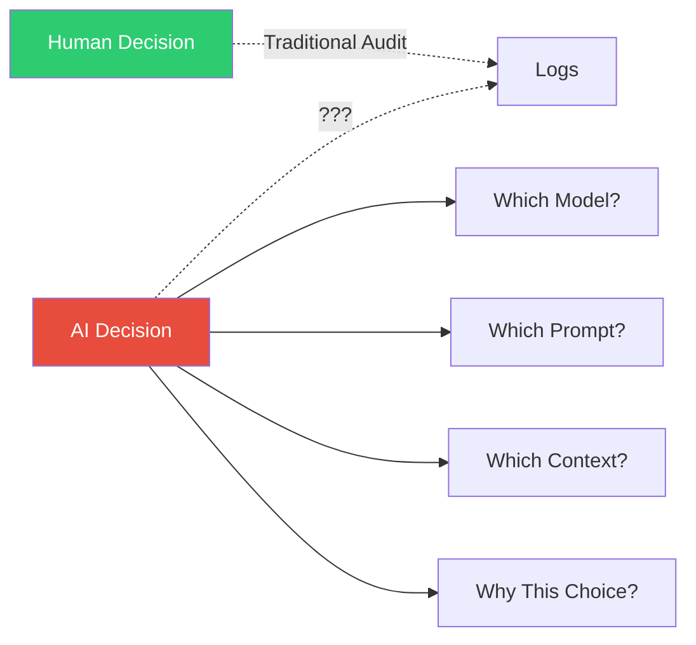
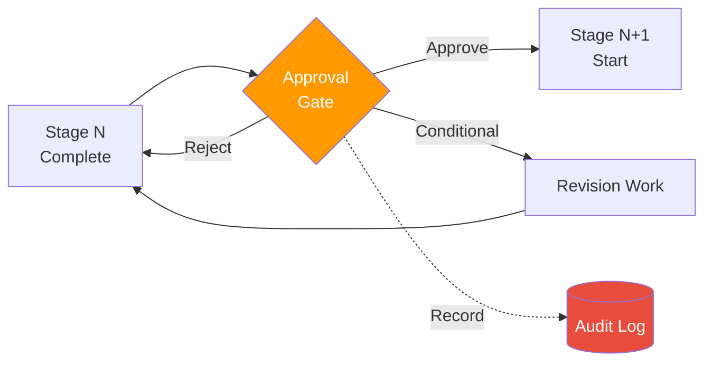
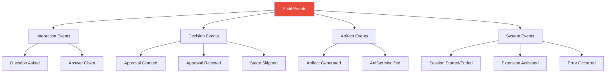
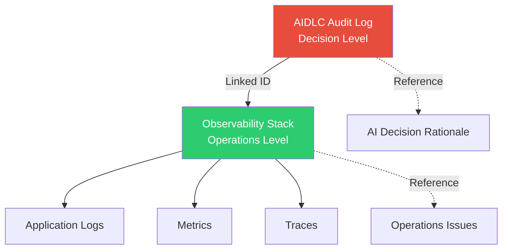
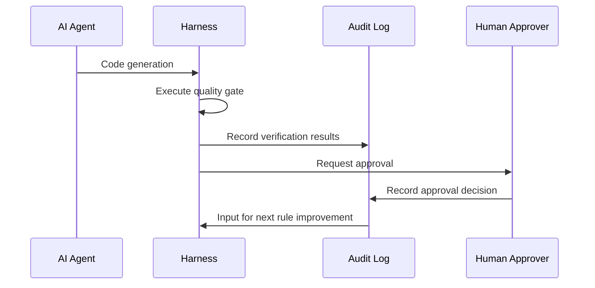

# Audit & Governance Logging

> 📅 **Date**: 2026-04-18 | ⏱️ **Reading Time**: ~17 minutes

Among AWS Labs [AIDLC Common Rules](https://github.com/awslabs/aidlc-workflows/tree/main/aws-aidlc-rule-details/common), the two rules with the highest governance weight are **Checkpoint Approval (Rule 7)** and **Audit Logging (Rule 8)**. This document is a practical guide for implementing these rules in production environments to meet audit requirements in **regulated industries (finance, healthcare, public sector)**.

---

## 1. Why Audit Logs are Necessary

### 1.1 Regulatory Requirements

| Regulation | Audit Requirement | Retention Period | AIDLC Relevance |
|-----------|------------------|------------------|----------------|
| **Korea Electronic Financial Supervision Regulations** | Complete IT change & access history | 5 years | All AIDLC stage approval & decision history |
| **Korea Personal Information Protection Act** | Personal data processing decision history | 3 years | Requirements Analysis, Application Design |
| **HIPAA (US)** | PHI access & processing logs | 6 years | Healthcare domain modeling decisions |
| **SOX (US)** | Financial system change control | 7 years | Checkpoint Approval, artifact hashes |
| **ISMS-P (KR)** | Information system operation logs | 3 years | Complete Session history |
| **GDPR (EU)** | Personal data decision rationale | Case by case | Ontology decisions, data processing design |

### 1.2 AIDLC-Specific Audit Challenges



**Why AIDLC Auditing is More Difficult Than Traditional Auditing:**
1. AI outputs can be **non-deterministic** → Reproducibility proof required (Common Rule 11)
2. AI makes **numerous small decisions** → All decision history needed
3. **Model version changes** affect results → Version info recording essential
4. **Prompt injection** attack possibility → Original input preservation required

### 1.3 Reproducibility and Audit Relationship

AIDLC auditing requires **"decision reproducibility" beyond simple event logging**:

```
Auditor: "Why was Cognito chosen as the authentication method for payment service on 2026-03-15?"

Traditional System: "Approval record showing engineer Kim decided"

AIDLC System:
  - Original User Request
  - Original AI-presented 5-option choices
  - Original user response `[Answer]: A`
  - Model used (`claude-opus-4-7` version, temperature 0, seed 42)
  - List of activated Extensions
  - Artifact SHA-256 hash
  → Same input re-execution can generate identical results
```

---

## 2. Checkpoint Approval Gates

### 2.1 Stage Transition Approval Pattern

Each stage transition in AIDLC is protected by **explicit approval gates**.



### 2.2 Approval Gate Template

**Standard Approval Document Format:**
```markdown
# Checkpoint Approval: <stage name> → <next stage>

**Gate ID**: gate-2026-04-18-042
**Session ID**: sess-20260418-payment-service
**Timestamp**: 2026-04-18T10:45:12.345Z

## Completing Stage
**Stage**: requirements_analysis
**Duration**: 3h 25min
**Content Validation**: PASSED (0 failed checks)

## Artifacts Produced
| File | Size | SHA-256 |
|------|------|---------|
| `requirements.md` | 1,234 lines | `sha256:abc123...` |
| `.aidlc/validation-report.md` | 87 lines | `sha256:def456...` |
| `.aidlc/audit/stage-req-analysis.md` | 412 lines | `sha256:789abc...` |

## Approvers Required
- [x] Primary: Architect (yjeong@example.com)
- [ ] Secondary: Security Lead (security-lead@example.com)
- [ ] Tertiary: Compliance Officer (compliance@example.com) — Required for financial industry

## Decision Options (Common Rule 1: Question Format)

A. **Approve** — Proceed to next stage
B. **Reject** — Rework current stage (feedback required)
C. **Conditional Approve** — Conditional approval (conditions must be specified)
D. **Escalate** — Escalate to higher governance committee
E. **Defer** — Defer decision (deadline must be specified)

**Primary Approver Decision**:
[Answer]: A

**Approval Rationale**:
All NFRs are measurable and major risks have been identified.

**Secondary Approver Decision**:
[Answer]: <pending>

**Tertiary Approver Decision**:
[Answer]: <pending>
```

### 2.3 Multi-Approver Pattern (Multi-Sig)

Regulated industries require **stage transitions cannot proceed with single approval**.

**Multi-Approval Matrix Example (Finance):**
| Stage Transition | Primary | Secondary | Tertiary | Additional Requirements |
|-----------------|---------|-----------|----------|------------------------|
| Requirements → User Stories | Architect | - | - | Simple review |
| User Stories → Workflow Planning | Architect | PM | - | - |
| Workflow Planning → Application Design | Architect | Security Lead | - | Threat model required |
| Application Design → Units Generation | Architect | Security Lead | Compliance | Regulatory mapping required |
| Construction → Production Deploy | Architect | Security Lead | Compliance + SRE | 4-person approval |

### 2.4 Auto-Block Conditions

AIDLC **automatically blocks Checkpoint Approval** under the following conditions:

```yaml
auto_block_conditions:
  - condition: content_validation_failed
    reason: "Common Rule 2 violation"
    action: "Return to current stage"

  - condition: audit_log_tampered
    reason: "Audit log hash mismatch"
    action: "Halt session, notify security team"

  - condition: model_drift_detected
    reason: "Model response reproducibility < 80%"
    action: "Common Rule 11 violation, verify model version"

  - condition: extension_required_missing
    reason: "Required Extension missing in opt-in.md"
    action: "Activate Extension and retry"

  - condition: overconfidence_unchecked
    reason: "Common Rule 4 — No additional context for low confidence response"
    action: "Human intervention required"
```

---

## 3. Audit Log Format

### 3.1 Event Type Classification



### 3.2 Common Event Schema

All audit events **must** include the following fields:

```yaml
event:
  id: evt-2026-04-18-042                     # Unique ID
  timestamp: 2026-04-18T10:45:12.345Z        # ISO 8601, millisecond precision, UTC
  session_id: sess-20260418-payment-service
  stage: requirements_analysis
  event_type: question_asked
  actor:
    type: [human | ai_agent | system]
    id: yjeong@example.com
  sequence_number: 42                         # Sequence guarantee within session

# Additional fields per event type are defined by type
```

### 3.3 Question & Answer Events

```yaml
event:
  id: evt-2026-04-18-041
  timestamp: 2026-04-18T10:42:00.000Z
  session_id: sess-20260418-payment-service
  stage: requirements_analysis
  event_type: question_asked
  actor:
    type: ai_agent
    id: claude-opus-4-7
    prompt_version: "aidlc-requirements-v1.3.2"

  question:
    text: |                                  # Preserve original (Common Rule 8)
      Q15. What data store would you choose for Payment Service?
      A. DynamoDB (NoSQL, Serverless)
      B. Aurora PostgreSQL (Relational, High Availability)
      C. RDS MySQL (Relational, Low Cost)
      D. DocumentDB (MongoDB Compatible)
      E. Other (please specify)
      [Answer]:
    ai_confidence: high
    ai_recommendation: A
    ai_reasoning: |
      DynamoDB is suitable given write-heavy workload characteristics of payment transactions...

---

event:
  id: evt-2026-04-18-042
  timestamp: 2026-04-18T10:45:12.345Z
  session_id: sess-20260418-payment-service
  stage: requirements_analysis
  event_type: answer_given
  actor:
    type: human
    id: yjeong@example.com

  references:
    question_id: evt-2026-04-18-041

  answer:
    raw_text: |                              # Never modify user's original response
      [Answer]: B
      
      Choosing Aurora as organization standard is PostgreSQL.
    parsed_option: B
    user_comment: "Choosing Aurora as organization standard is PostgreSQL."
```

### 3.4 Approval Events

```yaml
event:
  id: evt-2026-04-18-100
  timestamp: 2026-04-18T15:30:00.000Z
  session_id: sess-20260418-payment-service
  stage: checkpoint_gate
  event_type: approval_granted
  actor:
    type: human
    id: architect@example.com

  gate:
    id: gate-2026-04-18-042
    from_stage: requirements_analysis
    to_stage: user_stories
    approval_level: primary

  decision:
    raw_text: "[Answer]: A"
    parsed: approve
    rationale: |
      All NFRs are measurable and major risks have been identified.

  artifacts_hash:
    - file: requirements.md
      sha256: abc123...
    - file: validation-report.md
      sha256: def456...

  signatures:
    method: "AWS KMS sign-verify"
    key_id: "arn:aws:kms:us-east-2:...:key/xxx"
    signature: "base64..."
```

### 3.5 Artifact Events

```yaml
event:
  id: evt-2026-04-18-075
  timestamp: 2026-04-18T13:15:22.000Z
  session_id: sess-20260418-payment-service
  stage: requirements_analysis
  event_type: artifact_generated
  actor:
    type: ai_agent
    id: claude-opus-4-7

  artifact:
    path: requirements.md
    sha256: abc123...
    size_bytes: 48_231
    line_count: 1_234

  generation_context:
    input_tokens: 8_421
    output_tokens: 12_305
    model_version: claude-opus-4-7
    temperature: 0
    seed: 42
    extensions_active:
      - security@0.1.0
      - testing@0.1.0
      - org-compliance-ismsp@2.1.0
```

---

## 4. Audit Repository Structure

### 4.1 Directory Layout

```
.aidlc/audit/
  audit.md                                  # Human-readable summary
  events/                                   # Atomic event logs
    2026-04-18/
      00-session-start.yaml
      01-workspace-detected.yaml
      02-question-asked-ext-opt-in.yaml
      03-answer-given-ext-opt-in.yaml
      ...
      99-session-checkpoint.yaml
  stages/                                   # Per-stage aggregation
    stage-requirements-analysis.md
    stage-user-stories.md
    stage-workflow-planning.md
  gates/                                    # Approval gate records
    gate-2026-04-18-042.md
    gate-2026-04-19-015.md
  artifacts/                                # Artifact snapshots
    2026-04-18T10:45/
      requirements.md
      validation-report.md
    2026-04-18T14:20/
      user-stories.md
  signatures/                               # Digital signatures
    evt-2026-04-18-100.sig
  manifest.yaml                             # Complete metadata
```

### 4.2 manifest.yaml Example

```yaml
audit_manifest:
  session_id: sess-20260418-payment-service
  created: 2026-04-18T09:00:00Z
  last_updated: 2026-04-18T18:30:00Z
  schema_version: "1.0"

  storage:
    primary: s3://company-audit-logs/aidlc/
    backup: glacier://company-audit-archive/
    retention: 7_years              # SOX compliance
    worm_enabled: true              # Object Lock

  integrity:
    hash_algorithm: sha256
    signature_algorithm: rsa-2048
    chain_of_custody: true          # Hash chain between events

  events_count: 1_284
  gates_count: 7
  artifacts_count: 42
  
  compliance_mappings:
    - standard: ISMS-P
      version: "2.1"
      covered_controls: [2.5.1, 2.8.2, 2.9.1]
    - standard: SOX
      version: "2002"
      covered_controls: [Section 404]
```

### 4.3 Hash Chain Structure

Each event includes the hash of the previous event to form a **tamper-proof chain**:

```yaml
event:
  id: evt-2026-04-18-043
  timestamp: 2026-04-18T10:50:00.000Z
  previous_event_hash: sha256:a1b2c3...     # Hash of evt-042
  content_hash: sha256:f9e8d7...
  # ...

# Integrity verification:
# 1. event.content_hash == sha256(event body)
# 2. next_event.previous_event_hash == this event.content_hash
# 3. If chain breaks, tampering detected
```

---

## 5. Audit Trail Examples in Regulated Industries

### 5.1 Financial Industry (Korea Electronic Financial Supervision Regulations)

**Audit Scenario**: Financial Supervisory Service IT inspection requests "approval path for payment service API changes on March 15, 2026."

**AIDLC Audit Response:**
```bash
# 1. Search session at that time
aidlc audit query --date 2026-03-15 --service payment-service

→ Found: sess-20260315-payment-api-v2

# 2. Track approval gates
aidlc audit gates --session sess-20260315-payment-api-v2

→ Gate 1: requirements_analysis → user_stories
  Approved by: architect@bank.com (2026-03-15T14:20:00Z)
  Signature: verified ✓
  
→ Gate 2: user_stories → workflow_planning  
  Approved by: architect@bank.com, security-lead@bank.com (2026-03-15T16:10:00Z)
  Signatures: all verified ✓
  
→ Gate 3: construction → production_deploy
  Approved by: architect + security + compliance + sre (2026-03-16T09:00:00Z)
  Signatures: all verified ✓
  Regulatory Compliance Check: PASSED (EFSR-8, EFSR-13, EFSR-DR)

# 3. Verify artifact hashes
aidlc audit verify-artifacts --session sess-20260315-payment-api-v2

→ All 42 artifacts verified ✓
→ No tampering detected
```

### 5.2 Healthcare Industry (HIPAA)

**Audit Scenario**: HIPAA auditor requests rationale for patient data processing logic decisions.

**Traceable Items:**
- Time when PHI (Protected Health Information) fields were identified
- Encryption method decision options and approvers
- Access control (RBAC) design decision history
- Rationale for data retention period (6 years) setting

### 5.3 Public Sector (ISMS-P)

**Audit Scenario**: ISMS-P examiner requests "protection measures by personal information processing stage" decision history.

**Providable Evidence:**
```
✓ Collection Stage: Minimum collection principle Q&A records in Requirements Analysis
✓ Use Stage: Purpose limitation design in Application Design
✓ Provision Stage: External API sharing controls in Unit of Work
✓ Disposal Stage: TTL policy in Infrastructure Design
✓ Approver, approval time, and signature for each stage
```

---

## 6. Relationship with Existing Systems

### 6.1 Integration with observability-stack

AIDLC Audit Log is not a **subset** of [Observability Stack](./observability-stack.md) but a **higher governance layer**.



**Role Division:**
| Item | Audit Log | Observability |
|------|-----------|---------------|
| Target | AIDLC decisions & approvals | Runtime events |
| Retention | 5-7years (WORM) | 30-90days (general) |
| Accessor | Auditors & Compliance | SRE · Developers |
| Format | Structured YAML + signatures | JSON / OTel |

### 6.2 Relationship with Harness Engineering

The **quality gates** of [Harness Engineering](../methodology/harness-engineering.md) have **bidirectional integration** with Audit Log:

- Quality events detected by Harness → recorded in Audit Log
- Audit Log Checkpoint Approval failure history → input for Harness rule improvement



### 6.3 Mapping to Common Rules

This document operationalizes the following AIDLC [Common Rules](../methodology/common-rules.md):

| Common Rule | This Document Implementation |
|-------------|--------------|
| 1. Question Format | §2.2 Approval gate template (A-E options) |
| 3. Error Handling | §2.4 Auto-block conditions |
| 5. Session Continuity | §4.1 `.aidlc/audit/` directory structure |
| 7. Checkpoint Approval | §2 Complete |
| 8. Audit Logging | §3-4 Complete |
| 11. Reproducible | §1.3 Reproducibility |

---

## 7. Operations Checklist

### 7.1 Build Audit Infrastructure

- [ ] S3 bucket + Object Lock (WORM) enable
- [ ] KMS key creation (dedicated to audit logs, no rotation for 7+ years)
- [ ] Glacier Deep Archive linkage (7automatic migration after 7 years)
- [ ] CloudTrail Data Events for S3 access logging
- [ ] VPC Endpoint for S3 access path isolation

### 7.2 Process Checklist

- [ ] Document audit event schema (team wiki)
- [ ] Specify approver roles & qualifications
- [ ] Create multi-approval matrix (stage × industry)
- [ ] Auto-run integrity verification monthly
- [ ] Conduct mock audit quarterly

### 7.3 Automation Tools

```bash
# Verify audit log integrity
aidlc audit verify --session <session-id>

# Query specific event
aidlc audit query --event-type approval_granted --date 2026-03-15

# Generate audit report by regulation
aidlc audit report --standard ISMS-P --period 2026-Q1

# Restore artifact snapshot
aidlc audit restore-artifact --session <id> --timestamp 2026-03-15T10:00:00Z
```

---

## 8. References

### Official Repository
- [AWS Labs AIDLC Common Rules](https://github.com/awslabs/aidlc-workflows/tree/main/aws-aidlc-rule-details/common) — Checkpoint Approval, Audit Logging original text

### Related Documentation
- [Common Rules](../methodology/common-rules.md) — 11Common Rules Complete explanation
- [Observability Stack](./observability-stack.md) — Operations observability implementation
- [Harness Engineering](../methodology/harness-engineering.md) — Quality gates and Audit integration
- [Extension System](../enterprise/extension-system.md) — Extension audit rules per
- [Governance Framework](../enterprise/governance-framework.md) — 33-layer governance

### Regulatory & Standards References
- [ISO 27001:2022 Annex A.8.15 Logging](https://www.iso.org/standard/27001)
- [NIST SP 800-92 Guide to Computer Security Log Management](https://csrc.nist.gov/publications/detail/sp/800-92/final)
- [Korea Electronic Financial Supervision Regulations](https://fss.or.kr/) — IT change control
- [HIPAA Security Rule 164.312(b) Audit Controls](https://www.hhs.gov/hipaa/)
- [SOX Section 404 IT General Controls](https://sarbanes-oxley-101.com/)
