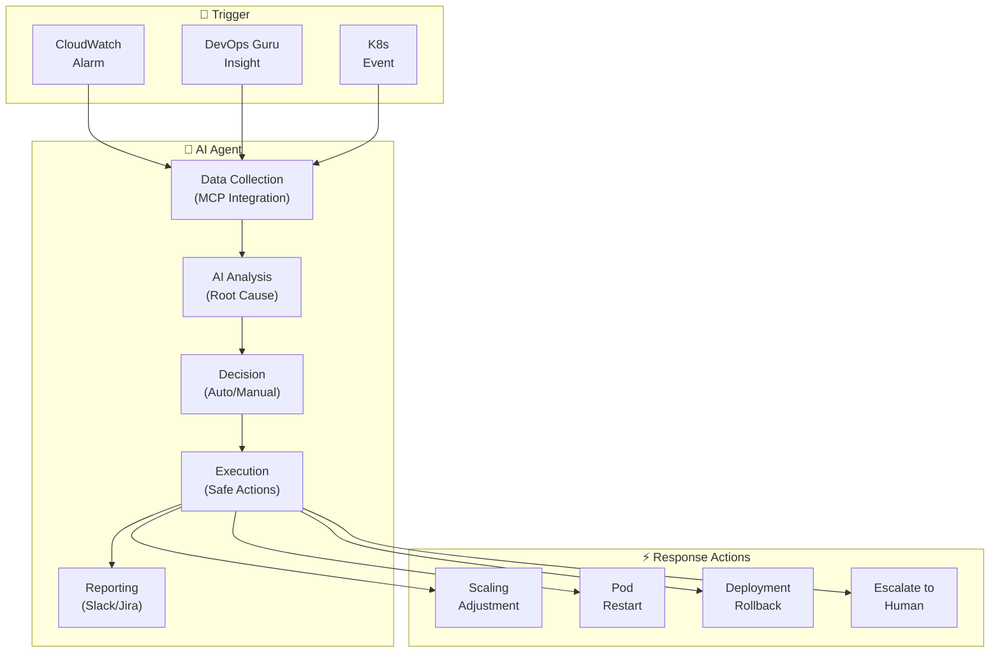
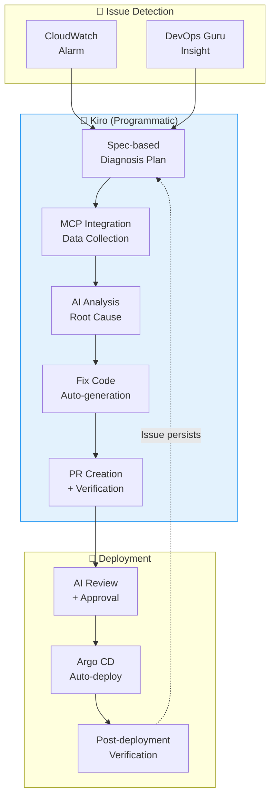
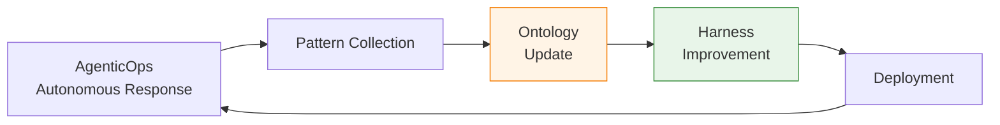

import { ResponsePatterns, ChaosExperiments } from '@site/src/components/PredictiveOpsTables';
import { OperationPatternsComparison, AiopsMaturityModel } from '@site/src/components/AiopsIntroTables';

# Autonomous Response

> 📅 **Date**: 2026-04-07 | ⏱️ **Reading time**: About 12 minutes

---

## 1. Overview

**Autonomous Response** is an operational paradigm where AI Agents detect incidents, collect and analyze context, and autonomously execute recovery within predefined guardrails.

### Three Stages of Autonomous Response

```
[Detection]
  CloudWatch Alarm · DevOps Guru · K8s Event
         ↓
[Decision]
  Collect context with MCP → AI root cause analysis → Determine response
         ↓
[Execution]
  Automatic recovery within safe bounds OR escalation
```

### Why Autonomous Response is Needed

- **MTTR Reduction**: Manual response average 2 hours → AI autonomous response average 5 minutes
- **24/7 Unmanned Operations**: Significantly reduced burden of nighttime/weekend alerts
- **Consistency**: Eliminate human judgment variance, standardized response
- **Learning Effect**: Continuously improve accuracy by learning response patterns

---

## 2. Operations Automation Patterns: Human-Directed, Programmatically-Executed

The core of AIOps is a model where **humans define Intent and guardrails, and the system executes programmatically**.

### 2.1 Three Pattern Spectrum

**Prompt-Driven (Interactive)**
- Humans direct each step in natural language
- AI performs single tasks
- Suitable for: Exploratory debugging, new types of failures
- Limitation: Human-in-the-Loop, inefficient for repetitive scenarios

**Spec-Driven (Codified)**
- Declaratively define operational scenarios as Specs
- System executes programmatically
- Suitable for: Repetitive deployments, standardized operational procedures
- Core: Define Spec once → unlimited repeated execution

**Agent-Driven (Autonomous)**
- AI Agent detects events → collects context → autonomous response
- Human-on-the-Loop (humans set guardrails)
- Suitable for: Automatic incident response, cost optimization, predictive scaling
- Core: Second-level response, intelligent context-based judgment

### 2.2 Pattern Comparison: EKS Pod CrashLoopBackOff Response

<OperationPatternsComparison />

:::tip Combining Patterns in Practice
The three patterns are not mutually exclusive but **complementary**. Explore and analyze new failure types with **Prompt-Driven**, codify repeatable patterns as **Spec-Driven**, and finally automate as **Agent-Driven** in a progressive maturity process.
:::

---

## 3. AI Agent Incident Response

### 3.1 Limitations of Traditional Automation

EventBridge + Lambda-based automation is **rule-based** and has limitations:

```
[Traditional Method: Rule-Based Automation]
CloudWatch Alarm → EventBridge Rule → Lambda → Fixed Action

Problems:
  ✗ "Scale out if CPU > 80%" — cause could be memory leak
  ✗ "Alert if Pod restarts > 5" — response differs by cause
  ✗ Cannot handle complex failures
  ✗ Cannot adapt to new patterns
```

### 3.2 AI Agent-Based Autonomous Response

<ResponsePatterns />

AI Agents respond autonomously with **context-based judgment**.



### 3.3 Kagent Automatic Incident Response

**Kagent** is a Kubernetes Native AI Agent that defines automatic responses through CRDs.

```yaml
# Kagent: Automatic incident response agent
apiVersion: kagent.dev/v1alpha1
kind: Agent
metadata:
  name: incident-responder
  namespace: kagent-system
spec:
  description: "EKS incident automatic response agent"
  modelConfig:
    provider: bedrock
    model: anthropic.claude-sonnet
    region: ap-northeast-2
  systemPrompt: |
    You are an EKS incident response agent.

    ## Response Principles
    1. Safety first: Escalate risky changes to humans
    2. Root cause priority: Respond to causes, not symptoms
    3. Minimal intervention: Perform only necessary minimum actions
    4. Record all actions: Automatically report to Slack and JIRA

    ## Allowed Automatic Actions
    - Pod restart (CrashLoopBackOff, 5+ times)
    - HPA min/max adjustment (within ±50% of current value)
    - Deployment rollback (to previous version)
    - Node drain (MemoryPressure/DiskPressure)

    ## Escalation Targets
    - Actions with potential data loss
    - Impact to 50%+ of replicas
    - StatefulSet related changes
    - Network policy changes

  tools:
    - name: kubectl
      type: kmcp
      config:
        allowedVerbs: ["get", "describe", "logs", "top", "rollout", "scale", "delete"]
        deniedResources: ["secrets", "configmaps"]
    - name: cloudwatch
      type: kmcp
      config:
        actions: ["GetMetricData", "DescribeAlarms", "GetInsight"]
    - name: slack
      type: mcp
      config:
        webhook_url: "${SLACK_WEBHOOK}"
        channel: "#incidents"

  triggers:
    - type: cloudwatch-alarm
      filter:
        severity: ["CRITICAL", "HIGH"]
    - type: kubernetes-event
      filter:
        reason: ["CrashLoopBackOff", "OOMKilled", "FailedScheduling"]
```

### 3.4 Strands Agent SOP: Complex Failure Response

**Strands** is a Python-based OSS Agent framework that defines SOPs (Standard Operating Procedures) as code.

```python
# Strands Agent: Automatic complex failure response
from strands import Agent
from strands.tools import eks_tool, cloudwatch_tool, slack_tool, jira_tool

incident_agent = Agent(
    name="complex-incident-handler",
    model="bedrock/anthropic.claude-sonnet",
    tools=[eks_tool, cloudwatch_tool, slack_tool, jira_tool],
    sop="""
    ## Complex Failure Response SOP

    ### Phase 1: Situation Assessment (within 30 seconds)
    1. Query CloudWatch alarms and DevOps Guru insights
    2. Check related service Pod status
    3. Check node status and resource utilization
    4. Check recent deployment history (changes within 10 minutes)

    ### Phase 2: Root Cause Analysis (within 2 minutes)
    1. Extract error patterns from logs
    2. Metric correlation analysis (CPU, Memory, Network, Disk)
    3. Analyze temporal correlation with deployment changes
    4. Check dependent service status

    ### Phase 3: Automatic Response
    Automatic actions by cause:

    **Deployment-Related Failures:**
    - If deployment exists within last 10 minutes → automatic rollback
    - Check status after rollback → complete if normalized

    **Resource Shortage:**
    - If CPU/Memory > 90% → adjust HPA or add Karpenter nodes
    - If Disk > 85% → clean unnecessary logs/images

    **Dependent Service Failures:**
    - RDS connection failure → check connection pool settings, restart if needed
    - SQS delays → check DLQ, scale out consumers

    **Unknown Cause:**
    - Escalate to human
    - Share all collected data on Slack

    ### Phase 4: Post-Processing
    1. Create incident timeline
    2. Create JIRA incident ticket
    3. Post report to Slack #incidents channel
    4. Save as learning data (feedback loop)
    """
)
```

:::info Core Value of AI Agents
Beyond EventBridge+Lambda, context-based autonomous response is possible. By **unifying multiple data sources** (CloudWatch, EKS API, X-Ray, deployment history) through **MCP integration queries**, even complex failures that cannot be handled by rules can be analyzed for root causes and appropriate actions automatically performed.
:::

### 3.5 Amazon Q Developer Integration

Amazon Q Developer simplifies operations with a natural language interface:

```
[User Question]
"Find Pods experiencing OOM in this cluster"

[Amazon Q Developer Response]
OOM events found:
- payment-service-7d8f9c4b-xyz (namespace: payment)
  └─ 3 recent OOMKilled (last hour)
  └─ Memory limits: 512Mi, actual usage: 520Mi
  └─ Recommendation: increase memory limits to 1Gi

Commands executed:
$ kubectl get events --all-namespaces --field-selector reason=OOMKilled
$ kubectl top pod -n payment payment-service-7d8f9c4b-xyz

Which action would you like?
1. Automatically adjust memory limits (apply VPA)
2. Start detailed memory profiling
3. Analyze all related logs
```

---

## 4. Tribal Knowledge Utilization

AI Agents learn the team's **operational history (Tribal Knowledge)** to automate recovery.

### 4.1 Learning Past Incidents

```python
# Learning past incident response patterns
from strands import Agent

knowledge_base = {
    "incident_patterns": [
        {
            "symptom": "payment-service 500 error surge",
            "root_cause": "RDS connection pool exhaustion",
            "solution": "Increase maxPoolSize or fix connection leak",
            "frequency": 5,
            "last_occurrence": "2026-03-15"
        },
        {
            "symptom": "API Gateway 504 timeout",
            "root_cause": "Lambda cold start + VPC ENI allocation delay",
            "solution": "Enable Provisioned Concurrency",
            "frequency": 3,
            "last_occurrence": "2026-02-20"
        }
    ]
}

# AI Agent references past patterns
tribal_agent = Agent(
    name="tribal-knowledge-responder",
    model="bedrock/anthropic.claude-sonnet",
    tools=[eks_tool, knowledge_base_tool],
    sop="""
    ## Tribal Knowledge-Based Response

    1. Analyze current symptoms
    2. Search for similar past patterns
    3. Apply validated solutions first
    4. If new pattern, explore then update Knowledge Base
    """
)
```

### 4.2 Automatic Knowledge Base Updates

```yaml
# Automatic learning after incident response
apiVersion: batch/v1
kind: Job
metadata:
  name: update-knowledge-base
spec:
  template:
    spec:
      containers:
        - name: learner
          image: my-registry/incident-learner:latest
          env:
            - name: INCIDENT_ID
              value: "INC-2026-04-07-001"
            - name: KNOWLEDGE_BASE_S3
              value: "s3://my-bucket/tribal-knowledge.json"
```

---

## 5. Kiro Programmatic Debugging

### 5.1 Directive vs Programmatic Response Comparison

```
[Directive-Based Response] — Manual, repetitive, high cost
━━━━━━━━━━━━━━━━━━━━━━━━━━━━━━━━━━━━━━━━━━
  Operator: "payment-service 500 error occurring"
  AI:       "Which Pod is it occurring in?"
  Operator: "payment-xxx Pod"
  AI:       "Show me the logs"
  Operator: (execute kubectl logs and copy-paste)
  AI:       "Looks like DB connection error. Check RDS status"
  ...repeat...

  Total time: 15-30 minutes, many manual tasks

[Programmatic Response] — Automatic, systematic, cost-efficient
━━━━━━━━━━━━━━━━━━━━━━━━━━━━━━━━━━━━━━━━━━
  Alert: "payment-service 500 error occurring"

  Kiro Spec:
    1. Query Pod status with EKS MCP
    2. Collect and analyze error logs
    3. Check related AWS services (RDS, SQS) status
    4. Diagnose root cause
    5. Generate automatic fix code
    6. Create PR and verify

  Total time: 2-5 minutes, automated
```

### 5.2 Kiro + MCP Debugging Workflow



### 5.3 Specific Scenario: OOMKilled Automatic Response

```
[Kiro Programmatic Debugging: OOMKilled]

1. Detection: payment-service Pod OOMKilled event

2. Kiro Spec execution:
   → EKS MCP: get_events(namespace="payment", reason="OOMKilled")
   → EKS MCP: get_pod_logs(pod="payment-xxx", previous=true)
   → CloudWatch MCP: query_metrics("pod_memory_utilization", last="1h")

3. AI Analysis:
   "Detected memory leak pattern where payment-service memory usage
    increases by 256Mi every 2 hours after startup.
    Confirmed Redis connections not properly closed in logs."

4. Automatic Fix:
   - memory limits 256Mi → 512Mi (temporary measure)
   - Generate Redis connection pool cleanup code patch
   - Add memory profiling configuration

5. PR Creation:
   Title: "fix: payment-service Redis connection leak"
   - deployment.yaml: adjust memory limits
   - redis_client.go: add defer conn.Close()
   - monitoring: add memory usage dashboard
```

:::tip Core of Programmatic Debugging
**Programmatically analyze and resolve issues** through Kiro + EKS MCP. Compared to directive-style manual response, this enables **cost-efficient and faster automation**, and learned Specs can be reused when the same issue repeats.
:::

---

## 6. Chaos Engineering + AI

### 6.1 AWS FIS EKS Action Types

AWS Fault Injection Service (FIS) provides EKS-specific fault injection actions:

<ChaosExperiments />

### 6.2 AI-Based Failure Pattern Learning

AI learns Chaos Engineering experiment results to improve response capabilities.

```python
# AI learning data collection after FIS experiments
from strands import Agent

chaos_analyzer = Agent(
    name="chaos-pattern-analyzer",
    model="bedrock/anthropic.claude-sonnet",
    sop="""
    ## Chaos Engineering Result Analysis

    1. Collect FIS experiment results
       - Injected failure type
       - System reaction time
       - Recovery time
       - Impact scope

    2. Pattern analysis
       - Map failure propagation paths
       - Identify vulnerable points
       - Identify recovery bottlenecks

    3. Update response rules
       - Add learning content to existing SOP
       - Create response rules for new patterns
       - Adjust escalation thresholds

    4. Generate report
       - Experiment summary
       - Discovered vulnerabilities
       - Recommended improvements
    """
)
```

### 6.3 FIS Experiment Example: Pod Deletion with SLO Protection

```json
{
  "description": "EKS Pod fault injection with SLO protection",
  "targets": {
    "eks-payment-pods": {
      "resourceType": "aws:eks:pod",
      "selectionMode": "COUNT(2)",
      "resourceTags": {
        "app": "payment-service"
      },
      "parameters": {
        "clusterIdentifier": "my-cluster",
        "namespace": "payment"
      }
    }
  },
  "actions": {
    "delete-pod-safely": {
      "actionId": "aws:eks:pod-delete",
      "parameters": {
        "kubernetesServiceAccount": "fis-experiment-role",
        "maxPodsToDelete": "2",
        "podDeletionMode": "one-at-a-time"
      },
      "targets": {
        "Pods": "eks-payment-pods"
      }
    }
  },
  "stopConditions": [
    {
      "source": "aws:cloudwatch:alarm",
      "value": "arn:aws:cloudwatch:ap-northeast-2:ACCOUNT_ID:alarm:PaymentService-ErrorRate-SLO"
    },
    {
      "source": "aws:cloudwatch:alarm",
      "value": "arn:aws:cloudwatch:ap-northeast-2:ACCOUNT_ID:alarm:PaymentService-Latency-P99-SLO"
    }
  ]
}
```

**Safety Measures**:
- **PodDisruptionBudget** compliance: Guarantee minimum availability
- **stopConditions**: Automatic stop on SLO violations
- **Progressive expansion**: Gradual expansion from 1 → 10% → 25%

:::tip Chaos Engineering + AI Feedback Loop
When failures are injected with FIS and AI learns system reaction patterns, AI Agent's automatic response capabilities continuously improve. The feedback loop of "Failure injection → Observation → Learning → Response improvement" is the core of autonomous operations.
:::

---

## 7. Feedback Loop — Operations to Ontology

### 7.1 Outer Loop: Operations → Ontology

Patterns learned during autonomous response are fed back to **ontology** for continuous improvement.

```
[Inner Loop: Real-time Incident Response]
  Detection → Analysis → Recovery (seconds to minutes)

[Outer Loop: Ontology Feedback]
  Operational patterns → Ontology update → Harness improvement (days to weeks)
```

**Feedback Items**:

| Item | Collected Data | Ontology Reflection |
|------|-----------|-------------|
| **Failure Patterns** | Root cause, symptoms, recovery method | Add new response rules |
| **Recovery Time** | MTTR, auto/manual response ratio | Adjust automation priorities |
| **Vulnerable Points** | Repeatedly failing services/components | Architecture improvement recommendations |
| **Response Accuracy** | AI judgment accuracy, escalation rate | Model retraining, threshold adjustment |

### 7.2 AgenticOps → AIDLC Cycle



**Practical Example**:

```yaml
# Ontology feedback automation
apiVersion: batch/v1
kind: CronJob
metadata:
  name: ontology-feedback
spec:
  schedule: "0 2 * * 0"  # Every Sunday 02:00
  jobTemplate:
    spec:
      template:
        spec:
          containers:
            - name: feedback-collector
              image: my-registry/ontology-feedback:latest
              env:
                - name: INCIDENT_DB
                  value: "dynamodb://incidents-table"
                - name: ONTOLOGY_REPO
                  value: "git://ontology-repo.git"
                - name: FEEDBACK_THRESHOLD
                  value: "5"  # Add to ontology after 5+ occurrences
```

**Details**: [Ontology Engineering](../methodology/ontology-engineering.md), [Harness Engineering](../methodology/harness-engineering.md)

---

## 8. AIOps Maturity Model

<AiopsMaturityModel />

### Maturity Levels and Autonomous Response

| Level | Autonomous Response Level | Implementation Method |
|------|-------------|----------|
| **Level 0** | Manual response | Humans directly execute kubectl |
| **Level 1** | Alert-based | CloudWatch Alarm → Call human |
| **Level 2** | Reactive automation | EventBridge → Lambda → Fixed scripts |
| **Level 3** | Predictive automation | ML prediction + preemptive actions |
| **Level 4** | Autonomous operations | AI Agent context-based autonomous response |

:::warning Gradual Adoption Recommended
Don't try to leap from Level 0 to Level 4 at once. Transitioning to the next level after accumulating sufficient operational experience and data at each level has higher success probability. Especially for Level 3 → Level 4 transition, **validating AI autonomous recovery safety** is key.
:::

---

## 9. Conclusion

### Core Summary

1. **Operations Automation Patterns**: Progressive transition from Prompt-Driven → Spec-Driven → Agent-Driven
2. **AI Agent Frameworks**: Kagent (K8s Native), Strands (Python OSS), Q Developer (AWS Managed)
3. **Tribal Knowledge**: Response automation through past incident learning
4. **Kiro Programmatic Debugging**: MCP-based automatic diagnosis, fix, PR generation
5. **Chaos Engineering + AI**: FIS experiments → AI learning → Response capability improvement
6. **Outer Loop Feedback**: Operational patterns → Ontology update → Harness improvement

### Next Steps

| Step | Action | Reference Documentation |
|------|------|----------|
| 1 | Build observability stack | [Observability Stack](./observability-stack.md) |
| 2 | Adopt ML predictive scaling | [Predictive Operations](./predictive-operations.md) |
| 3 | Deploy Kagent/Strands Agent | This document Section 3 |
| 4 | Chaos Engineering experiments | This document Section 6 |
| 5 | Build ontology feedback loop | [Ontology Engineering](../methodology/ontology-engineering.md) |

### References

- [Kagent - Kubernetes AI Agent](https://github.com/kagent-dev/kagent)
- [Strands Agents SDK](https://github.com/strands-agents/sdk-python)
- [AWS Fault Injection Service](https://docs.aws.amazon.com/fis/latest/userguide/what-is.html)
- [Amazon Q Developer for Operations](https://aws.amazon.com/q/developer/operate/)
- [Kiro IDE](https://kiro.dev/)
