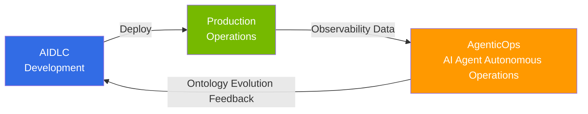

# AgenticOps: AI Agent-Based Autonomous Operations

> **Reading time**: About 2 minutes

AgenticOps is an approach to autonomously build a feedback loop through AI agents for continuous improvement in production environments after developing software with [AIDLC](/docs/aidlc/methodology). While traditional AIOps used AI as a monitoring aid, AgenticOps enables AI agents to autonomously perform **detection → decision → execution** based on observability data.

## Relationship with AIDLC

If AIDLC focuses on **"how to build"** (development methodology), AgenticOps focuses on **"how to operate and improve"** (operational feedback loop). Domain constraints defined by AIDLC's [ontology](/docs/aidlc/methodology/ontology-engineering) are used as criteria for operational decisions by AgenticOps AI agents, and insights discovered during operations are fed back as the Outer Loop for ontology evolution.

## Structure

Reading in the order **1 → 2 → 3** allows you to follow the entire journey from data-based construction to autonomous operations realization.

| Order | Document | Core Question |
|------|------|----------|
| 1 | [Observability Stack](./observability-stack.md) | How do we collect and analyze operational data? |
| 2 | [Predictive Operations](./predictive-operations.md) | How do we predict and prevent failures in advance? |
| 3 | [Autonomous Response](./autonomous-response.md) | How do AI agents respond autonomously? |

## Core Foundation: AWS Open Source Strategy

AWS provides core Kubernetes ecosystem tools as Managed Add-ons (22+) and managed open source services (AMP, AMG, ADOT). On this foundation, **Kiro + MCP (Model Context Protocol)** operates as the core tool for AgenticOps, autonomously controlling EKS clusters, analyzing CloudWatch metrics, and optimizing costs through AWS MCP servers (50+ GA).

## References

- [Proactive EKS Monitoring with CloudWatch](https://aws.amazon.com/blogs/containers/proactive-amazon-eks-monitoring-with-amazon-cloudwatch-operator-and-aws-control-plane-metrics/)
- [AWS MCP Servers (50+ GA)](https://github.com/awslabs/mcp)
- [Kagent - Kubernetes AI Agent](https://github.com/kagent-dev/kagent)
- [Strands Agents SDK](https://github.com/strands-agents/sdk-python)
