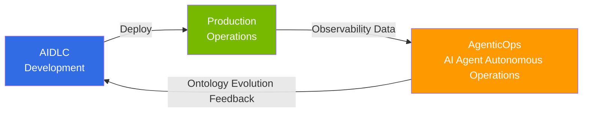

# AgenticOps: AI Agent-Based Autonomous Operations

AgenticOps uses AI agents to turn production telemetry into operational decisions and actions. In the **detection → decision → execution** loop described here, an agent collects evidence, chooses a response, and executes it within predefined guardrails or escalates it for human review. The results feed back into the software developed through [AIDLC](/docs/aidlc/methodology).

## Relationship with AIDLC

AIDLC describes how software is developed; AgenticOps describes how operational evidence informs its maintenance and improvement. Constraints in the [ontology](/docs/aidlc/methodology/ontology-engineering) guide agent decisions. The **Outer Loop** returns findings from production to the people and processes that revise those constraints.

```mermaid
flowchart LR
    DEV["AIDLC<br/>Development"] -->|Deploy| PROD["Production<br/>Operations"]
    PROD -->|Observability Data| AGOPS["AgenticOps<br/>AI Agent Autonomous Operations"]
    AGOPS -->|Ontology Evolution Feedback| DEV

    style DEV fill:#326ce5,color:#fff
    style PROD fill:#76b900,color:#fff
    style AGOPS fill:#ff9900,color:#fff
```

## Structure

Reading in the order **1 → 2 → 3** allows you to follow the entire journey from data-based construction to autonomous operations realization.

| Order | Document | Core Question |
|------|------|----------|
| 1 | [Observability Stack](./observability-stack.md) | How do we collect and analyze operational data? |
| 2 | [Predictive Operations](./predictive-operations.md) | How do we predict and prevent failures in advance? |
| 3 | [Autonomous Response](./autonomous-response.md) | How do AI agents respond autonomously? |

## Core Foundation: AWS Open Source Strategy

AWS provides core Kubernetes ecosystem tools as Managed Add-ons (22+) and managed open source services (AMP, AMG, ADOT). On this foundation, **Kiro + MCP (Model Context Protocol)** operates as the core tool for AgenticOps, autonomously controlling EKS clusters, analyzing CloudWatch metrics, and optimizing costs through AWS MCP servers (50+ GA).

## References

- [Proactive EKS Monitoring with CloudWatch](https://aws.amazon.com/blogs/containers/proactive-amazon-eks-monitoring-with-amazon-cloudwatch-operator-and-aws-control-plane-metrics/)
- [AWS MCP Servers (50+ GA)](https://github.com/awslabs/mcp)
- [Kagent - Kubernetes AI Agent](https://github.com/kagent-dev/kagent)
- [Strands Agents SDK](https://github.com/strands-agents/sdk-python)
