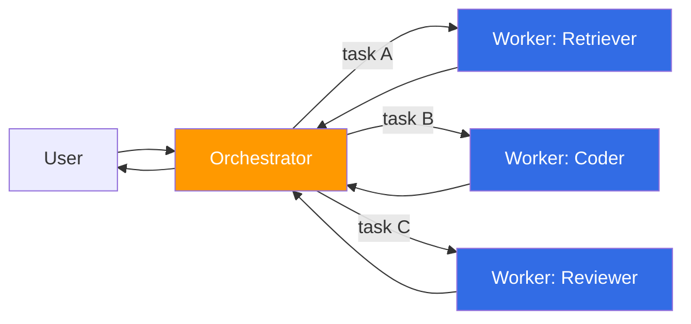
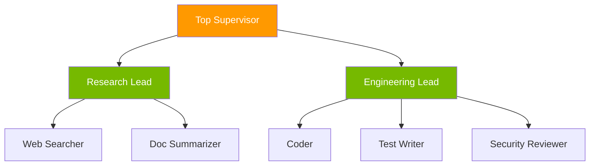
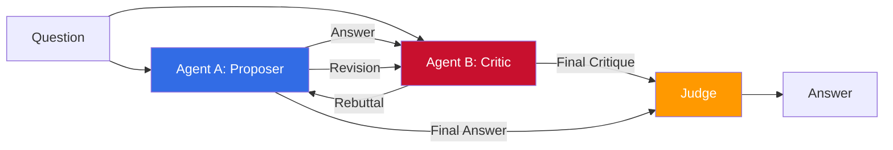
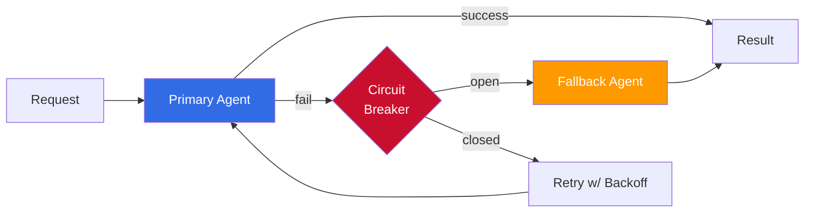
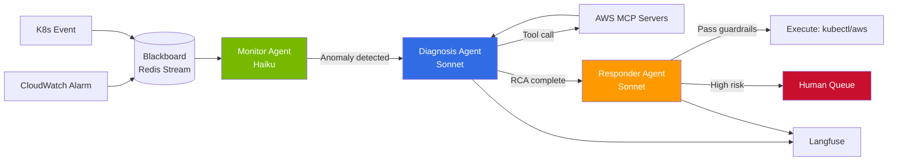

# Multi-Agent Collaboration Patterns

> 📅 **Date**: 2026-04-18 | ⏱️ **Reading Time**: ~15 minutes

---

## 1. Why Multi-Agent?

Single LLM agents quickly reveal their limitations as domains expand and tool usage becomes complex. Key limitations observed in production environments include:

- **Context Window Saturation**: Even Claude Opus 4.7's 1M tokens are quickly exhausted in large monorepos and long sessions, with key context pushed out by summarization loss.
- **Tool Sprawl**: Connecting 20+ MCP tools to a single agent causes tool-choice accuracy to drop sharply (see Anthropic 2024 "Building effective agents").
- **Expertise Range Limits**: Code review, SQL writing, and security analysis require different system prompts and few-shot configurations. Hard to satisfy all with one prompt.
- **Cost-Accuracy Tradeoff**: Using Opus-class models for all subtasks explodes costs; using only Haiku-class increases failure rate in complex reasoning.

Multi-agent systems solve these limitations through **role decomposition**, **scoped context**, and **parallel execution**. However, the following **dysfunctions** must also be explicitly managed.

| Dysfunction | Cause | Mitigation |
|------------|-------|-----------|
| Communication cost | Inter-agent message serialization, mutual re-summarization | Structured shared state, pass only essential fields on handoff |
| Consensus delay | Round repetition in Voting/Debate | Round cap, timebox, early termination condition |
| Token cost explosion | N agents × avg tokens × rounds | Conditional escalation, model tiering (Haiku → Sonnet → Opus) |
| Failure propagation | One agent failure halts entire chain | Circuit breaker, fallback agent, allow partial results |
| Observability complexity | Nested traces, difficult root cause analysis | Langfuse/OTel hierarchy, mandatory `agent_name` span tag |

:::tip Decision Criteria
Introduce multi-agent only when subtasks benefit from **(a) clearly separated roles** or **(b) independent parallel execution**. For linear pipelines, single agent + tool-use is almost always cheaper.
:::

---

## 2. Core Collaboration Patterns

This section organizes 6 patterns repeatedly observed in production. Most systems are hybrids combining 2-3 of these.

### 2.1 Orchestrator-Worker (Router Pattern)

The orchestrator agent receives user requests, decomposes them into sub-tasks, and assigns them to specialized worker agents. It collects worker results and synthesizes the final response.



- **Representative Implementations**: LangGraph Supervisor, Strands Agents Graph, OpenAI Agents SDK Handoff.
- **Best For**: Clearly classifiable domains (SQL / code / search), fixed worker pools.
- **Caution**: Orchestrator easily becomes bottleneck. Fan-out parallelizable sub-tasks with `asyncio.gather` etc.

### 2.2 Hierarchical Supervisor (Manager-Team)

Multi-layer expansion of Orchestrator-Worker. Top-level Supervisor delegates to multiple Team Leads, and each Team Lead manages Specialists.



- **Representative Implementations**: LangGraph Multi-Agent Supervisor, CrewAI `Crew(process=Process.hierarchical, manager_agent=...)`.
- **Best For**: Large-scale tasks requiring 3+ decision layers (e.g., full service refactoring, enterprise doc generation).
- **Caution**: Deeper supervisor hierarchies increase latency and cost. Recommend not exceeding 2-3 levels.

### 2.3 Voting / Ensemble

Send the same question independently to N agents (or models) and conclude by majority vote or weighted average.

- **Techniques**: Self-consistency, Mixture-of-Agents (MoA), majority voting, weighted ensemble.
- **Best For**: Math problems, classification tasks, RAG answer verification with high hallucination risk.
- **Cost**: Exactly N times. Many cases report Haiku × 5 ensemble achieving higher accuracy than Opus × 1.
- **Implementation Tip**: Secure diversity by setting different temperatures per agent or using different prompt templates.

### 2.4 Debate / Adversarial

Two agents critique and rebut each other's answers through rounds, then a third judge agent selects the conclusion.



- **Best For**: Complex reasoning, code defect exploration, policy/ethical judgment.
- **Effect**: Society of Minds and Multi-Agent Debate papers report accuracy improvements vs single agent.
- **Limitation**: Token cost accumulates per round. Typically capped at 2-3 rounds + Judge structure.

### 2.5 Plan-and-Execute

Planner agent establishes overall execution plan first, then Executor agent(s) execute step-by-step. When needed, Re-Planner receives intermediate results and revises the plan.

- **Representative Implementations**: LangChain Plan-and-Execute, OpenAI Deep Research (Planner + Browser + Writer), Claude Code's TodoWrite + executor pattern.
- **Best For**: Long-running tasks (research reports, large-scale refactoring, multi-step data pipelines).
- **Key Point**: Secure cost efficiency by separating planning to high-performance models (Opus, GPT-5 Reasoning) and execution to mid/low-tier models.

### 2.6 Blackboard / Shared Memory

All agents record observations and intermediate results in central storage (blackboard). Each agent autonomously contributes when seeing tasks matching their expertise.

- **Storage**: Redis, Postgres (LangGraph checkpointer), DynamoDB, or file system.
- **Best For**: Long sessions (hours+), async collaboration, environments with frequent agent join/leave.
- **Caution**: Race conditions — guarantee consistency with optimistic locking, version numbers, or event sourcing.

---

## 3. Implementation Framework Comparison (As of 2026-04)

| Framework | Core Abstraction | Language | Key Patterns | License |
|----------|-----------|------|---------|---------|
| **LangGraph** | StateGraph + Node | Python/JS | Supervisor, Swarm, Conditional routing | MIT |
| **CrewAI** | Crew + Agent + Task | Python | Sequential / Hierarchical / Consensus | MIT |
| **AutoGen (v0.4+)** | ConversableAgent + GroupChat | Python | Conversation + Workflow | Apache 2.0 |
| **Strands Agents SDK** | Agent + Graph (Python) | Python | Orchestrator, Handoff | Apache 2.0 |
| **OpenAI Agents SDK** | Agent + Handoff | Python/TS | Orchestrator-Worker, Handoff | Apache 2.0 |
| **Amazon Bedrock AgentCore** | Agent + Action Group | AWS SDK | Managed, MCP native | AWS managed |

### 3.1 LangGraph

Defines state transitions between nodes as a graph based on StateGraph. Most patterns can be implemented in 10-50 lines with `create_react_agent`, `create_supervisor`, and swarm helpers. Deploy via LangGraph Platform (paid) or self-host, with Postgres/Redis checkpointer supporting long-running recovery.

### 3.2 CrewAI

Expresses role-based collaboration with natural language declarations. Provides 3 modes: `Process.sequential`, `Process.hierarchical`, `Process.consensual`, with `manager_agent` configuring hierarchical supervision structure. In production, clear "role / goal / backstory" writing determines quality.

### 3.3 AutoGen (v0.4+)

Microsoft Research framework redesigned in v0.4 based on actor-model. Configures conversational multi-agent with `GroupChat`, `SelectorGroupChat`, `MagenticOne`, with strong integration with code execution environments (Docker, Jupyter).

### 3.4 Strands Agents SDK

Open-source SDK released by AWS in 2025, tightly integrated with Bedrock but also supporting direct OpenAI/Anthropic calls. `Agent` + `Graph` abstraction similar to LangGraph, treats MCP tools as first-class citizens. Strands Agents Handoff has similar design intent as OpenAI Agents SDK handoff.

### 3.5 OpenAI Agents SDK

GA-level SDK released by OpenAI in March 2025 as Swarm successor. Can compose nearly all patterns with 4 primitives: `Agent`, `Runner`, `handoff`, `guardrail`. Fast observability setup with tracing integrated into OpenAI Dashboard.

### 3.6 Amazon Bedrock AgentCore

Provides managed Action Group, Knowledge Base, Guardrails, Memory on top of Agents for Bedrock. MCP native support facilitates external tool integration, suitable for regulated industries with multi-agent execution within IAM/VPC boundaries.

:::tip Framework Selection Guide
- **Rapid Prototyping**: CrewAI or OpenAI Agents SDK
- **Complex State Transitions & Recovery**: LangGraph + Postgres checkpointer
- **AWS Ecosystem Lock-in**: Strands Agents SDK or Bedrock AgentCore
- **Research & Experimentation**: AutoGen v0.4 (easy exploration of various conversation patterns)
:::

### 3.7 Minimal Implementation Example: Supervisor Pattern

```python
# LangGraph — Supervisor routes to either Researcher or Coder
from langgraph.graph import StateGraph, END
from langgraph.prebuilt import create_react_agent
from langchain_anthropic import ChatAnthropic

llm = ChatAnthropic(model="claude-sonnet-4-5")
researcher = create_react_agent(llm, tools=[web_search], name="researcher")
coder = create_react_agent(llm, tools=[execute_python], name="coder")

def supervisor(state):
    decision = llm.invoke([
        {"role": "system", "content": "Route to 'researcher' or 'coder'. Reply with one word."},
        {"role": "user", "content": state["input"]},
    ]).content.strip().lower()
    return {"next": decision}

graph = StateGraph(dict)
graph.add_node("supervisor", supervisor)
graph.add_node("researcher", researcher)
graph.add_node("coder", coder)
graph.set_entry_point("supervisor")
graph.add_conditional_edges("supervisor", lambda s: s["next"],
                             {"researcher": "researcher", "coder": "coder"})
graph.add_edge("researcher", END)
graph.add_edge("coder", END)
app = graph.compile()
```

```python
# CrewAI — Hierarchical Crew
from crewai import Agent, Task, Crew, Process

manager = Agent(role="Engineering Manager",
                goal="Distribute, review, and approve",
                backstory="10-year platform lead")
coder = Agent(role="Coder", goal="Implement features", backstory="...")
reviewer = Agent(role="Reviewer", goal="Code review", backstory="...")

crew = Crew(agents=[coder, reviewer],
            tasks=[Task(description="Implement auth endpoint", agent=coder),
                   Task(description="Review and feedback", agent=reviewer)],
            manager_agent=manager,
            process=Process.hierarchical)
result = crew.kickoff()
```

```python
# OpenAI Agents SDK — Handoff
from agents import Agent, Runner, handoff

triage = Agent(
    name="Triage",
    instructions="Classify questions and route to appropriate agent.",
    handoffs=[
        handoff(Agent(name="BillingBot", instructions="Billing inquiries")),
        handoff(Agent(name="TechBot", instructions="Technical inquiries")),
    ],
)
result = await Runner.run(triage, input="I was charged twice for this invoice.")
```

---

## 4. State Sharing, Conflict Resolution & Failure Recovery

### 4.1 State Sharing Models

| Model | Description | Representative Implementations |
|------|------|---------|
| Shared Memory | Everyone reads/writes central storage | LangGraph `StateGraph`, Redis/Postgres |
| Message Passing | Agent communication via message queue only | AutoGen GroupChat, AWS SQS |
| Blackboard | Event sourcing + subscription | Kafka, EventBridge |
| Handoff Context | Context passed at call time, separated thereafter | OpenAI Agents SDK, Strands Handoff |

In production, **Shared Memory + Handoff Context** combination is most common. Common state (user requests, accumulated results) in shared state, agent-specific work instructions in handoff payload.

### 4.2 Conflict Resolution Strategies

- **Voting**: Majority vote or weighted average. Designate tiebreaker agent for ties.
- **Referee Agent**: Judge makes final decision in Debate pattern.
- **Deterministic Winner Rule**: Hard rules like "security reviewer rejection mandates rework."
- **Priority Queue**: Other agents wait when urgent work is in progress.

### 4.3 Failure Recovery



- **Retry Budget**: Max retries and token budget per agent. Escalate upward when exceeded.
- **Per-Agent Circuit Breaker**: Temporarily block specific agent when consecutive failure rate exceeds threshold.
- **Fallback Agent**: Bypass with simpler prompt + cheaper model. Accept quality degradation to secure availability.
- **Checkpointer Recovery**: Resume from intermediate state with LangGraph/Strands checkpoint feature (essential for long tasks).

---

## 5. Observability (Langfuse + OpenTelemetry)

Multi-agent system traces naturally have hierarchical structure. Correctly representing this in Langfuse/OTel dramatically simplifies debugging and performance analysis.

### 5.1 Trace Hierarchy Design

```
Trace: user-request-<uuid>
└── Span: orchestrator.plan
    ├── Span: worker.retriever
    │   ├── Span: tool.vector_search
    │   └── Span: llm.claude-opus-4-7
    ├── Span: worker.coder
    │   └── Span: llm.sonnet-4-5
    └── Span: judge.reviewer
        └── Span: llm.opus-4-7
```

### 5.2 Essential Span Attributes

Consistently assign the following attributes to each span. These form the basis for dashboard filtering and alerting in operations.

- `agent.name`: Agent identifier (e.g., `retriever`, `coder`, `judge`)
- `agent.role`: Role (e.g., `worker`, `supervisor`, `critic`)
- `agent.model`: Model used (e.g., `claude-opus-4-7`, `gpt-5-reasoning`)
- `handoff.reason`: Handoff reason (when switched to another agent)
- `handoff.from` / `handoff.to`
- `round.index`: Voting/Debate round number
- `tokens.input` / `tokens.output` / `cost.usd`

### 5.3 Langfuse Dashboard Examples

- **Per-Agent Latency p95**: `agent.name` Identify bottlenecks by grouping
- **Handoff Heatmap**: `handoff.from` × `handoff.to` matrix
- **Per-Round Cost**: Debate/Voting pattern cost convergence verification
- **Failure Rate**: `status=error` spans by `agent.name`Aggregate

:::tip OpenTelemetry Integration
Langfuse v3.xoperates as OTel native collector. Using `traceparent` W3C standard in apps connects to AWS X-Ray, Datadog, Grafana Tempo as single trace.
:::

---

## 6. Cost & Latency Patterns

### 6.1 Cost Increase Factors

- **Agent Count N**: Cost is linear to N. Voting is exactly N times.
- **Round Count R**: Debate 2-3rounds basis cost × 2~3 times.
- **Context Accumulation**: Previous responses accumulate in context as rounds progress, input token cost increases nonlinearly.
- **Tool Call Chain**: tool-use responses also enter LLM again, incurring cost.

### 6.2 Cost Optimization Checklist

| Item | Technique |
|------|------|
| Model Tiering | Planner=Opus, Worker=Sonnet, Summarizer=Haiku |
| Prompt Caching | Claude prompt caching, OpenAI prompt cachingReuse system prompts with |
| Conditional Escalation | Start simple tasks with Haiku, call higher model if confidence low |
| Parallel Execution | Shorten latency with `asyncio.gather`/`Promise.all`for independent sub-tasks |
| Intermediate Result Summarization | Compress context by periodically summarizing long conversation history |
| Early Termination | Cancel remainder when majority secured in Voting |

### 6.3 Latency Optimization

- **Streaming Handoff**: Next agent starts processing from first token (speculative execution).
- **Fan-out then first-wins**: NSimultaneous requests to N agents, use first reliable response to arrive.
- **Prewarming**: Keep frequently-used agents in idle state (session cache).

---

## 7. AIDLC Stage-by-Stage Application

AIDLCThis section organizes how multi-agent patterns apply at each AIDLC stage.

### 7.1 Inception (Conception & Planning)

- **Planner Agent**: Transform ambiguous requirements into structured backlog.
- **Critic Agent**: Critically review planner outputs to identify gaps/contradictions.
- Combination: Plan-and-Execute + Debate hybrid.

### 7.2 Construction (Development & Verification)

- **Coder Agent**: Feature implementation (Sonnet).
- **Reviewer Agent**: Code review (Opus, can separate security/quality).
- **Test Writer Agent**: Test generation and execution.
- Combination: Orchestrator-Worker, Hierarchical Supervisor.

### 7.3 Operations (AgenticOps)

- **Monitor Agent**: Continuous observability data analysis (Haiku).
- **Diagnosis Agent**: Root cause analysis when anomalies detected (Sonnet).
- **Responder Agent**: Automatic recovery within predefined guardrails (Sonnet/Opus).
- **Human Escalation Agent**: Route risky changes to approval queue.
- Combination: [Autonomous Response](./autonomous-response.md)Detailed in Blackboard + Orchestrator-Worker.

:::tip Common Principles Across AIDLC
- Map all agent outputs from all stages to [Ontology](/docs/aidlc/methodology/ontology-engineering) for consistent vocabulary.
- Inter-stage handoffs mediated by artifacts (PRD, ADR, RCA docs) — context not lost even when agent sessions end.
:::

---

## 8. Case Study: AgenticOps Autonomous Response Pipeline

Example of applying multi-agent patterns to actual EKS incident response. [Autonomous Response](./autonomous-response.md) document implements the 3 stages (Detection → Judgment → Execution) with agents.

### 8.1 Architecture



### 8.2 Roles and Model Tiering

| Agent | Model | Avg Calls/Hour | Monthly Cost (Estimate) |
|---------|------|-------------|------------|
| Monitor | claude-haiku-4-5 | 3,600 | ~$20 |
| Diagnosis | claude-sonnet-4-5 | 50 | ~$30 |
| Responder | claude-sonnet-4-5 + Opus escalation | 30 | ~$40 |
| Judge (risky action approval) | claude-opus-4-7 | 5 | ~$15 |

Opusfor Monitor would be monthly $1,000+ spike. Tiering alone 95% cost reduction.

### 8.3 Handoff Contract

Payload passed between agents is strictly defined with JSON Schema.

```json
{
  "incident_id": "inc-20260418-0042",
  "from_agent": "diagnosis",
  "to_agent": "responder",
  "severity": "P2",
  "root_cause": "Pod OOMKilled — memory limit 512Mi, actual peak 780Mi",
  "evidence": {
    "metrics": ["container_memory_working_set_bytes"],
    "logs": ["OOMKilled at 2026-04-18T10:32:15Z"],
    "affected_resources": ["deploy/api-gateway", "ns/prod"]
  },
  "proposed_action": {
    "type": "patch_deployment",
    "changes": {"spec.template.spec.containers[0].resources.limits.memory": "1Gi"}
  },
  "risk_level": "low",
  "requires_human_approval": false
}
```

This schema maps 1:1 to `Incident`, `Resource`, `Action` entities, ensuring vocabulary consistency between agents.

### 8.4 Results (3 Months Operation)

- **MTTR**: 112 min → 6 min (95% reduction)
- **Autonomous Resolution Rate**: of all incidents 68%
- **Human Escalation**: 32% (High risk + new patterns)
- **False positive**: 3% or less (Guardrail + Judge combination effect)

---

## 9. Anti-patterns: Learning from Failures

### 9.1 God Agent

Pattern of cramming all tools and knowledge into one agent. Initially convenient but tool-choice accuracy plummets when tools exceed 15.

- **Symptoms**: System prompt exceeds 2,000 tokens, tools exceed 20.
- **Solution**: Separate agents by domain + Orchestrator-Worker introduction.

### 9.2 Infinite Handoff Loop

A → B → A → B → ... Ping-pong. Each agent judges it is not their role and keeps passing.

- **Symptoms**: Same handoff pair repeats 3+ times in same trace.
- **Solution**: Set handoff hop limit, escalate when loop detected.

### 9.3 Voting Without Consensus

Even number agents for Voting configuration → tie → cannot process.

- **Solution**: odd number Agent configure, or tiebreaker Agent separate designate.

### 9.4 Shared State Race Condition

Two agents simultaneously update same blackboard field, one side result lost.

- **Solution**: Optimistic locking (version number), CRDT, or event sourcing.

### 9.5 Observability Gap

Agent internal LLM calls appear in trace but inter-agent handoffs separated into different traces, cause tracking impossible.

- **Solution**: `traceparent` header propagation, all agents add spans to same root trace.

### 9.6 Prompt Injection Propagation

Injection contained in user input passed as-is from one agent to next and interpreted as system command.

- **Solution**: Sanitize input at Gateway layer, pass inter-agent handoff payload only as user/tool role not system role.

---

## 10. Operations Best Practices Checklist

Checklist items before putting multi-agent system into production.

- [ ] **Clear Role Boundaries**: Specify each agent responsibility scope and "what not to do" in system prompt.
- [ ] **Document Handoff Conditions**: Record as decision tree who to hand off to in what situations.
- [ ] **Common Guardrails Layer**: Perform PII masking, prompt injection defense, output schema validation at gateway layer not each agent.
- [ ] **Cost/Latency Limits**: Hard limits on max tokens per request, max rounds, max execution time.
- [ ] **Standardize Observability Attributes**: `agent.name`, `agent.role`, `handoff.reason`mandatory on all spans.
- [ ] **Define Failure Paths**: What to show user when agent fails (partial result / error / retry guidance).
- [ ] **Pin Model Versions**: Pinned version + canary rollout to prevent regression on model updates.
- [ ] **Test Suite**: Individual agent tests, full system E2E tests (LangSmith, Langfuse experiments).
- [ ] **Human-on-the-Loop Entry Point**: Cancel/modify API allowing human intervention even during autonomous execution.
- [ ] **Audit Log Immutability**: all agent decision rationale(prompt + response + tool call) in write-once storage.

---

## 11. References

### Framework Official Documentation

- [LangGraph](https://langchain-ai.github.io/langgraph/) — StateGraph, Supervisor, Swarm tutorials
- [CrewAI](https://docs.crewai.com/) — Sequential/Hierarchical process guide
- [AutoGen](https://microsoft.github.io/autogen/) — v0.4 actor model, GroupChat
- [Strands Agents SDK](https://github.com/strands-agents/sdk-python) — AWS open-source SDK
- [OpenAI Agents SDK](https://openai.github.io/openai-agents-python/) — Handoff, Guardrails
- [Amazon Bedrock Agents](https://docs.aws.amazon.com/bedrock/latest/userguide/agents.html) — Action Group, Knowledge Base

### Papers & Blogs

- Anthropic, ["Building effective agents"](https://www.anthropic.com/research/building-effective-agents) (2024) — pattern source
- OpenAI, ["Introducing Deep Research"](https://openai.com/index/introducing-deep-research/) (2025) — Plan-and-Execute case
- OpenAI, ["Swarm: experimental framework"](https://github.com/openai/swarm) (2024) — Agents SDK predecessor
- Du et al., ["Improving Factuality and Reasoning in Language Models through Multiagent Debate"](https://arxiv.org/abs/2305.14325) (2023)
- Wang et al., ["Mixture-of-Agents Enhances Large Language Model Capabilities"](https://arxiv.org/abs/2406.04692) (2024)

### Related Documentation

- [Autonomous Response](./autonomous-response.md) — AgenticOps Agent-Driven pattern practical application
- [Observability Stack](./observability-stack.md) — Langfuse + OTel details
- [Ontology Engineering](/docs/aidlc/methodology/ontology-engineering) — common agent vocabulary
