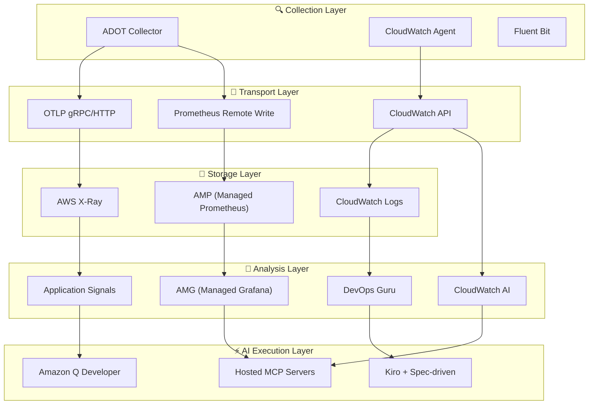
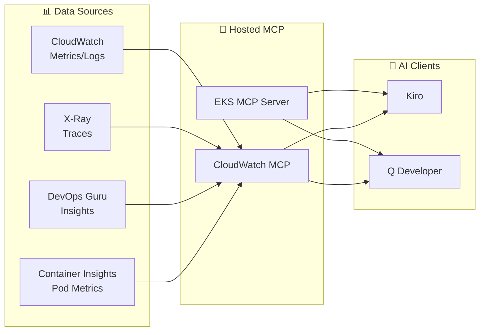
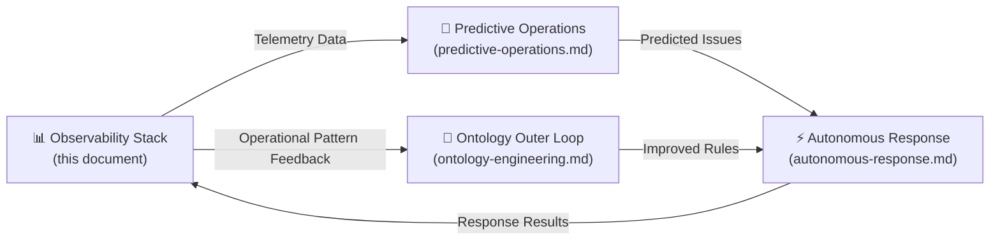

import { ObservabilityPillars, ArchitectureLayers, StackSelectionPatterns } from '@site/src/components/ObservabilityStackTables';

# Observability Stack

> **The data foundation of AIDLC Operations** — building operational intelligence through 3-Pillar telemetry + AI analysis layer

---

## 1. Overview

### 1.1 Why Observability is the Data Foundation of AgenticOps

**Observability** is the ability to understand a system's internal state through external outputs (metrics, logs, traces). In EKS environments with hundreds of Pods, complex service meshes, and dynamic scaling, traditional monitoring alone makes it difficult to identify root causes.

**Role of observability in the AgenticOps context**:

- **[Predictive Operations](./predictive-operations.md)**: Learning historical telemetry patterns → predicting future issues
- **[Autonomous Response](./autonomous-response.md)**: Real-time metric-based auto-scaling and self-healing
- **[Ontology Engineering](../methodology/ontology-engineering.md) Outer Loop**: Feeding operational data back for continuous ontology improvement

:::tip AIDLC Reliability Dual Axis
The observability stack serves as the **Harness of AIDLC reliability**. While ontology defines "what is the right behavior," observability validates "is it actually working correctly." Together they form the reliability dual axis (Ontology × Harness).
:::

### 1.2 3-Pillar Observability + AI Analysis Layer

<ObservabilityPillars />

**AI Analysis Layer Addition**:
- **CloudWatch AI Natural Language Queries**: Analysis in natural language without PromQL/Logs Insights syntax
- **CloudWatch Investigations**: AI-based root cause analysis automation when alarms trigger
- **DevOps Guru**: ML-based anomaly detection and insights
- **MCP Integration**: AI Agents (Kiro/Q Dev) directly query and analyze observability data

### 1.3 Core Challenges of EKS Observability

- **Dynamic Infrastructure**: Pods frequently created/deleted, dynamic node provisioning by Karpenter
- **Microservice Complexity**: Complex service call chains making failure propagation paths difficult to trace
- **Multi-layer Issues**: Multi-tier structure including application, container, node, network, and AWS services
- **Cost Optimization**: Right-sizing through resource usage pattern analysis
- **Compliance**: Audit logs, access records, and other compliance requirements

---

## 2. 5-Layer Observability Architecture

### 2.1 Layer Structure

<ArchitectureLayers />

**Data Flow**:



### 2.2 Core Role by Layer

**1. Collection Layer**:
- **ADOT (OpenTelemetry)**: Unified collection of metrics, logs, traces, CNCF standard
- **CloudWatch Agent**: Container Insights Enhanced, Application Signals
- **Fluent Bit**: High-performance log forwarding

**2. Transport Layer**:
- **OTLP (OpenTelemetry Protocol)**: Vendor-neutral standard protocol
- **Prometheus Remote Write**: Long-term metric storage
- **CloudWatch API**: AWS native integration

**3. Storage Layer**:
- **AMP**: Long-term metric storage (150 days), PromQL support
- **CloudWatch Logs**: Log centralization, Insights queries
- **X-Ray**: Distributed tracing storage

**4. Analysis Layer (AI Analysis)**:
- **AMG**: Grafana dashboards (AMP/CW/XRay integration)
- **CloudWatch AI**: Natural language queries + Investigations (root cause analysis)
- **DevOps Guru**: ML-based anomaly detection
- **Application Signals**: Zero-code instrumentation service map

**5. AI Execution Layer (Action)**:
- **MCP Servers**: Provide observability data to AI Agents
- **Kiro**: Spec-driven autonomous response (IaC code generation)
- **Q Developer**: Conversational operations support

### 2.3 Observability Stack Selection Patterns

<StackSelectionPatterns />

:::tip ADOT (OpenTelemetry) Collection Layer
Regardless of which backend you choose, **using ADOT as the collection layer provides freedom in backend replacement**. Since OpenTelemetry is a CNCF standard, data can be exported to most backends including Prometheus, Datadog, and Sumo Logic. This is why AWS provides OpenTelemetry as a Managed Add-on (ADOT) instead of its own agent.
:::

---

## 3. AWS Managed Observability Stack

### 3.1 Building on Managed Add-ons

**EKS Managed Add-ons** eliminate operational complexity by having AWS manage installation, upgrades, and patches for observability agents.

| Add-on | Role | Version Example |
|--------|------|----------|
| **adot** | ADOT Collector (OpenTelemetry) | v0.40.0-eksbuild.1 |
| **amazon-cloudwatch-observability** | Container Insights + Application Signals | v2.2.0-eksbuild.1 |

**Installation Example**:

```bash
# ADOT Add-on
aws eks create-addon \
  --cluster-name my-cluster \
  --addon-name adot \
  --addon-version v0.40.0-eksbuild.1 \
  --service-account-role-arn arn:aws:iam::ACCOUNT_ID:role/adot-collector-role

# CloudWatch Observability Add-on
aws eks create-addon \
  --cluster-name my-cluster \
  --addon-name amazon-cloudwatch-observability \
  --service-account-role-arn arn:aws:iam::ACCOUNT_ID:role/cloudwatch-agent-role
```

:::info ADOT vs Self-Deployed OpenTelemetry
When using ADOT Add-on:
- Automatic OpenTelemetry Operator installation
- Built-in AWS service authentication (SigV4)
- AWS guarantees EKS version compatibility
- 80% reduction in operational burden vs self-deployment
:::

### 3.2 AMP + AMG Integration

**Amazon Managed Prometheus (AMP)**:
- 150-day long-term metric retention (60% cost savings vs self-hosted)
- Full PromQL compatibility
- Auto-scaling (unlimited throughput)

**Amazon Managed Grafana (AMG)**:
- Automatic management of latest Grafana v11.x
- Integrated AMP/CloudWatch/X-Ray data sources
- Built-in SAML/SSO authentication

**Data Flow**:

```
ADOT Collector → Prometheus Remote Write → AMP
                                            ↓
AMG ← PromQL Query ← Grafana Dashboard
```

### 3.3 Observability Backend Comparison

| Backend | Advantages | Disadvantages | Suitable Scenarios |
|--------|------|------|--------------|
| **AWS Native (AMP+AMG+CW)** | EKS integration optimized, IAM auth, minimal management | Multi-cloud disadvantaged | AWS-centric infrastructure |
| **OSS (Prometheus+Grafana)** | Full control, cost transparency | Operational burden (HA, storage management) | Self-operation capability available |
| **3rd Party (Datadog)** | Unified platform, rich dashboards | High cost, vendor lock-in | Multi-cloud environments |

---

## 4. Container Insights Enhanced + Application Signals

### 4.1 Container Insights Enhanced

In **EKS 1.28+**, Enhanced Container Insights provides deep observability including **Control Plane metrics**.

**Collected Metric Scope**:
- **Pod Metrics**: CPU, memory, network, disk I/O
- **Node Metrics**: Resource utilization, Kubelet status
- **Control Plane Metrics** (EKS 1.28+):
  - **API Server**: `apiserver_request_total`, `apiserver_request_duration_seconds`
  - **etcd**: `etcd_db_total_size_in_bytes`, `etcd_server_slow_apply_total`
  - **Scheduler**: `scheduler_schedule_attempts_total`, `scheduler_scheduling_duration_seconds`
  - **Controller Manager**: `workqueue_depth`, `workqueue_adds_total`

:::warning Cost Considerations
Enhanced Container Insights incurs additional costs of $50-200/month. Recommended to use basic Container Insights for dev/staging, Enhanced only for production.
:::

### 4.2 Application Signals

**Zero-code instrumentation** automatically generates service maps, SLI/SLO, and call graphs for applications.

**Supported Languages**:
- **Java**: Spring Boot, Tomcat, Jetty (auto-instrumentation)
- **Python**: Django, Flask, FastAPI (auto-instrumentation)
- **.NET**: ASP.NET Core (auto-instrumentation)
- **Node.js**: Express, Nest.js (manual instrumentation)

**Auto-generated Items**:
- **Service Map**: Visualize inter-service call relationships (with error rates and latency)
- **SLI Auto-configuration**: Automatically measure availability (error rate), latency (P99), throughput
- **SLO Configuration**: Set targets based on SLIs (e.g., 99.9% availability, P99 < 500ms)

**Activation Method**:

```yaml
# Auto-instrumentation by just adding Pod annotation
apiVersion: apps/v1
kind: Deployment
metadata:
  name: my-java-app
spec:
  template:
    metadata:
      annotations:
        instrumentation.opentelemetry.io/inject-java: "app-signals"
    spec:
      containers:
        - name: app
          image: my-java-app:latest
```

---

## 5. CloudWatch AI Natural Language Queries + Investigations

### 5.1 CloudWatch AI Natural Language Queries

Enables **analysis in natural language without PromQL or Logs Insights syntax**.

**Actual Query Examples**:

```
Question: "Which EKS nodes exceeded 80% CPU usage in the last hour?"
→ Automatically generates CloudWatch Metrics Insights query

Question: "When did payment-service have the most 5xx errors?"
→ Automatically generates CloudWatch Logs Insights query

Question: "Which services have slower API response times today vs yesterday?"
→ Automatically generates comparison analysis query
```

**Regional Availability (GA August 2025)**:
- **Local Processing**: us-east-1, us-east-2, us-west-2, ap-northeast-1, ap-southeast-1/2, eu-central-1, eu-west-1, eu-north-1
- **Cross-Region Processing**: ap-east-1 (Hong Kong) → prompt sent to US regions

### 5.2 CloudWatch Investigations

**AI-based root cause analysis tool** that automatically collects and analyzes related metrics, logs, and traces when alarms trigger.

**Analysis Process**:
1. **Alarm Trigger**: CloudWatch Alarm or DevOps Guru insight occurs
2. **Context Collection**: Automatically collect related metrics, logs, traces, configuration change history
3. **AI Analysis**: AI analyzes collected data to infer root cause
4. **Timeline Generation**: Organize event sequence chronologically
5. **Recommended Actions**: Present specific solutions

**Output Example**:

```
[CloudWatch Investigation Result]
━━━━━━━━━━━━━━━━━━━━━━━━━━━━━━━━━━
📋 Investigation Summary: payment-service latency increase

⏱️ Timeline:
  14:23 - RDS connection pool utilization spike (70% → 95%)
  14:25 - payment-service P99 latency 500ms → 2.3s
  14:27 - Downstream order-service also affected
  14:30 - CloudWatch Alarm triggered

🔍 Root Cause:
  RDS instance (db.r5.large) connection count approaching
  max_connections, causing new connection creation delays

📌 Recommended Actions:
  1. Upgrade RDS instance class or adjust max_connections
  2. Optimize connection pooling library (HikariCP/PgBouncer) settings
  3. Consider RDS Proxy adoption
━━━━━━━━━━━━━━━━━━━━━━━━━━━━━━━━━━
```

:::tip Investigation + Hosted MCP
CloudWatch Investigations results can be queried directly in Kiro through **Hosted MCP servers**. "Any ongoing Investigations?" → MCP returns Investigation status → Kiro automatically generates response code. This is the complete **AI analysis → automated response** loop.
:::

---

## 6. MCP Server-Based Integrated Analysis

### 6.1 Changes MCP Brings to Observability

Previously, diagnosing issues required opening CloudWatch console, Grafana dashboards, and X-Ray console separately. Using **AWS MCP servers** (individual local 50+ GA or Fully Managed Preview) enables **unified querying of all observability data in Kiro/Q Developer**.



### 6.2 EKS MCP Server Key Tools

| Tool | Function | Usage Example |
|------|------|----------|
| **list_pods** | Query Pod list by namespace | "What's the Pod status in payment namespace?" |
| **get_pod_logs** | Query Pod logs (tail support) | "What are the last 100 lines of payment-xxx Pod logs?" |
| **describe_node** | Node details and resource utilization | "What's the CPU/memory status of node i-0abc123?" |
| **query_metrics** | CloudWatch metrics query | "What's the RDS connection count trend?" |
| **get_insights** | DevOps Guru insights query | "What are the current active insights?" |
| **get_investigation** | CloudWatch Investigation results | "What's the result of investigation INV-xxxx?" |

### 6.3 Integrated Analysis Scenario

**Scenario: Report of "payment-service is slow"**

Integrated analysis process in Kiro through MCP:

```
[Kiro + MCP Integrated Analysis]

1. EKS MCP: list_pods(namespace="payment") → 3/3 Running, 0 Restarts ✓
2. EKS MCP: get_pod_logs(pod="payment-xxx", tail=100) → Multiple DB timeout errors
3. CloudWatch MCP: query_metrics("RDSConnections") → Connection count reached 98%
4. CloudWatch MCP: get_insights(service="payment") → DevOps Guru insight exists
5. CloudWatch MCP: get_investigation("INV-xxxx") → Confirmed RDS connection pool saturation

→ Kiro automatically:
   - Generate IaC code for RDS Proxy adoption
   - Create PR for HikariCP connection pool settings optimization
   - Adjust Karpenter NodePool (memory-based scaling)
```

:::info Programmatic Observability Automation
The core value of MCP is **unifying multiple data sources through a single interface**. By giving AI Agents access to CloudWatch metrics, X-Ray traces, EKS API, and DevOps Guru insights at once, diagnosis becomes faster and more accurate than manually navigating multiple consoles.
:::

---

## 7. SLO/SLI + Alert Optimization

### 7.1 Alert Fatigue Problem

Alert fatigue is a serious operational issue in EKS environments:

- **Average EKS cluster**: 50-200 alerts per day
- **Alerts requiring actual action**: 10-15% of total
- **Alert Fatigue result**: Important alerts ignored, delayed incident response

### 7.2 SLO-Based Alert Strategy

Configuring alerts based on **SLO (Service Level Objectives)** significantly reduces Alert Fatigue.

**Error Budget Concept**:

| Item | Description | Example (SLO 99.9%) |
|------|------|------------------|
| **SLO (Target)** | Availability target the service must achieve | 99.9% (43 min downtime allowed/month) |
| **SLI (Indicator)** | Actual measured availability | 99.95% (current measurement) |
| **Error Budget** | Allowable failure budget | 0.1% (43 min/month) |
| **Error Budget Burn Rate** | Rate at which Error Budget is consumed | 50% consumed in 2 hours → quick intervention needed |

**SLO-Based Alert Example**:

```yaml
# Error Budget burn rate-based alert
apiVersion: monitoring.coreos.com/v1
kind: PrometheusRule
metadata:
  name: payment-service-slo
spec:
  groups:
    - name: slo.payment-service
      rules:
        # SLI: Error rate
        - record: sli:payment_error_rate:5m
          expr: |
            sum(rate(http_requests_total{service="payment",status=~"5.."}[5m]))
            / sum(rate(http_requests_total{service="payment"}[5m]))

        # Error Budget burn rate (1-hour window)
        - alert: PaymentErrorBudgetBurn
          expr: |
            sli:payment_error_rate:5m > (1 - 0.999) * 14.4
          for: 5m
          labels:
            severity: critical
            service: payment
          annotations:
            summary: "Payment service Error Budget burning fast"
            description: "Current error rate consuming Error Budget at 14.4x rate"
```

### 7.3 CloudWatch Composite Alarms

Logically combine multiple alarms to reduce noise.

```bash
# Alert only when both CPU AND Memory are high
aws cloudwatch put-composite-alarm \
  --alarm-name "EKS-Node-Resource-Pressure" \
  --alarm-rule 'ALARM("EKS-Node-HighCPU") AND ALARM("EKS-Node-HighMemory")' \
  --alarm-actions "arn:aws:sns:ap-northeast-2:ACCOUNT_ID:ops-team"
```

### 7.4 Alert Optimization Checklist

| Item | Current Problem | After Optimization |
|------|----------|----------|
| **Alert Frequency** | 200/day | 20-30/day (90% reduction) |
| **False Positive** | 85% | 15% (85% accuracy) |
| **Average Response Time** | 45 min | 5 min (90% reduction) |
| **Alert Fatigue** | High (important alerts ignored) | Low (immediate response) |

**Optimization Strategies**:
- ✅ Transition to SLO-based alerts (minimize resource threshold alerts)
- ✅ Use Composite Alarms (combine multiple conditions)
- ✅ Alert aggregation (consolidate duplicate alerts within 5-min window to 1)
- ✅ Redefine severity levels (Critical: 50% Error Budget consumed, Warning: 20% consumed)
- ✅ Set quiet hours (maintenance windows, deployment periods)

### 7.5 Log Cost Optimization

**CloudWatch Logs Pricing** (ap-northeast-2):
- **Ingestion**: $0.50/GB
- **Storage (Standard)**: $0.03/GB/month
- **Storage (Infrequent Access)**: $0.01/GB/month (70% savings)
- **Analysis (Insights queries)**: $0.005/GB scanned

**Cost Optimization Strategies**:

```bash
# Change log group to Infrequent Access
aws logs put-log-group-policy \
  --log-group-name /eks/my-cluster/application \
  --policy-name InfrequentAccessPolicy

# Automate S3 Export (move to S3 after 7 days)
aws logs create-export-task \
  --log-group-name /eks/my-cluster/application \
  --destination-bucket eks-logs-archive \
  --destination-prefix logs/
```

**50-node Cluster Cost Comparison**:
- **Before Optimization**: $1,500-3,000/month (all CloudWatch Logs)
- **After Optimization**: $400-600/month (7-day CW + long-term S3)
- **Savings**: $1,100-2,400/month (70%+ savings)

---

## 8. Conclusion

### 8.1 AIDLC Operations Integration Flow



**Key Integration Points**:
- **Observability → Prediction**: Learn historical telemetry patterns → predict future issues
- **Prediction → Autonomous**: Automatically handle predicted issues (scaling, self-healing)
- **Autonomous → Observability**: Feed response results back to observability stack
- **Observability → Ontology**: Continuously improve ontology by analyzing operational data

### 8.2 Next Steps

1. **[Predictive Operations](./predictive-operations.md)**: DevOps Guru ML-based anomaly detection and predictive scaling
2. **[Autonomous Response](./autonomous-response.md)**: Kiro + Spec-driven autonomous response patterns
3. **[Ontology Engineering](../methodology/ontology-engineering.md)**: Integrate operational feedback into ontology

### 8.3 References

**AWS Official Documentation**:
- [Amazon EKS Observability Best Practices Guide](https://aws-observability.github.io/observability-best-practices/)
- [ADOT (AWS Distro for OpenTelemetry) Documentation](https://aws-otel.github.io/docs/introduction)
- [CloudWatch Container Insights for EKS](https://docs.aws.amazon.com/AmazonCloudWatch/latest/monitoring/ContainerInsights.html)
- [CloudWatch Application Signals](https://docs.aws.amazon.com/AmazonCloudWatch/latest/monitoring/CloudWatch-Application-Signals.html)
- [AWS MCP Servers](https://github.com/aws/mcp-servers)

**Community Resources**:
- [OpenTelemetry Operator for Kubernetes](https://opentelemetry.io/docs/kubernetes/operator/)
- [Prometheus Operator Documentation](https://prometheus-operator.dev/)
- [SLO Calculator (Google SRE)](https://sre.google/workbook/implementing-slos/)

---

> **Next**: [Predictive Operations](./predictive-operations.md) — DevOps Guru ML-based anomaly detection and predictive scaling strategies
