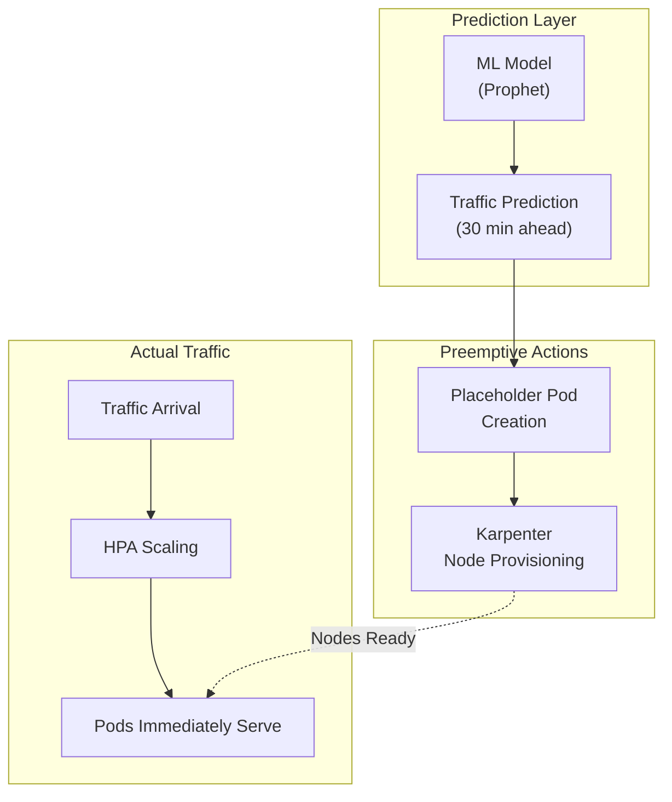
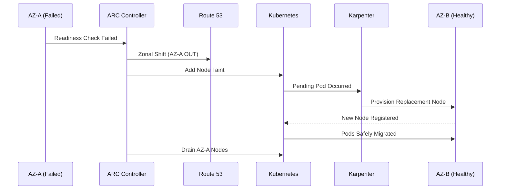
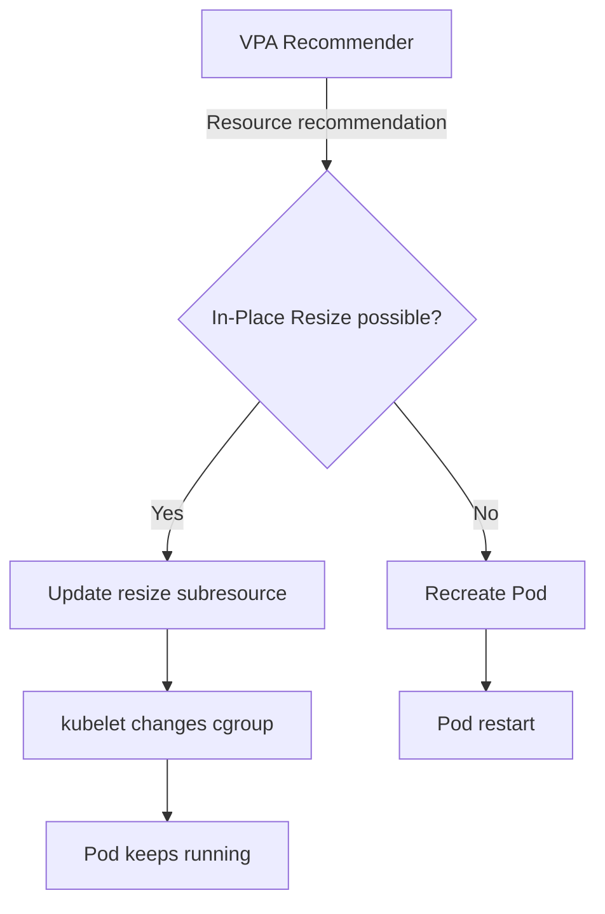

import { ScalingComparison, MLModelComparison, MaturityTable } from '@site/src/components/PredictiveOpsTables';

# Predictive Operations

> **Core**: From reactive to predictive operations — ML-based predictive scaling, anomaly detection, and automatic optimization

---

## 1. Overview

### From Reactive to Predictive

Traditional EKS operations are **reactive**. HPA starts scaling **after** CPU/memory exceeds thresholds, so users are already impacted when traffic spikes.

**Predictive Operations** uses ML models to learn traffic patterns and **scales out proactively before increases**, maintaining service quality.

```
Reactive Scaling Problem:
  HPA threshold exceeded → scale-out begins → Pod startup 30s-2min
  Karpenter node provisioning → 1-3min additional delay
  → Performance degradation period → user impact

Predictive Scaling Solution:
  ML prediction (30 min ahead) → preemptive scale-out → actual traffic arrives
  → Nodes/Pods ready → no performance degradation
```

### Core Value

- **Minimize User Impact**: Eliminate cold start delays
- **Cost Efficiency**: No need for excessive spare resources, expand only when needed
- **Complex Failure Response**: Multi-dimensional anomaly detection, not single metrics
- **Automatic Optimization**: Resource right-sizing automation with VPA + AI

---

## 2. ML-Based Predictive Scaling

### 2.1 HPA Limitations

HPA (Horizontal Pod Autoscaler) only reacts to **current metrics**, causing structural limitations.

<ScalingComparison />

```
[HPA Reactive]
Traffic ████████████████████████░░░░░░░░░
                      ↑ threshold exceeded
Pods    ██████████░░░░████████████████████
                  ↑ scale-out starts (delayed)
User    ✓✓✓✓✓✓✓✓✗✗✗✓✓✓✓✓✓✓✓✓✓✓✓✓✓✓
Experience        ↑ performance degradation

[ML Predictive]
Traffic ████████████████████████░░░░░░░░░
             ↑ prediction point (30 min ahead)
Pods    ██████████████████████████████████
             ↑ preemptive scale-out
User    ✓✓✓✓✓✓✓✓✓✓✓✓✓✓✓✓✓✓✓✓✓✓✓✓✓✓
Experience (no degradation)
```

### 2.2 Time Series Prediction Models

Representative ML models for predicting EKS workload traffic patterns:

<MLModelComparison />

**Model Selection Guide**:
- **Strong periodicity workloads** (daily/weekly patterns): Prophet
- **Trend-focused**: ARIMA
- **Complex non-linear patterns**: LSTM

### 2.3 Implementation Pattern

```python
# Prophet-based traffic prediction example
from prophet import Prophet
import pandas as pd

def predict_scaling(metrics_df, forecast_hours=2):
    """Predict future traffic with Prophet"""
    df = metrics_df.rename(columns={'timestamp': 'ds', 'value': 'y'})
    
    model = Prophet(
        changepoint_prior_scale=0.05,
        seasonality_mode='multiplicative',
        daily_seasonality=True,
        weekly_seasonality=True
    )
    model.fit(df)
    
    future = model.make_future_dataframe(periods=forecast_hours * 12, freq='5min')
    forecast = model.predict(future)
    
    return forecast[['ds', 'yhat', 'yhat_upper', 'yhat_lower']]

def calculate_required_pods(predicted_rps, pod_capacity_rps=100):
    """Calculate required Pod count based on predicted RPS"""
    # Use upper bound (yhat_upper) for safety margin
    required = int(predicted_rps / pod_capacity_rps) + 1
    return max(required, 2)
```

**Automation Pattern**:
- Run predictions every 15 minutes with CronJob
- Collect last 7 days metrics from AMP
- Expose prediction results as Prometheus Custom Metric
- HPA or KEDA scales based on Custom Metric

---

## 3. Karpenter + AI Prediction

### 3.1 Karpenter Basic Operation

Karpenter detects Pending Pods and performs **Just-in-Time** node provisioning. However, node startup takes 1-3 minutes.

### 3.2 AI Prediction-Based Preemptive Provisioning

Combining with ML predictions enables **preparing nodes in advance**.



**Preemptive Provisioning Pattern**:

```yaml
# Placeholder Pods to reserve nodes preemptively
apiVersion: apps/v1
kind: Deployment
metadata:
  name: capacity-reservation
  namespace: scaling
spec:
  replicas: 0  # Dynamically adjusted by prediction scaler
  selector:
    matchLabels:
      app: capacity-reservation
  template:
    metadata:
      labels:
        app: capacity-reservation
    spec:
      priorityClassName: capacity-reservation  # Low priority
      terminationGracePeriodSeconds: 0
      containers:
        - name: pause
          image: registry.k8s.io/pause:3.9
          resources:
            requests:
              cpu: "1"
              memory: 2Gi
---
apiVersion: scheduling.k8s.io/v1
kind: PriorityClass
metadata:
  name: capacity-reservation
value: -10  # Evicted by actual workloads
globalDefault: false
description: "For Karpenter preemptive node provisioning"
```

**How It Works**:
1. ML model predicts traffic increase in 30 minutes
2. Increase Placeholder Pod replicas
3. Karpenter detects Pending Pods and provisions nodes
4. When actual traffic arrives, HPA creates actual Pods
5. Placeholder Pods evicted immediately due to low priority
6. Pods scheduled immediately as nodes already ready

### 3.3 ARC + Karpenter Integration (AZ Failure Auto-Evacuation)

**ARC (Application Recovery Controller)** automatically detects AZ failures and moves traffic to healthy AZs. Integration with Karpenter enables **node-level auto-recovery**.



---

## 4. CloudWatch Anomaly Detection

### 4.1 Anomaly Detection Bands

CloudWatch Anomaly Detection uses ML to automatically learn **normal range bands** for metrics and detects anomalies outside the bands.

```bash
# Create Anomaly Detection model
aws cloudwatch put-anomaly-detector \
  --namespace "ContainerInsights" \
  --metric-name "pod_cpu_utilization" \
  --dimensions Name=ClusterName,Value=my-cluster \
  --stat "Average"
```

### 4.2 EKS Application Patterns

**Key Metrics**:
- `pod_cpu_utilization`: CPU utilization (detect spikes outside normal patterns)
- `pod_memory_utilization`: Early memory leak detection
- `pod_network_rx_bytes`: Abnormal network traffic detection
- `pod_restart_count`: Restart pattern anomaly detection
- `node_cpu_utilization`: Node-level bottleneck detection

### 4.3 Anomaly Detection-Based Alarms

```bash
# CloudWatch Alarm based on Anomaly Detection
aws cloudwatch put-metric-alarm \
  --alarm-name "EKS-CPU-Anomaly" \
  --comparison-operator GreaterThanUpperThreshold \
  --threshold-metric-id ad1 \
  --evaluation-periods 3 \
  --metrics '[
    {
      "Id": "m1",
      "MetricStat": {
        "Metric": {
          "Namespace": "ContainerInsights",
          "MetricName": "pod_cpu_utilization",
          "Dimensions": [{"Name": "ClusterName", "Value": "my-cluster"}]
        },
        "Period": 300,
        "Stat": "Average"
      }
    },
    {
      "Id": "ad1",
      "Expression": "ANOMALY_DETECTION_BAND(m1, 2)"
    }
  ]' \
  --alarm-actions "arn:aws:sns:ap-northeast-2:ACCOUNT_ID:ops-alerts"
```

**Advantages**:
- Significant False Positive reduction vs fixed thresholds
- Automatic learning of periodicity (daily/weekly patterns)
- Automatic adaptation to seasonal changes

---

## 5. AI Right-Sizing

### 5.1 Container Insights-Based Recommendations

CloudWatch Container Insights analyzes actual Pod resource usage patterns to recommend appropriate sizing.

```promql
# Compare actual CPU usage vs requests
avg(rate(container_cpu_usage_seconds_total{namespace="payment"}[1h]))
  by (pod)
/ avg(kube_pod_container_resource_requests{resource="cpu", namespace="payment"})
  by (pod)
* 100

# Compare actual Memory usage vs requests
avg(container_memory_working_set_bytes{namespace="payment"})
  by (pod)
/ avg(kube_pod_container_resource_requests{resource="memory", namespace="payment"})
  by (pod)
* 100
```

### 5.2 VPA + ML-Based Auto Right-Sizing

```yaml
# VPA (Vertical Pod Autoscaler) configuration
apiVersion: autoscaling.k8s.io/v1
kind: VerticalPodAutoscaler
metadata:
  name: payment-service-vpa
  namespace: payment
spec:
  targetRef:
    apiVersion: apps/v1
    kind: Deployment
    name: payment-service
  updatePolicy:
    updateMode: "Auto"  # Off, Initial, Auto
  resourcePolicy:
    containerPolicies:
      - containerName: app
        minAllowed:
          cpu: 100m
          memory: 128Mi
        maxAllowed:
          cpu: "2"
          memory: 4Gi
        controlledResources: ["cpu", "memory"]
```

### 5.3 In-Place Pod Vertical Scaling (K8s 1.33+)

Starting with Kubernetes 1.33, **In-Place Pod Vertical Scaling** entering Beta resolves VPA's biggest drawback: **Pod restart issues**.

**Previous VPA Problem**:
- Pod restart required for resource changes
- Difficult to use with StatefulSets, DBs, caches, and other stateful workloads
- Possible service interruption during restart

**In-Place Resize Solution**:
- Dynamically adjust resources of running Pods
- Real-time cgroup limit changes
- Increase/decrease resources without restart
- No restart needed when maintaining QoS Class

| Kubernetes Version | Status | Feature Gate | Notes |
|----------------|------|--------------|------|
| 1.27 | Alpha | `InPlacePodVerticalScaling` | Experimental |
| 1.33 | Beta | Default enabled | Production testing recommended |
| 1.35+ | Stable (expected) | Default enabled | Safe production use |

**EKS Support**:
- **EKS 1.33** (expected April 2026): Beta activation available
- **EKS 1.35** (expected November 2026): Stable support

**VPA Automatic In-Place Resize**:

```yaml
apiVersion: autoscaling.k8s.io/v1
kind: VerticalPodAutoscaler
metadata:
  name: payment-service-vpa
spec:
  targetRef:
    apiVersion: apps/v1
    kind: Deployment
    name: payment-service
  updatePolicy:
    updateMode: "Auto"  # Adjusts without restart when In-Place Resize supported
  resourcePolicy:
    containerPolicies:
      - containerName: app
        minAllowed:
          cpu: 100m
          memory: 128Mi
        maxAllowed:
          cpu: "4"
          memory: 8Gi
        controlledResources: ["cpu", "memory"]
        mode: Auto
```

**Operation Flow**:



**Constraints**:
- CPU can be resized freely
- Memory increase possible, decrease requires restart when QoS Class changes
- QoS Class changes (Guaranteed ↔ Burstable ↔ BestEffort) require restart

:::warning VPA Cautions (K8s 1.34 and below)
In K8s 1.34 and below, VPA `Auto` mode restarts Pods to adjust resources. For StatefulSets or restart-sensitive workloads, recommend using `Off` mode to check recommendations only and apply manually. VPA and HPA conflicts can occur when simultaneously using the same metrics (CPU/Memory).
:::

### 5.4 Right-Sizing Impact

**Expected Cost Savings**:
- Over-provisioning reduced from 40-60% to 20-30%
- 30-50% annual cluster cost savings
- Increased node consolidation efficiency

---

## 6. Maturity Model

<MaturityTable />

**Level 0: Reactive**
- Basic HPA/VPA configuration
- Fixed threshold-based alarms
- Manual scaling

**Level 1: Prediction Ready**
- Container Insights enabled
- Anomaly Detection adopted
- Metrics collection 7+ days history

**Level 2: Predictive Scaling**
- Prophet/ARIMA-based traffic prediction
- Karpenter preemptive provisioning
- CronJob-based automation

**Level 3: Auto-Optimization**
- VPA Auto mode applied
- In-Place Resize utilization (K8s 1.33+)
- CloudWatch Anomaly Detection-based automatic actions

**Level 4: Autonomous Operations**
- AI Agent-based automatic incident response
- Chaos Engineering + AI feedback loop
- Autonomous learning and improvement

---

## 7. References

**Related Documentation**:
- [Observability Stack](./observability-stack.md) — Metric collection and analysis foundation
- [Autonomous Response](./autonomous-response.md) — AI Agent-based incident response
- [EKS Declarative Automation](../toolchain/eks-declarative-automation.md) — GitOps-based automation

**AWS Official Documentation**:
- [CloudWatch Anomaly Detection](https://docs.aws.amazon.com/AmazonCloudWatch/latest/monitoring/CloudWatch_Anomaly_Detection.html)
- [Karpenter Best Practices](https://aws.github.io/aws-eks-best-practices/karpenter/)
- [Container Insights](https://docs.aws.amazon.com/AmazonCloudWatch/latest/monitoring/ContainerInsights.html)
- [Application Recovery Controller](https://docs.aws.amazon.com/r53recovery/latest/dg/what-is-route53-recovery.html)

**Kubernetes Official Documentation**:
- [In-Place Pod Vertical Scaling (KEP-1287)](https://github.com/kubernetes/enhancements/tree/master/keps/sig-node/1287-in-place-update-pod-resources)
- [VPA](https://github.com/kubernetes/autoscaler/tree/master/vertical-pod-autoscaler)
