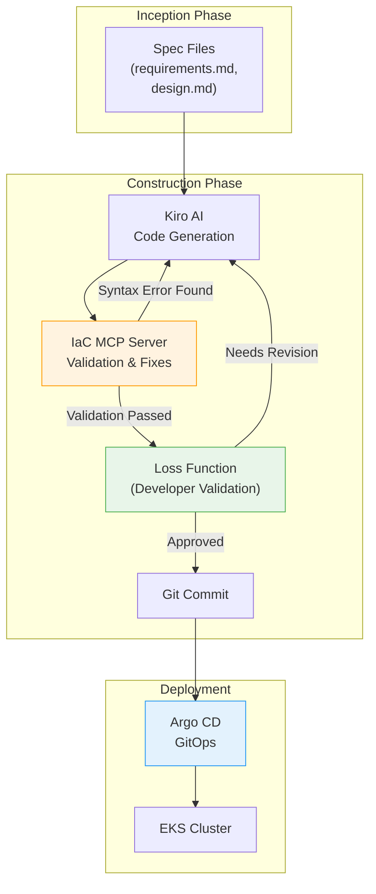

import { EksCapabilities, AidlcPipeline } from '@site/src/components/AidlcTables';

# EKS Declarative Automation

EKS Capabilities (Nov 2025) provides popular open-source tools as AWS managed services, serving as the core infrastructure for declaratively deploying AIDLC Construction phase outputs and continuously managing them in the Operations phase.

<EksCapabilities />

## 1. EKS Capabilities Overview

EKS Capabilities consists of five managed services:

1. **Managed Argo CD** — GitOps-based continuous deployment
2. **ACK (AWS Controllers for Kubernetes)** — Manage AWS resources as K8s CRDs
3. **KRO (Kubernetes Resource Orchestrator)** — Orchestrate composite resources as single deployment units
4. **Gateway API (LBC v3)** — L4/L7 traffic routing and advanced networking
5. **Node Readiness Controller** — Declarative node readiness state management

These tools form the complete pipeline where Kiro-generated code is automatically deployed to EKS when pushed to Git, and AI Agents monitor and automatically respond in the Operations phase.

---

## 2. Managed Argo CD — GitOps Pattern

Managed Argo CD operates GitOps as a managed service on AWS infrastructure. When Kiro-generated code is pushed to Git, it's automatically deployed to EKS.

### Core Concepts

- **Application CRD**: Declares single environment (e.g., production) deployment
- **ApplicationSet**: Automatically generates multi-environment (dev/staging/production)
- **Self-healing**: Automatically syncs when Git state and cluster state diverge
- **Progressive Delivery**: Automates canary/blue-green deployments

### AIDLC Integration

| Phase | Role |
|-------|------|
| **Construction** | Kiro-generated Helm chart/Kustomize Git commit → Argo CD automatic deployment |
| **Operations** | AI Agent monitors deployment status, triggers automatic rollback on SLO violations |

### References

- [EKS User Guide: Managed Argo CD](https://docs.aws.amazon.com/eks/latest/userguide/eks-capabilities-argocd.html)
- [Argo CD Best Practices](https://argo-cd.readthedocs.io/en/stable/operator-manual/declarative-setup/)

---

## 3. ACK — AWS Resource CRD Management

ACK declaratively manages 50+ AWS services as K8s CRDs. Kiro-generated Domain Design infrastructure elements (DynamoDB, SQS, S3, etc.) are deployed with `kubectl apply` and naturally integrate into Argo CD's GitOps workflow.

### Core Value

With ACK, **AWS resources outside the cluster can also be managed with the K8s declarative model**. Creating/modifying/deleting DynamoDB, SQS, S3, RDS, etc. as K8s CRDs is the strategy to "declaratively manage all infrastructure centered around K8s."

### AIDLC Integration

- **Inception**: Analyze domain boundaries in [DDD Integration](../methodology/ddd-integration.md) → Identify ACK resource needs
- **Construction**: Kiro automatically generates ACK CRD manifests
- **Operations**: Monitor ACK resource status in [Observability Stack](../operations/observability-stack.md)

### References

- [AWS Controllers for Kubernetes (ACK)](https://aws-controllers-k8s.github.io/community/)
- [EKS Best Practices: ACK](https://aws.github.io/aws-eks-best-practices/security/docs/ack/)

---

## 4. KRO — ResourceGroup Orchestration

KRO bundles multiple K8s resources into a **single deployment unit (ResourceGroup)**. It directly maps to AIDLC's Deployment Unit concept, creating Deployment + Service + HPA + ACK resources as one Custom Resource.

### Core Concepts

- **ResourceGroup**: Defines logical deployment unit (e.g., Payment Service = Deployment + Service + DynamoDB Table)
- **Dependencies**: Automatically manages resource dependencies (e.g., Deployment starts after DynamoDB Table creation)
- **Rollback**: Atomic rollback by ResourceGroup unit

### Mapping with DDD Aggregate

| DDD Concept | KRO Implementation |
|-------------|-------------------|
| Aggregate Root | ResourceGroup CRD |
| Entity | Deployment, StatefulSet |
| Value Object | ConfigMap, Secret |
| Repository | ACK DynamoDB/RDS CRD |

### References

- [Kubernetes Resource Orchestrator (KRO)](https://github.com/awslabs/kro)
- [EKS Best Practices: KRO](https://aws.github.io/aws-eks-best-practices/scalability/docs/kro/)

---

## 5. Gateway API — L4/L7 Traffic Routing

AWS Load Balancer Controller v3 transitions Gateway API to GA, providing L4 (NLB) + L7 (ALB) routing, QUIC/HTTP3, JWT validation, and header transformation.

### Gateway API Design Philosophy

Gateway API is designed role-oriented, allowing infrastructure operators, cluster operators, and application developers to manage traffic within their respective responsibilities.

| Resource | Owner | Responsibility |
|----------|-------|---------------|
| **GatewayClass** | Infrastructure Operator | Define load balancer type (ALB/NLB) |
| **Gateway** | Cluster Operator | Define listeners (port, TLS), namespace access control |
| **HTTPRoute/GRPCRoute** | Application Developer | Path-based routing, canary deployment, header transformation |

### Supported Features (LBC v2.14+)

1. **L4 Routes** (NLB, v2.13.3+)
   - TCPRoute, UDPRoute, TLSRoute
   - SNI-based TLS routing, QUIC/HTTP3 support

2. **L7 Routes** (ALB, v2.14.0+)
   - HTTPRoute: Path/header/query-based routing
   - GRPCRoute: gRPC method-based routing

3. **Advanced Features** (Gateway API v1.4)
   - JWT validation (Gateway level)
   - Header transformation (RequestHeaderModifier, ResponseHeaderModifier)
   - Weight-based canary deployment

### YAML Example (3-resource separation pattern)

```yaml
# GatewayClass — Defined by infrastructure operator
apiVersion: gateway.networking.k8s.io/v1
kind: GatewayClass
metadata:
  name: aws-alb
spec:
  controllerName: gateway.alb.aws.amazon.com/controller
---
# Gateway — Defined by cluster operator
apiVersion: gateway.networking.k8s.io/v1
kind: Gateway
metadata:
  name: payment-gateway
  namespace: production
spec:
  gatewayClassName: aws-alb
  listeners:
    - name: https
      protocol: HTTPS
      port: 443
---
# HTTPRoute — Defined by application developer
apiVersion: gateway.networking.k8s.io/v1
kind: HTTPRoute
metadata:
  name: payment-api-route
  namespace: production
spec:
  parentRefs:
    - name: payment-gateway
  rules:
    - matches:
        - path:
            type: PathPrefix
            value: /api/v1/payments
      backendRefs:
        - name: payment-service-v1
          port: 8080
          weight: 90  # Canary deployment: v1 90%
        - name: payment-service-v2
          port: 8080
          weight: 10  # v2 10%
```

### AIDLC Construction Phase Utilization

1. **Define API Routing Requirements in Kiro Spec**
   - Specify requirements like "route 10% traffic to v2 with canary deployment" in `requirements.md`
   - Kiro automatically generates HTTPRoute manifest

2. **Declarative Deployment via GitOps Workflow**
   - Deploy Gateway and HTTPRoute with single Git commit
   - Argo CD automatically syncs changes to EKS
   - LBC provisions ALB/NLB and applies routing rules

3. **Integration with Operations Phase**
   - Monitor each version's SLO with CloudWatch Application Signals
   - AI Agent automatically adjusts HTTPRoute weight to rollback on SLO violations

### Gateway API vs Ingress

**Ingress** defines all routing rules in a single resource, mixing infrastructure operator and developer responsibilities. **Gateway API** separates roles into GatewayClass (infrastructure), Gateway (cluster), and HTTPRoute (application), allowing each team to work independently. This aligns with AIDLC's **Loss Function** concept — validate at each layer to prevent error propagation.

### References

- [Kubernetes Gateway API v1.4 Release](https://kubernetes.io/blog/2025/11/06/gateway-api-v1-4/) (2025-11-06)
- [AWS Load Balancer Controller — Gateway API Docs](https://kubernetes-sigs.github.io/aws-load-balancer-controller/latest/guide/gateway/gateway/)
- [Kubernetes Gateway API in Action (AWS Blog)](https://aws.amazon.com/blogs/containers/kubernetes-gateway-api-in-action/)

---

## 6. Node Readiness Controller — Declarative Node Readiness Management

**Node Readiness Controller (NRC)** is a controller that declaratively defines conditions a Kubernetes node must meet before accepting workloads. It's a key tool for expressing infrastructure requirements as code in the AIDLC Construction phase and automatically applying them via GitOps.

### Core Concepts

NRC defines conditions that nodes must satisfy before transitioning to "Ready" state through the `NodeReadinessRule` CRD. Traditionally, node readiness was automatically determined by kubelet, but with NRC, you can **declaratively inject application-specific requirements into the infrastructure layer**.

- **Declarative Policy**: Define node readiness conditions in YAML as `NodeReadinessRule`
- **GitOps Compatible**: Version control and automatically deploy node readiness policies via Argo CD
- **Workload Protection**: Block scheduling until essential daemonsets (CNI, CSI, security agents) are ready

### AIDLC Phase Utilization

| Phase | NRC Role | Example |
|-------|----------|---------|
| **Inception** | AI analyzes workload requirements → Automatically defines necessary NodeReadinessRule | "GPU workloads schedule only after NVIDIA device plugin is ready" |
| **Construction** | Include NRC rules in Helm chart, deploy via Terraform EKS Blueprints AddOn | Kiro automatically generates `NodeReadinessRule` manifest |
| **Operations** | NRC automatically manages node readiness at runtime, AI analyzes rule effects | Track node readiness delay time with CloudWatch Application Signals |

### Infrastructure as Code Perspective

NRC extends AIDLC's "infrastructure as code, test infrastructure too" principle to the node level.

1. **GitOps-Based Policy Management**
   - Store `NodeReadinessRule` CRD in Git repository
   - Argo CD automatically syncs to EKS cluster
   - Apply to entire cluster with single Git commit when policy changes

2. **Kiro + MCP Automation**
   - Kiro parses workload requirements from `design.md` in Inception phase
   - [AI Coding Agent](./ai-coding-agents.md) checks current cluster daemonset status
   - Automatically generates necessary `NodeReadinessRule` and adds to IaC repository

### YAML Example: GPU Workload NodeReadinessRule

```yaml
apiVersion: node.k8s.io/v1alpha1
kind: NodeReadinessRule
metadata:
  name: gpu-node-readiness
  namespace: kube-system
spec:
  # Apply only to GPU nodes
  nodeSelector:
    matchLabels:
      node.kubernetes.io/instance-type: p4d.24xlarge
  # Don't transition node to Ready until all following daemonsets are Ready
  requiredDaemonSets:
    - name: nvidia-device-plugin-daemonset
      namespace: kube-system
    - name: gpu-feature-discovery
      namespace: kube-system
    - name: dcgm-exporter
      namespace: monitoring
  # Timeout: Keep node NotReady if conditions not met within 10 minutes
  timeout: 10m
```

### Practical Use Cases

| Scenario | NRC Rule | Effect |
|----------|----------|--------|
| **Cilium CNI Cluster** | Wait until Cilium agent is Ready | Prevent Pod scheduling before network initialization |
| **GPU Cluster** | Wait for NVIDIA device plugin + DCGM exporter readiness | Block workload scheduling before GPU resource exposure |
| **Security-Hardened Environment** | Wait for Falco, OPA Gatekeeper readiness | Prevent workload execution before security policy application |
| **Storage Workload** | Wait for EBS CSI driver + snapshot controller readiness | Prevent volume mount failures |

### References

- [Kubernetes Blog: Introducing Node Readiness Controller](https://kubernetes.io/blog/2026/02/03/introducing-node-readiness-controller/) (2026-02-03)
- [Node Readiness Controller GitHub Repository](https://github.com/kubernetes-sigs/node-readiness-controller)

---

## 7. MCP-Based IaC Automation

AWS announced **AWS Infrastructure as Code (IaC) MCP Server** on November 28, 2025. This is a programmatic interface where AI tools like Kiro CLI can search CloudFormation and CDK documentation, automatically validate templates, and provide AI support for deployment troubleshooting.

### AWS IaC MCP Server Overview

AWS IaC MCP Server provides the following capabilities via Model Context Protocol:

- **Documentation Search**: Real-time search of CloudFormation resource types, CDK syntax, and best practices
- **Template Validation**: Automatically detect and suggest fixes for IaC template syntax errors
- **Deployment Troubleshooting**: Analyze root causes of stack deployment failures and provide solutions
- **Programmatic Access**: Native integration with AI tools like Kiro and Amazon Q Developer

### AIDLC Construction Phase Integration

1. **Kiro Spec → IaC Code Generation Validation**
   - Kiro generates CDK/Terraform/Helm code based on `design.md` from Inception phase
   - IaC MCP Server automatically validates generated code syntax, resource constraints, and security policy compliance
   - For CloudFormation templates, pre-detect resource type typos, circular dependencies, and incorrect properties

2. **Pre-validate Compatibility with Existing Infrastructure**
   - Integrate with EKS MCP Server and Cost Analysis MCP to analyze current cluster state
   - Validate new IaC code doesn't conflict with existing resources (VPC, subnets, security groups)

3. **Role as Loss Function**
   - Block incorrect IaC code before production deployment
   - Verify consistency between domain boundaries defined in [DDD Integration](../methodology/ddd-integration.md) and infrastructure requirements

### References

- [AWS DevOps Blog: Introducing the AWS IaC MCP Server](https://aws.amazon.com/blogs/devops/introducing-the-aws-infrastructure-as-code-mcp-server-ai-powered-cdk-and-cloudformation-assistance/) (2025-11-28)

---

## 8. AIDLC Pipeline Integration

When EKS Capabilities are combined, all outputs generated by Kiro from Spec can be **deployed across the entire stack with a single Git push**. This is the core of the Construction → Operations transition.

<AidlcPipeline />

### Integration Flow



### Core Principles

1. **Declarative**: Define all infrastructure, application, and networking configurations in YAML/HCL
2. **GitOps**: Use Git as Single Source of Truth
3. **Automation**: Minimize manual intervention with Kiro + MCP + Argo CD
4. **Validation**: Loss Function catches errors early at each stage

---

## Summary

EKS Capabilities are the core infrastructure for declaratively automating AIDLC's Construction/Operations phases:

- **Managed Argo CD**: GitOps-based continuous deployment
- **ACK**: Manage AWS resources as K8s CRDs
- **KRO**: Orchestrate composite resources as single deployment units
- **Gateway API**: Role-separated traffic routing, aligns with AIDLC Loss Function
- **Node Readiness Controller**: Declarative node readiness state management
- **IaC MCP Server**: AI-based IaC code validation and troubleshooting

These tools form the complete pipeline where Kiro-generated code deploys the entire stack with a single Git push, and AI Agents automatically monitor and respond in the Operations phase.
