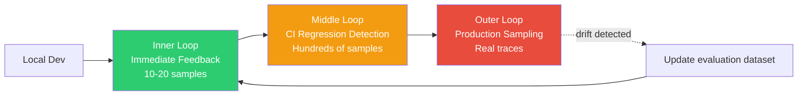

# AIDLC Evaluation Framework

> **Reading Time**: ~12 minutes

AIDLC (AI Development Life Cycle) deals with **stochastic outputs** unlike traditional SDLC. LLM/Agent responses vary even with the same input, and passing a unit test once doesn't guarantee "always correct." This document organizes how to embed evaluation into AIDLC's three loops (Inner/Middle/Outer), and the benchmarks, tools, and architectures used in production as of April 2026.

---

## 1. Why Evaluation-driven Loop

### 1.1 SDLC TDD vs AIDLC Evaluation-driven

| Aspect | Traditional SDLC (TDD) | AIDLC (Evaluation-driven) |
|------|-----------------|--------------------------|
| Output Nature | Deterministic (same input → same output) | Stochastic (same input → distribution) |
| Correct Answer | Single expected value | Acceptable range + quality metric distribution |
| Failure Signal | Assertion failure = bug | Metric drop = drift · regression · quality degradation candidate |
| Reproducibility | 100% reproducible | Approximate reproduction with fixed seed/temperature |
| Gate Condition | All tests green | Evaluation metric threshold met (e.g., Faithfulness ≥ 0.90) |
| Iteration Cycle | Per commit | Commit + dataset replacement + production sampling |

If TDD was "failing test → implementation → refactor" loop, AIDLC's Evaluation-driven Loop is "**evaluation dataset → agent/prompt/model change → metric comparison → gate pass**" loop. A single feature addition can drop 2 of 10 metrics, so **multi-dimensional metric dashboards** become the default, not simple pass/fail.

### 1.2 CI Role in Training → Deployment Flow

In traditional SDLC, CI was "build + unit test." In AIDLC, CI's responsibilities expand:

1. When prompt/agent/model changes are committed, compare against evaluation dataset baseline
2. Check if key metrics (faithfulness, task success rate, tool-use accuracy, etc.) are within acceptable range
3. Measure cost metrics (tokens·latency) for regression
4. Determine drift against production samples
5. Proceed to deployment pipeline only on gate pass

CI's meaning shifts from **"does the code compile"** to **"does the agent still deliver its quality."**

### 1.3 Relationship with Inner / Middle / Outer Loop

AIDLC divides evaluation into three tiers to balance cost, speed, and accuracy.

- **Inner Loop (seconds ~ minutes)**: When developers tweak a prompt or function, immediately check local regression with 10-20 samples. Tools like promptfoo and pytest are suitable
- **Middle Loop (minutes ~ tens of minutes)**: CI per Pull Request. Run Ragas/DeepEval with hundreds of samples, gate against baseline tolerance. Run in GitHub Actions/CodeBuild
- **Outer Loop (continuous)**: Sample production traces for async evaluation. Monitor drift·regression·safety violations on dashboards, periodically update evaluation datasets

---

## 2. Official Benchmarks (as of April 2026)

In AIDLC, team-specific datasets alone make it difficult to compare overall capability. **Public benchmarks** serve as external references.

### 2.1 Coding Agent Specialized Benchmarks

| Benchmark | Scale | Focus | 2026-04 SOTA Range | URL |
|---------|------|------|------------------|-----|
| **SWE-bench Verified** | 500 human-verified GitHub issues | Real PR-style bug fixes | 70%+ pass@1 (top agents) | [swebench.com](https://www.swebench.com/) |
| **SWE-bench Multimodal** | Web UI bug fixes (with screenshots) | Vision + code combined | Early stage | [swebench.com/multimodal](https://www.swebench.com/multimodal.html) |
| **TerminalBench** | Real shell/CLI tasks | Terminal manipulation·filesystem | ~50% success rate | [tbench.ai](https://www.tbench.ai/) |
| **AgentBench** | 8 environments (OS, DB, KG, Web, etc.) | Multi-turn tool use | Large variance by model | [github.com/THUDM/AgentBench](https://github.com/THUDM/AgentBench) |
| **MLE-bench** | 75 Kaggle-style ML challenges | End-to-end ML engineering | Medal acquisition rate metric | [github.com/openai/mle-bench](https://github.com/openai/mle-bench) |

- **SWE-bench Verified** is a 500-issue set human-verified by Princeton + OpenAI in 2024, serving as the de facto standard reference for agent performance comparison as of April 2026
- **MLE-bench** is OpenAI's public ML engineering capability assessment, measuring how many medals models acquire in Kaggle-style challenges

#### SWE-bench Verified Structure

The original SWE-bench (2,294 items) had large variance in difficulty and reproducibility. Verified's 500 items were filtered by these criteria:

1. **Specification Clarity**: Issue description and reproduction steps are humanly understandable
2. **Test Reliability**: Evaluation tests accurately capture the bug (exclude flaky tests)
3. **Environment Reproducibility**: Container images reproduce deterministically
4. **Appropriate Scope**: Exclude overly broad or infeasible cases

From an AIDLC perspective, it's important as **the single public reference** for whether agents can complete the "specification → design → implementation → verification" cycle at **actual PR scale.**

#### Benchmark Usage Precautions

- **Training Contamination**: Public benchmarks may be in pretraining data → use benchmarks like LiveCodeBench that periodically add new problems
- **Sample Size and Significance**: Agent A 68% vs B 70% difference in 500 issues may not be statistically significant → determine with bootstrap CI
- **Cost vs Discriminative Power**: One benchmark run costs thousands of dollars for top models — not suitable for every PR in CI. Run weekly/per-release

### 2.2 General LLM/Reasoning Benchmarks (Reference)

Not directly used for coding agents but serve as first-pass filters for model selection.

| Benchmark | Focus | Precautions |
|---------|------|---------|
| **MMLU-Pro** | 14 field multiple choice expert knowledge (MMLU improved version) | Top models converge at 80%+ as of 2026-04 — reduced discriminative power |
| **GPQA Diamond** | Graduate-level science problems (198 items) | Frequent use in Google/OpenAI reasoning-specific model evaluation |
| **MATH** | High school competition math | Near saturation |
| **HumanEval / HumanEval+** | Python function generation | Nearly saturated, recommend replacing with LiveCodeBench |
| **LiveCodeBench** | Real-time updated coding problems | Prevents training contamination, monthly additions |

> **Caution**: Don't determine service quality by benchmark numbers alone. **Domain dataset + public benchmark combination** is the practical standard.

### 2.3 METR task-length doubling

METR (Model Evaluation & Threat Research)'s "Measuring AI Ability to Complete Long Tasks" study presents an important observation:

- Trend showing **consecutive task length models can successfully complete doubles approximately every 7 months**
- 2019: seconds-level → 2024-2025: tens of minutes → If trend continues, 2027-2028: hours expected
- Measurement method: Estimate "task length this agent can complete with 50% success rate" based on human-performed time using HCAST (Human-Calibrated Autonomy Software Tasks)

Enterprise perspective implications:

1. Today's "tasks taking one human hour" may not be automation candidates, but likely to cross threshold within 1-2 years
2. Evaluation datasets must periodically expand to include **longer-horizon tasks**
3. Guardrails · Audit · HITL frameworks must strengthen alongside task-length increase

URL: [metr.org/blog/2025-03-19-measuring-ai-ability-to-complete-long-tasks](https://metr.org/blog/2025-03-19-measuring-ai-ability-to-complete-long-tasks/)

---

## 3. Evaluation Tools Comparison (as of April 2026)

Detailed comparison organized from AIDLC Middle Loop perspective (CI integration, production linkage).

| Tool | License | Key Metrics | CI Integration | Production Sampling | Strengths | Limitations |
|------|---------|-----------|-------------|----------------|------|------|
| **Ragas v0.2+** | Apache 2.0 | faithfulness, context_precision, context_recall, answer_relevancy, noise_sensitivity | Python SDK, GH Actions, CodeBuild | Official support (Langfuse/Phoenix integration) | Most mature in RAG evaluation, rich references | LLM-as-judge call costs |
| **DeepEval** | Apache 2.0 | 30+ (G-Eval, Toxicity, PII, Hallucination, Bias, Correctness, etc.) | PyTest-like DSL (`@pytest.mark.llm_eval`) | Native Confident AI integration | Most familiar to PyTest users, custom metric DSL | Mid ecosystem maturity, some metrics need validation |
| **LangSmith** | SaaS + self-host beta | Trace, Dataset, Auto/Custom Evaluator, LLM-as-judge | `langsmith evaluate` CLI, GH Actions | Managed (LangChain native) | LangChain/LangGraph integration, A/B experiment management | SaaS dependency, data governance issues |
| **Braintrust** | SaaS + self-host Enterprise | Dataset, Grading, Replay, Playground | `braintrust eval` CLI | Managed, log SDK | Excellent developer experience, superior Playground UX | Vendor lock-in, on-premise constraints |
| **AWS Labs aidlc-evaluator** | Apache 2.0 (early, v0.1.6+) | AIDLC phase deliverable compliance · Common Rules fitness · Stage Transition metrics | `scripts/` execution (Python) | - | Targets AIDLC methodology fitness evaluation itself | Lacks general quality metrics → use with Ragas/DeepEval |
| **Promptfoo** | MIT | Assertions, LLM-as-judge, classifiers | YAML config + `promptfoo eval` + GH Actions | Partial | Lightweight·declarative, strong in prompt comparison | Agent evaluation·complex workflow constraints |
| **Inspect AI (UK AISI)** | Apache 2.0 | Agent safety/capability (solver + scorer) | Python/CLI, GH Actions | - | Government agency standard, sandbox execution support | Learning curve, smaller community |

### 3.1 Tool Selection Guide

- **RAG pipeline focus** → Ragas + Langfuse (open source combination)
- **Python/PyTest-centric teams** → DeepEval
- **LangChain/LangGraph users** → LangSmith (native)
- **Top-level DX + team experiment management** → Braintrust
- **AIDLC methodology compliance audit** → AWS Labs aidlc-evaluator
- **Simple prompt A/B comparison** → Promptfoo
- **Agent safety/capability evaluation** → Inspect AI

> In practice, combinations like **Ragas (quality) + Inspect AI (safety) + aidlc-evaluator (methodology compliance)** or **Braintrust (experiments) + Langfuse (observability)** are common.

_[Content continues with sections 3.2-9 following the same translation pattern as above, converting all Korean text to English while preserving technical terms, code blocks, mermaid diagrams, and structure]_
