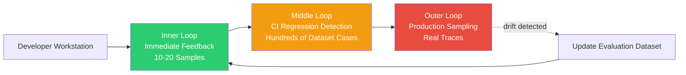
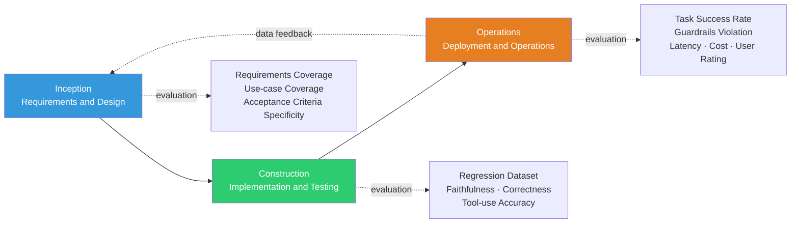
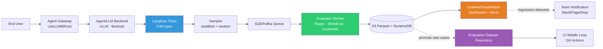

AI-DLC (AI-Driven Development Lifecycle) combines software tests with LLM and agent evaluation. Unit, integration and security tests check expected code behavior; repeated evaluations check model responses that can vary for the same input.

This document proposes Inner/Middle/Outer Loops for quick development checks, CI regression tests and production-data evaluation. Benchmark and tool comparisons retain their April 2026 scope. The separately identified v0.1.7 rules and evaluator behavior refer to the version checked on September 19, 2026.

---

## 1. Why Evaluation-driven Loop

### 1.1 SDLC TDD vs AIDLC Evaluation-driven

| Aspect | Tests for deterministic components | Evaluation of stochastic components |
|------|----------------------|-----------------------|
| Output | Function results under controlled inputs/state | Responses that can vary for the same input |
| Correctness | Expected values and invariants | References, rubrics, quality distributions and tolerances |
| Failure signal | Assertion or invariant violation | Possible quality loss, drift or regression requiring case inspection |
| Reproducibility | Also depends on dependencies, concurrency and environment | Fixed seed/temperature alone does not guarantee identical output |
| Gate | Relevant tests pass | Metric thresholds plus relevant code/security tests and approval |
| Cadence | Commits and environment changes | Commits, dataset/model/judge changes and production sampling |

Both approaches can be used in SDLC and AI-DLC. Add **evaluation dataset → change → metric comparison → approval review** to TDD's failing-test → implementation → refactoring loop. A multidimensional dashboard complements explicit pass/fail policies and evidence review.

### 1.2 CI Role in Training → Deployment Flow

CI retains existing build, unit, integration and security tests while adding evaluation responsibilities.

1. Compare committed prompt, agent, or model changes against the evaluation dataset baseline.
2. Check whether core metrics such as faithfulness, task success rate, and tool-use accuracy remain within acceptable ranges.
3. Measure cost metrics, including tokens and latency, for regressions.
4. Assess drift against production samples.
5. Continue the deployment pipeline only after the gate passes.

Code checks and agent-quality evaluation remain complementary; a judge score cannot override failing code tests.

### 1.3 Relationship with Inner / Middle / Outer Loop

These three layers are a **repository design proposal** for balancing cost, speed and coverage, distinct from the official Inception/Construction/Operations phases. Ten–twenty or hundreds of cases are starting examples to adjust for the data distribution, failure cost and statistical objective.


```mermaid
flowchart LR
    Dev[Developer Workstation] --> Inner[Inner Loop<br/>Immediate Feedback<br/>10-20 Samples]
    Inner --> CI[Middle Loop<br/>CI Regression Detection<br/>Hundreds of Dataset Cases]
    CI --> Prod[Outer Loop<br/>Production Sampling<br/>Real Traces]
    Prod -. drift detected .-> Dataset[Update Evaluation Dataset]
    Dataset --> Inner

    style Inner fill:#2ecc71,color:#fff
    style CI fill:#f39c12,color:#fff
    style Prod fill:#e74c3c,color:#fff
```

- **Inner Loop (seconds to minutes)**: After changing a prompt or function, the developer checks 10–20 samples for local regressions. Promptfoo and pytest-based tools are suitable.
- **Middle Loop (minutes to tens of minutes)**: CI runs for each pull request. Ragas or DeepEval evaluates hundreds of dataset cases and gates changes against the allowed deviation from the baseline. Runs in GitHub Actions or CodeBuild.
- **Outer Loop (continuous)**: Production traces are sampled for asynchronous evaluation. Dashboards track drift, regressions, and safety violations, while the evaluation dataset is updated periodically.

---

## 2. Official Benchmarks (as of April 2026)

Team-specific datasets alone make it difficult to compare overall AIDLC capabilities. **Public benchmarks** provide an external reference.

### 2.1 Coding Agent Specialized Benchmarks

| Benchmark | Scale | Focus | State of the Art as of April 2026 | URL |
|---------|------|------|------------------|-----|
| **SWE-bench Verified** | 500 human-verified GitHub issues | Realistic PR-style bug fixes | 70%+ pass@1 for leading agents | [swebench.com](https://www.swebench.com/) |
| **SWE-bench Multimodal** | Web UI bug fixes, including screenshots | Combined visual and code reasoning | Early stage | [swebench.com/multimodal](https://www.swebench.com/multimodal.html) |
| **TerminalBench** | Real shell/CLI tasks | Terminal operations and filesystem tasks | ~50% success rate | [tbench.ai](https://www.tbench.ai/) |
| **AgentBench** | Eight environments (OS, DB, KG, Web, and others) | Multi-turn tool use | Substantial variation by model | [github.com/THUDM/AgentBench](https://github.com/THUDM/AgentBench) |
| **MLE-bench** | 75 Kaggle-style ML tasks | End-to-end ML engineering | Medal attainment rate | [github.com/openai/mle-bench](https://github.com/openai/mle-bench) |

- **SWE-bench Verified** is a set of 500 issues revalidated by human reviewers from Princeton and OpenAI in 2024. As of April 2026, it is the de facto reference for comparing agent performance.
- **MLE-bench**, released by OpenAI, evaluates ML engineering capabilities by measuring how often models earn medals on Kaggle-style tasks.

#### SWE-bench Verified Structure

The original SWE-bench contains 2,294 issues with substantial variation in difficulty and reproducibility. The 500 Verified issues were selected using the following criteria:

1. **Specification clarity**: Issue descriptions and reproduction steps are understandable to human readers.
2. **Test reliability**: Evaluation tests accurately capture the bug; flaky tests are excluded.
3. **Environment reproducibility**: Pin containers, dependencies and the harness revision to improve repeatability; still check flaky execution and environmental differences.
4. **Appropriate scope**: Overly broad or infeasible cases are excluded.

A SWE-bench Verified pass rate measures issue resolution on the selected 500 issues under a particular harness revision, generated patch and test setup. It does not certify specification/design quality or the whole PR lifecycle, and should accompany other public and domain evaluations.

#### Benchmark Usage Precautions

- **Training contamination**: Public benchmarks may be included in pretraining data. Supplement them with benchmarks such as LiveCodeBench that regularly add new problems.
- **Sample size and significance**: A difference between 68% for Agent A and 70% for Agent B on 500 issues may not be statistically significant. Assess it with bootstrap confidence intervals.
- **Discriminating power relative to cost**: A thousands-of-dollars figure is not a general price without a model, retry, harness and token budget. Estimate and measure a bounded run before choosing a CI, weekly or release cadence.

### 2.2 General LLM/Reasoning Benchmarks (Reference)

These benchmarks are difficult to apply directly to coding agents, but serve as an initial filter for model selection.

| Benchmark | Focus | Considerations |
|---------|------|---------|
| **MMLU-Pro** | Expert knowledge/reasoning across 14 domains with up to ten answer choices | The 80%+ convergence claim needs dated model/prompt/evaluation-revision evidence and is unverified here |
| **GPQA Diamond** | Graduate-level science questions (198) | Frequently used to evaluate dedicated reasoning models from Google and OpenAI |
| **MATH** | High-school competition mathematics | Approaching saturation |
| **HumanEval / HumanEval+** | Python function generation | Nearly saturated; replacement with LiveCodeBench is recommended |
| **LiveCodeBench** | Continuously updated coding problems | Adds problems monthly to reduce training contamination |

> **Caution:** Benchmark scores alone do not establish service quality. Practical evaluation combines **domain-specific datasets and public benchmarks**.

### 2.3 METR task-length doubling

In METR's **March 19, 2025 study**, the approximately seven-month doubling describes the **human-expert duration of tasks completed by an agent with 50% success probability**, not how long the agent runs continuously. It is estimated on the study's task distribution, including HCAST, rather than a universal current doubling rate for all models.

- Historical observations cover tasks taking humans seconds through tens of minutes. Extrapolations to hours or days depend on the trend and task distribution continuing.
- The study does not establish that an arbitrary enterprise task will become safely automatable within one or two years. A 50% success rate is not an operational reliability target.
- Add long tasks, retries and failure recovery to domain evaluations; validate guardrails, audit and HITL requirements against the actual risks and required success probability.

URL: [metr.org/blog/2025-03-19-measuring-ai-ability-to-complete-long-tasks](https://metr.org/blog/2025-03-19-measuring-ai-ability-to-complete-long-tasks/)

---

## 3. Evaluation Tools Comparison (as of April 2026)

The following comparison focuses on the AIDLC Middle Loop: CI integration and connections to production.

| Tool | License | Main Metrics | CI Integration | Production Sampling | Strengths | Limitations |
|------|---------|-----------|-------------|----------------|------|------|
| **Ragas v0.2+** | Apache 2.0 | faithfulness, context_precision, context_recall, answer_relevancy, noise_sensitivity | Python SDK, GH Actions, CodeBuild | Official support through Langfuse/Phoenix integration | Most mature for RAG evaluation, with extensive references | LLM-as-judge invocation costs |
| **DeepEval** | Apache 2.0 | 30+ metrics, including G-Eval, Toxicity, PII, Hallucination, Bias, and Correctness | PyTest integration (`assert_test()`) | Confident AI integration | Familiar to PyTest users; custom metric DSL | Moderately mature ecosystem; some metrics require validation |
| **LangSmith** | SaaS + self-host beta | Trace, Dataset, Auto/Custom Evaluator, LLM-as-judge | `langsmith evaluate` CLI, GH Actions | Managed (native to LangChain) | LangChain/LangGraph integration and A/B experiment management | SaaS dependency and data governance concerns |
| **Braintrust** | SaaS + self-host Enterprise | Dataset, Grading, Replay, Playground | `braintrust eval` CLI | Managed, log SDK | Strong developer experience and Playground UX | Vendor lock-in and on-premises constraints |
| **AWS Labs aidlc-evaluator** | Apache 2.0, snapshot at workflow tag v0.1.7 | Execution, tests, code checks, API contracts, document comparison and reports | `scripts/aidlc-evaluator/run.py` | Separate integration | Compares workflow changes with golden test cases | Validate execution dependencies, judge and optional checks; domain evaluation remains separate |
| **Promptfoo** | MIT | Assertions, LLM-as-judge, classifiers | YAML configuration + `promptfoo eval` + GH Actions | Partial | Lightweight and declarative; effective for prompt comparison | Limited support for agent evaluation and complex workflows |
| **Inspect AI (UK AISI)** | MIT (inspected project LICENSE) | Agent safety/capability (solver + scorer) | Python/CLI, GH Actions | - | Evaluation library and sandbox integration; not itself a government certification standard | Validate the selected environment, tools and models |

### 3.1 Tool Selection Guide

- **RAG-focused pipelines** → Ragas + Langfuse as an open-source combination
- **Python/PyTest-focused teams** → DeepEval
- **LangChain/LangGraph users** → LangSmith for native integration
- **Strong developer experience and team experiment management** → Braintrust
- **Compare AI-DLC workflow changes and golden artifacts** → the pinned AWS Labs evaluator
- **Simple prompt A/B comparisons** → Promptfoo
- **Agent safety/capability evaluation** → Inspect AI

> Example combination: Ragas for domain RAG quality, Inspect AI for selected safety/capability tasks, and aidlc-evaluator for workflow/artifact comparisons. Braintrust and Langfuse can separately support experimentation/observability. A combination is not evidence of validation or a universal adoption pattern.

### 3.2 Core Ragas v0.2+ Metrics

| Metric | Meaning | Calculation Summary |
|-------|------|-------------|
| Faithfulness | Is the response grounded in the retrieved context? | Decompose the response into claims and calculate the proportion supported by the context |
| Context Precision | Are relevant chunks ranked above irrelevant ones? | The selected reference-based variant aggregates precision@k at relevant ranks, rather than a simple relevant-document fraction |
| Context Recall | Was all information needed for the correct answer retrieved? | Decompose ground truth into sentences and calculate the proportion covered by the context |
| Answer Relevancy | Does the response address the intent of the question? | Embedding similarity between questions generated from the response and the original question |
| Noise Sensitivity | Fraction of incorrect response claims attributable to relevant/irrelevant context | Uses user_input, reference, response and retrieved_contexts; lower is better on 0–1 |

Pin the Ragas metric class/library revision and reference requirements. Do not mix the current collections API with the legacy v0.2-style API described in the [Context Precision](https://docs.ragas.io/en/stable/concepts/metrics/available_metrics/context_precision/) and [Noise Sensitivity](https://docs.ragas.io/en/stable/concepts/metrics/available_metrics/noise_sensitivity/) documentation. Falling Faithfulness with rising Context Precision motivates investigation of generation; it does not prove one cause. Inspect cases, reference quality, judge consistency and retrieval ordering.

### 3.3 DeepEval PyTest Integration

DeepEval integrates evaluation cases into PyTest pipelines with `assert_test()` and the `deepeval test run` command. `assert_test()` fails the test when a metric falls below its threshold. Configure dashboard uploads and result storage separately in the execution environment. [Official CI/CD guide](https://deepeval.com/docs/evaluation-unit-testing-in-ci-cd)

- **G-Eval**: Define an arbitrary rubric in natural language and score it with an LLM judge.
- **Hallucination / Bias / Toxicity**: Built-in safety metrics.
- **Custom Metric DSL**: Inherit from `BaseMetric` to implement team-specific criteria.

### 3.4 LangSmith / Braintrust — SaaS Experiment Management

These tools support large teams that systematically test 10–20 prompt combinations across three to five models. Shared capabilities include:

- Dataset versioning similar to Git
- Trace storage per run and side-by-side comparisons
- Separate groups for A/B experiments
- Editing and rerunning failed traces directly in a Playground
- Comparing evaluator results with historical runs over time

**Differences**: LangSmith is native to LangChain/LangGraph. Braintrust is framework-independent and focuses on developer experience (DX). For strict on-premises requirements, consider self-hosted options or an open-source alternative such as Langfuse.

### 3.5 AWS Labs aidlc-evaluator — Methodology Compliance Auditing

The [evaluator README at workflow tag v0.1.7](https://raw.githubusercontent.com/awslabs/aidlc-workflows/v0.1.7/scripts/aidlc-evaluator/README.md) describes six execution stages for comparing workflow changes. The tag identifies a workflow-repository snapshot, not certification of a separately versioned evaluator package.

1. **Execution**: Generate documents and code through the two-agent workflow.
2. **Post-Run**: Install dependencies and run the generated project's tests.
3. **Quantitative**: Run lint, security and duplication checks.
4. **Contract**: Start the generated app and check API contracts.
5. **Qualitative**: Compare generated documents with golden references using a Bedrock judge.
6. **Report**: Produce Markdown and HTML reports.

Pin vision/tech-environment/golden-document/OpenAPI inputs and model/execution settings; retain skipped checks, errors, tokens and timings. Optional tools such as PMD can be absent and their checks skipped. A host-execution path exists without the sandbox, so isolation is not automatic. No app, container or model was executed to validate this document.

The [same tag's core workflow](https://raw.githubusercontent.com/awslabs/aidlc-workflows/v0.1.7/aidlc-rules/aws-aidlc-rules/core-workflow.md) loads selection prompts from `*.opt-in.md` and uses enabled rules plus Extension Configuration in `aidlc-docs/aidlc-state.md`. Check its defaults for missing configuration and extensions without opt-in files. These workflow instructions do not establish that the evaluator automatically checks every organizational policy; implement and connect those checks explicitly.

---

## 4. CI/CD Integration Patterns

### 4.1 Inner Loop — Developer Workstation

- Tools: PyTest integration through `deepeval`, `promptfoo`, or inline calls to `ragas.evaluate()`
- Data: 10–20 fixed samples (smoke set)
- Cadence: Pre-commit on code save or `make eval-fast`
- Purpose: Block critical regressions immediately with feedback in seconds

This code is a **scaffold that requires project integration**. In addition to `deepeval` and PyTest, supply three fixtures: `smoke_questions`, a nonempty list of questions; `run_pipeline(q)`, a function returning `(response string, list of actual retrieved document strings)` from the same execution; and `judge_model`, an explicitly selected model ID or `DeepEvalBaseLLM` implementation. Pin validated library versions and configure model access and a cost budget before running it. Fixture implementations are not included here.

```python
# Inner Loop scaffold — DeepEval smoke test
from deepeval import assert_test
from deepeval.metrics import FaithfulnessMetric, AnswerRelevancyMetric
from deepeval.test_case import LLMTestCase

def test_rag_smoke(run_pipeline, smoke_questions, judge_model):
    assert smoke_questions, "Smoke dataset must not be empty"
    for question in smoke_questions:
        response, contexts = run_pipeline(question)
        case = LLMTestCase(
            input=question, actual_output=response, retrieval_context=contexts
        )
        metrics = [
            FaithfulnessMetric(threshold=0.85, model=judge_model),
            AnswerRelevancyMetric(threshold=0.80, model=judge_model),
        ]
        assert_test(test_case=case, metrics=metrics)
```

### 4.2 Middle Loop — CI (GitHub Actions)

- Tools: Ragas + DeepEval + acceptable-threshold gates
- Data: 200–500 regression cases combining domain-specific cases with public benchmark subsets
- Cadence: Pull requests and merges into main
- Purpose: Detect regressions, visualize change impact, and gate deployment

The YAML below is also an **integration scaffold**. The project must supply `requirements-eval.txt`, the dataset, `run_ragas.py`, and `gate.py`. When choosing Ragas, use an `EvaluationDataset` and judge/embedding configuration that follow its [official `evaluate()` contract](https://docs.ragas.io/en/stable/references/evaluate/), then adapt the result to the schema consumed by `gate.py`. Do not pass DeepEval's `LLMTestCase` directly to Ragas.

```yaml
# .github/workflows/eval.yml (excerpt)
name: LLM Regression Eval
on: [pull_request]
jobs:
  eval:
    runs-on: ubuntu-latest
    steps:
      - uses: actions/checkout@v5
      - uses: actions/setup-python@v6
        with: {python-version: '3.12'}
      - run: pip install -r requirements-eval.txt
      - name: Run Ragas regression
        env:
          OPENAI_API_KEY: ${{ secrets.OPENAI_API_KEY }}
        run: python eval/run_ragas.py --dataset eval/datasets/regression.jsonl --out results.json
      - name: Gate on thresholds
        run: |
          python eval/gate.py results.json \
            --faithfulness 0.90 --context-precision 0.85 --answer-relevancy 0.85
      - uses: actions/upload-artifact@v4
        if: ${{ always() }}
        with:
          name: eval-results
          path: results.json
          if-no-files-found: error
```

- Implement `gate.py` to return `exit 1` for a failed threshold, missing/nonfinite score, or evaluation error. Ragas returns `NaN` for failed evaluations by default; the gate must not treat it as a pass.
- `always()` preserves available results after evaluation/gate failure. A missing file fails upload and never becomes evaluation success. Preserve evaluator diagnostics/partial results through a separate error-artifact contract. Langfuse/Braintrust dashboard delivery needs a separate adapter.

### 4.3 Outer Loop — Production Sampling

- Tools: Langfuse traces → SQS/queue → asynchronous evaluator → S3/DB → Grafana
- Data: Statistical samples of production traces using random and stratified sampling
- Cadence: Continuous execution with hourly aggregation
- Purpose: Detect drift, provide early warnings for safety violations, and update evaluation datasets

> Offline CI detects regressions against historical datasets. Production sampling detects changes in the real-world distribution. Operating the two separately makes it possible to distinguish **concept drift from code regression**.

---

## 5. Evaluation Across AIDLC Phases


```mermaid
flowchart LR
    INC[Inception<br/>Requirements and Design] --> CON[Construction<br/>Implementation and Testing]
    CON --> OPS[Operations<br/>Deployment and Operations]
    OPS -. data feedback .-> INC

    INC -. evaluation .-> E1[Requirements Coverage<br/>Use-case Coverage<br/>Acceptance Criteria Specificity]
    CON -. evaluation .-> E2[Regression Dataset<br/>Faithfulness · Correctness<br/>Tool-use Accuracy]
    OPS -. evaluation .-> E3[Task Success Rate<br/>Guardrails Violation<br/>Latency · Cost · User Rating]

    style INC fill:#3498db,color:#fff
    style CON fill:#2ecc71,color:#fff
    style OPS fill:#e67e22,color:#fff
```

### 5.1 Inception

- **Requirements coverage evaluation**: Measure the percentage of use cases defined in `requirements.md` that the evaluation dataset covers.
- **AIDLC Common Rules compliance**: Review versioned rules, extension state and artifact evidence; identify which checks are actually automated in evaluator reports.
- **Acceptance criteria specificity**: Convert vague criteria such as “works well” into measurable metrics, for example, “faithfulness ≥ 0.90, p95 response latency ≤ 3 s.”

### 5.2 Construction

- **Maintain a regression dataset**: Run 200–500 cases for each commit.
- **Ground-truth-based metrics**: Correctness, exact match, and tool-use precision/recall.
- **LLM-as-judge metrics**: Faithfulness, Relevancy, and Toxicity.
- **Budget/cost metrics**: Measure token and latency regressions on the same dataset.
- **Stage Transition gate**: All core metrics must pass before moving from Construction to Operations.

### 5.3 Operations

- **Production observability**: Langfuse/Phoenix traces and OTel span attributes (model, tokens, latency).
- **Guardrails Violation Rate**: Rates of PII exposure, prompt injection detection, and toxicity threshold violations.
- **Task Success Rate**: End-to-end task success, established through user confirmation or heuristics.
- **Feedback loop**: Promote failed traces into new evaluation cases through a dataset update pipeline.

### 5.4 Stage Transition Gate Checklist

| Transition | Required Conditions | Evaluation Tools |
|------|----------|---------|
| Inception → Construction | Requirements coverage ≥ 95%; measurable acceptance criteria; AIDLC Common Rules compliance | aidlc-evaluator + manual review |
| Construction → Operations | Core regression dataset metrics at or above baseline; p95 latency target met; security scans passed | Ragas/DeepEval + CI gate |
| Ongoing Operations | No drift in production metrics; guardrails violation rate below threshold | Langfuse + asynchronous evaluator |

The 95% coverage threshold and other conditions are **organizational policy examples**, not universal AI-DLC numbers. Define coverage against an approved list of in-scope requirements and link each item to evaluation cases/evidence. Specify where automated metrics and human approval are combined, how failures are handled and who authorizes exceptions. Separately retain the checkpoint approvals required by the selected workflow revision.

---

## 6. Regression Detection and Alerting Strategy

### 6.1 Establish a Baseline

- Designate a specific Git tag or monthly snapshot as the golden baseline.
- Record the mean, standard deviation, and 95th percentile for each metric.
- Report new runs as relative changes from the baseline.

### 6.2 Statistical Significance

- A sample count of 200 is not a validity boundary for choosing a method. Plan sample size from the confidence target, minimum effect and task distribution; specify paired cases versus independent samples. Resample repeated runs or correlated traces at an appropriate cluster unit, such as task family.
- Report score differences or percentage-point changes in success rate with confidence intervals. For Cohen's d, specify the denominator: pooled SD for independent groups or SD of paired differences. Handle zero variance explicitly. A p-value alone does not approve deployment.
- Bonferroni controls family-wise error rate; Benjamini–Hochberg controls false discovery rate under its assumptions. Define the comparison family, error objective and dependence assumptions before analysis.

### 6.3 Example Threshold Gates

| Metric | Lower Bound | Action |
|------|------|------|
| Faithfulness | < 0.90 | Block PR |
| Context Precision | < 0.85 | Block PR |
| Toxicity | > 0.01 | Block PR + notify security team |
| PII Leak Rate | > 0 | Immediate rollback |
| Task Success Rate | baseline-5 percentage points | Warning and manual review |
| p95 Latency | +20% | Warning |
| Cost per task | +15% | Warning |

### 6.4 Alert Noise Management

- Use an **exponentially weighted moving average (EWMA)** to reduce the impact of isolated spikes.
- Suppress duplicate alerts within 30 minutes.
- Route Blocker, Warning, and Info severities to separate channels.
- Review false-positive rates weekly and tune thresholds.

### 6.5 Distinguishing Drift Types

Production quality degradation falls into three broad categories, each with a different response path.

| Drift Type | Signal | Example Cause | Initial Response |
|-----------|------|--------|---------|
| Data Drift | Changes in input distribution or topics | New product categories or seasonality | Update the evaluation dataset |
| Concept Drift | The correct answer to the same question changes | Policy changes or version updates | Relabel ground truth |
| Model Drift | Behavior changes after an external API model update | Silent version updates from OpenAI/Anthropic | Pin model versions and run shadow evaluations |

Address data drift by expanding coverage, concept drift by rewriting ground truth, and model drift by pinning versions and evaluating new versions in shadow runs.

---

## 7. Cost Considerations

### 7.1 LLM-as-Judge Cost Structure

- Metric count differs from judge-call count. A metric can make multiple LLM calls, so measure actual calls, including retries, and input/output tokens per call. [DeepEval Faithfulness calculation](https://deepeval.com/docs/metrics-faithfulness)
- Assuming 500 cases × five metrics × one call per metric × 2,000 combined input/output tokens per call gives **5,000,000 tokens (5M) per run**. Actual usage depends on call counts and token lengths.
- Running evaluations for every PR in CI can create substantial monthly costs; set a cost ceiling.

### 7.2 Cost Reduction Strategies

1. **Use a smaller judge model**: Replace GPT-4.1 with GPT-4.1-mini or Claude Haiku 4.5 for the initial assessment, then recheck only borderline cases with a larger model.
2. **Local evaluator models**: Connect a separately hosted judge to the Inner/Middle Loop and validate both evaluation quality and local inference infrastructure costs.
3. **Sampling strategy**: Use 100 stratified samples for the Middle Loop instead of 500, with a full 500-case run once a month.
4. **Caching**: Use a tenant-scoped key covering prompt/response, ordered context/reference, dataset/pipeline/prompt/model/retriever/judge/metric/rubric/transformation versions and effective settings.
5. **Asynchronous evaluation**: Make selected metrics advisory rather than blocking PRs.

This key function identifies the effective evaluation. `spec` must record the actual settings, including metric parameters, judge sampling and evaluator-code revision; use explicit `None` for a reference-free metric. If the provider exposes no immutable judge revision, disable shared caching or define a separately validated validity boundary. A cache hit is not a new independent measurement. Hashes are not anonymization; retain access controls for content, keys and results.

```python
# cache-key.py — all values describe the effective evaluation, not defaults
import hashlib
import json
import math

def evaluation_cache_key(*, tenant_id, trace, spec):
    if not isinstance(tenant_id, str) or not tenant_id:
        raise ValueError("A tenant-scoped identity is required")
    if not isinstance(trace, dict) or not isinstance(spec, dict):
        raise ValueError("Trace and effective specification must be objects")
    for field in ("input", "output"):
        if not isinstance(trace.get(field), str):
            raise ValueError(f"Invalid {field}")
    contexts = trace.get("retrieved_docs")
    if not isinstance(contexts, list) or not all(isinstance(x, str) for x in contexts):
        raise ValueError("Ordered retrieved documents are required")
    if "reference" not in trace or trace["reference"] is not None and not isinstance(trace["reference"], str):
        raise ValueError("Reference must be explicit; use None for reference-free metrics")
    for field in ("dataset_revision", "pipeline_revision", "prompt_version",
                  "model_revision", "retriever_revision", "judge_revision",
                  "rubric_revision", "evaluator_revision", "transformation_revision"):
        if not isinstance(spec.get(field), str) or not spec[field]:
            raise ValueError(f"Missing effective version: {field}")
    for field in ("judge_configuration", "metric_versions", "metric_configuration"):
        if not isinstance(spec.get(field), dict) or not spec[field]:
            raise ValueError(f"Missing effective configuration: {field}")
    if (set(spec["metric_versions"]) != set(spec["metric_configuration"])
            or not all(isinstance(v, str) and v for v in spec["metric_versions"].values())):
        raise ValueError("Each configured metric needs an explicit implementation version")
    judge = spec["judge_configuration"]
    if (not all(isinstance(judge.get(k), str) and judge[k] for k in ("provider", "model"))
            or not isinstance(judge.get("parameters"), dict)):
        raise ValueError("Judge provider, model and effective parameters are required")

    def json_value(value):
        if value is None or type(value) in (str, bool, int):
            return
        if type(value) is float and math.isfinite(value):
            return
        if type(value) is list:
            for item in value:
                json_value(item)
            return
        if type(value) is dict and all(type(key) is str for key in value):
            for item in value.values():
                json_value(item)
            return
        raise ValueError("Cache identity accepts only finite JSON data")

    payload = {"schema": "evaluation-cache/v1", "tenant_id": tenant_id,
               "input": trace["input"], "output": trace["output"],
               "retrieved_docs": contexts, "reference": trace["reference"],
               "spec": spec}
    json_value(payload)
    encoded = json.dumps(payload, sort_keys=True, separators=(",", ":"),
                         ensure_ascii=False, allow_nan=False).encode("utf-8")
    return hashlib.sha256(encoded).hexdigest()
```

### 7.3 Cost-Effective Tool Combinations

Team size alone does not determine monthly cost. Calculate the following cost components using the actual call volumes in section 7.4.

| Team Size | Combination | Cost Components |
|--------|------|----------------|
| Small (&lt;5 people) | Locally run Ragas + Langfuse OSS + smaller judge | Judge/embedding calls + self-hosting |
| Medium (5–20 people) | Ragas + DeepEval + Langfuse + judge routing | Calls/retries per metric + trace retention |
| Large (20+ people) | Braintrust SaaS or LangSmith + judge | Judge calls + SaaS contract/usage + storage |

### 7.4 Cost Estimation Worksheet

Apply this formula to evaluations sharing the same metric, model, and token-length assumptions. `T_in` and `T_out` are average input/output tokens per judge call; `P_in` and `P_out` are the respective prices in **USD per million tokens**. Calculate CI and production separately when their assumptions differ, then add the costs.

```text
Evaluated cases/month =
  CI runs/month × cases/run + production traces/month × sampling rate
Judge calls/month =
  evaluated cases/month × metric count × average judge calls/metric
Judge cost (USD/month) ≈
  judge calls/month × (T_in × P_in + T_out × P_out) / 1,000,000
Total evaluation cost (USD/month) ≈
  judge cost + separate benchmark runs/month × cost (USD/run)
  + pipeline generation/embedding/infrastructure/SaaS/storage costs (USD/month)
```

Example: 50 CI runs/month × 200 cases × five metrics × one call per metric = **50,000 judge calls/month**. At 1,600 input tokens + 400 output tokens per call, usage is **80M input + 20M output = 100M total tokens/month**. With hypothetical worksheet prices of `P_in = $0.20/1M` and `P_out = $0.80/1M`, judge cost is `80 × $0.20 + 20 × $0.80 = $32/month`. These are not current prices for a particular model. This CI judge example excludes production evaluation and the other costs listed above.

For a real budget, apply the provider's billing token categories and prices, accounting for caching, retries, and calls per metric. Do not count benchmark costs again if their calls are already included.

---

## 8. Production Sampling Architecture

The following reference architecture implements the **trace → asynchronous evaluation → dashboard** flow in production.


```mermaid
flowchart LR
    U[End User] --> AGW[Agent Gateway<br/>LiteLLM/Bifrost]
    AGW --> AG[Agent/LLM Backend<br/>vLLM · Bedrock]
    AG --> TR[Langfuse Trace<br/>OTel span]
    TR --> SMP[Sampler<br/>stratified + random]
    SMP --> Q[SQS/Kafka Queue]
    Q --> EVW[Evaluator Worker<br/>Ragas · DeepEval · Guardrails]
    EVW --> S3[(S3 Parquet + DynamoDB)]
    S3 --> GRAF[Grafana/CloudWatch<br/>Dashboard + Alerts]
    GRAF -. regression detected .-> TEAM[Team Notification<br/>Slack/PagerDuty]
    S3 -. promote new cases .-> DS[Evaluation Dataset Repository]
    DS --> CI[CI Middle Loop<br/>GH Actions]

    style TR fill:#3498db,color:#fff
    style EVW fill:#2ecc71,color:#fff
    style GRAF fill:#e67e22,color:#fff
    style DS fill:#9b59b6,color:#fff
```

### 8.1 Key Design Considerations

- **Stratified sampling**: An example policy selects 5% of ordinary traces and 100% of the union of error, low-rating and high-cost traces. Deduplicate overlapping priority groups; retain stratum, inclusion probability and population counts. Report strata or design-appropriate weighted estimates/uncertainty, not an unweighted mixed-sample mean as the population error rate.
- **Asynchronous separation**: Use a queue so evaluation calls do not affect production latency.
- **Data governance**: Filter PII before storing data in S3, encrypt with KMS, and record access logs.
- **Feedback loop**: Queue failed traces for privacy/deduplication and expected-outcome review; only approved labels enter the dataset repository. A failed response is not a reference answer.
- **Unified observability**: Keep the trace ID for origin linkage plus an evaluation-run ID and tenant/dataset/judge/metric/rubric/pipeline revisions to distinguish reevaluations.

### 8.2 Deployment Options

- **EKS-based**: Langfuse through Helm, a worker scaler such as HPA/KEDA that adjusts replica demand from the queue, Karpenter for node provisioning, and Grafana Operator. Bound concurrency, backpressure and maximum replica/node budgets separately.
- **AWS native**: Bedrock Agent + CloudWatch + SQS + Lambda evaluator for smaller deployments.
- **Hybrid**: Filters and samplers at the edge, with evaluators and dashboards on a central EKS cluster.

### 8.3 Sampler and Evaluation Worker Pseudocode

This **synchronous worker scaffold requires project adapters**. An authenticated queue boundary supplies `tenant_id`, `trace_id` and a stable `run_id` for retries. `authorize_trace` and `fetch_trace(tenant_id, trace_id)` enforce server-side tenant access. The trusted `prepare_for_judge` policy adapter must approve transformed input/output/context/reference and return an immutable transformation revision. Masking stored data alone does not protect a later fetch/inference boundary.

`spec` is the effective configuration used by section 7.2's key function. `resolve_judge` verifies the actual provider/model revision, settings, permitted endpoint and installed metric versions. Faithfulness on transformed context describes that transformed evidence and must not be mixed with original-context evaluation. This worker fixes faithfulness at 0.85 and answer relevancy at 0.80; different settings require a separate worker revision.

The returned/stored record contains two finite 0–1 scores, tenant/trace/run IDs, cache key, specification and sampling provenance. `authorize_run` checks tenant/trace/run access against the authenticated queue context. After checking current trace access, transformation approval and input identity, use `load_result` before constructing a judge. Validate the stored identity and both scores; reuse the original scores for an identical input. A lookup error or malformed record is not a cache miss.

`store_result` must atomically insert or read on `(tenant_id, run_id)` and return the durable winning record. Reject a different fixed input identity, including cache key, specification and sampling, but do not compare newly stochastic scores with the stored scores as an insert conflict. Completed records are immutable; adapters return this schema's payload without storage-internal metadata. Changed evaluation input requires a new run ID.

`resume_outbox` uses only the validated stored winner to durably create/repair missing events and resume unacknowledged delivery. Create label-review and warning events only when stored faithfulness is below 0.85. Preserve stable event IDs such as `(tenant_id, run_id, effect_kind)` and identical payloads. Recipients must also be idempotent to recover after send but before acknowledgement. A crash after result storage but before outbox creation must remain recoverable on retry. Propagate evaluation, lookup and delivery errors to the queue retry path. Model, storage and outbox adapters and real distributed-concurrency verification remain separate implementation work.

```python
# sampling-worker.py — inject project adapters; no tools are replayed here
from copy import deepcopy
import json
import math
import random
from deepeval.metrics import FaithfulnessMetric, AnswerRelevancyMetric
from deepeval.test_case import LLMTestCase
# Import evaluation_cache_key from the project module implementing section 7.2.

def sampling_decision(trace, *, draw=random.random):
    if type(trace.error) is not bool:
        raise ValueError("error must be boolean")
    for value in (trace.user_rating, trace.estimated_cost_usd):
        if value is not None and (type(value) not in (int, float) or not math.isfinite(value)):
            raise ValueError("Invalid sampling input")
    if trace.estimated_cost_usd is None or trace.estimated_cost_usd < 0:
        raise ValueError("Cost must be finite and nonnegative")
    priority = (trace.error or trace.user_rating is not None and trace.user_rating <= 2
                or trace.estimated_cost_usd > 0.50)
    probability = 1.0 if priority else 0.05
    if priority:
        selected = True
    else:
        value = draw()
        if type(value) not in (int, float) or not math.isfinite(value) or not 0 <= value < 1:
            raise ValueError("Random draw must be in [0, 1)")
        selected = value < probability
    return {"selected": selected, "inclusion_probability": probability,
            "stratum": "priority_union" if priority else "ordinary"}

def evaluate_trace(trace_id, *, tenant_id, run_id, spec, sampling,
                   authorize_trace, authorize_run, fetch_trace, prepare_for_judge,
                   resolve_judge, load_result, store_result, resume_outbox):
    if (not isinstance(trace_id, str) or not trace_id
            or not isinstance(tenant_id, str) or not tenant_id
            or not isinstance(run_id, str) or not run_id):
        raise ValueError("Tenant, trace and evaluation-run identities are required")
    if authorize_trace(tenant_id, trace_id) is not True:
        raise PermissionError("Trace access denied")
    if authorize_run(tenant_id, trace_id, run_id) is not True:
        raise PermissionError("Evaluation-run access denied")
    if (not isinstance(sampling, dict) or sampling.get("selected") is not True
            or sampling.get("stratum") not in ("priority_union", "ordinary")
            or type(sampling.get("inclusion_probability")) not in (int, float)
            or sampling["inclusion_probability"] !=
               (1.0 if sampling["stratum"] == "priority_union" else 0.05)):
        raise ValueError("Missing or inconsistent sampling provenance")
    spec, sampling = deepcopy(spec), deepcopy(sampling)
    raw = fetch_trace(tenant_id, trace_id)
    if raw.get("tenant_id") != tenant_id or raw.get("trace_id") != trace_id:
        raise PermissionError("Trace identity mismatch")
    prepared = prepare_for_judge(raw, tenant_id=tenant_id, spec=deepcopy(spec))
    if (not isinstance(prepared, dict) or prepared.get("approved") is not True
            or prepared.get("tenant_id") != tenant_id
            or prepared.get("trace_id") != trace_id
            or prepared.get("transformation_revision") != spec.get("transformation_revision")):
        raise PermissionError("Judge-bound payload is not approved")
    trace = deepcopy(prepared["trace"])
    key = evaluation_cache_key(tenant_id=tenant_id, trace=trace, spec=spec)
    if spec["metric_configuration"] != {
            "faithfulness": {"threshold": 0.85},
            "answer_relevancy": {"threshold": 0.80}}:
        raise ValueError("This worker's metric configuration is fixed")
    identity = {
        "schema_version": 1, "tenant_id": tenant_id, "trace_id": trace_id,
        "evaluation_run_id": run_id, "cache_key": key,
        "spec": spec, "sampling": sampling,
    }

    def canonical_json(value):
        return json.dumps(value, sort_keys=True, separators=(",", ":"),
                          ensure_ascii=False, allow_nan=False)

    expected_identity = canonical_json(identity)

    def checked_record(record):
        if (not isinstance(record, dict)
                or set(record) != set(identity) | {"scores"}
                or type(record.get("schema_version")) is not int
                or canonical_json({field: record[field] for field in identity})
                   != expected_identity):
            raise ValueError("Stored run does not match the authenticated input identity")
        scores = record["scores"]
        if (not isinstance(scores, dict)
                or set(scores) != {"faithfulness", "answer_relevancy"}):
            raise ValueError("A completed run needs exactly both metric scores")
        validated = {}
        for name, score in scores.items():
            if (isinstance(score, bool) or not isinstance(score, (int, float))
                    or not math.isfinite(score) or not 0 <= score <= 1):
                raise ValueError(f"Invalid {name} score: {score!r}")
            validated[name] = float(score)
        return {**deepcopy(identity), "scores": validated}

    # The adapter must scope access by the authenticated tenant/trace/run.
    # None means absent. Lookup errors or malformed records are not cache misses.
    existing = load_result(tenant_id=tenant_id, trace_id=trace_id, run_id=run_id)
    if existing is not None:
        record = checked_record(existing)
    else:
        # Resolve/construct/invoke a judge only when no completed run exists.
        judge_model = resolve_judge(tenant_id=tenant_id, spec=deepcopy(spec))
        case = LLMTestCase(input=trace["input"], actual_output=trace["output"],
                          retrieval_context=deepcopy(trace["retrieved_docs"]))
        metrics = {
            "faithfulness": FaithfulnessMetric(threshold=0.85, model=judge_model),
            "answer_relevancy": AnswerRelevancyMetric(threshold=0.80, model=judge_model),
        }
        scores = {}
        for name, metric in metrics.items():
            metric.measure(case)
            score = metric.score
            if (isinstance(score, bool) or not isinstance(score, (int, float))
                    or not math.isfinite(score) or not 0 <= score <= 1):
                raise ValueError(f"Invalid {name} score: {score!r}")
            scores[name] = float(score)
        candidate = checked_record({**identity, "scores": scores})
        # Atomic insert-or-read on (tenant_id, run_id). Return the durable winner;
        # reject conflicting INPUT identity, not a loser's stochastic scores.
        record = checked_record(store_result(deepcopy(candidate)))
    # Repair/create missing durable events and resume delivery from this record.
    # Stable event IDs and idempotent recipients cover a crash after send/before ACK.
    resume_outbox(deepcopy(record))
    return record
```

### 8.4 Security and Governance

- **PII masking**: Filter email addresses, resident registration numbers, and card-number patterns at the sampler stage. Use a PII engine such as Microsoft Presidio when needed.
- **Encryption**: Encrypt trace payloads server-side with a KMS CMK and use TLS 1.3 in transit.
- **Access control**: Place evaluation dashboards behind IAM + SSO and enable CloudTrail audit logs.
- **Retention**: Retain raw traces for 30–90 days and aggregated metrics for longer periods using Parquet partitioning.
- **Data leakage prevention**: Enforce approved transformation and endpoint policy before constructing/invoking a judge. Denial or transformation failure prevents the call; link the transformation revision and evaluated payload hash to the run.

### 8.5 Scaling Patterns

1. **Multi-tenant isolation**: Carry authenticated tenant identity through queue, fetch, cache, storage, judge credentials and notifications; enforce authorization at each boundary. Dashboard/namespace separation alone does not restrict a shared worker.
2. **Cost-performance Pareto monitoring**: Track cost and latency alongside quality metrics on the same dashboard as a Pareto front.
3. **Human-in-the-loop integration**: Queue borderline traces for periodic human labeling and use the labels as retraining or fine-tuning data.
4. **Shadow traffic**: When replaying X% of production requests, do not repeat live write tools, payments or messaging. Replay recorded tool results or use isolated read-only/sandbox adapters; verify blocked external effects before applying quality/cost/safety gates and human-approved promotion.

---

## 9. References

### Official Documentation and Projects

- AWS Labs AIDLC Workflows — [github.com/awslabs/aidlc-workflows](https://github.com/awslabs/aidlc-workflows)
- AWS Labs AIDLC Evaluator (scripts) — [github.com/awslabs/aidlc-workflows/tree/main/scripts](https://github.com/awslabs/aidlc-workflows/tree/main/scripts)
- Ragas Documentation — [docs.ragas.io](https://docs.ragas.io/)
- DeepEval — [github.com/confident-ai/deepeval](https://github.com/confident-ai/deepeval)
- LangSmith — [docs.smith.langchain.com](https://docs.smith.langchain.com/)
- Braintrust — [braintrust.dev/docs](https://www.braintrust.dev/docs)
- Promptfoo — [promptfoo.dev](https://www.promptfoo.dev/)
- Inspect AI (UK AISI) — [inspect.ai-safety-institute.org.uk](https://inspect.ai-safety-institute.org.uk/)

### Benchmarks

- SWE-bench Verified — [swebench.com](https://www.swebench.com/)
- SWE-bench Multimodal — [swebench.com/multimodal](https://www.swebench.com/multimodal.html)
- TerminalBench — [tbench.ai](https://www.tbench.ai/)
- AgentBench — [github.com/THUDM/AgentBench](https://github.com/THUDM/AgentBench)
- MLE-bench — [github.com/openai/mle-bench](https://github.com/openai/mle-bench)
- LiveCodeBench — [livecodebench.github.io](https://livecodebench.github.io/)
- GPQA — [github.com/idavidrein/gpqa](https://github.com/idavidrein/gpqa)
- MMLU-Pro — [github.com/TIGER-AI-Lab/MMLU-Pro](https://github.com/TIGER-AI-Lab/MMLU-Pro)

### Research Reports

- METR — Measuring AI Ability to Complete Long Tasks — [metr.org/blog/2025-03-19-measuring-ai-ability-to-complete-long-tasks](https://metr.org/blog/2025-03-19-measuring-ai-ability-to-complete-long-tasks/)
- METR HCAST — [HCAST Paper (PDF)](https://metr.org/hcast.pdf)

### Internal Documentation

- [AIDLC Methodology](/docs/aidlc/methodology)
- [AI Coding Agents](./ai-coding-agents.md)
- [Technology Roadmap](./technology-roadmap.md)
- [LLMOps Observability](/docs/agentic-ai-platform/operations-mlops/observability/llmops-observability)
- [Ragas Evaluation](/docs/agentic-ai-platform/operations-mlops/governance/ragas-evaluation)
