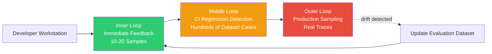
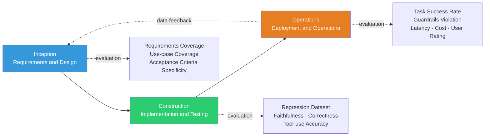
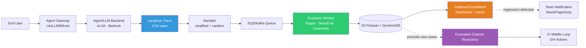

AIDLC (AI Development Life Cycle) handles **stochastic outputs**, unlike a traditional SDLC. An LLM or agent can produce different responses to the same input, and passing a unit test once does not guarantee consistent correctness. This document explains how to embed evaluation into AIDLC's three loops (Inner, Middle, and Outer) and describes benchmarks, tools, and architectures used in practice as of April 2026.

---

## 1. Why Evaluation-driven Loop

### 1.1 SDLC TDD vs AIDLC Evaluation-driven

| Aspect | Traditional SDLC (TDD) | AIDLC (Evaluation-driven) |
|------|-----------------|--------------------------|
| Output characteristics | Deterministic (same input → same output) | Stochastic (same input → a distribution) |
| Definition of correctness | A single expected value | Acceptable ranges + distributions of quality metrics |
| Failure signal | Assertion failure = bug | Metric decline = potential drift, regression, or quality degradation |
| Reproducibility | 100% reproducible | Approximately reproducible with fixed seed/temperature |
| Gate condition | All tests pass | Evaluation metrics meet thresholds (for example, Faithfulness ≥ 0.90) |
| Evaluation cadence | Per commit | Per commit + dataset changes + production sampling |

TDD follows a loop of failing test → implementation → refactoring. AIDLC's evaluation-driven loop follows **evaluation dataset → agent/prompt/model change → metric comparison → gate approval**. A single feature addition can degrade two of ten metrics, so a **multidimensional metrics dashboard** is the default instead of a simple pass/fail result.

### 1.2 CI Role in Training → Deployment Flow

In a traditional SDLC, CI consists of builds and unit tests. AIDLC expands its responsibilities:

1. Compare committed prompt, agent, or model changes against the evaluation dataset baseline.
2. Check whether core metrics such as faithfulness, task success rate, and tool-use accuracy remain within acceptable ranges.
3. Measure cost metrics, including tokens and latency, for regressions.
4. Assess drift against production samples.
5. Continue the deployment pipeline only after the gate passes.

CI therefore extends from **checking whether code compiles** to **checking whether the agent maintains its expected quality**.

### 1.3 Relationship with Inner / Middle / Outer Loop

AIDLC divides evaluation into three layers to balance cost, speed, and accuracy.


```mermaid
flowchart LR
    Dev[Developer Workstation] --> Inner[Inner Loop<br/>Immediate Feedback<br/>10-20 Samples]
    Inner --> CI[Middle Loop<br/>CI Regression Detection<br/>Hundreds of Dataset Cases]
    CI --> Prod[Outer Loop<br/>Production Sampling<br/>Real Traces]
    Prod -. drift detected .-> Dataset[Update Evaluation Dataset]
    Dataset --> Inner

    style Inner fill:#2ecc71,color:#fff
    style CI fill:#f39c12,color:#fff
    style Prod fill:#e74c3c,color:#fff
```

- **Inner Loop (seconds to minutes)**: After changing a prompt or function, the developer checks 10–20 samples for local regressions. Promptfoo and pytest-based tools are suitable.
- **Middle Loop (minutes to tens of minutes)**: CI runs for each pull request. Ragas or DeepEval evaluates hundreds of dataset cases and gates changes against the allowed deviation from the baseline. Runs in GitHub Actions or CodeBuild.
- **Outer Loop (continuous)**: Production traces are sampled for asynchronous evaluation. Dashboards track drift, regressions, and safety violations, while the evaluation dataset is updated periodically.

---

## 2. Official Benchmarks (as of April 2026)

Team-specific datasets alone make it difficult to compare overall AIDLC capabilities. **Public benchmarks** provide an external reference.

### 2.1 Coding Agent Specialized Benchmarks

| Benchmark | Scale | Focus | State of the Art as of April 2026 | URL |
|---------|------|------|------------------|-----|
| **SWE-bench Verified** | 500 human-verified GitHub issues | Realistic PR-style bug fixes | 70%+ pass@1 for leading agents | [swebench.com](https://www.swebench.com/) |
| **SWE-bench Multimodal** | Web UI bug fixes, including screenshots | Combined visual and code reasoning | Early stage | [swebench.com/multimodal](https://www.swebench.com/multimodal.html) |
| **TerminalBench** | Real shell/CLI tasks | Terminal operations and filesystem tasks | ~50% success rate | [tbench.ai](https://www.tbench.ai/) |
| **AgentBench** | Eight environments (OS, DB, KG, Web, and others) | Multi-turn tool use | Substantial variation by model | [github.com/THUDM/AgentBench](https://github.com/THUDM/AgentBench) |
| **MLE-bench** | 75 Kaggle-style ML tasks | End-to-end ML engineering | Medal attainment rate | [github.com/openai/mle-bench](https://github.com/openai/mle-bench) |

- **SWE-bench Verified** is a set of 500 issues revalidated by human reviewers from Princeton and OpenAI in 2024. As of April 2026, it is the de facto reference for comparing agent performance.
- **MLE-bench**, released by OpenAI, evaluates ML engineering capabilities by measuring how often models earn medals on Kaggle-style tasks.

#### SWE-bench Verified Structure

The original SWE-bench contains 2,294 issues with substantial variation in difficulty and reproducibility. The 500 Verified issues were selected using the following criteria:

1. **Specification clarity**: Issue descriptions and reproduction steps are understandable to human readers.
2. **Test reliability**: Evaluation tests accurately capture the bug; flaky tests are excluded.
3. **Environment reproducibility**: Container images can be reproduced deterministically.
4. **Appropriate scope**: Overly broad or infeasible cases are excluded.

From an AIDLC perspective, its importance lies in being the single public reference for whether an agent can complete the specification → design → implementation → verification cycle at the level of a **real pull request**.

#### Benchmark Usage Precautions

- **Training contamination**: Public benchmarks may be included in pretraining data. Supplement them with benchmarks such as LiveCodeBench that regularly add new problems.
- **Sample size and significance**: A difference between 68% for Agent A and 70% for Agent B on 500 issues may not be statistically significant. Assess it with bootstrap confidence intervals.
- **Discriminating power relative to cost**: A full benchmark run can cost thousands of dollars with leading models, making it unsuitable for every CI pull request. Run it weekly or per release.

### 2.2 General LLM/Reasoning Benchmarks (Reference)

These benchmarks are difficult to apply directly to coding agents, but serve as an initial filter for model selection.

| Benchmark | Focus | Considerations |
|---------|------|---------|
| **MMLU-Pro** | Expert knowledge across 14 domains with five-option multiple-choice questions; an improved MMLU | Leading models converge above 80% as of April 2026, reducing differentiation |
| **GPQA Diamond** | Graduate-level science questions (198) | Frequently used to evaluate dedicated reasoning models from Google and OpenAI |
| **MATH** | High-school competition mathematics | Approaching saturation |
| **HumanEval / HumanEval+** | Python function generation | Nearly saturated; replacement with LiveCodeBench is recommended |
| **LiveCodeBench** | Continuously updated coding problems | Adds problems monthly to reduce training contamination |

> **Caution:** Benchmark scores alone do not establish service quality. Practical evaluation combines **domain-specific datasets and public benchmarks**.

### 2.3 METR task-length doubling

The METR (Model Evaluation & Threat Research) study, “Measuring AI Ability to Complete Long Tasks,” reports a significant trend:

- The **duration of continuous tasks that models can successfully complete doubles approximately every seven months**.
- The duration increased from seconds in 2019 to tens of minutes in 2024–2025. If the trend continues, it is expected to reach several hours in 2027–2028.
- Measurement method: Human completion times for tasks such as HCAST (Human-Calibrated Autonomy Software Tasks) are used to estimate the task duration an agent can complete with a 50% success rate.

Implications for enterprises:

1. Even if a task that takes a person one hour is not currently suitable for automation, it is likely to cross that threshold within one to two years.
2. Evaluation datasets should expand periodically to include **longer-horizon tasks**.
3. Guardrails, audit, and human-in-the-loop (HITL) systems must strengthen as task duration increases.

URL: [metr.org/blog/2025-03-19-measuring-ai-ability-to-complete-long-tasks](https://metr.org/blog/2025-03-19-measuring-ai-ability-to-complete-long-tasks/)

---

## 3. Evaluation Tools Comparison (as of April 2026)

The following comparison focuses on the AIDLC Middle Loop: CI integration and connections to production.

| Tool | License | Main Metrics | CI Integration | Production Sampling | Strengths | Limitations |
|------|---------|-----------|-------------|----------------|------|------|
| **Ragas v0.2+** | Apache 2.0 | faithfulness, context_precision, context_recall, answer_relevancy, noise_sensitivity | Python SDK, GH Actions, CodeBuild | Official support through Langfuse/Phoenix integration | Most mature for RAG evaluation, with extensive references | LLM-as-judge invocation costs |
| **DeepEval** | Apache 2.0 | 30+ metrics, including G-Eval, Toxicity, PII, Hallucination, Bias, and Correctness | PyTest integration (`assert_test()`) | Confident AI integration | Familiar to PyTest users; custom metric DSL | Moderately mature ecosystem; some metrics require validation |
| **LangSmith** | SaaS + self-host beta | Trace, Dataset, Auto/Custom Evaluator, LLM-as-judge | `langsmith evaluate` CLI, GH Actions | Managed (native to LangChain) | LangChain/LangGraph integration and A/B experiment management | SaaS dependency and data governance concerns |
| **Braintrust** | SaaS + self-host Enterprise | Dataset, Grading, Replay, Playground | `braintrust eval` CLI | Managed, log SDK | Strong developer experience and Playground UX | Vendor lock-in and on-premises constraints |
| **AWS Labs aidlc-evaluator** | Apache 2.0 (early, v0.1.6+) | AIDLC phase deliverable compliance, Common Rules compliance, and Stage Transition metrics | Python execution through `scripts/` | - | Evaluates adherence to the AIDLC methodology itself | Lacks general-purpose quality metrics; pair with Ragas/DeepEval |
| **Promptfoo** | MIT | Assertions, LLM-as-judge, classifiers | YAML configuration + `promptfoo eval` + GH Actions | Partial | Lightweight and declarative; effective for prompt comparison | Limited support for agent evaluation and complex workflows |
| **Inspect AI (UK AISI)** | Apache 2.0 | Agent safety/capability (solver + scorer) | Python/CLI, GH Actions | - | Government-agency evaluation standards and sandbox execution | Learning curve and a relatively small community |

### 3.1 Tool Selection Guide

- **RAG-focused pipelines** → Ragas + Langfuse as an open-source combination
- **Python/PyTest-focused teams** → DeepEval
- **LangChain/LangGraph users** → LangSmith for native integration
- **Strong developer experience and team experiment management** → Braintrust
- **Auditing AIDLC methodology compliance** → AWS Labs aidlc-evaluator
- **Simple prompt A/B comparisons** → Promptfoo
- **Agent safety/capability evaluation** → Inspect AI

> In practice, combinations of two or three tools are common, such as **Ragas (quality) + Inspect AI (safety) + aidlc-evaluator (methodology compliance)** or **Braintrust (experimentation) + Langfuse (observability)**.

### 3.2 Core Ragas v0.2+ Metrics

| Metric | Meaning | Calculation Summary |
|-------|------|-------------|
| Faithfulness | Is the response grounded in the retrieved context? | Decompose the response into claims and calculate the proportion supported by the context |
| Context Precision | What proportion of retrieved documents is relevant to the correct answer? | MAP-style calculation that accounts for top-k ordering |
| Context Recall | Was all information needed for the correct answer retrieved? | Decompose ground truth into sentences and calculate the proportion covered by the context |
| Answer Relevancy | Does the response address the intent of the question? | Embedding similarity between questions generated from the response and the original question |
| Noise Sensitivity | Does the response change when irrelevant documents are injected? | Measures RAG pipeline robustness |

Retrieval quality and generation quality are intertwined in a RAG pipeline, complicating diagnosis. Ragas metrics help separate these issues. For example, declining Faithfulness with rising Context Precision indicates **generation-stage hallucination**, while declining Context Precision indicates **retrieval-stage failure**.

### 3.3 DeepEval PyTest Integration

DeepEval integrates evaluation cases into PyTest pipelines with `assert_test()` and the `deepeval test run` command. `assert_test()` fails the test when a metric falls below its threshold. Configure dashboard uploads and result storage separately in the execution environment. [Official CI/CD guide](https://deepeval.com/docs/evaluation-unit-testing-in-ci-cd)

- **G-Eval**: Define an arbitrary rubric in natural language and score it with an LLM judge.
- **Hallucination / Bias / Toxicity**: Built-in safety metrics.
- **Custom Metric DSL**: Inherit from `BaseMetric` to implement team-specific criteria.

### 3.4 LangSmith / Braintrust — SaaS Experiment Management

These tools support large teams that systematically test 10–20 prompt combinations across three to five models. Shared capabilities include:

- Dataset versioning similar to Git
- Trace storage per run and side-by-side comparisons
- Separate groups for A/B experiments
- Editing and rerunning failed traces directly in a Playground
- Comparing evaluator results with historical runs over time

**Differences**: LangSmith is native to LangChain/LangGraph. Braintrust is framework-independent and focuses on developer experience (DX). For strict on-premises requirements, consider self-hosted options or an open-source alternative such as Langfuse.

### 3.5 AWS Labs aidlc-evaluator — Methodology Compliance Auditing

This tool audits **whether a project actually follows the AIDLC methodology**, rather than general-purpose quality metrics.

- Application of Common Rules: Deliverable filenames, structure, and approval checkpoints
- Stage Transition criteria: Completeness of deliverables before moving from Inception to Construction
- Compliance with extensions (`opt-in.md`)
- Detection of violations of organization-specific rules

At the v0.1.x stage, its general applicability and stability are limited. For organizations that standardize on AIDLC, however, it is the only tool that can monitor methodology compliance in CI **alongside Ragas/DeepEval**.

---

## 4. CI/CD Integration Patterns

### 4.1 Inner Loop — Developer Workstation

- Tools: PyTest integration through `deepeval`, `promptfoo`, or inline calls to `ragas.evaluate()`
- Data: 10–20 fixed samples (smoke set)
- Cadence: Pre-commit on code save or `make eval-fast`
- Purpose: Block critical regressions immediately with feedback in seconds

This code is a **scaffold that requires project integration**. In addition to `deepeval` and PyTest, supply three fixtures: `smoke_questions`, a nonempty list of questions; `run_pipeline(q)`, a function returning `(response string, list of actual retrieved document strings)` from the same execution; and `judge_model`, an explicitly selected model ID or `DeepEvalBaseLLM` implementation. Pin validated library versions and configure model access and a cost budget before running it. Fixture implementations are not included here.

```python
# Inner Loop scaffold — DeepEval smoke test
from deepeval import assert_test
from deepeval.metrics import FaithfulnessMetric, AnswerRelevancyMetric
from deepeval.test_case import LLMTestCase

def test_rag_smoke(run_pipeline, smoke_questions, judge_model):
    assert smoke_questions, "Smoke dataset must not be empty"
    for question in smoke_questions:
        response, contexts = run_pipeline(question)
        case = LLMTestCase(
            input=question, actual_output=response, retrieval_context=contexts
        )
        metrics = [
            FaithfulnessMetric(threshold=0.85, model=judge_model),
            AnswerRelevancyMetric(threshold=0.80, model=judge_model),
        ]
        assert_test(test_case=case, metrics=metrics)
```

### 4.2 Middle Loop — CI (GitHub Actions)

- Tools: Ragas + DeepEval + acceptable-threshold gates
- Data: 200–500 regression cases combining domain-specific cases with public benchmark subsets
- Cadence: Pull requests and merges into main
- Purpose: Detect regressions, visualize change impact, and gate deployment

The YAML below is also an **integration scaffold**. The project must supply `requirements-eval.txt`, the dataset, `run_ragas.py`, and `gate.py`. When choosing Ragas, use an `EvaluationDataset` and judge/embedding configuration that follow its [official `evaluate()` contract](https://docs.ragas.io/en/stable/references/evaluate/), then adapt the result to the schema consumed by `gate.py`. Do not pass DeepEval's `LLMTestCase` directly to Ragas.

```yaml
# .github/workflows/eval.yml (excerpt)
name: LLM Regression Eval
on: [pull_request]
jobs:
  eval:
    runs-on: ubuntu-latest
    steps:
      - uses: actions/checkout@v5
      - uses: actions/setup-python@v6
        with: {python-version: '3.12'}
      - run: pip install -r requirements-eval.txt
      - name: Run Ragas regression
        env:
          OPENAI_API_KEY: ${{ secrets.OPENAI_API_KEY }}
        run: python eval/run_ragas.py --dataset eval/datasets/regression.jsonl --out results.json
      - name: Gate on thresholds
        run: |
          python eval/gate.py results.json \
            --faithfulness 0.90 --context-precision 0.85 --answer-relevancy 0.85
      - uses: actions/upload-artifact@v4
        with: {name: eval-results, path: results.json}
```

- Implement `gate.py` to return `exit 1` for a failed threshold, missing/nonfinite score, or evaluation error. Ragas returns `NaN` for failed evaluations by default; the gate must not treat it as a pass.
- The example includes artifact upload only. Sending results to Langfuse/Braintrust dashboards requires a separate adapter.

### 4.3 Outer Loop — Production Sampling

- Tools: Langfuse traces → SQS/queue → asynchronous evaluator → S3/DB → Grafana
- Data: Statistical samples of production traces using random and stratified sampling
- Cadence: Continuous execution with hourly aggregation
- Purpose: Detect drift, provide early warnings for safety violations, and update evaluation datasets

> Offline CI detects regressions against historical datasets. Production sampling detects changes in the real-world distribution. Operating the two separately makes it possible to distinguish **concept drift from code regression**.

---

## 5. Evaluation Across AIDLC Phases


```mermaid
flowchart LR
    INC[Inception<br/>Requirements and Design] --> CON[Construction<br/>Implementation and Testing]
    CON --> OPS[Operations<br/>Deployment and Operations]
    OPS -. data feedback .-> INC

    INC -. evaluation .-> E1[Requirements Coverage<br/>Use-case Coverage<br/>Acceptance Criteria Specificity]
    CON -. evaluation .-> E2[Regression Dataset<br/>Faithfulness · Correctness<br/>Tool-use Accuracy]
    OPS -. evaluation .-> E3[Task Success Rate<br/>Guardrails Violation<br/>Latency · Cost · User Rating]

    style INC fill:#3498db,color:#fff
    style CON fill:#2ecc71,color:#fff
    style OPS fill:#e67e22,color:#fff
```

### 5.1 Inception

- **Requirements coverage evaluation**: Measure the percentage of use cases defined in `requirements.md` that the evaluation dataset covers.
- **AIDLC Common Rules compliance**: Use `aidlc-evaluator` to check deliverable formats and extension compliance.
- **Acceptance criteria specificity**: Convert vague criteria such as “works well” into measurable metrics, for example, “faithfulness ≥ 0.90, p95 response latency ≤ 3 s.”

### 5.2 Construction

- **Maintain a regression dataset**: Run 200–500 cases for each commit.
- **Ground-truth-based metrics**: Correctness, exact match, and tool-use precision/recall.
- **LLM-as-judge metrics**: Faithfulness, Relevancy, and Toxicity.
- **Budget/cost metrics**: Measure token and latency regressions on the same dataset.
- **Stage Transition gate**: All core metrics must pass before moving from Construction to Operations.

### 5.3 Operations

- **Production observability**: Langfuse/Phoenix traces and OTel span attributes (model, tokens, latency).
- **Guardrails Violation Rate**: Rates of PII exposure, prompt injection detection, and toxicity threshold violations.
- **Task Success Rate**: End-to-end task success, established through user confirmation or heuristics.
- **Feedback loop**: Promote failed traces into new evaluation cases through a dataset update pipeline.

### 5.4 Stage Transition Gate Checklist

| Transition | Required Conditions | Evaluation Tools |
|------|----------|---------|
| Inception → Construction | Requirements coverage ≥ 95%; measurable acceptance criteria; AIDLC Common Rules compliance | aidlc-evaluator + manual review |
| Construction → Operations | Core regression dataset metrics at or above baseline; p95 latency target met; security scans passed | Ragas/DeepEval + CI gate |
| Ongoing Operations | No drift in production metrics; guardrails violation rate below threshold | Langfuse + asynchronous evaluator |

The standard AIDLC pattern requires both an **automated gate based on metric thresholds and human checkpoint approval** at each transition. Automated gates alone cannot exclude cases in which metrics pass but practical quality remains inadequate.

---

## 6. Regression Detection and Alerting Strategy

### 6.1 Establish a Baseline

- Designate a specific Git tag or monthly snapshot as the golden baseline.
- Record the mean, standard deviation, and 95th percentile for each metric.
- Report new runs as relative changes from the baseline.

### 6.2 Statistical Significance

- For samples of 200 or fewer, **bootstrap confidence intervals** are practical because normality assumptions may be unreliable.
- Use p-values only as supporting indicators. For small datasets, also consider **effect size (Cohen's d, Δmean/σ)**.
- Address multiple comparisons with Bonferroni or Benjamini–Hochberg (BH) correction when examining several metrics together.

### 6.3 Example Threshold Gates

| Metric | Lower Bound | Action |
|------|------|------|
| Faithfulness | < 0.90 | Block PR |
| Context Precision | < 0.85 | Block PR |
| Toxicity | > 0.01 | Block PR + notify security team |
| PII Leak Rate | > 0 | Immediate rollback |
| Task Success Rate | baseline-5 percentage points | Warning and manual review |
| p95 Latency | +20% | Warning |
| Cost per task | +15% | Warning |

### 6.4 Alert Noise Management

- Use an **exponentially weighted moving average (EWMA)** to reduce the impact of isolated spikes.
- Suppress duplicate alerts within 30 minutes.
- Route Blocker, Warning, and Info severities to separate channels.
- Review false-positive rates weekly and tune thresholds.

### 6.5 Distinguishing Drift Types

Production quality degradation falls into three broad categories, each with a different response path.

| Drift Type | Signal | Example Cause | Initial Response |
|-----------|------|--------|---------|
| Data Drift | Changes in input distribution or topics | New product categories or seasonality | Update the evaluation dataset |
| Concept Drift | The correct answer to the same question changes | Policy changes or version updates | Relabel ground truth |
| Model Drift | Behavior changes after an external API model update | Silent version updates from OpenAI/Anthropic | Pin model versions and run shadow evaluations |

Address data drift by expanding coverage, concept drift by rewriting ground truth, and model drift by pinning versions and evaluating new versions in shadow runs.

---

## 7. Cost Considerations

### 7.1 LLM-as-Judge Cost Structure

- Metric count differs from judge-call count. A metric can make multiple LLM calls, so measure actual calls, including retries, and input/output tokens per call. [DeepEval Faithfulness calculation](https://deepeval.com/docs/metrics-faithfulness)
- Assuming 500 cases × five metrics × one call per metric × 2,000 combined input/output tokens per call gives **5,000,000 tokens (5M) per run**. Actual usage depends on call counts and token lengths.
- Running evaluations for every PR in CI can create substantial monthly costs; set a cost ceiling.

### 7.2 Cost Reduction Strategies

1. **Use a smaller judge model**: Replace GPT-4.1 with GPT-4.1-mini or Claude Haiku 4.5 for the initial assessment, then recheck only borderline cases with a larger model.
2. **Local evaluator models**: Connect a separately hosted judge to the Inner/Middle Loop and validate both evaluation quality and local inference infrastructure costs.
3. **Sampling strategy**: Use 100 stratified samples for the Middle Loop instead of 500, with a full 500-case run once a month.
4. **Caching**: Cache judge results for identical prompt/response pairs and skip reevaluation when the input has not changed.
5. **Asynchronous evaluation**: Make selected metrics advisory rather than blocking PRs.

### 7.3 Cost-Effective Tool Combinations

Team size alone does not determine monthly cost. Calculate the following cost components using the actual call volumes in section 7.4.

| Team Size | Combination | Cost Components |
|--------|------|----------------|
| Small (&lt;5 people) | Locally run Ragas + Langfuse OSS + smaller judge | Judge/embedding calls + self-hosting |
| Medium (5–20 people) | Ragas + DeepEval + Langfuse + judge routing | Calls/retries per metric + trace retention |
| Large (20+ people) | Braintrust SaaS or LangSmith + judge | Judge calls + SaaS contract/usage + storage |

### 7.4 Cost Estimation Worksheet

Apply this formula to evaluations sharing the same metric, model, and token-length assumptions. `T_in` and `T_out` are average input/output tokens per judge call; `P_in` and `P_out` are the respective prices in **USD per million tokens**. Calculate CI and production separately when their assumptions differ, then add the costs.

```text
Evaluated cases/month =
  CI runs/month × cases/run + production traces/month × sampling rate
Judge calls/month =
  evaluated cases/month × metric count × average judge calls/metric
Judge cost (USD/month) ≈
  judge calls/month × (T_in × P_in + T_out × P_out) / 1,000,000
Total evaluation cost (USD/month) ≈
  judge cost + separate benchmark runs/month × cost (USD/run)
  + pipeline generation/embedding/infrastructure/SaaS/storage costs (USD/month)
```

Example: 50 CI runs/month × 200 cases × five metrics × one call per metric = **50,000 judge calls/month**. At 1,600 input tokens + 400 output tokens per call, usage is **80M input + 20M output = 100M total tokens/month**. With hypothetical worksheet prices of `P_in = $0.20/1M` and `P_out = $0.80/1M`, judge cost is `80 × $0.20 + 20 × $0.80 = $32/month`. These are not current prices for a particular model. This CI judge example excludes production evaluation and the other costs listed above.

For a real budget, apply the provider's billing token categories and prices, accounting for caching, retries, and calls per metric. Do not count benchmark costs again if their calls are already included.

---

## 8. Production Sampling Architecture

The following reference architecture implements the **trace → asynchronous evaluation → dashboard** flow in production.


```mermaid
flowchart LR
    U[End User] --> AGW[Agent Gateway<br/>LiteLLM/Bifrost]
    AGW --> AG[Agent/LLM Backend<br/>vLLM · Bedrock]
    AG --> TR[Langfuse Trace<br/>OTel span]
    TR --> SMP[Sampler<br/>stratified + random]
    SMP --> Q[SQS/Kafka Queue]
    Q --> EVW[Evaluator Worker<br/>Ragas · DeepEval · Guardrails]
    EVW --> S3[(S3 Parquet + DynamoDB)]
    S3 --> GRAF[Grafana/CloudWatch<br/>Dashboard + Alerts]
    GRAF -. regression detected .-> TEAM[Team Notification<br/>Slack/PagerDuty]
    S3 -. promote new cases .-> DS[Evaluation Dataset Repository]
    DS --> CI[CI Middle Loop<br/>GH Actions]

    style TR fill:#3498db,color:#fff
    style EVW fill:#2ecc71,color:#fff
    style GRAF fill:#e67e22,color:#fff
    style DS fill:#9b59b6,color:#fff
```

### 8.1 Key Design Considerations

- **Stratified sampling**: Combine 5% random sampling with 100% of error/low-rating traces and 100% of high-cost traces to retain important cases.
- **Asynchronous separation**: Use a queue so evaluation calls do not affect production latency.
- **Data governance**: Filter PII before storing data in S3, encrypt with KMS, and record access logs.
- **Feedback loop**: Promote failed traces to the **dataset repository**, where they become regression cases in the next CI cycle.
- **Unified observability**: Use the Langfuse trace ID as a shared key in CI evaluation results to correlate online and offline evaluations.

### 8.2 Deployment Options

- **EKS-based**: Langfuse through Helm, evaluator workers scaled out with Karpenter, and Grafana Operator.
- **AWS native**: Bedrock Agent + CloudWatch + SQS + Lambda evaluator for smaller deployments.
- **Hybrid**: Filters and samplers at the edge, with evaluators and dashboards on a central EKS cluster.

### 8.3 Sampler and Evaluation Worker Pseudocode

This is a **synchronous worker scaffold invoked by a queue**, using the same DeepEval contract as section 4.1. `fetch_trace` must wrap the tracing SDK and return a normalized trace with `input: str`, `output: str`, and `retrieved_docs: list[str]`. The sampler also requires `error: bool`, `user_rating: number or None`, and `estimated_cost_usd: number`. The project injects storage, dataset promotion, notification functions, and `judge_model`.

The returned/stored schema is `{"faithfulness": float, "answer_relevancy": float}`, with finite scores in the range 0–1. Read `metric.score` after calling `measure(case)` for [Faithfulness](https://deepeval.com/docs/metrics-faithfulness) and [Answer Relevancy](https://deepeval.com/docs/metrics-answer-relevancy). This worker promotes cases and alerts when `faithfulness < 0.85`. Evaluation failures propagate as exceptions, separate from low quality scores. Queue retries, error recording, and duplicate handling still require implementation.

```python
import math
import random
from deepeval.metrics import FaithfulnessMetric, AnswerRelevancyMetric
from deepeval.test_case import LLMTestCase

# sampler.py — stratified sampling
def should_sample(trace):
    if trace.error or trace.user_rating is not None and trace.user_rating <= 2:
        return True  # Sample 100% of negative signals
    if trace.estimated_cost_usd > 0.50:
        return True  # Sample 100% of high-cost traces
    return random.random() < 0.05  # Randomly sample 5% of the remainder

# worker.py — synchronous handler invoked by a queue
def evaluate_trace(trace_id, *, fetch_trace, judge_model, store_result,
                   promote_to_dataset, alert_team):
    trace = fetch_trace(trace_id)
    case = LLMTestCase(input=trace.input, actual_output=trace.output,
                       retrieval_context=trace.retrieved_docs)
    metrics = {
        "faithfulness": FaithfulnessMetric(threshold=0.85, model=judge_model),
        "answer_relevancy": AnswerRelevancyMetric(threshold=0.80, model=judge_model),
    }
    scores = {}
    for name, metric in metrics.items():
        metric.measure(case)
        score = metric.score
        if (isinstance(score, bool) or not isinstance(score, (int, float))
                or not math.isfinite(score) or not 0 <= score <= 1):
            raise ValueError(f"Invalid {name} score: {score!r}")
        scores[name] = float(score)
    store_result(trace_id, scores, target="s3://eval-results/")
    if scores["faithfulness"] < 0.85:
        promote_to_dataset(trace, dataset="regression_v2")
        alert_team(trace_id, severity="warning")
    return scores
```

### 8.4 Security and Governance

- **PII masking**: Filter email addresses, resident registration numbers, and card-number patterns at the sampler stage. Use a PII engine such as Microsoft Presidio when needed.
- **Encryption**: Encrypt trace payloads server-side with a KMS CMK and use TLS 1.3 in transit.
- **Access control**: Place evaluation dashboards behind IAM + SSO and enable CloudTrail audit logs.
- **Retention**: Retain raw traces for 30–90 days and aggregated metrics for longer periods using Parquet partitioning.
- **Data leakage prevention**: Add preprocessing so external LLM judges receive only summaries with PII removed.

### 8.5 Scaling Patterns

1. **Multi-tenant isolation**: Separate trace namespaces and dashboards by team while sharing common evaluators.
2. **Cost-performance Pareto monitoring**: Track cost and latency alongside quality metrics on the same dashboard as a Pareto front.
3. **Human-in-the-loop integration**: Queue borderline traces for periodic human labeling and use the labels as retraining or fine-tuning data.
4. **Shadow traffic**: Run a new model or prompt in parallel on X% of production traffic, compare metrics, and promote it gradually after the gate passes.

---

## 9. References

### Official Documentation and Projects

- AWS Labs AIDLC Workflows — [github.com/awslabs/aidlc-workflows](https://github.com/awslabs/aidlc-workflows)
- AWS Labs AIDLC Evaluator (scripts) — [github.com/awslabs/aidlc-workflows/tree/main/scripts](https://github.com/awslabs/aidlc-workflows/tree/main/scripts)
- Ragas Documentation — [docs.ragas.io](https://docs.ragas.io/)
- DeepEval — [github.com/confident-ai/deepeval](https://github.com/confident-ai/deepeval)
- LangSmith — [docs.smith.langchain.com](https://docs.smith.langchain.com/)
- Braintrust — [braintrust.dev/docs](https://www.braintrust.dev/docs)
- Promptfoo — [promptfoo.dev](https://www.promptfoo.dev/)
- Inspect AI (UK AISI) — [inspect.ai-safety-institute.org.uk](https://inspect.ai-safety-institute.org.uk/)

### Benchmarks

- SWE-bench Verified — [swebench.com](https://www.swebench.com/)
- SWE-bench Multimodal — [swebench.com/multimodal](https://www.swebench.com/multimodal.html)
- TerminalBench — [tbench.ai](https://www.tbench.ai/)
- AgentBench — [github.com/THUDM/AgentBench](https://github.com/THUDM/AgentBench)
- MLE-bench — [github.com/openai/mle-bench](https://github.com/openai/mle-bench)
- LiveCodeBench — [livecodebench.github.io](https://livecodebench.github.io/)
- GPQA — [github.com/idavidrein/gpqa](https://github.com/idavidrein/gpqa)
- MMLU-Pro — [github.com/TIGER-AI-Lab/MMLU-Pro](https://github.com/TIGER-AI-Lab/MMLU-Pro)

### Research Reports

- METR — Measuring AI Ability to Complete Long Tasks — [metr.org/blog/2025-03-19-measuring-ai-ability-to-complete-long-tasks](https://metr.org/blog/2025-03-19-measuring-ai-ability-to-complete-long-tasks/)
- METR HCAST — [HCAST Paper (PDF)](https://metr.org/hcast.pdf)

### Internal Documentation

- [AIDLC Methodology](/docs/aidlc/methodology)
- [AI Coding Agents](./ai-coding-agents.md)
- [Technology Roadmap](./technology-roadmap.md)
- [LLMOps Observability](/docs/agentic-ai-platform/operations-mlops/observability/llmops-observability)
- [Ragas Evaluation](/docs/agentic-ai-platform/operations-mlops/governance/ragas-evaluation)
