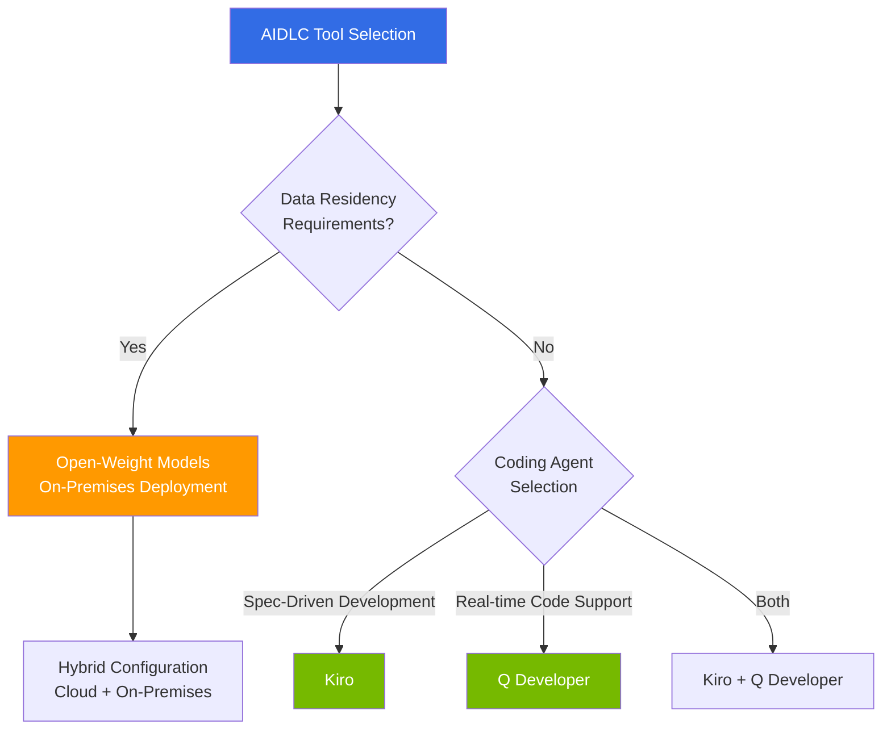

# AIDLC Tools & Implementation

> **Reading time**: Approx. 2 minutes

This section covers tools and technology stacks for implementing the AIDLC [methodology](/docs/aidlc/methodology) in real-world projects. From AI coding agents to open-weight model utilization, EKS-based declarative automation, and technology investment roadmaps, we provide practical implementation guides.

## Structure

| Document | Key Content | Target Audience |
|----------|-------------|----------------|
| [AI Coding Agents](./ai-coding-agents.md) | Kiro Spec-Driven development, Q Developer, agent comparison | Developers, Tech Leads |
| [Open-Weight Models](./open-weight-models.md) | On-premises deployment, cloud vs self-hosting TCO, data residency | Architects, Security Officers |
| [EKS Declarative Automation](./eks-declarative-automation.md) | Managed Argo CD, ACK, KRO, Gateway API | Developers, DevOps |
| [Technology Roadmap](./technology-roadmap.md) | Build-vs-Wait decision matrix, investment planning | CTO, Enterprise Architects |

## Tool Selection Decision Flow

