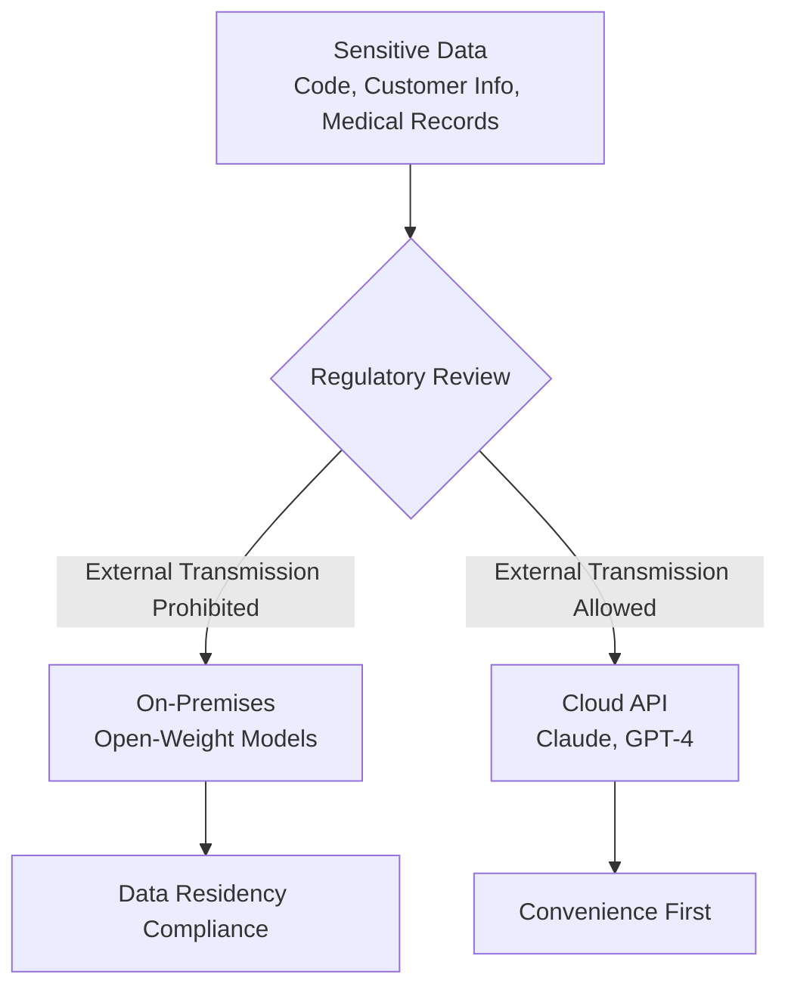
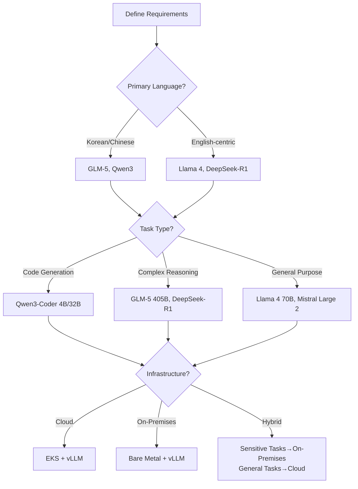
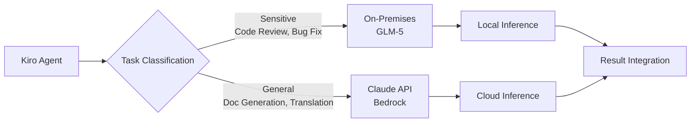
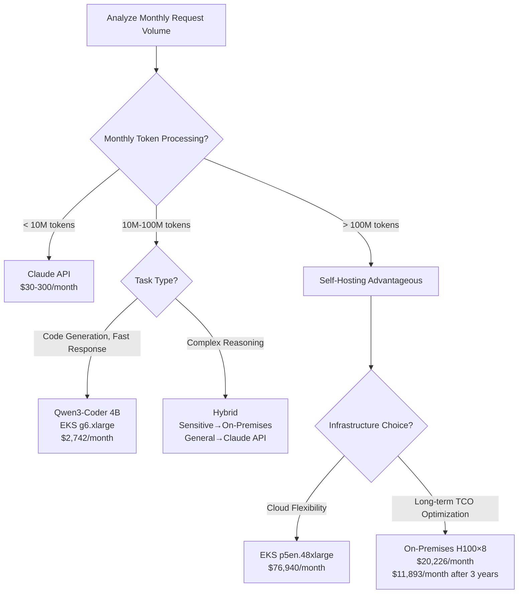

# Open-Weight Models

When operating AI Development Lifecycle (AIDLC) in enterprise environments, data residency and cost efficiency are critical decision factors. Open-weight models provide three differentiated values compared to cloud APIs (Claude, GPT-4): **securing data sovereignty**, **predictable TCO**, and **domain-specialized customization**.

## Why Open-Weight Models

### Three Core Drivers

#### 1. Data Residency Requirements

In finance, healthcare, and public sectors, external transmission of sensitive data is restricted by regulations.

- **Compliance Obligations**: GDPR, HIPAA, and financial privacy laws strictly limit data processing locations
- **Internal Codebase Protection**: Process source code on-premises without sending to external APIs
- **Sovereign AI**: Nations/enterprises directly control AI inference infrastructure



#### 2. Cost Optimization

When processing millions of tokens per month, self-hosted open models can be cheaper than cloud APIs.

- **Exit Pay-Per-Use**: Shift from per-API-call charges to fixed infrastructure costs
- **Maximize GPU Utilization**: Minimize idle time in 24-hour operations
- **Break-Even Point**: Self-hosting becomes advantageous when processing over 100M tokens/month (varies by GPU type)

#### 3. Domain Customization

Open-weight models can be optimized for specific domains through fine-tuning, prompt engineering, and ontology injection.

- **Improve Technical Terminology Accuracy**: Enhance medical, legal, financial term processing
- **Control Output Format**: Enforce JSON schema and code style guide compliance
- **Ontology Integration**: Inject domain knowledge combined with [Ontology Engineering](../methodology/ontology-engineering.md)

## Model Landscape (April 2026)

| Model | Provider | Parameters | Key Features | License | Recommended Deployment |
|-------|----------|-----------|--------------|---------|----------------------|
| **GLM-5** | THUDM | 405B | Multilingual (KO/ZH/EN) strength, excellent math/reasoning | Apache 2.0 | p5en.48xlarge (H200×8) |
| **Qwen3-Coder** | Alibaba | 4B-32B | Coding specialized, fast inference speed | Apache 2.0 | g6.xlarge (L4×1) |
| **Qwen3-235B** | Alibaba | 235B | MoE architecture, multimodal | Apache 2.0 | p5.48xlarge (H100×8) |
| **DeepSeek-R1** | DeepSeek | 671B | CoT reasoning specialized, RL-based training | MIT | p5en.48xlarge (H200×8) |
| **Llama 4** | Meta | 70B-405B | Broad ecosystem, stable performance | Llama 4 License | p4d.24xlarge (A100×8) |
| **Mistral Large 2** | Mistral | 123B | European data sovereignty considered design | Mistral License | p4d.24xlarge (A100×8) |

### Selection Criteria



## Deployment Patterns

### Pattern 1: EKS + vLLM Serving (Cloud)

Serve open models in cloud environments to maintain data residency while delegating infrastructure management to AWS.

```yaml
# GLM-5 405B deployment example (EKS Standard Mode)
apiVersion: apps/v1
kind: Deployment
metadata:
  name: glm5-vllm
spec:
  replicas: 1
  template:
    spec:
      nodeSelector:
        node.kubernetes.io/instance-type: p5en.48xlarge
      containers:
      - name: vllm
        image: vllm/vllm-openai:v0.18.2
        args:
        - --model
        - THUDM/glm-5-405b
        - --served-model-name
        - glm5
        - --tensor-parallel-size
        - "8"
        - --max-model-len
        - "8192"
        - --trust-remote-code
        resources:
          limits:
            nvidia.com/gpu: "8"
```

**Advantages**:
- Cost savings with Auto Scaling and Spot instances
- Dynamic node provisioning via Karpenter
- CloudWatch and Prometheus integrated monitoring

**Disadvantages**:
- Hourly GPU instance costs (p5en.48xlarge: ~$98/h)
- Data stays within VPC but infrastructure depends on cloud

### Pattern 2: On-Premises Bare Metal + vLLM

Used when complete data sovereignty is required or cloud transmission is prohibited.

```bash
# Deploy vLLM on NVIDIA H100×8 server
docker run --gpus all \
  -p 8000:8000 \
  -v /data/models:/models \
  vllm/vllm-openai:v0.18.2 \
  --model /models/glm-5-405b \
  --served-model-name glm5 \
  --tensor-parallel-size 8 \
  --max-model-len 8192 \
  --trust-remote-code
```

**Infrastructure Requirements**:
- GLM-5 405B: H100 8 cards or H200 8 cards (FP16 ~810GB VRAM)
- Qwen3-Coder 4B: L4 1 card (FP16 ~8GB VRAM)
- Network: Internal network-only endpoints, no external internet required

**Advantages**:
- Absolute data control
- Minimize network latency (on-premises 10G network)
- Long-term cloud cost savings

**Disadvantages**:
- CapEx burden (H100 server ~$300K)
- Operational personnel required (GPU management, model updates)
- Power consumption even during idle time

### Pattern 3: Hybrid Configuration

Mix on-premises and cloud APIs based on task sensitivity.



**Implementation Example (LiteLLM Routing)**:

```yaml
# litellm-config.yaml
model_list:
  - model_name: sensitive-tasks
    litellm_params:
      model: openai/glm5
      api_base: http://on-prem-vllm.internal:8000/v1
      api_key: dummy
  - model_name: general-tasks
    litellm_params:
      model: bedrock/anthropic.claude-sonnet-4-20250514
      aws_region_name: us-east-1

router_settings:
  routing_strategy: simple-shuffle
  fallbacks:
    - sensitive-tasks: []  # No fallback (external transmission prohibited)
    - general-tasks: [openai/gpt-4o]
```

## TCO Comparison Framework

### Cost Items

#### Cloud API (Claude, GPT-4)

| Item | Claude Sonnet 4.5 | Notes |
|------|-------------------|-------|
| Input Tokens | $3/1M tokens | Bedrock pricing |
| Output Tokens | $15/1M tokens | Output is 5x more expensive than input |
| Operations Staff | $0 | No management required |
| Initial Investment | $0 | Pay-as-you-go |

**Monthly Cost Calculation Example**:
- Process 50M input tokens, 10M output tokens per month
- Input: 50M × $3/1M = $150
- Output: 10M × $15/1M = $150
- Total: **$300/month**

#### Self-Hosted Open Model (EKS + vLLM)

| Item | Qwen3-Coder 4B (g6.xlarge) | GLM-5 405B (p5en.48xlarge) |
|------|---------------------------|----------------------------|
| GPU Instance | $1.01/h × 730h = $737/month | $98/h × 730h = $71,540/month |
| Storage (Model) | ~$5/month (8GB) | ~$400/month (810GB) |
| Network Egress | Internal traffic free | Internal traffic free |
| Operations Staff | 0.2 FTE (~$2,000/month) | 0.5 FTE (~$5,000/month) |
| Total | **~$2,742/month** | **~$76,940/month** |

**On-Premises Bare Metal (3-year amortization)**:

| Item | H100×8 Server | Notes |
|------|--------------|-------|
| Hardware | $300,000 / 36 months = $8,333/month | Initial CapEx |
| Power | 10.2kW × $0.12/kWh × 730h = $893/month | Regional electricity rate variation |
| Data Center | ~$1,000/month | Cooling, space |
| Operations Staff | 1 FTE (~$10,000/month) | 24/7 support |
| Total | **~$20,226/month** | ~$11,893/month after 3 years (hardware cost excluded) |

### Break-Even Point Guide



**Decision Criteria**:

1. **Less than 10M tokens/month**: Use Claude API or GPT-4 (no management overhead)
2. **10M-100M tokens/month**: Hybrid configuration based on task type and sensitivity
3. **Over 100M tokens/month**: Consider self-hosting (EKS or on-premises)
4. **CapEx investment possible + 3+ year operation planned**: On-premises bare metal is cheapest

## AIDLC Integration

### Kiro + Open-Weight Models

[AI Coding Agent Kiro](./ai-coding-agents.md) can use open-weight models as backend to perform Spec-Driven development.

```typescript
// kiro-config.ts
export const kiroConfig = {
  models: {
    sensitive: {
      provider: 'vllm',
      endpoint: 'http://on-prem-vllm.internal:8000/v1',
      model: 'glm5',
      use_cases: ['code-review', 'security-audit', 'refactoring']
    },
    general: {
      provider: 'bedrock',
      model: 'anthropic.claude-sonnet-4-20250514',
      region: 'us-east-1',
      use_cases: ['documentation', 'translation', 'test-generation']
    }
  },
  routing: {
    strategy: 'by-file-path',
    rules: [
      { pattern: 'src/core/**', model: 'sensitive' },
      { pattern: 'docs/**', model: 'general' }
    ]
  }
};
```

### Steering Files: Model-Specific Prompt Optimization

Open-weight models have different training data and architectures, so they may respond differently to the same prompts.

**GLM-5 Steering File**:

```yaml
# .aider.glm5.yml
model: glm5
edit_format: diff
use_git: true
auto_commits: false
stream: true

# GLM-5 performs better with Chinese/Korean mixed use
prompts:
  system: |
    You are a professional software engineer.
    When modifying code, always respond in unified diff format.
    Write explanations of changes in Korean, but keep technical terms in English.
```

**Qwen3-Coder Steering File**:

```yaml
# .aider.qwen3.yml
model: qwen3-coder
edit_format: whole
use_git: true

# Qwen3-Coder is more stable with complete file replacement approach
prompts:
  system: |
    You are a coding assistant specialized in Python and TypeScript.
    Always return the complete modified file.
    Use type hints and follow PEP 8 style guide.
```

### Ontology Injection

Inject domain ontology built in [Ontology Engineering](../methodology/ontology-engineering.md) into open model context to improve accuracy.

```python
# ontology_injection.py
from typing import Dict, List

class OntologyInjector:
    def __init__(self, ontology_path: str):
        self.ontology = self.load_ontology(ontology_path)
    
    def inject_context(self, prompt: str, domain: str) -> str:
        """Add domain ontology to prompt"""
        domain_terms = self.ontology.get(domain, {})
        
        context = "# Domain Knowledge\n"
        for term, definition in domain_terms.items():
            context += f"- {term}: {definition}\n"
        
        return f"{context}\n# Task\n{prompt}"
    
    def load_ontology(self, path: str) -> Dict[str, Dict[str, str]]:
        # Load ontology file in JSON/YAML format
        pass

# Usage example
injector = OntologyInjector("/data/ontology/finance.yaml")
prompt = injector.inject_context(
    "Analyze the following transaction records to find anomaly patterns.",
    domain="finance"
)
```

**Effects**:
- Improve financial terminology (e.g., arbitrage, short selling) interpretation accuracy
- Strengthen domain-specific rule (e.g., KYC, AML) compliance
- Save tokens by replacing few-shot examples with ontology

## Security and Compliance

### Model License Review

Even open-weight models may have commercial use restrictions depending on license.

| License | Commercial Use | Derivative Model Distribution | Notes |
|---------|---------------|------------------------------|-------|
| **Apache 2.0** | ✅ Allowed | ✅ Allowed | Includes patent protection clause |
| **MIT** | ✅ Allowed | ✅ Allowed | Disclaimer required |
| **Llama 4 License** | ✅ Allowed (MAU < 700M) | ⚠️ Limited | Large-scale services require separate agreement |
| **Mistral License** | ✅ Allowed | ⚠️ Limited | Notify when distributing fine-tuned models |

**Recommended Process**:
1. Review license with legal team (especially Llama, Mistral)
2. Track model provenance (check Hugging Face Model Card)
3. Review dataset licenses when fine-tuning

### Output Auditing

Open models may have sensitive information in training data, so output filtering is necessary.

```python
# output_filter.py
import re
from typing import List

class OutputFilter:
    def __init__(self):
        self.patterns = [
            (r'\b\d{3}-\d{2}-\d{4}\b', '[SSN-REDACTED]'),  # SSN
            (r'\b[\w\.-]+@[\w\.-]+\.\w+\b', '[EMAIL-REDACTED]'),  # Email
            (r'\b\d{4}-\d{4}-\d{4}-\d{4}\b', '[CARD-REDACTED]')  # Card number
        ]
    
    def filter(self, text: str) -> str:
        """Automatically remove sensitive information"""
        for pattern, replacement in self.patterns:
            text = re.sub(pattern, replacement, text)
        return text
    
    def audit_log(self, text: str, redacted_count: int) -> None:
        """Record filtering history"""
        # Send to CloudWatch Logs or S3
        pass
```

### AI Act Compliance

European AI Act, Korean AI Basic Act, and other regulations require the following for high-risk AI systems (healthcare, finance, recruitment):

1. **Explainability**: Provide model decision basis (attention weights, RAG sources)
2. **Human Oversight**: Humans perform final decision-making
3. **Bias Monitoring**: Measure output fairness by race, gender, age
4. **Incident Response Procedures**: Model malfunction rollback process

**AIDLC Application**:
- Establish model governance policies in [Governance Framework](../enterprise/governance-framework.md)
- Log all inference requests/responses via Langfuse
- Perform bias audits quarterly (e.g., [RAGAS](../../agentic-ai-platform/operations-mlops/ragas-evaluation.md) evaluation)

## References

### Internal Documentation
- [Governance Framework](../enterprise/governance-framework.md) — Data sovereignty policies
- [Cost Effectiveness](../enterprise/cost-estimation.md) — Detailed TCO calculations
- [AI Coding Agents](./ai-coding-agents.md) — Kiro integration guide
- [Ontology Engineering](../methodology/ontology-engineering.md) — Ontology injection patterns

### Official Model Documentation
- [GLM-5 GitHub](https://github.com/THUDM/GLM-5) — Apache 2.0 license
- [Qwen3 Model Card](https://huggingface.co/Qwen/Qwen3-235B) — MoE architecture details
- [DeepSeek-R1 Paper](https://arxiv.org/abs/2501.12948) — RL training methodology
- [vLLM Documentation](https://docs.vllm.ai/en/v0.18.2/) — Serving optimization

### Cost Analysis Tools
- [AWS Pricing Calculator](https://calculator.aws/) — EKS GPU instance costs
- [Hugging Face LLM Leaderboard](https://huggingface.co/spaces/open-llm-leaderboard/open_llm_leaderboard) — Model performance comparison
- [LLM TCO Calculator](https://github.com/anthropics/llm-tco-calculator) — Self-hosting vs API comparison

## Next Steps

1. **Pilot Project**: Deploy Qwen3-Coder 4B to small project (1 g6.xlarge)
2. **Cost Tracking**: Compare cloud API vs self-hosting TCO over 2 months
3. **Sensitivity Classification**: Classify codebase as sensitive/general to design hybrid configuration
4. **Governance Policy**: Specify open model usage rules in [Governance Framework](../enterprise/governance-framework.md)
5. **Scale Up**: Expand to GLM-5 405B or DeepSeek-R1 after pilot success
