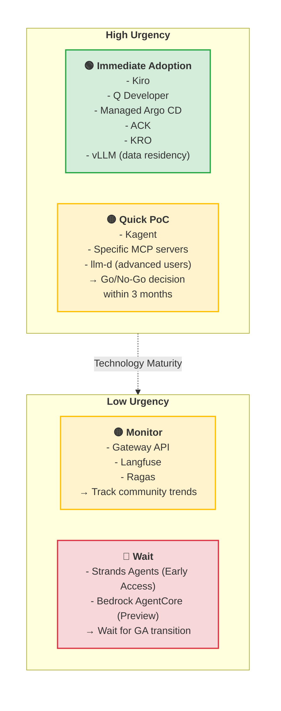
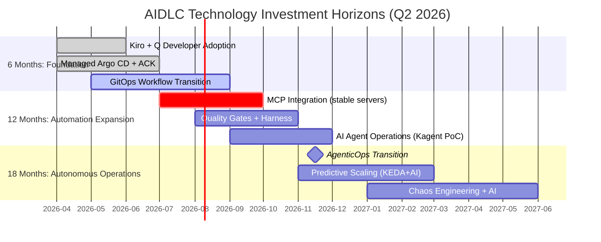

# Technology Roadmap

The tool ecosystem supporting AIDLC is evolving rapidly. **"Should we build now, or wait until the technology matures?"** is a critical decision to make quarterly. This document assesses the maturity of AWS and open-source AIDLC tools as of Q2 2026 and presents investment priorities.

## 1. The Technology Investment Dilemma

### 1.1 "Build Now" vs "Wait and Adopt"

Typical questions organizations face when implementing AIDLC:

**When to Build Now:**
- Business urgency is high and technology is already GA (General Availability)
- Falling behind competitors in development speed
- Regulatory requirements (data residency, compliance) must be applied immediately
- Legacy system debt causing manual operation costs to surge

**When to Wait:**
- Tool is in Early Access/Preview with high API change probability
- High vendor lock-in risk with no alternatives
- Current team's technical capabilities cannot handle tool operations
- PoC results show unclear ROI or technical debt increase concerns

:::tip Investment Decision Framework
Use the **Urgency × Maturity Matrix** (see Section 3) to determine adoption timing for each tool. Start with tools in the **Immediate Adoption** (High urgency + Stable maturity) quadrant.
:::

### 1.2 2026 Technology Environment Characteristics

**Mature Technologies:**
- Kubernetes (v1.35 GA, includes DRA)
- vLLM (v0.18+, PagedAttention v2)
- GitOps (Argo CD, Flux CD)
- ACK (50+ AWS services GA)
- Gateway API (v1.2 GA)

**Rapidly Evolving:**
- MCP (Model Context Protocol) server ecosystem (50+ open-source servers)
- AI coding agents (Kiro, Q Developer, Cursor, Windsurf)
- Kubernetes operators (KRO, Kagent)
- Distributed inference engines (llm-d v0.5, Dynamo v1.x)

**Early Stage:**
- Strands Agents SDK (Early Access)
- Bedrock AgentCore (Preview)
- Kagent (Early, community-driven)

---

## 2. Current Tool Maturity Assessment (Q2 2026)

The following table summarizes maturity, recommendations, and alternative availability for core tools supporting AIDLC workflows.

| Tool | Maturity | Recommendation | Notes |
|------|----------|---------------|-------|
| **Kiro** | GA | ✅ Immediate Adoption | Core of Spec-driven development. MCP integrated. Alternatives: Cursor Composer, Windsurf Flows |
| **Q Developer** | GA | ✅ Immediate Adoption | AWS native, real-time code generation. Alternatives: GitHub Copilot, Cursor |
| **Managed Argo CD** | GA | ✅ Immediate Adoption | EKS native GitOps. Alternative: Flux CD (self-hosted) |
| **ACK (AWS Controllers for Kubernetes)** | GA (50+ services) | ✅ Immediate Adoption | Declarative AWS resource management. Alternative: Crossplane |
| **KRO (Kubernetes Resource Orchestrator)** | GA | ✅ Immediate Adoption | Complex Kubernetes resource graph automation. Alternatives: Helm, Kustomize |
| **Gateway API + LBC v3** | GA | ✅ Immediate Adoption | ExtProc support, AI Gateway foundation. Alternative: Istio + EnvoyFilter |
| **MCP Servers** | 50+ GA | 🟡 Selective Adoption | Large maturity variance by tool. Adopt only stabilized ones after experimentation. See [mcp.run](https://mcp.run) |
| **Kagent** | Early | 🟠 Experimental | K8s AI Agent automation. Thorough testing before production. Alternative: kubectl + scripts |
| **Strands Agents SDK** | GA | ✅ For Custom Agents | Bedrock Agents + CDK based. Alternatives: LangGraph, CrewAI |
| **vLLM** | v0.18+ (Mature) | ✅ For Data Residency | Open-weight model serving. Alternatives: TensorRT-LLM, SGLang |
| **llm-d** | v0.5+ (GA) | 🟡 Advanced Users | Disaggregated Serving, NIXL KV transport. Alternatives: Ray Serve, vLLM multi-instance |
| **Dynamo** | v1.x (GA) | 🟡 Advanced Users | NVIDIA enterprise inference platform. Alternatives: vLLM, TensorRT-LLM |
| **Langfuse** | v3.x (GA) | ✅ Immediate Adoption | Self-hosted observability. Alternatives: LangSmith (SaaS), Helicone |
| **Ragas** | v0.2+ (GA) | ✅ Immediate Adoption | AI Agent evaluation framework. Alternatives: PromptFoo, TruLens |

:::info Maturity Legend
- **GA**: Production-ready, API stability guaranteed
- **Early**: Functionality works but API changes possible
- **Preview**: AWS preview service, experimental use
:::

### 2.1 Detailed Tool Evaluations

#### Kiro (Spec-Driven Development)
- **Maturity**: GA (officially released November 2025)
- **Strengths**: Requirements → code auto-generation, MCP integration, fully automated through Git commits
- **Weaknesses**: Vendor lock-in (AWS only), initial learning curve
- **Recommendation**: Start with new microservice development, combine with Mob Elaboration ritual
- **Alternatives**: Cursor Composer (multi-cloud), Windsurf Flows (IDE-independent)

See **[AI Coding Agents](./ai-coding-agents.md)** for details.

#### Q Developer
- **Maturity**: GA (launched 2024, continuous updates)
- **Strengths**: Optimized AWS service code generation, excellent IDE integration, free tier available
- **Weaknesses**: Weaker than GitHub Copilot in non-AWS environments
- **Recommendation**: AWS-centric organizations should adopt as standard tool
- **Alternatives**: GitHub Copilot (general purpose), Cursor (AI-first IDE)

#### Managed Argo CD
- **Maturity**: GA (announced at 2024 re:Invent)
- **Strengths**: EKS native, AWS managed, IAM integration
- **Weaknesses**: Vendor lock-in (AWS only), some community plugins unsupported
- **Recommendation**: Prioritize Managed Argo CD for new EKS clusters
- **Alternatives**: Flux CD (self-hosted), Jenkins X (legacy)

#### MCP Servers
- **Maturity**: Varies greatly by server (20+ stable out of 50+ servers)
- **Strengths**: Standardized context passing, 50+ open-source servers
- **Weaknesses**: Large quality variance, production security validation needed
- **Recommendation**: Adopt only stability-verified servers (e.g., `@modelcontextprotocol/server-filesystem`, `@modelcontextprotocol/server-github`)
- **Alternatives**: Direct API integration (without MCP)

MCP server list and evaluation: [mcp.run](https://mcp.run)

#### Kagent
- **Maturity**: Early (open-sourced 2025)
- **Strengths**: K8s AI Agent automation, Mob Construction workflow experimentation
- **Weaknesses**: Community-driven project, no enterprise support
- **Recommendation**: Experiment in sandbox environment, thorough validation before production
- **Alternatives**: kubectl + bash scripts, Helm hooks

---

## 3. Build-vs-Wait Decision Matrix

The following 2x2 matrix presents tool adoption strategies based on **business urgency** and **technology maturity**.

### 3.1 Strategies by Quadrant

#### 🟢 Immediate Adoption (High Urgency + Stable Technology)
- **Characteristics**: GA status, API stability guaranteed, reference architectures exist
- **Approach**: Apply to new projects first, establish enterprise-wide rollout roadmap within 3 months
- **Risk**: Low (vendor support guaranteed, active community)
- **Example Tools**: Kiro, Q Developer, Managed Argo CD, ACK, KRO

#### 🟡 Quick PoC (High Urgency + Early Technology)
- **Characteristics**: Functionality works but API changes possible, insufficient enterprise support
- **Approach**: 3-month PoC in sandbox → Go/No-Go decision
- **Risk**: Medium (potential technical debt, may need API migration)
- **Example Tools**: Kagent, specific MCP servers, llm-d (advanced users)

#### 🟡 Monitor (Low Urgency + Stable Technology)
- **Characteristics**: GA status but currently low business priority
- **Approach**: Track community trends, quarterly reassessment
- **Risk**: Low (can catch up quickly if competitor gap emerges)
- **Example Tools**: Gateway API, Langfuse, Ragas

#### 🔴 Wait (Low Urgency + Early Technology)
- **Characteristics**: Preview/Early Access stage, low business urgency
- **Approach**: Wait until GA transition, conduct only benchmarking
- **Risk**: Low (wait cost < early adoption risk)
- **Example Tools**: Strands Agents (Early Access), Bedrock AgentCore (Preview)

---

## 4. Investment Horizons: 6 Months / 12 Months / 18 Months

The following timeline shows **phased investment priorities** for AIDLC adoption.

### 4.1 Phase 1: Foundation (6 Months)

**Goal**: AI coding tools + GitOps foundation, AIOps maturity Level 2 → 3

| Key Activities | Tools | Deliverables |
|---------------|-------|--------------|
| AI Coding Agent Adoption | Q Developer, Kiro | 30% development speed improvement |
| Spec-Driven Workflow Pilot | Kiro + MCP | Mob Elaboration ritual establishment |
| GitOps Transition | Managed Argo CD + ACK | 80%+ deployment automation rate |
| Declarative Infrastructure Management | KRO + ACK | 50% Terraform dependency reduction |

**Success Metrics:**
- 30%+ code generation automation rate (Q Developer)
- 50% deployment lead time reduction (GitOps)
- 70% manual infrastructure change reduction (ACK)

### 4.2 Phase 2: Automation Expansion (12 Months)

**Goal**: AI/CD pipeline transition, AIOps maturity Level 3 → 4

| Key Activities | Tools | Deliverables |
|---------------|-------|--------------|
| MCP Integration Expansion | 5+ stabilized MCP servers | AI Agent context auto-injection |
| Quality Gates Implementation | Ragas + Harness | AI output quality auto-validation |
| AI Agent Automation PoC | Kagent, Strands Agents | Mob Construction experimentation |
| Observability AI Integration | Langfuse + ADOT | LLMOps metrics auto-collection |

**Success Metrics:**
- 15%+ AI Agent autonomous task ratio (Kagent)
- 90%+ Quality Gate pass rate (Ragas)
- 70% incident detection time reduction (AI observability)

### 4.3 Phase 3: Autonomous Operations (18 Months)

**Goal**: AgenticOps transition, AIOps maturity Level 4+ (autonomous operations)

| Key Activities | Tools | Deliverables |
|---------------|-------|--------------|
| AgenticOps Transition | Kagent + Strands Agents | 60%+ operations automation rate |
| Predictive Scaling | KEDA + AI prediction models | 30% resource waste reduction |
| Chaos Engineering + AI | Chaos Mesh + AI Agent | Automatic failure recovery scenarios |
| Continuous Improvement Loop | Langfuse + Ragas | Weekly automatic performance reports |

**Success Metrics:**
- 60%+ operations automation rate (AI Agent)
- 85%+ predictive scaling accuracy (KEDA + AI)
- 40%+ automatic failure recovery rate (Chaos + AI)

:::tip Investment Priority by Horizon
- **6 Months**: Immediate ROI tools (Kiro, Q Developer, Argo CD)
- **12 Months**: Automation expansion (MCP, Quality Gates)
- **18 Months**: Autonomous operations (AgenticOps, predictive scaling)
:::

---

## 5. Vendor Lock-in Risk Assessment

When selecting AIDLC tools, consider **vendor lock-in risk** and **portability** together.

| Tool | Vendor Lock-in Risk | Alternative Availability | Portability |
|------|-------------------|------------------------|-------------|
| **Kiro** | 🔴 High (AWS only) | ✅ Cursor, Windsurf | Low (spec → code rewrite needed) |
| **Q Developer** | 🔴 High (AWS only) | ✅ GitHub Copilot, Cursor | Medium (IDE replacement possible) |
| **Managed Argo CD** | 🟡 Medium (EKS only) | ✅ Flux CD, self-hosted Argo CD | High (Git-based, K8s standard) |
| **ACK** | 🟡 Medium (AWS only) | ✅ Crossplane, Terraform | Low (CRD → other IaC migration needed) |
| **KRO** | 🟢 Low (K8s standard) | ✅ Helm, Kustomize | High (K8s standard CRD) |
| **Gateway API** | 🟢 Low (K8s standard) | ✅ Istio, Envoy | High (K8s standard API) |
| **vLLM** | 🟢 Low (open source) | ✅ TensorRT-LLM, SGLang | High (OpenAI-compatible API) |
| **Langfuse** | 🟢 Low (open source) | ✅ LangSmith, Helicone | High (OTel standard) |

### 5.1 Vendor Lock-in Mitigation Strategies

#### Multi-Cloud Ready
- **Cursor instead of Kiro**: Consider Cursor Composer in multi-cloud environments
- **Crossplane instead of ACK**: Consider Crossplane if supporting clouds beyond AWS
- **Maintain GitOps Base**: Both Argo CD/Flux CD use Git as single source of truth, ensuring portability

#### Open Source First Principle
- **vLLM, Langfuse, Ragas**: Open-source tools have no vendor lock-in
- **MCP**: Multi-vendor support as standard protocol

#### Gradual Transition Plan
- **Phase 1**: Start quickly with AWS native tools (Kiro, Q Developer, Managed Argo CD)
- **Phase 2**: Gradually replace with vendor-neutral tools (if needed)
- **Phase 3**: Multi-cloud architecture transition (when business requires)

:::warning Vendor Lock-in Risk Caution
The **Kiro + Q Developer + Managed Argo CD** combination is powerful but **highly AWS-dependent**. If multi-cloud strategy is needed, consider **Cursor + GitHub Copilot + Flux CD** combination from the start.
:::

---

## 6. Investment Planning Template

Recommended tool combinations based on project scale and organizational maturity.

### 6.1 Small Teams (5-20 people, 3-10 microservices)

**Core Tools:**
- Q Developer (AI coding)
- Managed Argo CD (GitOps)
- ACK (AWS resource automation)
- Langfuse (Self-hosted observability)

**Expected Investment:**
- Initial setup: 2-3 months
- Annual licenses: $0 (open source + AWS managed)
- Infrastructure costs: ~$500/month (Langfuse hosting)

**Expected ROI:**
- 30% development speed improvement (Q Developer)
- 50% deployment lead time reduction (GitOps)

### 6.2 Medium Organizations (50-200 people, 20-100 microservices)

**Core Tools:**
- Kiro + Q Developer (Spec-driven + AI coding)
- Managed Argo CD + ACK + KRO (GitOps + resource orchestration)
- vLLM (Open-weight model serving, data residency)
- Langfuse + Ragas (LLMOps + evaluation)
- 5+ MCP servers (only stabilized ones)

**Expected Investment:**
- Initial setup: 6-9 months
- Annual licenses: $0-50k (enterprise support optional)
- Infrastructure costs: ~$5k/month (GPU inference, Langfuse, MCP)

**Expected ROI:**
- 50% development speed improvement (Kiro + Q Developer)
- 80%+ deployment automation rate (GitOps + ACK)
- 30% operations cost reduction (AI Agent automation)

### 6.3 Large Enterprises (200+ people, 100+ microservices)

**Core Tools:**
- Kiro + Q Developer + Cursor (Hybrid AI coding)
- Managed Argo CD + ACK + KRO (GitOps + resource orchestration)
- vLLM + llm-d (Distributed inference)
- Kagent + Strands Agents (AI Agent automation)
- Langfuse + Ragas + Harness (LLMOps + Quality Gates)
- 10+ MCP servers (including custom servers)
- Gateway API + LBC v3 (AI Gateway)

**Expected Investment:**
- Initial setup: 12-18 months
- Annual licenses: $100k-500k (enterprise support, custom MCP)
- Infrastructure costs: ~$50k/month (multi-region GPU, high availability)

**Expected ROI:**
- 70% development speed improvement (AI coding + Spec-driven)
- 90%+ deployment automation rate (GitOps + AI Agent)
- 50% operations cost reduction (AgenticOps)
- 80% incident detection time reduction (AI observability)

---

## 7. Investment Decision Checklist

Answer the following questions before tool adoption:

### 7.1 Business Alignment
- [ ] Does the problem this tool solves fall within the organization's Top 3 priorities?
- [ ] What's the business impact if not adopted? (competitor gap, regulatory violations, etc.)
- [ ] What's the expected ROI recovery period? (6 months or less recommended)

### 7.2 Technology Maturity
- [ ] Is the tool in GA (General Availability) status?
- [ ] Does a reference architecture exist?
- [ ] Is the community active? (GitHub Stars, forum activity)
- [ ] Is vendor support guaranteed?

### 7.3 Organizational Readiness
- [ ] Does the team have the technical capabilities to operate this tool?
- [ ] Are there resources to complete a PoC within 3 months?
- [ ] Is the tool adoption maintenance owner clearly defined?

### 7.4 Risk Assessment
- [ ] Is vendor lock-in risk acceptable?
- [ ] Do alternatives exist? (Exit strategy)
- [ ] Does it meet security/compliance requirements?

:::tip Decision Framework
If **80%+ Yes** in the checklist above, immediate adoption; **50-80%**, decide after PoC; **below 50%**, wait recommended.
:::

---

## 8. Next Steps

### 8.1 Related Documentation

- **[AI Coding Agents](./ai-coding-agents.md)** — Kiro, Q Developer, Cursor comparison and adoption strategies
- **[Open-Weight Model Serving](./open-weight-models.md)** — vLLM, llm-d, data residency considerations
- **[Adoption Strategy](../enterprise/adoption-strategy.md)** — Phased adoption roadmap by organization
- **[Cost Effectiveness Analysis](../enterprise/cost-estimation.md)** — AIDLC tool investment ROI calculation

### 8.2 Action Guide

1. **Current State Assessment**: Check tools your organization is already using from [Section 2](#2-current-tool-maturity-assessment-q2-2026) list
2. **Create Urgency × Maturity Matrix**: Use [Section 3](#3-build-vs-wait-decision-matrix) template to create organization-specific matrix
3. **Establish 6-Month Investment Plan**: Adjust Phase 1 activities from [Section 4.1](#41-phase-1-foundation-6-months) to organizational priorities
4. **Execute PoC**: Start 3-month PoC with tools in immediate adoption quadrant

:::info Quarterly Reassessment
The AIDLC tool ecosystem is rapidly changing. **Review this document quarterly** to update maturity assessments.
:::

---

## References

**AIDLC Official Documentation:**
- [AWS AI-DLC Method Definition](https://prod.d13rzhkk8cj2z0.amplifyapp.com/)
- [AWS Labs AIDLC Workflows (GitHub)](https://github.com/awslabs/aidlc-workflows)

**Tool Evaluation References:**
- [MCP Servers List](https://mcp.run)
- [CNCF Technology Radar](https://radar.cncf.io/)
- [ThoughtWorks Technology Radar](https://www.thoughtworks.com/radar)

**ROI Calculation Tools:**
- [AWS Pricing Calculator](https://calculator.aws/)
- [Managed Argo CD Pricing](https://aws.amazon.com/eks/pricing/)
