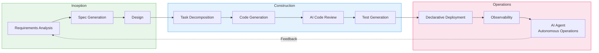
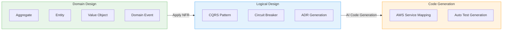
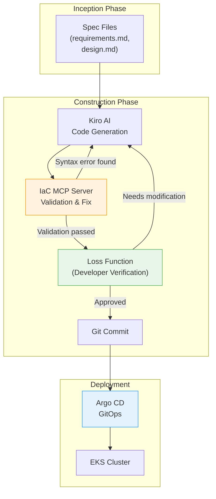
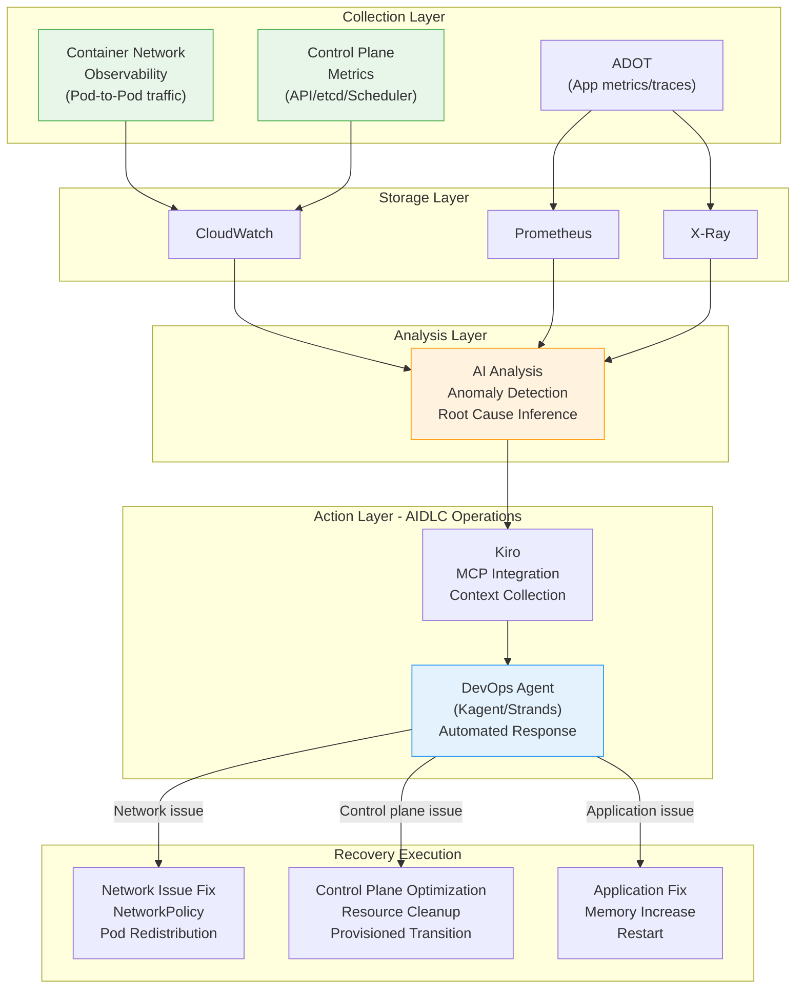
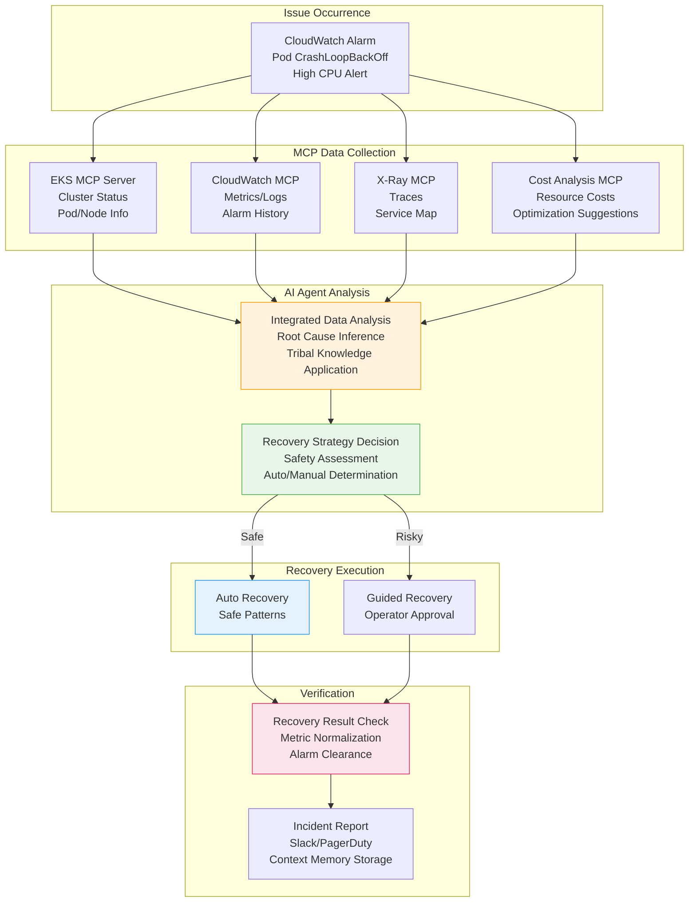
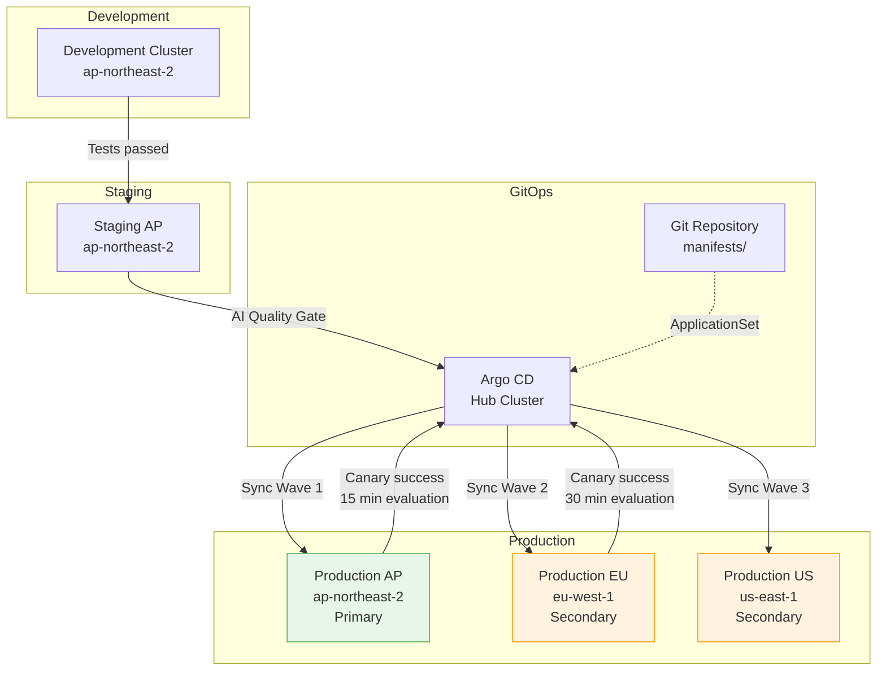

import { AidlcPhaseMapping, EksCapabilities, ProductivityMetrics, AidlcPrinciples, AidlcPhaseActivities, AiCodingAgentComparison, QualityGates, AiAgentEcosystem, DetailedMetrics, AidlcPipeline, AidlcArtifacts } from '@site/src/components/AidlcTables';

# AIDLC Framework — AI-Driven Development and Operations Enhancement in EKS Environments

> **Written**: 2026-02-12 | **Updated**: 2026-02-14 | **Reading Time**: ~39 min

---

## 1. Overview

### 1.1 Why AIDLC

The traditional Software Development Lifecycle (SDLC) was designed around the premise of human-centered long iteration cycles (weekly/monthly). Rituals like daily standups, sprint reviews, and retrospectives are optimized for these long cycles. The advent of AI breaks this premise.

AI performs requirements analysis, task decomposition, code generation, and testing on an **hourly/daily** basis. A retrofit approach of fitting AI into the existing SDLC limits this potential — much like building a faster horse-drawn carriage in the age of automobiles.

**AIDLC (AI-Driven Development Lifecycle)** is a methodology proposed by AWS Labs that reorganizes AI from **First Principles**, integrating it as a core collaborator in the development lifecycle.

```
Traditional SDLC                        AIDLC
━━━━━━━━━━━━━━                          ━━━━━━━━━━━━━━━━━━━
Humans plan and execute                  AI proposes, humans verify
Weekly/monthly iterations (Sprint)       Hourly/daily iterations (Bolt)
Design techniques are team's choice      DDD/BDD/TDD built into methodology
Role silos (FE/BE/DevOps)               AI transcends role boundaries
Manual requirements analysis             AI decomposes Intent into Units
Sequential handoffs                      Continuous flow + Loss Function verification
```

### 1.2 Connection to AIOps Strategy

The AWS open-source strategy → MCP integration → AI tools → Kiro orchestration covered in [1. AIOps Strategy Guide](./aiops-introduction.md) is the **technology foundation** for realizing AIDLC. The 3-Pillar + AI analysis layer built in [2. Intelligent Observability Stack](./aiops-observability-stack.md) is the **data foundation** for the Operations phase. This document presents the **methodology for systematically enhancing development and operations** on top of that technology and data foundation.

```
[1] AIOps Strategy Guide ──── Technology Foundation (MCP, Kiro, AI Agent)
           │
[2] Intelligent Observability Stack ──── Data Foundation (ADOT, AMP/AMG, CloudWatch AI)
           │
[3] AIDLC Framework ── Methodology (This Document)
           │
[4] Predictive Scaling & Auto-Recovery ──────── Advanced (ML Prediction, Auto-Recovery, Chaos)
```

:::info Original Reference
The core concepts of AIDLC are defined in AWS Labs' [AI-DLC Method Definition](https://prod.d13rzhkk8cj2z0.amplifyapp.com/). This document is a guide for practically implementing that methodology in EKS environments.
:::

---

## 2. AIDLC Core Concepts

### 2.1 10 Principles

<AidlcPrinciples />

Among these, 3 are particularly important in EKS environments:

- **Reverse the Conversation Direction** — AI collects EKS cluster state via MCP and proposes deployment plans first. Developers set the destination (Intent) like a driver using Google Maps, and verify the routes proposed by AI.
- **Integration of Design Techniques** — DDD is built into the core of the methodology, enabling AI to automatically model business logic into Aggregates, Entities, and Value Objects. Design techniques that were "up to the team" in Scrum become essential core in AI-DLC.
- **Minimize Stages, Maximize Flow** — Minimizes handoffs and implements continuous flow. Human verification at each stage serves as a **Loss Function**, catching errors early to prevent downstream propagation.

### 2.2 Core Artifacts

AI-DLC redefines traditional SDLC terminology for the AI era.

```
┌─────────┐    ┌─────────┐    ┌─────────┐
│  Intent  │───▶│  Unit   │───▶│  Bolt   │
│High-level │    │Independent│   │Fast      │
│ purpose   │    │work unit  │   │iteration │
│          │    │(DDD Sub- │   │(Sprint  │
│Business   │   │ domain)  │   │ replace)│
│ goal     │    └─────────┘    └─────────┘
└─────────┘         │
              ┌─────┴─────┐
              ▼           ▼
        ┌──────────┐ ┌──────────┐
        │ Domain   │ │ Logical  │
        │ Design   │ │ Design   │
        │Business  │ │NFR+      │
        │ logic    │ │Patterns  │
        └──────────┘ └──────────┘
              │           │
              └─────┬─────┘
                    ▼
            ┌──────────────┐
            │ Deployment   │
            │    Unit      │
            │Container+    │
            │Helm+         │
            │  Terraform   │
            └──────────────┘
```

<AidlcArtifacts />

:::tip Context Memory and Traceability
All artifacts are stored as **Context Memory** for AI to reference throughout the lifecycle. Bidirectional tracing between artifacts (Domain Model ↔ User Story ↔ Test Plan) is guaranteed, ensuring AI always works within the correct context.
:::

### 2.3 AI-Driven Recursive Workflow

The core of AI-DLC is a **recursive refinement process where AI proposes plans and humans verify**.

```
Intent (Business Purpose)
  │
  ▼
AI: Generate Level 1 Plan ◀──── Human: Verify · Modify
  │
  ├─▶ Step 1 ──▶ AI: Level 2 Decomposition ◀── Human: Verify
  │                 ├─▶ Sub-task 1.1 ──▶ AI Execute ◀── Human: Verify
  │                 └─▶ Sub-task 1.2 ──▶ AI Execute ◀── Human: Verify
  │
  ├─▶ Step 2 ──▶ AI: Level 2 Decomposition ◀── Human: Verify
  │                 └─▶ ...
  └─▶ Step N ──▶ ...

[All Artifacts → Context Memory → Bidirectional Traceability]
```

Human verification at each stage is a **Loss Function** — catching errors early to prevent downstream propagation. Rather than prescribing fixed workflows per path (new development, refactoring, defect fixing), AI proposes flexible Level 1 Plans suited to the situation.

### 2.4 AIDLC 3-Phase Overview

AIDLC consists of 3 phases: **Inception**, **Construction**, and **Operations**.

<AidlcPhaseMapping />



<AidlcPhaseActivities />

---

## 3. Inception Phase — From Requirements to Design

### 3.1 Mob Elaboration

The core ritual of Inception is **Mob Elaboration** — a requirements refinement session where Product Owner, developers, and QA gather together to collaborate with AI.

```
┌──────────────────────────────────────────────────┐
│              Mob Elaboration Ritual                │
├──────────────────────────────────────────────────┤
│                                                   │
│  [AI] Proposes decomposition of Intent into       │
│       User Stories + Units                        │
│    ↓                                              │
│  [PO + Dev + QA] Review · Adjust over/under       │
│       design                                      │
│    ↓                                              │
│  [AI] Applies modifications → Generates           │
│       additional NFR · Risks                      │
│    ↓                                              │
│  [Team] Final verification → Confirm Bolt plan    │
│                                                   │
├──────────────────────────────────────────────────┤
│  Artifacts:                                       │
│  PRFAQ · User Stories · NFR Definitions           │
│  Risk Register · Measurement Criteria · Bolt Plan │
└──────────────────────────────────────────────────┘
```

Sequential requirements analysis that took **weeks to months** in traditional methodologies is compressed to **hours** by having AI generate drafts and the team review simultaneously.

### 3.2 Kiro Spec-Driven Inception

Kiro systematizes Mob Elaboration artifacts into **Spec files**. It structures the entire process from natural language requirements to code.

```
requirements.md → design.md → tasks.md → Code Generation → Verification
```

**EKS Example: Payment Service Deployment**

`requirements.md`:

```markdown
# Payment Service Deployment Requirements

## Functional Requirements
- REST API endpoint: /api/v1/payments
- Integration with DynamoDB table
- Asynchronous event processing via SQS

## Non-Functional Requirements
- P99 latency: < 200ms
- Availability: 99.95%
- Auto-scaling: 2-20 Pods
- EKS 1.35+ compatible
```

`design.md`:

```markdown
# Payment Service Architecture

## Infrastructure Configuration
- EKS Deployment (3 replicas min)
- ACK DynamoDB Table (on-demand)
- ACK SQS Queue (FIFO)
- HPA (CPU 70%, Memory 80%)
- Karpenter NodePool (graviton, spot)

## Observability
- ADOT sidecar (traces → X-Ray)
- Application Signals (SLI/SLO automatic)
- CloudWatch Logs (/eks/payment-service)

## Security
- Pod Identity (IRSA replacement)
- NetworkPolicy (namespace isolation)
- Secrets Manager CSI Driver
```

`tasks.md`:

```markdown
# Implementation Tasks

## Bolt 1: Infrastructure
- [ ] Write ACK DynamoDB Table CRD
- [ ] Write ACK SQS Queue CRD
- [ ] Define KRO ResourceGroup (DynamoDB + SQS integration)
- [ ] Configure Karpenter NodePool (graviton, spot)

## Bolt 2: Application
- [ ] Implement Go REST API
- [ ] Integrate DynamoDB SDK
- [ ] Implement SQS consumer
- [ ] Dockerfile + multi-stage build

## Bolt 3: Deployment
- [ ] Write Helm chart
- [ ] Define Argo CD Application
- [ ] Write HPA manifest
- [ ] Write NetworkPolicy

## Bolt 4: Observability
- [ ] Configure ADOT sidecar
- [ ] Application Signals annotation
- [ ] CloudWatch dashboard
- [ ] SLO alert configuration
```

:::tip Core Value of Spec-Driven
**Directing approach**: "Create DynamoDB" → "I also need SQS" → "Now deploy it" → Manual instructions each time, risk of context loss
**Spec-Driven**: Kiro analyzes requirements.md → Generates design.md → Decomposes into tasks.md → Auto-generates code → Connected through consistent Context Memory all the way to verification
:::

### 3.3 MCP-Based Real-Time Context Collection

Kiro is MCP-native, collecting real-time infrastructure state through AWS Hosted MCP servers during the Inception phase.

```
[Kiro + MCP Interaction]

Kiro: "Check EKS cluster status"
  → EKS MCP Server: get_cluster_status()
  → Response: { version: "1.35", nodes: 5, status: "ACTIVE" }

Kiro: "Cost analysis"
  → Cost Analysis MCP Server: analyze_cost(service="EKS")
  → Response: { monthly: "$450", recommendations: [...] }

Kiro: "Analyze current workloads"
  → EKS MCP Server: list_deployments(namespace="payment")
  → Response: { deployments: [...], resource_usage: {...} }
```

This enables **designs that reflect the current cluster state and costs** when generating design.md. For details on MCP integration architecture, refer to [1. AIOps Strategy Guide](./aiops-introduction.md).

---

## 4. Construction Phase — From Design to Code

### 4.1 DDD Integration: From Domain Design to Logical Design

In AI-DLC, DDD is **not optional but a built-in element of the methodology**. AI automatically models business logic according to DDD principles.



**Payment Service Example**:

1. **Domain Design** — AI models business logic
   - Aggregate: `Payment` (transactionId, amount, status)
   - Entity: `PaymentMethod`, `Customer`
   - Value Object: `Money`, `Currency`
   - Domain Event: `PaymentCreated`, `PaymentCompleted`, `PaymentFailed`

2. **Logical Design** — Apply NFR + Select architecture patterns
   - CQRS: Separate payment creation (Command) / query (Query)
   - Circuit Breaker: External payment gateway calls
   - ADR: Record "DynamoDB on-demand vs provisioned" decision

3. **Code Generation** — AWS service mapping
   - Aggregate → EKS Deployment + DynamoDB Table
   - Domain Event → SQS FIFO Queue
   - Circuit Breaker → Envoy sidecar + Istio

Developers **verify and adjust** the models generated by AI at each stage. This verification serves as the Loss Function.

### 4.2 Mob Construction

The core ritual of Construction is **Mob Construction**. Teams gather in one room to develop their respective Units, exchanging Integration Specifications generated during the Domain Design phase.

```
[Mob Construction Flow]

Team A: Payment Unit        Team B: Notification Unit
  │                            │
  ├─ Domain Design Complete    ├─ Domain Design Complete
  │                            │
  └────── Exchange Integration Specs ──────┘
          (Domain Event Contracts)
  │                            │
  ├─ Logical Design            ├─ Logical Design
  ├─ Code Generation           ├─ Code Generation
  ├─ Testing                   ├─ Testing
  └─ Bolt Delivery             └─ Bolt Delivery
```

Each Unit is loosely coupled, enabling **parallel development**, integrated through Domain Events. AI also auto-generates integration tests.

:::warning Brown-field (Existing System) Approach
When adding features or refactoring existing systems, **additional steps** are needed in the Construction phase:

1. AI **reverse-engineers existing code into a semantic model** (Code → Model promotion)
   - **Static Model**: Components, responsibilities, relationships
   - **Dynamic Model**: Component interactions for major use cases
2. Developers verify and modify the reverse-engineered model
3. Then proceed with the same Construction flow as Green-field

This ensures AI performs changes with an accurate understanding of the existing system's context.
:::

### 4.3 AI Coding Agents

These are the AI coding agents used in the AIDLC Construction phase. Amazon Q Developer and Kiro use **Anthropic Claude** models, and Kiro also supports open-weight models for cost optimization and specialized domain extensions.

<AiCodingAgentComparison />

#### 4.3.4 Amazon Q Developer — Real-Time Code Build and Test (2025)

AWS announced **Amazon Q Developer's real-time code execution capability** in February 2025. This is an innovative approach where AI generates code and then **automatically builds and runs tests to verify results** before presenting them to the developer. It is a core mechanism in the AIDLC Construction phase that **activates the Loss Function early** to prevent errors from propagating downstream.

**Real-Time Code Execution Capability**

Traditional AI coding tools required developers to manually build and test after code generation. Q Developer automates this process, implementing a closed loop of **code generation → automatic build → test execution → result verification → developer review**.

```
Traditional Approach:
  AI Code Generation → Developer Manual Build → Developer Manual Test → Error Found → Feedback to AI → Regenerate
  (Iteration cycle: 5-10 minutes)

Q Developer Real-Time Execution:
  AI Code Generation → Auto Build → Auto Test → Result Verification → (Auto Fix Retry on Error) → Developer Review
  (Iteration cycle: 1-2 minutes, minimal developer intervention)
```

**Core Mechanisms**

1. **Automatic Build Pipeline**
   - Q Developer automatically runs the project's build tools (Maven, Gradle, npm, pip, etc.) after code changes
   - Immediately detects compilation errors and dependency conflicts
   - On build failure, analyzes error messages and automatically retries with code fixes

2. **Automatic Test Execution**
   - Automatically runs unit tests and integration tests
   - On test failure, analyzes the cause and fixes code or tests
   - Adds new code while maintaining existing test coverage

3. **Pre-Developer Review Verification**
   - When developers receive code, **builds and tests have already passed**
   - Developers focus on business logic and design review (Loss Function role)
   - Verifying "Is it the right code?" rather than "Does the code work?"

**Security Scan Auto-Fix Suggestions**

Q Developer automatically scans Kubernetes YAML and application code for security vulnerabilities and provides fix suggestions.

**Kubernetes YAML Security Scan**

1. **Root Privilege Detection**
   - Detects `runAsUser: 0` or `runAsNonRoot: false`
   - Suggestion: `runAsUser: 1000`, `runAsNonRoot: true`

2. **Privileged Container Detection**
   - Detects `securityContext.privileged: true`
   - Suggestion: Explicitly add only required capabilities (e.g., `NET_ADMIN`)

3. **Missing securityContext Detection**
   - Warns when Pod/Container lacks `securityContext`
   - Suggestion: Add securityContext following the principle of least privilege

**Auto-Fix Suggestion Example**

```yaml
# Issue detected by Q Developer
apiVersion: v1
kind: Pod
metadata:
  name: payment-pod
spec:
  containers:
    - name: payment
      image: payment:v1
      securityContext:
        runAsUser: 0  # ⚠️ Using root privileges
        privileged: true  # ⚠️ Privileged mode

# Fix suggested by Q Developer
apiVersion: v1
kind: Pod
metadata:
  name: payment-pod
spec:
  securityContext:
    runAsNonRoot: true
    runAsUser: 1000
    fsGroup: 1000
    seccompProfile:
      type: RuntimeDefault
  containers:
    - name: payment
      image: payment:v1
      securityContext:
        allowPrivilegeEscalation: false
        readOnlyRootFilesystem: true
        capabilities:
          drop:
            - ALL
          add:
            - NET_BIND_SERVICE  # Add only required capabilities
```

**AIDLC Construction Phase Integration**

Q Developer's real-time execution and security scanning **automate the Quality Gate** in the Construction phase, realizing AIDLC's fast iteration cycle (Bolt).

1. **Auto-run Q Developer security scan at Quality Gate**
   - When Kiro generates code, Q Developer security scan is integrated into the pipeline
   - Automatically scans Kubernetes manifests, Dockerfiles, and application code
   - Presents fix suggestions to developers when vulnerabilities are found (Loss Function)

2. **Add Q Developer validation step to CI/CD pipeline**
   - Run Q Developer scan in GitHub Actions/GitLab CI when PR is created
   - Auto build and test execution guarantees "code works"
   - Security scan guarantees "code is secure"
   - Developers only verify "code is correct" (role separation)

**Integrated Workflow Example**

```yaml
# .github/workflows/aidlc-construction.yml
name: AIDLC Construction Quality Gate
on:
  pull_request:
    types: [opened, synchronize]

jobs:
  q-developer-validation:
    runs-on: ubuntu-latest
    steps:
      - uses: actions/checkout@v4

      # 1. Q Developer Security Scan
      - name: Q Developer Security Scan
        uses: aws/amazon-q-developer-action@v1
        with:
          scan-type: security
          source-path: .
          auto-fix: true  # Apply auto-fix suggestions

      # 2. Real-Time Build and Test
      - name: Q Developer Build & Test
        uses: aws/amazon-q-developer-action@v1
        with:
          action: build-and-test
          test-coverage-threshold: 80

      # 3. Kubernetes Manifest Validation
      - name: K8s Manifest Security Check
        run: |
          # Verify Q Developer suggested fixes have been applied
          kube-linter lint deploy/ --config .kube-linter.yaml

      # 4. Allow Argo CD sync only on pass
      - name: Approve for GitOps
        if: success()
        run: echo "Quality Gate passed. Ready for Argo CD sync."
```

**Actual Impact — Shortened Feedback Loop**

```
Traditional Construction Phase:
  [Developer] Write code (30 min)
    → [Developer] Manual build (2 min)
    → [Developer] Manual test (5 min)
    → [Developer] Error found (10 min debugging)
    → [Developer] Fix code (20 min)
    → Repeat...
  Total time: 2-3 hours

Q Developer Real-Time Execution:
  [AI] Generate code (1 min)
    → [AI] Auto build/test (30 sec)
    → [AI] Error detection and auto-fix (1 min)
    → [Developer] Loss Function verification (10 min)
    → [Argo CD] Auto deployment
  Total time: 15-20 minutes
```

:::tip Value of Q Developer in AIDLC
Q Developer's real-time execution implements AIDLC's core principle of **"Minimize Stages, Maximize Flow"**. By automating each stage of code generation → build → test → verification, it eliminates handoffs, and developers focus solely on **decision-making (Loss Function)**. This is the core mechanism that shortens the weekly/monthly cycles of traditional SDLC to AIDLC's hourly/daily cycles.
:::

**References**

- [AWS DevOps Blog: Enhancing Code Generation with Real-Time Execution in Amazon Q Developer](https://aws.amazon.com/blogs/devops/enhancing-code-generation-with-real-time-execution-in-amazon-q-developer/) (2025-02-06)
- AWS re:Invent 2025 EKS Research — See Section 13.4

### 4.4 EKS Capabilities-Based Declarative Automation

EKS Capabilities (2025.11) provides popular open-source tools as AWS-managed services, declaratively deploying Construction phase artifacts.

<EksCapabilities />

#### 4.4.1 Managed Argo CD — GitOps

Managed Argo CD operates GitOps as a managed service on AWS infrastructure. When Kiro pushes generated code to Git, it is automatically deployed to EKS. Application CRDs manage single environments, while ApplicationSets declaratively manage multi-environments (dev/staging/production).

#### 4.4.2 ACK — Declarative AWS Resource Management

ACK declaratively manages 50+ AWS services as K8s CRDs. It deploys infrastructure elements from Kiro-generated Domain Design (DynamoDB, SQS, S3, etc.) via `kubectl apply`, naturally integrating into Argo CD's GitOps workflow.

:::info Core Value of ACK
With ACK, **AWS resources external to the cluster can also be managed using the K8s declarative model**. Create/modify/delete DynamoDB, SQS, S3, RDS, etc. as K8s CRDs — this is the strategy of "declaratively managing all infrastructure centered on K8s."
:::

#### 4.4.3 KRO — Complex Resource Orchestration

KRO bundles multiple K8s resources into a **single deployment unit (ResourceGroup)**. It directly maps to AIDLC's Deployment Unit concept, creating Deployment + Service + HPA + ACK resources as a single Custom Resource.

#### 4.4.4 LBC v3 Gateway API

AWS Load Balancer Controller v3 brings Gateway API to GA, providing L4(NLB) + L7(ALB) routing, QUIC/HTTP3, JWT validation, and header transformation. Traffic is managed declaratively via Gateway + HTTPRoute CRDs.

#### 4.4.5 LBC v3 Gateway API — Advanced Features Detail

AWS Load Balancer Controller v3's Gateway API support provides powerful L4/L7 routing capabilities through the Kubernetes standard traffic management API. This is a core tool for declaratively implementing networking requirements from Kiro Specs in the AIDLC Construction phase.

**Gateway API v1.4 + LBC v2.14+ Coverage**

Gateway API uses a role-oriented design that allows infrastructure operators, cluster operators, and application developers to manage traffic within their respective scopes of responsibility.

1. **L4 Routes — TCPRoute, UDPRoute, TLSRoute (NLB, v2.13.3+)**
   - **TCPRoute**: TCP-based application routing (e.g., PostgreSQL, Redis, gRPC with TCP)
   - **UDPRoute**: UDP-based protocol routing (e.g., DNS, QUIC, game servers)
   - **TLSRoute**: SNI (Server Name Indication)-based TLS routing
   - Provisioned with Network Load Balancer (NLB), guaranteeing high throughput and low latency
   - Example: SNI-based shard routing in multi-tenant database clusters

2. **L7 Routes — HTTPRoute, GRPCRoute (ALB, v2.14.0+)**
   - **HTTPRoute**: HTTP/HTTPS routing based on path, headers, query parameters
   - **GRPCRoute**: Routing based on gRPC method names, gRPC-specific header management
   - Provisioned with Application Load Balancer (ALB), supporting content-based routing
   - Example: `/api/v1/*` → v1 service, `/api/v2/*` → v2 service (canary deployment)

3. **QUIC Protocol Support (HTTP/3 on NLB)**
   - Native HTTP/3 (QUIC) protocol support on NLB
   - Resolves TCP head-of-line blocking via UDP-based transport
   - Connection migration support in mobile network environments
   - Example: Real-time video streaming, game servers, low-latency APIs

**JWT Validation Feature**

Gateway API v1.4 supports **Gateway-level JWT (JSON Web Token) validation**. This separates authentication logic from backend services, reducing their load.

- **Authentication Policy Definition**: Declare JWT validation rules on the Gateway (issuer, public key, claim validation)
- **Backend Load Reduction**: ALB/NLB validates JWTs, early-blocking invalid requests
- **Centralized Authentication**: Multiple services reuse common authentication policies
- **Example**: Payment Service validates `iss=https://auth.example.com`, `aud=payment-api` on the `/api/v1/payments` path

**Header Transformation**

HTTPRoute can dynamically add, modify, and delete request and response headers.

- **RequestHeaderModifier**: Manipulate request headers before forwarding to backend
  - Example: Add `X-User-ID` header (user ID extracted from JWT claims)
  - Example: Force `X-Forwarded-Proto: https` (when backend is behind a proxy)
- **ResponseHeaderModifier**: Manipulate response headers before responding to client
  - Example: Add `X-Frame-Options: DENY` (security header)
  - Example: Remove `Server` header (prevent information disclosure)

**Usage in AIDLC Construction Phase**

Gateway API is a core tool for automatically deploying networking requirements defined in Kiro Specs through GitOps workflows.

1. **Define API routing requirements in Kiro Spec**
   - Specify requirements like "Route 10% traffic to v2 via canary deployment" in `requirements.md`
   - Design routing strategy using Gateway API in `design.md`
   - Kiro auto-generates HTTPRoute manifests

2. **Declarative traffic management with Gateway API CRDs**
   - Deploy Gateway, GatewayClass, HTTPRoute with a single Git commit
   - Argo CD automatically syncs changes to EKS
   - LBC provisions ALB/NLB and applies routing rules

3. **Canary/blue-green deployment strategy automation**
   - Adjust traffic distribution ratio with HTTPRoute's `weight` field
   - Example: v1 service 90%, v2 service 10% → gradually increase v2 to 100%
   - Monitor SLOs for each version with CloudWatch Application Signals
   - AI Agent automatically rolls back on SLO violation (Operations phase integration)

**Gateway, GatewayClass, HTTPRoute YAML Examples**

```yaml
# gatewayclass.yaml — Defined by infrastructure operator
apiVersion: gateway.networking.k8s.io/v1
kind: GatewayClass
metadata:
  name: aws-alb
spec:
  controllerName: gateway.alb.aws.amazon.com/controller
  description: "AWS Application Load Balancer"
---
# gateway.yaml — Defined by cluster operator
apiVersion: gateway.networking.k8s.io/v1
kind: Gateway
metadata:
  name: payment-gateway
  namespace: production
  annotations:
    gateway.alb.aws.amazon.com/scheme: internet-facing
    gateway.alb.aws.amazon.com/tags: Environment=production,Service=payment
spec:
  gatewayClassName: aws-alb
  listeners:
    - name: https
      protocol: HTTPS
      port: 443
      tls:
        mode: Terminate
        certificateRefs:
          - name: payment-tls-cert
            kind: Secret
      allowedRoutes:
        namespaces:
          from: Selector
          selector:
            matchLabels:
              gateway-access: enabled
---
# httproute.yaml — Defined by application developer
apiVersion: gateway.networking.k8s.io/v1
kind: HTTPRoute
metadata:
  name: payment-api-route
  namespace: production
spec:
  parentRefs:
    - name: payment-gateway
      namespace: production
      sectionName: https
  rules:
    # Canary deployment: v1 90%, v2 10%
    - matches:
        - path:
            type: PathPrefix
            value: /api/v1/payments
      backendRefs:
        - name: payment-service-v1
          port: 8080
          weight: 90
        - name: payment-service-v2
          port: 8080
          weight: 10
      filters:
        # JWT Validation (Gateway API v1.4)
        - type: RequestHeaderModifier
          requestHeaderModifier:
            add:
              - name: X-User-ID
                value: "{jwt.sub}"  # Extracted from JWT claims
        # Security headers
        - type: ResponseHeaderModifier
          responseHeaderModifier:
            add:
              - name: X-Frame-Options
                value: DENY
              - name: X-Content-Type-Options
                value: nosniff
            remove:
              - Server  # Prevent server info disclosure
---
# grpcroute.yaml — gRPC service routing
apiVersion: gateway.networking.k8s.io/v1alpha2
kind: GRPCRoute
metadata:
  name: payment-grpc-route
  namespace: production
spec:
  parentRefs:
    - name: payment-gateway
  rules:
    - matches:
        - method:
            service: payment.v1.PaymentService
            method: CreatePayment
      backendRefs:
        - name: payment-grpc-service
          port: 9090
```

:::tip Gateway API vs Ingress Comparison
**Ingress** defines all routing rules in a single resource, mixing infrastructure operator and developer responsibilities. **Gateway API** separates roles into GatewayClass (infrastructure), Gateway (cluster), and HTTPRoute (application), enabling each team to work independently. This aligns with AIDLC's **Loss Function** concept — validating at each layer to prevent error propagation.
:::

**References**

- [Kubernetes Gateway API v1.4 Release](https://kubernetes.io/blog/2025/11/06/gateway-api-v1-4/) (2025-11-06)
- [AWS Load Balancer Controller — Gateway API Docs](https://kubernetes-sigs.github.io/aws-load-balancer-controller/latest/guide/gateway/gateway/)
- [Kubernetes Gateway API in Action (AWS Blog)](https://aws.amazon.com/blogs/containers/kubernetes-gateway-api-in-action/)
- AWS re:Invent 2025 EKS Research — See Section 3.5

#### 4.4.6 Node Readiness Controller — Declarative Node Readiness Management

**Node Readiness Controller (NRC)** is a controller that declaratively defines conditions that Kubernetes nodes must meet before accepting workloads. This is a core tool in the AIDLC Construction phase for expressing infrastructure requirements as code and automatically applying them through GitOps.

**Core Concepts**

NRC defines conditions that nodes must satisfy before transitioning to "Ready" state through the `NodeReadinessRule` CRD. Traditionally, node readiness was automatically determined by kubelet, but NRC allows **declaratively injecting application-specific requirements into the infrastructure layer**.

- **Declarative Policies**: Define node readiness conditions as YAML via `NodeReadinessRule`
- **GitOps Compatible**: Version-manage and auto-deploy node readiness policies through Argo CD
- **Workload Protection**: Block scheduling until essential daemonsets (CNI, CSI, security agents) are ready

**Usage Across AIDLC Phases**

| Phase | NRC Role | Example |
|-------|----------|---------|
| **Inception** | AI analyzes workload requirements → Auto-defines required NodeReadinessRules | "GPU workloads should only be scheduled after NVIDIA device plugin is ready" |
| **Construction** | Include NRC rules in Helm charts, deploy as Terraform EKS Blueprints AddOn | Kiro auto-generates `NodeReadinessRule` manifests |
| **Operations** | NRC auto-manages node readiness at runtime, AI analyzes rule effectiveness | Track node readiness delay with CloudWatch Application Signals |

**Infrastructure as Code Perspective**

NRC extends AIDLC's "express infrastructure as code, test infrastructure too" principle down to the node level.

1. **GitOps-Based Policy Management**
   - Store `NodeReadinessRule` CRDs in Git repositories
   - Argo CD automatically syncs to EKS clusters
   - Apply to entire cluster with a single Git commit on policy change

2. **Kiro + MCP Automation**
   - Kiro parses workload requirements from Inception phase's `design.md`
   - Checks current cluster's daemonset status through EKS MCP Server
   - Auto-generates required `NodeReadinessRule` and adds to IaC repository

3. **Terraform EKS Blueprints Integration**
   - Declaratively install NRC controller as EKS Blueprints AddOn
   - Automate default policy configuration through Helm values
   - Apply consistent node readiness policies across multi-cluster environments

**Quality Gate Integration**

In AIDLC's Quality Gate phase, NRC is used as a tool to verify node readiness before deployment.

- **Pre-deployment Dry-run**: Simulate the impact on existing workloads when applying NRC rules
- **CI/CD Pipeline Validation**: `kubectl apply --dry-run` + NRC rule validity check in GitHub Actions/GitLab CI
- **Role as Loss Function**: Block incorrect node readiness policies before production deployment

**YAML Example: NodeReadinessRule for GPU Workloads**

```yaml
apiVersion: node.k8s.io/v1alpha1
kind: NodeReadinessRule
metadata:
  name: gpu-node-readiness
  namespace: kube-system
spec:
  # Apply only to GPU nodes
  nodeSelector:
    matchLabels:
      node.kubernetes.io/instance-type: p4d.24xlarge
  # Do not transition node to Ready until all following daemonsets are in Ready state
  requiredDaemonSets:
    - name: nvidia-device-plugin-daemonset
      namespace: kube-system
    - name: gpu-feature-discovery
      namespace: kube-system
    - name: dcgm-exporter
      namespace: monitoring
  # Timeout: Keep node NotReady if conditions not met within 10 minutes
  timeout: 10m
```

**Practical Use Cases**

| Scenario | NRC Rule | Effect |
|----------|----------|--------|
| **Cilium CNI Cluster** | Wait until Cilium agent is Ready | Prevent Pod scheduling before network initialization |
| **GPU Cluster** | Wait for NVIDIA device plugin + DCGM exporter readiness | Block workload scheduling before GPU resource exposure |
| **Security-Hardened Environment** | Wait for Falco, OPA Gatekeeper readiness | Prevent workload execution before security policy enforcement |
| **Storage Workloads** | Wait for EBS CSI driver + snapshot controller readiness | Prevent volume mount failures |

**Terraform EKS Blueprints AddOn Example**

```hcl
module "eks_blueprints_addons" {
  source = "aws-ia/eks-blueprints-addons/aws"

  cluster_name      = module.eks.cluster_name
  cluster_endpoint  = module.eks.cluster_endpoint

  enable_node_readiness_controller = true
  node_readiness_controller = {
    namespace = "kube-system"
    values = [
      yamlencode({
        defaultRules = {
          cilium = {
            enabled = true
            daemonSets = ["cilium"]
          }
          gpuNodes = {
            enabled = true
            nodeSelector = {
              "node.kubernetes.io/instance-type" = "p4d.24xlarge"
            }
            daemonSets = ["nvidia-device-plugin-daemonset", "dcgm-exporter"]
          }
        }
      })
    ]
  }
}
```

:::tip NRC + AIDLC Synergy
Node Readiness Controller extends AIDLC's principle of **"express infrastructure requirements declaratively and verify automatically"** down to the node level. Kiro analyzes workload requirements during the Inception phase to auto-generate `NodeReadinessRules`, Argo CD deploys them via GitOps, and during the Operations phase, AI Agents automatically detect and respond to node readiness anomalies.
:::

**References**

- [Kubernetes Blog: Introducing Node Readiness Controller](https://kubernetes.io/blog/2026/02/03/introducing-node-readiness-controller/) (2026-02-03)
- [Node Readiness Controller GitHub Repository](https://github.com/kubernetes-sigs/node-readiness-controller)

:::tip EKS Capabilities + AIDLC Synergy
When Managed Argo CD (deployment) + ACK (infrastructure) + KRO (orchestration) + LBC v3 (networking) + NRC (node readiness) are combined, all artifacts generated by Kiro from Specs can be **deployed as a full stack with a single Git Push**. This is the key to the Construction → Operations transition.
:::

### 4.5 MCP-Based IaC Automation Pipeline

Combining Kiro with AWS Hosted MCP servers, IaC is automatically generated from Inception Specs through Construction and deployed via Argo CD.

<AidlcPipeline />

#### 4.5.3 AWS IaC MCP Server — CDK/CloudFormation AI Support

AWS announced the **AWS Infrastructure as Code (IaC) MCP Server** on November 28, 2025. This is a programmatic interface that allows AI tools like Kiro CLI to search CloudFormation and CDK documentation, automatically validate templates, and provide AI-assisted deployment troubleshooting.

**AWS IaC MCP Server Overview**

AWS IaC MCP Server provides the following capabilities through Model Context Protocol:

- **Documentation Search**: Search CloudFormation resource types, CDK constructs, and best practices in real-time
- **Template Validation**: Automatically detect syntax errors in IaC templates and suggest fixes
- **Deployment Troubleshooting**: Analyze root causes of stack deployment failures and suggest solutions
- **Programmatic Access**: Native integration with AI tools like Kiro, Amazon Q Developer

**AIDLC Construction Phase Integration**

In AIDLC's Construction phase, IaC MCP Server is used as follows:

1. **Kiro Spec → IaC Code Generation Validation**
   - Kiro generates CDK/Terraform/Helm code based on `design.md` generated during the Inception phase
   - IaC MCP Server automatically validates syntax, resource constraints, and security policy compliance of generated code
   - For CloudFormation templates, pre-detects resource type typos, circular dependencies, and invalid properties

2. **CloudFormation Template Syntax Error Auto-Fix**
   - Statically analyzes templates before deployment to identify error patterns
   - Example: `Properties` typo → `Properties`, invalid intrinsic function → suggest correct function
   - Kiro auto-applies fix suggestions or requests Loss Function verification from the developer

3. **Pre-validation of Compatibility with Existing Infrastructure**
   - Integrates with EKS MCP Server and Cost Analysis MCP to analyze current cluster state
   - Verifies new IaC code doesn't conflict with existing resources (VPC, subnets, security groups)
   - Example: Check for name duplication with existing tables when creating DynamoDB table, verify VPC endpoint reusability

**Code Example: IaC MCP Server Workflow in Kiro**

```bash
# 1. Activate IaC MCP Server
kiro mcp add aws-iac

# 2. Generate IaC code from Spec files
kiro generate --spec requirements.md --output infra/

# 3. Validation process automatically run by IaC MCP Server
# - CloudFormation template syntax check
# - CDK construct compatibility validation
# - Resource constraint verification (e.g., DynamoDB on-demand vs provisioned)

# 4. Check validation results
kiro verify --target infra/

# Output example:
# ✓ CloudFormation syntax valid
# ⚠ Warning: DynamoDB table 'payments' uses on-demand billing (estimated $150/month)
# ✓ VPC endpoint 'vpce-dynamodb' already exists, reusing
# ✗ Error: Security group 'sg-app' conflicts with existing rule

# 5. Auto-fix errors
kiro fix --interactive

# Fix suggestions from IaC MCP Server:
# - Security group rule conflict → Change to new rule ID
# - Auto-apply after developer approval

# 6. Deploy via Argo CD
git add infra/ && git commit -m "Add Payment Service infrastructure"
git push origin main
# Argo CD auto-syncs → Deploys to EKS
```

**Integration Flow in Construction Phase**



:::tip IaC MCP Server and Kiro Synergy
AWS IaC MCP Server, combined with Kiro's Spec-driven development, automatically validates infrastructure code quality. It can be activated with `kiro mcp add aws-iac`, ensuring generated CloudFormation/CDK code automatically follows AWS best practices. This serves as a **Loss Function that catches IaC errors early** in the Construction phase.
:::

**References**

- [AWS DevOps Blog: Introducing the AWS IaC MCP Server](https://aws.amazon.com/blogs/devops/introducing-the-aws-infrastructure-as-code-mcp-server-ai-powered-cdk-and-cloudformation-assistance/) (2025-11-28)

---

## 5. Operations Phase — From Deployment to Autonomous Operations

### 5.1 Observability Foundation

The data foundation of the Operations phase is the 5-Layer architecture built in [2. Intelligent Observability Stack](./aiops-observability-stack.md).

```
[Observability Stack → Operations Connection]

Collection Layer (ADOT, CloudWatch Agent, NFM Agent)
      ↓
Transport Layer (OTLP, Prometheus Remote Write)
      ↓
Storage Layer (AMP, CloudWatch, X-Ray)
      ↓
Analysis Layer (AMG, CloudWatch AI, DevOps Guru)
      ↓
Action Layer ← AIDLC Operations is located here
  ├── MCP-based integrated analysis
  ├── AI Agent automated response
  └── Predictive scaling
```

Metrics, logs, and traces collected in [2. Intelligent Observability Stack](./aiops-observability-stack.md) are delivered to AI tools and Agents through MCP, forming the decision-making foundation of the Operations phase.

#### 5.1.3 2025-2026 Observability Innovations — Strengthening AIDLC Operations

AWS announced **two major innovations** in the EKS observability domain from November 2025 through early 2026. These **significantly strengthen the data foundation** of the AIDLC Operations phase, enabling AI Agents to proactively detect and respond to network issues and control plane problems.

**Container Network Observability (November 19, 2025)**

AWS announced **Container Network Observability**, providing granular visibility into the network layer of EKS clusters. This complements the existing CloudWatch Container Insights' focus on the application and container layers by **combining network traffic patterns with Kubernetes context**.

**Key Features**

1. **Pod-to-Pod Communication Pattern Analysis**
   - Real-time visualization of traffic flows between namespaces and services
   - Automatic generation of dependency maps for microservice architectures
   - Example: Payment Service → DynamoDB call patterns, communication frequency with Notification Service

2. **Cross-AZ Traffic Visibility**
   - Tracking data transfer volume and costs between Availability Zones
   - Identifying services with high Cross-AZ traffic to provide cost optimization opportunities
   - Example: Pod in AZ-a calling DynamoDB endpoint in AZ-b → $200/month unnecessary cost

3. **Network Anomaly Detection**
   - AI-based automatic detection of unusual traffic patterns
   - Example: Sudden large-volume traffic to external IPs → suspected data exfiltration
   - Example: Spike in connection attempt failure rate for a specific Pod → NetworkPolicy error or service failure

**Usage in AIDLC Operations Phase**

Container Network Observability **strengthens the Collection Layer**, enabling AI Agents to automatically identify and respond to network issues:

- **Automatic Root Cause Analysis**: When a Pod is unresponsive, AI Agent analyzes network metrics to automatically determine whether it's "traffic blocked by NetworkPolicy" or "target service failure"
- **Cost Optimization Suggestions**: Analyzes Cross-AZ traffic patterns to provide specific suggestions like "Save $500/month by modifying Pod Topology Spread Constraints"
- **Security Anomaly Detection**: Integrates with GuardDuty Extended Threat Detection for early detection of network-level attack patterns

**Implementation Example: Network Issue Analysis via Kiro + MCP**

```bash
# Query Container Network Observability metrics through CloudWatch MCP
kiro diagnose --issue "payment-service high latency"

# AI Agent's analysis process (internal operations):
# 1. CloudWatch MCP → Query Container Network Observability metrics
#    - payment-service → dynamodb-endpoint: P99 latency 500ms (normally 50ms)
#    - Cross-AZ traffic ratio: 80% (normally 20%)
#
# 2. EKS MCP → Check Pod placement status
#    - payment-service Pods: all 5 placed in AZ-a
#    - DynamoDB endpoint: exists only in AZ-b, AZ-c
#
# 3. Root cause inference
#    - Pod Topology Spread is not working properly
#    - All traffic being sent Cross-AZ → network latency + cost increase
#
# 4. Recovery suggestion
#    - Modify Pod Topology Spread Constraints
#    - Force AZ distribution in Karpenter NodePool
#    - Expected effect: P99 latency recovery to 50ms, $400/month cost savings

# Output example:
# Network issue detected: Excessive Cross-AZ traffic
# Current state: payment-service Pods 100% concentrated in AZ-a
# Suggestion: Pod Topology Spread + Karpenter AZ distribution
# Expected effect: 90% improvement in P99 latency, $400/month savings
# Proceed with automatic fix? [Y/n]
```

**CloudWatch Control Plane Metrics (December 19, 2025)**

AWS announced **EKS Control Plane Metrics** along with the **CloudWatch Observability Operator**. This enables proactive monitoring of the health and performance of the Kubernetes API server, etcd, scheduler, and controller manager.

**Key Features**

1. **API Server Latency Monitoring**
   - Tracks API request latency for `kubectl` commands, Deployment updates, HPA scaling, etc.
   - Example: When API server P99 latency exceeds 500ms → early detection of cluster overload

2. **etcd Performance Tracking**
   - Monitors etcd disk sync latency, leader election time, and database size
   - Example: When etcd disk latency increases → suspected excessive creation of cluster resources (ConfigMap, Secret)

3. **Scheduler Status Monitoring**
   - Tracks pending Pod count, scheduling latency, and scheduling failure reasons
   - Example: When scheduling failures spike → insufficient node capacity or Affinity constraint errors

**Usage in AIDLC Operations Phase**

CloudWatch Control Plane Metrics **strengthens the Analysis Layer**, enabling AI Agents to proactively respond to infrastructure-level issues:

- **Proactive Scaling**: When API server latency shows an increasing trend, AI Agent suggests upgrading to Provisioned Control Plane
- **Resource Cleanup Automation**: When etcd database size reaches threshold, automatically identifies unused ConfigMaps/Secrets and suggests cleanup
- **Scheduling Optimization**: Analyzes Pending Pod causes to provide specific improvement suggestions like "NodeSelector constraints are too strict"

**Implementation Example: CloudWatch Observability Operator Configuration**

```yaml
# cloudwatch-operator-config.yaml
apiVersion: v1
kind: ConfigMap
metadata:
  name: cloudwatch-operator-config
  namespace: amazon-cloudwatch
data:
  config.yaml: |
    enableControlPlaneMetrics: true
    controlPlaneMetrics:
      - apiserver_request_duration_seconds
      - apiserver_request_total
      - etcd_disk_backend_commit_duration_seconds
      - etcd_disk_wal_fsync_duration_seconds
      - scheduler_pending_pods
      - scheduler_schedule_attempts_total

    # AI Agent integration settings
    alerting:
      - metric: apiserver_request_duration_seconds_p99
        threshold: 500ms
        action: trigger_ai_agent_analysis
        context: |
          API server latency is increasing.
          AI Agent will analyze the root cause and suggest response measures.

      - metric: etcd_mvcc_db_total_size_in_bytes
        threshold: 8GB
        action: trigger_ai_agent_cleanup
        context: |
          etcd database size is approaching the threshold.
          AI Agent will identify cleanable resources.
```

**Integration in Operations Phase: Kiro + DevOps Agent Automated Response**

Container Network Observability and Control Plane Metrics enable **Kiro + DevOps Agent (Kagent/Strands)** to automatically respond based on observability data:



**Real-World Scenarios: Integrated Response Workflow**

```bash
# Scenario 1: Automatic network issue detection and fix
# [15:00] Container Network Observability: Cross-AZ traffic spike
# [15:01] Kiro + EKS MCP: Pod placement status analysis
# [15:02] AI Agent determination: Pod Topology Spread error
# [15:03] Automatic fix: Add topologySpreadConstraints to Deployment
# [15:10] Verification: Cross-AZ traffic reduced 80% → 20%, P99 latency improved 90%

# Scenario 2: Proactive control plane performance degradation response
# [09:00] Control Plane Metrics: API server P99 latency increasing trend
# [09:05] Kiro analysis: Currently 300ms, expected to reach 500ms in 10 minutes
# [09:10] AI Agent suggestion: Switch to Provisioned Control Plane (XL tier)
# [09:11] Operator approval (Slack button click)
# [09:30] Transition complete: API server latency stabilized at 50ms

# Scenario 3: etcd capacity management automation
# [18:00] Control Plane Metrics: etcd DB size 7.5GB (threshold 8GB)
# [18:05] Kiro + EKS MCP: Unused resource scan
#         - ConfigMaps unused for 90+ days: 250
#         - Secrets from deleted Namespaces: 120
# [18:10] AI Agent suggestion: Free 1.2GB by cleaning 370 resources
# [18:11] Automatic execution (safe pattern): Backup then cleanup
# [18:20] Complete: etcd DB size 6.3GB, free space secured
```

:::warning Production Deployment Considerations
Container Network Observability and Control Plane Metrics incur **additional costs**:
- Container Network Observability: Log collection costs based on VPC Flow Logs
- Control Plane Metrics: CloudWatch custom metric charges apply

Evaluate the cost impact before production deployment and gradually enable starting with critical clusters. You can calculate estimated costs using the AWS Cost Calculator.
:::

**References**

- [AWS News Blog: Monitor network performance with Container Network Observability](https://aws.amazon.com/blogs/aws/monitor-network-performance-and-traffic-across-your-eks-clusters-with-container-network-observability/) (2025-11-19)
- [Container Blog: Proactive EKS monitoring with CloudWatch Operator](https://aws.amazon.com/blogs/containers/proactive-amazon-eks-monitoring-with-amazon-cloudwatch-operator-and-aws-control-plane-metrics/) (2025-12-19)
- AWS re:Invent 2025 EKS Research — See Section 1.1 (Network Obs), 1.3 (Control Plane)

### 5.2 AI Agent Operations Automation

<AiAgentEcosystem />

#### 5.2.1 Amazon Q Developer (GA)

The most mature production pattern. Immediately usable in CloudWatch Investigations and EKS troubleshooting.

- **CloudWatch Investigations**: AI detects metric anomalies and analyzes root causes
- **EKS Troubleshooting**: Diagnoses cluster status, Pod failures, and node issues using natural language
- **Security Scan**: Code vulnerability detection + automatic fix suggestions

#### 5.2.2 Strands Agents (OSS)

A production-proven agent SDK from AWS that defines **Agent SOPs (Standard Operating Procedures)** in natural language.

```python
# Strands Agent SOP: Pod CrashLoopBackOff Response
from strands import Agent
from strands.tools import eks_tool, cloudwatch_tool, slack_tool

ops_agent = Agent(
    name="eks-incident-responder",
    model="bedrock/anthropic.claude-sonnet",
    tools=[eks_tool, cloudwatch_tool, slack_tool],
    sop="""
    ## Pod CrashLoopBackOff Response SOP

    1. Identify Failed Pods
       - kubectl get pods --field-selector=status.phase!=Running
       - Record namespace, Pod name, restart count

    2. Log Analysis
       - kubectl logs <pod> --previous
       - Classify error patterns: OOM, ConfigError, DependencyFailure

    3. Root Cause Diagnosis
       - OOM → Check memory limits
       - ConfigError → Check ConfigMap/Secret
       - DependencyFailure → Check dependent service status

    4. Automated Response
       - OOM and limits < 2Gi → Patch limits to 1.5x (automatic)
       - ConfigError → Slack alert + mention assignee (manual)
       - DependencyFailure → Attempt dependent service restart (automatic)

    5. Post-Incident Report
       - Post incident report to Slack #incidents channel
    """
)
```

#### 5.2.3 Kagent (K8s Native)

Declaratively manages AI agents as K8s CRDs. Supports MCP integration (kmcp) but is still in early stages.

```yaml
# Kagent Agent Definition
apiVersion: kagent.dev/v1alpha1
kind: Agent
metadata:
  name: eks-ops-agent
  namespace: kagent-system
spec:
  description: "EKS operations automation agent"
  modelConfig:
    provider: bedrock
    model: anthropic.claude-sonnet
    region: ap-northeast-2
  systemPrompt: |
    This is an EKS cluster operations agent.
    It automatically diagnoses and responds to Pod failures, node issues, and scaling problems.
    It only performs safe actions, and requests approval for risky changes.
  tools:
    - name: kubectl
      type: kmcp
      config:
        server: kubernetes.default.svc
        namespace: "*"
        allowedVerbs: ["get", "describe", "logs", "top"]
    - name: cloudwatch
      type: kmcp
      config:
        region: ap-northeast-2
        actions: ["GetMetricData", "DescribeAlarms"]
```

#### 5.2.5 Kagent Maturity Reassessment and Latest Features (2025-2026)

Kagent started at an early stage in 2024, but during 2025-2026 **acquired numerous production-ready features**, significantly improving its maturity. Along with its unique value of Kubernetes-native declarative AI Agent management, MCP integration and multi-agent orchestration capabilities were added.

**Current Maturity Assessment**

| Assessment Area | 2024 Early | 2025-2026 Current | Change |
|----------------|------------|-------------------|--------|
| **CRD Stability** | Alpha (v1alpha1) | Alpha (v1alpha1, stable API) | CRD schema stabilized |
| **MCP Integration** | Experimental | kmcp production support | kubectl, CloudWatch, Prometheus native |
| **Custom Tool** | Not supported | Declarative definition in CRD | Extensibility greatly improved |
| **Multi-Agent** | Single Agent | Multiple Agent collaboration patterns | Complex issue resolution possible |
| **Production Use** | Not recommended | Pilot possible (with checklist compliance) | Gradual adoption path provided |

**Latest Feature Updates**

1. **kmcp (Kubernetes MCP) Integration**

Kagent enables natural language cluster management without kubectl commands through **Kubernetes MCP (kmcp)**.

```yaml
# Natural language cluster management via kmcp
apiVersion: kagent.dev/v1alpha1
kind: Agent
metadata:
  name: cluster-manager
spec:
  tools:
    - name: kubernetes
      type: kmcp
      config:
        # Converts kubectl get pods, kubectl describe, kubectl logs, etc.
        # into natural language requests
        operations:
          - get
          - describe
          - logs
          - top
          - events
        # Write operations require explicit approval
        writeOperations:
          - patch
          - delete
          - scale
        approvalRequired: true  # Risky operations require approval
```

**kmcp Usage Example**:
- Agent request: "Check recent logs for payment-service"
- kmcp conversion: `kubectl logs -l app=payment-service --tail=100`
- Agent analysis: OOM pattern detected in logs → suggests memory limits increase

2. **Custom Tool Definition**

Custom tools can be declaratively defined in Kagent CRDs. This is a key feature for integrating a team's unique operational scripts into AI Agents.

```yaml
# Custom Tool Example: DynamoDB Table Analysis Tool
apiVersion: kagent.dev/v1alpha1
kind: Tool
metadata:
  name: dynamodb-analyzer
  namespace: kagent-system
spec:
  description: "Analyzes DynamoDB table capacity, throttling, and costs"
  type: script
  script:
    language: python
    code: |
      import boto3
      import json

      def analyze_table(table_name):
          dynamodb = boto3.client('dynamodb')
          cloudwatch = boto3.client('cloudwatch')

          # Query table metrics
          response = dynamodb.describe_table(TableName=table_name)
          table = response['Table']

          # CloudWatch metrics: ThrottledRequests
          metrics = cloudwatch.get_metric_statistics(
              Namespace='AWS/DynamoDB',
              MetricName='ThrottledRequests',
              Dimensions=[{'Name': 'TableName', 'Value': table_name}],
              StartTime=datetime.now() - timedelta(hours=1),
              EndTime=datetime.now(),
              Period=300,
              Statistics=['Sum']
          )

          return {
              'table_name': table_name,
              'billing_mode': table['BillingModeSummary']['BillingMode'],
              'item_count': table['ItemCount'],
              'size_bytes': table['TableSizeBytes'],
              'throttled_requests': sum(m['Sum'] for m in metrics['Datapoints'])
          }
---
# Agent using Custom Tool
apiVersion: kagent.dev/v1alpha1
kind: Agent
metadata:
  name: dynamodb-ops-agent
spec:
  tools:
    - name: dynamodb-analyzer
      type: custom
      ref:
        name: dynamodb-analyzer
        namespace: kagent-system
  systemPrompt: |
    This is a DynamoDB operations agent.
    It automatically diagnoses table performance issues and provides optimization suggestions.
```

3. **Multi-Agent Orchestration**

Multiple Kagent agents collaborate to resolve complex issues. Each Agent focuses on its area of expertise while a higher-level Orchestrator Agent coordinates the workflow.

```yaml
# Orchestrator Agent: Overall incident response coordination
apiVersion: kagent.dev/v1alpha1
kind: Agent
metadata:
  name: incident-orchestrator
spec:
  description: "Analyzes incidents and delegates tasks to specialist Agents"
  systemPrompt: |
    Analyzes incidents and delegates tasks to specialist Agents.
    - network-agent: Network issues
    - resource-agent: CPU/Memory issues
    - storage-agent: Storage issues
  delegates:
    - name: network-agent
      namespace: kagent-system
    - name: resource-agent
      namespace: kagent-system
    - name: storage-agent
      namespace: kagent-system
---
# Network Specialist Agent
apiVersion: kagent.dev/v1alpha1
kind: Agent
metadata:
  name: network-agent
spec:
  description: "Network issue specialist Agent"
  tools:
    - name: kubernetes
      type: kmcp
    - name: network-troubleshoot
      type: custom
      ref:
        name: network-troubleshoot-tool
  systemPrompt: |
    Diagnoses network issues:
    - Pod-to-Pod communication failures
    - NetworkPolicy errors
    - DNS resolution issues
```

**Multi-Agent Workflow Example**:
1. **Orchestrator**: "payment-service Pod is unresponsive"
2. **Orchestrator → Resource Agent**: Check CPU/Memory status
3. **Resource Agent**: "Resources are normal"
4. **Orchestrator → Network Agent**: Check network connectivity
5. **Network Agent**: "Egress block found in NetworkPolicy" → suggests fix
6. **Orchestrator**: Requests operator approval → applies → verifies

4. **Prometheus Metrics Direct Query**

Kagent integrates Prometheus via MCP to automatically convert natural language queries to PromQL.

```yaml
apiVersion: kagent.dev/v1alpha1
kind: Agent
metadata:
  name: metrics-analyst
spec:
  tools:
    - name: prometheus
      type: kmcp
      config:
        endpoint: http://prometheus.monitoring.svc:9090
        queryLanguage: promql
        autoTranslate: true  # Natural language → PromQL auto conversion
```

**Usage Example**:
- Agent request: "P99 latency for payment-service over the last 1 hour"
- kmcp conversion: `histogram_quantile(0.99, rate(http_request_duration_seconds_bucket{service="payment-service"}[1h]))`
- Agent analysis: P99 exceeds 200ms threshold → begins root cause analysis

**Production Use Checklist**

Check the following before introducing Kagent to production:

| Checklist | Description | Example |
|-----------|-------------|---------|
| **RBAC Least Privilege** | Grant only minimum required permissions to Agent's ServiceAccount | Allow only `get`, `list`, `watch`; `delete` requires approval |
| **Limit Automatic Action Scope** | Only execute safe actions automatically via `allowedActions` field | Allow `patch` (memory increase), prohibit `delete` (Pod deletion) |
| **Enable Audit Logging** | Record all Agent actions in Kubernetes Audit Log | Log Kagent namespace in `auditPolicy` |
| **Start with Dry-run Mode** | Start initial deployment in read-only mode | Set `dryRun: true`, generate suggestions only |
| **Gradually Expand Automation** | Gradually expand automatic action scope after verifying safe patterns | 1 week dry-run → automate memory patch → automate scaling |

**Example: Production-Ready Kagent Configuration**

```yaml
apiVersion: kagent.dev/v1alpha1
kind: Agent
metadata:
  name: production-ops-agent
  namespace: kagent-system
spec:
  description: "Production EKS cluster operations agent"
  modelConfig:
    provider: bedrock
    model: anthropic.claude-sonnet

  # Principle of least privilege
  rbac:
    serviceAccount: kagent-ops-sa
    permissions:
      - apiGroups: [""]
        resources: ["pods", "services"]
        verbs: ["get", "list", "watch"]
      - apiGroups: ["apps"]
        resources: ["deployments"]
        verbs: ["get", "list", "watch", "patch"]  # Only patch allowed

  # Limit automatic action scope
  allowedActions:
    automatic:
      - name: increase_memory
        description: "Increase memory limits by 1.5x (max 4Gi)"
        condition: "OOMKilled && limits < 4Gi"
      - name: scale_up
        description: "Replicas +1 when no HPA (max 10)"
        condition: "HighCPU && replicas < 10"
    requiresApproval:
      - name: delete_pod
        description: "Force delete Pod"
      - name: restart_deployment
        description: "Restart Deployment"

  # Audit logging
  audit:
    enabled: true
    logLevel: detailed
    destinations:
      - cloudwatch
      - s3

  # Start with dry-run for initial deployment
  dryRun: true  # Change to false after approval
```

**Kagent vs Strands vs Q Developer Comparison Update**

| Item | Kagent (2025-2026) | Strands | Q Developer |
|------|-------------------|---------|-------------|
| **Deployment Method** | K8s CRD (declarative) | Python SDK (code) | AWS managed |
| **MCP Integration** | kmcp native | MCP server integration | AWS Hosted MCP |
| **Custom Tool** | Declared via CRD | Python functions | Q API extension |
| **Multi-Agent** | Orchestrator + specialist Agents | SOP chains | Single Agent |
| **Prometheus** | kmcp natural language query | Python client | CloudWatch integration |
| **Production Maturity** | Pilot possible (with checklist compliance) | Production proven | GA |
| **Learning Curve** | K8s CRD knowledge required | Python development knowledge | None (fully managed) |
| **Extensibility** | High (unlimited CRD extension) | Medium (Python ecosystem) | Limited (AWS-provided features) |

:::tip Kagent Adoption Scenario
**Pilot Stage**: Start with Q Developer (GA) → Expand to Strands (production) → Transition to Kagent (K8s Native)

**When Kagent is Suitable**:
- When you want to integrate Agent definitions into GitOps workflows
- When you need to orchestrate multiple specialist Agents
- When you want to integrate a team's unique operational tools into Agents
- Platform teams that prefer the Kubernetes-native approach

**Caution**: Still in Alpha stage, so thorough testing and gradual rollout are required before production adoption
:::

**References**

- [Kagent GitHub Repository](https://github.com/kagent-dev/kagent)
- AWS re:Invent 2025 EKS Research — See Section 2.1 (CNS421)

#### 5.2.4 Agentic AI for EKS Operations — re:Invent 2025 CNS421

The **CNS421 session** at AWS re:Invent 2025, titled "Streamline Amazon EKS Operations with Agentic AI," demonstrated practical patterns for AI Agent-based EKS operations automation with actual working code. This session presents the key technologies for the **Level 3 (Predictive) → Level 4 (Autonomous)** transition of the AIDLC Operations phase.

**CNS421 Session Core Content: 3-Stage Automation Pattern**

CNS421 proposes an approach to **evolve EKS operations automation in stages**:

1. **Real-Time Issue Diagnosis**
   - AI Agent performs integrated analysis of CloudWatch, EKS API, and Prometheus metrics
   - Automatically detects anomalies and infers root causes
   - Example: When Pod CrashLoopBackOff occurs → log pattern analysis → classify as OOM/ConfigError/DependencyFailure

2. **Guided Remediation**
   - AI **clearly presents recovery steps** based on diagnostic results
   - Operators review and approve each step before execution
   - Example: "1) Increase memory limits from 1Gi → 1.5Gi, 2) Restart Deployment, 3) Monitor for 5 minutes"

3. **Auto-Remediation**
   - Safe patterns are **automatically executed by AI without human intervention**
   - Risky changes (production node termination, etc.) still require approval
   - Example: OOM detected → automatic limits patch → Deployment rolling update → Slack notification

This 3-stage pattern aligns exactly with AIDLC's **Loss Function concept** — automating safe actions while having humans verify risky actions to prevent error propagation.

**MCP-Based Integrated Architecture**

The architecture demonstrated in CNS421 **integrates multiple MCP servers** to provide context to AI Agents:



**Tribal Knowledge Utilization: Transferring Team Operational Know-How to AI**

One of the key innovations of CNS421 is the method of **providing Tribal Knowledge (team tacit knowledge) as context to AI Agents**. AI leverages the operational know-how accumulated by teams over time to perform **customized troubleshooting**.

**Tribal Knowledge Example: Payment Service Operational Know-How**

```yaml
# tribal-knowledge/payment-service.yaml
service: payment-service
namespace: production
tribal_knowledge:
  known_issues:
    - pattern: "OOM Killed"
      root_cause: "Memory leak during spike traffic"
      context: |
        Discovered during January 2025 Black Friday.
        Redis connection pool is not released when payment requests exceed 1000/sec.
      remediation:
        - "Increase memory limits by 1.5x (temporary)"
        - "Set Redis connection pool maxIdle=50 (permanent)"
        - "Monitor metrics for 10 minutes after deployment"
      safe_to_auto_remediate: false
      requires_approval: true

    - pattern: "DynamoDB ThrottlingException"
      root_cause: "Write capacity exceeded during promotion period"
      context: |
        Recurring at the start of monthly promotions on the 1st.
        DynamoDB table is in provisioned mode, not on-demand.
      remediation:
        - "Switch DynamoDB table to on-demand (automatic)"
        - "Verify exponential backoff retry logic"
      safe_to_auto_remediate: true
      cost_impact: "Expected $50/month increase"

  dependencies:
    - service: notification-service
      impact_if_down: "Payment completion notification failure, degraded user experience"
      fallback: "Queued in notification queue, resent after recovery"

    - service: fraud-detection
      impact_if_down: "Payment approval impossible, business disruption"
      fallback: "None - immediate oncall required"

  escalation_rules:
    - condition: "Error rate > 10% for 5 min"
      action: "Slack #payments-oncall + PagerDuty"
    - condition: "Revenue impact > $10,000"
      action: "Slack #executive-alerts + CTO"
```

AI Agent reads this Tribal Knowledge and, upon detecting the same pattern, performs recovery considering the team's operational history. For example, upon detecting "DynamoDB ThrottlingException," it **automatically switches to on-demand mode** based on past promotion period experience and notifies the cost impact ($50/month) to Slack.

**AIDLC Operations Phase Mapping: Level 3 → Level 4 Transition**

The Agentic AI pattern from CNS421 is the key technology for elevating the maturity of the AIDLC Operations phase from **Level 3 (Predictive) to Level 4 (Autonomous)**:

| Maturity | Characteristics | CNS421 Pattern Mapping |
|----------|----------------|----------------------|
| **Level 2: Reactive** | Alarm fires → humans respond manually | Traditional CloudWatch alarm-based operations |
| **Level 3: Predictive** | AI predicts anomalies → notifies humans | **Real-time issue diagnosis** — automatic root cause inference through MCP integrated analysis |
| **Level 4: Autonomous** | AI automatically executes safe actions + requests approval for risky actions | **Guided remediation + auto-remediation** — customized response based on Tribal Knowledge |

AIDLC's **Loss Function** concept is important here — even at Level 4, **not everything is automated**. Patterns with verified safety (memory limits increase, on-demand transition) are automatically executed, while risky changes (node termination, database schema changes) are verified by humans. This is the core of **Guided Remediation**.

**Implementation Example via Kiro + MCP**

An actual workflow implementing the patterns demonstrated in CNS421 with Kiro and MCP:

```bash
# 1. Load Tribal Knowledge into Kiro Context Memory
kiro context add tribal-knowledge/payment-service.yaml

# 2. Activate MCP servers
kiro mcp add eks
kiro mcp add cloudwatch
kiro mcp add xray

# 3. Start monitoring in Agentic AI mode
kiro monitor --namespace production --agent-mode enabled

# Real-time log output example:
# [12:05:30] CloudWatch alarm: payment-service Pod OOM
# [12:05:31] MCP data collection: EKS Pod status, CloudWatch metrics, X-Ray traces
# [12:05:35] AI analysis: Tribal Knowledge match - "Memory leak during spike traffic"
# [12:05:36] Recovery approval required (safe_to_auto_remediate: false)
# [12:05:36] Suggested recovery steps:
#            1) Increase memory limits from 1Gi → 1.5Gi
#            2) Restart Deployment
#            3) Set Redis connection pool maxIdle=50
# [12:05:40] Approval received (operator approved via Slack)
# [12:05:45] Applying Deployment patch...
# [12:06:00] Recovery complete. Metric normalization confirmed.
# [12:06:01] Incident report → Slack #payments-oncall

# 4. Auto-recovery log (DynamoDB Throttling example)
# [14:30:00] CloudWatch alarm: DynamoDB ThrottlingException
# [14:30:02] AI analysis: Tribal Knowledge match - "Write capacity exceeded during promotion period"
# [14:30:03] Auto-recovery possible (safe_to_auto_remediate: true)
# [14:30:05] DynamoDB table → switching to on-demand mode
# [14:30:20] Recovery complete. Cost impact: $50/month increase (Slack notification sent)
```

:::info Practicality of CNS421
CNS421 was rated as the **most practical AIOps session** at re:Invent 2025. This is because it demonstrated **actual working code and MCP server integration patterns** rather than theoretical concepts. The session video ([YouTube Link](https://www.youtube.com/watch?v=4s-a0jY4kSE)) shows the **entire process of an AI Agent diagnosing and recovering an EKS cluster through natural language conversation** instead of Terraform, kubectl, or AWS CLI.
:::

**References**

- [CNS421 Session Video: Streamline Amazon EKS Operations with Agentic AI](https://www.youtube.com/watch?v=4s-a0jY4kSE) — re:Invent 2025
- AWS re:Invent 2025 EKS Research — See Section 2.1

:::tip Adoption Order
**First adopt** Q Developer (GA)'s fully managed analysis, then add Strands (OSS) SOP-based workflows, and gradually expand Kagent (early stage) K8s native approach. The Agentic AI pattern from CNS421 can be implemented with the **Strands + MCP combination**, and Tribal Knowledge is managed as Strands SOP files. This connects with the maturity model Level 3→4 transition in [1. AIOps Strategy Guide](./aiops-introduction.md).
:::

### 5.3 From CI/CD to AI/CD — Leveraging Bedrock AgentCore

In AIDLC, deployment pipelines evolve from traditional CI/CD to **AI/CD**, enhanced by AI.

```
[CI/CD → AI/CD Transition]

Traditional CI/CD:
  Code commit → Build → Test → Manual approval → Deploy

AI/CD:
  Spec commit → AI code generation → AI security scan → AI review
     → Loss Function verification (human) → Argo CD auto deployment
     → AI observability monitoring → AI Agent automated response
```

Key transition points:
- **Code commit** → **Spec commit** (requirements.md is the trigger)
- **Manual approval** → **AI review + Loss Function verification** (humans focus on decision-making)
- **Manual monitoring** → **AI Agent autonomous response** (MCP-based integrated analysis)

:::info Operations Deep Dive
Advanced Operations phase patterns such as ML-based predictive scaling, Karpenter + AI prediction, and Chaos Engineering + AI learning are covered in [4. Predictive Scaling and Auto-Recovery](./aiops-predictive-operations.md).
:::

Bedrock AgentCore is AWS's managed agent framework that enables the pattern of **delegating deployment pipeline decisions to AI**. Traditional CI/CD executes linearly according to predefined rules, but AgentCore-based pipelines **analyze real-time metrics to autonomously determine deployment progression/rollback**.

#### 5.3.1 Agent-Based Canary Deployment Decision

Traditional canary deployments judge success/failure with fixed thresholds (e.g., error rate > 1%, P99 latency > 500ms). AgentCore performs **context-aware dynamic judgment**.

```yaml
# bedrock-agent-canary-deployment.yaml
apiVersion: bedrock.aws/v1
kind: Agent
metadata:
  name: canary-deployment-agent
  namespace: cicd-system
spec:
  modelArn: arn:aws:bedrock:ap-northeast-2::foundation-model/anthropic.claude-sonnet-3-5-v2
  instruction: |
    You are an AI agent managing EKS canary deployments.
    Analyze metrics to determine whether to promote or rollback the deployment.

    Decision criteria:
    1. Error rate: If new version increases 20%+ over existing → immediate rollback
    2. Latency: If P99 exceeds threshold BUT caused by traffic spike → wait 5 minutes and re-evaluate
    3. Business metrics: If payment success rate drops → rollback even if technical metrics are normal
    4. Gradual risk: 3 consecutive normal checks → auto-promote traffic 10% → 25% → 50% → 100%

    Note: Be conservative for financial services, aggressive for internal tools.

  actionGroups:
    - name: metrics-analysis
      description: "CloudWatch metrics query and analysis"
      tools:
        - name: get_cloudwatch_metrics
          type: aws-service
          service: cloudwatch
          actions:
            - GetMetricData
            - GetMetricStatistics
        - name: get_application_signals
          type: aws-service
          service: application-signals
          actions:
            - GetServiceLevelIndicator

    - name: deployment-control
      description: "Argo Rollouts control"
      tools:
        - name: promote_canary
          type: lambda
          functionArn: arn:aws:lambda:ap-northeast-2:123456789012:function:promote-canary
        - name: rollback_canary
          type: lambda
          functionArn: arn:aws:lambda:ap-northeast-2:123456789012:function:rollback-canary

    - name: notification
      description: "Slack notification"
      tools:
        - name: send_slack
          type: lambda
          functionArn: arn:aws:lambda:ap-northeast-2:123456789012:function:send-slack

  # Automated execution workflow
  triggers:
    - type: EventBridge
      schedule: rate(2 minutes)  # Evaluate canary status every 2 minutes
      condition: |
        Execute only when Argo Rollouts has a canary deployment in progress
```

**Execution Flow**:

```
[Canary deployment start]
  ↓
[EventBridge: Trigger every 2 minutes]
  ↓
[AgentCore evaluation start]
  ├─→ CloudWatch Metrics query
  │   - Error rate: stable 0.1%, canary 0.15% (50% increase)
  │   - P99 latency: stable 80ms, canary 120ms
  │   - Traffic: 10% of total
  │
  ├─→ Application Signals SLI query
  │   - Payment success rate: 99.8% → 99.7% (0.1%p decrease)
  │
  ├─→ AI judgment (context-aware)
  │   "Error rate increased 50% but absolute value is still low (0.15%).
  │    Latency increase is estimated to be initialization delay of new version.
  │    Payment success rate decrease is not statistically significant.
  │    → Recommend waiting 5 minutes and re-evaluating"
  │
  └─→ Slack notification
      "Canary deployment in progress - re-evaluating in 5 minutes"

[After 5 minutes]
  ↓
[AgentCore re-evaluation]
  ├─→ Metrics query
  │   - Error rate: stable 0.1%, canary 0.12% (20% increase)
  │   - P99 latency: stable 80ms, canary 85ms (stabilized)
  │
  ├─→ AI judgment
  │   "Latency has stabilized and error rate is within acceptable range.
  │    → Approve traffic increase to 25%"
  │
  └─→ promote_canary execution
      Argo Rollouts setWeight 25%

[After 10 minutes: 25% traffic evaluation → 50% promotion]
[After 15 minutes: 50% traffic evaluation → 100% promotion]
```

#### 5.3.2 CodePipeline + Bedrock Agent Integration Pattern

CodePipeline can be configured to invoke Bedrock Agent so that **AI decides deployment approval**.

```yaml
# codepipeline-with-bedrock-agent.yaml
AWSTemplateFormatVersion: '2010-09-09'
Resources:
  DeploymentPipeline:
    Type: AWS::CodePipeline::Pipeline
    Properties:
      Name: ai-controlled-deployment
      Stages:
        - Name: Source
          Actions:
            - Name: GitHubSource
              ActionTypeId:
                Category: Source
                Owner: ThirdParty
                Provider: GitHub
                Version: 1
              Configuration:
                Repo: payment-service
                Branch: main

        - Name: Build
          Actions:
            - Name: BuildImage
              ActionTypeId:
                Category: Build
                Owner: AWS
                Provider: CodeBuild
                Version: 1

        - Name: DeployToStaging
          Actions:
            - Name: DeployStaging
              ActionTypeId:
                Category: Deploy
                Owner: AWS
                Provider: ECS  # or EKS
                Version: 1

        - Name: AIGatekeeper
          Actions:
            - Name: BedrockAgentApproval
              ActionTypeId:
                Category: Invoke
                Owner: AWS
                Provider: Lambda
                Version: 1
              Configuration:
                FunctionName: !Ref BedrockAgentInvoker
                UserParameters: |
                  {
                    "agentId": "AGENT_ID",
                    "agentAliasId": "ALIAS_ID",
                    "decision": "approve_production_deployment",
                    "context": {
                      "service": "payment-service",
                      "environment": "staging",
                      "evaluationPeriod": "15m"
                    }
                  }

        - Name: DeployToProduction
          Actions:
            - Name: DeployProd
              ActionTypeId:
                Category: Deploy
                Owner: AWS
                Provider: EKS
                Version: 1

  BedrockAgentInvoker:
    Type: AWS::Lambda::Function
    Properties:
      Runtime: python3.12
      Handler: index.handler
      Code:
        ZipFile: |
          import json
          import boto3

          bedrock_agent = boto3.client('bedrock-agent-runtime')
          codepipeline = boto3.client('codepipeline')

          def handler(event, context):
              # CodePipeline job information
              job_id = event['CodePipeline.job']['id']
              user_params = json.loads(
                  event['CodePipeline.job']['data']['actionConfiguration']['configuration']['UserParameters']
              )

              # Invoke Bedrock Agent
              response = bedrock_agent.invoke_agent(
                  agentId=user_params['agentId'],
                  agentAliasId=user_params['agentAliasId'],
                  sessionId=job_id,
                  inputText=f"""
                  Evaluate {user_params['context']['service']} deployed to the staging environment
                  for {user_params['context']['evaluationPeriod']} and determine whether to approve
                  production deployment.

                  Evaluation items:
                  1. Has the error rate increased compared to existing?
                  2. Is latency violating the SLO?
                  3. Have business metrics (payment success rate, etc.) declined?
                  4. Have security vulnerabilities been found?

                  If approval criteria are met, return "APPROVE"; otherwise return "REJECT" and explain the reason.
                  """
              )

              # Parse Agent response
              decision = parse_agent_response(response)

              if decision['action'] == 'APPROVE':
                  codepipeline.put_job_success_result(jobId=job_id)
              else:
                  codepipeline.put_job_failure_result(
                      jobId=job_id,
                      failureDetails={
                          'type': 'JobFailed',
                          'message': decision['reason']
                      }
                  )
```

#### 5.3.3 AgentCore vs Strands SOPs Comparison (CI/CD Perspective)

| Comparison Item | Bedrock AgentCore | Strands SOPs |
|----------------|-------------------|--------------|
| **Deployment Method** | AWS managed (serverless) | Self-hosted (container/Lambda) |
| **Cost Model** | Per Agent invocation | Compute resource-based |
| **CI/CD Integration** | CodePipeline native | Custom Lambda/Webhook |
| **State Management** | Agent session auto-managed | External storage required (DynamoDB, etc.) |
| **Tool Extensibility** | Declared via ActionGroups | Implemented as Python functions |
| **Multi-Step Workflows** | Built-in support | Implemented via SOP chains |
| **Observability** | CloudWatch Logs automatic | Must implement directly |
| **Production Maturity** | GA (released 2024.11) | Production proven |
| **Learning Curve** | Low (declarative YAML) | Medium (Python + framework) |

:::tip CI/CD Automation Selection Guide
**Recommend AgentCore**:
- Teams using CodePipeline as primary
- Prefer serverless architecture
- Rapid prototyping and experimentation are important

**Recommend Strands**:
- Complex custom logic needed
- Existing Python-based automation infrastructure
- Fine-grained cost optimization needed (Agent invocation cost vs compute cost)

**Combination Pattern**:
- AgentCore: Deployment approval gate (high-level judgment)
- Strands: Detailed recovery automation (low-level execution)
:::

### 5.4 Multi-Region AIDLC Patterns

In multi-region EKS environments, AIDLC must balance **gradual deployment strategies** with **per-region automation control**. Based on GitOps (Argo CD), it ensures consistency across regions while adjusting deployments to each region's characteristics (traffic patterns, compliance requirements).

#### 5.4.1 Multi-Region EKS AIDLC Workflow



#### 5.4.2 GitOps Multi-Region Gradual Deployment

Using Argo CD ApplicationSet to automate **sequential deployment per region**, controlling next region deployment based on each region's canary evaluation results.

```yaml
# argocd-multi-region-applicationset.yaml
apiVersion: argoproj.io/v1alpha1
kind: ApplicationSet
metadata:
  name: payment-service-multi-region
  namespace: argocd
spec:
  generators:
    - list:
        elements:
          - region: ap-northeast-2
            cluster: prod-ap-cluster
            syncWave: "1"
            canaryDuration: "15m"
            trafficWeight: "10,25,50,100"
            primary: "true"
          - region: eu-west-1
            cluster: prod-eu-cluster
            syncWave: "2"
            canaryDuration: "30m"
            trafficWeight: "20,50,100"
            primary: "false"
          - region: us-east-1
            cluster: prod-us-cluster
            syncWave: "3"
            canaryDuration: "30m"
            trafficWeight: "20,50,100"
            primary: "false"

  template:
    metadata:
      name: payment-service-{{region}}
      annotations:
        # Sync Wave ensures order between regions
        argocd.argoproj.io/sync-wave: "{{syncWave}}"
        # Proceed only after previous Wave succeeds
        argocd.argoproj.io/sync-options: SkipDryRunOnMissingResource=true
    spec:
      project: production
      source:
        repoURL: https://github.com/company/k8s-manifests
        targetRevision: HEAD
        path: apps/payment-service/overlays/{{region}}
        helm:
          parameters:
            - name: region
              value: "{{region}}"
            - name: canary.duration
              value: "{{canaryDuration}}"
            - name: canary.trafficWeight
              value: "{{trafficWeight}}"
      destination:
        server: "{{cluster}}"
        namespace: payment-service
      syncPolicy:
        automated:
          prune: true
          selfHeal: true
        syncOptions:
          - CreateNamespace=true
        # Canary evaluation hook
        postSync:
          - hook: Job
            hookType: PostSync
            manifest: |
              apiVersion: batch/v1
              kind: Job
              metadata:
                name: canary-evaluation-{{region}}
              spec:
                template:
                  spec:
                    containers:
                    - name: bedrock-agent-evaluator
                      image: aws-bedrock-agent-evaluator:latest
                      env:
                      - name: REGION
                        value: "{{region}}"
                      - name: SERVICE
                        value: payment-service
                      - name: DURATION
                        value: "{{canaryDuration}}"
                      - name: IS_PRIMARY
                        value: "{{primary}}"
                      command:
                      - /bin/sh
                      - -c
                      - |
                        # Invoke Bedrock Agent for canary evaluation
                        DECISION=$(aws bedrock-agent-runtime invoke-agent \
                          --agent-id $AGENT_ID \
                          --agent-alias-id $AGENT_ALIAS_ID \
                          --session-id "argo-$ARGOCD_APP_NAME-$REGION" \
                          --input-text "Evaluate the payment-service canary deployment in {{region}} region for {{canaryDuration}}. Primary region: {{primary}}" \
                          | jq -r '.decision')

                        if [ "$DECISION" = "APPROVE" ]; then
                          echo "Canary evaluation success: {{region}} region deployment complete"
                          exit 0
                        else
                          echo "Canary evaluation failed: {{region}} region rollback required"
                          # Rollback Argo CD Application to previous version
                          argocd app rollback $ARGOCD_APP_NAME --prune
                          exit 1
                        fi
                    restartPolicy: Never
```

#### 5.4.3 Per-Region Test Strategy

In multi-region environments, **differentiated testing tailored to regional characteristics** is required.

| Test Stage | Primary Region (AP) | Secondary Regions (EU, US) | Purpose |
|------------|-------------------|------------------------|---------|
| **Canary** | 10% → 25% → 50% → 100% (15 min) | 20% → 50% → 100% (30 min) | Verify in Primary first |
| **SLO Verification** | P99 < 200ms, error rate < 0.1% | P99 < 300ms (considering cross-region latency) | Differentiated thresholds per region |
| **Load Testing** | Actual traffic pattern (peak: 10K rps) | Half level (peak: 5K rps) | Consider per-region traffic |
| **Fault Injection** | Chaos Mesh weekly execution | Chaos Mesh biweekly execution | Primary-first verification |
| **Security Scan** | Same across all regions (Q Developer Security Scan) | Same across all regions | Consistent security policy |

**Per-Region AI Quality Gate Example**:

```yaml
# quality-gate-regional-config.yaml
apiVersion: v1
kind: ConfigMap
metadata:
  name: quality-gate-config
  namespace: cicd-system
data:
  ap-northeast-2: |
    # Primary region: Strict criteria
    slo:
      p99_latency_ms: 200
      error_rate_pct: 0.1
      availability_pct: 99.95
    canary:
      duration: 15m
      traffic: [10, 25, 50, 100]
      autoPromote: true
    chaos:
      enabled: true
      frequency: weekly

  eu-west-1: |
    # Secondary region: Considering cross-region latency
    slo:
      p99_latency_ms: 300
      error_rate_pct: 0.15
      availability_pct: 99.9
    canary:
      duration: 30m
      traffic: [20, 50, 100]
      autoPromote: true
    chaos:
      enabled: true
      frequency: biweekly

  us-east-1: |
    # Secondary region: Same as eu-west-1
    slo:
      p99_latency_ms: 300
      error_rate_pct: 0.15
      availability_pct: 99.9
    canary:
      duration: 30m
      traffic: [20, 50, 100]
      autoPromote: true
    chaos:
      enabled: true
      frequency: biweekly
```

#### 5.4.4 DR (Disaster Recovery) Scenario AIDLC Integration

Multi-region AIDLC **integrates disaster recovery scenarios into the normal deployment process**, making DR transitions a verified workflow.

**DR Transition Scenario**:

```
[Normal State]
Primary (AP): 100% traffic
Secondary (EU, US): 0% traffic (Standby)

[AP Region Failure Detected]
  ↓
[AI Agent Automatic Determination]
  - CloudWatch Synthetics: AP region endpoint failed 3 consecutive times
  - Container Network Observability: AP region Pod-to-Pod communication severed
  - Control Plane Metrics: AP API server not responding
  ↓
[DR Transition Decision]
  AI Agent: "AP region control plane failure confirmed. Failover to EU region recommended."
  ↓
[Automatic Execution]
  1. Route 53 Health Check failure detected
  2. Route 53 weighted routing change: EU 100%, AP 0%
  3. EU region HPA scale out: 2 → 10 replicas
  4. EU region Karpenter NodePool expansion
  5. Slack notification: "DR transition complete. EU region promoted to Primary."
  ↓
[After AP Region Recovery]
  1. AI Agent detects AP region health check normalization
  2. Gradual traffic return: EU 100% → EU 50%, AP 50% → AP 100%
  3. Verify AP region stability with canary pattern (30 min)
  4. Return to normal state
```

**DR Transition Argo CD Configuration**:

```yaml
# argocd-dr-failover-application.yaml
apiVersion: argoproj.io/v1alpha1
kind: Application
metadata:
  name: payment-service-dr-controller
  namespace: argocd
spec:
  project: production
  source:
    repoURL: https://github.com/company/k8s-manifests
    path: dr-controller
    helm:
      parameters:
        - name: primary.region
          value: ap-northeast-2
        - name: secondary.regions
          value: "eu-west-1,us-east-1"
        - name: failover.automatic
          value: "true"
        - name: failover.healthCheckFailureThreshold
          value: "3"
        - name: failback.canaryDuration
          value: "30m"
  destination:
    server: https://kubernetes.default.svc
    namespace: dr-system
  syncPolicy:
    automated:
      prune: true
      selfHeal: true
```

:::warning Production Considerations for DR Transitions
**Be cautious with automatic DR transitions**:
- Disable automatic transitions during initial adoption (`failover.automatic: false`)
- Repeat manual DR transition drills (quarterly DR drills)
- Add human approval step to AI Agent decisions (Slack Approval Workflow)
- Verify data consistency after transition (check RDS Cross-Region Replication Lag)

**Database DR**:
- RDS Aurora Global Database: Automatic failover support (RPO < 1 second)
- DynamoDB Global Tables: Multi-region automatic replication
- ElastiCache Global Datastore: Redis multi-region replication
:::

---

## 6. Quality Gates — Quality Assurance Across All Phases

In AI-DLC, human verification is a **Loss Function** — catching errors early at each stage to prevent downstream propagation. Quality Gates systematize this Loss Function.

```
Inception          Construction          Operations
    │                   │                    │
    ▼                   ▼                    ▼
[Mob Elaboration    [DDD Model         [Pre-deployment
 artifact            verification]      verification]
 verification]
    │                   │                    │
    ▼                   ▼                    ▼
[Spec consistency]  [Code + Security    [SLO-based
                     scan]               monitoring]
    │                   │                    │
    ▼                   ▼                    ▼
[NFR fulfillment]   [Test coverage]     [AI Agent response
                                         verification]
```

<QualityGates />

### 6.1 AI-Based PR Review Automation

Traditional code reviews rely on lint rules and static analysis, but **AI-based reviews verify architecture patterns, security best practices, and business logic consistency**.

```yaml
# .github/workflows/ai-review.yml
name: AI Code Review
on:
  pull_request:
    types: [opened, synchronize]

jobs:
  ai-review:
    runs-on: ubuntu-latest
    steps:
      - uses: actions/checkout@v4
        with:
          fetch-depth: 0

      - name: Q Developer Security Scan
        uses: aws/amazon-q-developer-action@v1
        with:
          scan-type: security
          source-path: .

      - name: K8s Manifest Validation
        run: |
          kube-linter lint deploy/ --config .kube-linter.yaml

      - name: Terraform Validation
        if: contains(github.event.pull_request.changed_files, 'terraform/')
        run: |
          cd terraform/
          terraform init -backend=false
          terraform validate
          tflint --recursive
```

### 6.2 LLM-Based Code Review Automation (Beyond Lint)

An advanced quality gate where **LLMs verify architecture patterns and business logic** beyond lint tools.

#### 6.2.1 Architecture Pattern Verification

Uses Q Developer to automatically verify that code adheres to the team's architecture principles.

```yaml
# .github/workflows/architecture-review.yml
name: AI Architecture Review
on:
  pull_request:
    types: [opened, synchronize]

jobs:
  architecture-review:
    runs-on: ubuntu-latest
    steps:
      - uses: actions/checkout@v4
        with:
          fetch-depth: 0

      - name: Extract Changed Files
        id: changed-files
        run: |
          git diff --name-only origin/${{ github.base_ref }}..HEAD > changed_files.txt
          echo "files=$(cat changed_files.txt | tr '\n' ' ')" >> $GITHUB_OUTPUT

      - name: Q Developer Architecture Review
        id: q-review
        run: |
          # Verify architecture using Q Developer CLI
          aws q-developer review \
            --files "${{ steps.changed-files.outputs.files }}" \
            --review-type architecture \
            --context-file ARCHITECTURE.md \
            --output review-result.json

          # Verification criteria
          VIOLATIONS=$(jq -r '.violations | length' review-result.json)
          if [ "$VIOLATIONS" -gt 0 ]; then
            echo "Architecture violations found: $VIOLATIONS"
            jq -r '.violations[] | "- [\(.severity)] \(.file):\(.line) - \(.message)"' review-result.json
            exit 1
          fi

      - name: Post Review Comments
        if: failure()
        uses: actions/github-script@v7
        with:
          script: |
            const fs = require('fs');
            const review = JSON.parse(fs.readFileSync('review-result.json', 'utf8'));

            for (const violation of review.violations) {
              await github.rest.pulls.createReviewComment({
                owner: context.repo.owner,
                repo: context.repo.repo,
                pull_number: context.issue.number,
                body: `**${violation.severity}**: ${violation.message}\n\n**Suggestion**: ${violation.suggestion}`,
                commit_id: context.payload.pull_request.head.sha,
                path: violation.file,
                line: violation.line
              });
            }
```

**Verification Example (ARCHITECTURE.md)**:

```markdown
# Architecture Principles

## DDD Pattern Compliance
- Aggregates are defined in a single file (e.g., `user_aggregate.go`)
- Entities can only be modified within an Aggregate
- Value Objects are implemented as immutable objects

## Microservice Communication
- Synchronous calls: Use gRPC
- Asynchronous events: Use SQS/SNS
- External APIs: HTTP REST (OpenAPI spec required)

## Observability
- OpenTelemetry instrumentation on all handlers
- Business metrics exposed as Prometheus custom metrics
- Structured logging (JSON format, including contextual fields)

## Security
- Authentication: JWT (HS256 prohibited, use RS256)
- Sensitive information: Retrieved from AWS Secrets Manager
- SQL queries: Use Prepared Statements (string concatenation prohibited)
```

**Q Developer Detection Example**:

```go
// Violation: Direct Entity modification outside Aggregate
func UpdateUserEmail(userID string, email string) error {
    user, _ := userRepo.FindByID(userID)
    user.Email = email  // Violation: Direct Entity modification
    return userRepo.Save(user)
}

// Recommended: Modification through Aggregate method
func UpdateUserEmail(userID string, email string) error {
    user, _ := userRepo.FindByID(userID)
    return user.ChangeEmail(email)  // Aggregate method used
}
```

**AI Review Comment**:

> **MEDIUM**: `user.Email = email` violates Aggregate encapsulation.
>
> **Suggestion**: Add a `ChangeEmail(email string) error` method to the `User` Aggregate and move email format validation logic inside the Aggregate.
>
> **Reference**: ARCHITECTURE.md - DDD Pattern Compliance

#### 6.2.2 AI-Based Test Case Auto-Generation

Uses Q Developer to **automatically generate test cases when code changes**, preventing coverage gaps.

```yaml
# .github/workflows/test-generation.yml
name: AI Test Generation
on:
  pull_request:
    types: [opened, synchronize]

jobs:
  generate-tests:
    runs-on: ubuntu-latest
    steps:
      - uses: actions/checkout@v4

      - name: Q Developer Test Generation
        run: |
          # Auto-generate tests for changed files
          for file in $(git diff --name-only origin/${{ github.base_ref }}..HEAD | grep '\.go$'); do
            # Generate if no existing test file
            test_file="${file%.*}_test.go"
            if [ ! -f "$test_file" ]; then
              aws q-developer generate-tests \
                --source-file "$file" \
                --output "$test_file" \
                --framework "testify" \
                --coverage-target 80
            fi

            # Add missing cases to existing tests
            aws q-developer augment-tests \
              --source-file "$file" \
              --test-file "$test_file" \
              --coverage-analysis
          done

      - name: Run Tests and Check Coverage
        run: |
          go test ./... -coverprofile=coverage.out
          COVERAGE=$(go tool cover -func=coverage.out | grep total | awk '{print $3}' | sed 's/%//')

          if (( $(echo "$COVERAGE < 80" | bc -l) )); then
            echo "Test coverage insufficient: $COVERAGE% (target: 80%)"

            # Analyze uncovered functions
            aws q-developer analyze-coverage \
              --coverage-file coverage.out \
              --recommend-tests

            exit 1
          fi

      - name: Commit Generated Tests
        if: success()
        run: |
          git config user.name "Q Developer Bot"
          git config user.email "q-developer@aws.amazon.com"
          git add "*_test.go"
          git commit -m "chore: add AI-generated tests [skip ci]" || true
          git push
```

**Generated Test Example**:

```go
// user_service_test.go (AI-generated)
package service

import (
    "testing"
    "github.com/stretchr/testify/assert"
    "github.com/stretchr/testify/mock"
)

func TestUserService_ChangeEmail_Success(t *testing.T) {
    // Arrange
    mockRepo := new(MockUserRepository)
    service := NewUserService(mockRepo)

    user := &User{ID: "user-123", Email: "old@example.com"}
    mockRepo.On("FindByID", "user-123").Return(user, nil)
    mockRepo.On("Save", mock.Anything).Return(nil)

    // Act
    err := service.ChangeEmail("user-123", "new@example.com")

    // Assert
    assert.NoError(t, err)
    assert.Equal(t, "new@example.com", user.Email)
    mockRepo.AssertExpectations(t)
}

func TestUserService_ChangeEmail_InvalidFormat(t *testing.T) {
    // Arrange
    mockRepo := new(MockUserRepository)
    service := NewUserService(mockRepo)

    user := &User{ID: "user-123", Email: "old@example.com"}
    mockRepo.On("FindByID", "user-123").Return(user, nil)

    // Act
    err := service.ChangeEmail("user-123", "invalid-email")

    // Assert
    assert.Error(t, err)
    assert.Contains(t, err.Error(), "invalid email format")
}

func TestUserService_ChangeEmail_UserNotFound(t *testing.T) {
    // Arrange
    mockRepo := new(MockUserRepository)
    service := NewUserService(mockRepo)

    mockRepo.On("FindByID", "nonexistent").Return(nil, ErrUserNotFound)

    // Act
    err := service.ChangeEmail("nonexistent", "new@example.com")

    // Assert
    assert.ErrorIs(t, err, ErrUserNotFound)
}
```

### 6.3 Security Vulnerability AI Analysis

Combines Q Developer Security Scan and CodeGuru to perform **multi-layer security verification**.

```yaml
# .github/workflows/security-scan.yml
name: Multi-Layer Security Scan
on:
  pull_request:
    types: [opened, synchronize]
  schedule:
    - cron: '0 2 * * *'  # Full scan daily at 02:00

jobs:
  security-scan:
    runs-on: ubuntu-latest
    steps:
      - uses: actions/checkout@v4

      - name: Q Developer Security Scan
        id: q-security
        run: |
          aws q-developer scan \
            --scan-type security \
            --source-path . \
            --output q-security-report.json \
            --severity-threshold MEDIUM

          CRITICAL=$(jq -r '.findings[] | select(.severity=="CRITICAL") | .id' q-security-report.json | wc -l)
          HIGH=$(jq -r '.findings[] | select(.severity=="HIGH") | .id' q-security-report.json | wc -l)

          echo "critical=$CRITICAL" >> $GITHUB_OUTPUT
          echo "high=$HIGH" >> $GITHUB_OUTPUT

      - name: CodeGuru Reviewer
        run: |
          # CodeGuru Reviewer integration
          aws codeguru-reviewer create-code-review \
            --name "${{ github.event.pull_request.title }}" \
            --repository-association-arn $CODEGURU_ARN \
            --type '{"RepositoryAnalysis":{"RepositoryHead":{"BranchName":"${{ github.head_ref }}"}}}'

      - name: Container Image Scan (ECR)
        if: contains(github.event.pull_request.changed_files, 'Dockerfile')
        run: |
          # Build Docker image
          docker build -t ${{ github.repository }}:${{ github.sha }} .

          # Push to ECR and scan
          aws ecr get-login-password | docker login --username AWS --password-stdin $ECR_REGISTRY
          docker push $ECR_REGISTRY/${{ github.repository }}:${{ github.sha }}

          # Wait for scan results and verify
          aws ecr wait image-scan-complete \
            --repository-name ${{ github.repository }} \
            --image-id imageTag=${{ github.sha }}

          FINDINGS=$(aws ecr describe-image-scan-findings \
            --repository-name ${{ github.repository }} \
            --image-id imageTag=${{ github.sha }} \
            --query 'imageScanFindings.findingSeverityCounts')

          CRITICAL=$(echo $FINDINGS | jq -r '.CRITICAL // 0')
          if [ "$CRITICAL" -gt 0 ]; then
            echo "Critical vulnerabilities found in container image"
            exit 1
          fi

      - name: Security Gate Decision
        run: |
          CRITICAL=${{ steps.q-security.outputs.critical }}
          HIGH=${{ steps.q-security.outputs.high }}

          if [ "$CRITICAL" -gt 0 ]; then
            echo "CRITICAL vulnerabilities found - PR merge blocked"
            exit 1
          elif [ "$HIGH" -gt 3 ]; then
            echo "HIGH vulnerabilities exceed 3 - Security team approval required"
            # Slack notification
            curl -X POST $SLACK_WEBHOOK_URL -d '{
              "text": "Security approval required: PR #${{ github.event.pull_request.number }}\nHIGH vulnerabilities: '"$HIGH"'",
              "channel": "#security-approvals"
            }'
            exit 1
          else
            echo "Security verification passed"
          fi
```

### 6.4 Quality Gate Scoring System

Sets **auto-approval thresholds** based on AI confidence, enabling immediate merge for high-quality changes while requiring manual review for risky changes.

```yaml
# quality-gate-scoring.yaml
apiVersion: v1
kind: ConfigMap
metadata:
  name: quality-gate-config
  namespace: cicd-system
data:
  scoring-rules: |
    # Quality Gate Scoring System (0-100)

    ## 1. Code Quality (40 points)
    - No lint violations: +10
    - Test coverage 80% or above: +15
    - AI architecture review passed: +15

    ## 2. Security (30 points)
    - 0 Critical vulnerabilities: +15
    - 3 or fewer High vulnerabilities: +10
    - No sensitive information exposure: +5

    ## 3. Performance (20 points)
    - Build time < 5 minutes: +10
    - Image size increase < 10%: +5
    - Memory usage increase < 20%: +5

    ## 4. Documentation (10 points)
    - README updated: +5
    - OpenAPI spec updated on API change: +5

  auto-approval-threshold: "85"  # Auto-approve at 85+ points
  manual-review-threshold: "70"  # Manual review required below 70 points
```

**GitHub Actions Integration**:

```yaml
# .github/workflows/quality-gate.yml
name: Quality Gate Scoring
on:
  pull_request:
    types: [opened, synchronize]

jobs:
  quality-gate:
    runs-on: ubuntu-latest
    steps:
      - uses: actions/checkout@v4

      - name: Calculate Quality Score
        id: score
        run: |
          SCORE=0

          # Code Quality (40 points)
          LINT_VIOLATIONS=$(golangci-lint run --out-format json | jq '.Issues | length')
          [ "$LINT_VIOLATIONS" -eq 0 ] && SCORE=$((SCORE + 10))

          COVERAGE=$(go test ./... -coverprofile=coverage.out | grep coverage | awk '{print $2}' | sed 's/%//')
          (( $(echo "$COVERAGE >= 80" | bc -l) )) && SCORE=$((SCORE + 15))

          ARCH_REVIEW=$(jq -r '.violations | length' architecture-review.json)
          [ "$ARCH_REVIEW" -eq 0 ] && SCORE=$((SCORE + 15))

          # Security (30 points)
          CRITICAL=$(jq -r '[.findings[] | select(.severity=="CRITICAL")] | length' q-security-report.json)
          [ "$CRITICAL" -eq 0 ] && SCORE=$((SCORE + 15))

          HIGH=$(jq -r '[.findings[] | select(.severity=="HIGH")] | length' q-security-report.json)
          [ "$HIGH" -le 3 ] && SCORE=$((SCORE + 10))

          SECRETS=$(gitleaks detect --no-git --report-format json | jq '.findings | length')
          [ "$SECRETS" -eq 0 ] && SCORE=$((SCORE + 5))

          # Performance (20 points)
          BUILD_TIME=$(cat build-metrics.json | jq -r '.duration_seconds')
          (( $(echo "$BUILD_TIME < 300" | bc -l) )) && SCORE=$((SCORE + 10))

          # Documentation (10 points)
          README_UPDATED=$(git diff --name-only origin/${{ github.base_ref }}..HEAD | grep -c README.md)
          [ "$README_UPDATED" -gt 0 ] && SCORE=$((SCORE + 5))

          echo "score=$SCORE" >> $GITHUB_OUTPUT

      - name: Quality Gate Decision
        run: |
          SCORE=${{ steps.score.outputs.score }}

          if [ "$SCORE" -ge 85 ]; then
            echo "Quality Score: $SCORE/100 - Auto-approved"
            gh pr review ${{ github.event.pull_request.number }} --approve --body "AI Quality Gate auto-approved (Score: $SCORE/100)"
          elif [ "$SCORE" -ge 70 ]; then
            echo "Quality Score: $SCORE/100 - Manual review recommended"
            gh pr comment ${{ github.event.pull_request.number }} --body "Quality Score: $SCORE/100\nPlease merge after team review."
          else
            echo "Quality Score: $SCORE/100 - Manual review required"
            gh pr review ${{ github.event.pull_request.number }} --request-changes --body "Quality Score is low ($SCORE/100). Please improve and re-submit for review."
            exit 1
          fi
```

:::tip Quality Gate Score Usage
**Auto-Approval (85+ points)**:
- Lint, tests, and security all passed
- Documentation complete
- No performance degradation
- Eligible for automatic deployment after merge

**Manual Review Recommended (70-84 points)**:
- Mostly passed but some improvements needed
- Merge decision after team review
- Deployment requires manual approval

**Manual Review Required (below 70 points)**:
- Quality criteria not met
- Re-review after code improvement
- Merge blocked
:::

---

---

## 7. Measurement Metrics

### 7.1 AIDLC Productivity Metrics

Key metrics for measuring the effectiveness of AIDLC adoption.

<ProductivityMetrics />

### 7.2 Detailed Measurement Items and DORA Mapping

<DetailedMetrics />

---

## 8. Conclusion

### 8.1 Adoption Roadmap

```
Phase 1: AI Coding Tool Adoption
  └── Start code generation and review with Q Developer/Copilot
      (AIOps Maturity Level 2)

Phase 2: Spec-Driven Development
  └── Systematic requirements → code workflow with Kiro + MCP
      Pilot Mob Elaboration ritual
      (AIOps Maturity Level 3)

Phase 3: Declarative Automation
  └── Complete GitOps with Managed Argo CD + ACK + KRO
      AI/CD pipeline transition
      (AIOps Maturity Level 3→4)

Phase 4: AI Agent Expansion
  └── Autonomous operations with Q Developer + Strands + Kagent
      Spread Mob Construction ritual
      (AIOps Maturity Level 4)
```

### 8.2 Next Steps

- **[4. Predictive Scaling and Auto-Recovery](./aiops-predictive-operations.md)** — Operations phase deep dive: ML-based predictive scaling, AI Agent automatic incident response, Chaos Engineering
- **[2. Intelligent Observability Stack](./aiops-observability-stack.md)** — Data foundation for the Operations phase: ADOT, AMP/AMG, CloudWatch AI setup
- **[1. AIOps Strategy Guide](./aiops-introduction.md)** — Technology foundation for AIDLC: AWS open-source strategy, MCP integration, AI tool ecosystem

### 8.3 Learning Path

```
[Previous] 1. AIOps Strategy Guide — Understanding the technology foundation (MCP, Kiro, AI Agent)
     ↓
[Previous] 2. Intelligent Observability Stack — Building the data foundation (ADOT, AMP/AMG)
     ↓
[Current] 3. AIDLC Framework — Practicing the methodology (this document)
     ↓
[Next] 4. Predictive Scaling and Auto-Recovery — Deep dive into autonomous operations
```

:::info References
- [AWS AI-DLC Method Definition](https://prod.d13rzhkk8cj2z0.amplifyapp.com/) — AIDLC original (Raja SP, AWS)
- [AWS AI-Driven Development Life Cycle Blog](https://aws.amazon.com/blogs/devops/ai-driven-development-life-cycle/)
- [AWS Labs AIDLC Workflows (GitHub)](https://github.com/awslabs/aidlc-workflows)
- [EKS Capabilities (2025.11)](https://aws.amazon.com/blogs/containers/)
- [Strands Agents SDK](https://github.com/strands-agents/sdk-python)
- [Kagent - Kubernetes AI Agent](https://github.com/kagent-dev/kagent)
:::
