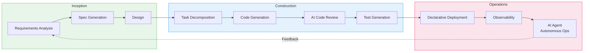
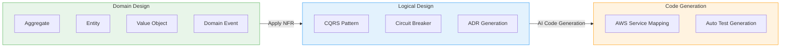

import { AidlcPhaseMapping, EksCapabilities, ProductivityMetrics, AidlcPrinciples, AidlcPhaseActivities, AiCodingAgentComparison, QualityGates, AiAgentEcosystem, DetailedMetrics, AidlcPipeline, AidlcArtifacts } from '@site/src/components/AidlcTables';

# AIDLC Framework — AI-Driven Development & Operations Enhancement in EKS Environments

> 📅 **Date**: 2026-02-12 | ⏱️ **Reading Time**: ~30 minutes | 📌 **Target Environment**: EKS 1.35+, Kiro, Managed Argo CD

---

## 1. Overview

### 1.1 Why AIDLC

Traditional Software Development Lifecycle (SDLC) was designed around human-centric, long iteration cycles (weekly/monthly). Rituals like daily stand-ups, sprint reviews, and retrospectives are optimized for these extended cycles. The emergence of AI disrupts this premise.

AI performs requirements analysis, task decomposition, code generation, and testing in **hours/days**. Retrofitting AI into existing SDLC approaches limits this potential — like building faster horse carriages in the age of automobiles.

**AIDLC (AI-Driven Development Lifecycle)** is a methodology proposed by AWS Labs that reconstructs the development lifecycle from **first principles**, integrating AI as a core collaborator.

```
Traditional SDLC                          AIDLC
━━━━━━━━━━━━━━                      ━━━━━━━━━━━━━━━━━━━
Humans plan and execute                   AI proposes, humans verify
Weekly/monthly iterations (Sprint)        Hourly/daily iterations (Bolt)
Design techniques are team choice         DDD/BDD/TDD built into methodology
Role silos (FE/BE/DevOps)                 AI transcends role boundaries
Manual requirements analysis              AI decomposes Intent into Units
Sequential handoffs                       Continuous flow + Loss Function verification
```

### 1.2 Connection to AIOps Strategy

The AWS open-source strategy → MCP integration → AI tools → Kiro orchestration discussed in the [AIOps Strategy Guide](./aiops-introduction.md) forms the **technical foundation** for realizing AIDLC. The 3-Pillar + AI analysis layer built in the [Intelligent Observability Stack](./aiops-observability-stack.md) provides the **data foundation** for the Operations phase. This document presents a **methodology for systematically enhancing development and operations** on top of that technical and data foundation.

```
[Doc 1] AIOps Strategy ──── Technical Foundation (MCP, Kiro, AI Agent)
           │
[Doc 2] Observability Stack ──── Data Foundation (ADOT, AMP/AMG, CloudWatch AI)
           │
[Doc 3] AIDLC Framework ── Methodology (this document)
           │
[Doc 4] Predictive Operations ──────── Advanced (ML prediction, auto-recovery, Chaos)
```

:::info Original Reference
Core AIDLC concepts are defined in AWS Labs' [AI-DLC Method Definition](https://prod.d13rzhkk8cj2z0.amplifyapp.com/). This document is a practical implementation guide for that methodology in EKS environments.
:::

---

## 2. AIDLC Core Concepts

### 2.1 10 Principles

<AidlcPrinciples />

Three principles particularly important in EKS environments:

- **Reverse the Conversation Direction** — AI collects EKS cluster state via MCP and proposes deployment plans first. Developers set the destination (Intent) like a driver using Google Maps and verify the routes AI presents.
- **Integration of Design Techniques** — DDD is embedded at the methodology's core, with AI automatically modeling business logic as Aggregates, Entities, and Value Objects. Design techniques that were "team choice" in Scrum are mandatory core in AI-DLC.
- **Minimize Stages, Maximize Flow** — Minimize handoffs and implement continuous flow. Human verification at each stage acts as a **Loss Function**, intercepting errors early before they propagate downstream.

### 2.2 Core Artifacts

AI-DLC redefines traditional SDLC terminology for the AI era.

```
┌─────────┐    ┌─────────┐    ┌─────────┐
│  Intent  │───▶│  Unit   │───▶│  Bolt   │
│High-level│    │Independent│   │ Fast    │
│ Purpose  │    │work unit │   │iteration│
│Business  │    │(DDD Sub- │   │(Sprint  │
│  Goal    │    │ domain)  │   │replace) │
└─────────┘    └─────────┘    └─────────┘
                    │
              ┌─────┴─────┐
              ▼           ▼
        ┌──────────┐ ┌──────────┐
        │ Domain   │ │ Logical  │
        │ Design   │ │ Design   │
        │Business  │ │NFR+      │
        │ Logic    │ │patterns  │
        └──────────┘ └──────────┘
              │           │
              └─────┬─────┘
                    ▼
            ┌──────────────┐
            │ Deployment   │
            │    Unit      │
            │Container+    │
            │Helm+Terraform│
            └──────────────┘
```

<AidlcArtifacts />

:::tip Context Memory and Traceability
All artifacts are stored in **Context Memory** for AI reference throughout the lifecycle. Bidirectional traceability between artifacts (Domain Model ↔ User Story ↔ Test Plan) is guaranteed, ensuring AI always works with accurate context.
:::

### 2.3 AI-Driven Recursive Workflow

The core of AI-DLC is a **recursive refinement process where AI proposes plans and humans verify**.

```
Intent (Business Purpose)
  │
  ▼
AI: Generate Level 1 Plan ◀──── Human: Verify · Modify
  │
  ├─▶ Step 1 ──▶ AI: Level 2 Decomposition ◀── Human: Verify
  │                 ├─▶ Sub-task 1.1 ──▶ AI Execute ◀── Human: Verify
  │                 └─▶ Sub-task 1.2 ──▶ AI Execute ◀── Human: Verify
  │
  ├─▶ Step 2 ──▶ AI: Level 2 Decomposition ◀── Human: Verify
  │                 └─▶ ...
  └─▶ Step N ──▶ ...

[All artifacts → Context Memory → Bidirectional Traceability]
```

Human verification at each stage acts as a **Loss Function** — capturing errors early to prevent downstream propagation. This is a flexible approach where AI doesn't prescribe fixed workflows by path (new development, refactoring, defect fixing), but proposes Level 1 Plans suited to the situation.

### 2.4 AIDLC 3-Phase Overview

AIDLC consists of three phases: **Inception**, **Construction**, **Operations**.

<AidlcPhaseMapping />



<AidlcPhaseActivities />

---

## 3. Inception Phase — From Requirements to Design

### 3.1 Mob Elaboration

The core ritual of Inception is **Mob Elaboration** — a requirements refinement session where Product Owner, developers, and QA gather in one room to collaborate with AI.

```
┌──────────────────────────────────────────────────┐
│              Mob Elaboration Ritual                │
├──────────────────────────────────────────────────┤
│                                                   │
│  [AI] Propose decomposition of Intent into        │
│       User Stories + Units                        │
│    ↓                                              │
│  [PO + Dev + QA] Review · Adjust over/under-     │
│                   engineering                     │
│    ↓                                              │
│  [AI] Reflect modifications → Generate additional │
│       NFR · Risks                                 │
│    ↓                                              │
│  [Team] Final verification → Confirm Bolt plan    │
│                                                   │
├──────────────────────────────────────────────────┤
│  Outputs:                                         │
│  PRFAQ · User Stories · NFR definitions           │
│  Risk Register · Metrics · Bolt plan              │
└──────────────────────────────────────────────────┘
```

Sequential requirements analysis that took **weeks to months** in traditional methodologies is compressed to **hours** by having AI generate drafts and teams review simultaneously.

### 3.2 Kiro Spec-Driven Inception

Kiro systematizes Mob Elaboration outputs into **Spec files**, structuring the entire process from natural language requirements to code.

```
requirements.md → design.md → tasks.md → Code generation → Verification
```

**EKS Example: Payment Service Deployment**

`requirements.md`:

```markdown
# Payment Service Deployment Requirements

## Functional Requirements
- REST API endpoint: /api/v1/payments
- Integration with DynamoDB table
- Asynchronous event processing via SQS

## Non-Functional Requirements
- P99 latency: < 200ms
- Availability: 99.95%
- Auto-scaling: 2-20 Pods
- EKS 1.35+ compatible
```

`design.md`:

```markdown
# Payment Service Architecture

## Infrastructure Configuration
- EKS Deployment (3 replicas min)
- ACK DynamoDB Table (on-demand)
- ACK SQS Queue (FIFO)
- HPA (CPU 70%, Memory 80%)
- Karpenter NodePool (graviton, spot)

## Observability
- ADOT sidecar (traces → X-Ray)
- Application Signals (automatic SLI/SLO)
- CloudWatch Logs (/eks/payment-service)

## Security
- Pod Identity (replacing IRSA)
- NetworkPolicy (namespace isolation)
- Secrets Manager CSI Driver
```

`tasks.md`:

```markdown
# Implementation Tasks

## Bolt 1: Infrastructure
- [ ] Write ACK DynamoDB Table CRD
- [ ] Write ACK SQS Queue CRD
- [ ] Define KRO ResourceGroup (DynamoDB + SQS integration)
- [ ] Configure Karpenter NodePool (graviton, spot)

## Bolt 2: Application
- [ ] Implement Go REST API
- [ ] DynamoDB SDK integration
- [ ] Implement SQS consumer
- [ ] Dockerfile + multi-stage build

## Bolt 3: Deployment
- [ ] Write Helm chart
- [ ] Define Argo CD Application
- [ ] Write HPA manifest
- [ ] Write NetworkPolicy

## Bolt 4: Observability
- [ ] Configure ADOT sidecar
- [ ] Application Signals annotation
- [ ] CloudWatch dashboard
- [ ] SLO alert configuration
```

:::tip Core Value of Spec-Driven
**Directive approach**: "Create DynamoDB" → "Need SQS too" → "Deploy it now" → Manual instructions each time, risk of context loss
**Spec-Driven**: Kiro analyzes requirements.md → generates design.md → decomposes tasks.md → auto-generates code → verification all connected through consistent Context Memory
:::

### 3.3 MCP-Based Real-Time Context Collection

Kiro is MCP-native, collecting real-time infrastructure state through AWS Hosted MCP servers during the Inception phase.

```
[Kiro + MCP Interaction]

Kiro: "Check EKS cluster status"
  → EKS MCP Server: get_cluster_status()
  → Response: { version: "1.35", nodes: 5, status: "ACTIVE" }

Kiro: "Analyze costs"
  → Cost Analysis MCP Server: analyze_cost(service="EKS")
  → Response: { monthly: "$450", recommendations: [...] }

Kiro: "Analyze current workloads"
  → EKS MCP Server: list_deployments(namespace="payment")
  → Response: { deployments: [...], resource_usage: {...} }
```

This enables **designs that reflect current cluster state and costs** when generating design.md. For MCP integration architecture details, see [AIOps Strategy Guide — MCP Integration Interface](./aiops-introduction.md).

---

## 4. Construction Phase — From Design to Code

### 4.1 DDD Integration: From Domain Design to Logical Design

In AI-DLC, DDD is **not optional but a built-in methodology element**. AI automatically models business logic according to DDD principles.



**Payment Service Example**:

1. **Domain Design** — AI models business logic
   - Aggregate: `Payment` (transactionId, amount, status)
   - Entity: `PaymentMethod`, `Customer`
   - Value Object: `Money`, `Currency`
   - Domain Event: `PaymentCreated`, `PaymentCompleted`, `PaymentFailed`

2. **Logical Design** — Apply NFR + select architecture patterns
   - CQRS: Separate payment creation (Command) / query (Query)
   - Circuit Breaker: External payment gateway calls
   - ADR: Record "DynamoDB on-demand vs provisioned" decision

3. **Code Generation** — Map to AWS services
   - Aggregate → EKS Deployment + DynamoDB Table
   - Domain Event → SQS FIFO Queue
   - Circuit Breaker → Envoy sidecar + Istio

Developers **verify and adjust** the models AI generates at each stage. This verification acts as the Loss Function.

### 4.2 Mob Construction

The core ritual of Construction is **Mob Construction**. Teams gather in one room, each developing their Units while exchanging Integration Specifications generated during the Domain Design phase.

```
[Mob Construction Flow]

Team A: Payment Unit        Team B: Notification Unit
  │                            │
  ├─ Domain Design complete   ├─ Domain Design complete
  │                            │
  └────── Exchange Integration Specifications ──────┘
          (Domain Event contract)
  │                            │
  ├─ Logical Design            ├─ Logical Design
  ├─ Code generation           ├─ Code generation
  ├─ Testing                   ├─ Testing
  └─ Deliver Bolt              └─ Deliver Bolt
```

Each Unit is loosely coupled, enabling **parallel development**, and integrated through Domain Events. AI also auto-generates integration tests.

:::warning Brown-field (Legacy System) Approach
When adding features or refactoring existing systems, the Construction phase requires **additional steps**:

1. AI **reverse engineers** existing code into semantic models (code → model elevation)
   - **Static Model**: Components, responsibilities, relationships
   - **Dynamic Model**: Component interactions in key use cases
2. Developers verify and modify the reverse-engineered models
3. Proceed with the same Construction flow as Green-field

This ensures AI accurately understands the existing system's context before making changes.
:::

### 4.3 AI Coding Agents

AI coding agents utilized in the AIDLC Construction phase. Amazon Q Developer and Kiro use **Anthropic Claude** models, while Kiro also supports open-weight models for cost optimization and specialized domain extensions.

<AiCodingAgentComparison />

### 4.4 EKS Capabilities-Based Declarative Automation

EKS Capabilities (2025.11) provides popular open-source tools as AWS-managed services, enabling declarative deployment of Construction phase outputs.

<EksCapabilities />

#### 4.4.1 Managed Argo CD — GitOps

Managed Argo CD operates GitOps as a managed service on AWS infrastructure. Code generated by Kiro is automatically deployed to EKS upon Git push. Manage single environments with Application CRDs and multi-environments (dev/staging/production) declaratively with ApplicationSets.

#### 4.4.2 ACK — Declarative AWS Resource Management

ACK manages 50+ AWS services declaratively via K8s CRDs. Infrastructure elements (DynamoDB, SQS, S3, etc.) from Domain Designs generated by Kiro are deployed with `kubectl apply` and naturally integrate into Argo CD's GitOps workflow.

:::info ACK's Core Value
With ACK, you can **manage AWS resources outside the cluster with K8s declarative models**. Create/modify/delete DynamoDB, SQS, S3, RDS, etc. via K8s CRDs, enabling the strategy of "centrally managing all infrastructure declaratively around K8s."
:::

#### 4.4.3 KRO — Composite Resource Orchestration

KRO bundles multiple K8s resources into a **single deployment unit (ResourceGroup)**. Directly maps to AIDLC's Deployment Unit concept, creating Deployment + Service + HPA + ACK resources as one Custom Resource.

#### 4.4.4 LBC v3 Gateway API

AWS Load Balancer Controller v3 transitions Gateway API to GA, providing L4 (NLB) + L7 (ALB) routing, QUIC/HTTP3, JWT validation, and header transformation. Manage traffic declaratively with Gateway + HTTPRoute CRDs.

:::tip EKS Capabilities + AIDLC Synergy
The combination of Managed Argo CD (deployment) + ACK (infrastructure) + KRO (orchestration) + LBC v3 (networking) enables **full-stack deployment with a single Git Push** of all artifacts generated by Kiro from Specs. This is the core of the Construction → Operations transition.
:::

### 4.5 MCP-Based IaC Automation Pipeline

Combining Kiro with AWS Hosted MCP servers automatically generates from Inception Specs to Construction IaC and deploys via Argo CD.

<AidlcPipeline />

---

## 5. Operations Phase — From Deployment to Autonomous Operations

### 5.1 Observability Foundation — Doc 2 Connection

The data foundation for the Operations phase is the 5-Layer architecture built in the [Intelligent Observability Stack](./aiops-observability-stack.md).

```
[Observability Stack → Operations Connection]

Collection Layer (ADOT, CloudWatch Agent, NFM Agent)
      ↓
Transport Layer (OTLP, Prometheus Remote Write)
      ↓
Storage Layer (AMP, CloudWatch, X-Ray)
      ↓
Analysis Layer (AMG, CloudWatch AI, DevOps Guru)
      ↓
Action Layer ← AIDLC Operations positioned here
  ├── MCP-based integrated analysis
  ├── AI Agent automated response
  └── Predictive scaling
```

Metrics, logs, and traces collected by the observability stack are delivered to AI tools and Agents via MCP, forming the decision foundation for the Operations phase.

### 5.2 AI Agent Operations Automation

<AiAgentEcosystem />

#### 5.2.1 Amazon Q Developer (GA)

The most mature production pattern. Immediately usable for CloudWatch Investigations and EKS troubleshooting.

- **CloudWatch Investigations**: AI detects metric anomalies and analyzes root causes
- **EKS Troubleshooting**: Diagnose cluster state, Pod failures, node issues in natural language
- **Security Scanning**: Detect code vulnerabilities + suggest automatic fixes

#### 5.2.2 Strands Agents (OSS)

AWS production-validated agent SDK that defines **Agent SOPs (Standard Operating Procedures)** in natural language.

```python
# Strands Agent SOP: Pod CrashLoopBackOff Response
from strands import Agent
from strands.tools import eks_tool, cloudwatch_tool, slack_tool

ops_agent = Agent(
    name="eks-incident-responder",
    model="bedrock/anthropic.claude-sonnet",
    tools=[eks_tool, cloudwatch_tool, slack_tool],
    sop="""
    ## Pod CrashLoopBackOff Response SOP

    1. Identify failed Pod
       - kubectl get pods --field-selector=status.phase!=Running
       - Record namespace, Pod name, restart count

    2. Analyze logs
       - kubectl logs <pod> --previous
       - Classify error pattern: OOM, ConfigError, DependencyFailure

    3. Diagnose root cause
       - OOM → Check memory limits
       - ConfigError → Check ConfigMap/Secret
       - DependencyFailure → Check dependent service status

    4. Automated response
       - OOM and limits < 2Gi → Patch limits to 1.5x (automatic)
       - ConfigError → Slack alert + mention assignee (manual)
       - DependencyFailure → Attempt dependent service restart (automatic)

    5. Post-incident report
       - Post incident report to Slack #incidents channel
    """
)
```

#### 5.2.3 Kagent (K8s Native)

Manage AI agents declaratively with K8s CRDs. Supports MCP integration (kmcp) but still in early stages.

```yaml
# Kagent Agent Definition
apiVersion: kagent.dev/v1alpha1
kind: Agent
metadata:
  name: eks-ops-agent
  namespace: kagent-system
spec:
  description: "EKS operations automation agent"
  modelConfig:
    provider: bedrock
    model: anthropic.claude-sonnet
    region: ap-northeast-2
  systemPrompt: |
    EKS cluster operations agent.
    Automatically diagnose and respond to Pod failures, node issues, scaling problems.
    Only perform safe actions; request approval for risky changes.
  tools:
    - name: kubectl
      type: kmcp
      config:
        server: kubernetes.default.svc
        namespace: "*"
        allowedVerbs: ["get", "describe", "logs", "top"]
    - name: cloudwatch
      type: kmcp
      config:
        region: ap-northeast-2
        actions: ["GetMetricData", "DescribeAlarms"]
```

:::tip Adoption Order
**First** adopt Q Developer (GA) fully-managed analysis, **then** add Strands (OSS) SOP-based workflows, **finally** progressively expand Kagent (early stage) K8s-native approaches. Aligns with the [AIOps Strategy Guide](./aiops-introduction.md) maturity model Level 3→4 transition.
:::

### 5.3 From CI/CD to AI/CD

In AIDLC, deployment pipelines evolve from traditional CI/CD to AI-enhanced **AI/CD**.

```
[CI/CD → AI/CD Transition]

Traditional CI/CD:
  Code commit → Build → Test → Manual approval → Deploy

AI/CD:
  Spec commit → AI code generation → AI security scan → AI review
     → Loss Function verification (human) → Argo CD auto-deploy
     → AI observability monitoring → AI Agent automated response
```

Key transition points:
- **Code commit** → **Spec commit** (requirements.md triggers)
- **Manual approval** → **AI review + Loss Function verification** (humans focus on decisions)
- **Manual monitoring** → **AI Agent autonomous response** (MCP-based integrated analysis)

:::info Operations Advanced Topics
Advanced Operations patterns like ML-based predictive scaling, Karpenter + AI prediction, Chaos Engineering + AI learning are covered in [Predictive Scaling and Auto-Recovery](./aiops-predictive-operations.md).
:::

---

## 6. Quality Gates — Quality Assurance Across All Phases

In AI-DLC, human verification is a **Loss Function** — capturing errors early at each stage to prevent downstream propagation. Quality Gates systematize this Loss Function.

```
Inception          Construction          Operations
    │                   │                    │
    ▼                   ▼                    ▼
[Mob Elaboration    [DDD Model         [Pre-deployment
 Output Verification] Verification]     Verification]
    │                   │                    │
    ▼                   ▼                    ▼
[Spec Consistency]  [Code + Security   [SLO-based
                     Scan]              Monitoring]
    │                   │                    │
    ▼                   ▼                    ▼
[NFR Compliance]    [Test Coverage]    [AI Agent Response
                                        Verification]
```

<QualityGates />

### 6.1 AI-Based PR Review Automation

```yaml
# .github/workflows/ai-review.yml
name: AI Code Review
on:
  pull_request:
    types: [opened, synchronize]

jobs:
  ai-review:
    runs-on: ubuntu-latest
    steps:
      - uses: actions/checkout@v4
        with:
          fetch-depth: 0

      - name: Q Developer Security Scan
        uses: aws/amazon-q-developer-action@v1
        with:
          scan-type: security
          source-path: .

      - name: K8s Manifest Validation
        run: |
          kube-linter lint deploy/ --config .kube-linter.yaml

      - name: Terraform Validation
        if: contains(github.event.pull_request.changed_files, 'terraform/')
        run: |
          cd terraform/
          terraform init -backend=false
          terraform validate
          tflint --recursive
```

---

## 7. Metrics

### 7.1 AIDLC Productivity Metrics

Key metrics for measuring AIDLC adoption impact.

<ProductivityMetrics />

### 7.2 Detailed Metrics and DORA Mapping

<DetailedMetrics />

---

## 8. Conclusion

### 8.1 Adoption Roadmap

```
Phase 1: AI Coding Tool Adoption
  └── Start code generation/review with Q Developer/Copilot
      (AIOps maturity Level 2)

Phase 2: Spec-Driven Development
  └── Systematic requirements → code workflow with Kiro + MCP
      Pilot Mob Elaboration ritual
      (AIOps maturity Level 3)

Phase 3: Declarative Automation
  └── Complete GitOps with Managed Argo CD + ACK + KRO
      Transition to AI/CD pipeline
      (AIOps maturity Level 3→4)

Phase 4: AI Agent Expansion
  └── Autonomous operations with Q Developer + Strands + Kagent
      Expand Mob Construction ritual
      (AIOps maturity Level 4)
```

### 8.2 Next Steps

- **[Predictive Scaling and Auto-Recovery](./aiops-predictive-operations.md)** — Operations phase advanced: ML-based predictive scaling, AI Agent automated incident response, Chaos Engineering
- **[Intelligent Observability Stack](./aiops-observability-stack.md)** — Operations phase data foundation: ADOT, AMP/AMG, CloudWatch AI implementation
- **[AIOps Strategy Guide](./aiops-introduction.md)** — AIDLC technical foundation: AWS open-source strategy, MCP integration, AI tool ecosystem

### 8.3 Learning Path

```
[Previous] AIOps Strategy Guide — Understand technical foundation (MCP, Kiro, AI Agent)
     ↓
[Previous] Intelligent Observability Stack — Build data foundation (ADOT, AMP/AMG)
     ↓
[Current] AIDLC Framework — Practice methodology (this document)
     ↓
[Next] Predictive Scaling and Auto-Recovery — Advanced autonomous operations
```

:::info References
- [AWS AI-DLC Method Definition](https://prod.d13rzhkk8cj2z0.amplifyapp.com/) — AIDLC original (Raja SP, AWS)
- [AWS AI-Driven Development Life Cycle Blog](https://aws.amazon.com/blogs/devops/ai-driven-development-life-cycle/)
- [AWS Labs AIDLC Workflows (GitHub)](https://github.com/awslabs/aidlc-workflows)
- [EKS Capabilities (2025.11)](https://aws.amazon.com/blogs/containers/)
- [Strands Agents SDK](https://github.com/strands-agents/sdk-python)
- [Kagent - Kubernetes AI Agent](https://github.com/kagent-dev/kagent)
:::
