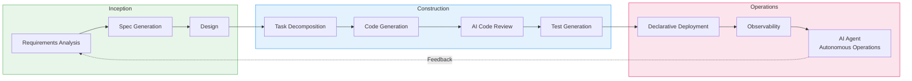
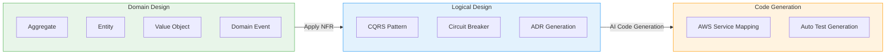
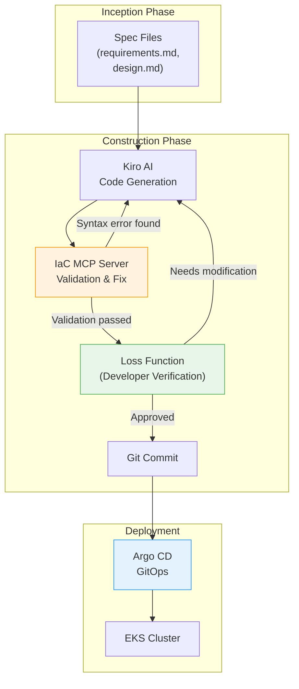

import { AidlcPhaseMapping, EksCapabilities, ProductivityMetrics, AidlcPrinciples, AidlcPhaseActivities, AiCodingAgentComparison, QualityGates, AiAgentEcosystem, DetailedMetrics, AidlcPipeline, AidlcArtifacts } from '@site/src/components/AidlcTables';

# AIDLC Framework — AI-Driven Development and Operations Enhancement in EKS Environments

> **Written**: 2026-02-12 | **Updated**: 2026-02-14 | **Reading Time**: ~39 min

---

## 1. Overview

### 1.1 Why AIDLC

The traditional Software Development Lifecycle (SDLC) was designed around the premise of human-centered long iteration cycles (weekly/monthly). Rituals like daily standups, sprint reviews, and retrospectives are optimized for these long cycles. The advent of AI breaks this premise.

AI performs requirements analysis, task decomposition, code generation, and testing on an **hourly/daily** basis. A retrofit approach of fitting AI into the existing SDLC limits this potential — much like building a faster horse-drawn carriage in the age of automobiles.

**AIDLC (AI-Driven Development Lifecycle)** is a methodology proposed by AWS Labs that reorganizes AI from **First Principles**, integrating it as a core collaborator in the development lifecycle.

```
Traditional SDLC                        AIDLC
━━━━━━━━━━━━━━                          ━━━━━━━━━━━━━━━━━━━
Humans plan and execute                  AI proposes, humans verify
Weekly/monthly iterations (Sprint)       Hourly/daily iterations (Bolt)
Design techniques are team's choice      DDD/BDD/TDD built into methodology
Role silos (FE/BE/DevOps)               AI transcends role boundaries
Manual requirements analysis             AI decomposes Intent into Units
Sequential handoffs                      Continuous flow + Loss Function verification
```

### 1.2 Connection to AIOps Strategy

The AWS open-source strategy → MCP integration → AI tools → Kiro orchestration covered in [1. AIOps Strategy Guide](./aiops-introduction.md) is the **technology foundation** for realizing AIDLC. The 3-Pillar + AI analysis layer built in [2. Intelligent Observability Stack](./aiops-observability-stack.md) is the **data foundation** for the Operations phase. This document presents the **methodology for systematically enhancing development and operations** on top of that technology and data foundation.

```
[1] AIOps Strategy Guide ──── Technology Foundation (MCP, Kiro, AI Agent)
           │
[2] Intelligent Observability Stack ──── Data Foundation (ADOT, AMP/AMG, CloudWatch AI)
           │
[3] AIDLC Framework ── Methodology (This Document)
           │
[4] Predictive Scaling & Auto-Recovery ──────── Advanced (ML Prediction, Auto-Recovery, Chaos)
```

:::info Original Reference
The core concepts of AIDLC are defined in AWS Labs' [AI-DLC Method Definition](https://prod.d13rzhkk8cj2z0.amplifyapp.com/). This document is a guide for practically implementing that methodology in EKS environments.
:::

---

## 2. AIDLC Core Concepts

### 2.1 10 Principles

<AidlcPrinciples />

Among these, 3 are particularly important in EKS environments:

- **Reverse the Conversation Direction** — AI collects EKS cluster state via MCP and proposes deployment plans first. Developers set the destination (Intent) like a driver using Google Maps, and verify the routes proposed by AI.
- **Integration of Design Techniques** — DDD is built into the core of the methodology, enabling AI to automatically model business logic into Aggregates, Entities, and Value Objects. Design techniques that were "up to the team" in Scrum become essential core in AI-DLC.
- **Minimize Stages, Maximize Flow** — Minimizes handoffs and implements continuous flow. Human verification at each stage serves as a **Loss Function**, catching errors early to prevent downstream propagation.

### 2.2 Core Artifacts

AI-DLC redefines traditional SDLC terminology for the AI era.

```
┌─────────┐    ┌─────────┐    ┌─────────┐
│  Intent  │───▶│  Unit   │───▶│  Bolt   │
│High-level │    │Independent│   │Fast      │
│ purpose   │    │work unit  │   │iteration │
│          │    │(DDD Sub- │   │(Sprint  │
│Business   │   │ domain)  │   │ replace)│
│ goal     │    └─────────┘    └─────────┘
└─────────┘         │
              ┌─────┴─────┐
              ▼           ▼
        ┌──────────┐ ┌──────────┐
        │ Domain   │ │ Logical  │
        │ Design   │ │ Design   │
        │Business  │ │NFR+      │
        │ logic    │ │Patterns  │
        └──────────┘ └──────────┘
              │           │
              └─────┬─────┘
                    ▼
            ┌──────────────┐
            │ Deployment   │
            │    Unit      │
            │Container+    │
            │Helm+         │
            │  Terraform   │
            └──────────────┘
```

<AidlcArtifacts />

:::tip Context Memory and Traceability
All artifacts are stored as **Context Memory** for AI to reference throughout the lifecycle. Bidirectional tracing between artifacts (Domain Model ↔ User Story ↔ Test Plan) is guaranteed, ensuring AI always works within the correct context.
:::

### 2.3 AI-Driven Recursive Workflow

The core of AI-DLC is a **recursive refinement process where AI proposes plans and humans verify**.

```
Intent (Business Purpose)
  │
  ▼
AI: Generate Level 1 Plan ◀──── Human: Verify · Modify
  │
  ├─▶ Step 1 ──▶ AI: Level 2 Decomposition ◀── Human: Verify
  │                 ├─▶ Sub-task 1.1 ──▶ AI Execute ◀── Human: Verify
  │                 └─▶ Sub-task 1.2 ──▶ AI Execute ◀── Human: Verify
  │
  ├─▶ Step 2 ──▶ AI: Level 2 Decomposition ◀── Human: Verify
  │                 └─▶ ...
  └─▶ Step N ──▶ ...

[All Artifacts → Context Memory → Bidirectional Traceability]
```

Human verification at each stage is a **Loss Function** — catching errors early to prevent downstream propagation. Rather than prescribing fixed workflows per path (new development, refactoring, defect fixing), AI proposes flexible Level 1 Plans suited to the situation.

### 2.4 AIDLC 3-Phase Overview

AIDLC consists of 3 phases: **Inception**, **Construction**, and **Operations**.

<AidlcPhaseMapping />



<AidlcPhaseActivities />

---

## 3. Inception Phase — From Requirements to Design

### 3.1 Mob Elaboration

The core ritual of Inception is **Mob Elaboration** — a requirements refinement session where Product Owner, developers, and QA gather together to collaborate with AI.

```
┌──────────────────────────────────────────────────┐
│              Mob Elaboration Ritual                │
├──────────────────────────────────────────────────┤
│                                                   │
│  [AI] Proposes decomposition of Intent into       │
│       User Stories + Units                        │
│    ↓                                              │
│  [PO + Dev + QA] Review · Adjust over/under       │
│       design                                      │
│    ↓                                              │
│  [AI] Applies modifications → Generates           │
│       additional NFR · Risks                      │
│    ↓                                              │
│  [Team] Final verification → Confirm Bolt plan    │
│                                                   │
├──────────────────────────────────────────────────┤
│  Artifacts:                                       │
│  PRFAQ · User Stories · NFR Definitions           │
│  Risk Register · Measurement Criteria · Bolt Plan │
└──────────────────────────────────────────────────┘
```

Sequential requirements analysis that took **weeks to months** in traditional methodologies is compressed to **hours** by having AI generate drafts and the team review simultaneously.

### 3.2 Kiro Spec-Driven Inception

Kiro systematizes Mob Elaboration artifacts into **Spec files**. It structures the entire process from natural language requirements to code.

```
requirements.md → design.md → tasks.md → Code Generation → Verification
```

**EKS Example: Payment Service Deployment**

`requirements.md`:

```markdown
# Payment Service Deployment Requirements

## Functional Requirements
- REST API endpoint: /api/v1/payments
- Integration with DynamoDB table
- Asynchronous event processing via SQS

## Non-Functional Requirements
- P99 latency: < 200ms
- Availability: 99.95%
- Auto-scaling: 2-20 Pods
- EKS 1.35+ compatible
```

`design.md`:

```markdown
# Payment Service Architecture

## Infrastructure Configuration
- EKS Deployment (3 replicas min)
- ACK DynamoDB Table (on-demand)
- ACK SQS Queue (FIFO)
- HPA (CPU 70%, Memory 80%)
- Karpenter NodePool (graviton, spot)

## Observability
- ADOT sidecar (traces → X-Ray)
- Application Signals (SLI/SLO automatic)
- CloudWatch Logs (/eks/payment-service)

## Security
- Pod Identity (IRSA replacement)
- NetworkPolicy (namespace isolation)
- Secrets Manager CSI Driver
```

`tasks.md`:

```markdown
# Implementation Tasks

## Bolt 1: Infrastructure
- [ ] Write ACK DynamoDB Table CRD
- [ ] Write ACK SQS Queue CRD
- [ ] Define KRO ResourceGroup (DynamoDB + SQS integration)
- [ ] Configure Karpenter NodePool (graviton, spot)

## Bolt 2: Application
- [ ] Implement Go REST API
- [ ] Integrate DynamoDB SDK
- [ ] Implement SQS consumer
- [ ] Dockerfile + multi-stage build

## Bolt 3: Deployment
- [ ] Write Helm chart
- [ ] Define Argo CD Application
- [ ] Write HPA manifest
- [ ] Write NetworkPolicy

## Bolt 4: Observability
- [ ] Configure ADOT sidecar
- [ ] Application Signals annotation
- [ ] CloudWatch dashboard
- [ ] SLO alert configuration
```

:::tip Core Value of Spec-Driven
**Directing approach**: "Create DynamoDB" → "I also need SQS" → "Now deploy it" → Manual instructions each time, risk of context loss
**Spec-Driven**: Kiro analyzes requirements.md → Generates design.md → Decomposes into tasks.md → Auto-generates code → Connected through consistent Context Memory all the way to verification
:::

### 3.3 MCP-Based Real-Time Context Collection

Kiro is MCP-native, collecting real-time infrastructure state through AWS Hosted MCP servers during the Inception phase.

```
[Kiro + MCP Interaction]

Kiro: "Check EKS cluster status"
  → EKS MCP Server: get_cluster_status()
  → Response: { version: "1.35", nodes: 5, status: "ACTIVE" }

Kiro: "Cost analysis"
  → Cost Analysis MCP Server: analyze_cost(service="EKS")
  → Response: { monthly: "$450", recommendations: [...] }

Kiro: "Analyze current workloads"
  → EKS MCP Server: list_deployments(namespace="payment")
  → Response: { deployments: [...], resource_usage: {...} }
```

This enables **designs that reflect the current cluster state and costs** when generating design.md. For details on MCP integration architecture, refer to [1. AIOps Strategy Guide](./aiops-introduction.md).

---

## 4. Construction Phase — From Design to Code

### 4.1 DDD Integration: From Domain Design to Logical Design

In AI-DLC, DDD is **not optional but a built-in element of the methodology**. AI automatically models business logic according to DDD principles.



**Payment Service Example**:

1. **Domain Design** — AI models business logic
   - Aggregate: `Payment` (transactionId, amount, status)
   - Entity: `PaymentMethod`, `Customer`
   - Value Object: `Money`, `Currency`
   - Domain Event: `PaymentCreated`, `PaymentCompleted`, `PaymentFailed`

2. **Logical Design** — Apply NFR + Select architecture patterns
   - CQRS: Separate payment creation (Command) / query (Query)
   - Circuit Breaker: External payment gateway calls
   - ADR: Record "DynamoDB on-demand vs provisioned" decision

3. **Code Generation** — AWS service mapping
   - Aggregate → EKS Deployment + DynamoDB Table
   - Domain Event → SQS FIFO Queue
   - Circuit Breaker → Envoy sidecar + Istio

Developers **verify and adjust** the models generated by AI at each stage. This verification serves as the Loss Function.

### 4.2 Mob Construction

The core ritual of Construction is **Mob Construction**. Teams gather in one room to develop their respective Units, exchanging Integration Specifications generated during the Domain Design phase.

```
[Mob Construction Flow]

Team A: Payment Unit        Team B: Notification Unit
  │                            │
  ├─ Domain Design Complete    ├─ Domain Design Complete
  │                            │
  └────── Exchange Integration Specs ──────┘
          (Domain Event Contracts)
  │                            │
  ├─ Logical Design            ├─ Logical Design
  ├─ Code Generation           ├─ Code Generation
  ├─ Testing                   ├─ Testing
  └─ Bolt Delivery             └─ Bolt Delivery
```

Each Unit is loosely coupled, enabling **parallel development**, integrated through Domain Events. AI also auto-generates integration tests.

:::warning Brown-field (Existing System) Approach
When adding features or refactoring existing systems, **additional steps** are needed in the Construction phase:

1. AI **reverse-engineers existing code into a semantic model** (Code → Model promotion)
   - **Static Model**: Components, responsibilities, relationships
   - **Dynamic Model**: Component interactions for major use cases
2. Developers verify and modify the reverse-engineered model
3. Then proceed with the same Construction flow as Green-field

This ensures AI performs changes with an accurate understanding of the existing system's context.
:::

### 4.3 AI Coding Agents

These are the AI coding agents used in the AIDLC Construction phase. Amazon Q Developer and Kiro use **Anthropic Claude** models, and Kiro also supports open-weight models for cost optimization and specialized domain extensions.

<AiCodingAgentComparison />

#### 4.3.4 Amazon Q Developer — Real-Time Code Build and Test (2025)

AWS announced **Amazon Q Developer's real-time code execution capability** in February 2025. This is an innovative approach where AI generates code and then **automatically builds and runs tests to verify results** before presenting them to the developer. It is a core mechanism in the AIDLC Construction phase that **activates the Loss Function early** to prevent errors from propagating downstream.

**Real-Time Code Execution Capability**

Traditional AI coding tools required developers to manually build and test after code generation. Q Developer automates this process, implementing a closed loop of **code generation → automatic build → test execution → result verification → developer review**.

```
Traditional Approach:
  AI Code Generation → Developer Manual Build → Developer Manual Test → Error Found → Feedback to AI → Regenerate
  (Iteration cycle: 5-10 minutes)

Q Developer Real-Time Execution:
  AI Code Generation → Auto Build → Auto Test → Result Verification → (Auto Fix Retry on Error) → Developer Review
  (Iteration cycle: 1-2 minutes, minimal developer intervention)
```

**Core Mechanisms**

1. **Automatic Build Pipeline**
   - Q Developer automatically runs the project's build tools (Maven, Gradle, npm, pip, etc.) after code changes
   - Immediately detects compilation errors and dependency conflicts
   - On build failure, analyzes error messages and automatically retries with code fixes

2. **Automatic Test Execution**
   - Automatically runs unit tests and integration tests
   - On test failure, analyzes the cause and fixes code or tests
   - Adds new code while maintaining existing test coverage

3. **Pre-Developer Review Verification**
   - When developers receive code, **builds and tests have already passed**
   - Developers focus on business logic and design review (Loss Function role)
   - Verifying "Is it the right code?" rather than "Does the code work?"

**Security Scan Auto-Fix Suggestions**

Q Developer automatically scans Kubernetes YAML and application code for security vulnerabilities and provides fix suggestions.

**Kubernetes YAML Security Scan**

1. **Root Privilege Detection**
   - Detects `runAsUser: 0` or `runAsNonRoot: false`
   - Suggestion: `runAsUser: 1000`, `runAsNonRoot: true`

2. **Privileged Container Detection**
   - Detects `securityContext.privileged: true`
   - Suggestion: Explicitly add only required capabilities (e.g., `NET_ADMIN`)

3. **Missing securityContext Detection**
   - Warns when Pod/Container lacks `securityContext`
   - Suggestion: Add securityContext following the principle of least privilege

**Auto-Fix Suggestion Example**

```yaml
# Issue detected by Q Developer
apiVersion: v1
kind: Pod
metadata:
  name: payment-pod
spec:
  containers:
    - name: payment
      image: payment:v1
      securityContext:
        runAsUser: 0  # ⚠️ Using root privileges
        privileged: true  # ⚠️ Privileged mode

# Fix suggested by Q Developer
apiVersion: v1
kind: Pod
metadata:
  name: payment-pod
spec:
  securityContext:
    runAsNonRoot: true
    runAsUser: 1000
    fsGroup: 1000
    seccompProfile:
      type: RuntimeDefault
  containers:
    - name: payment
      image: payment:v1
      securityContext:
        allowPrivilegeEscalation: false
        readOnlyRootFilesystem: true
        capabilities:
          drop:
            - ALL
          add:
            - NET_BIND_SERVICE  # Add only required capabilities
```

**AIDLC Construction Phase Integration**

Q Developer's real-time execution and security scanning **automate the Quality Gate** in the Construction phase, realizing AIDLC's fast iteration cycle (Bolt).

1. **Auto-run Q Developer security scan at Quality Gate**
   - When Kiro generates code, Q Developer security scan is integrated into the pipeline
   - Automatically scans Kubernetes manifests, Dockerfiles, and application code
   - Presents fix suggestions to developers when vulnerabilities are found (Loss Function)

2. **Add Q Developer validation step to CI/CD pipeline**
   - Run Q Developer scan in GitHub Actions/GitLab CI when PR is created
   - Auto build and test execution guarantees "code works"
   - Security scan guarantees "code is secure"
   - Developers only verify "code is correct" (role separation)

**Integrated Workflow Example**

```yaml
# .github/workflows/aidlc-construction.yml
name: AIDLC Construction Quality Gate
on:
  pull_request:
    types: [opened, synchronize]

jobs:
  q-developer-validation:
    runs-on: ubuntu-latest
    steps:
      - uses: actions/checkout@v4

      # 1. Q Developer Security Scan
      - name: Q Developer Security Scan
        uses: aws/amazon-q-developer-action@v1
        with:
          scan-type: security
          source-path: .
          auto-fix: true  # Apply auto-fix suggestions

      # 2. Real-Time Build and Test
      - name: Q Developer Build & Test
        uses: aws/amazon-q-developer-action@v1
        with:
          action: build-and-test
          test-coverage-threshold: 80

      # 3. Kubernetes Manifest Validation
      - name: K8s Manifest Security Check
        run: |
          # Verify Q Developer suggested fixes have been applied
          kube-linter lint deploy/ --config .kube-linter.yaml

      # 4. Allow Argo CD sync only on pass
      - name: Approve for GitOps
        if: success()
        run: echo "Quality Gate passed. Ready for Argo CD sync."
```

**Actual Impact — Shortened Feedback Loop**

```
Traditional Construction Phase:
  [Developer] Write code (30 min)
    → [Developer] Manual build (2 min)
    → [Developer] Manual test (5 min)
    → [Developer] Error found (10 min debugging)
    → [Developer] Fix code (20 min)
    → Repeat...
  Total time: 2-3 hours

Q Developer Real-Time Execution:
  [AI] Generate code (1 min)
    → [AI] Auto build/test (30 sec)
    → [AI] Error detection and auto-fix (1 min)
    → [Developer] Loss Function verification (10 min)
    → [Argo CD] Auto deployment
  Total time: 15-20 minutes
```

:::tip Value of Q Developer in AIDLC
Q Developer's real-time execution implements AIDLC's core principle of **"Minimize Stages, Maximize Flow"**. By automating each stage of code generation → build → test → verification, it eliminates handoffs, and developers focus solely on **decision-making (Loss Function)**. This is the core mechanism that shortens the weekly/monthly cycles of traditional SDLC to AIDLC's hourly/daily cycles.
:::

**References**

- [AWS DevOps Blog: Enhancing Code Generation with Real-Time Execution in Amazon Q Developer](https://aws.amazon.com/blogs/devops/enhancing-code-generation-with-real-time-execution-in-amazon-q-developer/) (2025-02-06)
- AWS re:Invent 2025 EKS Research — See Section 13.4

### 4.4 EKS Capabilities-Based Declarative Automation

EKS Capabilities (2025.11) provides popular open-source tools as AWS-managed services, declaratively deploying Construction phase artifacts.

<EksCapabilities />

#### 4.4.1 Managed Argo CD — GitOps

Managed Argo CD operates GitOps as a managed service on AWS infrastructure. When Kiro pushes generated code to Git, it is automatically deployed to EKS. Application CRDs manage single environments, while ApplicationSets declaratively manage multi-environments (dev/staging/production).

#### 4.4.2 ACK — Declarative AWS Resource Management

ACK declaratively manages 50+ AWS services as K8s CRDs. It deploys infrastructure elements from Kiro-generated Domain Design (DynamoDB, SQS, S3, etc.) via `kubectl apply`, naturally integrating into Argo CD's GitOps workflow.

:::info Core Value of ACK
With ACK, **AWS resources external to the cluster can also be managed using the K8s declarative model**. Create/modify/delete DynamoDB, SQS, S3, RDS, etc. as K8s CRDs — this is the strategy of "declaratively managing all infrastructure centered on K8s."
:::

#### 4.4.3 KRO — Complex Resource Orchestration

KRO bundles multiple K8s resources into a **single deployment unit (ResourceGroup)**. It directly maps to AIDLC's Deployment Unit concept, creating Deployment + Service + HPA + ACK resources as a single Custom Resource.

#### 4.4.4 LBC v3 Gateway API

AWS Load Balancer Controller v3 brings Gateway API to GA, providing L4(NLB) + L7(ALB) routing, QUIC/HTTP3, JWT validation, and header transformation. Traffic is managed declaratively via Gateway + HTTPRoute CRDs.

#### 4.4.5 LBC v3 Gateway API — Advanced Features Detail

AWS Load Balancer Controller v3's Gateway API support provides powerful L4/L7 routing capabilities through the Kubernetes standard traffic management API. This is a core tool for declaratively implementing networking requirements from Kiro Specs in the AIDLC Construction phase.

**Gateway API v1.4 + LBC v2.14+ Coverage**

Gateway API uses a role-oriented design that allows infrastructure operators, cluster operators, and application developers to manage traffic within their respective scopes of responsibility.

1. **L4 Routes — TCPRoute, UDPRoute, TLSRoute (NLB, v2.13.3+)**
   - **TCPRoute**: TCP-based application routing (e.g., PostgreSQL, Redis, gRPC with TCP)
   - **UDPRoute**: UDP-based protocol routing (e.g., DNS, QUIC, game servers)
   - **TLSRoute**: SNI (Server Name Indication)-based TLS routing
   - Provisioned with Network Load Balancer (NLB), guaranteeing high throughput and low latency
   - Example: SNI-based shard routing in multi-tenant database clusters

2. **L7 Routes — HTTPRoute, GRPCRoute (ALB, v2.14.0+)**
   - **HTTPRoute**: HTTP/HTTPS routing based on path, headers, query parameters
   - **GRPCRoute**: Routing based on gRPC method names, gRPC-specific header management
   - Provisioned with Application Load Balancer (ALB), supporting content-based routing
   - Example: `/api/v1/*` → v1 service, `/api/v2/*` → v2 service (canary deployment)

3. **QUIC Protocol Support (HTTP/3 on NLB)**
   - Native HTTP/3 (QUIC) protocol support on NLB
   - Resolves TCP head-of-line blocking via UDP-based transport
   - Connection migration support in mobile network environments
   - Example: Real-time video streaming, game servers, low-latency APIs

**JWT Validation Feature**

Gateway API v1.4 supports **Gateway-level JWT (JSON Web Token) validation**. This separates authentication logic from backend services, reducing their load.

- **Authentication Policy Definition**: Declare JWT validation rules on the Gateway (issuer, public key, claim validation)
- **Backend Load Reduction**: ALB/NLB validates JWTs, early-blocking invalid requests
- **Centralized Authentication**: Multiple services reuse common authentication policies
- **Example**: Payment Service validates `iss=https://auth.example.com`, `aud=payment-api` on the `/api/v1/payments` path

**Header Transformation**

HTTPRoute can dynamically add, modify, and delete request and response headers.

- **RequestHeaderModifier**: Manipulate request headers before forwarding to backend
  - Example: Add `X-User-ID` header (user ID extracted from JWT claims)
  - Example: Force `X-Forwarded-Proto: https` (when backend is behind a proxy)
- **ResponseHeaderModifier**: Manipulate response headers before responding to client
  - Example: Add `X-Frame-Options: DENY` (security header)
  - Example: Remove `Server` header (prevent information disclosure)

**Usage in AIDLC Construction Phase**

Gateway API is a core tool for automatically deploying networking requirements defined in Kiro Specs through GitOps workflows.

1. **Define API routing requirements in Kiro Spec**
   - Specify requirements like "Route 10% traffic to v2 via canary deployment" in `requirements.md`
   - Design routing strategy using Gateway API in `design.md`
   - Kiro auto-generates HTTPRoute manifests

2. **Declarative traffic management with Gateway API CRDs**
   - Deploy Gateway, GatewayClass, HTTPRoute with a single Git commit
   - Argo CD automatically syncs changes to EKS
   - LBC provisions ALB/NLB and applies routing rules

3. **Canary/blue-green deployment strategy automation**
   - Adjust traffic distribution ratio with HTTPRoute's `weight` field
   - Example: v1 service 90%, v2 service 10% → gradually increase v2 to 100%
   - Monitor SLOs for each version with CloudWatch Application Signals
   - AI Agent automatically rolls back on SLO violation (Operations phase integration)

**Gateway, GatewayClass, HTTPRoute YAML Examples**

```yaml
# gatewayclass.yaml — Defined by infrastructure operator
apiVersion: gateway.networking.k8s.io/v1
kind: GatewayClass
metadata:
  name: aws-alb
spec:
  controllerName: gateway.alb.aws.amazon.com/controller
  description: "AWS Application Load Balancer"
---
# gateway.yaml — Defined by cluster operator
apiVersion: gateway.networking.k8s.io/v1
kind: Gateway
metadata:
  name: payment-gateway
  namespace: production
  annotations:
    gateway.alb.aws.amazon.com/scheme: internet-facing
    gateway.alb.aws.amazon.com/tags: Environment=production,Service=payment
spec:
  gatewayClassName: aws-alb
  listeners:
    - name: https
      protocol: HTTPS
      port: 443
      tls:
        mode: Terminate
        certificateRefs:
          - name: payment-tls-cert
            kind: Secret
      allowedRoutes:
        namespaces:
          from: Selector
          selector:
            matchLabels:
              gateway-access: enabled
---
# httproute.yaml — Defined by application developer
apiVersion: gateway.networking.k8s.io/v1
kind: HTTPRoute
metadata:
  name: payment-api-route
  namespace: production
spec:
  parentRefs:
    - name: payment-gateway
      namespace: production
      sectionName: https
  rules:
    # Canary deployment: v1 90%, v2 10%
    - matches:
        - path:
            type: PathPrefix
            value: /api/v1/payments
      backendRefs:
        - name: payment-service-v1
          port: 8080
          weight: 90
        - name: payment-service-v2
          port: 8080
          weight: 10
      filters:
        # JWT Validation (Gateway API v1.4)
        - type: RequestHeaderModifier
          requestHeaderModifier:
            add:
              - name: X-User-ID
                value: "{jwt.sub}"  # Extracted from JWT claims
        # Security headers
        - type: ResponseHeaderModifier
          responseHeaderModifier:
            add:
              - name: X-Frame-Options
                value: DENY
              - name: X-Content-Type-Options
                value: nosniff
            remove:
              - Server  # Prevent server info disclosure
---
# grpcroute.yaml — gRPC service routing
apiVersion: gateway.networking.k8s.io/v1alpha2
kind: GRPCRoute
metadata:
  name: payment-grpc-route
  namespace: production
spec:
  parentRefs:
    - name: payment-gateway
  rules:
    - matches:
        - method:
            service: payment.v1.PaymentService
            method: CreatePayment
      backendRefs:
        - name: payment-grpc-service
          port: 9090
```

:::tip Gateway API vs Ingress Comparison
**Ingress** defines all routing rules in a single resource, mixing infrastructure operator and developer responsibilities. **Gateway API** separates roles into GatewayClass (infrastructure), Gateway (cluster), and HTTPRoute (application), enabling each team to work independently. This aligns with AIDLC's **Loss Function** concept — validating at each layer to prevent error propagation.
:::

**References**

- [Kubernetes Gateway API v1.4 Release](https://kubernetes.io/blog/2025/11/06/gateway-api-v1-4/) (2025-11-06)
- [AWS Load Balancer Controller — Gateway API Docs](https://kubernetes-sigs.github.io/aws-load-balancer-controller/latest/guide/gateway/gateway/)
- [Kubernetes Gateway API in Action (AWS Blog)](https://aws.amazon.com/blogs/containers/kubernetes-gateway-api-in-action/)
- AWS re:Invent 2025 EKS Research — See Section 3.5

#### 4.4.6 Node Readiness Controller — Declarative Node Readiness Management

**Node Readiness Controller (NRC)** is a controller that declaratively defines conditions that Kubernetes nodes must meet before accepting workloads. This is a core tool in the AIDLC Construction phase for expressing infrastructure requirements as code and automatically applying them through GitOps.

**Core Concepts**

NRC defines conditions that nodes must satisfy before transitioning to "Ready" state through the `NodeReadinessRule` CRD. Traditionally, node readiness was automatically determined by kubelet, but NRC allows **declaratively injecting application-specific requirements into the infrastructure layer**.

- **Declarative Policies**: Define node readiness conditions as YAML via `NodeReadinessRule`
- **GitOps Compatible**: Version-manage and auto-deploy node readiness policies through Argo CD
- **Workload Protection**: Block scheduling until essential daemonsets (CNI, CSI, security agents) are ready

**Usage Across AIDLC Phases**

| Phase | NRC Role | Example |
|-------|----------|---------|
| **Inception** | AI analyzes workload requirements → Auto-defines required NodeReadinessRules | "GPU workloads should only be scheduled after NVIDIA device plugin is ready" |
| **Construction** | Include NRC rules in Helm charts, deploy as Terraform EKS Blueprints AddOn | Kiro auto-generates `NodeReadinessRule` manifests |
| **Operations** | NRC auto-manages node readiness at runtime, AI analyzes rule effectiveness | Track node readiness delay with CloudWatch Application Signals |

**Infrastructure as Code Perspective**

NRC extends AIDLC's "express infrastructure as code, test infrastructure too" principle down to the node level.

1. **GitOps-Based Policy Management**
   - Store `NodeReadinessRule` CRDs in Git repositories
   - Argo CD automatically syncs to EKS clusters
   - Apply to entire cluster with a single Git commit on policy change

2. **Kiro + MCP Automation**
   - Kiro parses workload requirements from Inception phase's `design.md`
   - Checks current cluster's daemonset status through EKS MCP Server
   - Auto-generates required `NodeReadinessRule` and adds to IaC repository

3. **Terraform EKS Blueprints Integration**
   - Declaratively install NRC controller as EKS Blueprints AddOn
   - Automate default policy configuration through Helm values
   - Apply consistent node readiness policies across multi-cluster environments

**Quality Gate Integration**

In AIDLC's Quality Gate phase, NRC is used as a tool to verify node readiness before deployment.

- **Pre-deployment Dry-run**: Simulate the impact on existing workloads when applying NRC rules
- **CI/CD Pipeline Validation**: `kubectl apply --dry-run` + NRC rule validity check in GitHub Actions/GitLab CI
- **Role as Loss Function**: Block incorrect node readiness policies before production deployment

**YAML Example: NodeReadinessRule for GPU Workloads**

```yaml
apiVersion: node.k8s.io/v1alpha1
kind: NodeReadinessRule
metadata:
  name: gpu-node-readiness
  namespace: kube-system
spec:
  # Apply only to GPU nodes
  nodeSelector:
    matchLabels:
      node.kubernetes.io/instance-type: p4d.24xlarge
  # Do not transition node to Ready until all following daemonsets are in Ready state
  requiredDaemonSets:
    - name: nvidia-device-plugin-daemonset
      namespace: kube-system
    - name: gpu-feature-discovery
      namespace: kube-system
    - name: dcgm-exporter
      namespace: monitoring
  # Timeout: Keep node NotReady if conditions not met within 10 minutes
  timeout: 10m
```

**Practical Use Cases**

| Scenario | NRC Rule | Effect |
|----------|----------|--------|
| **Cilium CNI Cluster** | Wait until Cilium agent is Ready | Prevent Pod scheduling before network initialization |
| **GPU Cluster** | Wait for NVIDIA device plugin + DCGM exporter readiness | Block workload scheduling before GPU resource exposure |
| **Security-Hardened Environment** | Wait for Falco, OPA Gatekeeper readiness | Prevent workload execution before security policy enforcement |
| **Storage Workloads** | Wait for EBS CSI driver + snapshot controller readiness | Prevent volume mount failures |

**Terraform EKS Blueprints AddOn Example**

```hcl
module "eks_blueprints_addons" {
  source = "aws-ia/eks-blueprints-addons/aws"

  cluster_name      = module.eks.cluster_name
  cluster_endpoint  = module.eks.cluster_endpoint

  enable_node_readiness_controller = true
  node_readiness_controller = {
    namespace = "kube-system"
    values = [
      yamlencode({
        defaultRules = {
          cilium = {
            enabled = true
            daemonSets = ["cilium"]
          }
          gpuNodes = {
            enabled = true
            nodeSelector = {
              "node.kubernetes.io/instance-type" = "p4d.24xlarge"
            }
            daemonSets = ["nvidia-device-plugin-daemonset", "dcgm-exporter"]
          }
        }
      })
    ]
  }
}
```

:::tip NRC + AIDLC Synergy
Node Readiness Controller extends AIDLC's principle of **"express infrastructure requirements declaratively and verify automatically"** down to the node level. Kiro analyzes workload requirements during the Inception phase to auto-generate `NodeReadinessRules`, Argo CD deploys them via GitOps, and during the Operations phase, AI Agents automatically detect and respond to node readiness anomalies.
:::

**References**

- [Kubernetes Blog: Introducing Node Readiness Controller](https://kubernetes.io/blog/2026/02/03/introducing-node-readiness-controller/) (2026-02-03)
- [Node Readiness Controller GitHub Repository](https://github.com/kubernetes-sigs/node-readiness-controller)

:::tip EKS Capabilities + AIDLC Synergy
When Managed Argo CD (deployment) + ACK (infrastructure) + KRO (orchestration) + LBC v3 (networking) + NRC (node readiness) are combined, all artifacts generated by Kiro from Specs can be **deployed as a full stack with a single Git Push**. This is the key to the Construction → Operations transition.
:::

### 4.5 MCP-Based IaC Automation Pipeline

Combining Kiro with AWS Hosted MCP servers, IaC is automatically generated from Inception Specs through Construction and deployed via Argo CD.

<AidlcPipeline />

#### 4.5.3 AWS IaC MCP Server — CDK/CloudFormation AI Support

AWS announced the **AWS Infrastructure as Code (IaC) MCP Server** on November 28, 2025. This is a programmatic interface that allows AI tools like Kiro CLI to search CloudFormation and CDK documentation, automatically validate templates, and provide AI-assisted deployment troubleshooting.

**AWS IaC MCP Server Overview**

AWS IaC MCP Server provides the following capabilities through Model Context Protocol:

- **Documentation Search**: Search CloudFormation resource types, CDK constructs, and best practices in real-time
- **Template Validation**: Automatically detect syntax errors in IaC templates and suggest fixes
- **Deployment Troubleshooting**: Analyze root causes of stack deployment failures and suggest solutions
- **Programmatic Access**: Native integration with AI tools like Kiro, Amazon Q Developer

**AIDLC Construction Phase Integration**

In AIDLC's Construction phase, IaC MCP Server is used as follows:

1. **Kiro Spec → IaC Code Generation Validation**
   - Kiro generates CDK/Terraform/Helm code based on `design.md` generated during the Inception phase
   - IaC MCP Server automatically validates syntax, resource constraints, and security policy compliance of generated code
   - For CloudFormation templates, pre-detects resource type typos, circular dependencies, and invalid properties

2. **CloudFormation Template Syntax Error Auto-Fix**
   - Statically analyzes templates before deployment to identify error patterns
   - Example: `Properties` typo → `Properties`, invalid intrinsic function → suggest correct function
   - Kiro auto-applies fix suggestions or requests Loss Function verification from the developer

3. **Pre-validation of Compatibility with Existing Infrastructure**
   - Integrates with EKS MCP Server and Cost Analysis MCP to analyze current cluster state
   - Verifies new IaC code doesn't conflict with existing resources (VPC, subnets, security groups)
   - Example: Check for name duplication with existing tables when creating DynamoDB table, verify VPC endpoint reusability

**Code Example: IaC MCP Server Workflow in Kiro**

```bash
# 1. Activate IaC MCP Server
kiro mcp add aws-iac

# 2. Generate IaC code from Spec files
kiro generate --spec requirements.md --output infra/

# 3. Validation process automatically run by IaC MCP Server
# - CloudFormation template syntax check
# - CDK construct compatibility validation
# - Resource constraint verification (e.g., DynamoDB on-demand vs provisioned)

# 4. Check validation results
kiro verify --target infra/

# Output example:
# ✓ CloudFormation syntax valid
# ⚠ Warning: DynamoDB table 'payments' uses on-demand billing (estimated $150/month)
# ✓ VPC endpoint 'vpce-dynamodb' already exists, reusing
# ✗ Error: Security group 'sg-app' conflicts with existing rule

# 5. Auto-fix errors
kiro fix --interactive

# Fix suggestions from IaC MCP Server:
# - Security group rule conflict → Change to new rule ID
# - Auto-apply after developer approval

# 6. Deploy via Argo CD
git add infra/ && git commit -m "Add Payment Service infrastructure"
git push origin main
# Argo CD auto-syncs → Deploys to EKS
```

**Integration Flow in Construction Phase**



:::tip IaC MCP Server and Kiro Synergy
AWS IaC MCP Server, combined with Kiro's Spec-driven development, automatically validates infrastructure code quality. It can be activated with `kiro mcp add aws-iac`, ensuring generated CloudFormation/CDK code automatically follows AWS best practices. This serves as a **Loss Function that catches IaC errors early** in the Construction phase.
:::

**References**

- [AWS DevOps Blog: Introducing the AWS IaC MCP Server](https://aws.amazon.com/blogs/devops/introducing-the-aws-infrastructure-as-code-mcp-server-ai-powered-cdk-and-cloudformation-assistance/) (2025-11-28)

---
