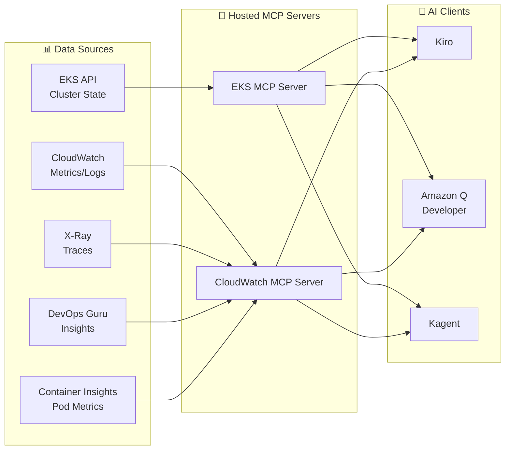

import { ArchitectureLayers, ManagedAddons, ServiceComparison, ObservabilityPillars, StackSelectionPatterns, DataFlowSummary, ProcessorSettings, ContainerInsightsMetrics, ApplicationSignalsLanguages, DevOpsGuruCost, EKSMCPTools, ErrorBudget, AlertOptimization } from '@site/src/components/ObservabilityStackTables';

# Building an Intelligent Observability Stack for EKS

> 📅 **Written**: 2026-02-12 | ⏱️ **Reading Time**: ~35 minutes | 📌 **Reference Environment**: EKS 1.35+, ADOT v0.40+, AMP, AMG

---

## 1. Overview

In modern distributed systems, **Observability** goes beyond simple monitoring—it's the ability to understand the internal state of a system through its external outputs. In EKS environments, with hundreds of Pods, complex service meshes, and dynamic scaling combined, traditional monitoring alone makes it difficult to identify the root cause of problems.

### 1.1 3-Pillar Observability + AI Analysis Layer

Combining the three pillars of observability with an AI analysis layer enables truly intelligent operations.

<ObservabilityPillars />

:::info Scope of This Document
This document covers the entire process of building an intelligent observability stack in EKS environments, from managed add-on-based observability fundamentals to AI analysis layers. We focus on a strategy where AWS operates open-source observability tools as managed services to **eliminate complexity** while **maximizing K8s-native observability**. While this document is based on AWS native stacks, using ADOT (OpenTelemetry) as the collection layer allows the same architecture to be applied with 3rd party backends.
:::

### 1.3 Observability Stack Selection Patterns

In actual EKS production environments, three main observability stack patterns are used based on organizational requirements and existing investments:

<StackSelectionPatterns />

:::tip The Core of Collection Layer: ADOT (OpenTelemetry)

Regardless of which backend you choose, **using ADOT (OpenTelemetry) in the collection layer gives you freedom to switch backends.** Since OpenTelemetry is a CNCF standard, you can export data to most backends including Prometheus, Jaeger, Datadog, and Sumo Logic. This is why AWS provides OpenTelemetry as a Managed Add-on (ADOT) instead of a proprietary agent.
:::

This document explains the configuration based on **AWS Native** and **OSS-focused** patterns. When using 3rd party backends, you can leverage the same collection pipeline by only changing the ADOT Collector's exporter configuration.

### 1.2 Why Observability Matters in EKS

Observability in EKS environments is essential for the following reasons:

- **Dynamic Infrastructure**: Pods are constantly created/deleted, and nodes are dynamically provisioned by Karpenter
- **Microservice Complexity**: Complex call chains between services make it difficult to identify single points of failure
- **Multi-layer Issues**: Multi-tier structure including application, container runtime, nodes, network, and AWS services
- **Cost Optimization**: Need for right-sizing through resource usage pattern analysis
- **Compliance**: Regulatory requirements for audit logs and access records

---

## 2. Managed Add-ons Based Observability Fundamentals

EKS Managed Add-ons eliminate operational complexity by letting AWS manage the installation, upgrades, and patches of observability agents. You can establish production-grade observability fundamentals with a single `aws eks create-addon` command.

<ManagedAddons />

### 2.1 ADOT (AWS Distro for OpenTelemetry) Add-on

ADOT is AWS's distribution of OpenTelemetry, collecting metrics, logs, and traces with a single agent.

```bash
# Install ADOT Add-on
aws eks create-addon \
  --cluster-name my-cluster \
  --addon-name adot \
  --addon-version v0.40.0-eksbuild.1 \
  --service-account-role-arn arn:aws:iam::ACCOUNT_ID:role/adot-collector-role

# Verify installation
aws eks describe-addon \
  --cluster-name my-cluster \
  --addon-name adot \
  --query 'addon.status'
```

:::tip ADOT vs Self-Managed OpenTelemetry Deployment
Using ADOT Add-on automatically installs the OpenTelemetry Operator and includes built-in AWS service authentication (SigV4). Compared to self-managed deployment, operational burden is significantly reduced, and EKS version compatibility is guaranteed by AWS.
:::

### 2.2 CloudWatch Observability Agent Add-on

The CloudWatch Observability Agent provides integrated Container Insights Enhanced, Application Signals, and CloudWatch Logs.

```bash
# CloudWatch Observability Agent Add-on
aws eks create-addon \
  --cluster-name my-cluster \
  --addon-name amazon-cloudwatch-observability \
  --service-account-role-arn arn:aws:iam::ACCOUNT_ID:role/cloudwatch-agent-role

# Verify configuration
kubectl get pods -n amazon-cloudwatch
```

### 2.3 Node Monitoring Agent Add-on (2025)

The Node Monitoring Agent detects hardware and OS-level issues on EC2 nodes.

```bash
# Node Monitoring Agent Add-on
aws eks create-addon \
  --cluster-name my-cluster \
  --addon-name eks-node-monitoring-agent
```

Key detection items:

- **NVMe Disk Errors**: Early detection of EBS volume performance degradation
- **Memory Hardware Errors**: EDAC (Error Detection and Correction) events
- **Kernel Soft Lockup**: CPU abnormally held for extended periods
- **OOM (Out of Memory)**: Process termination due to memory shortage

### 2.4 Container Network Observability (2025.11)

**Container Network Observability**, announced at re:Invent in November 2025, is a feature that provides network visibility including K8s context in EKS environments. While traditional VPC Flow Logs only showed IP-level traffic, Container Network Observability provides network flows at the **Pod → Pod, Pod → Service, Pod → External Service** level along with K8s metadata (namespace, service name, Pod labels).

```bash
# Install Network Flow Monitoring Agent Add-on
aws eks create-addon \
  --cluster-name my-cluster \
  --addon-name aws-network-flow-monitoring-agent

# Enable Container Network Observability in VPC CNI
aws eks update-addon \
  --cluster-name my-cluster \
  --addon-name vpc-cni \
  --configuration-values '{"enableNetworkPolicy":"true"}'
```

Key features:

- **Pod-level Network Metrics**: Track TCP retransmissions, packet drops, and connection latency by Pod/Service
- **Cross-AZ Traffic Visibility**: Measure inter-AZ data transfer by service to identify unnecessary Cross-AZ costs
- **K8s Context Network Map**: Automatically map network flows with namespace, service name, and Pod labels
- **AWS Service Communication Tracking**: Analyze traffic patterns from Pods to AWS services like S3, RDS, DynamoDB
- **Preferred Observability Stack Integration**: Send metrics to any backend including AMP/Grafana, CloudWatch, Datadog

:::tip Enhanced Network Security Policies (2025.12)
Along with Container Network Observability, EKS introduced **Enhanced Network Security Policies**. You can centrally apply network access filters across the entire cluster and finely control external traffic with DNS-based egress policies. It operates based on VPC CNI's Network Policy functionality.
:::

:::info Key Message
With just 5 observability Managed Add-ons, you establish observability fundamentals across all layers: **infrastructure (Node Monitoring)**, **network (NFM Agent → Container Network Observability)**, and **application (ADOT, CloudWatch Agent)**. All are deployed with a single `aws eks create-addon` command, and AWS handles version management and security patches.
:::

---

## 3. Overall Architecture

The EKS intelligent observability stack consists of 5 layers.

<ArchitectureLayers />


### 3.1 Data Flow Summary

<DataFlowSummary />

---

## 4. ADOT Collector Deployment

### 4.1 OpenTelemetryCollector CRD

Installing the ADOT Add-on deploys the OpenTelemetry Operator, allowing declarative collector management through the `OpenTelemetryCollector` CRD.

```yaml
apiVersion: opentelemetry.io/v1beta1
kind: OpenTelemetryCollector
metadata:
  name: adot-collector
  namespace: observability
spec:
  mode: deployment
  replicas: 2
  resources:
    limits:
      cpu: "1"
      memory: 2Gi
    requests:
      cpu: 200m
      memory: 512Mi
  config:
    receivers:
      otlp:
        protocols:
          grpc:
            endpoint: "0.0.0.0:4317"
          http:
            endpoint: "0.0.0.0:4318"
      prometheus:
        config:
          scrape_configs:
            - job_name: 'kubernetes-pods'
              kubernetes_sd_configs:
                - role: pod
              relabel_configs:
                - source_labels: [__meta_kubernetes_pod_annotation_prometheus_io_scrape]
                  action: keep
                  regex: true
    processors:
      batch:
        timeout: 10s
        send_batch_size: 1024
      memory_limiter:
        check_interval: 1s
        limit_mib: 512
        spike_limit_mib: 128
      resource:
        attributes:
          - key: cluster.name
            value: "my-eks-cluster"
            action: upsert
          - key: aws.region
            value: "ap-northeast-2"
            action: upsert
      filter:
        metrics:
          exclude:
            match_type: regexp
            metric_names:
              - "go_.*"
              - "process_.*"
    exporters:
      prometheusremotewrite:
        endpoint: "https://aps-workspaces.ap-northeast-2.amazonaws.com/workspaces/ws-xxxxx/api/v1/remote_write"
        auth:
          authenticator: sigv4auth
        resource_to_telemetry_conversion:
          enabled: true
      awsxray:
        region: ap-northeast-2
        indexed_attributes:
          - "otel.resource.service.name"
          - "otel.resource.deployment.environment"
      awscloudwatchlogs:
        region: ap-northeast-2
        log_group_name: "/eks/my-cluster/application"
        log_stream_name: "otel-logs"
    extensions:
      sigv4auth:
        region: ap-northeast-2
        service: aps
      health_check:
        endpoint: "0.0.0.0:13133"
    service:
      extensions: [sigv4auth, health_check]
      pipelines:
        metrics:
          receivers: [otlp, prometheus]
          processors: [memory_limiter, filter, batch, resource]
          exporters: [prometheusremotewrite]
        traces:
          receivers: [otlp]
          processors: [memory_limiter, batch, resource]
          exporters: [awsxray]
        logs:
          receivers: [otlp]
          processors: [memory_limiter, batch, resource]
          exporters: [awscloudwatchlogs]
```

### 4.2 DaemonSet Mode Deployment

Use DaemonSet mode when per-node metric collection is required.

```yaml
apiVersion: opentelemetry.io/v1beta1
kind: OpenTelemetryCollector
metadata:
  name: adot-node-collector
  namespace: observability
spec:
  mode: daemonset
  hostNetwork: true
  volumes:
    - name: hostfs
      hostPath:
        path: /
  volumeMounts:
    - name: hostfs
      mountPath: /hostfs
      readOnly: true
  env:
    - name: K8S_NODE_NAME
      valueFrom:
        fieldRef:
          fieldPath: spec.nodeName
  config:
    receivers:
      hostmetrics:
        root_path: /hostfs
        collection_interval: 30s
        scrapers:
          cpu: {}
          disk: {}
          filesystem: {}
          load: {}
          memory: {}
          network: {}
      kubeletstats:
        collection_interval: 30s
        auth_type: serviceAccount
        endpoint: "https://${env:K8S_NODE_NAME}:10250"
        insecure_skip_verify: true
    processors:
      batch:
        timeout: 30s
      resourcedetection:
        detectors: [env, eks]
    exporters:
      prometheusremotewrite:
        endpoint: "https://aps-workspaces.ap-northeast-2.amazonaws.com/workspaces/ws-xxxxx/api/v1/remote_write"
        auth:
          authenticator: sigv4auth
    extensions:
      sigv4auth:
        region: ap-northeast-2
        service: aps
    service:
      extensions: [sigv4auth]
      pipelines:
        metrics:
          receivers: [hostmetrics, kubeletstats]
          processors: [resourcedetection, batch]
          exporters: [prometheusremotewrite]
```

:::tip Deployment vs DaemonSet Selection Criteria

- **Deployment mode**: Application metrics/traces collection (OTLP reception), centralized processing
- **DaemonSet mode**: Node-level metrics collection (hostmetrics, kubeletstats), network efficient
- **Sidecar mode**: Collect logs/traces for specific Pods only, when isolation is needed
:::

### 4.3 Pipeline Configuration Principles

ADOT Collector pipelines process data in the order of `receivers → processors → exporters`.

```
┌─────────────┐    ┌──────────────┐    ┌─────────────┐
│  Receivers  │───▶│  Processors  │───▶│  Exporters  │
│             │    │              │    │             │
│ • otlp      │    │ • memory_    │    │ • prometheus│
│ • prometheus│    │   limiter    │    │   remotewrite│
│ • hostmetrics│   │ • batch      │    │ • awsxray   │
│ • kubelet   │    │ • filter     │    │ • cwlogs    │
│   stats     │    │ • resource   │    │             │
└─────────────┘    └──────────────┘    └─────────────┘
```

**Core Processor Settings**:

<ProcessorSettings />

---

## 5. AMP + AMG Integration

### 5.1 AMP (Amazon Managed Prometheus)

AMP is a Prometheus-compatible managed service that stores and queries large-scale metrics without infrastructure management.

```bash
# Create AMP workspace
aws amp create-workspace \
  --alias my-eks-observability \
  --tags Environment=production

# Check workspace ID
aws amp list-workspaces \
  --query 'workspaces[?alias==`my-eks-observability`].workspaceId' \
  --output text
```

### 5.2 Remote Write Configuration

Remote write configuration for sending metrics from ADOT to AMP.

```yaml
# Prometheus remote_write configuration
remoteWrite:
  - url: "https://aps-workspaces.ap-northeast-2.amazonaws.com/workspaces/ws-xxxxx/api/v1/remote_write"
    sigv4:
      region: ap-northeast-2
    queue_config:
      max_samples_per_send: 1000
      max_shards: 200
      capacity: 2500
    write_relabel_configs:
      - source_labels: [__name__]
        regex: "go_.*|process_.*"
        action: drop
```

:::warning Remote Write Cost Optimization
AMP charges based on the number of metric samples ingested. Dropping unnecessary metrics (go_*, process_*) through `write_relabel_configs` can reduce costs by 30-50%. Additionally, increasing `scrape_interval` from 15s to 30s cuts the sample count in half.
:::

### 5.3 AMG (Amazon Managed Grafana) Data Source Connection

Add AMP as a data source in AMG.

```bash
# Create AMG workspace
aws grafana create-workspace \
  --workspace-name my-eks-grafana \
  --account-access-type CURRENT_ACCOUNT \
  --authentication-providers AWS_SSO \
  --permission-type SERVICE_MANAGED \
  --workspace-data-sources PROMETHEUS CLOUDWATCH XRAY

# Automatic data source configuration (AMP connection)
aws grafana create-workspace-service-account \
  --workspace-id g-xxxxxxxxxx \
  --grafana-role ADMIN \
  --name amp-datasource
```

Core PromQL queries available after adding the AMP data source in AMG.

### 5.4 Core PromQL Queries

```promql
# Top 10 Pods by CPU usage
topk(10,
  sum(rate(container_cpu_usage_seconds_total{namespace!="kube-system"}[5m])) by (pod)
)

# Memory usage by node
100 * (1 - (
  node_memory_MemAvailable_bytes / node_memory_MemTotal_bytes
))

# HTTP request error rate (5xx)
sum(rate(http_requests_total{status=~"5.."}[5m]))
/ sum(rate(http_requests_total[5m])) * 100

# P99 latency
histogram_quantile(0.99,
  sum(rate(http_request_duration_seconds_bucket[5m])) by (le, service)
)

# Pod restart count (last 1 hour)
increase(kube_pod_container_status_restarts_total[1h])

# Karpenter node provisioning wait time
histogram_quantile(0.95,
  sum(rate(karpenter_provisioner_scheduling_duration_seconds_bucket[10m])) by (le)
)
```

:::info Core Value of AMP + AMG
AWS handles all infrastructure management (scaling, patching, high availability, backups) for Prometheus and Grafana. Teams can focus solely on **dashboard configuration and query writing**, allowing concentration on the essential value of observability. This is the core of AWS's strategy to "maintain open-source advantages while removing complexity."
:::

---

## 6. CloudWatch Container Insights Enhanced

### 6.1 Enhanced Container Insights Features

In EKS 1.28+, Enhanced Container Insights provides deep observability including **Control Plane metrics**.

```bash
# Install CloudWatch Observability Operator (Helm)
helm install amazon-cloudwatch-observability \
  oci://public.ecr.aws/cloudwatch-agent/amazon-cloudwatch-observability \
  --namespace amazon-cloudwatch --create-namespace \
  --set clusterName=my-cluster \
  --set region=ap-northeast-2 \
  --set containerInsights.enhanced=true \
  --set containerInsights.acceleratedCompute=true
```

### 6.2 Collected Metrics Scope

Metrics scope collected by Enhanced Container Insights:

<ContainerInsightsMetrics />

### 6.3 EKS Control Plane Metrics

Control Plane metrics automatically collected in EKS 1.28+ are essential for understanding cluster health status.

```bash
# Verify Control Plane metrics activation
aws eks describe-cluster \
  --name my-cluster \
  --query 'cluster.logging.clusterLogging[?types[?contains(@, `api`)]]'
```

Core Control Plane metrics:

- **API Server**: `apiserver_request_total`, `apiserver_request_duration_seconds` — API server load and latency
- **etcd**: `etcd_db_total_size_in_bytes`, `etcd_server_slow_apply_total` — etcd status and performance
- **Scheduler**: `scheduler_schedule_attempts_total`, `scheduler_scheduling_duration_seconds` — scheduling efficiency
- **Controller Manager**: `workqueue_depth`, `workqueue_adds_total` — controller queue status

:::warning Cost Considerations
Enhanced Container Insights collects a large volume of metrics, increasing CloudWatch costs. Production clusters may incur an additional $50-200 per month. We recommend using basic Container Insights in dev/staging environments and enabling Enhanced only in production.
:::

---

## 7. CloudWatch Application Signals

Application Signals automatically generates service maps, SLI/SLOs, and call graphs with **zero-code instrumentation**.

### 7.1 Supported Languages and Instrumentation Methods

<ApplicationSignalsLanguages />

### 7.2 Activation Method

```yaml
# Enable zero-code instrumentation with Instrumentation CRD
apiVersion: opentelemetry.io/v1alpha1
kind: Instrumentation
metadata:
  name: app-signals
  namespace: my-app
spec:
  exporter:
    endpoint: http://adot-collector.observability:4317
  propagators:
    - tracecontext
    - baggage
    - xray
  java:
    image: public.ecr.aws/aws-observability/adot-autoinstrumentation-java:latest
    env:
      - name: OTEL_AWS_APPLICATION_SIGNALS_ENABLED
        value: "true"
      - name: OTEL_METRICS_EXPORTER
        value: "none"
  python:
    image: public.ecr.aws/aws-observability/adot-autoinstrumentation-python:latest
```

Adding an annotation to the Pod automatically injects the instrumentation agent:

```yaml
apiVersion: apps/v1
kind: Deployment
metadata:
  name: my-java-app
spec:
  template:
    metadata:
      annotations:
        instrumentation.opentelemetry.io/inject-java: "app-signals"
    spec:
      containers:
        - name: app
          image: my-java-app:latest
```

### 7.3 Automatic Service Map Generation

When Application Signals is activated, the following are automatically generated:

- **Service Map**: Visualize inter-service call relationships, display error rates/latency
- **Automatic SLI Setup**: Automatically measure availability (error rate), latency (P99), throughput
- **SLO Configuration**: Set targets based on SLI (e.g., 99.9% availability, P99 < 500ms)
- **Call Graph**: Track inter-service call paths for individual requests

:::tip Application Signals + DevOps Guru Integration
When DevOps Guru analyzes Application Signals' SLI data, service-level anomaly detection becomes possible. For example, you can receive service-contextualized alerts like "Payment service P99 latency increased 3x compared to normal."
:::

---

## 8. DevOps Guru EKS Integration

Amazon DevOps Guru uses ML to automatically detect operational anomalies and analyze root causes.

### 8.1 Resource Group Configuration

```bash
# Enable DevOps Guru with EKS cluster-based resource group
aws devops-guru update-resource-collection \
  --action ADD \
  --resource-collection '{
    "Tags": {
      "TagValues": [
        {
          "AppBoundaryKey": "eks-cluster",
          "TagValues": ["my-cluster"]
        }
      ]
    }
  }'
```

### 8.2 ML Anomaly Detection Operation

DevOps Guru's anomaly detection operates in the following stages:

1. **Learning Period** (1-2 weeks): ML model learns normal operational patterns
2. **Anomaly Detection**: Detect metric changes deviating from learned patterns
3. **Correlation Analysis**: Group anomalous metrics occurring simultaneously
4. **Root Cause Inference**: Analyze causal relationships between anomalous metrics
5. **Insight Generation**: Send alerts with recommended actions

### 8.3 Real Anomaly Detection Scenario

**Scenario: EKS Node Memory Pressure**

```
[DevOps Guru Insight]
━━━━━━━━━━━━━━━━━━━━━━━━━━━━━━━━━━
Severity: HIGH
Type: Reactive Anomaly

Related Metrics (correlation analysis):
  ✦ node_memory_utilization: 92% → 98% (abnormal increase)
  ✦ pod_eviction_count: 0 → 5 (abnormal increase)
  ✦ container_restart_count: 2 → 18 (abnormal increase)
  ✦ kube_node_status_condition{condition="MemoryPressure"}: 0 → 1

Root Cause Analysis:
  → Memory utilization of node i-0abc123 exceeded normal range (60-75%)
    entering MemoryPressure state
  → Pods without memory requests consuming excessive memory

Recommended Actions:
  1. Identify Pods without memory requests/limits
  2. Set namespace default limits through LimitRange
  3. Add memory-based scaling to Karpenter NodePool
━━━━━━━━━━━━━━━━━━━━━━━━━━━━━━━━━━
```

### 8.4 Cost and Activation Tips

<DevOpsGuruCost />

---

## 9. CloudWatch AI Natural Language Query + Investigations

### 9.1 CloudWatch AI Natural Language Query

CloudWatch AI NL query allows you to analyze metrics and logs in natural language. You can ask questions in natural language without knowing PromQL or CloudWatch Logs Insights query syntax.

**Real Query Examples**:

```
# Natural language query → Automatic conversion

Question: "Which EKS nodes exceeded 80% CPU usage in the last hour?"
→ CloudWatch Metrics Insights query automatically generated

Question: "What time period had the most 5xx errors in payment-service?"
→ CloudWatch Logs Insights query automatically generated

Question: "Which services have slower API response times today compared to yesterday?"
→ Comparative analysis query automatically generated
```

### 9.2 CloudWatch Investigations

CloudWatch Investigations is an AI-based root cause analysis tool that automatically collects and analyzes related metrics, logs, and traces when alerts occur.

**Analysis Process**:

1. **Alert Trigger**: CloudWatch Alarm or DevOps Guru insight occurs
2. **Context Collection**: Automatically collect related metrics, logs, traces, and configuration change history
3. **AI Analysis**: AI analyzes collected data to infer root cause
4. **Timeline Generation**: Organize event occurrence sequence by time period
5. **Recommended Actions**: Present specific solutions

```
[CloudWatch Investigation Result]
━━━━━━━━━━━━━━━━━━━━━━━━━━━━━━━━━━
📋 Investigation Summary: payment-service latency increase

⏱️ Timeline:
  14:23 - RDS connection pool utilization surge (70% → 95%)
  14:25 - payment-service P99 latency 500ms → 2.3s
  14:27 - Downstream order-service also begins to be affected
  14:30 - CloudWatch Alarm triggered

🔍 Root Cause:
  RDS instance (db.r5.large) connection count approaching max_connections
  causing new connection creation delays

📌 Recommended Actions:
  1. Upgrade RDS instance class or adjust max_connections
  2. Optimize connection pooling library (HikariCP/PgBouncer) settings
  3. Consider introducing RDS Proxy
━━━━━━━━━━━━━━━━━━━━━━━━━━━━━━━━━━
```

:::tip Investigation + Hosted MCP
You can query CloudWatch Investigations results directly in Kiro through Hosted MCP servers. "Are there any ongoing Investigations?" → MCP returns Investigation status → Kiro automatically generates response code. This is the complete loop of **AI analysis → automated response**.
:::

---

## 10. MCP Server-Based Integrated Analysis

### 10.1 Changes MCP Brings to Observability

Previously, diagnosing problems required opening CloudWatch console, Grafana dashboard, and X-Ray console separately. Using AWS MCP servers (50+ GA individually local or Fully Managed Preview), you can **query all observability data in an integrated manner from Kiro or Q Developer**.



### 10.2 EKS MCP Server Tools

Main tools provided by the EKS MCP server:

<EKSMCPTools />

### 10.3 Integrated Analysis Scenario

**Scenario: "payment-service is slow" report**

Integrated analysis process in Kiro through MCP:

```
[Kiro + MCP Integrated Analysis]

1. EKS MCP: list_pods(namespace="payment") → 3/3 Running, 0 Restarts ✓
2. EKS MCP: get_pod_logs(pod="payment-xxx", tail=100) → Multiple DB timeout errors
3. CloudWatch MCP: query_metrics("RDSConnections") → Connection count reached 98%
4. CloudWatch MCP: get_insights(service="payment") → DevOps Guru insight exists
5. CloudWatch MCP: get_investigation("INV-xxxx") → RDS connection pool saturation confirmed

→ Kiro automatically:
   - Generate RDS Proxy introduction IaC code
   - Generate HikariCP connection pool optimization PR
   - Adjust Karpenter NodePool (memory-based scaling)
```

:::info Operational Insights Based on Various Data Sources
The core value of MCP is **integrating multiple data sources into a single interface**. With AI agents accessing CloudWatch metrics, X-Ray traces, EKS API, and DevOps Guru insights all at once, faster and more accurate diagnosis is possible compared to manually navigating multiple consoles.
:::

### 10.4 Programmatic Observability Automation

Observability through MCP enables **programmatic automation**:

```
[Directive Approach] - Manual, repetitive
  "Open CloudWatch console and check payment-service metrics"
  → "Find traces in X-Ray for that time period"
  → "Check RDS metrics too"
  → "So what's the cause?"

[Programmatic Approach] - Automatic, systematic
  Kiro Spec: "Automatic diagnosis on payment-service latency anomaly"
  → MCP performs integrated query of CloudWatch + X-Ray + EKS API
  → AI analyzes root cause
  → Automatically generates fix code + PR
```

---

## 11. Alert Optimization and SLO/SLI

### 11.1 Alert Fatigue Problem

Alert fatigue is a serious operational issue in EKS environments:

- **Average EKS cluster**: 50-200 alerts per day
- **Alerts actually requiring action**: 10-15% of total
- **Alert Fatigue Result**: Ignoring important alerts, delayed incident response

### 11.2 SLO-Based Alert Strategy

Configuring alerts based on SLO (Service Level Objectives) can significantly reduce Alert Fatigue.

```yaml
# SLO-based alert example - Based on Error Budget burn rate
apiVersion: monitoring.coreos.com/v1
kind: PrometheusRule
metadata:
  name: payment-service-slo
spec:
  groups:
    - name: slo.payment-service
      rules:
        # SLI: Error rate
        - record: sli:payment_error_rate:5m
          expr: |
            sum(rate(http_requests_total{service="payment",status=~"5.."}[5m]))
            / sum(rate(http_requests_total{service="payment"}[5m]))

        # Error Budget burn rate (1 hour)
        - alert: PaymentErrorBudgetBurn
          expr: |
            sli:payment_error_rate:5m > (1 - 0.999) * 14.4
          for: 5m
          labels:
            severity: critical
            service: payment
          annotations:
            summary: "Payment service Error Budget burning rapidly"
            description: "Current error rate burning Error Budget at 14.4x speed (1-hour window)"
```

### 11.3 Error Budget Concept

<ErrorBudget />

### 11.4 CloudWatch Composite Alarms

Reduce noise by logically combining multiple alarms.

```bash
# Composite Alarm: Alert only when CPU AND Memory both high
aws cloudwatch put-composite-alarm \
  --alarm-name "EKS-Node-Resource-Pressure" \
  --alarm-rule 'ALARM("EKS-Node-HighCPU") AND ALARM("EKS-Node-HighMemory")' \
  --alarm-actions "arn:aws:sns:ap-northeast-2:ACCOUNT_ID:ops-team" \
  --alarm-description "Alert only when both node CPU and memory are high"
```

<ServiceComparison />

### 11.5 Alert Optimization Checklist

<AlertOptimization />

---

## 12. Conclusion

### 12.1 Build Order Summary

We recommend the following order for building an intelligent observability stack:

```
Phase 1: Deploy Managed Add-ons
  └── ADOT + CloudWatch Observability + Node Monitoring + Flow Monitor

Phase 2: Connect AMP + AMG
  └── Remote Write configuration + Grafana dashboard setup

Phase 3: Enable Application Signals
  └── Zero-code instrumentation + Automatic SLI/SLO setup

Phase 4: Enable DevOps Guru
  └── ML anomaly detection + Root cause analysis

Phase 5: CloudWatch AI + MCP Integration
  └── Natural language query + Kiro/Q Developer integration

Phase 6: Alert Optimization
  └── SLO-based alerts + Composite Alarms + Automatic recovery
```

### 12.2 Next Steps

Learn the following topics based on this observability stack:

- **[AIDLC Framework](./aidlc-framework.md)**: AI-driven development lifecycle and development feedback loop with observability data
- **[Predictive Scaling and Auto-Remediation](./aiops-predictive-operations.md)**: ML prediction and auto-remediation patterns based on observability data
- **[AIOps Introduction](./aiops-introduction.md)**: Overall AIOps strategy and the role of observability

### 12.3 Learning Path

```
[Current Document] Building Intelligent Observability Stack
     ↓
[Next] AIDLC Framework — AI development automation using observability data
     ↓
[Advanced] Predictive Operations — Predictive scaling and auto-remediation based on observability
```

:::info Related Documents

- [AIOps Strategy Guide](./aiops-introduction.md) — Overall AIOps context
- [AIDLC Framework](./aidlc-framework.md) — AI-driven development methodology
- [Predictive Scaling and Auto-Remediation](./aiops-predictive-operations.md) — Predictive operations based on observability
:::
