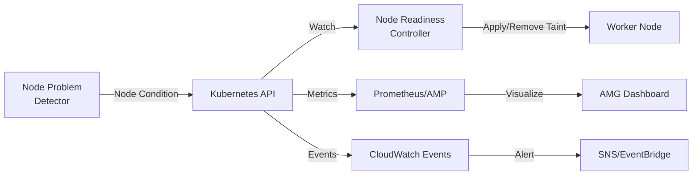
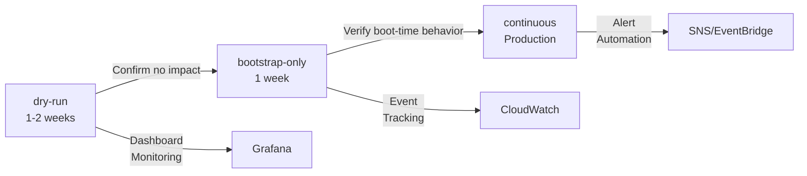
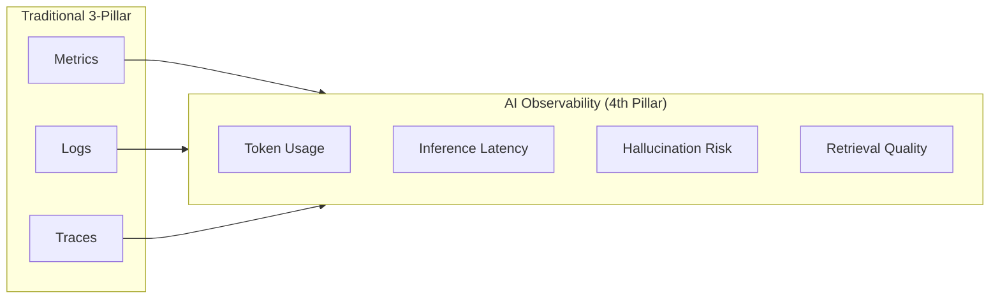
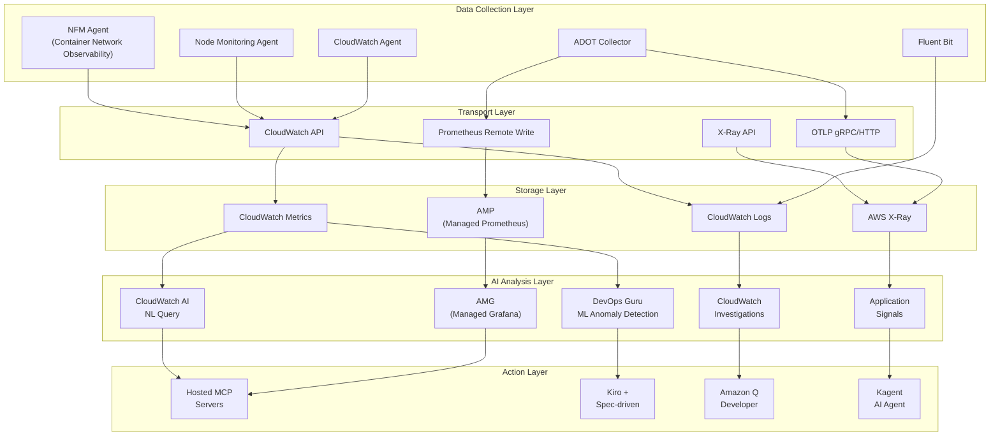
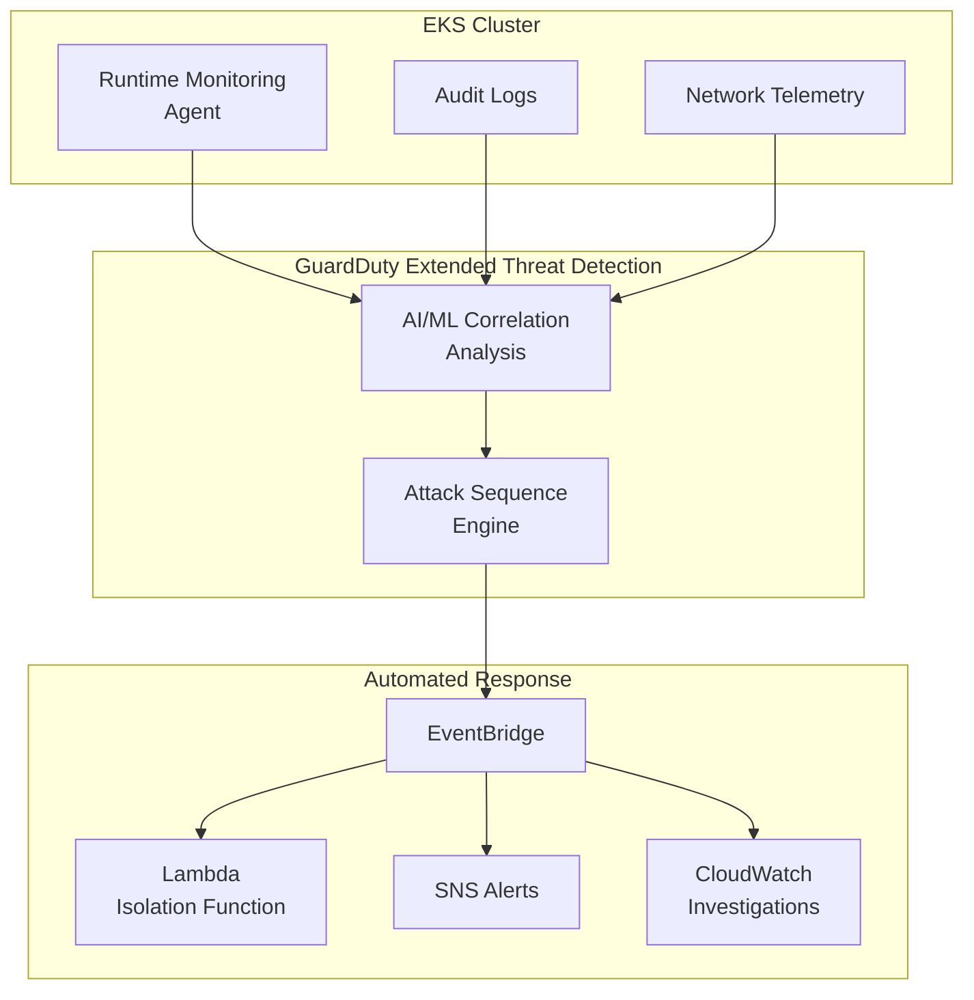
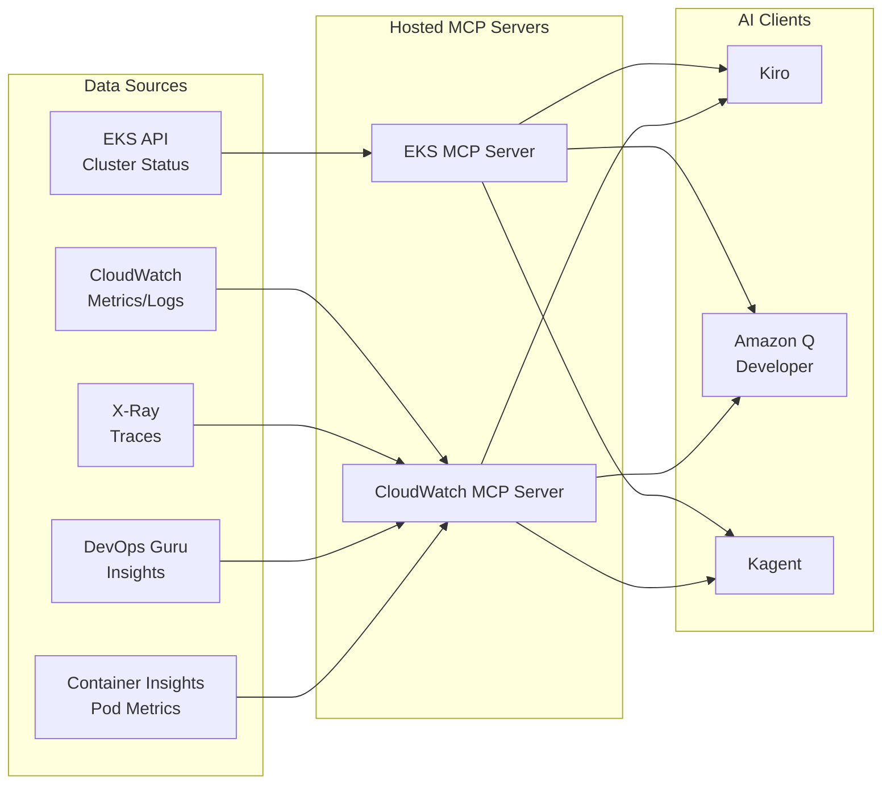
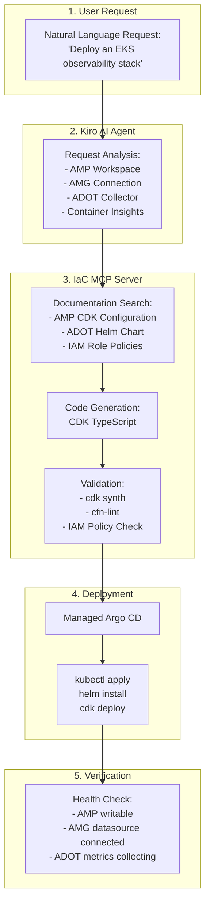

import { ArchitectureLayers, ManagedAddons, ServiceComparison, ObservabilityPillars, StackSelectionPatterns, DataFlowSummary, ProcessorSettings, ContainerInsightsMetrics, ApplicationSignalsLanguages, DevOpsGuruCost, EKSMCPTools, ErrorBudget, AlertOptimization } from '@site/src/components/ObservabilityStackTables';

# Building an EKS Intelligent Observability Stack

> **Written**: 2026-02-12 | **Updated**: 2026-02-14 | **Reading time**: ~45 min

---

## 1. Overview

In modern distributed systems, **Observability** goes beyond simple monitoring — it refers to the ability to understand a system's internal state through its external outputs. In EKS environments, the combination of hundreds of Pods, complex service meshes, and dynamic scaling makes it difficult to identify the root cause of problems with traditional monitoring alone.

### 1.1 3-Pillar Observability + AI Analysis Layer

Combining the three pillars of observability with an AI analysis layer enables truly intelligent operations.

<ObservabilityPillars />

:::info Scope of This Document
This document covers the entire process of building an intelligent observability stack in an EKS environment, from Managed Add-on based observability foundations to the AI analysis layer. It focuses on strategies where AWS operates open-source observability tools as managed services to **eliminate complexity** while **maximizing K8s-native observability**. While this document is based on the AWS native stack, the same architecture can be applied with 3rd-party backends by using ADOT (OpenTelemetry) as the collection layer.
:::

### 1.3 Observability Stack Selection Patterns

In real-world EKS operational environments, three major observability stack patterns are used depending on organizational requirements and existing investments:

<StackSelectionPatterns />

:::tip The Key to the Collection Layer: ADOT (OpenTelemetry)

Regardless of which backend you choose, **using ADOT (OpenTelemetry) for the collection layer gives you the freedom to switch backends.** Since OpenTelemetry is a CNCF standard, it can export data to most backends including Prometheus, Jaeger, Datadog, Sumo Logic, and more. This is why AWS provides OpenTelemetry as a Managed Add-on (ADOT) instead of its own proprietary agent.
:::

This document explains configurations based on the **AWS Native** and **OSS-centric** patterns. If you use a 3rd-party backend, you can leverage the same collection pipeline by simply changing the ADOT Collector's exporter settings.

### 1.2 Why Observability Matters in EKS

Observability in EKS environments is essential for the following reasons:

- **Dynamic infrastructure**: Pods are constantly created/deleted, and nodes are dynamically provisioned by Karpenter
- **Microservice complexity**: Complex inter-service call chains make it difficult to identify single points of failure
- **Multi-layer issues**: Multiple layers including applications, container runtime, nodes, network, and AWS services
- **Cost optimization**: Right-sizing based on resource usage pattern analysis
- **Regulatory compliance**: Audit logs, access records, and other compliance requirements

---

## 2. Managed Add-ons Based Observability Foundation

EKS Managed Add-ons eliminate operational complexity by having AWS manage the installation, upgrades, and patches of observability agents. With a single `aws eks create-addon` command, you can establish a production-grade observability foundation.

<ManagedAddons />

### 2.1 ADOT (AWS Distro for OpenTelemetry) Add-on

ADOT is the AWS distribution of OpenTelemetry that collects metrics, logs, and traces with a single agent.

```bash
# Install ADOT Add-on
aws eks create-addon \
  --cluster-name my-cluster \
  --addon-name adot \
  --addon-version v0.40.0-eksbuild.1 \
  --service-account-role-arn arn:aws:iam::ACCOUNT_ID:role/adot-collector-role

# Verify installation
aws eks describe-addon \
  --cluster-name my-cluster \
  --addon-name adot \
  --query 'addon.status'
```

:::tip ADOT vs Self-managed OpenTelemetry Deployment
Using the ADOT Add-on automatically installs the OpenTelemetry Operator with built-in AWS service authentication (SigV4). This significantly reduces operational overhead compared to self-managed deployments, and EKS version compatibility is guaranteed by AWS.
:::

### 2.2 CloudWatch Observability Agent Add-on

The CloudWatch Observability Agent provides an integrated offering of Container Insights Enhanced, Application Signals, and CloudWatch Logs.

```bash
# CloudWatch Observability Agent Add-on
aws eks create-addon \
  --cluster-name my-cluster \
  --addon-name amazon-cloudwatch-observability \
  --service-account-role-arn arn:aws:iam::ACCOUNT_ID:role/cloudwatch-agent-role

# Verify configuration
kubectl get pods -n amazon-cloudwatch
```

### 2.3 Node Monitoring Agent Add-on (2025)

The Node Monitoring Agent detects hardware and OS-level issues on EC2 nodes.

```bash
# Node Monitoring Agent Add-on
aws eks create-addon \
  --cluster-name my-cluster \
  --addon-name eks-node-monitoring-agent
```

Key detection items:

- **NVMe disk errors**: Proactive detection of EBS volume performance degradation
- **Memory hardware errors**: EDAC (Error Detection and Correction) events
- **Kernel soft lockups**: CPU held abnormally long
- **OOM (Out of Memory)**: Process termination due to memory exhaustion

#### 2.3.1 Integration of Node Readiness Controller with Observability

**Node Readiness Controller (NRC)** is a controller introduced as Beta in Kubernetes 1.32 that automatically manages node taints based on node issues reported by Node Problem Detector (NPD). This is a core component of the **Closed-Loop Observability** pattern that connects observability data to automatic remediation.

**Role in the Observability Pipeline:**



1. **Collection**: Node Monitoring Agent Add-on detects hardware/OS issues
2. **Reporting**: NPD reports status to the K8s API as Node Conditions
3. **Detection**: NRC monitors Node Condition changes
4. **Action**: NRC automatically applies/removes the `node.kubernetes.io/unschedulable` taint
5. **Observation**: CloudWatch Container Insights and AMP track taint change events
6. **Alerting**: SNS/EventBridge notifies the operations team of node state changes

**CloudWatch Container Insights Integration:**

```bash
# Query NRC-related node taint change events with CloudWatch Logs Insights
aws logs start-query \
  --log-group-name /aws/containerinsights/my-cluster/application \
  --start-time $(date -u -d '1 hour ago' +%s) \
  --end-time $(date -u +%s) \
  --query-string '
fields @timestamp, kubernetes.node_name, message
| filter message like /NoSchedule/
| filter message like /node.kubernetes.io\/unschedulable/
| sort @timestamp desc
'

# Example output:
# 2026-02-12 10:23:45 | node-abc123 | Taint added: node.kubernetes.io/unschedulable:NoSchedule (DiskPressure)
# 2026-02-12 10:28:12 | node-abc123 | Taint removed: node.kubernetes.io/unschedulable (DiskPressure resolved)
```

**Prometheus Metrics Collection:**

NRC operates as part of the kube-controller-manager and exposes the following metrics:

```yaml
# Collect NRC metrics with ServiceMonitor
apiVersion: monitoring.coreos.com/v1
kind: ServiceMonitor
metadata:
  name: node-readiness-controller
  namespace: kube-system
spec:
  selector:
    matchLabels:
      component: kube-controller-manager
  endpoints:
  - port: metrics
    path: /metrics
    interval: 30s

# Key metrics:
# - node_readiness_controller_reconcile_total: Number of NRC reconciliation executions
# - node_readiness_controller_reconcile_duration_seconds: Reconciliation processing time
# - node_readiness_controller_taint_changes_total: Number of taint applies/removals
```

**AMG (Amazon Managed Grafana) Dashboard Visualization:**

```json
{
  "dashboard": {
    "title": "Node Readiness & Health",
    "panels": [
      {
        "title": "Nodes with Unschedulable Taints",
        "targets": [{
          "expr": "count(kube_node_spec_taint{key='node.kubernetes.io/unschedulable'})"
        }]
      },
      {
        "title": "NRC Reconciliation Rate",
        "targets": [{
          "expr": "rate(node_readiness_controller_reconcile_total[5m])"
        }]
      },
      {
        "title": "Node Condition Changes (24h)",
        "targets": [{
          "expr": "increase(node_readiness_controller_taint_changes_total[24h])"
        }]
      }
    ]
  }
}
```

**EventBridge-based Alert Automation:**

```yaml
# EventBridge Rule: SNS alert on NRC taint changes
apiVersion: v1
kind: ConfigMap
metadata:
  name: eventbridge-rule
data:
  rule.json: |
    {
      "source": ["aws.eks"],
      "detail-type": ["EKS Node Taint Change"],
      "detail": {
        "taintKey": ["node.kubernetes.io/unschedulable"],
        "action": ["added", "removed"]
      }
    }
---
# Send alerts to SNS topic
# Alert example:
# [ALERT] Node ip-10-0-1-45.ap-northeast-2.compute.internal
# Taint added: node.kubernetes.io/unschedulable:NoSchedule
# Reason: DiskPressure detected by Node Monitoring Agent
# Action: Pods will not be scheduled until condition resolves
```

**Utilizing Dry-run Mode (Pre-production Validation):**

NRC supports three modes:

| Mode | Description | When to Use |
|------|-------------|------------|
| `dry-run` | Simulates taint changes only (no actual application) | Assess impact scope before production deployment |
| `bootstrap-only` | Applies taints only during cluster boot | Use only during initial node preparation phase |
| `continuous` | Continuously monitors node state and manages taints | Production environment (recommended) |

```bash
# Enable NRC in dry-run mode (impact scope simulation)
kubectl patch deployment kube-controller-manager \
  -n kube-system \
  --type='json' \
  -p='[{
    "op": "add",
    "path": "/spec/template/spec/containers/0/command/-",
    "value": "--feature-gates=NodeReadinessController=true"
  },{
    "op": "add",
    "path": "/spec/template/spec/containers/0/command/-",
    "value": "--node-readiness-controller-mode=dry-run"
  }]'

# Analyze dry-run results with CloudWatch Logs Insights
aws logs start-query \
  --log-group-name /aws/containerinsights/my-cluster/application \
  --start-time $(date -u -d '1 hour ago' +%s) \
  --end-time $(date -u +%s) \
  --query-string '
fields @timestamp, message
| filter message like /dry-run/
| filter message like /would add taint/
| stats count() by kubernetes.node_name
'

# Output: Confirm the number of taints to be applied per node
# -> Decide to switch to continuous mode after assessing impact scope
```

**Gradual Rollout Strategy:**



1. **Dry-run phase**: Monitor simulation results in observability dashboards
2. **Bootstrap-only phase**: Apply taints only during node boot to assess initial impact
3. **Continuous phase**: Fully activate in production environment with continuous monitoring

:::tip Best Practice for Observability to Auto-Remediation
NRC is an excellent example of the **Closed-Loop Observability** pattern that performs automatic actions based on observability data. When the Node Monitoring Agent detects a problem, NRC automatically isolates the node to maintain workload stability. This is a core component of **Self-Healing Infrastructure** where the system recovers on its own without human intervention.
:::

:::info Reference
- [Kubernetes Blog: Introducing Node Readiness Controller](https://kubernetes.io/blog/2026/02/03/introducing-node-readiness-controller/)
:::

### 2.4 Container Network Observability (2025.11)

**Container Network Observability**, announced at re:Invent in November 2025, provides network visibility with K8s context in EKS environments. While traditional VPC Flow Logs only showed IP-level traffic, Container Network Observability provides **Pod-to-Pod, Pod-to-Service, Pod-to-external service** level network flows along with K8s metadata (namespace, service name, Pod labels).

```bash
# Install Network Flow Monitoring Agent Add-on
aws eks create-addon \
  --cluster-name my-cluster \
  --addon-name aws-network-flow-monitoring-agent

# Enable Container Network Observability in VPC CNI
aws eks update-addon \
  --cluster-name my-cluster \
  --addon-name vpc-cni \
  --configuration-values '{"enableNetworkPolicy":"true"}'
```

Key features:

- **Pod-level network metrics**: Track TCP retransmissions, packet drops, and connection latency at the Pod/Service level
- **Cross-AZ traffic visibility**: Measure cross-AZ data transfer volumes per service to identify unnecessary Cross-AZ costs
- **K8s context network map**: Automatically map namespace, service name, and Pod labels to network flows
- **AWS service communication tracking**: Analyze traffic patterns from Pods to AWS services like S3, RDS, DynamoDB
- **Preferred observability stack integration**: Send metrics to any backend including AMP/Grafana, CloudWatch, Datadog

:::tip Enhanced Network Security Policies (2025.12)
Along with Container Network Observability, EKS also introduced **Enhanced Network Security Policies**. These allow centralized application of network access filters across the entire cluster and fine-grained control of external traffic with DNS-based egress policies. They operate on top of VPC CNI's Network Policy capabilities.
:::

:::info Key Message
With just 5 observability Managed Add-ons, you establish the observability foundation across **all layers: infrastructure (Node Monitoring), network (NFM Agent -> Container Network Observability), and application (ADOT, CloudWatch Agent)**. All are deployed with a single `aws eks create-addon` command, and version management and security patches are handled by AWS.
:::

### 2.6 CloudWatch Generative AI Observability

**CloudWatch Generative AI Observability**, which started as Preview in July 2025 and reached GA in October, provides a new observability dimension for AI/ML workloads. It adds **AI workload-specific observability** to the existing 3-Pillar observability (Metrics, Logs, Traces), ushering in the era of 4-Pillar observability.

#### 2.6.1 Core Features

**LLM and AI Agent Monitoring:**
- Monitor LLMs and AI Agents running on all infrastructure including Amazon Bedrock, EKS, ECS, and on-premises
- Token consumption tracking (input/output token counts, cost per token)
- Inference latency analysis (request-response time, P50/P90/P99 latency)
- End-to-end tracing for full AI stack visibility

**AI Workflow-Specific Observability:**
- **Hallucination risk path detection**: Identify paths where the model is likely to generate incorrect information
- **Retrieval miss identification**: Track search failures in RAG (Retrieval-Augmented Generation) systems
- **Rate-limit retry monitoring**: Analyze retry patterns due to API limits
- **Model-switch decision tracking**: Monitor logic for switching between multiple models

**Amazon Bedrock AgentCore Integration:**
- Provides ready-to-use views for Agent workflows, Knowledge Base, and Tool usage
- Cross-tool prompt flow visibility
- External framework support (LangChain, LangGraph, CrewAI)

#### 2.6.2 4-Pillar Observability Architecture



:::info Differentiators of AI Observability
Traditional 3-Pillar observability observes a system's **behavior**, while AI observability observes the model's **decision-making** and **quality**. For example, API latency (traditional) and inference quality (AI-specific) are different observation targets.
:::

#### 2.6.3 Activation Method

```bash
# Enable CloudWatch Generative AI Observability (EKS workloads)
# Add AI Observability Exporter to ADOT Collector
kubectl apply -f - <<EOF
apiVersion: opentelemetry.io/v1beta1
kind: OpenTelemetryCollector
metadata:
  name: adot-ai-observability
  namespace: observability
spec:
  mode: deployment
  config:
    receivers:
      otlp:
        protocols:
          grpc:
            endpoint: "0.0.0.0:4317"

    processors:
      batch:
        timeout: 10s

    exporters:
      awsxray:
        region: ap-northeast-2
        indexed_attributes:
          - "gen_ai.system"
          - "gen_ai.request.model"
          - "gen_ai.usage.input_tokens"
          - "gen_ai.usage.output_tokens"

      awscloudwatch:
        region: ap-northeast-2
        namespace: "GenAI/Observability"
        metric_declarations:
          - dimensions:
              - ["service.name", "gen_ai.request.model"]
            metric_name_selectors:
              - "gen_ai.usage.input_tokens"
              - "gen_ai.usage.output_tokens"
              - "gen_ai.request.duration"

    service:
      pipelines:
        traces:
          receivers: [otlp]
          processors: [batch]
          exporters: [awsxray]
        metrics:
          receivers: [otlp]
          processors: [batch]
          exporters: [awscloudwatch]
EOF
```

#### 2.6.4 MCP Integration and Automation

CloudWatch Generative AI Observability integrates with the **Bedrock Data Automation MCP server** to allow direct querying of AI observability data from AI clients like Kiro and Amazon Q Developer.

```
[Scenario: LLM Inference Latency Increase]

Kiro + MCP Auto Analysis:
1. CloudWatch MCP: query_ai_metrics("inference_latency") -> P99 500ms -> 2.3s increase
2. CloudWatch MCP: get_ai_traces(service="recommendation-llm") -> Token count spike confirmed
3. CloudWatch MCP: check_hallucination_risk() -> High risk for certain prompt patterns
4. Bedrock MCP: get_model_config() -> Excessive max_tokens model parameter setting

-> Kiro automatically:
   - Creates PR to optimize max_tokens limit
   - Suggests prompt engineering improvements
   - Adds alternative model (smaller model) usage logic
```

:::tip GitHub Action Integration
CloudWatch Generative AI Observability provides a GitHub Action to automatically add AI observability data to PRs. It automatically displays token consumption, latency changes, and hallucination risk changes on model change PRs to assess impact before deployment.
:::

#### 2.6.5 Real-World Use Cases

**Case 1: RAG System Search Quality Monitoring**
```
[Problem Discovery]
Retrieval miss rate: 15% -> 35% spike (within 2 hours)

[CloudWatch AI Observability Analysis]
- Knowledge Base index not updated for 7 days
- Pattern detected: queries for latest documents failing
- Embedding model version mismatch confirmed

[Auto Remediation]
-> Knowledge Base re-indexing triggered
-> Embedding model synchronized
-> Retrieval miss rate restored to 15%
```

**Case 2: Token Cost Optimization**
```
[Cost Anomaly Detection]
Daily token consumption: $500 -> $2,300 (460% increase)

[Root Cause Analysis]
- Specific prompt template outputting an average of 5,000 tokens (normal: 500)
- Repetitive prompt chains maintaining unnecessarily long context

[Optimization Result]
-> Prompt template refactored
-> Dynamic context window adjustment
-> Cost reduced to $600/day (74% savings)
```
:::

---

---

## 3. Overall Architecture

The EKS intelligent observability stack consists of 5 layers.

<ArchitectureLayers />



### 3.1 Data Flow Summary

<DataFlowSummary />

---

## 4. ADOT Collector Deployment

### 4.1 OpenTelemetryCollector CRD

Installing the ADOT Add-on also deploys the OpenTelemetry Operator, allowing declarative management of collectors through the `OpenTelemetryCollector` CRD.

```yaml
apiVersion: opentelemetry.io/v1beta1
kind: OpenTelemetryCollector
metadata:
  name: adot-collector
  namespace: observability
spec:
  mode: deployment
  replicas: 2
  resources:
    limits:
      cpu: "1"
      memory: 2Gi
    requests:
      cpu: 200m
      memory: 512Mi
  config:
    receivers:
      otlp:
        protocols:
          grpc:
            endpoint: "0.0.0.0:4317"
          http:
            endpoint: "0.0.0.0:4318"
      prometheus:
        config:
          scrape_configs:
            - job_name: 'kubernetes-pods'
              kubernetes_sd_configs:
                - role: pod
              relabel_configs:
                - source_labels: [__meta_kubernetes_pod_annotation_prometheus_io_scrape]
                  action: keep
                  regex: true
    processors:
      batch:
        timeout: 10s
        send_batch_size: 1024
      memory_limiter:
        check_interval: 1s
        limit_mib: 512
        spike_limit_mib: 128
      resource:
        attributes:
          - key: cluster.name
            value: "my-eks-cluster"
            action: upsert
          - key: aws.region
            value: "ap-northeast-2"
            action: upsert
      filter:
        metrics:
          exclude:
            match_type: regexp
            metric_names:
              - "go_.*"
              - "process_.*"
    exporters:
      prometheusremotewrite:
        endpoint: "https://aps-workspaces.ap-northeast-2.amazonaws.com/workspaces/ws-xxxxx/api/v1/remote_write"
        auth:
          authenticator: sigv4auth
        resource_to_telemetry_conversion:
          enabled: true
      awsxray:
        region: ap-northeast-2
        indexed_attributes:
          - "otel.resource.service.name"
          - "otel.resource.deployment.environment"
      awscloudwatchlogs:
        region: ap-northeast-2
        log_group_name: "/eks/my-cluster/application"
        log_stream_name: "otel-logs"
    extensions:
      sigv4auth:
        region: ap-northeast-2
        service: aps
      health_check:
        endpoint: "0.0.0.0:13133"
    service:
      extensions: [sigv4auth, health_check]
      pipelines:
        metrics:
          receivers: [otlp, prometheus]
          processors: [memory_limiter, filter, batch, resource]
          exporters: [prometheusremotewrite]
        traces:
          receivers: [otlp]
          processors: [memory_limiter, batch, resource]
          exporters: [awsxray]
        logs:
          receivers: [otlp]
          processors: [memory_limiter, batch, resource]
          exporters: [awscloudwatchlogs]
```

### 4.2 DaemonSet Mode Deployment

Use DaemonSet mode when per-node metric collection is needed.

```yaml
apiVersion: opentelemetry.io/v1beta1
kind: OpenTelemetryCollector
metadata:
  name: adot-node-collector
  namespace: observability
spec:
  mode: daemonset
  hostNetwork: true
  volumes:
    - name: hostfs
      hostPath:
        path: /
  volumeMounts:
    - name: hostfs
      mountPath: /hostfs
      readOnly: true
  env:
    - name: K8S_NODE_NAME
      valueFrom:
        fieldRef:
          fieldPath: spec.nodeName
  config:
    receivers:
      hostmetrics:
        root_path: /hostfs
        collection_interval: 30s
        scrapers:
          cpu: {}
          disk: {}
          filesystem: {}
          load: {}
          memory: {}
          network: {}
      kubeletstats:
        collection_interval: 30s
        auth_type: serviceAccount
        endpoint: "https://${env:K8S_NODE_NAME}:10250"
        insecure_skip_verify: true
    processors:
      batch:
        timeout: 30s
      resourcedetection:
        detectors: [env, eks]
    exporters:
      prometheusremotewrite:
        endpoint: "https://aps-workspaces.ap-northeast-2.amazonaws.com/workspaces/ws-xxxxx/api/v1/remote_write"
        auth:
          authenticator: sigv4auth
    extensions:
      sigv4auth:
        region: ap-northeast-2
        service: aps
    service:
      extensions: [sigv4auth]
      pipelines:
        metrics:
          receivers: [hostmetrics, kubeletstats]
          processors: [resourcedetection, batch]
          exporters: [prometheusremotewrite]
```

:::tip Deployment vs DaemonSet Selection Criteria

- **Deployment mode**: Application metrics/traces collection (OTLP reception), centralized processing
- **DaemonSet mode**: Node-level metrics collection (hostmetrics, kubeletstats), network efficient
- **Sidecar mode**: Collect logs/traces for specific Pods only, when isolation is needed
:::

### 4.3 Pipeline Configuration Principles

The ADOT Collector pipeline processes data in the order `receivers -> processors -> exporters`.

```
+---------------+    +----------------+    +---------------+
|  Receivers    |--->|  Processors    |--->|  Exporters    |
|               |    |                |    |               |
| - otlp        |    | - memory_      |    | - prometheus  |
| - prometheus  |    |   limiter      |    |   remotewrite |
| - hostmetrics |    | - batch        |    | - awsxray     |
| - kubelet     |    | - filter       |    | - cwlogs      |
|   stats       |    | - resource     |    |               |
+---------------+    +----------------+    +---------------+
```

**Key Processor Settings**:

<ProcessorSettings />

---

## 5. AMP + AMG Integration

### 5.1 AMP (Amazon Managed Prometheus)

AMP is a Prometheus-compatible managed service that stores and queries metrics at scale without infrastructure management.

```bash
# Create AMP workspace
aws amp create-workspace \
  --alias my-eks-observability \
  --tags Environment=production

# Check workspace ID
aws amp list-workspaces \
  --query 'workspaces[?alias==`my-eks-observability`].workspaceId' \
  --output text
```

### 5.2 Remote Write Configuration

Remote write configuration for sending metrics from ADOT to AMP.

```yaml
# Prometheus remote_write configuration
remoteWrite:
  - url: "https://aps-workspaces.ap-northeast-2.amazonaws.com/workspaces/ws-xxxxx/api/v1/remote_write"
    sigv4:
      region: ap-northeast-2
    queue_config:
      max_samples_per_send: 1000
      max_shards: 200
      capacity: 2500
    write_relabel_configs:
      - source_labels: [__name__]
        regex: "go_.*|process_.*"
        action: drop
```

:::warning Remote Write Cost Optimization
AMP charges based on the number of ingested metric samples. You can reduce costs by 30-50% by dropping unnecessary metrics (go_*, process_*) via `write_relabel_configs`. Additionally, increasing the `scrape_interval` from 15s to 30s halves the number of samples.
:::

### 5.3 AMG (Amazon Managed Grafana) Data Source Connection

Add AMP as a data source in AMG.

```bash
# Create AMG workspace
aws grafana create-workspace \
  --workspace-name my-eks-grafana \
  --account-access-type CURRENT_ACCOUNT \
  --authentication-providers AWS_SSO \
  --permission-type SERVICE_MANAGED \
  --workspace-data-sources PROMETHEUS CLOUDWATCH XRAY

# Auto-configure data source (AMP connection)
aws grafana create-workspace-service-account \
  --workspace-id g-xxxxxxxxxx \
  --grafana-role ADMIN \
  --name amp-datasource
```

After adding the AMP data source in AMG, here are the essential PromQL queries you can use.

### 5.4 Essential PromQL Queries

```promql
# Top 10 Pod CPU usage
topk(10,
  sum(rate(container_cpu_usage_seconds_total{namespace!="kube-system"}[5m])) by (pod)
)

# Memory usage per node
100 * (1 - (
  node_memory_MemAvailable_bytes / node_memory_MemTotal_bytes
))

# HTTP request error rate (5xx)
sum(rate(http_requests_total{status=~"5.."}[5m]))
/ sum(rate(http_requests_total[5m])) * 100

# P99 latency
histogram_quantile(0.99,
  sum(rate(http_request_duration_seconds_bucket[5m])) by (le, service)
)

# Pod restart count (last 1 hour)
increase(kube_pod_container_status_restarts_total[1h])

# Karpenter node provisioning wait time
histogram_quantile(0.95,
  sum(rate(karpenter_provisioner_scheduling_duration_seconds_bucket[10m])) by (le)
)
```

:::info Core Value of AMP + AMG
AWS handles all infrastructure management for Prometheus and Grafana (scaling, patching, high availability, backups). Teams can focus solely on **dashboard configuration and query writing**, allowing them to concentrate on the essential value of observability. This is the core of AWS's strategy of "maintaining the benefits of open source while eliminating complexity."
:::

### 5.5 Grafana Alloy: Next-Generation Collector Pattern

**Grafana Alloy** is the successor to Grafana Agent, officially announced in April 2024. It supports both OpenTelemetry and Prometheus collection and enables more flexible pipeline configuration based on **Flow mode**.

#### 5.5.1 Grafana Alloy vs ADOT Comparison

| Feature | ADOT (AWS Perspective) | Grafana Alloy | Recommended Scenario |
|---------|----------------------|---------------|---------------------|
| **Management** | EKS Managed Add-on | Self-deployed (Helm) | ADOT: When AWS integration is priority |
| **Backend Focus** | AWS services (AMP, CloudWatch, X-Ray) | Grafana Cloud, Prometheus, Loki | Alloy: When centered on Grafana ecosystem |
| **OpenTelemetry Support** | Native (OTEL Collector based) | Native (OTEL Receiver built-in) | Equal |
| **Prometheus Collection** | (prometheus receiver) | (prometheus.scrape) | Alloy is lighter and faster |
| **Log Collection** | CloudWatch Logs, S3 | Loki, CloudWatch Logs | Alloy: Loki optimized |
| **Tracing** | X-Ray, OTLP | Tempo, Jaeger, OTLP | Alloy: Tempo optimized |
| **Configuration** | YAML (OTEL Collector standard) | River language (declarative + dynamic) | Alloy is more intuitive |
| **AWS IAM Integration** | SigV4 built-in | Manual setup required | ADOT is much simpler |
| **Resource Usage** | Medium (Go-based) | Low (optimized Go) | Alloy uses ~30% less |

:::tip ADOT vs Grafana Alloy Selection Guide

**Choose ADOT when:**
- You want the convenience of AWS Managed Add-on
- You primarily use AMP + CloudWatch + X-Ray as backends
- You want automatic AWS IAM authentication handling
- You want AWS-guaranteed EKS version compatibility

**Choose Grafana Alloy when:**
- You use Grafana Cloud or a self-hosted Grafana stack
- You're building a complete open-source stack with Loki + Tempo + Mimir
- Lighter resource usage is important (cost-sensitive)
- You need dynamic configuration features of River language
:::

#### 5.5.2 Deploying Grafana Alloy on EKS

```bash
# Add Helm repository
helm repo add grafana https://grafana.github.io/helm-charts
helm repo update

# Install Grafana Alloy
helm install grafana-alloy grafana/alloy \
  --namespace observability \
  --create-namespace \
  --set alloy.configMap.content='
logging {
  level = "info"
  format = "logfmt"
}

// Prometheus metrics collection
prometheus.scrape "kubernetes_pods" {
  targets = discovery.kubernetes.pods.targets
  forward_to = [prometheus.remote_write.amp.receiver]

  clustering {
    enabled = true
  }
}

// Kubernetes Pod auto-discovery
discovery.kubernetes "pods" {
  role = "pod"

  selectors {
    role  = "pod"
    field = "spec.nodeName=" + env("HOSTNAME")
  }
}

// Send metrics to AMP (SigV4 authentication)
prometheus.remote_write "amp" {
  endpoint {
    url = "https://aps-workspaces.ap-northeast-2.amazonaws.com/workspaces/ws-xxxxx/api/v1/remote_write"

    sigv4 {
      region = "ap-northeast-2"
    }
  }
}

// Send logs to Loki
loki.source.kubernetes "pods" {
  targets    = discovery.kubernetes.pods.targets
  forward_to = [loki.write.default.receiver]
}

loki.write "default" {
  endpoint {
    url = "https://logs-prod-012.grafana.net/loki/api/v1/push"

    basic_auth {
      username = env("LOKI_USERNAME")
      password = env("LOKI_PASSWORD")
    }
  }
}

// Receive OpenTelemetry traces
otelcol.receiver.otlp "default" {
  grpc {
    endpoint = "0.0.0.0:4317"
  }

  http {
    endpoint = "0.0.0.0:4318"
  }

  output {
    traces  = [otelcol.exporter.otlp.tempo.input]
  }
}

otelcol.exporter.otlp "tempo" {
  client {
    endpoint = "tempo.grafana.net:443"

    auth {
      authenticator = otelcol.auth.basic.tempo.handler
    }
  }
}

otelcol.auth.basic "tempo" {
  username = env("TEMPO_USERNAME")
  password = env("TEMPO_PASSWORD")
}
'
```

#### 5.5.3 AMP + Alloy Combination vs AMP + ADOT Combination

**Scenario 1: AMP + Grafana Alloy**

```
Pros:
- 30% reduction in resource usage (CPU/Memory)
- Excellent Prometheus collection performance (100K samples/second)
- Dynamic configuration with River language (config changes without redeployment)

Cons:
- Manual AWS IAM authentication setup required (SigV4 credential management)
- No EKS Managed Add-on support (manual upgrades)
- Complex CloudWatch Logs integration (additional setup required)
```

**Scenario 2: AMP + ADOT**

```
Pros:
- Fully automated management as EKS Managed Add-on
- AWS IAM integration (automatic SigV4, IRSA support)
- Native CloudWatch + X-Ray integration
- AWS support and compatibility guarantee

Cons:
- Slightly higher resource usage than Alloy
- YAML-centric configuration (not as flexible as River)
```

:::info Practical Recommendation
**Hybrid approach**: It's also possible to collect metrics with Grafana Alloy and send them to AMP, while collecting traces and logs with ADOT and sending them to X-Ray and CloudWatch. This is a strategy that leverages each tool's strengths.
:::

#### 5.5.4 Integration with Grafana Cloud

When using Grafana Cloud, Alloy can configure a complete observability stack with Loki + Tempo + Mimir.

```yaml
# Grafana Cloud integration example (alloy-config.river)
prometheus.remote_write "grafana_cloud" {
  endpoint {
    url = "https://prometheus-prod-01-eu-west-0.grafana.net/api/prom/push"

    basic_auth {
      username = env("GRAFANA_CLOUD_PROMETHEUS_USERNAME")
      password = env("GRAFANA_CLOUD_API_KEY")
    }
  }
}

loki.write "grafana_cloud" {
  endpoint {
    url = "https://logs-prod-eu-west-0.grafana.net/loki/api/v1/push"

    basic_auth {
      username = env("GRAFANA_CLOUD_LOKI_USERNAME")
      password = env("GRAFANA_CLOUD_API_KEY")
    }
  }
}

otelcol.exporter.otlp "grafana_cloud_traces" {
  client {
    endpoint = "tempo-prod-04-prod-eu-west-0.grafana.net:443"

    auth {
      authenticator = otelcol.auth.basic.grafana_cloud.handler
    }
  }
}
```

**Advantages of Grafana Cloud:**
- **Fully managed**: No infrastructure management for Loki, Tempo, Mimir
- **Unified view**: Explore metrics, logs, and traces in a single Grafana UI
- **Free tier**: 10K time series, 50GB logs, 50GB traces per month free
- **Global high availability**: Automatic replication across multiple regions

**Cost Comparison (monthly, small-to-medium EKS cluster):**

| Item | AMP + AMG | Grafana Cloud | Self-hosted Grafana |
|------|-----------|--------------|-------------------|
| Metrics (100K samples/sec) | $50-80 | $60-100 | $150-200 (EC2 cost) |
| Logs (50GB/month) | $25 (CloudWatch) | $30 (Loki) | $100 (EBS + instances) |
| Traces (10K spans/sec) | $15 (X-Ray) | $20 (Tempo) | $50 (EBS + instances) |
| Management overhead | Low | Very low | High |
| **Total estimated cost** | **$90-120** | **$110-150** | **$300-350** |

---

## 6. CloudWatch Cross-Account Observability

### 6.1 The Need for Multi-Account Observability

In large organizations, AWS accounts are separated for security, isolation, and cost management. However, when observability data is distributed across accounts, the following problems arise:

- **No unified view**: Metrics/logs from multiple accounts must be checked in separate consoles
- **Difficult correlation analysis**: Cross-account service call tracing is impossible
- **Alert management complexity**: Duplicate alert configuration management per account
- **Reduced operational efficiency**: Navigating between multiple accounts to identify root causes during incidents

AWS provides centralized observability through **CloudWatch Cross-Account Observability**.

### 6.2 Cross-Account Architecture

```
+-------------------------------------------------------------+
|                   Monitoring Account                         |
|  +--------------------------------------------------------+ |
|  |         CloudWatch (Centralized View)                   | |
|  |  - Unified metrics/logs/traces from all accounts        | |
|  |  - Unified dashboards and alerts                        | |
|  +--------------------------------------------------------+ |
|                          ^                                   |
|                    OAM Links                                 |
+---------------------------+----------------------------------+
                            |
        +-------------------+-------------------+
        |                   |                   |
+-------v------+  +---------v-----+  +---------v-----+
| Source Acct A |  | Source Acct B  |  | Source Acct C  |
| (EKS Dev)    |  | (EKS Staging) |  | (EKS Prod)    |
|              |  |               |  |               |
| ADOT         |  | ADOT          |  | ADOT          |
| Container    |  | Container     |  | Container     |
| Insights     |  | Insights      |  | Insights      |
+--------------+  +---------------+  +---------------+
```

### 6.3 OAM (Observability Access Manager) Configuration

#### 6.3.1 Create Sink in Monitoring Account

```bash
# Execute in Monitoring account
aws oam create-sink \
  --name central-observability-sink \
  --tags Key=Environment,Value=production

# Check Sink ARN (used in Source accounts)
SINK_ARN=$(aws oam list-sinks \
  --query 'Items[0].Arn' \
  --output text)

echo $SINK_ARN
# arn:aws:oam:ap-northeast-2:MONITORING_ACCOUNT_ID:sink/sink-id
```

#### 6.3.2 Sink Policy Configuration (Access Authorization)

```json
{
  "Version": "2012-10-17",
  "Statement": [
    {
      "Effect": "Allow",
      "Principal": {
        "AWS": [
          "arn:aws:iam::SOURCE_ACCOUNT_A:root",
          "arn:aws:iam::SOURCE_ACCOUNT_B:root",
          "arn:aws:iam::SOURCE_ACCOUNT_C:root"
        ]
      },
      "Action": [
        "oam:CreateLink",
        "oam:UpdateLink"
      ],
      "Resource": "arn:aws:oam:ap-northeast-2:MONITORING_ACCOUNT_ID:sink/*",
      "Condition": {
        "ForAllValues:StringEquals": {
          "oam:ResourceTypes": [
            "AWS::CloudWatch::Metric",
            "AWS::Logs::LogGroup",
            "AWS::XRay::Trace"
          ]
        }
      }
    }
  ]
}
```

```bash
# Apply Sink Policy
aws oam put-sink-policy \
  --sink-identifier $SINK_ARN \
  --policy file://sink-policy.json
```

#### 6.3.3 Create Link in Source Accounts

```bash
# Execute in each Source account A, B, C
aws oam create-link \
  --label-template '$AccountName-$Region' \
  --resource-types "AWS::CloudWatch::Metric" \
                   "AWS::Logs::LogGroup" \
                   "AWS::XRay::Trace" \
  --sink-identifier arn:aws:oam:ap-northeast-2:MONITORING_ACCOUNT_ID:sink/sink-id \
  --tags Key=Account,Value=dev

# Check Link status
aws oam list-links \
  --query 'Items[*].[Label,ResourceTypes,SinkArn]' \
  --output table
```

:::info How OAM Links Work
OAM Links **stream** observability data from Source accounts to the Monitoring account. Data is retained in the Source accounts as well, while the Monitoring account provides a unified view. This is a **logical connection**, not data replication.
:::

### 6.4 Unified Dashboard Configuration

Configure all accounts' data into a single dashboard from CloudWatch in the Monitoring account.

```json
{
  "widgets": [
    {
      "type": "metric",
      "properties": {
        "metrics": [
          [ { "accountId": "SOURCE_ACCOUNT_A", "expression": "SELECT AVG(pod_cpu_utilization) FROM SCHEMA(\"ContainerInsights\", ClusterName,Namespace,PodName) WHERE ClusterName = 'dev-cluster'" } ],
          [ { "accountId": "SOURCE_ACCOUNT_B", "expression": "SELECT AVG(pod_cpu_utilization) FROM SCHEMA(\"ContainerInsights\", ClusterName,Namespace,PodName) WHERE ClusterName = 'staging-cluster'" } ],
          [ { "accountId": "SOURCE_ACCOUNT_C", "expression": "SELECT AVG(pod_cpu_utilization) FROM SCHEMA(\"ContainerInsights\", ClusterName,Namespace,PodName) WHERE ClusterName = 'prod-cluster'" } ]
        ],
        "view": "timeSeries",
        "region": "ap-northeast-2",
        "title": "Pod CPU Usage Across All Environments",
        "period": 300
      }
    }
  ]
}
```

### 6.5 Cross-Account X-Ray Tracing

Cross-Account X-Ray configuration is needed to trace inter-service calls in multi-account environments.

```yaml
# Source account ADOT Collector settings
exporters:
  awsxray:
    region: ap-northeast-2
    # Enable Cross-Account tracing
    role_arn: arn:aws:iam::MONITORING_ACCOUNT_ID:role/XRayCrossAccountRole
    indexed_attributes:
      - "aws.account_id"
      - "otel.resource.service.name"
```

**Monitoring Account IAM Role:**

```json
{
  "Version": "2012-10-17",
  "Statement": [
    {
      "Effect": "Allow",
      "Principal": {
        "AWS": "arn:aws:iam::SOURCE_ACCOUNT_A:root"
      },
      "Action": "sts:AssumeRole"
    }
  ]
}
```

### 6.6 Cost Considerations

Cross-Account Observability incurs additional costs for data transfer and storage.

| Cost Item | Description | Estimated Monthly Cost (per cluster) |
|-----------|-------------|-------------------------------------|
| **OAM Link** | Free (only data transfer costs apply) | $0 |
| **Cross-Region transfer** | When sending to Monitoring account in a different region | $0.01/GB (~$50-150) |
| **CloudWatch storage** | Metrics storage in central account | Same as existing costs |
| **X-Ray traces** | Cross-Account trace storage | $5.00/million traces recorded |

:::warning Cost Optimization Strategies
1. **Same-Region configuration**: Place the Monitoring account in the same region as Source accounts to eliminate data transfer costs
2. **Metric filtering**: Select only necessary resources when creating OAM Links (e.g., include X-Ray only for production)
3. **Sampling**: Adjust X-Ray sampling rate (default 1req/s -> 0.1req/s)
:::

### 6.7 Production Operation Patterns

**Pattern 1: Environment-Based Account Separation + Centralized Observability**

```
Dev Account (111111111111)
  +-- EKS Cluster: dev-cluster
       +-- OAM Link -> Monitoring Account

Staging Account (222222222222)
  +-- EKS Cluster: staging-cluster
       +-- OAM Link -> Monitoring Account

Prod Account (333333333333)
  +-- EKS Cluster: prod-cluster
       +-- OAM Link -> Monitoring Account

Monitoring Account (444444444444)
  +-- CloudWatch Unified Dashboard
  +-- Unified Alerts (SNS -> Slack)
  +-- X-Ray Service Map (All Environments)
```

**Pattern 2: Team-Based Account Separation + Shared Observability**

```
Team-A Account (Frontend)
Team-B Account (Backend)
Team-C Account (Data)
  +-- Each team's EKS + ADOT
       +-- OAM Link -> Shared Monitoring Account

Shared Monitoring Account
  +-- Per-team filtered dashboards
  +-- Per-team alert routing
```

---

## 7. CloudWatch Container Insights Enhanced

### 6.1 Enhanced Container Insights Features

On EKS 1.28+, Enhanced Container Insights provides deep observability including **Control Plane metrics**.

```bash
# Install CloudWatch Observability Operator (Helm)
helm install amazon-cloudwatch-observability \
  oci://public.ecr.aws/cloudwatch-agent/amazon-cloudwatch-observability \
  --namespace amazon-cloudwatch --create-namespace \
  --set clusterName=my-cluster \
  --set region=ap-northeast-2 \
  --set containerInsights.enhanced=true \
  --set containerInsights.acceleratedCompute=true
```

### 6.2 Collected Metrics Scope

Scope of metrics collected by Enhanced Container Insights:

<ContainerInsightsMetrics />

### 6.3 EKS Control Plane Metrics

Control Plane metrics automatically collected on EKS 1.28+ are essential for understanding cluster health.

```bash
# Verify Control Plane metrics activation
aws eks describe-cluster \
  --name my-cluster \
  --query 'cluster.logging.clusterLogging[?types[?contains(@, `api`)]]'
```

Key Control Plane metrics:

- **API Server**: `apiserver_request_total`, `apiserver_request_duration_seconds` -- API server load and latency
- **etcd**: `etcd_db_total_size_in_bytes`, `etcd_server_slow_apply_total` -- etcd health and performance
- **Scheduler**: `scheduler_schedule_attempts_total`, `scheduler_scheduling_duration_seconds` -- Scheduling efficiency
- **Controller Manager**: `workqueue_depth`, `workqueue_adds_total` -- Controller queue status

:::warning Cost Considerations
Enhanced Container Insights collects a large volume of metrics, which increases CloudWatch costs. Production clusters may incur an additional $50-200/month. It's recommended to use basic Container Insights for dev/staging environments and enable Enhanced only for production.
:::

### 6.4 Windows Workload Container Insights Support

On August 5, 2025, AWS announced CloudWatch Container Insights for EKS Windows Workloads Monitoring. This is an important development that provides a unified observability experience for EKS clusters running mixed Linux and Windows workloads.

#### 6.4.1 Mixed Cluster Observability Strategy

Many enterprises run legacy .NET Framework applications and new Linux-based microservices on the same EKS cluster. Container Insights' Windows support enables building a single observability platform for such mixed environments.

```yaml
# Deploy Container Insights Agent to Windows nodes
apiVersion: apps/v1
kind: DaemonSet
metadata:
  name: cloudwatch-agent-windows
  namespace: amazon-cloudwatch
spec:
  selector:
    matchLabels:
      name: cloudwatch-agent-windows
  template:
    metadata:
      labels:
        name: cloudwatch-agent-windows
    spec:
      nodeSelector:
        kubernetes.io/os: windows
      serviceAccountName: cloudwatch-agent
      containers:
        - name: cloudwatch-agent
          image: public.ecr.aws/cloudwatch-agent/cloudwatch-agent:latest-windows
          env:
            - name: HOST_IP
              valueFrom:
                fieldRef:
                  fieldPath: status.hostIP
            - name: HOST_NAME
              valueFrom:
                fieldRef:
                  fieldPath: spec.nodeName
            - name: K8S_NAMESPACE
              valueFrom:
                fieldRef:
                  fieldPath: metadata.namespace
          volumeMounts:
            - name: cwagentconfig
              mountPath: C:\ProgramData\Amazon\CloudWatch\cwagentconfig.json
              subPath: cwagentconfig.json
            - name: rootfs
              mountPath: C:\rootfs
              readOnly: true
      volumes:
        - name: cwagentconfig
          configMap:
            name: cwagent-config-windows
        - name: rootfs
          hostPath:
            path: C:\
            type: Directory
```

#### 6.4.2 Windows-Specific Metrics

Container Insights collects Windows-specific performance counters and system metrics on Windows nodes:

| Metric Category | Key Metrics | Description |
|----------------|-------------|-------------|
| **.NET CLR** | `dotnet_clr_memory_heap_size_bytes` | Managed heap size of .NET applications |
| | `dotnet_clr_gc_collections_total` | Garbage collection count (Gen 0/1/2) |
| | `dotnet_clr_exceptions_thrown_total` | Total number of exceptions thrown |
| **IIS** | `iis_current_connections` | Active HTTP connection count |
| | `iis_requests_total` | Total HTTP requests processed |
| | `iis_request_errors_total` | HTTP error response count (4xx, 5xx) |
| **Windows System** | `windows_cpu_processor_utility` | CPU usage (%) |
| | `windows_memory_available_bytes` | Available memory |
| | `windows_net_bytes_total` | Network bytes sent/received |
| **Container** | `container_memory_working_set_bytes` | Windows container memory working set |
| | `container_cpu_usage_seconds_total` | Container CPU usage time |

```yaml
# Windows-specific metrics collection configuration
apiVersion: v1
kind: ConfigMap
metadata:
  name: cwagent-config-windows
  namespace: amazon-cloudwatch
data:
  cwagentconfig.json: |
    {
      "metrics": {
        "namespace": "ContainerInsights",
        "metrics_collected": {
          "statsd": {
            "service_address": ":8125",
            "metrics_collection_interval": 60,
            "metrics_aggregation_interval": 60
          },
          "Performance Counters": {
            "metrics_collection_interval": 60,
            "counters": [
              {
                "counter_name": "\\Processor(_Total)\\% Processor Time",
                "metric_name": "windows_cpu_processor_utility"
              },
              {
                "counter_name": "\\Memory\\Available MBytes",
                "metric_name": "windows_memory_available_bytes"
              },
              {
                "counter_name": "\\.NET CLR Memory(_Global_)\\# Bytes in all Heaps",
                "metric_name": "dotnet_clr_memory_heap_size_bytes"
              },
              {
                "counter_name": "\\.NET CLR Exceptions(_Global_)\\# of Exceps Thrown / sec",
                "metric_name": "dotnet_clr_exceptions_thrown_total"
              },
              {
                "counter_name": "\\Web Service(_Total)\\Current Connections",
                "metric_name": "iis_current_connections"
              },
              {
                "counter_name": "\\Web Service(_Total)\\Total Method Requests",
                "metric_name": "iis_requests_total"
              }
            ]
          }
        }
      }
    }
```

#### 6.4.3 Mixed Cluster Dashboard Configuration

Recommended dashboard configuration for unified monitoring of Linux and Windows nodes from the CloudWatch console:

```json
{
  "widgets": [
    {
      "type": "metric",
      "properties": {
        "title": "Cluster CPU Usage (by OS)",
        "metrics": [
          [ "ContainerInsights", "node_cpu_utilization",
            { "stat": "Average", "label": "Linux Nodes" },
            { "dimensions": { "ClusterName": "my-cluster", "NodeOS": "linux" } }
          ],
          [ ".", "windows_cpu_processor_utility",
            { "stat": "Average", "label": "Windows Nodes" },
            { "dimensions": { "ClusterName": "my-cluster", "NodeOS": "windows" } }
          ]
        ],
        "period": 300,
        "region": "ap-northeast-2"
      }
    },
    {
      "type": "metric",
      "properties": {
        "title": ".NET Application Garbage Collection",
        "metrics": [
          [ "ContainerInsights", "dotnet_clr_gc_collections_total",
            { "dimensions": { "ClusterName": "my-cluster", "Generation": "0" } }
          ],
          [ "...", { "Generation": "1" } ],
          [ "...", { "Generation": "2" } ]
        ],
        "period": 60
      }
    },
    {
      "type": "log",
      "properties": {
        "title": "Windows Container Error Logs",
        "query": "SOURCE '/aws/containerinsights/my-cluster/application'\n| fields @timestamp, kubernetes.pod_name, log\n| filter kubernetes.host like /windows/\n| filter log like /ERROR|Exception/\n| sort @timestamp desc\n| limit 50",
        "region": "ap-northeast-2"
      }
    }
  ]
}
```

:::info Core Value of CloudWatch Container Insights Windows Support
CloudWatch Container Insights has officially supported Windows workloads since August 2025. The ability to monitor Linux and Windows nodes in the same dashboard greatly reduces mixed cluster operational complexity. Windows-specific metrics like .NET CLR and IIS performance counters are automatically collected, establishing the observability foundation for Kubernetes migration of legacy .NET Framework applications.
:::

:::tip Mixed Cluster Operation Recommendations
**Node pool separation**: Separate Windows and Linux workloads into distinct node pools (Karpenter NodePool) while monitoring them under the same Container Insights namespace. This allows selecting optimized instance types for each OS while maintaining observability on a single platform.

**Alert strategy**: Configure Windows-specific metric alerts (e.g., .NET GC Gen 2 frequency increase) and Linux metric alerts separately, but route them to the same SNS topic so the operations team receives all alerts through a single channel.
:::

---

## 7. CloudWatch Application Signals

Application Signals automatically generates service maps, SLI/SLO, and call graphs for applications with **zero-code instrumentation**.

### 7.1 Supported Languages and Instrumentation Methods

<ApplicationSignalsLanguages />

### 7.2 Activation Method

```yaml
# Enable zero-code instrumentation with Instrumentation CRD
apiVersion: opentelemetry.io/v1alpha1
kind: Instrumentation
metadata:
  name: app-signals
  namespace: my-app
spec:
  exporter:
    endpoint: http://adot-collector.observability:4317
  propagators:
    - tracecontext
    - baggage
    - xray
  java:
    image: public.ecr.aws/aws-observability/adot-autoinstrumentation-java:latest
    env:
      - name: OTEL_AWS_APPLICATION_SIGNALS_ENABLED
        value: "true"
      - name: OTEL_METRICS_EXPORTER
        value: "none"
  python:
    image: public.ecr.aws/aws-observability/adot-autoinstrumentation-python:latest
```

Adding an annotation to the Pod automatically injects the instrumentation agent:

```yaml
apiVersion: apps/v1
kind: Deployment
metadata:
  name: my-java-app
spec:
  template:
    metadata:
      annotations:
        instrumentation.opentelemetry.io/inject-java: "app-signals"
    spec:
      containers:
        - name: app
          image: my-java-app:latest
```

### 7.3 Automatic Service Map Generation

When Application Signals is enabled, the following are automatically generated:

- **Service Map**: Visualizes inter-service call relationships, displays error rates/latency
- **Automatic SLI Configuration**: Automatically measures availability (error rate), latency (P99), and throughput
- **SLO Configuration**: Sets targets based on SLIs (e.g., 99.9% availability, P99 < 500ms)
- **Call Graph**: Traces inter-service call paths for individual requests

:::tip Application Signals + DevOps Guru Integration
When DevOps Guru analyzes Application Signals SLI data, service-level anomaly detection becomes possible. For example, you can receive service-context alerts such as "Payment service P99 latency has increased 3x compared to normal."
:::

---

## 8. DevOps Guru EKS Integration

Amazon DevOps Guru uses ML to automatically detect operational anomalies and analyze root causes.

### 8.1 Resource Group Configuration

```bash
# Enable DevOps Guru with EKS cluster-based resource group
aws devops-guru update-resource-collection \
  --action ADD \
  --resource-collection '{
    "Tags": {
      "TagValues": [
        {
          "AppBoundaryKey": "eks-cluster",
          "TagValues": ["my-cluster"]
        }
      ]
    }
  }'
```

### 8.2 How ML Anomaly Detection Works

DevOps Guru's anomaly detection operates in the following stages:

1. **Learning Period** (1-2 weeks): Learns normal operational patterns with ML models
2. **Anomaly Detection**: Detects metric changes deviating from learned patterns
3. **Correlation Analysis**: Groups simultaneously occurring anomalous metrics
4. **Root Cause Inference**: Analyzes causal relationships between anomalous metrics
5. **Insight Generation**: Sends alerts with recommended actions

### 8.3 Real Anomaly Detection Scenario

**Scenario: EKS Node Memory Pressure**

```
[DevOps Guru Insight]
━━━━━━━━━━━━━━━━━━━━━━━━━━━━━━━━━━
Severity: HIGH
Type: Reactive Anomaly

Related Metrics (Correlation Analysis):
  ✦ node_memory_utilization: 92% → 98% (abnormal increase)
  ✦ pod_eviction_count: 0 → 5 (abnormal increase)
  ✦ container_restart_count: 2 → 18 (abnormal increase)
  ✦ kube_node_status_condition{condition="MemoryPressure"}: 0 → 1

Root Cause Analysis:
  → Memory utilization of node i-0abc123 exceeded the normal range
    (60-75%), entering MemoryPressure state
  → Pods without memory requests set are consuming excessive memory

Recommended Actions:
  1. Identify Pods without memory requests/limits set
  2. Set namespace default limits through LimitRange
  3. Add memory-based scaling configuration to Karpenter NodePool
━━━━━━━━━━━━━━━━━━━━━━━━━━━━━━━━━━
```

### 8.4 Cost and Activation Tips

<DevOpsGuruCost />

### 8.5 DevOps Guru Cost Structure and Optimization

Understanding Amazon DevOps Guru's billing model accurately allows you to maximize the benefits of ML-based anomaly detection without exceeding budget.

#### 8.5.1 Billing Model Details

DevOps Guru uses a **Resource-Hour billing** model. This is based on the time AWS resources being analyzed are monitored by DevOps Guru.

```
Monthly Cost = Number of analyzed resources × Hours × Regional hourly rate

Regional hourly rate (ap-northeast-2):
- $0.0028 per resource-hour
```

**Cost Estimation Examples:**

```
[Scenario 1: Small Production Cluster]
Analyzed resources:
- EKS Cluster: 1
- EC2 Nodes: 10
- RDS Instances: 2
- Lambda Functions: 5
- DynamoDB Tables: 3
- ALB: 2
Total Resources: 23

Monthly Cost:
23 resources × 24 hours × 30 days × $0.0028 = $46.37/month

[Scenario 2: Medium Production Cluster]
Analyzed resources:
- EKS Cluster: 1
- EC2 Nodes: 50
- RDS Instances: 5
- Lambda Functions: 20
- DynamoDB Tables: 10
- ALB/NLB: 5
- ElastiCache: 3
Total Resources: 94

Monthly Cost:
94 resources × 24 hours × 30 days × $0.0028 = $189.50/month

[Scenario 3: Large Production Environment]
Analyzed resources:
- EKS Clusters: 3
- EC2 Nodes: 200
- RDS Instances: 15
- Lambda Functions: 100
- DynamoDB Tables: 30
- Other Resources: 50
Total Resources: 398

Monthly Cost:
398 resources × 24 hours × 30 days × $0.0028 = $801.79/month
```

#### 8.5.2 Cost Optimization Strategies

**Strategy 1: Selective Activation by Environment**

```bash
# Enable DevOps Guru only for production environment
aws devops-guru update-resource-collection \
  --action ADD \
  --resource-collection '{
    "Tags": {
      "TagValues": [
        {
          "AppBoundaryKey": "Environment",
          "TagValues": ["production"]
        }
      ]
    }
  }'

# Exclude development/staging environments
# → Can reduce resource count by 60-70%
```

**Strategy 2: CloudFormation Stack-Based Scoping**

```bash
# Analyze only specific CloudFormation stacks
aws devops-guru update-resource-collection \
  --action ADD \
  --resource-collection '{
    "CloudFormation": {
      "StackNames": [
        "eks-production-cluster",
        "rds-production-database",
        "api-gateway-production"
      ]
    }
  }'

# Advantage: Focus costs on monitoring only core infrastructure
# Expected savings: 40-50%
```

**Strategy 3: Tag-Based Resource Grouping**

```yaml
# Tag strategy example
Resource Type: EKS Node
Tags:
  - Environment: production
  - Criticality: high
  - DevOpsGuru: enabled

# DevOps Guru configuration
aws devops-guru update-resource-collection \
  --action ADD \
  --resource-collection '{
    "Tags": {
      "TagValues": [
        {
          "AppBoundaryKey": "Criticality",
          "TagValues": ["high", "critical"]
        }
      ]
    }
  }'
```

**Strategy 4: Priority Setting by Resource Type**

```
[High Priority - Must Monitor]
✓ EKS Cluster (Control Plane)
✓ RDS Instances (Database)
✓ DynamoDB Tables (NoSQL)
✓ ALB/NLB (Traffic Entry)
✓ Lambda (Serverless Functions)

[Medium Priority - Selective Monitoring]
△ EC2 Nodes (Managed by Karpenter)
△ ElastiCache (Cache Layer)
△ S3 Buckets (Storage)

[Low Priority - Can Exclude]
✗ Development environment resources
✗ Test Lambda functions
✗ Temporary EC2 instances
```

#### 8.5.3 DevOps Guru vs CloudWatch Anomaly Detection Comparison

These two services are optimized for different use cases, and understanding the cost-feature tradeoffs is important.

| Item | DevOps Guru | CloudWatch Anomaly Detection |
|------|-------------|------------------------------|
| **Billing Model** | Per resource-hour ($0.0028/resource-hour) | Per metric analysis count ($0.30/thousand metrics) |
| **Analysis Scope** | Complex resource correlation analysis | Single metric anomaly detection |
| **Root Cause Analysis** | AI-based automatic analysis | Not provided |
| **Learning Period** | 1-2 weeks | 2 weeks |
| **Insight Quality** | Very high (multi-layer analysis) | Medium (single metric) |
| **Recommended Scenario** | Complex system failure detection | Specific metric threshold detection |

**Cost Comparison Example:**

```
[Scenario: 50 resources, average 10 metrics per resource]

DevOps Guru:
50 resources × 24 hours × 30 days × $0.0028 = $100.80/month
→ All 500 metrics analyzed, including correlations

CloudWatch Anomaly Detection:
500 metrics × 1,000 analyses/month × ($0.30/1,000) = $150/month
→ Single metrics only, no correlations

[Conclusion]
DevOps Guru offers better value for cost (when complex analysis is needed)
CloudWatch AD is suitable for single metric threshold monitoring
```

**Feature/Cost Tradeoff Decision Matrix:**

```
Complexity │ Recommended Solution
──────────┼─────────────────────────────────────
Very High  │ DevOps Guru (Full Stack Analysis)
   ↑       │
High       │ DevOps Guru (Core Resources Only)
   │       │
Medium     │ CloudWatch AD + Partial DevOps Guru
   │       │
Low        │ CloudWatch AD (Specific Metrics)
   │       │
Very Low   │ CloudWatch Alarms (Static Thresholds)
   ↓       │
──────────┴─────────────────────────────────────
       Low                              High
              Expected Monthly Cost →
```

#### 8.5.4 Practical Cost Optimization Cases

**Case 1: 80% Cost Reduction Through Phased Adoption**

```
[Before]
- Entire AWS account enabled (500+ resources)
- Monthly cost: $1,008/month

[After - Step-by-Step Optimization]
Phase 1: Enable only production environment
  → Resources: 500 → 150
  → Monthly cost: $302.40/month (70% reduction)

Phase 2: Critical tag-based filtering
  → Resources: 150 → 80
  → Monthly cost: $161.28/month (84% reduction)

Phase 3: Mixed use with CloudWatch AD
  → DevOps Guru: 50 core resources
  → CloudWatch AD: 30 simple metrics
  → Total cost: $100.80 + $45 = $145.80/month (86% reduction)
```

**Case 2: ROI-Based Justification**

```
[DevOps Guru Cost]
$189.50/month (94 resources)

[Prevented Incident Cases (3 months)]
1. RDS connection pool saturation early detection
   → Prevented downtime: 2 hours
   → Prevented revenue loss: $50,000

2. Lambda cold start surge early warning
   → Prevented performance degradation: 4 hours
   → Prevented customer complaints: Immeasurable

3. DynamoDB read capacity exceeded prediction
   → Prevented service outage: 1 hour
   → Prevented revenue loss: $25,000

[ROI Calculation]
3-month cost: $189.50 × 3 = $568.50
Prevented losses: $75,000+
ROI: 13,092%
```

:::warning Cost Monitoring is Essential
DevOps Guru costs scale linearly with the number of resources. Check "DevOps Guru" service costs weekly in AWS Cost Explorer, and immediately apply tag filtering or stack-based scope adjustments if costs exceed expectations. Especially in environments where resources dynamically increase through Auto Scaling, you should estimate costs based on the maximum resource count.
:::

:::tip Recommended Strategies by Scenario
**DevOps Guru Usage Recommendations by Scenario:**

1. **When complex anomaly detection is needed** → DevOps Guru (Full Stack)
   - Example: Correlation analysis of "RDS connection count increase + Lambda timeout increase + API Gateway 5xx increase"

2. **Single metric threshold monitoring** → CloudWatch Anomaly Detection
   - Example: "CPU utilization is higher than usual" (unrelated to other metrics)

3. **When budget constraints exist** → DevOps Guru for core resources only + CloudWatch Alarms for the rest
   - Example: DevOps Guru only for production RDS + EKS control plane

4. **Initial adoption phase** → Utilize the 1-month free trial, enable fully and evaluate insight quality
   - After 1 month, measure value vs. cost and adjust scope
:::

#### 8.5.5 Cost Alert Configuration

```bash
# Set up DevOps Guru cost alerts with AWS Budgets
aws budgets create-budget \
  --account-id ACCOUNT_ID \
  --budget '{
    "BudgetName": "DevOpsGuru-Monthly-Budget",
    "BudgetLimit": {
      "Amount": "200",
      "Unit": "USD"
    },
    "TimeUnit": "MONTHLY",
    "BudgetType": "COST",
    "CostFilters": {
      "Service": ["Amazon DevOps Guru"]
    }
  }' \
  --notifications-with-subscribers '[
    {
      "Notification": {
        "NotificationType": "ACTUAL",
        "ComparisonOperator": "GREATER_THAN",
        "Threshold": 80
      },
      "Subscribers": [
        {
          "SubscriptionType": "EMAIL",
          "Address": "ops-team@example.com"
        }
      ]
    }
  ]'
```

### 7.5 GuardDuty Extended Threat Detection — EKS Security Observability

Amazon GuardDuty Extended Threat Detection started with EKS support in June 2025, then expanded to EC2 and ECS in December, establishing a new standard for container security observability. AI/ML-based multi-stage attack detection goes beyond the limitations of traditional security monitoring.

#### 7.5.1 Announcement History and Expansion

**June 17, 2025 - EKS Support Announcement:**
- Correlates EKS audit logs, runtime behavior, malware execution, and AWS API activity
- Integrates with EKS Runtime Monitoring for container-level threat detection

**December 2, 2025 - EC2, ECS Expansion:**
- Extended Threat Detection expanded to EC2 instances and ECS tasks
- Evolved into a unified threat detection platform

#### 7.5.2 Core Features

**AI/ML-Based Multi-Stage Attack Detection:**
- **Attack Sequence Findings**: Automatically identifies attack sequences spanning multiple resources and data sources
- **Correlation Analysis Engine**: Unified analysis of EKS audit logs + runtime behavior + malware execution + API activity
- **Automatic Critical Severity Classification**: Distinguishes real threats from false positives, highlighting only Critical threats
- **Dramatically Reduced Initial Analysis Time**: 90%+ time savings compared to manual log analysis

**EKS-Specific Detection Patterns:**
```
[Detection Scenario 1: Cryptomining Attack]
→ Abnormal container image pull (external registry)
→ High CPU utilization Pod execution
→ Outbound connection to known mining pool
→ Abnormal authentication attempts against API server
→ GuardDuty connects these 4 stages to generate an Attack Sequence Finding

[Detection Scenario 2: Privilege Escalation]
→ Abnormal ServiceAccount token access
→ ClusterRole binding modification attempt
→ Mass Secrets query
→ New privileged Pod creation
→ Automatically classified as Critical severity, immediate alert
```

#### 7.5.3 Real Case: November 2025 Cryptomining Campaign Detection

This is a real threat detection case documented in detail on the AWS Security Blog (November 2025):

**Attack Scenario:**
```
[Started 2025-11-02]
1. Attacker infiltrated EKS worker node through exposed Docker API
2. Deployed cryptomining workload with normal-looking container names
3. Ran without CPU resource limits, exhausting node resources
4. Maintained outbound connections to mining pools

[GuardDuty Extended Threat Detection Discovery]
→ Runtime Monitoring detected abnormal CPU patterns
→ Network analysis identified connections to known mining pools
→ Audit Log analysis confirmed unauthorized container creation
→ Attack Sequence Finding generated (Critical severity)
→ Less than 15 minutes from detection to alert

[Result]
→ Automatic isolation action (Lambda + EventBridge)
→ Immediate replacement of affected nodes (Karpenter)
→ Prevention of recurrence: Network Policy + PodSecurityPolicy hardening
```

:::warning Lessons from Real Threats
This cryptomining campaign targeted hundreds of AWS accounts. Without GuardDuty Extended Threat Detection, most organizations would not have been aware of the attack until receiving their end-of-month bill. **Security observability is the first step in cost optimization**.
:::

#### 7.5.4 Observability Stack Integration

GuardDuty Extended Threat Detection integrates seamlessly with the existing observability stack:



**CloudWatch Integration Example:**
```bash
# Query GuardDuty Findings in CloudWatch
aws cloudwatch get-metric-statistics \
  --namespace AWS/GuardDuty \
  --metric-name FindingCount \
  --dimensions Name=Severity,Value=CRITICAL \
  --start-time 2026-02-01T00:00:00Z \
  --end-time 2026-02-12T23:59:59Z \
  --period 3600 \
  --statistics Sum

# Automatic connection with CloudWatch Investigations
# GuardDuty Finding → Investigation auto-created → Root cause analysis
```

#### 7.5.5 Activation Configuration

**Step 1: Enable GuardDuty EKS Runtime Monitoring**
```bash
# Enable EKS Protection in GuardDuty
aws guardduty update-detector \
  --detector-id <detector-id> \
  --features \
    Name=EKS_RUNTIME_MONITORING,Status=ENABLED \
    Name=EKS_ADDON_MANAGEMENT,Status=ENABLED

# Automatically deploy GuardDuty Agent to cluster
aws guardduty update-malware-scan-settings \
  --detector-id <detector-id> \
  --scan-resource-criteria \
    Include='{"MapEquals":[{"Key":"tag:eks-cluster","Value":"my-cluster"}]}'
```

**Step 2: Enable Extended Threat Detection (Automatic)**
```bash
# Extended Threat Detection is automatically enabled when EKS Runtime Monitoring is activated
# No additional cost, no API call required

# Verify
aws guardduty get-detector --detector-id <detector-id> \
  --query 'Features[?Name==`EKS_RUNTIME_MONITORING`].Status' \
  --output text
```

**Step 3: Configure EventBridge Automated Response**
```yaml
# GuardDuty Finding → Automatic Isolation
apiVersion: events.amazonaws.com/v1
kind: Rule
metadata:
  name: guardduty-critical-finding
spec:
  eventPattern:
    source:
      - aws.guardduty
    detail-type:
      - GuardDuty Finding
    detail:
      severity:
        - 7
        - 8
        - 9  # HIGH, CRITICAL
      resource:
        resourceType:
          - EKSCluster
  targets:
    - arn: arn:aws:lambda:ap-northeast-2:ACCOUNT_ID:function:isolate-pod
    - arn: arn:aws:sns:ap-northeast-2:ACCOUNT_ID:security-alerts
```

:::warning GuardDuty Extended Threat Detection Prerequisites
Extended Threat Detection's full threat detection capabilities **only work when EKS Runtime Monitoring is enabled**. Without Runtime Monitoring, Attack Sequence Findings cannot be generated, and only simple API-based detection is available.
:::

#### 7.5.6 Cost Structure

**GuardDuty EKS Runtime Monitoring:**
- Billed per vCPU-hour: $0.008/vCPU-hour
- Estimated cost for 30 days, 100 vCPU cluster: ~$576/month

**Extended Threat Detection:**
- **No additional cost** when Runtime Monitoring is enabled
- Attack Sequence Finding generation automatically included

**ROI Analysis:**
```
[Cryptomining Attack Prevention Case]
GuardDuty cost: $576/month
Blocked mining cost: $15,000/month (100 vCPU × 24 hours × $0.096/vCPU-hr × 30 days × 50% utilization)
Net savings: $14,424/month
ROI: 2,504%
```

:::tip MCP Integration: Security Observability Automation
GuardDuty Findings can be queried directly from Kiro and Q Developer through the CloudWatch MCP server:

```
[Kiro + MCP Security Automation]
Kiro: "Are there any current Critical security threats?"
→ CloudWatch MCP: get_guardduty_findings(severity="CRITICAL")
→ Finding: "Unauthorized Pod creation from external IP"
→ Kiro: Automatically creates Network Policy + Pod isolation + incident report
```

This is the fully automated loop of **Observe → Analyze → Respond**.
:::

---

## 9. CloudWatch AI Natural Language Query + Investigations

### 9.1 CloudWatch AI Natural Language Query

CloudWatch AI NL Query is a feature that allows you to analyze metrics and logs using natural language. You can ask questions in natural language without knowing PromQL or CloudWatch Logs Insights query syntax.

**Actual Query Examples**:

```
# Natural Language Query → Automatic Conversion

Question: "Which EKS nodes had CPU utilization exceeding 80% in the last hour?"
→ Automatically generates CloudWatch Metrics Insights query

Question: "What time period had the most 5xx errors in payment-service?"
→ Automatically generates CloudWatch Logs Insights query

Question: "Which services have slower API response times today compared to yesterday?"
→ Automatically generates comparison analysis query
```

### 9.2 CloudWatch Investigations

CloudWatch Investigations is an AI-based root cause analysis tool that automatically collects and analyzes related metrics, logs, and traces when an alert occurs.

**Analysis Process**:

1. **Alert Trigger**: CloudWatch Alarm or DevOps Guru insight occurs
2. **Context Collection**: Automatically collects related metrics, logs, traces, and configuration change history
3. **AI Analysis**: AI analyzes collected data to infer root causes
4. **Timeline Generation**: Organizes event occurrence order by time period
5. **Recommended Actions**: Presents specific resolution approaches

```
[CloudWatch Investigation Result]
━━━━━━━━━━━━━━━━━━━━━━━━━━━━━━━━━━
Investigation Summary: payment-service latency increase

Timeline:
  14:23 - RDS connection pool utilization surged (70% → 95%)
  14:25 - payment-service P99 latency 500ms → 2.3s
  14:27 - Downstream order-service also started being affected
  14:30 - CloudWatch Alarm triggered

Root Cause:
  Connection count of RDS instance (db.r5.large) approached
  max_connections, delaying new connection creation

Recommended Actions:
  1. Upgrade RDS instance class or adjust max_connections
  2. Optimize connection pooling library (HikariCP/PgBouncer) settings
  3. Consider introducing RDS Proxy
━━━━━━━━━━━━━━━━━━━━━━━━━━━━━━━━━━
```

:::tip Investigation + Hosted MCP
CloudWatch Investigations results can be queried directly from Kiro through the Hosted MCP server. "Are there any ongoing Investigations?" → MCP returns Investigation status → Kiro automatically generates response code. This is the complete loop of **AI Analysis → Automated Response**.
:::

#### 9.1.3 Regional Availability and Cross-Region Considerations

CloudWatch AI Natural Language Query is available in 10 regions since GA in August 2025, and understanding regional constraints is important.

**Supported Regions (as of August 2025):**

| Region Code | Region Name | Query Processing Location |
|----------|----------|--------------|
| `us-east-1` | US East (N. Virginia) | Local |
| `us-east-2` | US East (Ohio) | Local |
| `us-west-2` | US West (Oregon) | Local |
| `ap-southeast-1` | Asia Pacific (Singapore) | Local |
| `ap-southeast-2` | Asia Pacific (Sydney) | Local |
| `ap-northeast-1` | Asia Pacific (Tokyo) | Local |
| `ap-east-1` | Asia Pacific (Hong Kong) | Cross-Region (US) |
| `eu-central-1` | Europe (Frankfurt) | Local |
| `eu-west-1` | Europe (Ireland) | Local |
| `eu-north-1` | Europe (Stockholm) | Local |

:::warning Cross-Region Prompt Processing
When using natural language queries in the **Hong Kong (ap-east-1)** region, **Cross-Region calls to the US region** occur for prompt processing. This means:

- Increased query response time (network latency)
- Prompt text is transmitted across region boundaries (data residency considerations needed)
- Possible Cross-Region data transfer costs

**If you have data residency requirements**: Use direct CloudWatch Logs Insights query syntax instead of natural language queries in the Hong Kong region.
:::

**Alternative Approaches for Unsupported Regions:**

```bash
# When querying from an unsupported region (e.g., ap-northeast-2, Seoul)

# Natural language query not available
# "Generate query" button does not appear in CloudWatch console

# Alternative 1: Generate query in a supported region's console and copy
# 1. Generate query with natural language in the us-west-2 console
# 2. Copy the generated Logs Insights query
# 3. Run the query directly in the ap-northeast-2 console

# Alternative 2: Cross-Region query via AWS CLI (metrics only)
aws cloudwatch get-metric-statistics \
  --region ap-northeast-2 \
  --namespace AWS/EKS \
  --metric-name cluster_failed_node_count \
  --start-time 2026-02-01T00:00:00Z \
  --end-time 2026-02-12T23:59:59Z \
  --period 300 \
  --statistics Average

# Alternative 3: Direct CloudWatch Metrics Insights query (local execution)
SELECT AVG(cluster_failed_node_count)
FROM SCHEMA("AWS/EKS", ClusterName)
WHERE ClusterName = 'my-cluster'
```

**Considerations for Cross-Region Metric Analysis:**

```yaml
# Scenario: Multi-region EKS cluster unified monitoring

# Incorrect approach (inefficient)
# Accessing each region's console individually to run natural language queries
# → Time-consuming, no unified view

# Correct approach
# 1. Select a central region (e.g., us-west-2)
# 2. Enable CloudWatch Cross-Region Observability
aws cloudwatch put-sink \
  --name central-monitoring-sink \
  --region us-west-2

# 3. Configure metric forwarding from each region to the central region
aws cloudwatch put-sink-policy \
  --sink-identifier arn:aws:cloudwatch:us-west-2:ACCOUNT_ID:sink/central-monitoring-sink \
  --policy '{
    "Version": "2012-10-17",
    "Statement": [{
      "Effect": "Allow",
      "Principal": {"AWS": "ACCOUNT_ID"},
      "Action": ["oam:CreateLink","oam:UpdateLink"],
      "Resource": "*"
    }]
  }'

# 4. Connect source regions
for region in ap-northeast-2 eu-central-1 us-east-1; do
  aws cloudwatch put-link \
    --region $region \
    --label-template '$AccountName-$Region' \
    --resource-types AWS::CloudWatch::Metric AWS::Logs::LogGroup \
    --sink-identifier arn:aws:cloudwatch:us-west-2:ACCOUNT_ID:sink/central-monitoring-sink
done

# 5. Run unified natural language queries from the us-west-2 console
# "Show me all EKS clusters with high CPU across all regions"
```

**Cost Structure:**

| Item | Billing Method | Estimated Cost |
|------|----------|---------|
| Natural language query generation | Per query | $0.01/query (first 1,000 free) |
| Logs Insights execution | Based on data scanned | $0.005/GB scanned |
| Cross-Region data transfer | Per GB | $0.02/GB (inter-region) |
| Cross-Region Observability | No additional cost | - |

**Actual Cost Example:**
```
[Monthly Usage Pattern]
- Natural language queries: 500 (within first 1,000 free)
- Logs Insights scans: 100GB
- Cross-Region transfer: 10GB (unified monitoring)

[Monthly Cost]
Natural language queries: $0
Logs Insights: 100GB × $0.005 = $0.50
Cross-Region transfer: 10GB × $0.02 = $0.20
Total: $0.70/month
```

:::tip Region Selection Strategy
**Production Environment Recommendations:**

1. **If the primary region is a supported region**: Use natural language queries locally
2. **If the primary region is an unsupported region**:
   - Development/Test: Generate queries in a supported region's console and copy
   - Production: Centralize with CloudWatch Cross-Region Observability
3. **If data residency requirements exist**: Do not use natural language queries, use direct query syntax
:::

**Future Outlook:**

AWS is continuing to expand regional availability for CloudWatch AI Natural Language Query. Local support is expected in Seoul (ap-northeast-2), additional Singapore AZs, and others during 2026. For the latest regional availability, refer to the [AWS official documentation](https://docs.aws.amazon.com/AmazonCloudWatch/latest/logs/CloudWatchLogs-Insights-Query-Assist.html).

---

## 10. MCP Server-Based Unified Analysis

### 10.1 Changes MCP Brings to Observability

Previously, you had to open the CloudWatch console, Grafana dashboards, and X-Ray console separately to diagnose issues. With AWS MCP servers (50+ individual local GA or Fully Managed Preview), you can **query all observability data from Kiro or Q Developer in a unified manner**.



### 10.2 EKS MCP Server Tools

Key tools provided by the EKS MCP server:

<EKSMCPTools />

### 10.3 Unified Analysis Scenario

**Scenario: Report that "payment-service is slow"**

Process of unified analysis through MCP in Kiro:

```
[Kiro + MCP Unified Analysis]

1. EKS MCP: list_pods(namespace="payment") → 3/3 Running, 0 Restarts ✓
2. EKS MCP: get_pod_logs(pod="payment-xxx", tail=100) → Multiple DB timeout errors
3. CloudWatch MCP: query_metrics("RDSConnections") → Connection count at 98%
4. CloudWatch MCP: get_insights(service="payment") → DevOps Guru insight exists
5. CloudWatch MCP: get_investigation("INV-xxxx") → RDS connection pool saturation confirmed

→ Kiro automatically:
   - Generates RDS Proxy adoption IaC code
   - Creates HikariCP connection pool optimization PR
   - Adjusts Karpenter NodePool (memory-based scaling)
```

:::info Operational Insights Based on Diverse Data Sources
The core value of MCP is **unifying multiple data sources into a single interface**. AI agents can access CloudWatch metrics, X-Ray traces, EKS API, and DevOps Guru insights all at once, enabling faster and more accurate diagnostics than manually navigating between multiple consoles.
:::

### 10.4 Programmatic Observability Automation

Observability through MCP enables **programmatic automation**:

```
[Directing Approach] - Manual, repetitive
  "Open CloudWatch console and check payment-service metrics"
  → "Find traces for that time period in X-Ray"
  → "Also check RDS metrics"
  → "So what's the cause?"

[Programmatic Approach] - Automated, systematic
  Kiro Spec: "Automatically diagnose when payment-service latency is abnormal"
  → MCP queries CloudWatch + X-Ray + EKS API in unified manner
  → AI analyzes root cause
  → Automatically generates fix code + PR
```

---

## 11. Alert Optimization and SLO/SLI

### 11.1 Alert Fatigue Problem

Alert fatigue is a serious operational issue in EKS environments:

- **Average EKS cluster**: 50-200 alerts per day
- **Alerts actually requiring action**: 10-15% of total
- **Alert Fatigue result**: Important alerts ignored, delayed incident response

### 11.2 SLO-Based Alert Strategy

Configuring alerts based on SLO (Service Level Objectives) can significantly reduce Alert Fatigue.

```yaml
# SLO-based alert example - Based on Error Budget burn rate
apiVersion: monitoring.coreos.com/v1
kind: PrometheusRule
metadata:
  name: payment-service-slo
spec:
  groups:
    - name: slo.payment-service
      rules:
        # SLI: Error rate
        - record: sli:payment_error_rate:5m
          expr: |
            sum(rate(http_requests_total{service="payment",status=~"5.."}[5m]))
            / sum(rate(http_requests_total{service="payment"}[5m]))

        # Error Budget burn rate (1 hour)
        - alert: PaymentErrorBudgetBurn
          expr: |
            sli:payment_error_rate:5m > (1 - 0.999) * 14.4
          for: 5m
          labels:
            severity: critical
            service: payment
          annotations:
            summary: "Payment service Error Budget burning rapidly"
            description: "Current error rate is burning Error Budget at 14.4x speed (1-hour window)"
```

### 11.3 Error Budget Concept

<ErrorBudget />

### 11.4 CloudWatch Composite Alarms

Logically combine multiple alarms to reduce noise.

```bash
# Composite Alarm: Alert only when both CPU AND Memory are simultaneously high
aws cloudwatch put-composite-alarm \
  --alarm-name "EKS-Node-Resource-Pressure" \
  --alarm-rule 'ALARM("EKS-Node-HighCPU") AND ALARM("EKS-Node-HighMemory")' \
  --alarm-actions "arn:aws:sns:ap-northeast-2:ACCOUNT_ID:ops-team" \
  --alarm-description "Alert only when node CPU and memory are simultaneously high"
```

<ServiceComparison />

### 11.5 Alert Optimization Checklist

<AlertOptimization />

### 11.6 Cost-Optimized Log Pipeline

EKS clusters generate tens to hundreds of GB of logs per day. CloudWatch Logs is convenient but costs can accumulate easily. This section covers strategies to optimize log costs while maintaining analysis capabilities.

#### 11.6.1 CloudWatch Logs Cost Structure

| Cost Item | Price (ap-northeast-2) | Example Cost (50-node cluster) |
|----------|---------------------|------------------------|
| **Ingestion** | $0.50/GB | 100GB/day → $1,500/month |
| **Storage - Standard** | $0.03/GB/month | 30-day retention → $90/month |
| **Storage - Infrequent Access** | $0.01/GB/month | 30-day retention → $30/month |
| **Analysis (Insights queries)** | $0.005/GB scanned | 10 queries/day → $150/month |

**Problem:**
- CloudWatch Logs cost for production EKS cluster: $1,500-3,000/month
- Most logs are never queried (over 90%)
- S3 is 10x+ cheaper for long-term log retention

#### 11.6.2 CloudWatch Logs Infrequent Access Class

In November 2023, AWS announced the **Infrequent Access** log class. It allows storing infrequently queried logs at a lower cost.

```bash
# Change log group to Infrequent Access
aws logs put-log-group-policy \
  --log-group-name /eks/my-cluster/application \
  --policy-name InfrequentAccessPolicy \
  --policy-document '{
    "Version": "2012-10-17",
    "Statement": [
      {
        "Effect": "Allow",
        "Action": "logs:CreateLogStream",
        "Resource": "*"
      }
    ]
  }'

# Change log class
aws logs put-retention-policy \
  --log-group-name /eks/my-cluster/application \
  --retention-in-days 30

aws logs put-log-group-policy \
  --log-group-name /eks/my-cluster/application \
  --log-group-class INFREQUENT_ACCESS
```

**Infrequent Access Class Characteristics:**

| Characteristic | Standard | Infrequent Access |
|------|----------|-------------------|
| **Ingestion Cost** | $0.50/GB | $0.50/GB (same) |
| **Storage Cost** | $0.03/GB/month | $0.01/GB/month (67% reduction) |
| **Query Cost** | $0.005/GB scanned | $0.005/GB scanned (same) |
| **Minimum Retention Period** | None | None |
| **Suitable Scenario** | Real-time analysis | Audit, compliance |

:::tip Infrequent Access Utilization Strategy
**2-Tier Log Strategy:**
1. **Recent 7 days**: Standard class (fast queries)
2. **8-90 days**: Infrequent Access class (affordable retention)

This approach reduces storage costs by approximately 50% while still allowing fast querying of recent logs.
:::

#### 11.6.3 S3 + Athena-Based Long-Term Log Analysis

For long-term retention beyond 90 days, configure a **CloudWatch Logs → S3 → Athena** pipeline.

```yaml
# CloudWatch Logs Export to S3 (EventBridge-based automation)
AWSTemplateFormatVersion: '2010-09-09'
Resources:
  LogExportBucket:
    Type: AWS::S3::Bucket
    Properties:
      BucketName: eks-logs-archive
      LifecycleConfiguration:
        Rules:
          - Id: TransitionToIA
            Status: Enabled
            Transitions:
              - TransitionInDays: 30
                StorageClass: STANDARD_IA
              - TransitionInDays: 90
                StorageClass: GLACIER_IR
      VersioningConfiguration:
        Status: Enabled

  LogExportRole:
    Type: AWS::IAM::Role
    Properties:
      AssumedBy:
        Service: logs.amazonaws.com
      Policies:
        - PolicyName: S3WriteAccess
          PolicyDocument:
            Version: '2012-10-17'
            Statement:
              - Effect: Allow
                Action:
                  - s3:PutObject
                Resource: !Sub '${LogExportBucket.Arn}/*'

  DailyExportRule:
    Type: AWS::Events::Rule
    Properties:
      ScheduleExpression: 'cron(0 1 * * ? *)'  # Daily at 1:00 AM
      State: ENABLED
      Targets:
        - Arn: !GetAtt ExportLambda.Arn
          Id: TriggerExport

  ExportLambda:
    Type: AWS::Lambda::Function
    Properties:
      Runtime: python3.11
      Handler: index.handler
      Role: !GetAtt LambdaExecutionRole.Arn
      Code:
        ZipFile: |
          import boto3
          import time
          from datetime import datetime, timedelta

          logs = boto3.client('logs')

          def handler(event, context):
              log_group_name = '/eks/my-cluster/application'
              destination_bucket = 'eks-logs-archive'

              # Yesterday's date range
              yesterday = datetime.now() - timedelta(days=1)
              start_time = int(yesterday.replace(hour=0, minute=0, second=0).timestamp() * 1000)
              end_time = int(yesterday.replace(hour=23, minute=59, second=59).timestamp() * 1000)

              # Start CloudWatch Logs Export
              response = logs.create_export_task(
                  logGroupName=log_group_name,
                  fromTime=start_time,
                  to=end_time,
                  destination=destination_bucket,
                  destinationPrefix=f'eks-logs/{yesterday.strftime("%Y/%m/%d")}/'
              )

              return {
                  'statusCode': 200,
                  'body': f'Export task created: {response["taskId"]}'
              }
```

**Athena Query Table Creation:**

```sql
-- Query logs stored in S3 with Athena
CREATE EXTERNAL TABLE eks_logs (
  timestamp BIGINT,
  message STRING,
  log_stream STRING,
  log_group STRING,
  kubernetes_pod_name STRING,
  kubernetes_namespace STRING,
  kubernetes_container_name STRING
)
PARTITIONED BY (year STRING, month STRING, day STRING)
ROW FORMAT SERDE 'org.openx.data.jsonserde.JsonSerDe'
LOCATION 's3://eks-logs-archive/eks-logs/'
TBLPROPERTIES ('has_encrypted_data'='false');

-- Add partitions (automate daily)
MSCK REPAIR TABLE eks_logs;

-- Query example: Analyze yesterday's error logs
SELECT
  kubernetes_namespace,
  kubernetes_pod_name,
  COUNT(*) as error_count
FROM eks_logs
WHERE year = '2026'
  AND month = '02'
  AND day = '12'
  AND message LIKE '%ERROR%'
GROUP BY kubernetes_namespace, kubernetes_pod_name
ORDER BY error_count DESC
LIMIT 10;
```

**Cost Comparison (90-day retention):**

| Storage Method | Monthly Cost (100GB/day) | Notes |
|----------|------------------|------|
| CloudWatch Standard | $270 | Most expensive |
| CloudWatch IA | $90 | 67% reduction |
| S3 Standard | $23 | 91% reduction vs CloudWatch |
| S3 Standard-IA | $12.50 | 95% reduction vs CloudWatch |
| S3 Glacier IR | $4 | 98% reduction vs CloudWatch |

#### 11.6.4 Log Filtering Strategy: Cost Reduction by Dropping Unnecessary Logs

Not all logs are valuable. **Filtering at the ingestion stage** can significantly reduce costs.

**Fluent Bit Filter Example (Built into ADOT):**

```yaml
# Fluent Bit ConfigMap
apiVersion: v1
kind: ConfigMap
metadata:
  name: fluent-bit-config
  namespace: observability
data:
  fluent-bit.conf: |
    [SERVICE]
        Flush         5
        Daemon        off
        Log_Level     info

    [INPUT]
        Name              tail
        Path              /var/log/containers/*.log
        Parser            docker
        Tag               kube.*
        Refresh_Interval  5
        Mem_Buf_Limit     50MB

    [FILTER]
        Name    grep
        Match   kube.*
        # Exclude DEBUG logs
        Exclude log DEBUG

    [FILTER]
        Name    grep
        Match   kube.*
        # Exclude health check logs
        Exclude log /healthz

    [FILTER]
        Name    grep
        Match   kube.*
        # Exclude Kubernetes system logs (kube-system namespace)
        Exclude kubernetes_namespace_name kube-system

    [FILTER]
        Name    grep
        Match   kube.*
        # Exclude Istio proxy access logs (can be replaced with metrics)
        Exclude kubernetes_container_name istio-proxy

    [FILTER]
        Name    modify
        Match   kube.*
        # Mask sensitive information
        Remove  password
        Remove  token
        Remove  api_key

    [OUTPUT]
        Name                cloudwatch_logs
        Match               kube.*
        region              ap-northeast-2
        log_group_name      /eks/my-cluster/application
        log_stream_prefix   ${HOSTNAME}-
        auto_create_group   true
```

**Filtering Effect:**

| Filtering Item | Log Volume Reduction | Monthly Cost Savings (100GB/day basis) |
|------------|--------------|--------------------------|
| Exclude DEBUG logs | 30-40% | $450-600 |
| Exclude health check logs | 10-15% | $150-225 |
| Exclude kube-system | 5-10% | $75-150 |
| Exclude Istio access logs | 15-20% | $225-300 |
| **Total Savings** | **60-85%** | **$900-1,275** |

:::warning Filtering Caveats
Log filtering can **sacrifice problem analysis capability**. Follow these principles:

1. **Production environment**: Send only ERROR, WARN levels to CloudWatch
2. **Development/Staging**: Collect all logs (7-day retention)
3. **Audit logs**: Never filter (regulatory compliance)
4. **Sampling**: Apply 1/10 sampling for high-traffic services
:::

#### 11.6.5 Log Routing Optimization with Data Firehose

**Amazon Data Firehose** (formerly Kinesis Data Firehose) can route and transform logs to multiple destinations in real time.

```yaml
# CloudWatch Logs → Firehose → S3/OpenSearch/Redshift
AWSTemplateFormatVersion: '2010-09-09'
Resources:
  LogDeliveryStream:
    Type: AWS::KinesisFirehose::DeliveryStream
    Properties:
      DeliveryStreamName: eks-logs-delivery
      DeliveryStreamType: DirectPut
      ExtendedS3DestinationConfiguration:
        BucketARN: !GetAtt LogArchiveBucket.Arn
        RoleARN: !GetAtt FirehoseRole.Arn
        Prefix: 'logs/year=!{timestamp:yyyy}/month=!{timestamp:MM}/day=!{timestamp:dd}/'
        ErrorOutputPrefix: 'errors/'
        BufferingHints:
          SizeInMBs: 128
          IntervalInSeconds: 300
        CompressionFormat: GZIP
        # Data transformation (JSON normalization via Lambda)
        ProcessingConfiguration:
          Enabled: true
          Processors:
            - Type: Lambda
              Parameters:
                - ParameterName: LambdaArn
                  ParameterValue: !GetAtt LogTransformLambda.Arn
        # Dynamic Partitioning (automatic classification by namespace)
        DynamicPartitioningConfiguration:
          Enabled: true
          RetryOptions:
            DurationInSeconds: 300
        # Simultaneous OpenSearch delivery
        ProcessingConfiguration:
          Enabled: true
          Processors:
            - Type: AppendDelimiterToRecord
              Parameters:
                - ParameterName: Delimiter
                  ParameterValue: '\\n'

  # CloudWatch Logs Subscription Filter
  LogSubscriptionFilter:
    Type: AWS::Logs::SubscriptionFilter
    Properties:
      LogGroupName: /eks/my-cluster/application
      FilterPattern: ''  # All logs
      DestinationArn: !GetAtt LogDeliveryStream.Arn
      RoleArn: !GetAtt CloudWatchLogsRole.Arn

  # Log transformation Lambda
  LogTransformLambda:
    Type: AWS::Lambda::Function
    Properties:
      Runtime: python3.11
      Handler: index.handler
      Code:
        ZipFile: |
          import json
          import base64
          import gzip

          def handler(event, context):
              output = []

              for record in event['records']:
                  # Decode CloudWatch Logs data
                  payload = base64.b64decode(record['data'])
                  decompressed = gzip.decompress(payload)
                  log_data = json.loads(decompressed)

                  for log_event in log_data['logEvents']:
                      # JSON parsing and normalization
                      try:
                          parsed = json.loads(log_event['message'])
                          transformed = {
                              'timestamp': log_event['timestamp'],
                              'level': parsed.get('level', 'INFO'),
                              'message': parsed.get('message', ''),
                              'namespace': log_data['logGroup'].split('/')[-2],
                              'pod': log_data['logStream']
                          }

                          output.append({
                              'recordId': record['recordId'],
                              'result': 'Ok',
                              'data': base64.b64encode(
                                  json.dumps(transformed).encode('utf-8')
                              ).decode('utf-8')
                          })
                      except:
                          # Keep original on parse failure
                          output.append({
                              'recordId': record['recordId'],
                              'result': 'Ok',
                              'data': record['data']
                          })

              return {'records': output}
```

**Advantages of Firehose-Based Pipeline:**

1. **Multi-destination routing**: Simultaneously deliver the same logs to S3 + OpenSearch + Redshift
2. **Real-time transformation**: JSON normalization and sensitive information masking via Lambda
3. **Automatic compression**: Store in GZIP, Snappy, Parquet formats (70% storage savings)
4. **Dynamic Partitioning**: Automatic classification by namespace, Pod, and date
5. **Cost efficiency**: 60-80% storage cost reduction compared to CloudWatch Logs

**Cost Comparison (Including Firehose):**

| Item | CloudWatch Only | Firehose + S3 | Savings |
|------|----------------|---------------|--------|
| Ingestion | $1,500/month | $1,500/month | - |
| CloudWatch Storage (7 days) | $210/month | $7/month | 97% reduction |
| Firehose Processing | - | $150/month | - |
| S3 Storage (90 days) | - | $23/month | - |
| **Total Cost** | **$1,710/month** | **$1,680/month** | **2% reduction** |

:::info The True Value of Firehose
Short-term cost savings are not significant, but in **long-term retention scenarios** (e.g., 1 year), it saves over 80% compared to CloudWatch. Additionally, logs stored in S3 can be utilized by various analysis tools such as Athena, Redshift Spectrum, and EMR, greatly enhancing **analysis flexibility**.
:::

---

### 11.7 IaC MCP Server-Based Observability Stack Automated Deployment

The **AWS Infrastructure as Code (IaC) MCP Server** announced on November 28, 2025, fundamentally changes how observability stacks are deployed. With just a natural language request, it automatically generates CDK or CloudFormation templates, performs pre-deployment validation, and automatically applies best practices.

#### 11.6.1 IaC MCP Server Overview

The AWS IaC MCP Server is a tool that implements the Model Context Protocol, enabling AI clients (Kiro, Amazon Q Developer) to understand and generate infrastructure code.

**Core Features:**

| Feature | Description | Observability Stack Application |
|------|------|-----------------|
| **Documentation Search** | Real-time CDK/CloudFormation official documentation lookup | Automatic search for AMP, AMG, ADOT Collector configuration examples |
| **Template Generation** | Natural language → IaC code automatic conversion | "Deploy EKS observability stack" → Full stack code generation |
| **Syntax Validation** | Pre-deployment IaC template validation | CloudFormation Linter, CDK synth automatic execution |
| **Best Practice Application** | Automatic insertion of AWS Well-Architected patterns | Tag strategy, IAM least privilege, encryption enabled by default |
| **Troubleshooting** | Deployment failure root cause analysis and resolution suggestions | "AMP workspace creation failed" → Automatic permission issue diagnosis |

#### 11.6.2 Kiro + IaC MCP Server Automated Deployment Workflow



#### 11.6.3 Practical Usage Examples

**Scenario 1: Fully Automated Observability Stack Deployment**

```typescript
// Request to Kiro: "Deploy an observability stack for EKS cluster my-cluster"
// → IaC MCP Server automatically generates the following CDK code:

import * as cdk from 'aws-cdk-lib';
import * as aps from 'aws-cdk-lib/aws-aps';
import * as grafana from 'aws-cdk-lib/aws-grafana';
import * as iam from 'aws-cdk-lib/aws-iam';
import * as eks from 'aws-cdk-lib/aws-eks';

export class EksObservabilityStack extends cdk.Stack {
  constructor(scope: cdk.App, id: string, props?: cdk.StackProps) {
    super(scope, id, props);

    // 1. Create AMP Workspace
    const ampWorkspace = new aps.CfnWorkspace(this, 'ObservabilityWorkspace', {
      alias: 'my-cluster-observability',
      tags: [
        { key: 'Environment', value: 'production' },
        { key: 'ManagedBy', value: 'Kiro-IaC-MCP' }
      ]
    });

    // 2. Create AMG Workspace
    const amgWorkspace = new grafana.CfnWorkspace(this, 'GrafanaWorkspace', {
      accountAccessType: 'CURRENT_ACCOUNT',
      authenticationProviders: ['AWS_SSO'],
      permissionType: 'SERVICE_MANAGED',
      dataSources: ['PROMETHEUS', 'CLOUDWATCH', 'XRAY'],
      name: 'my-cluster-grafana',
      roleArn: this.createGrafanaRole().roleArn
    });

    // 3. ADOT Collector IAM Role
    const adotRole = new iam.Role(this, 'AdotCollectorRole', {
      assumedBy: new iam.ServicePrincipal('eks.amazonaws.com'),
      managedPolicies: [
        iam.ManagedPolicy.fromAwsManagedPolicyName('CloudWatchAgentServerPolicy'),
        iam.ManagedPolicy.fromAwsManagedPolicyName('AWSXRayDaemonWriteAccess')
      ],
      inlinePolicies: {
        'AMPRemoteWrite': new iam.PolicyDocument({
          statements: [
            new iam.PolicyStatement({
              effect: iam.Effect.ALLOW,
              actions: ['aps:RemoteWrite', 'aps:GetSeries', 'aps:GetLabels', 'aps:GetMetricMetadata'],
              resources: [ampWorkspace.attrArn]
            })
          ]
        })
      }
    });

    // 4. EKS Add-on Automatic Installation (Helm Integration)
    new cdk.CfnOutput(this, 'AdotInstallCommand', {
      value: `
        # ADOT Collector Installation
        kubectl apply -f - <<EOF
        apiVersion: opentelemetry.io/v1beta1
        kind: OpenTelemetryCollector
        metadata:
          name: adot-collector
          namespace: observability
        spec:
          mode: deployment
          serviceAccount: adot-collector
          config:
            receivers:
              prometheus:
                config:
                  scrape_configs:
                    - job_name: 'kubernetes-pods'
                      kubernetes_sd_configs:
                        - role: pod
            exporters:
              prometheusremotewrite:
                endpoint: ${ampWorkspace.attrWorkspaceId}/api/v1/remote_write
                auth:
                  authenticator: sigv4auth
            extensions:
              sigv4auth:
                region: ${this.region}
                service: aps
            service:
              extensions: [sigv4auth]
              pipelines:
                metrics:
                  receivers: [prometheus]
                  exporters: [prometheusremotewrite]
        EOF
      `
    });

    // 5. Enable Container Insights
    new cdk.CfnOutput(this, 'ContainerInsightsCommand', {
      value: `
        aws eks create-addon \\
          --cluster-name my-cluster \\
          --addon-name amazon-cloudwatch-observability \\
          --service-account-role-arn ${adotRole.roleArn}
      `
    });
  }

  private createGrafanaRole(): iam.Role {
    return new iam.Role(this, 'GrafanaRole', {
      assumedBy: new iam.ServicePrincipal('grafana.amazonaws.com'),
      managedPolicies: [
        iam.ManagedPolicy.fromAwsManagedPolicyName('AmazonPrometheusQueryAccess'),
        iam.ManagedPolicy.fromAwsManagedPolicyName('CloudWatchReadOnlyAccess'),
        iam.ManagedPolicy.fromAwsManagedPolicyName('AWSXRayReadOnlyAccess')
      ]
    });
  }
}
```

**Scenario 2: Step-by-Step Deployment and Verification**

```
[Kiro + IaC MCP Server Automated Workflow]

Step 1: Natural Language Request
User: "Deploy an EKS observability stack"

Step 2: IaC MCP Server Documentation Search
→ resolve_cfn_resource("AWS::APS::Workspace")
→ resolve_cfn_resource("AWS::Grafana::Workspace")
→ search_cdk_docs("ADOT Collector CDK")

Step 3: CDK Template Generation
→ Automatically generates the TypeScript code above
→ IAM least privilege principle automatically applied
→ Tag strategy automatically inserted (Environment, ManagedBy, CostCenter)

Step 4: Pre-Deployment Validation (IaC MCP Server Built-in)
→ cdk synth (syntax validation)
→ cfn-lint (CloudFormation best practice check)
→ IAM Policy Simulator (permission verification)
→ Result: All checks passed

Step 5: GitOps Deployment via Managed Argo CD
→ Commit code to Git repository
→ Argo CD automatically syncs
→ Changes are trackable

Step 6: Post-Deployment Automatic Verification
→ AMP workspace status check (ACTIVE)
→ AMG datasource connection test (SUCCESS)
→ ADOT Collector Pod status (Running 2/2)
→ First metric collection confirmed (within 30 seconds)

Complete: "Observability stack has been successfully deployed."
```

#### 11.6.4 Key Advantages of IaC MCP Server

**1. Reduced Manual YAML Writing Time**

```
[Before - Manual Writing]
- AMP workspace creation: 15 min (documentation reference + YAML writing)
- IAM role setup: 30 min (policy document writing + permission testing)
- ADOT Collector configuration: 45 min (Helm values writing + debugging)
- AMG connection: 20 min (datasource setup)
Total work time: 110 min

[After - IaC MCP Server]
- Natural language request: 1 min
- Code generation and validation: 2 min
- Deployment: 5 min
Total work time: 8 min

→ 93% time reduction
```

**2. Automatic Best Practice Application**

The IaC MCP Server automatically applies observability best practices from the AWS Well-Architected Framework:

| Best Practice | Automatically Applied Content |
|----------|---------------|
| **Security** | IAM least privilege principle, SigV4 authentication automatic setup |
| **Reliability** | AMP/AMG high availability configuration enabled by default |
| **Performance** | ADOT Collector resource limits automatically set |
| **Cost Optimization** | Metric filtering (unnecessary go_*, process_* removed) |
| **Operational Excellence** | Tag strategy automatically applied, CloudWatch alerts configured by default |

**3. Configuration Error Prevention**

```yaml
# Common manual configuration error examples

# Incorrect configuration (common mistake in manual writing)
exporters:
  prometheusremotewrite:
    endpoint: "https://aps-workspaces.ap-northeast-2.amazonaws.com/workspaces/ws-xxxxx/api/v1/remote_write"
    # Problem: SigV4 authentication missing → 403 Forbidden

# IaC MCP Server auto-generated (correct configuration)
exporters:
  prometheusremotewrite:
    endpoint: "https://aps-workspaces.ap-northeast-2.amazonaws.com/workspaces/ws-xxxxx/api/v1/remote_write"
    auth:
      authenticator: sigv4auth
    resource_to_telemetry_conversion:
      enabled: true
extensions:
  sigv4auth:
    region: ap-northeast-2
    service: aps
```

#### 11.6.5 GitOps Integration with Managed Argo CD

Code generated by the IaC MCP Server is deployed via GitOps through the EKS Capability Managed Argo CD.

```yaml
# ArgoCD Application auto-generation example
apiVersion: argoproj.io/v1alpha1
kind: Application
metadata:
  name: eks-observability-stack
  namespace: argocd
spec:
  project: default
  source:
    repoURL: https://github.com/your-org/eks-infra
    targetRevision: HEAD
    path: observability-stack
    helm:
      valueFiles:
        - values-production.yaml
  destination:
    server: https://kubernetes.default.svc
    namespace: observability
  syncPolicy:
    automated:
      prune: true
      selfHeal: true
    syncOptions:
      - CreateNamespace=true
  ignoreDifferences:
    - group: apps
      kind: Deployment
      jsonPointers:
        - /spec/replicas  # When managed by Karpenter
```

**Advantages of GitOps Deployment:**

- **Change History Tracking**: Track all infrastructure changes through Git commit history
- **Easy Rollback**: Restore to previous state with a single `git revert`
- **PR-Based Review**: Apply code review process to infrastructure changes as well
- **Multi-Cluster Deployment**: Consistently deploy the same observability stack across multiple clusters

#### 11.6.6 Practical Usage Tips

**Tip 1: Minimize Risk with Step-by-Step Deployment**

```
[Recommended Deployment Order]
Phase 1: Test IaC MCP Server generated code on development cluster
Phase 2: Commit generated code to Git, create PR
Phase 3: Deploy to staging cluster after team review
Phase 4: Validate on staging for 1 week
Phase 5: Deploy to production cluster
```

**Tip 2: When Customization is Needed**

```
User: "Deploy an EKS observability stack, but set AMP metric retention period to 90 days"

→ IaC MCP Server automatically adds retention configuration:

const ampWorkspace = new aps.CfnWorkspace(this, 'ObservabilityWorkspace', {
  alias: 'my-cluster-observability',
  loggingConfiguration: {
    logGroupArn: logGroup.logGroupArn
  },
  // Customized retention period
  tags: [
    { key: 'RetentionDays', value: '90' }
  ]
});
```

**Tip 3: Automatic Cost Optimization Settings**

```
User: "Deploy an EKS observability stack, but include cost optimization settings"

→ IaC MCP Server automatically:
  - Filters unnecessary metrics (go_*, process_*)
  - Changes scrape interval from 15s → 30s
  - Reduces network requests with batch processor
  - Excludes DevOps Guru for development/staging environments
```

:::info Core Value of IaC MCP Server
The AWS IaC MCP Server is not just a code generator. It references AWS official documentation in real time, automatically applies best practices, and performs pre-deployment validation -- it is an **intelligent infrastructure code assistant**. Even complex configurations connecting multiple services (AMP, AMG, ADOT, Container Insights, DevOps Guru) like an observability stack can be resolved with a single line of natural language.
:::

:::tip Synergy of Kiro + IaC MCP Server Combination
Kiro leverages the IaC MCP Server to automate not only infrastructure deployment but also **continuous improvement**:

1. **Observability Data Analysis**: Query metrics via CloudWatch MCP Server
2. **Problem Detection**: Detect "ADOT Collector CPU utilization is high"
3. **Solution Derivation**: Generate resource limit adjustment code via IaC MCP Server
4. **PR Creation**: Automatically submit changes as a Git PR
5. **Deployment**: Managed Argo CD automatically deploys after approval

This is the fully automated loop of **Observe → Analyze → Improve**.
:::

---

## 12. Conclusion

### 12.1 Build Order Summary

The following order is recommended for building an intelligent observability stack:

```
Phase 1: Deploy Managed Add-ons
  └── ADOT + CloudWatch Observability + Node Monitoring + Flow Monitor

Phase 2: Connect AMP + AMG
  └── Remote Write configuration + Grafana dashboard setup

Phase 3: Enable Application Signals
  └── Zero-code instrumentation + Automatic SLI/SLO configuration

Phase 4: Enable DevOps Guru
  └── ML anomaly detection + Root cause analysis

Phase 5: CloudWatch AI + MCP Integration
  └── Natural language queries + Kiro/Q Developer integration

Phase 6: Alert Optimization
  └── SLO-based alerts + Composite Alarms + Automated recovery
```

### 12.2 Next Steps

Based on this observability stack, study the following topics:

- **[3. AIDLC Framework](./aidlc-framework.md)**: AI-driven development lifecycle and the development feedback loop with observability data
- **[4. Predictive Scaling and Automated Recovery](./aiops-predictive-operations.md)**: ML prediction and automated recovery patterns based on observability data
- **[1. AIOps Strategy Guide](./aiops-introduction.md)**: Overall AIOps strategy and the role of observability

### 12.3 Learning Path

```
[Current Document] 2. Building an Intelligent Observability Stack
     ↓
[Next] 3. AIDLC Framework — AI Development Automation Using Observability Data
     ↓
[Advanced] 4. Predictive Scaling and Automated Recovery — Predictive Operations Based on Observability
```

:::info Related Documents

- [1. AIOps Strategy Guide](./aiops-introduction.md) — Overall AIOps Context
- [3. AIDLC Framework](./aidlc-framework.md) — AI-Driven Development Methodology
- [4. Predictive Scaling and Automated Recovery](./aiops-predictive-operations.md) — Predictive Operations Based on Observability
:::
