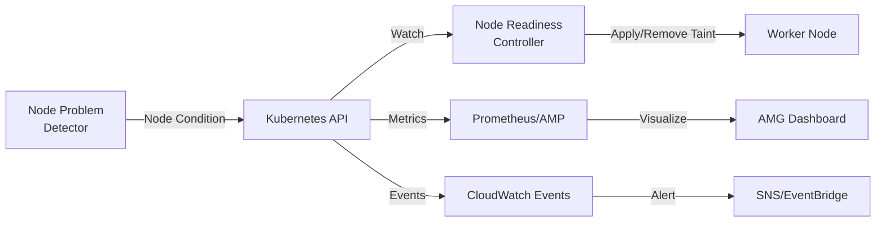
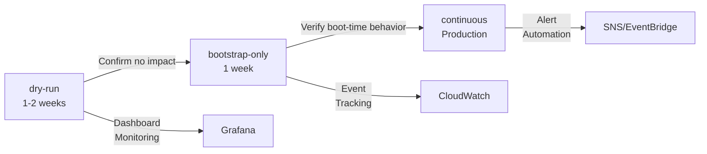
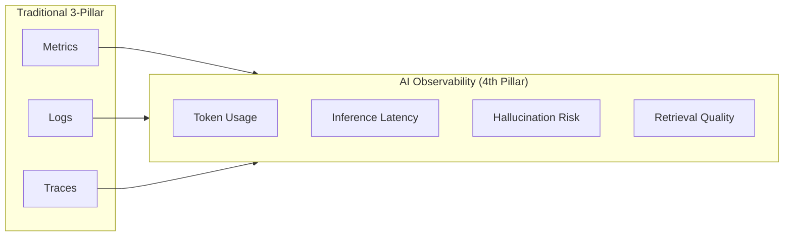
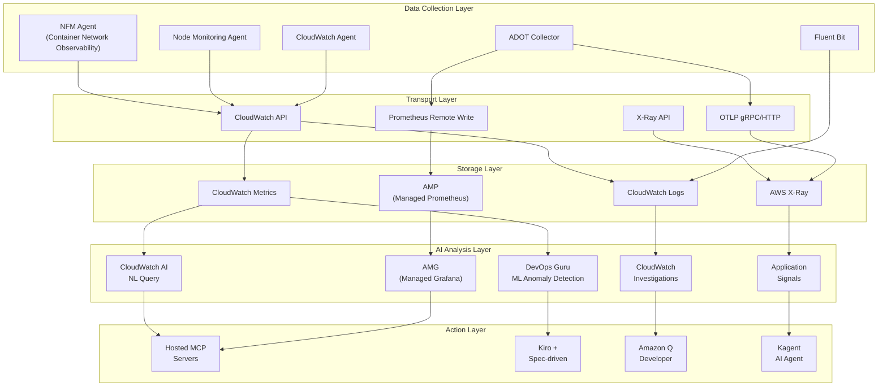

import { ArchitectureLayers, ManagedAddons, ServiceComparison, ObservabilityPillars, StackSelectionPatterns, DataFlowSummary, ProcessorSettings, ContainerInsightsMetrics, ApplicationSignalsLanguages, DevOpsGuruCost, EKSMCPTools, ErrorBudget, AlertOptimization } from '@site/src/components/ObservabilityStackTables';

# Building an EKS Intelligent Observability Stack

> **Written**: 2026-02-12 | **Updated**: 2026-02-14 | **Reading time**: ~45 min

---

## 1. Overview

In modern distributed systems, **Observability** goes beyond simple monitoring — it refers to the ability to understand a system's internal state through its external outputs. In EKS environments, the combination of hundreds of Pods, complex service meshes, and dynamic scaling makes it difficult to identify the root cause of problems with traditional monitoring alone.

### 1.1 3-Pillar Observability + AI Analysis Layer

Combining the three pillars of observability with an AI analysis layer enables truly intelligent operations.

<ObservabilityPillars />

:::info Scope of This Document
This document covers the entire process of building an intelligent observability stack in an EKS environment, from Managed Add-on based observability foundations to the AI analysis layer. It focuses on strategies where AWS operates open-source observability tools as managed services to **eliminate complexity** while **maximizing K8s-native observability**. While this document is based on the AWS native stack, the same architecture can be applied with 3rd-party backends by using ADOT (OpenTelemetry) as the collection layer.
:::

### 1.3 Observability Stack Selection Patterns

In real-world EKS operational environments, three major observability stack patterns are used depending on organizational requirements and existing investments:

<StackSelectionPatterns />

:::tip The Key to the Collection Layer: ADOT (OpenTelemetry)

Regardless of which backend you choose, **using ADOT (OpenTelemetry) for the collection layer gives you the freedom to switch backends.** Since OpenTelemetry is a CNCF standard, it can export data to most backends including Prometheus, Jaeger, Datadog, Sumo Logic, and more. This is why AWS provides OpenTelemetry as a Managed Add-on (ADOT) instead of its own proprietary agent.
:::

This document explains configurations based on the **AWS Native** and **OSS-centric** patterns. If you use a 3rd-party backend, you can leverage the same collection pipeline by simply changing the ADOT Collector's exporter settings.

### 1.2 Why Observability Matters in EKS

Observability in EKS environments is essential for the following reasons:

- **Dynamic infrastructure**: Pods are constantly created/deleted, and nodes are dynamically provisioned by Karpenter
- **Microservice complexity**: Complex inter-service call chains make it difficult to identify single points of failure
- **Multi-layer issues**: Multiple layers including applications, container runtime, nodes, network, and AWS services
- **Cost optimization**: Right-sizing based on resource usage pattern analysis
- **Regulatory compliance**: Audit logs, access records, and other compliance requirements

---

## 2. Managed Add-ons Based Observability Foundation

EKS Managed Add-ons eliminate operational complexity by having AWS manage the installation, upgrades, and patches of observability agents. With a single `aws eks create-addon` command, you can establish a production-grade observability foundation.

<ManagedAddons />

### 2.1 ADOT (AWS Distro for OpenTelemetry) Add-on

ADOT is the AWS distribution of OpenTelemetry that collects metrics, logs, and traces with a single agent.

```bash
# Install ADOT Add-on
aws eks create-addon \
  --cluster-name my-cluster \
  --addon-name adot \
  --addon-version v0.40.0-eksbuild.1 \
  --service-account-role-arn arn:aws:iam::ACCOUNT_ID:role/adot-collector-role

# Verify installation
aws eks describe-addon \
  --cluster-name my-cluster \
  --addon-name adot \
  --query 'addon.status'
```

:::tip ADOT vs Self-managed OpenTelemetry Deployment
Using the ADOT Add-on automatically installs the OpenTelemetry Operator with built-in AWS service authentication (SigV4). This significantly reduces operational overhead compared to self-managed deployments, and EKS version compatibility is guaranteed by AWS.
:::

### 2.2 CloudWatch Observability Agent Add-on

The CloudWatch Observability Agent provides an integrated offering of Container Insights Enhanced, Application Signals, and CloudWatch Logs.

```bash
# CloudWatch Observability Agent Add-on
aws eks create-addon \
  --cluster-name my-cluster \
  --addon-name amazon-cloudwatch-observability \
  --service-account-role-arn arn:aws:iam::ACCOUNT_ID:role/cloudwatch-agent-role

# Verify configuration
kubectl get pods -n amazon-cloudwatch
```

### 2.3 Node Monitoring Agent Add-on (2025)

The Node Monitoring Agent detects hardware and OS-level issues on EC2 nodes.

```bash
# Node Monitoring Agent Add-on
aws eks create-addon \
  --cluster-name my-cluster \
  --addon-name eks-node-monitoring-agent
```

Key detection items:

- **NVMe disk errors**: Proactive detection of EBS volume performance degradation
- **Memory hardware errors**: EDAC (Error Detection and Correction) events
- **Kernel soft lockups**: CPU held abnormally long
- **OOM (Out of Memory)**: Process termination due to memory exhaustion

#### 2.3.1 Integration of Node Readiness Controller with Observability

**Node Readiness Controller (NRC)** is a controller introduced as Beta in Kubernetes 1.32 that automatically manages node taints based on node issues reported by Node Problem Detector (NPD). This is a core component of the **Closed-Loop Observability** pattern that connects observability data to automatic remediation.

**Role in the Observability Pipeline:**



1. **Collection**: Node Monitoring Agent Add-on detects hardware/OS issues
2. **Reporting**: NPD reports status to the K8s API as Node Conditions
3. **Detection**: NRC monitors Node Condition changes
4. **Action**: NRC automatically applies/removes the `node.kubernetes.io/unschedulable` taint
5. **Observation**: CloudWatch Container Insights and AMP track taint change events
6. **Alerting**: SNS/EventBridge notifies the operations team of node state changes

**CloudWatch Container Insights Integration:**

```bash
# Query NRC-related node taint change events with CloudWatch Logs Insights
aws logs start-query \
  --log-group-name /aws/containerinsights/my-cluster/application \
  --start-time $(date -u -d '1 hour ago' +%s) \
  --end-time $(date -u +%s) \
  --query-string '
fields @timestamp, kubernetes.node_name, message
| filter message like /NoSchedule/
| filter message like /node.kubernetes.io\/unschedulable/
| sort @timestamp desc
'

# Example output:
# 2026-02-12 10:23:45 | node-abc123 | Taint added: node.kubernetes.io/unschedulable:NoSchedule (DiskPressure)
# 2026-02-12 10:28:12 | node-abc123 | Taint removed: node.kubernetes.io/unschedulable (DiskPressure resolved)
```

**Prometheus Metrics Collection:**

NRC operates as part of the kube-controller-manager and exposes the following metrics:

```yaml
# Collect NRC metrics with ServiceMonitor
apiVersion: monitoring.coreos.com/v1
kind: ServiceMonitor
metadata:
  name: node-readiness-controller
  namespace: kube-system
spec:
  selector:
    matchLabels:
      component: kube-controller-manager
  endpoints:
  - port: metrics
    path: /metrics
    interval: 30s

# Key metrics:
# - node_readiness_controller_reconcile_total: Number of NRC reconciliation executions
# - node_readiness_controller_reconcile_duration_seconds: Reconciliation processing time
# - node_readiness_controller_taint_changes_total: Number of taint applies/removals
```

**AMG (Amazon Managed Grafana) Dashboard Visualization:**

```json
{
  "dashboard": {
    "title": "Node Readiness & Health",
    "panels": [
      {
        "title": "Nodes with Unschedulable Taints",
        "targets": [{
          "expr": "count(kube_node_spec_taint{key='node.kubernetes.io/unschedulable'})"
        }]
      },
      {
        "title": "NRC Reconciliation Rate",
        "targets": [{
          "expr": "rate(node_readiness_controller_reconcile_total[5m])"
        }]
      },
      {
        "title": "Node Condition Changes (24h)",
        "targets": [{
          "expr": "increase(node_readiness_controller_taint_changes_total[24h])"
        }]
      }
    ]
  }
}
```

**EventBridge-based Alert Automation:**

```yaml
# EventBridge Rule: SNS alert on NRC taint changes
apiVersion: v1
kind: ConfigMap
metadata:
  name: eventbridge-rule
data:
  rule.json: |
    {
      "source": ["aws.eks"],
      "detail-type": ["EKS Node Taint Change"],
      "detail": {
        "taintKey": ["node.kubernetes.io/unschedulable"],
        "action": ["added", "removed"]
      }
    }
---
# Send alerts to SNS topic
# Alert example:
# [ALERT] Node ip-10-0-1-45.ap-northeast-2.compute.internal
# Taint added: node.kubernetes.io/unschedulable:NoSchedule
# Reason: DiskPressure detected by Node Monitoring Agent
# Action: Pods will not be scheduled until condition resolves
```

**Utilizing Dry-run Mode (Pre-production Validation):**

NRC supports three modes:

| Mode | Description | When to Use |
|------|-------------|------------|
| `dry-run` | Simulates taint changes only (no actual application) | Assess impact scope before production deployment |
| `bootstrap-only` | Applies taints only during cluster boot | Use only during initial node preparation phase |
| `continuous` | Continuously monitors node state and manages taints | Production environment (recommended) |

```bash
# Enable NRC in dry-run mode (impact scope simulation)
kubectl patch deployment kube-controller-manager \
  -n kube-system \
  --type='json' \
  -p='[{
    "op": "add",
    "path": "/spec/template/spec/containers/0/command/-",
    "value": "--feature-gates=NodeReadinessController=true"
  },{
    "op": "add",
    "path": "/spec/template/spec/containers/0/command/-",
    "value": "--node-readiness-controller-mode=dry-run"
  }]'

# Analyze dry-run results with CloudWatch Logs Insights
aws logs start-query \
  --log-group-name /aws/containerinsights/my-cluster/application \
  --start-time $(date -u -d '1 hour ago' +%s) \
  --end-time $(date -u +%s) \
  --query-string '
fields @timestamp, message
| filter message like /dry-run/
| filter message like /would add taint/
| stats count() by kubernetes.node_name
'

# Output: Confirm the number of taints to be applied per node
# -> Decide to switch to continuous mode after assessing impact scope
```

**Gradual Rollout Strategy:**



1. **Dry-run phase**: Monitor simulation results in observability dashboards
2. **Bootstrap-only phase**: Apply taints only during node boot to assess initial impact
3. **Continuous phase**: Fully activate in production environment with continuous monitoring

:::tip Best Practice for Observability to Auto-Remediation
NRC is an excellent example of the **Closed-Loop Observability** pattern that performs automatic actions based on observability data. When the Node Monitoring Agent detects a problem, NRC automatically isolates the node to maintain workload stability. This is a core component of **Self-Healing Infrastructure** where the system recovers on its own without human intervention.
:::

:::info Reference
- [Kubernetes Blog: Introducing Node Readiness Controller](https://kubernetes.io/blog/2026/02/03/introducing-node-readiness-controller/)
:::

### 2.4 Container Network Observability (2025.11)

**Container Network Observability**, announced at re:Invent in November 2025, provides network visibility with K8s context in EKS environments. While traditional VPC Flow Logs only showed IP-level traffic, Container Network Observability provides **Pod-to-Pod, Pod-to-Service, Pod-to-external service** level network flows along with K8s metadata (namespace, service name, Pod labels).

```bash
# Install Network Flow Monitoring Agent Add-on
aws eks create-addon \
  --cluster-name my-cluster \
  --addon-name aws-network-flow-monitoring-agent

# Enable Container Network Observability in VPC CNI
aws eks update-addon \
  --cluster-name my-cluster \
  --addon-name vpc-cni \
  --configuration-values '{"enableNetworkPolicy":"true"}'
```

Key features:

- **Pod-level network metrics**: Track TCP retransmissions, packet drops, and connection latency at the Pod/Service level
- **Cross-AZ traffic visibility**: Measure cross-AZ data transfer volumes per service to identify unnecessary Cross-AZ costs
- **K8s context network map**: Automatically map namespace, service name, and Pod labels to network flows
- **AWS service communication tracking**: Analyze traffic patterns from Pods to AWS services like S3, RDS, DynamoDB
- **Preferred observability stack integration**: Send metrics to any backend including AMP/Grafana, CloudWatch, Datadog

:::tip Enhanced Network Security Policies (2025.12)
Along with Container Network Observability, EKS also introduced **Enhanced Network Security Policies**. These allow centralized application of network access filters across the entire cluster and fine-grained control of external traffic with DNS-based egress policies. They operate on top of VPC CNI's Network Policy capabilities.
:::

:::info Key Message
With just 5 observability Managed Add-ons, you establish the observability foundation across **all layers: infrastructure (Node Monitoring), network (NFM Agent -> Container Network Observability), and application (ADOT, CloudWatch Agent)**. All are deployed with a single `aws eks create-addon` command, and version management and security patches are handled by AWS.
:::

### 2.6 CloudWatch Generative AI Observability

**CloudWatch Generative AI Observability**, which started as Preview in July 2025 and reached GA in October, provides a new observability dimension for AI/ML workloads. It adds **AI workload-specific observability** to the existing 3-Pillar observability (Metrics, Logs, Traces), ushering in the era of 4-Pillar observability.

#### 2.6.1 Core Features

**LLM and AI Agent Monitoring:**
- Monitor LLMs and AI Agents running on all infrastructure including Amazon Bedrock, EKS, ECS, and on-premises
- Token consumption tracking (input/output token counts, cost per token)
- Inference latency analysis (request-response time, P50/P90/P99 latency)
- End-to-end tracing for full AI stack visibility

**AI Workflow-Specific Observability:**
- **Hallucination risk path detection**: Identify paths where the model is likely to generate incorrect information
- **Retrieval miss identification**: Track search failures in RAG (Retrieval-Augmented Generation) systems
- **Rate-limit retry monitoring**: Analyze retry patterns due to API limits
- **Model-switch decision tracking**: Monitor logic for switching between multiple models

**Amazon Bedrock AgentCore Integration:**
- Provides ready-to-use views for Agent workflows, Knowledge Base, and Tool usage
- Cross-tool prompt flow visibility
- External framework support (LangChain, LangGraph, CrewAI)

#### 2.6.2 4-Pillar Observability Architecture



:::info Differentiators of AI Observability
Traditional 3-Pillar observability observes a system's **behavior**, while AI observability observes the model's **decision-making** and **quality**. For example, API latency (traditional) and inference quality (AI-specific) are different observation targets.
:::

#### 2.6.3 Activation Method

```bash
# Enable CloudWatch Generative AI Observability (EKS workloads)
# Add AI Observability Exporter to ADOT Collector
kubectl apply -f - <<EOF
apiVersion: opentelemetry.io/v1beta1
kind: OpenTelemetryCollector
metadata:
  name: adot-ai-observability
  namespace: observability
spec:
  mode: deployment
  config:
    receivers:
      otlp:
        protocols:
          grpc:
            endpoint: "0.0.0.0:4317"

    processors:
      batch:
        timeout: 10s

    exporters:
      awsxray:
        region: ap-northeast-2
        indexed_attributes:
          - "gen_ai.system"
          - "gen_ai.request.model"
          - "gen_ai.usage.input_tokens"
          - "gen_ai.usage.output_tokens"

      awscloudwatch:
        region: ap-northeast-2
        namespace: "GenAI/Observability"
        metric_declarations:
          - dimensions:
              - ["service.name", "gen_ai.request.model"]
            metric_name_selectors:
              - "gen_ai.usage.input_tokens"
              - "gen_ai.usage.output_tokens"
              - "gen_ai.request.duration"

    service:
      pipelines:
        traces:
          receivers: [otlp]
          processors: [batch]
          exporters: [awsxray]
        metrics:
          receivers: [otlp]
          processors: [batch]
          exporters: [awscloudwatch]
EOF
```

#### 2.6.4 MCP Integration and Automation

CloudWatch Generative AI Observability integrates with the **Bedrock Data Automation MCP server** to allow direct querying of AI observability data from AI clients like Kiro and Amazon Q Developer.

```
[Scenario: LLM Inference Latency Increase]

Kiro + MCP Auto Analysis:
1. CloudWatch MCP: query_ai_metrics("inference_latency") -> P99 500ms -> 2.3s increase
2. CloudWatch MCP: get_ai_traces(service="recommendation-llm") -> Token count spike confirmed
3. CloudWatch MCP: check_hallucination_risk() -> High risk for certain prompt patterns
4. Bedrock MCP: get_model_config() -> Excessive max_tokens model parameter setting

-> Kiro automatically:
   - Creates PR to optimize max_tokens limit
   - Suggests prompt engineering improvements
   - Adds alternative model (smaller model) usage logic
```

:::tip GitHub Action Integration
CloudWatch Generative AI Observability provides a GitHub Action to automatically add AI observability data to PRs. It automatically displays token consumption, latency changes, and hallucination risk changes on model change PRs to assess impact before deployment.
:::

#### 2.6.5 Real-World Use Cases

**Case 1: RAG System Search Quality Monitoring**
```
[Problem Discovery]
Retrieval miss rate: 15% -> 35% spike (within 2 hours)

[CloudWatch AI Observability Analysis]
- Knowledge Base index not updated for 7 days
- Pattern detected: queries for latest documents failing
- Embedding model version mismatch confirmed

[Auto Remediation]
-> Knowledge Base re-indexing triggered
-> Embedding model synchronized
-> Retrieval miss rate restored to 15%
```

**Case 2: Token Cost Optimization**
```
[Cost Anomaly Detection]
Daily token consumption: $500 -> $2,300 (460% increase)

[Root Cause Analysis]
- Specific prompt template outputting an average of 5,000 tokens (normal: 500)
- Repetitive prompt chains maintaining unnecessarily long context

[Optimization Result]
-> Prompt template refactored
-> Dynamic context window adjustment
-> Cost reduced to $600/day (74% savings)
```
:::

---

---

## 3. Overall Architecture

The EKS intelligent observability stack consists of 5 layers.

<ArchitectureLayers />



### 3.1 Data Flow Summary

<DataFlowSummary />

---

## 4. ADOT Collector Deployment

### 4.1 OpenTelemetryCollector CRD

Installing the ADOT Add-on also deploys the OpenTelemetry Operator, allowing declarative management of collectors through the `OpenTelemetryCollector` CRD.

```yaml
apiVersion: opentelemetry.io/v1beta1
kind: OpenTelemetryCollector
metadata:
  name: adot-collector
  namespace: observability
spec:
  mode: deployment
  replicas: 2
  resources:
    limits:
      cpu: "1"
      memory: 2Gi
    requests:
      cpu: 200m
      memory: 512Mi
  config:
    receivers:
      otlp:
        protocols:
          grpc:
            endpoint: "0.0.0.0:4317"
          http:
            endpoint: "0.0.0.0:4318"
      prometheus:
        config:
          scrape_configs:
            - job_name: 'kubernetes-pods'
              kubernetes_sd_configs:
                - role: pod
              relabel_configs:
                - source_labels: [__meta_kubernetes_pod_annotation_prometheus_io_scrape]
                  action: keep
                  regex: true
    processors:
      batch:
        timeout: 10s
        send_batch_size: 1024
      memory_limiter:
        check_interval: 1s
        limit_mib: 512
        spike_limit_mib: 128
      resource:
        attributes:
          - key: cluster.name
            value: "my-eks-cluster"
            action: upsert
          - key: aws.region
            value: "ap-northeast-2"
            action: upsert
      filter:
        metrics:
          exclude:
            match_type: regexp
            metric_names:
              - "go_.*"
              - "process_.*"
    exporters:
      prometheusremotewrite:
        endpoint: "https://aps-workspaces.ap-northeast-2.amazonaws.com/workspaces/ws-xxxxx/api/v1/remote_write"
        auth:
          authenticator: sigv4auth
        resource_to_telemetry_conversion:
          enabled: true
      awsxray:
        region: ap-northeast-2
        indexed_attributes:
          - "otel.resource.service.name"
          - "otel.resource.deployment.environment"
      awscloudwatchlogs:
        region: ap-northeast-2
        log_group_name: "/eks/my-cluster/application"
        log_stream_name: "otel-logs"
    extensions:
      sigv4auth:
        region: ap-northeast-2
        service: aps
      health_check:
        endpoint: "0.0.0.0:13133"
    service:
      extensions: [sigv4auth, health_check]
      pipelines:
        metrics:
          receivers: [otlp, prometheus]
          processors: [memory_limiter, filter, batch, resource]
          exporters: [prometheusremotewrite]
        traces:
          receivers: [otlp]
          processors: [memory_limiter, batch, resource]
          exporters: [awsxray]
        logs:
          receivers: [otlp]
          processors: [memory_limiter, batch, resource]
          exporters: [awscloudwatchlogs]
```

### 4.2 DaemonSet Mode Deployment

Use DaemonSet mode when per-node metric collection is needed.

```yaml
apiVersion: opentelemetry.io/v1beta1
kind: OpenTelemetryCollector
metadata:
  name: adot-node-collector
  namespace: observability
spec:
  mode: daemonset
  hostNetwork: true
  volumes:
    - name: hostfs
      hostPath:
        path: /
  volumeMounts:
    - name: hostfs
      mountPath: /hostfs
      readOnly: true
  env:
    - name: K8S_NODE_NAME
      valueFrom:
        fieldRef:
          fieldPath: spec.nodeName
  config:
    receivers:
      hostmetrics:
        root_path: /hostfs
        collection_interval: 30s
        scrapers:
          cpu: {}
          disk: {}
          filesystem: {}
          load: {}
          memory: {}
          network: {}
      kubeletstats:
        collection_interval: 30s
        auth_type: serviceAccount
        endpoint: "https://${env:K8S_NODE_NAME}:10250"
        insecure_skip_verify: true
    processors:
      batch:
        timeout: 30s
      resourcedetection:
        detectors: [env, eks]
    exporters:
      prometheusremotewrite:
        endpoint: "https://aps-workspaces.ap-northeast-2.amazonaws.com/workspaces/ws-xxxxx/api/v1/remote_write"
        auth:
          authenticator: sigv4auth
    extensions:
      sigv4auth:
        region: ap-northeast-2
        service: aps
    service:
      extensions: [sigv4auth]
      pipelines:
        metrics:
          receivers: [hostmetrics, kubeletstats]
          processors: [resourcedetection, batch]
          exporters: [prometheusremotewrite]
```

:::tip Deployment vs DaemonSet Selection Criteria

- **Deployment mode**: Application metrics/traces collection (OTLP reception), centralized processing
- **DaemonSet mode**: Node-level metrics collection (hostmetrics, kubeletstats), network efficient
- **Sidecar mode**: Collect logs/traces for specific Pods only, when isolation is needed
:::

### 4.3 Pipeline Configuration Principles

The ADOT Collector pipeline processes data in the order `receivers -> processors -> exporters`.

```
+---------------+    +----------------+    +---------------+
|  Receivers    |--->|  Processors    |--->|  Exporters    |
|               |    |                |    |               |
| - otlp        |    | - memory_      |    | - prometheus  |
| - prometheus  |    |   limiter      |    |   remotewrite |
| - hostmetrics |    | - batch        |    | - awsxray     |
| - kubelet     |    | - filter       |    | - cwlogs      |
|   stats       |    | - resource     |    |               |
+---------------+    +----------------+    +---------------+
```

**Key Processor Settings**:

<ProcessorSettings />

---

## 5. AMP + AMG Integration

### 5.1 AMP (Amazon Managed Prometheus)

AMP is a Prometheus-compatible managed service that stores and queries metrics at scale without infrastructure management.

```bash
# Create AMP workspace
aws amp create-workspace \
  --alias my-eks-observability \
  --tags Environment=production

# Check workspace ID
aws amp list-workspaces \
  --query 'workspaces[?alias==`my-eks-observability`].workspaceId' \
  --output text
```

### 5.2 Remote Write Configuration

Remote write configuration for sending metrics from ADOT to AMP.

```yaml
# Prometheus remote_write configuration
remoteWrite:
  - url: "https://aps-workspaces.ap-northeast-2.amazonaws.com/workspaces/ws-xxxxx/api/v1/remote_write"
    sigv4:
      region: ap-northeast-2
    queue_config:
      max_samples_per_send: 1000
      max_shards: 200
      capacity: 2500
    write_relabel_configs:
      - source_labels: [__name__]
        regex: "go_.*|process_.*"
        action: drop
```

:::warning Remote Write Cost Optimization
AMP charges based on the number of ingested metric samples. You can reduce costs by 30-50% by dropping unnecessary metrics (go_*, process_*) via `write_relabel_configs`. Additionally, increasing the `scrape_interval` from 15s to 30s halves the number of samples.
:::

### 5.3 AMG (Amazon Managed Grafana) Data Source Connection

Add AMP as a data source in AMG.

```bash
# Create AMG workspace
aws grafana create-workspace \
  --workspace-name my-eks-grafana \
  --account-access-type CURRENT_ACCOUNT \
  --authentication-providers AWS_SSO \
  --permission-type SERVICE_MANAGED \
  --workspace-data-sources PROMETHEUS CLOUDWATCH XRAY

# Auto-configure data source (AMP connection)
aws grafana create-workspace-service-account \
  --workspace-id g-xxxxxxxxxx \
  --grafana-role ADMIN \
  --name amp-datasource
```

After adding the AMP data source in AMG, here are the essential PromQL queries you can use.

### 5.4 Essential PromQL Queries

```promql
# Top 10 Pod CPU usage
topk(10,
  sum(rate(container_cpu_usage_seconds_total{namespace!="kube-system"}[5m])) by (pod)
)

# Memory usage per node
100 * (1 - (
  node_memory_MemAvailable_bytes / node_memory_MemTotal_bytes
))

# HTTP request error rate (5xx)
sum(rate(http_requests_total{status=~"5.."}[5m]))
/ sum(rate(http_requests_total[5m])) * 100

# P99 latency
histogram_quantile(0.99,
  sum(rate(http_request_duration_seconds_bucket[5m])) by (le, service)
)

# Pod restart count (last 1 hour)
increase(kube_pod_container_status_restarts_total[1h])

# Karpenter node provisioning wait time
histogram_quantile(0.95,
  sum(rate(karpenter_provisioner_scheduling_duration_seconds_bucket[10m])) by (le)
)
```

:::info Core Value of AMP + AMG
AWS handles all infrastructure management for Prometheus and Grafana (scaling, patching, high availability, backups). Teams can focus solely on **dashboard configuration and query writing**, allowing them to concentrate on the essential value of observability. This is the core of AWS's strategy of "maintaining the benefits of open source while eliminating complexity."
:::

### 5.5 Grafana Alloy: Next-Generation Collector Pattern

**Grafana Alloy** is the successor to Grafana Agent, officially announced in April 2024. It supports both OpenTelemetry and Prometheus collection and enables more flexible pipeline configuration based on **Flow mode**.

#### 5.5.1 Grafana Alloy vs ADOT Comparison

| Feature | ADOT (AWS Perspective) | Grafana Alloy | Recommended Scenario |
|---------|----------------------|---------------|---------------------|
| **Management** | EKS Managed Add-on | Self-deployed (Helm) | ADOT: When AWS integration is priority |
| **Backend Focus** | AWS services (AMP, CloudWatch, X-Ray) | Grafana Cloud, Prometheus, Loki | Alloy: When centered on Grafana ecosystem |
| **OpenTelemetry Support** | Native (OTEL Collector based) | Native (OTEL Receiver built-in) | Equal |
| **Prometheus Collection** | (prometheus receiver) | (prometheus.scrape) | Alloy is lighter and faster |
| **Log Collection** | CloudWatch Logs, S3 | Loki, CloudWatch Logs | Alloy: Loki optimized |
| **Tracing** | X-Ray, OTLP | Tempo, Jaeger, OTLP | Alloy: Tempo optimized |
| **Configuration** | YAML (OTEL Collector standard) | River language (declarative + dynamic) | Alloy is more intuitive |
| **AWS IAM Integration** | SigV4 built-in | Manual setup required | ADOT is much simpler |
| **Resource Usage** | Medium (Go-based) | Low (optimized Go) | Alloy uses ~30% less |

:::tip ADOT vs Grafana Alloy Selection Guide

**Choose ADOT when:**
- You want the convenience of AWS Managed Add-on
- You primarily use AMP + CloudWatch + X-Ray as backends
- You want automatic AWS IAM authentication handling
- You want AWS-guaranteed EKS version compatibility

**Choose Grafana Alloy when:**
- You use Grafana Cloud or a self-hosted Grafana stack
- You're building a complete open-source stack with Loki + Tempo + Mimir
- Lighter resource usage is important (cost-sensitive)
- You need dynamic configuration features of River language
:::

#### 5.5.2 Deploying Grafana Alloy on EKS

```bash
# Add Helm repository
helm repo add grafana https://grafana.github.io/helm-charts
helm repo update

# Install Grafana Alloy
helm install grafana-alloy grafana/alloy \
  --namespace observability \
  --create-namespace \
  --set alloy.configMap.content='
logging {
  level = "info"
  format = "logfmt"
}

// Prometheus metrics collection
prometheus.scrape "kubernetes_pods" {
  targets = discovery.kubernetes.pods.targets
  forward_to = [prometheus.remote_write.amp.receiver]

  clustering {
    enabled = true
  }
}

// Kubernetes Pod auto-discovery
discovery.kubernetes "pods" {
  role = "pod"

  selectors {
    role  = "pod"
    field = "spec.nodeName=" + env("HOSTNAME")
  }
}

// Send metrics to AMP (SigV4 authentication)
prometheus.remote_write "amp" {
  endpoint {
    url = "https://aps-workspaces.ap-northeast-2.amazonaws.com/workspaces/ws-xxxxx/api/v1/remote_write"

    sigv4 {
      region = "ap-northeast-2"
    }
  }
}

// Send logs to Loki
loki.source.kubernetes "pods" {
  targets    = discovery.kubernetes.pods.targets
  forward_to = [loki.write.default.receiver]
}

loki.write "default" {
  endpoint {
    url = "https://logs-prod-012.grafana.net/loki/api/v1/push"

    basic_auth {
      username = env("LOKI_USERNAME")
      password = env("LOKI_PASSWORD")
    }
  }
}

// Receive OpenTelemetry traces
otelcol.receiver.otlp "default" {
  grpc {
    endpoint = "0.0.0.0:4317"
  }

  http {
    endpoint = "0.0.0.0:4318"
  }

  output {
    traces  = [otelcol.exporter.otlp.tempo.input]
  }
}

otelcol.exporter.otlp "tempo" {
  client {
    endpoint = "tempo.grafana.net:443"

    auth {
      authenticator = otelcol.auth.basic.tempo.handler
    }
  }
}

otelcol.auth.basic "tempo" {
  username = env("TEMPO_USERNAME")
  password = env("TEMPO_PASSWORD")
}
'
```

#### 5.5.3 AMP + Alloy Combination vs AMP + ADOT Combination

**Scenario 1: AMP + Grafana Alloy**

```
Pros:
- 30% reduction in resource usage (CPU/Memory)
- Excellent Prometheus collection performance (100K samples/second)
- Dynamic configuration with River language (config changes without redeployment)

Cons:
- Manual AWS IAM authentication setup required (SigV4 credential management)
- No EKS Managed Add-on support (manual upgrades)
- Complex CloudWatch Logs integration (additional setup required)
```

**Scenario 2: AMP + ADOT**

```
Pros:
- Fully automated management as EKS Managed Add-on
- AWS IAM integration (automatic SigV4, IRSA support)
- Native CloudWatch + X-Ray integration
- AWS support and compatibility guarantee

Cons:
- Slightly higher resource usage than Alloy
- YAML-centric configuration (not as flexible as River)
```

:::info Practical Recommendation
**Hybrid approach**: It's also possible to collect metrics with Grafana Alloy and send them to AMP, while collecting traces and logs with ADOT and sending them to X-Ray and CloudWatch. This is a strategy that leverages each tool's strengths.
:::

#### 5.5.4 Integration with Grafana Cloud

When using Grafana Cloud, Alloy can configure a complete observability stack with Loki + Tempo + Mimir.

```yaml
# Grafana Cloud integration example (alloy-config.river)
prometheus.remote_write "grafana_cloud" {
  endpoint {
    url = "https://prometheus-prod-01-eu-west-0.grafana.net/api/prom/push"

    basic_auth {
      username = env("GRAFANA_CLOUD_PROMETHEUS_USERNAME")
      password = env("GRAFANA_CLOUD_API_KEY")
    }
  }
}

loki.write "grafana_cloud" {
  endpoint {
    url = "https://logs-prod-eu-west-0.grafana.net/loki/api/v1/push"

    basic_auth {
      username = env("GRAFANA_CLOUD_LOKI_USERNAME")
      password = env("GRAFANA_CLOUD_API_KEY")
    }
  }
}

otelcol.exporter.otlp "grafana_cloud_traces" {
  client {
    endpoint = "tempo-prod-04-prod-eu-west-0.grafana.net:443"

    auth {
      authenticator = otelcol.auth.basic.grafana_cloud.handler
    }
  }
}
```

**Advantages of Grafana Cloud:**
- **Fully managed**: No infrastructure management for Loki, Tempo, Mimir
- **Unified view**: Explore metrics, logs, and traces in a single Grafana UI
- **Free tier**: 10K time series, 50GB logs, 50GB traces per month free
- **Global high availability**: Automatic replication across multiple regions

**Cost Comparison (monthly, small-to-medium EKS cluster):**

| Item | AMP + AMG | Grafana Cloud | Self-hosted Grafana |
|------|-----------|--------------|-------------------|
| Metrics (100K samples/sec) | $50-80 | $60-100 | $150-200 (EC2 cost) |
| Logs (50GB/month) | $25 (CloudWatch) | $30 (Loki) | $100 (EBS + instances) |
| Traces (10K spans/sec) | $15 (X-Ray) | $20 (Tempo) | $50 (EBS + instances) |
| Management overhead | Low | Very low | High |
| **Total estimated cost** | **$90-120** | **$110-150** | **$300-350** |

---

## 6. CloudWatch Cross-Account Observability

### 6.1 The Need for Multi-Account Observability

In large organizations, AWS accounts are separated for security, isolation, and cost management. However, when observability data is distributed across accounts, the following problems arise:

- **No unified view**: Metrics/logs from multiple accounts must be checked in separate consoles
- **Difficult correlation analysis**: Cross-account service call tracing is impossible
- **Alert management complexity**: Duplicate alert configuration management per account
- **Reduced operational efficiency**: Navigating between multiple accounts to identify root causes during incidents

AWS provides centralized observability through **CloudWatch Cross-Account Observability**.

### 6.2 Cross-Account Architecture

```
+-------------------------------------------------------------+
|                   Monitoring Account                         |
|  +--------------------------------------------------------+ |
|  |         CloudWatch (Centralized View)                   | |
|  |  - Unified metrics/logs/traces from all accounts        | |
|  |  - Unified dashboards and alerts                        | |
|  +--------------------------------------------------------+ |
|                          ^                                   |
|                    OAM Links                                 |
+---------------------------+----------------------------------+
                            |
        +-------------------+-------------------+
        |                   |                   |
+-------v------+  +---------v-----+  +---------v-----+
| Source Acct A |  | Source Acct B  |  | Source Acct C  |
| (EKS Dev)    |  | (EKS Staging) |  | (EKS Prod)    |
|              |  |               |  |               |
| ADOT         |  | ADOT          |  | ADOT          |
| Container    |  | Container     |  | Container     |
| Insights     |  | Insights      |  | Insights      |
+--------------+  +---------------+  +---------------+
```

### 6.3 OAM (Observability Access Manager) Configuration

#### 6.3.1 Create Sink in Monitoring Account

```bash
# Execute in Monitoring account
aws oam create-sink \
  --name central-observability-sink \
  --tags Key=Environment,Value=production

# Check Sink ARN (used in Source accounts)
SINK_ARN=$(aws oam list-sinks \
  --query 'Items[0].Arn' \
  --output text)

echo $SINK_ARN
# arn:aws:oam:ap-northeast-2:MONITORING_ACCOUNT_ID:sink/sink-id
```

#### 6.3.2 Sink Policy Configuration (Access Authorization)

```json
{
  "Version": "2012-10-17",
  "Statement": [
    {
      "Effect": "Allow",
      "Principal": {
        "AWS": [
          "arn:aws:iam::SOURCE_ACCOUNT_A:root",
          "arn:aws:iam::SOURCE_ACCOUNT_B:root",
          "arn:aws:iam::SOURCE_ACCOUNT_C:root"
        ]
      },
      "Action": [
        "oam:CreateLink",
        "oam:UpdateLink"
      ],
      "Resource": "arn:aws:oam:ap-northeast-2:MONITORING_ACCOUNT_ID:sink/*",
      "Condition": {
        "ForAllValues:StringEquals": {
          "oam:ResourceTypes": [
            "AWS::CloudWatch::Metric",
            "AWS::Logs::LogGroup",
            "AWS::XRay::Trace"
          ]
        }
      }
    }
  ]
}
```

```bash
# Apply Sink Policy
aws oam put-sink-policy \
  --sink-identifier $SINK_ARN \
  --policy file://sink-policy.json
```

#### 6.3.3 Create Link in Source Accounts

```bash
# Execute in each Source account A, B, C
aws oam create-link \
  --label-template '$AccountName-$Region' \
  --resource-types "AWS::CloudWatch::Metric" \
                   "AWS::Logs::LogGroup" \
                   "AWS::XRay::Trace" \
  --sink-identifier arn:aws:oam:ap-northeast-2:MONITORING_ACCOUNT_ID:sink/sink-id \
  --tags Key=Account,Value=dev

# Check Link status
aws oam list-links \
  --query 'Items[*].[Label,ResourceTypes,SinkArn]' \
  --output table
```

:::info How OAM Links Work
OAM Links **stream** observability data from Source accounts to the Monitoring account. Data is retained in the Source accounts as well, while the Monitoring account provides a unified view. This is a **logical connection**, not data replication.
:::

### 6.4 Unified Dashboard Configuration

Configure all accounts' data into a single dashboard from CloudWatch in the Monitoring account.

```json
{
  "widgets": [
    {
      "type": "metric",
      "properties": {
        "metrics": [
          [ { "accountId": "SOURCE_ACCOUNT_A", "expression": "SELECT AVG(pod_cpu_utilization) FROM SCHEMA(\"ContainerInsights\", ClusterName,Namespace,PodName) WHERE ClusterName = 'dev-cluster'" } ],
          [ { "accountId": "SOURCE_ACCOUNT_B", "expression": "SELECT AVG(pod_cpu_utilization) FROM SCHEMA(\"ContainerInsights\", ClusterName,Namespace,PodName) WHERE ClusterName = 'staging-cluster'" } ],
          [ { "accountId": "SOURCE_ACCOUNT_C", "expression": "SELECT AVG(pod_cpu_utilization) FROM SCHEMA(\"ContainerInsights\", ClusterName,Namespace,PodName) WHERE ClusterName = 'prod-cluster'" } ]
        ],
        "view": "timeSeries",
        "region": "ap-northeast-2",
        "title": "Pod CPU Usage Across All Environments",
        "period": 300
      }
    }
  ]
}
```

### 6.5 Cross-Account X-Ray Tracing

Cross-Account X-Ray configuration is needed to trace inter-service calls in multi-account environments.

```yaml
# Source account ADOT Collector settings
exporters:
  awsxray:
    region: ap-northeast-2
    # Enable Cross-Account tracing
    role_arn: arn:aws:iam::MONITORING_ACCOUNT_ID:role/XRayCrossAccountRole
    indexed_attributes:
      - "aws.account_id"
      - "otel.resource.service.name"
```

**Monitoring Account IAM Role:**

```json
{
  "Version": "2012-10-17",
  "Statement": [
    {
      "Effect": "Allow",
      "Principal": {
        "AWS": "arn:aws:iam::SOURCE_ACCOUNT_A:root"
      },
      "Action": "sts:AssumeRole"
    }
  ]
}
```

### 6.6 Cost Considerations

Cross-Account Observability incurs additional costs for data transfer and storage.

| Cost Item | Description | Estimated Monthly Cost (per cluster) |
|-----------|-------------|-------------------------------------|
| **OAM Link** | Free (only data transfer costs apply) | $0 |
| **Cross-Region transfer** | When sending to Monitoring account in a different region | $0.01/GB (~$50-150) |
| **CloudWatch storage** | Metrics storage in central account | Same as existing costs |
| **X-Ray traces** | Cross-Account trace storage | $5.00/million traces recorded |

:::warning Cost Optimization Strategies
1. **Same-Region configuration**: Place the Monitoring account in the same region as Source accounts to eliminate data transfer costs
2. **Metric filtering**: Select only necessary resources when creating OAM Links (e.g., include X-Ray only for production)
3. **Sampling**: Adjust X-Ray sampling rate (default 1req/s -> 0.1req/s)
:::

### 6.7 Production Operation Patterns

**Pattern 1: Environment-Based Account Separation + Centralized Observability**

```
Dev Account (111111111111)
  +-- EKS Cluster: dev-cluster
       +-- OAM Link -> Monitoring Account

Staging Account (222222222222)
  +-- EKS Cluster: staging-cluster
       +-- OAM Link -> Monitoring Account

Prod Account (333333333333)
  +-- EKS Cluster: prod-cluster
       +-- OAM Link -> Monitoring Account

Monitoring Account (444444444444)
  +-- CloudWatch Unified Dashboard
  +-- Unified Alerts (SNS -> Slack)
  +-- X-Ray Service Map (All Environments)
```

**Pattern 2: Team-Based Account Separation + Shared Observability**

```
Team-A Account (Frontend)
Team-B Account (Backend)
Team-C Account (Data)
  +-- Each team's EKS + ADOT
       +-- OAM Link -> Shared Monitoring Account

Shared Monitoring Account
  +-- Per-team filtered dashboards
  +-- Per-team alert routing
```

---

## 7. CloudWatch Container Insights Enhanced

### 6.1 Enhanced Container Insights Features

On EKS 1.28+, Enhanced Container Insights provides deep observability including **Control Plane metrics**.

```bash
# Install CloudWatch Observability Operator (Helm)
helm install amazon-cloudwatch-observability \
  oci://public.ecr.aws/cloudwatch-agent/amazon-cloudwatch-observability \
  --namespace amazon-cloudwatch --create-namespace \
  --set clusterName=my-cluster \
  --set region=ap-northeast-2 \
  --set containerInsights.enhanced=true \
  --set containerInsights.acceleratedCompute=true
```

### 6.2 Collected Metrics Scope

Scope of metrics collected by Enhanced Container Insights:

<ContainerInsightsMetrics />

### 6.3 EKS Control Plane Metrics

Control Plane metrics automatically collected on EKS 1.28+ are essential for understanding cluster health.

```bash
# Verify Control Plane metrics activation
aws eks describe-cluster \
  --name my-cluster \
  --query 'cluster.logging.clusterLogging[?types[?contains(@, `api`)]]'
```

Key Control Plane metrics:

- **API Server**: `apiserver_request_total`, `apiserver_request_duration_seconds` -- API server load and latency
- **etcd**: `etcd_db_total_size_in_bytes`, `etcd_server_slow_apply_total` -- etcd health and performance
- **Scheduler**: `scheduler_schedule_attempts_total`, `scheduler_scheduling_duration_seconds` -- Scheduling efficiency
- **Controller Manager**: `workqueue_depth`, `workqueue_adds_total` -- Controller queue status

:::warning Cost Considerations
Enhanced Container Insights collects a large volume of metrics, which increases CloudWatch costs. Production clusters may incur an additional $50-200/month. It's recommended to use basic Container Insights for dev/staging environments and enable Enhanced only for production.
:::

### 6.4 Windows Workload Container Insights Support

On August 5, 2025, AWS announced CloudWatch Container Insights for EKS Windows Workloads Monitoring. This is an important development that provides a unified observability experience for EKS clusters running mixed Linux and Windows workloads.

#### 6.4.1 Mixed Cluster Observability Strategy

Many enterprises run legacy .NET Framework applications and new Linux-based microservices on the same EKS cluster. Container Insights' Windows support enables building a single observability platform for such mixed environments.

```yaml
# Deploy Container Insights Agent to Windows nodes
apiVersion: apps/v1
kind: DaemonSet
metadata:
  name: cloudwatch-agent-windows
  namespace: amazon-cloudwatch
spec:
  selector:
    matchLabels:
      name: cloudwatch-agent-windows
  template:
    metadata:
      labels:
        name: cloudwatch-agent-windows
    spec:
      nodeSelector:
        kubernetes.io/os: windows
      serviceAccountName: cloudwatch-agent
      containers:
        - name: cloudwatch-agent
          image: public.ecr.aws/cloudwatch-agent/cloudwatch-agent:latest-windows
          env:
            - name: HOST_IP
              valueFrom:
                fieldRef:
                  fieldPath: status.hostIP
            - name: HOST_NAME
              valueFrom:
                fieldRef:
                  fieldPath: spec.nodeName
            - name: K8S_NAMESPACE
              valueFrom:
                fieldRef:
                  fieldPath: metadata.namespace
          volumeMounts:
            - name: cwagentconfig
              mountPath: C:\ProgramData\Amazon\CloudWatch\cwagentconfig.json
              subPath: cwagentconfig.json
            - name: rootfs
              mountPath: C:\rootfs
              readOnly: true
      volumes:
        - name: cwagentconfig
          configMap:
            name: cwagent-config-windows
        - name: rootfs
          hostPath:
            path: C:\
            type: Directory
```

#### 6.4.2 Windows-Specific Metrics

Container Insights collects Windows-specific performance counters and system metrics on Windows nodes:

| Metric Category | Key Metrics | Description |
|----------------|-------------|-------------|
| **.NET CLR** | `dotnet_clr_memory_heap_size_bytes` | Managed heap size of .NET applications |
| | `dotnet_clr_gc_collections_total` | Garbage collection count (Gen 0/1/2) |
| | `dotnet_clr_exceptions_thrown_total` | Total number of exceptions thrown |
| **IIS** | `iis_current_connections` | Active HTTP connection count |
| | `iis_requests_total` | Total HTTP requests processed |
| | `iis_request_errors_total` | HTTP error response count (4xx, 5xx) |
| **Windows System** | `windows_cpu_processor_utility` | CPU usage (%) |
| | `windows_memory_available_bytes` | Available memory |
| | `windows_net_bytes_total` | Network bytes sent/received |
| **Container** | `container_memory_working_set_bytes` | Windows container memory working set |
| | `container_cpu_usage_seconds_total` | Container CPU usage time |

```yaml
# Windows-specific metrics collection configuration
apiVersion: v1
kind: ConfigMap
metadata:
  name: cwagent-config-windows
  namespace: amazon-cloudwatch
data:
  cwagentconfig.json: |
    {
      "metrics": {
        "namespace": "ContainerInsights",
        "metrics_collected": {
          "statsd": {
            "service_address": ":8125",
            "metrics_collection_interval": 60,
            "metrics_aggregation_interval": 60
          },
          "Performance Counters": {
            "metrics_collection_interval": 60,
            "counters": [
              {
                "counter_name": "\\Processor(_Total)\\% Processor Time",
                "metric_name": "windows_cpu_processor_utility"
              },
              {
                "counter_name": "\\Memory\\Available MBytes",
                "metric_name": "windows_memory_available_bytes"
              },
              {
                "counter_name": "\\.NET CLR Memory(_Global_)\\# Bytes in all Heaps",
                "metric_name": "dotnet_clr_memory_heap_size_bytes"
              },
              {
                "counter_name": "\\.NET CLR Exceptions(_Global_)\\# of Exceps Thrown / sec",
                "metric_name": "dotnet_clr_exceptions_thrown_total"
              },
              {
                "counter_name": "\\Web Service(_Total)\\Current Connections",
                "metric_name": "iis_current_connections"
              },
              {
                "counter_name": "\\Web Service(_Total)\\Total Method Requests",
                "metric_name": "iis_requests_total"
              }
            ]
          }
        }
      }
    }
```

#### 6.4.3 Mixed Cluster Dashboard Configuration

Recommended dashboard configuration for unified monitoring of Linux and Windows nodes from the CloudWatch console:

```json
{
  "widgets": [
    {
      "type": "metric",
      "properties": {
        "title": "Cluster CPU Usage (by OS)",
        "metrics": [
          [ "ContainerInsights", "node_cpu_utilization",
            { "stat": "Average", "label": "Linux Nodes" },
            { "dimensions": { "ClusterName": "my-cluster", "NodeOS": "linux" } }
          ],
          [ ".", "windows_cpu_processor_utility",
            { "stat": "Average", "label": "Windows Nodes" },
            { "dimensions": { "ClusterName": "my-cluster", "NodeOS": "windows" } }
          ]
        ],
        "period": 300,
        "region": "ap-northeast-2"
      }
    },
    {
      "type": "metric",
      "properties": {
        "title": ".NET Application Garbage Collection",
        "metrics": [
          [ "ContainerInsights", "dotnet_clr_gc_collections_total",
            { "dimensions": { "ClusterName": "my-cluster", "Generation": "0" } }
          ],
          [ "...", { "Generation": "1" } ],
          [ "...", { "Generation": "2" } ]
        ],
        "period": 60
      }
    },
    {
      "type": "log",
      "properties": {
        "title": "Windows Container Error Logs",
        "query": "SOURCE '/aws/containerinsights/my-cluster/application'\n| fields @timestamp, kubernetes.pod_name, log\n| filter kubernetes.host like /windows/\n| filter log like /ERROR|Exception/\n| sort @timestamp desc\n| limit 50",
        "region": "ap-northeast-2"
      }
    }
  ]
}
```

:::info Core Value of CloudWatch Container Insights Windows Support
CloudWatch Container Insights has officially supported Windows workloads since August 2025. The ability to monitor Linux and Windows nodes in the same dashboard greatly reduces mixed cluster operational complexity. Windows-specific metrics like .NET CLR and IIS performance counters are automatically collected, establishing the observability foundation for Kubernetes migration of legacy .NET Framework applications.
:::

:::tip Mixed Cluster Operation Recommendations
**Node pool separation**: Separate Windows and Linux workloads into distinct node pools (Karpenter NodePool) while monitoring them under the same Container Insights namespace. This allows selecting optimized instance types for each OS while maintaining observability on a single platform.

**Alert strategy**: Configure Windows-specific metric alerts (e.g., .NET GC Gen 2 frequency increase) and Linux metric alerts separately, but route them to the same SNS topic so the operations team receives all alerts through a single channel.
:::
