import { ScalingComparison, ResponsePatterns, MaturityTable, EvolutionStages, MLModelComparison, AnomalyMetrics, RightSizingResults, ChaosExperiments, DashboardPanels } from '@site/src/components/PredictiveOpsTables';

# Predictive Scaling and Auto-Remediation Patterns

> 📅 **Written**: 2026-02-12 | ⏱️ **Reading Time**: Approx. 30 minutes | 📌 **Reference Environment**: EKS 1.35+, Karpenter v1.1+, CloudWatch, Kiro

---

## 1. Overview

### 1.1 From Reactive to Autonomous

The evolution of EKS operations follows three stages: **Reactive → Predictive → Autonomous**.

<EvolutionStages />

:::info Scope of This Document
Moving beyond the limitations of reactive scaling, this document covers ML-based predictive scaling and autonomous recovery patterns through AI Agents. It focuses specifically on **programmatic debugging** with Kiro+MCP and **automated incident response** with Kagent/Strands.
:::

### 1.2 Why Predictive Operations Are Needed

- **HPA Limitations**: Reacts after metrics exceed thresholds → User impact already occurred
- **Cold Start Problem**: New Pod startup takes 30 seconds-2 minutes → Unable to handle traffic spikes
- **Node Provisioning Delay**: Even Karpenter takes 1-3 minutes to start nodes
- **Complex Failures**: Increasing composite-cause failures undetectable by single metrics
- **Cost Inefficiency**: Excessive resource buffers → Wasted costs

---

## 2. ML-Based Predictive Scaling

### 2.1 HPA Limitations

HPA (Horizontal Pod Autoscaler) has structural limitations because it reacts to **current metrics**.

<ScalingComparison />

```
[HPA Reactive Scaling]

Traffic ████████████████████████░░░░░░░░░
                      ↑ Threshold exceeded
                      |
Pod Count ██████████░░░░████████████████████
                  ↑ Scale-out starts
                  |  (Latency occurs)
User     ✓✓✓✓✓✓✓✓✗✗✗✓✓✓✓✓✓✓✓✓✓✓✓✓✓✓
Experience       ↑ Performance degradation period

[ML Predictive Scaling]

Traffic ████████████████████████░░░░░░░░░
             ↑ Prediction point (30 min before)
             |
Pod Count ██████████████████████████████████
             ↑ Preemptive scale-out
             |
User     ✓✓✓✓✓✓✓✓✓✓✓✓✓✓✓✓✓✓✓✓✓✓✓✓✓✓
Experience (No performance degradation)
```

### 2.2 Time Series Forecasting Models

Representative ML models for predicting EKS workload traffic patterns:

<MLModelComparison />

### 2.3 Prophet-Based Predictive Scaling Implementation

```python
# Prophet-based EKS traffic prediction
import boto3
from prophet import Prophet
import pandas as pd
from datetime import datetime, timedelta

def fetch_metrics_from_amp(workspace_id, query, hours=168):
    """Query last 7 days of metrics from AMP"""
    client = boto3.client('amp', region_name='ap-northeast-2')
    end_time = datetime.utcnow()
    start_time = end_time - timedelta(hours=hours)

    response = client.query_range(
        workspaceId=workspace_id,
        query=query,
        startTime=start_time,
        endTime=end_time,
        step='5m'
    )
    return response

def predict_scaling(metrics_df, forecast_hours=2):
    """Predict future traffic with Prophet"""
    # Convert to Prophet format
    df = metrics_df.rename(columns={
        'timestamp': 'ds',
        'value': 'y'
    })

    model = Prophet(
        changepoint_prior_scale=0.05,
        seasonality_mode='multiplicative',
        daily_seasonality=True,
        weekly_seasonality=True,
    )
    model.fit(df)

    # Forecast next forecast_hours
    future = model.make_future_dataframe(
        periods=forecast_hours * 12,  # 5-minute intervals
        freq='5min'
    )
    forecast = model.predict(future)

    return forecast[['ds', 'yhat', 'yhat_upper', 'yhat_lower']]

def calculate_required_pods(predicted_rps, pod_capacity_rps=100):
    """Calculate required Pod count based on predicted RPS"""
    # Use upper bound (yhat_upper) for safety margin
    required = int(predicted_rps / pod_capacity_rps) + 1
    return max(required, 2)  # Maintain minimum of 2

def apply_scaling(namespace, deployment, target_replicas):
    """Apply scaling via kubectl"""
    import subprocess
    cmd = f"kubectl scale deployment/{deployment} -n {namespace} --replicas={target_replicas}"
    subprocess.run(cmd.split(), check=True)
    print(f"Scaled {deployment} to {target_replicas} replicas")
```

### 2.4 CronJob-Based Predictive Scaling Automation

```yaml
# CronJob to periodically execute predictive scaling
apiVersion: batch/v1
kind: CronJob
metadata:
  name: predictive-scaler
  namespace: scaling
spec:
  schedule: "*/15 * * * *"  # Run every 15 minutes
  jobTemplate:
    spec:
      template:
        spec:
          serviceAccountName: predictive-scaler
          containers:
            - name: scaler
              image: my-registry/predictive-scaler:latest
              env:
                - name: AMP_WORKSPACE_ID
                  value: "ws-xxxxx"
                - name: TARGET_NAMESPACE
                  value: "payment"
                - name: TARGET_DEPLOYMENT
                  value: "payment-service"
                - name: FORECAST_HOURS
                  value: "2"
              resources:
                requests:
                  cpu: 500m
                  memory: 1Gi
                limits:
                  cpu: "1"
                  memory: 2Gi
          restartPolicy: OnFailure
```

---

## 3. Karpenter + AI Prediction

### 3.1 Karpenter Basic Operation

Karpenter detects Pending Pods and **automatically selects suitable instance types** for provisioning.

```yaml
# Karpenter NodePool configuration
apiVersion: karpenter.sh/v1
kind: NodePool
metadata:
  name: default
spec:
  template:
    spec:
      requirements:
        - key: kubernetes.io/arch
          operator: In
          values: ["amd64", "arm64"]
        - key: karpenter.sh/capacity-type
          operator: In
          values: ["on-demand", "spot"]
        - key: karpenter.k8s.aws/instance-family
          operator: In
          values: ["m7g", "m7i", "c7g", "c7i", "r7g"]
        - key: karpenter.k8s.aws/instance-size
          operator: In
          values: ["medium", "large", "xlarge", "2xlarge"]
      nodeClassRef:
        group: karpenter.k8s.aws
        kind: EC2NodeClass
        name: default
  limits:
    cpu: "100"
    memory: 400Gi
  disruption:
    consolidationPolicy: WhenEmptyOrUnderutilized
    consolidateAfter: 30s
---
apiVersion: karpenter.k8s.aws/v1
kind: EC2NodeClass
metadata:
  name: default
spec:
  role: KarpenterNodeRole
  amiSelectorTerms:
    - alias: al2023@latest
  subnetSelectorTerms:
    - tags:
        karpenter.sh/discovery: my-cluster
  securityGroupSelectorTerms:
    - tags:
        karpenter.sh/discovery: my-cluster
  blockDeviceMappings:
    - deviceName: /dev/xvda
      ebs:
        volumeSize: 100Gi
        volumeType: gp3
        iops: 3000
        throughput: 125
```

### 3.2 AI Prediction-Based Proactive Provisioning

While Karpenter itself reacts to Pending Pods, **combining it with AI prediction** enables proactive node provisioning.

```mermaid
graph TD
    subgraph Prediction["🧠 Prediction Layer"]
        CW_M["CloudWatch\nMetrics"]
        ML["ML Model\n(Prophet/ARIMA)"]
        PRED["Traffic\nPrediction Results"]
    end

    subgraph Preemptive["⚡ Proactive Actions"]
        WARM["Warm Pool\nPod Creation"]
        PAUSE["Pause\nContainers"]
        KARP["Karpenter\nNode Provisioning"]
    end

    subgraph Runtime["🚀 Actual Traffic"]
        TRAFFIC["Traffic\nInflux"]
        HPA2["HPA\nImmediate Scale"]
        READY["Pod\nImmediate Service"]
    end

    CW_M --> ML --> PRED
    PRED --> WARM --> KARP
    PRED --> PAUSE --> KARP
    TRAFFIC --> HPA2 --> READY
    KARP -.->|Nodes Ready| READY
```



**Proactive Provisioning Strategy**:

```yaml
# Placeholder Pods to proactively secure nodes
apiVersion: apps/v1
kind: Deployment
metadata:
  name: capacity-reservation
  namespace: scaling
spec:
  replicas: 0  # Dynamically adjusted by predictive scaler
  selector:
    matchLabels:
      app: capacity-reservation
  template:
    metadata:
      labels:
        app: capacity-reservation
    spec:
      priorityClassName: capacity-reservation  # Low priority
      terminationGracePeriodSeconds: 0
      containers:
        - name: pause
          image: registry.k8s.io/pause:3.9
          resources:
            requests:
              cpu: "1"
              memory: 2Gi
---
# Low priority class (evicted by actual workloads)
apiVersion: scheduling.k8s.io/v1
kind: PriorityClass
metadata:
  name: capacity-reservation
value: -10
globalDefault: false
description: "For Karpenter proactive node provisioning"
```

:::tip Principle of Proactive Provisioning

1. ML model predicts traffic increase in 30 minutes
2. Increase replicas of Placeholder Pods (pause containers)
3. Karpenter detects Pending Pods and provisions nodes
4. When actual traffic arrives, HPA creates real Pods
5. Placeholder Pods are immediately evicted due to low priority
6. Pods are immediately scheduled since nodes are already ready
:::

---

## 4. CloudWatch Anomaly Detection

### 4.1 Anomaly Detection Bands

CloudWatch Anomaly Detection uses ML to automatically learn the **normal range bands** of metrics and detect anomalies outside these bands.

```bash
# Create Anomaly Detection model
aws cloudwatch put-anomaly-detector \
  --namespace "ContainerInsights" \
  --metric-name "pod_cpu_utilization" \
  --dimensions Name=ClusterName,Value=my-cluster \
  --stat "Average" \
  --configuration '{
    "ExcludedTimeRanges": [
      {
        "StartTime": "2026-01-01T00:00:00Z",
        "EndTime": "2026-01-02T00:00:00Z"
      }
    ],
    "MetricTimezone": "Asia/Seoul"
  }'
```

### 4.2 EKS Metrics Application

Core EKS metrics to apply Anomaly Detection:

<AnomalyMetrics />

### 4.3 Anomaly Detection-Based Alarms

```bash
# CloudWatch Alarm based on Anomaly Detection
aws cloudwatch put-metric-alarm \
  --alarm-name "EKS-CPU-Anomaly" \
  --comparison-operator GreaterThanUpperThreshold \
  --threshold-metric-id ad1 \
  --evaluation-periods 3 \
  --datapoints-to-alarm 2 \
  --metrics '[
    {
      "Id": "m1",
      "MetricStat": {
        "Metric": {
          "Namespace": "ContainerInsights",
          "MetricName": "pod_cpu_utilization",
          "Dimensions": [
            {"Name": "ClusterName", "Value": "my-cluster"}
          ]
        },
        "Period": 300,
        "Stat": "Average"
      }
    },
    {
      "Id": "ad1",
      "Expression": "ANOMALY_DETECTION_BAND(m1, 2)"
    }
  ]' \
  --alarm-actions "arn:aws:sns:ap-northeast-2:ACCOUNT_ID:ops-alerts"
```

---

## 5. AI Agent Automated Incident Response

### 5.1 Limitations of Traditional Automation

EventBridge + Lambda-based automation is **rule-based** and has limitations:

```
[Traditional Approach: Rule-Based Automation]
CloudWatch Alarm → EventBridge Rule → Lambda → Fixed Actions

Problems:
  ✗ "Scale out if CPU > 80%" — Root cause might be a memory leak
  ✗ "Alert if Pod restarts > 5" — Different causes require different responses
  ✗ Cannot handle complex failures
  ✗ Cannot adapt to new patterns
```

### 5.2 AI Agent-Based Autonomous Response

<ResponsePatterns />

AI Agents autonomously respond through **context-based judgment**.


### 5.3 Kagent Automated Incident Response

```yaml
# Kagent: Automated incident response agent
apiVersion: kagent.dev/v1alpha1
kind: Agent
metadata:
  name: incident-responder
  namespace: kagent-system
spec:
  description: "EKS incident automated response agent"
  modelConfig:
    provider: bedrock
    model: anthropic.claude-sonnet
    region: ap-northeast-2
  systemPrompt: |
    You are an EKS incident response agent.

    ## Response Principles
    1. Safety first: Escalate risky changes to humans
    2. Root cause first: Address causes, not symptoms
    3. Minimal intervention: Perform only necessary actions
    4. Record all actions: Auto-report to Slack and JIRA

    ## Allowed Automated Actions
    - Pod restart (CrashLoopBackOff, 5+ times)
    - HPA min/max adjustment (±50% of current value)
    - Deployment rollback (to previous version)
    - Node drain (MemoryPressure/DiskPressure)

    ## Escalation Targets
    - Actions with potential data loss
    - Changes affecting 50%+ of replicas
    - StatefulSet-related changes
    - Network policy changes

  tools:
    - name: kubectl
      type: kmcp
      config:
        allowedVerbs: ["get", "describe", "logs", "top", "rollout", "scale", "delete"]
        deniedResources: ["secrets", "configmaps"]
    - name: cloudwatch
      type: kmcp
      config:
        actions: ["GetMetricData", "DescribeAlarms", "GetInsight"]
    - name: slack
      type: mcp
      config:
        webhook_url: "${SLACK_WEBHOOK}"
        channel: "#incidents"

  triggers:
    - type: cloudwatch-alarm
      filter:
        severity: ["CRITICAL", "HIGH"]
    - type: kubernetes-event
      filter:
        reason: ["CrashLoopBackOff", "OOMKilled", "FailedScheduling"]
```

### 5.4 Strands Agent SOP: Complex Failure Response

```python
# Strands Agent: Complex failure automated response
from strands import Agent
from strands.tools import eks_tool, cloudwatch_tool, slack_tool, jira_tool

incident_agent = Agent(
    name="complex-incident-handler",
    model="bedrock/anthropic.claude-sonnet",
    tools=[eks_tool, cloudwatch_tool, slack_tool, jira_tool],
    sop="""
    ## Complex Failure Response SOP

    ### Phase 1: Situation Assessment (within 30 seconds)
    1. Query CloudWatch alarms and DevOps Guru insights
    2. Check Pod status of related services
    3. Check node status and resource utilization
    4. Review recent deployment history (changes within 10 minutes)

    ### Phase 2: Root Cause Analysis (within 2 minutes)
    1. Extract error patterns from logs
    2. Metric correlation analysis (CPU, Memory, Network, Disk)
    3. Analyze temporal correlation with deployment changes
    4. Check dependent service status

    ### Phase 3: Automated Response
    Actions by root cause:

    **Deployment-Related Failures:**
    - If deployment exists within 10 minutes → Auto-rollback
    - Check status after rollback → Complete if normalized

    **Resource Shortage:**
    - CPU/Memory > 90% → Adjust HPA or add Karpenter nodes
    - Disk > 85% → Clean unnecessary logs/images

    **Dependent Service Failures:**
    - RDS connection failure → Check connection pool settings, restart if needed
    - SQS delay → Check DLQ, scale out consumers

    **Unknown Cause:**
    - Escalate to humans
    - Share all collected data on Slack

    ### Phase 4: Post-Processing
    1. Generate incident timeline
    2. Create JIRA incident ticket
    3. Post report to Slack #incidents channel
    4. Save as learning data (feedback loop)
    """
)
```

:::info Core Value of AI Agents
Beyond EventBridge+Lambda, AI context-based autonomous response is possible. By **querying various data sources** (CloudWatch, EKS API, X-Ray, deployment history) **integrated through MCP**, AI can analyze root causes of complex failures that rules cannot handle and automatically perform appropriate actions.
:::

---

## 6. Kiro Programmatic Debugging

### 6.1 Directing vs Programmatic Response Comparison

```
[Directing-Based Response] — Manual, repetitive, high cost
━━━━━━━━━━━━━━━━━━━━━━━━━━━━━━━━━━━━━━━━━━
  Operator: "payment-service 500 error occurred"
  AI:       "Which Pod is it occurring in?"
  Operator: "payment-xxx Pod"
  AI:       "Please show me the logs"
  Operator: (Execute kubectl logs and copy-paste)
  AI:       "Looks like DB connection error. Please check RDS status"
  Operator: (Check RDS in AWS Console)
  ...repeated...

  Total time: 15-30 minutes, multiple manual tasks

[Programmatic Response] — Automated, systematic, cost-efficient
━━━━━━━━━━━━━━━━━━━━━━━━━━━━━━━━━━━━━━━━━━
  Alert: "payment-service 500 error occurred"

  Kiro Spec:
    1. Query Pod status via EKS MCP
    2. Collect and analyze error logs
    3. Check related AWS service (RDS, SQS) status
    4. Diagnose root cause
    5. Generate automatic fix code
    6. Create PR and validate

  Total time: 2-5 minutes, automated
```

### 6.2 Kiro + MCP Debugging Workflow


### 6.3 Concrete Scenario: OOMKilled Automated Response

```
[Kiro Programmatic Debugging: OOMKilled]

1. Detection: payment-service Pod OOMKilled event

2. Kiro Spec Execution:
   → EKS MCP: get_events(namespace="payment", reason="OOMKilled")
   → EKS MCP: get_pod_logs(pod="payment-xxx", previous=true)
   → CloudWatch MCP: query_metrics("pod_memory_utilization", last="1h")

3. AI Analysis:
   "Detected memory leak pattern in payment-service increasing
    by 256Mi every 2 hours after start.
    Logs confirm Redis connections not properly closed."

4. Automated Fix:
   - memory limits 256Mi → 512Mi (temporary measure)
   - Generate Redis connection pool cleanup code patch
   - Add memory profiling configuration

5. PR Creation:
   Title: "fix: payment-service Redis connection leak"
   - deployment.yaml: Adjust memory limits
   - redis_client.go: Add defer conn.Close()
   - monitoring: Add memory usage dashboard
```

:::tip Core of Programmatic Debugging
Through Kiro + EKS MCP, issues are **programmatically analyzed and resolved**. Compared to manual directing-based response, this enables **cost-efficient and fast automation**, and learned Specs can be reused when the same issue repeats.
:::

---

## 7. AI Right-Sizing

### 7.1 Container Insights-Based Recommendations

CloudWatch Container Insights analyzes actual Pod resource usage patterns to recommend appropriate sizing.

```promql
# Compare actual CPU usage vs requests
avg(rate(container_cpu_usage_seconds_total{namespace="payment"}[1h]))
  by (pod)
/ avg(kube_pod_container_resource_requests{resource="cpu", namespace="payment"})
  by (pod)
* 100

# Compare actual Memory usage vs requests
avg(container_memory_working_set_bytes{namespace="payment"})
  by (pod)
/ avg(kube_pod_container_resource_requests{resource="memory", namespace="payment"})
  by (pod)
* 100
```

### 7.2 VPA + ML-Based Automatic Right-Sizing

```yaml
# VPA (Vertical Pod Autoscaler) configuration
apiVersion: autoscaling.k8s.io/v1
kind: VerticalPodAutoscaler
metadata:
  name: payment-service-vpa
  namespace: payment
spec:
  targetRef:
    apiVersion: apps/v1
    kind: Deployment
    name: payment-service
  updatePolicy:
    updateMode: "Auto"  # Off, Initial, Auto
  resourcePolicy:
    containerPolicies:
      - containerName: app
        minAllowed:
          cpu: 100m
          memory: 128Mi
        maxAllowed:
          cpu: "2"
          memory: 4Gi
        controlledResources: ["cpu", "memory"]
```

### 7.3 Right-Sizing Results

<RightSizingResults />

:::tip K8s 1.35: In-Place Pod Resource Updates
Starting with K8s 1.35 (Jan 2026, EKS support), the **In-Place Pod Resource Updates** feature allows dynamic adjustment of CPU and memory without restarting Pods. This solves VPA's biggest limitation of "Pod restart on resource changes". Vertical scaling is now safe even for StatefulSets and restart-sensitive workloads.
:::

:::warning VPA Cautions (K8s 1.34 and Below)
In K8s 1.34 and below, VPA `Auto` mode restarts Pods to adjust resources. For StatefulSets or restart-sensitive workloads, it's safer to use `Off` mode to check recommendations only and apply manually. Using VPA and HPA simultaneously with the same metrics (CPU/Memory) can cause conflicts.
:::

---

## 8. Feedback Loop

### 8.1 Measuring Prediction Accuracy

```python
# Measure prediction accuracy and retrain model
import numpy as np

def calculate_accuracy(predicted, actual):
    """Calculate MAPE (Mean Absolute Percentage Error)"""
    mape = np.mean(np.abs((actual - predicted) / actual)) * 100
    return {
        'mape': mape,
        'accuracy': 100 - mape,
        'over_prediction_rate': np.mean(predicted > actual) * 100,
        'under_prediction_rate': np.mean(predicted < actual) * 100
    }

def should_retrain(accuracy_history, threshold=85):
    """Determine if retraining is needed"""
    recent_accuracy = np.mean(accuracy_history[-10:])
    if recent_accuracy < threshold:
        return True, f"Recent accuracy {recent_accuracy:.1f}% < threshold {threshold}%"
    return False, f"Accuracy good: {recent_accuracy:.1f}%"
```

### 8.2 Automated Retraining Pipeline

```yaml
# Prediction model automated retraining CronJob
apiVersion: batch/v1
kind: CronJob
metadata:
  name: model-retrainer
  namespace: scaling
spec:
  schedule: "0 2 * * 0"  # Every Sunday at 02:00
  jobTemplate:
    spec:
      template:
        spec:
          containers:
            - name: retrainer
              image: my-registry/model-retrainer:latest
              env:
                - name: AMP_WORKSPACE_ID
                  value: "ws-xxxxx"
                - name: TRAINING_WEEKS
                  value: "4"
                - name: ACCURACY_THRESHOLD
                  value: "85"
              resources:
                requests:
                  cpu: "2"
                  memory: 4Gi
          restartPolicy: OnFailure
```

### 8.3 A/B Scaling Testing

```
[A/B Scaling]

Group A (50% traffic): HPA-based reactive scaling
Group B (50% traffic): ML prediction-based proactive scaling

Comparison Metrics:
  - P99 latency difference
  - Number of scaling events
  - Resource usage efficiency
  - Cost-to-performance ratio
```

---

## 9. Chaos Engineering + AI

### 9.1 AWS Fault Injection Service (FIS)

```json
{
  "description": "EKS Pod fault injection test",
  "targets": {
    "eks-pods": {
      "resourceType": "aws:eks:pod",
      "selectionMode": "COUNT(2)",
      "resourceTags": {
        "app": "payment-service"
      },
      "parameters": {
        "clusterIdentifier": "my-cluster",
        "namespace": "payment"
      }
    }
  },
  "actions": {
    "terminate-pods": {
      "actionId": "aws:eks:terminate-pod",
      "parameters": {},
      "targets": {
        "Pods": "eks-pods"
      }
    }
  },
  "stopConditions": [
    {
      "source": "aws:cloudwatch:alarm",
      "value": "arn:aws:cloudwatch:ap-northeast-2:ACCOUNT_ID:alarm:PaymentServiceSLO"
    }
  ],
  "roleArn": "arn:aws:iam::ACCOUNT_ID:role/FISRole",
  "tags": {
    "Environment": "staging",
    "Team": "platform"
  }
}
```

### 9.2 AI-Based Failure Pattern Learning

AI learns from Chaos Engineering experiment results to improve response capabilities.

<ChaosExperiments />

```python
# Collect AI learning data after FIS experiments
from strands import Agent

chaos_analyzer = Agent(
    name="chaos-pattern-analyzer",
    model="bedrock/anthropic.claude-sonnet",
    sop="""
    ## Chaos Engineering Results Analysis

    1. Collect FIS Experiment Results
       - Injected failure types
       - System reaction time
       - Recovery time
       - Impact scope

    2. Pattern Analysis
       - Map failure propagation paths
       - Identify vulnerable points
       - Identify recovery bottlenecks

    3. Update Response Rules
       - Add learnings to existing SOP
       - Create response rules for new patterns
       - Adjust escalation thresholds

    4. Generate Reports
       - Experiment summary
       - Discovered vulnerabilities
       - Recommended improvements
    """
)
```

:::tip Chaos Engineering + AI Feedback Loop
By injecting failures with FIS and having AI learn system reaction patterns, AI Agent's automated response capabilities continuously improve. The feedback loop of "Fault injection → Observation → Learning → Response improvement" is the core of autonomous operations.
:::

---

## 10. Integrated Operations Dashboard

### 10.1 AMG Dashboard Configuration

<MaturityTable />

The integrated operations dashboard displays both predicted and actual data together.

```json
{
  "dashboard": {
    "title": "EKS Predictive Operations Dashboard",
    "panels": [
      {
        "title": "Traffic Prediction vs Actual",
        "type": "timeseries",
        "targets": [
          {
            "expr": "sum(rate(http_requests_total{namespace='payment'}[5m]))",
            "legendFormat": "Actual RPS"
          },
          {
            "expr": "predicted_rps{service='payment'}",
            "legendFormat": "Predicted RPS"
          }
        ]
      },
      {
        "title": "Scaling Events",
        "type": "timeseries",
        "targets": [
          {
            "expr": "kube_deployment_spec_replicas{deployment='payment-service'}",
            "legendFormat": "Current Replicas"
          },
          {
            "expr": "predicted_replicas{deployment='payment-service'}",
            "legendFormat": "Predicted Required Replicas"
          }
        ]
      },
      {
        "title": "SLO Status",
        "type": "gauge",
        "targets": [
          {
            "expr": "1 - (sum(rate(http_requests_total{status=~'5..'}[30d])) / sum(rate(http_requests_total[30d])))",
            "legendFormat": "Availability SLO"
          }
        ],
        "thresholds": {
          "steps": [
            {"value": 0.999, "color": "green"},
            {"value": 0.995, "color": "yellow"},
            {"value": 0, "color": "red"}
          ]
        }
      },
      {
        "title": "Error Budget Remaining",
        "type": "stat",
        "targets": [
          {
            "expr": "error_budget_remaining_percent{service='payment'}",
            "legendFormat": "Remaining Error Budget"
          }
        ]
      },
      {
        "title": "Prediction Accuracy",
        "type": "stat",
        "targets": [
          {
            "expr": "prediction_accuracy_percent",
            "legendFormat": "Accuracy"
          }
        ]
      },
      {
        "title": "Incident Auto-Response Rate",
        "type": "stat",
        "targets": [
          {
            "expr": "auto_remediation_success_rate",
            "legendFormat": "Auto-Response Success Rate"
          }
        ]
      }
    ]
  }
}
```

### 10.2 Core Dashboard Panels

<DashboardPanels />

---

## 11. Conclusion

### 11.1 Adoption Roadmap

```
Phase 1: Build Observability Foundation
  └── AMP/AMG + CloudWatch + Anomaly Detection

Phase 2: Predictive Scaling
  └── Prophet/ARIMA + Karpenter Proactive Provisioning

Phase 3: AI Agent Expansion
  └── Q Developer + Strands + Kagent + MCP Integration

Phase 4: Kiro Programmatic Debugging
  └── Kiro Spec → Auto-Diagnosis → Auto-Fix

Phase 5: Chaos Engineering + Feedback Loop
  └── FIS Experiments → AI Learning → Autonomous Operations Evolution
```

### 11.2 Next Steps

- **[AIOps Introduction](./aiops-introduction.md)**: Higher-level strategy for predictive operations — Overall AIOps context
- **[Intelligent Observability Stack](./aiops-observability-stack.md)**: Data foundation for predictive operations — Building observability
- **[AIDLC Framework](./aidlc-framework.md)**: AI Development Lifecycle including predictive operations

### 11.3 Learning Path

```
[Previous] AIOps Introduction — Understanding strategy and direction
     ↓
[Previous] Intelligent Observability Stack — Building data collection/analysis foundation
     ↓
[Previous] AIDLC Framework — AI-driven development methodology
     ↓
[Current Document] Predictive Scaling and Auto-Remediation — Realizing autonomous operations
```

:::info Related Documents

- [AIOps Strategy Guide](./aiops-introduction.md) — Overall AIOps strategy
- [Building Intelligent Observability Stack](./aiops-observability-stack.md) — Observability-based infrastructure
- [AIDLC Framework](./aidlc-framework.md) — AI-driven development methodology
:::
