import { ScalingComparison, ResponsePatterns, MaturityTable, EvolutionStages, MLModelComparison, AnomalyMetrics, RightSizingResults, ChaosExperiments, DashboardPanels } from '@site/src/components/PredictiveOpsTables';

# Predictive Scaling and Auto-Remediation Patterns

> 📅 **Written**: 2026-02-12 | **Last Modified**: 2026-02-14 | ⏱️ **Reading Time**: ~29 min

---

## 1. Overview

### 1.1 From Reactive to Autonomous

The evolution of EKS operations follows three stages: **Reactive → Predictive → Autonomous**.

<EvolutionStages />

:::info Scope of This Document
overcoming reactive scaling limitations, ML-based predictive scaling and AI agent autonomous recovery patterns. It focuses specifically on **programmatic debugging** with Kiro+MCP and **automated incident response** with Kagent/Strands.
:::

### 1.2 Why Predictive Operations Are Needed

- **HPA Limitations**: reaction after metric threshold → immediate usage spike impact
- **Cold Start problem**: new Pod startup takes 30 seconds to 2 minutes → traffic spike response delay 
- **node provisioning delay**: Karpenter node startup takes 1-3 minutes
- **threshold failure**: if metric detection threshold is exceeded, cascading failures increase
- **cost inefficiency**: overprovisioned resource allocation → cost waste

---

## 2. ML-Based Predictive Scaling

### 2.1 HPA Limitations

HPA (Horizontal Pod Autoscaler) has structural limitations because it reacts to **current metrics**.

<ScalingComparison />

```
[HPAof reactive scaling]

traffic ████████████████████████░░░░░░░░░
↑ threshold seconds
|
Pod count ██████████░░░░████████████████████
↑ scaleout start
| (delay occurrence)
usage ✓✓✓✓✓✓✓✓✗✗✗✓✓✓✓✓✓✓✓✓✓✓✓✓✓✓
experience ↑ performance do interval

[ML predictive scaling]

traffic ████████████████████████░░░░░░░░░
↑ prediction point (30 minutes before)
|
Pod count ██████████████████████████████████
↑ proactive scaleout
|
usage ✓✓✓✓✓✓✓✓✓✓✓✓✓✓✓✓✓✓✓✓✓✓✓✓✓✓
experience (performance do none)
```

### 2.2 Time Series Forecasting Models

Representative ML models for predicting EKS workload traffic patterns:

<MLModelComparison />

### 2.3 Prophet-Based Predictive Scaling Implementation

```python
# Prophet based on EKS traffic prediction
import boto3
from prophet import Prophet
import p and as pd
from datetime import datetime, timedelta

def fetch_metrics_from_amp(workspace_id, query, hours=168):
"""AMP in past 7onebetween metric query"""
client = boto3.client('amp', region_name='ap-northeast-2')
end_time = datetime.utcnow()
start_time = end_time - timedelta(hours=hours)

response = client.query_range(
workspaceId=workspace_id,
query=query,
startTime=start_time,
endTime=end_time,
step='5m'
)
return response

def predict_scaling(metrics_df, forecast_hours=2):
"""Prophetwith future traffic prediction"""
# Prophet formatwith conversion
df = metrics_df.rename(columns={
'timestamp': 'ds',
'value': 'y'
})

model = Prophet(
changepoint_prior_scale=0.05,
seasonality_mode='multiplicative',
daily_seasonality=True,
weekly_seasonality=True,
)
model.fit(df)

# future forecast_hours prediction
future = model.make_future_dataframe(
periods=forecast_hours * 12, # 5 minutes interval
freq='5min'
)
forecast = model.predict(future)

return forecast[['ds', 'yhat', 'yhat_upper', 'yhat_lower']]

def calculate_required_pods(predicted_rps, pod_capacity_rps=100):
"""prediction RPS based on necessary Pod count calculation"""
# upper limitvalue(yhat_upper) usagewith safe true allocated
required = int(predicted_rps / pod_capacity_rps) + 1
return max(required, 2) # minimum 2unit maintenance

def apply_scaling(namespace, deployment, target_replicas):
"""kubectl throughsun scalering application"""
import subprocess
cmd = f"kubectl scale deployment/{deployment} -n {namespace} --replicas={target_replicas}"
subprocess.run(cmd.split(), check=True)
print(f"Scaled {deployment} to {target_replicas} replicas")
```

### 2.4 CronJob-Based Predictive Scaling Automation

```yaml
# predictive scaling periodwith execution CronJob
apiVersion: batch/v1
kind: CronJob
metadata:
name: predictive-scaler
namespace: scaling
spec:
schedule: "*/15 * * * *" # 15 minutesevery execution
jobTemplate:
spec:
template:
spec:
serviceAccountName: predictive-scaler
containers:
- name: scaler
image: my-registry/predictive-scaler:latest
env:
- name: AMP_WORKSPACE_ID
value: "ws-xxxxx"
- name: TARGET_NAMESPACE
value: "payment"
- name: TARGET_DEPLOYMENT
value: "payment-service"
- name: FORECAST_HOURS
value: "2"
resources:
requests:
cpu: 500m
memory: 1Gi
limits:
cpu: "1"
memory: 2Gi
restartPolicy: OnFailure
```

### 2.5 Network Performance Prediction and ML Inference Workload Optimization

EKS's **Container Network Observability** enables fine-ged monitoring of Pod-to-Pod communication patterns, allowing proactive prediction of network bottlenecks and optimization of ML inference workload performance.

#### Using Container Network Observability Data

**1. Pod-to-Pod communication pattern → network bottleneck prediction**

```python
# Container Network Observability metric based on bottleneck prediction
import boto3
from prophet import Prophet
import p and as pd

def predict_network_bottleneck(cluster_name, namespace):
"""
Pod-to-Pod network delay prediction bottleneck possible judgment.
"""
cloudwatch = boto3.client('cloudwatch')

# Container Network Observability metric query
metrics = cloudwatch.get_metric_data(
MetricDataQueries=[
{
'Id': 'rx_latency',
'MetricStat': {
'Metric': {
'Namespace': 'ContainerInsights',
'MetricName': 'pod_network_rx_latency_ms',
'Dimensions': [
{'Name': 'ClusterName', 'Value': cluster_name},
{'Name': 'Namespace', 'Value': namespace}
]
},
'Period': 300,
'Stat': 'Average'
}
},
{
'Id': 'tx_bytes',
'MetricStat': {
'Metric': {
'Namespace': 'ContainerInsights',
'MetricName': 'pod_network_tx_bytes',
'Dimensions': [
{'Name': 'ClusterName', 'Value': cluster_name},
{'Name': 'Namespace', 'Value': namespace}
]
},
'Period': 300,
'Stat': 'Sum'
}
}
],
StartTime=datetime.utcnow() - timedelta(days=7),
EndTime=datetime.utcnow()
)

# Prophet modelwith future 2time prediction
df = pd.DataFrame({
'ds': [d['Timestamp'] for d in metrics['MetricDataResults'][0]['Timestamps']],
'y': [d for d in metrics['MetricDataResults'][0]['Values']]
})

model = Prophet(changepoint_prior_scale=0.05)
model.fit(df)

future = model.make_future_dataframe(periods=24, freq='5min')
forecast = model.predict(future)

# bottleneck prediction: layerturn normal compared to 2ship anomaly increase example
baseline = df['y'].mean()
predicted_peak = forecast['yhat'].iloc[-1]

if predicted_peak > baseline * 2:
return {
'bottleneck_risk': 'HIGH',
'predicted_latency_ms': predicted_peak,
'baseline_latency_ms': baseline,
'action': 'consider_network_policy_optimization'
}
return {'bottleneck_risk': 'LOW'}
```

**2. Cross-AZ traffic infer → cost optimization prediction**

```promql
# Cross-AZ network traffic cost tracking
sum(rate(pod_network_tx_bytes{
source_az!="", dest_az!="",
source_az!=dest_az
}[5m])) by (source_az, dest_az)
* 0.01 / 1024 / 1024 / 1024 # $0.01/GB
```

**cost optimization introduction**:

- **topology personexpression scheduling**: Kubernetes Topology Aware Hints utilizing eastone AZ my communication linenumber
- **service mesh optimization**: Istio locality load balancingwith Cross-AZ traffic minimize
- **prediction based placement**: ML model communication pattern learning optimal AZ placement suggestion

```yaml
# Topology Aware Hints active
apiVersion: v1
kind: Service
metadata:
name: ml-inference-service
annotations:
service.kubernetes.io/topology-mode: Auto
spec:
selector:
app: ml-inference
ports:
- port: 8080
type: ClusterIP
```

#### ML Inference Workload Performance Prediction

**1. Ray, vLLM, Triton, PyTorch workload network performance monitoring**

```yaml
# vLLM inference service network monitoring
apiVersion: v1
kind: ConfigMap
metadata:
name: vllm-network-monitoring
data:
metrics.yaml: |
# Container Network Observability metric
metrics:
- pod_network_rx_bytes
- pod_network_tx_bytes
- pod_network_rx_latency_ms
- pod_network_rx_errors_total

# addition custom metric
custom_metrics:
- name: vllm_inference_network_throughput_mbps
query: |
sum(rate(pod_network_rx_bytes{app="vllm-inference"}[1m]))
/ 1024 / 1024

- name: vllm_model_load_network_time_ms
query: |
histogram_quantile(0.99,
rate(pod_network_rx_latency_bucket{
app="vllm-inference",
operation="model_load"
}[5m])
)
```

**Ray minutemountainference network pattern**:

```python
# Ray clusterof network bottleneck detection
import ray
from ray import serve

@serve.deployment
class LLMInferenceDeployment:
def __init__():
.model = load_model()
.network_monitor = NetworkMonitor()

async def __call__(, request):
# network delay tracking
start_time = time.time()

# Rayof minutemountainference call
result = await.model.gene rate(request.prompt)

network_latency = time.time() - start_time

# CloudWatchat custom metric beforesong
.network_monitor.record_latency(network_latency)

# network bottleneck detection scale out treething
if network_latency > 200: # 200ms anomaly
trigger_scale_out()

return result
```

**2. inference layerturn → scale out treething prediction**

```python
# ML inference layerturn based on predictive scaling
def predict_inference_scaling(service_name, forecast_hours=2):
"""
inference layerturn pattern learning scale out necessary point prediction.
"""
# past 7onebetween inference layerturn data collection
latency_data = fetch_inference_latency_from_cloudwatch(
service_name=service_name,
days=7
)

# inference request count data collection
request_volume = fetch_request_volume(service_name, days=7)

# layerturnhour and request countof correlationrelationship analysis
df = pd.DataFrame({
'timestamp': latency_data['timestamps'],
'latency_p99': latency_data['p99'],
'request_rate': request_volume['rate']
})

# threshold calculation: P99 layerturn > 500ms pointof request count
threshold_requests = df[df['latency_p99'] > 500]['request_rate'].min()

# Prophetwith future request count prediction
prophet_df = df[['timestamp', 'request_rate']].rename(
columns={'timestamp': 'ds', 'request_rate': 'y'}
)

model = Prophet()
model.fit(prophet_df)

future = model.make_future_dataframe(
periods=forecast_hours * 12, # 5 minutes interval
freq='5min'
)
forecast = model.predict(future)

# scale out necessary point prediction
scale_out_needed = forecast[
forecast['yhat'] > threshold_requests
]['ds'].min()

if pd.notna(scale_out_needed):
# prediction time 30 minutes beforeat linefirstly scale out
preemptive_time = scale_out_needed - timedelta(minutes=30)

return {
'scale_out_recommended': True,
'recommended_time': preemptive_time,
'predicted_request_rate': forecast.iloc[-1]['yhat'],
'threshold': threshold_requests,
'current_replicas': get_current_replicas(service_name),
'recommended_replicas': calculate_required_replicas(
forecast.iloc[-1]['yhat'],
threshold_requests
)
}

return {'scale_out_recommended': False}
```

**3. GPU usage rate + network b and width correlationrelationship analysis**

```promql
# GPU usage rate and network b and widthof correlationrelationship
# (NVIDIA DCGM Exporter metric + Container Network Observability)

# GPU usage rate
DCGM_FI_DEV_GPU_UTIL{
namespace="ml-inference",
pod=~"vllm-.*"
}

# concurrent network countgod b and width
sum(rate(pod_network_rx_bytes{
namespace="ml-inference",
pod=~"vllm-.*"
}[1m])) by (pod)

# correlationrelationship analysis: GPU usage rate < 50% && network b and width > 100MB/s
# → network bottleneck GPU utilization sun and havesound
```

**optimization introduction**:

```yaml
# network bottleneck resolution: Enhanced Networking and ENA Express active
apiVersion: karpenter.sh/v1
kind: NodePool
metadata:
name: ml-inference-pool
spec:
template:
spec:
requirements:
- key: karpenter.k8s.aws/instance-family
operator: In
values: ["p5", "p4d"] # latest GPU instance (ENA Express support)
- key: karpenter.k8s.aws/instance-size
operator: In
values: ["24xlarge", "48xlarge"]
nodeClassRef:
name: ml-inference-class
---
apiVersion: karpenter.k8s.aws/v1
kind: EC2NodeClass
metadata:
name: ml-inference-class
spec:
amiSelectorTerms:
- alias: al2023@latest
userData: |
#!/bin/bash
# ENA Express active (100Gbps network performance)
ethtool -K eth0 ena-express on

# TCP BBR congestion control (high b and width optimization)
echo "net.ipv4.tcp_congestion_control=bbr" >> /etc/sysctl.conf
sysctl -p
```

#### EKS Auto Mode Automatic Recovery/Self-Healing

**EKS Auto Mode** node failure automatedally detection and recovery, **MTTR(Mean Time To Recovery)** significantly improvement.

**1. automated node failure detection and replacement**


**automated recovery treething**:

- **NodeNotReady**: node 5 minutes anomaly NotReady status
- **NetworkUnavailable**: network plugin failure
- **MemoryPressure/DiskPressure**: resource parttribe
- **Unschedulable**: node scheduling status

**2. OS patching automation**

Auto Mode **firstwith alllucktime OS patching** automatedally execution:

```yaml
# Auto Mode node automated update policy (usage configuration necessary)
# AWS automatedally managementdoing internal policy examplehour
nodeMaintenance:
autoUpdate: true
maintenanceWindow:
preferredDays: ["Sunday", "Wednesday"]
preferredHours: ["02:00-06:00"] # UTC
strategy:
type: RollingUpdate
maxUnavailable: 1
respectPodDisruptionBudget: true
```

**patching prothrees**:

1. **new node provisioning**: latest AL2023 AMIwith new node creation
2. **Pod safe shift**: PDB preparecountdo and existing nodefrom/at new nodewith Pod shift
3. **old node removal**: all Pod shift completion after old node termination
4. **verification**: service healthcheck through and confirmation

**3. security service integration**

Auto Mode AWS security service and automated integration **security incident automated response** possible:

```
GuardDuty Extended Threat Detection
↓ (cancernumberlung gathercave detection)
Auto Mode automated response
↓
1. impactreceive node isolation (Taint: NoSchedule)
2. new node proning
3. sesameendone nodewith Pod shift
4. reductionsalt node termination and gunlenexpression data collection
5. CloudWatch Logsat incident record
```

**4. predictionly relatedpoint: Auto Modeof MTTR improvement**existing shift operation vs Auto Mode compared to**:

| failure scenario | shift operation MTTR | Auto Mode MTTR | improvement rate |
|--------------|----------------|----------------|--------|
| node hardware failure | 15-30 minutes | 2-5 minutes | **83% reduction** |
| OS security defeathit | count time (totalstroke alllucktime) | 0 minutes (firstwith alllucktime) | **100% improvement** |
| network plugin failure | 10-20 minutes | 1-3 minutes | **85% reduction** |
| evilcode reductionsalt | 30 minutes-1time | 5-10 minutes | **80% reduction** |

**prediction operation relatedpointof Auto Mode value**:

- **proactively replacement**: node performance do detection failure beforeat replacement
- **automated capacity management**: workload pattern learning optimal node type automated choice
- **during maintenanceseecount**: usage unitmouth not exist security defeathit and uplayerrare automated execution
- **cost optimization**: Spot instance during automatedally On-Dem and with failfive

:::tip Auto Mode + prediction operation houryouearth
Auto Modeof automated recovery features **reactionly(Reactive)**earthonly, Container Network Observability data and as a result **predictionly(Predictive)** operation possible. network performance do pattern detection failure occurrencedoperiod beforeat node replacementdoor, ML inference workloadof network bottleneck proactively resolutiondo is possible.
:::

---

## 3. Karpenter + AI Prediction

### 3.1 Karpenter Basic Operation

Karpenter detects Pending Pods and **automatedally selects suitable instance types** for provisioning.

```yaml
# Karpenter NodePool configuration
apiVersion: karpenter.sh/v1
kind: NodePool
metadata:
name: default
spec:
template:
spec:
requirements:
- key: kubernetes.io/arch
operator: In
values: ["amd64", "arm64"]
- key: karpenter.sh/capacity-type
operator: In
values: ["on-demand", "spot"]
- key: karpenter.k8s.aws/instance-family
operator: In
values: ["m7g", "m7i", "c7g", "c7i", "r7g"]
- key: karpenter.k8s.aws/instance-size
operator: In
values: ["medium", "large", "xlarge", "2xlarge"]
nodeClassRef:
group: karpenter.k8s.aws
kind: EC2NodeClass
name: default
limits:
cpu: "100"
memory: 400Gi
disruption:
consolidationPolicy: WhenEmptyOrUnderutilized
consolidateAfter: 30s
---
apiVersion: karpenter.k8s.aws/v1
kind: EC2NodeClass
metadata:
name: default
spec:
role: KarpenterNodeRole
amiSelectorTerms:
- alias: al2023@latest
subnetSelectorTerms:
- tags:
karpenter.sh/discovery: my-cluster
securityGroupSelectorTerms:
- tags:
karpenter.sh/discovery: my-cluster
blockDeviceMappings:
- deviceName: /dev/xvda
ebs:
volumeSize: 100Gi
volumeType: gp3
iops: 3000
throughput: 125
```

### 3.2 AI Prediction-Based Proactive Provisioning

While Karpenter it reacts to Pending Pods, **combining it with AI prediction** enables proactive node provisioning.

```mermaid
graph TD
subgraph Prediction["🧠 prediction layer"]
CW_M["CloudWatch<br/>Metrics"]
ML["ML model<br/>(Prophet/ARIMA)"]
PRED["traffic<br/>prediction result"]
end

subgraph Preemptive["⚡ linefirst action"]
WARM["Warm Pool<br/>Pod creation"]
PAUSE["Pause<br/>Containers"]
KARP["Karpenter<br/>node proning"]
end

subgraph Runtime["🚀 actual traffic"]
TRAFFIC["traffic<br/>existmouth"]
HPA2["HPA<br/>immediately scale"]
READY["Pod<br/>immediately service"]
end

CW_M --> ML --> PRED --> WARM --> KARP
PRED --> PAUSE --> KARP
TRAFFIC --> HPA2 --> READY
KARP -.->|node preparation completion| READY
```



**proactive provisioning introduction**:

```yaml
# Placeholder Podwith node linefirst allocated
apiVersion: apps/v1
kind: Deployment
metadata:
name: capacity-reservation
namespace: scaling
spec:
replicas: 0 # prediction scale dynamicwith adjustment
selector:
matchLabels:
app: capacity-reservation
template:
metadata:
labels:
app: capacity-reservation
spec:
priorityClassName: capacity-reservation # daemonset priority
terminationGracePeriodSeconds: 0
containers:
- name: pause
image: registry.k8s.io/pause:3.9
resources:
requests:
cpu: "1"
memory: 2Gi
---
# daemonset priority class (actual workloadat for eviction)
apiVersion: scheduling.k8s.io/v1
kind: PriorityClass
metadata:
name: capacity-reservation
value: -10
globalDefault: false
description: "Karpenter node proactive provisioninguse"
```

:::tip proactive provisioningof principle

1. ML model 30 minutes after traffic increase prediction
2. Placeholder Pod(pause container)of replicas alwaysrim
3. Karpenter Pending Pod detection node provisioning
4. actual traffic fiveif HPA actual Pod creation
5. Placeholder Pod daemonset prioritywith immediately eviction
6. node immediately preparation allows Pod immediately scheduling
:::

### 3.5 ARC + Karpenter Integrated Automatic AZ Evacuation

**ARC(Application Recovery Controller)** AWSof andavailability servicewith, AZ failure automatedally detection and traffic healthyone AZwith shiftmaintain. Karpenter and integration **node levelof automated recovery**until possible.

#### ARC Overview

Application Recovery Controller the following 3 key features provides:

- **Readiness Check**: application health status continuouslywith monitoring
- **Routing Control**: Route 53 ALB throughsun traffic routing control
- **Zonal Shift**: AZ unit traffic automatedally shiftwith shift

#### Karpenter Integration Pattern

```yaml
# ARC Zonal Shift houryou detectiondoing Controller
apiVersion: v1
kind: ConfigMap
metadata:
name: arc-karpenter-controller
namespace: kube-system
data:
config.yaml: |
arcCluster: arn:aws:route53-recovery-control::ACCOUNT:cluster/CLUSTER_ID
routingControls:
- name: az-a-routing
arn: arn:aws:route53-recovery-control::ACCOUNT:controlpanel/PANEL/routingcontrol/CONTROL_A
- name: az-b-routing
arn: arn:aws:route53-recovery-control::ACCOUNT:controlpanel/PANEL/routingcontrol/CONTROL_B
- name: az-c-routing
arn: arn:aws:route53-recovery-control::ACCOUNT:controlpanel/PANEL/routingcontrol/CONTROL_C
karpenterNodePools:
- default
- gpu-pool
```

#### AZ Failure Automatic Recovery Sequence


#### Gray Failure H and ling

**Gray Failure** before failure ahnin performance do status of. ARC the following pattern detection:

- **network delay increase**: normal 5ms → 50ms anomaly
- **betweenhully timeout**: requestof 1-5% failure
- **resource casesum**: CPU steal time increase, network defeatkit h and thread

```python
# Gray Failure detection Lambda docount examplehour
import boto3
from datetime import datetime, timedelta

def detect_gray_failure(event, context):
"""
Container Network Observability data based onwith
Gray Failure pattern detection.
"""
cloudwatch = boto3.client('cloudwatch')

# AZstar network delay metric query
response = cloudwatch.get_metric_statistics(
Namespace='ContainerInsights',
MetricName='pod_network_rx_latency_ms',
Dimensions=[
{'Name': 'ClusterName', 'Value': 'my-cluster'},
{'Name': 'AvailabilityZone', 'Value': 'ap-northeast-2a'}
],
StartTime=datetime.utcnow() - timedelta(minutes=15),
EndTime=datetime.utcnow(),
Period=60,
Statistics=['Average', 'Maximum']
)

# Gray Failure threshold check
datapoints = response['Datapoints']
if len(datapoints) < 10:
return {'status': 'insufficient_data'}

avg_latency = sum(d['Average'] for d in datapoints) / len(datapoints)
max_latency = max(d['Maximum'] for d in datapoints)

# criterion: average delay > 50ms maximum delay > 200ms
if avg_latency > 50 or max_latency > 200:
trigger_zonal_shift('ap-northeast-2a')
return {'status': 'gray_failure_detected', 'action': 'zonal_shift'}

return {'status': 'healthy'}

def trigger_zonal_shift(az):
"""ARC Zonal Shift treething."""
arc = boto3.client('route53-recovery-cluster')
arc.update_routing_control_state(
RoutingControlArn='arn:aws:route53-recovery-control::ACCOUNT:...',
RoutingControlState='Off' # AZ-A traffic blocking
)
```

#### Istio Integrated End-to-end Recovery

Istio service mesh usagedoif **L7 levelof traffic control** possible:

```yaml
# Istio DestinationRule: AZ chapterchild automated failfive
apiVersion: networking.istio.io/v1beta1
kind: DestinationRule
metadata:
name: payment-service-dr
spec:
host: payment-service
trafficPolicy:
outlierDetection:
consecutiveErrors: 5
interval: 30s
baseEjectionTime: 30s
maxEjectionPercent: 50
loadBalancer:
localityLbSetting:
enabled: true
failover:
- from: ap-northeast-2a
to: ap-northeast-2c
```

**End-to-end recovery flow**:

1. **ARC Readiness Check failure** → Zonal Shift start
2. **Route 53** → AZ-Awith going external traffic blocking
3. **Istio Envoy** → AZ-A internal Podwith going East-West traffic blocking
4. **Karpenter** → AZ-Cat alternative node provisioning
5. **Kubernetes** → PDB preparecountdo and Pod safe shift
6. **Istio** → new Podwith traffic automated routing

#### Predictive AZ Management

Container Network Observability data utilizing **AZ performance anomaly proactivelywith detection:

```promql
# AZstar network error rate infer
sum(rate(pod_network_rx_errors_total[5m])) by (availability_zone)
/ sum(rate(pod_network_rx_packets_total[5m])) by (availability_zone)
* 100

# AZstar average Pod-to-Pod layerturnhour
histogram_quantile(0.99,
sum(rate(pod_network_latency_bucket[5m])) by (availability_zone, le)
)
```

**Predictive AZ Management introduction**:

- **tracklenrare analysis**: past 7onebetween AZstar performance pattern learning
- **threshold alarm**: performance degradationbased compared to 20% exceeded notification
- **proactively Shift**: 30% exceeded automated Zonal Shift consideration
- **cost optimization**: Cross-AZ traffic cost considerationone optimal placement

:::warning ARC + Karpenter integration weekoffourport
ARC + Karpenter integration PDB correctly configuration caseatonly safeone Pod shift guarantee. all provirtuetion workloadat PDB configurationdothree.

```yaml
apiVersion: policy/v1
kind: PodDisruptionBudget
metadata:
name: payment-service-pdb
spec:
minAvailable: 2
selector:
matchLabels:
app: payment-service
```
:::

---

## 4. CloudWatch Anomaly Detection

### 4.1 Anomaly Detection B and s

CloudWatch Anomaly Detection uses ML to automatedally learn the **normal range b and s** of metrics and detect anomalies outside these b ands.

```bash
# Anomaly Detection model creation
aws cloudwatch put-anomaly-detector \
--namespace "ContainerInsights" \
--metric-name "pod_cpu_utilization" \
--dimensions Name=ClusterName,Value=my-cluster \
--stat "Average" \
--configuration '{
"ExcludedTimeRanges": [
{
"StartTime": "2026-01-01T00:00:00Z",
"EndTime": "2026-01-02T00:00:00Z"
}
],
"MetricTimezone": "Asia/Seoul"
}'
```

### 4.2 EKS Metrics Application

Anomaly Detection applicationdo core EKS metric:

<AnomalyMetrics />

### 4.3 Anomaly Detection-Based Alarms

```bash
# Anomaly Detection based on CloudWatch Alarm
aws cloudwatch put-metric-alarm \
--alarm-name "EKS-CPU-Anomaly" \
--compared to-operator GreaterThanUpperThreshold \
--threshold-metric-id ad1 \
--evaluation-periods 3 \
--datapoints-to-alarm 2 \
--metrics '[
{
"Id": "m1",
"MetricStat": {
"Metric": {
"Namespace": "ContainerInsights",
"MetricName": "pod_cpu_utilization",
"Dimensions": [
{"Name": "ClusterName", "Value": "my-cluster"}
]
},
"Period": 300,
"Stat": "Average"
}
},
{
"Id": "ad1",
"Expression": "ANOMALY_DETECTION_BAND(m1, 2)"
}
]' \
--alarm-actions "arn:aws:sns:ap-northeast-2:ACCOUNT_ID:ops-alerts"
```

---

## 5. AI Agent Automated Incident Response

### 5.1 Limitations of Traditional Automation

EventBridge + Lambda-based automation is **rule-based** and has limitations:

```
[existing approach: rule based on automated]
CloudWatch Alarm → EventBridge Rule → Lambda → andstop action

problempoint:
✗ "CPU > 80%if scaleout" — cause memory leak count havesound
✗ "Pod restart > 5if notification" — causestar response allrm
✗ threshold chapterchild response 
✗ new patternat lyyes 
```

### 5.2 AI Agent-Based Autonomous Response

<ResponsePatterns />

AI Agents autonomously respond through **context-based judgment**.


### 5.3 Kagent Automated Incident Response

```yaml
# Kagent: automated incident response atprevioustrack
apiVersion: kagent.dev/v1alpha1
kind: Agent
metadata:
name: incident-responder
namespace: kagent-system
spec:
description: "EKS incident automated response atprevioustrack"
modelConfig:
provider: bedrock
model: anthropic.claude-sonnet
region: ap-northeast-2
systemPrompt: |
partygod EKS incident response atprevioustrackis.

## response circlerule
1. safeline: riskone change fourpersonatso scurllayertion
2. root causeline: symptom ahnin causeat response
3. minimum unitmouth: necessaryone minimumoneof actiononly execution
4. all action record: Slack and JIRAat automated report

## automated action permission scope
- Pod restart (CrashLoopBackOff, 5times anomaly)
- HPA min/max adjustment (currentvalueof ±50% scope)
- Deployment rollback (previous versionwith)
- node d (MemoryPressure/DiskPressure)

## atscurllayertion target
- data h and thread possible have action
- 50% anomalyof replicas impact
- StatefulSet relatedrelated change
- network policy change

tools:
- name: kubectl
type: kmcp
config:
allowedVerbs: ["get", "describe", "logs", "top", "rollout", "scale", "delete"]
deniedResources: ["secrets", "configmaps"]
- name: cloudwatch
type: kmcp
config:
actions: ["GetMetricData", "DescribeAlarms", "GetInsight"]
- name: slack
type: mcp
config:
webhook_url: "${SLACK_WEBHOOK}"
channel: "#incidents"

triggers:
- type: cloudwatch-alarm
filter:
severity: ["CRITICAL", "HIGH"]
- type: kubernetes-event
filter:
reason: ["CrashLoopBackOff", "OOMKilled", "FailedScheduling"]
```

### 5.4 Strands Agent SOP: Complex Failure Response

```python
# Strands Agent: threshold chapterchild automated response
from str and s import Agent
from str ands.tools import eks_tool, cloudwatch_tool, slack_tool, jira_tool

incident_agent = Agent(
name="complex-incident-h and ler",
model="bedrock/anthropic.claude-sonnet",
tools=[eks_tool, cloudwatch_tool, slack_tool, jira_tool],
sop="""
## threshold chapterchild response SOP

### Phase 1: situation underst and ing (30 seconds my)
1. CloudWatch alarm and DevOps Guru personbetweentrack query
2. relatedrelated serviceof Pod status confirmation
3. node status and resource usage rate confirmation
4. recent deployment history confirmation (10 minutes my change fourport)

### Phase 2: root cause analysis (2 minutes my)
1. log in error pattern inferexit
2. metric correlation analysis (CPU, Memory, Network, Disk)
3. deployment change and of timely correlationrelationship analysis
4. dependency service status confirmation

### Phase 3: automated response
causestar automated action:

**deployment relatedrelated chapterchild:**
- recent 10 minutes my deployment existence → automated rollback
- rollback after status confirmation → normalbecomeif completion

**resource parttribe:**
- CPU/Memory > 90% → HPA adjustment Karpenter node addition
- Disk > 85% → necessary log/immediatelyearth cleanup

**dependency service chapterchild:**
- RDS connection failure → connection pool configuration confirmation, necessary restart
- SQS delay → DLQ confirmation, small scaleout

**cause name:**
- fourpersonatso scurllayertion
- collection all data Slackat publicexist

### Phase 4: post processing
1. incident timebased creation
2. JIRA incident teaket creation
3. Slack #incidents channelat reportwest so hour
4. learning datawith storage (feedback loop)
"""
)
```

:::info AI Agentof core value
EventBridge+Lambda exceed AI context based autonomous response possible. **allamountone data source**(CloudWatch, EKS API, X-Ray, deployment history) **MCPwith integration query**, rulewith responsedo count without threshold failure root cause analysis and lytempleone action automatedally execution.
:::

### 5.5 CloudWatch Investigations — AI-Based Automatic Root Cause Analysis

**CloudWatch Investigations** AWS 17yearbetween axislyone operation experience basedwith constructionone **creation AI based automated investigation system**is. incident occurrence AI automatedally hypothesis creationand, data collectiondoand, verificationdoing investigation workflow execution.

#### CloudWatch Investigations Overview


#### key features

**1. Application Signals integration: service map based impact automated analysis**

CloudWatch Investigations Application Signals automated creationone service map utilizing **failure beforegreen path** tracking:

```yaml
# Application Signals automated service map examplehour
payment-gateway (error rate increase 25%)
└─> payment-service (layerturn increase 300%)
├─> postgres-db (connection pool exhaustion)
└─> redis-cache (normal)
└─> dynamodb (normal)
```

Investigations map analysis:
- **Root Cause**: `postgres-db` connection pool exhaustion
- **Impacted Services**: `payment-service`, `payment-gateway`
- **Propagation Path**: DB → Service → Gateway

**2. related metric/log/tracklayers automated correlation analysis**

```python
# Investigations execution automated correlation analysis examplehour

# timely correlationrelationship
payment_service_errors.spike_at = "2026-02-12 14:23:00"
db_connection_pool.exhausted_at = "2026-02-12 14:22:55"
# → 5 seconds difference: DB problem service errorthan far occurrence

# metric correlationrelationship
db_active_connections = 100 (max_connections arrival)
payment_service_response_time = 5000ms (normal 50ms compared to 100ship)
# → strengthone correlationrelationship: DB connection exhaustion → service delay

# log pattern analysis
logs.error_pattern = "CannotGetJdbcConnectionException"
logs.frequency = 1,234 occurrences in last 5 minutes
# → namecertainone increasething: DB connection error
```

**3. hypothesis based root cause inference**

Investigations the following and same hypothesis automated creation and verification:

| hypothesis | verification method | results |
|------|----------|------|
| DB connection pool exhaustion | `db_connections` metric confirmation | ✓ confirmation |
| network delay | VPC Flow Logs analysis | ✗ normal |
| OOM(memory parttribe) | container memory metric confirmation | ✗ normal |
| deployment after | recent deployment history query | ✓ 10 minutes before deployment confirmation |

**final conclusion**: recent deploymentfrom/at DB connection pool configuration `maxPoolSize=50`from/at `maxPoolSize=10`with wellcannot change.

**4. investigation results summary and recovery suggestion**

```
━━━━━━━━━━━━━━━━━━━━━━━━━━━━━━━━━━━━━━━━━━
CloudWatch Investigations result summary
━━━━━━━━━━━━━━━━━━━━━━━━━━━━━━━━━━━━━━━━━━

🔴 root cause (Root Cause):
payment-serviceof DB connection pool configuration error
(maxPoolSize: 50 → 10with wellcannot change)

📊 impact (Impact):
- payment-gateway: error rate 25% increase
- payment-service: layerturn 300% increase
- impactreceive request: approximately 15,000case

⏱️ timebased:
14:10 - deployment start (v1.2.3 → v1.2.4)
14:22 - DB connection pool exhaustion start
14:23 - service error classincrease alarm occurrence
14:25 - Investigations automated start

💡 recommended action:
1. immediately rollback: kubectl rollout undo deployment/payment-service
2. DB connection pool configuration recovery: maxPoolSize=50
3. deployment before environment variable verification stage addition
4. ConfigMap change automated verification sbigliptrack application

📋 relatedrelated resource:
- Runbook: https://wiki/db-connection-pool-issue
- log: CloudWatch Logs Insights query ringbig
- metric: CloudWatch Dashboard ringbig
━━━━━━━━━━━━━━━━━━━━━━━━━━━━━━━━━━━━━━━━━━
```

#### Differences from DevOps Agents

| sideif | CloudWatch Investigations | Kagent / Strands Agent |
|------|--------------------------|------------------------|
| **operation approach** | AWS management (configuration necessary) | usage installation and operation |
| **analysis scope** | AWS beforestation data automated collection | configured data sourceonly |
| **root cause analysis** | AI based automated hypothesis creation and verification | SOP based rule execution |
| **binsights** | limitations (AWS programmable) | high (before self-managed) |
| **automated recovery** | suggestiononly provision (execution inside do) | automated execution possible |
| **cost** | CloudWatch fourcapacity based | infrastructure costonly |
| **learning curveline** | none (immediately usage possible) | duringbetween (YAML creation necessary) |

**inferthous and integration pattern**:


**integration examplehour: EventBridge Rule**

```json
{
"source": ["aws.cloudwatch"],
"detail-type": ["CloudWatch Investigation Complete"],
"detail": {
"conclusion": {
"rootCauseType": ["Configuration Error", "Resource Exhaustion"]
}
}
}
```

```python
# EventBridge → Kagent automated recovery Lambda
def lambda_h and ler(event, context):
"""
CloudWatch Investigations result receiveah
Kagent throughsun automated recovery treething.
"""
investigation = event['detail']
root_cause = investigation['conclusion']['rootCauseType']

if root_cause == "Configuration Error":
# Kagentat ConfigMap rollback request
trigger_kagent_task(
task_type="rollback_config",
resource=investigation['affectedResources'][0],
reason=investigation['conclusion']['summary']
)
elif root_cause == "Resource Exhaustion":
# Kagentat scalering request
trigger_kagent_task(
task_type="scale_up",
resource=investigation['affectedResources'][0],
target_replicas=calculate_required_replicas()
)
```

:::tip CloudWatch Investigations utilization introduction
CloudWatch Investigations configuration not exist outsidewith usagedo count have management AI analysisis. custom automation necessaryone case Kagent/Strands Agent and doto usagedothree.

**recommended workflow**:
1. **1car analysis**: CloudWatch Investigationswith root cause automated identification
2. **2car response**: namecertainone causeperson case → Kagent/Strandswith automated recovery
3. **atscurllayertion**: namecertainone case → fourpersonto investigation results beforemoon
:::

#### Real-World Scenario: EKS Pod OOMKilled investigation

```
[incident] 14:45 - payment-service Pod OOMKilled

[Investigations automated investigation]

stage 1: hypothesis creation
- hypothesis A: memory count
- hypothesis B: traffic classincreasewith personone normal memory increase
- hypothesis C: memory limits configuration error

stage 2: data collection
- Pod memory usage infer: 100Mi → 512Mi (4time)
- traffic infer: change none (stablely)
- Heap dump analysis: Redis connection objectsystem 10,000unit ly

stage 3: root cause identification
✓ hypothesis A confirmation: memory count (Redis connection sunfirst)
✗ hypothesis B periodeach: traffic change none
✗ hypothesis C periodeach: limits lytemple (512Mi)

stage 4: recovery suggestion
immediately action:
- kubectl rollout restart deployment/payment-service
- memory limits to 1Gi to increase

root cause solution:
- Redis client code modification (connection pool firstversuswith closeperiod)
- memory profilering tool addition
- memory count monitoring alarm configuration

relatedrelated code:
file: src/cache/redis_client.go
problem: defer conn.Close() missing
modification PR: https://github.com/...
```

### 5.6 Amazon Q Developer Natural Language-Based Operations Automation

**Amazon Q Developer** AWSof carthreeversus AIhoursturntrackwith, **selfyear interface** throughsun EKS operation revolutiongodlywith betweensmcomprehensively. console searchcolorI complexone comm and not exist, onetop in language qualitydoor and action requestdo is possible.

#### Natural Language Interface-Based EKS Troubleshooting

Amazon Q Developer **selfyear quality of** AWS API call and kubectl comm and with automated conversion execution:

**scenario 1: OOM occurrence Pod findperiod**

```
[usage qualitydoor]
" cluster in OOM occurrencedoing Pod findahgive"

[Amazon Q Developer response]
analysis duringis...

footview OOM event:
- payment-service-7d8f9c4b-xyz (namespace: payment)
└─ recent 3times OOMKilled (past 1time)
└─ memory limits: 512Mi, actual usage: 520Mi
└─ recommended: memory limits 1Gi to increase

- cart-service-5a6b2d1c-abc (namespace: shopping)
└─ recent 1times OOMKilled (past 30 minutes)
└─ memory limits: 256Mi, actual usage: 280Mi
└─ recommended: memory limits 512Miwith increase

execution command:
$ kubectl get events --all-namespaces --field-selector reason=OOMKilled
$ kubectl top pod -n payment-service-7d8f9c4b-xyz
$ kubectl describe pod -n payment-service-7d8f9c4b-xyz

the following action circledohourI?
1. memory limits automated adjustment (VPA application)
2. detail memory profilering start
3. relatedrelated log introduction analysis
```

**scenario 2: high load node identification**

```
[usage qualitydoor]
"past 1time eastinside CPU usage rate 80% anomalyperson node?"

[Amazon Q Developer response]
CloudWatch Container Insights data query and exists...

high load node list:

1. ip-10-0-1-45.ap-northeast-2.compute.internal
- average CPU: 87.3% (past 1time)
- maximum CPU: 94.1%
- instance type: m5.xlarge (4 vCPU)
- execution duringperson Pod: 23unit
- recommended action: Karpenter through node addition workload wealthminutemountain

2. ip-10-0-2-78.ap-northeast-2.compute.internal
- average CPU: 82.5% (past 1time)
- maximum CPU: 89.7%
- instance type: c5.2xlarge (8 vCPU)
- execution duringperson Pod: 31unit
- recommended action: CPU intensive Pod allbecome nodewith shift

execution CloudWatch query:
namespace: ContainerInsights
metric: node_cpu_utilization
period: 1h
threshold: > 80%

the following action executiondoto?
1. Karpenterwith new node automated proning
2. high load Pod allbecome nodewith shift
3. HPA configuration checkearth and adjustment
```

**scenario 3: Deployment rollback**

```
[usage qualitydoor]
" Deployment rollbacksungive"

[Amazon Q Developer response]
payment-service Deploymentof rollback preparation and exists...

current deployment status:
- Revision: 15
- deployment time: 2026-02-12 14:30:00 (15 minutes before)
- error rate: 12.3% (normal 0.5% compared to classincrease)
- previous stable version: Revision 14 (error rate 0.4%)

rollback target:
- current: payment-service:v2.3.1 (Revision 15)
- rollback: payment-service:v2.3.0 (Revision 14)

PDB confirmation:
- minAvailable: 2
- current Running: 5
- rollback during minimum guarantee: 2unit maintenance ✓

execution command:
$ kubectl rollout undo deployment/payment-service -n payment --to-revision=14

rollback executiondoto? (yes/no)
```

**scenario 4: network connection problem diagnosis**

```
[usage qualitydoor]
"payment-service databaseat connectiondo count without thiist findahgive"

[Amazon Q Developer response]
network connection problem diagnosis and exists...

diagnosis result:

1. DNS confirmation: ✓ normal
- database.payment.svc.cluster.local interpretation success
- IP: 10.100.15.234

2. network policy confirmation: ✗ problem footview
- payment-service → database connection blocking
- cause: NetworkPolicy "database-access-policy" in 
payment-service level permission list is empty

3. SecurityGroup confirmation: ✓ normal
- RDS SecurityGroup in EKS node permission

4. log analysis:
- error: "dial tcp 10.100.15.234:5432: i/o timeout"
- occurrence frequency: past 10 minutesbetween 1,247times

solution method:
$ kubectl edit networkpolicy database-access-policy -n payment

the following ingress.from.podSelectorat addition:
matchLabels:
app: payment-service # ← addition

modified YAML summary:
---
apiVersion: networking.k8s.io/v1
kind: NetworkPolicy
metadata:
name: database-access-policy
namespace: payment
spec:
podSelector:
matchLabels:
app: database
ingress:
- from:
- podSelector:
matchLabels:
app: payment-service # ← addition
- podSelector:
matchLabels:
app: order-service
---

automatedally modificationdoto? (yes/no)
```

#### Cost Explorer Integration

Amazon Q Developer **AWS Cost Explorer** and integration allows cost quality of possible:

**scenario 1: cost increase cause analysis**

```
[usage qualitydoor]
"time moon EKS cost why increasedid?"

[Amazon Q Developer response]
Cost Explorer data analysis and exists...

cost increase analysis (2026year 2month):

total EKS cost: $12,450 (beforemonth compared to +45%)
increase cause:

1. computing cost increase: +$3,200 (52% periodsix)
- m5.4xlarge instance usage increase
- cause: ML inference workload increase (vLLM deployment)
- recommended: Graviton (m7g) layertionwith 40% cost reduction possible

2. data beforesong cost increase: +$1,800 (29% periodsix)
- Cross-AZ traffic increase (150GB → 450GB)
- cause: new bigwithservice between communication pattern
- recommended: Topology Aware Hintswith eastone AZ communication linenumber

3. EBS searthearth cost increase: +$950 (15% periodsix)
- gp3 volume fourcapacity increase (500GB → 1,200GB)
- cause: Prometheus metric storage period yearchapter (7one → 30one)
- recommended: S3with chapterperiod storage data related

4. load valcertainwest cost increase: +$250 (4% periodsix)
- ALB LCU usage increase
- cause: API traffic increase

detail cost versushourseerare: (ringbig)
cost optimization suggestion reportwest creation during...
```

**scenario 2: Spot vs On-Dem and cost compared to**

```
[usage qualitydoor]
"Spot instancewith transitiondoif faceI cost reductiondo count have?"

[Amazon Q Developer response]
Spot cost reduction hourmulelayertion execution and exists...

current cluster configuration:
- On-Dem and node: 45unit
- instance type: m5.xlarge, m5.2xlarge, c5.2xlarge
- month cost: $8,500

Spot transition hourmulelayertion (70% Spot, 30% On-Demand):

scenario A: seecountly transition (Stateless workloadonly)
- Spot node: 32unit (70%)
- On-Dem and node: 13unit (30%)
- example month cost: $3,200
- cost reductionliquid: $5,300/month (62% cost reduction)
- risk: daysound (Stateful workload On-Dem and maintenance)

scenario B: lyextremely transition (versuspart Spot)
- Spot node: 40unit (89%)
- On-Dem and node: 5unit (11%)
- example month cost: $1,900
- cost reductionliquid: $6,600/month (78% cost reduction)
- risk: duringbetween (Spot during partial service impact)

Spot during response:
- Karpenter automated wealthproning: average 90 seconds
- Spot Instance Interruption Warning: 2 minutes before notification
- PDBwith minimum availability guarantee

recommended fourport:
1. scenario Awith start (stableline)
2. 2week eastinside monitoring
3. stablelyif scenario Bwith expansion

Spot transition totalstrokewest creation during...
```

#### MCP Server Integration Low-Code AIOps

Amazon Q Developer **Model Context Protocol(MCP)** throughsun allamountone AWS service and integration, **low-code AIOps brushlooption** constructiondo is possible:

**MCP server integration architecture**:


**integration operation view examplehour**:

```
[usage qualitydoor]
"payment-serviceof current status sortsumlywith seesixgive"

[Amazon Q Developer response]
payment-service integration status versushourseerare:

━━━━━━━━━━━━━━━━━━━━━━━━━━━━━━━━━━━━━━━━━━
PAYMENT-SERVICE status (2026-02-12 15:30)
━━━━━━━━━━━━━━━━━━━━━━━━━━━━━━━━━━━━━━━━━━

1. Kubernetes status (EKS MCP)
- Deployment: payment-service
- Replicas: 5/5 Running
- Image: payment-service:v2.3.1
- recent restart: none (stablely)
- PDB: minAvailable=2 (onlytribe)

2. performance metric (CloudWatch MCP)
- Request Rate: 1,234 req/s
- P50 Latency: 45ms
- P99 Latency: 280ms (SLO: 500ms) ✓
- Error Rate: 0.3% (SLO: 1%) ✓
- CPU usage rate: 65% (average)
- Memory usage rate: 72% (average)

3. cost (Cost Explorer MCP)
- time moon cost: $1,245
- beforemonth compared to: +12%
- week cost: computing (m5.xlarge x 5)
- optimization opportunity: Spot transition $750 cost reduction possible

4. AI analysis (Bedrock MCP)
- status: normal
- tracklenrare: traffic increase trend (weekbetween +15%)
- prediction: 2week my scalering necessary
- recommended: HPA maxReplicas 10with increase

5. recent event (CloudWatch Logs MCP)
- deployment: 2one before (v2.3.0 → v2.3.1) success
- alarm: none
- error log: 15case (case, DB connection timeout)

━━━━━━━━━━━━━━━━━━━━━━━━━━━━━━━━━━━━━━━━━━

sortsum evaluation: 🟢 normal
the following action necessary: none
observation continue: CPU/Memory trend monitoring

detail seein order to portthroat haveI? (1-5)
```

**selfyear → MCP call → results analysis → action suggestionof automated loop**:

```python
# Amazon Q Developerof internal operation (unitconceptly)
class QDeveloperAIOpsLoop:
def process_query(, user_query: str):
"""selfyear quality of processingdoing automated loop"""

# 1. of analysis
intent =.analyze_intent(user_query)
# example: "payment-service status" → intents: ["k8s_status", "metrics", "cost"]

# 2. necessaryone MCP server identification
required_mcps =.identify_mcps(intent)
# example: ["eks-mcp", "cloudwatch-mcp", "cost-explorer-mcp"]

# 3. MCP call (parallel)
results = await asyncio.gather(
.eks_mcp.get_deployment_status("payment-service"),
.cloudwatch_mcp.get_metrics("payment-service", period="1h"),
.cost_explorer_mcp.get_service_cost("payment-service")
)

# 4. result integration analysis (Bedrock Claude usage)
analysis =.bedrock_mcp.analyze(
prompt=f"the following data analysis sortsum status evaluation and action suggestionsunweekthree:\n{results}",
model="anthropic.claude-sonnet-4.0"
)

# 5. action suggestion creation
actions =.generate_actions(analysis)
# example: ["HPA adjustment", "Spot transition consideration", "log monitoring strength"]

# 6. usageatso response
return.format_response(analysis, actions)
```

**MCP server combination examplehour**:

| qualitydoor type | usage MCP server | integration analysis |
|----------|----------------|----------|
| "Pod why restartdoI?" | EKS MCP + CloudWatch Logs MCP | event + log correlation analysis |
| "cost why increasedidI?" | Cost Explorer MCP + EKS MCP | cost increase + resource change correlation analysis |
| "network delay occurrencedoI?" | CloudWatch MCP + EKS MCP | metric + network policy analysis |
| "security topcoope rate haveI?" | GuardDuty MCP + EKS MCP | topcoope rate detection + Pod status analysis |

#### Differences from Kagent/Strands

| sideif | Amazon Q Developer | Kagent / Strands |
|------|-------------------|------------------|
| **operation approach** | versus old (Interactive) | automation atprevioustrack (Autonomous) |
| **treething** | usage qualitydoor (On-demand) | event based (Event-driven) |
| **week use** | shift investigation and analysis | automated response and recovery |
| **execution authorityone** | readperiod duringheart (partial write) | write authorityone necessary (automated action) |
| **configuration complex** | daysound (immediately usage) | duringbetween (YAML configuration necessary) |
| **binsights** | limitations (AWS programmable) | high (SOP based before control) |
| **cost** | Q Developer subscription cost | infrastructure costonly |
| **learning curveline** | none (selfyear) | duringbetween (Kubernetes earthexpression necessary) |

**inferthous and combination pattern**:

```
[scenario 1: incident occurrence]

1. Kagent/Strands (automated response)
- alarm detection → immediately automated action start
- example: Pod restart, scalering, rollback

2. Amazon Q Developer (shift investigation)
- complexone cause analysis necessaryone case
- example: "why Pod continue restartdoI?"

[scenario 2: regular inspection]

1. Amazon Q Developer (shift investigation)
- "time week cost increase cause analysissungive"
- "performance do have service findahgive"

2. Kagent/Strands (automated response)
- Q Developerof suggestion receiveah automated application
- example: VPA adjustment, HPA configuration change

[scenario 3: prediction operation]

1. CloudWatch Anomaly Detection
- anomaly signafter automated detection

2. Amazon Q Developer (analysis)
- " anomaly signafter crooked ofdoI?"
- "andat existfourone pattern havepast tenseI?"

3. Kagent/Strands (linefirstly action)
- prediction problemat versusone linefirstly scalering
```

**integration workflow examplehour**:

```yaml
# Kagent Agent: Amazon Q Developer suggestion automated execution
apiVersion: kagent.dev/v1alpha1
kind: Agent
metadata:
name: q-developer-executor
spec:
description: "Amazon Q Developerof suggestion automated execution"
triggers:
- type: slack-command
filter:
command: "/q-execute"
tools:
- name: kubectl
type: kmcp
- name: amazon-q
type: custom
config:
endpoint: "https://q.aws.amazon.com/api"
workflow: |
## Q Developer suggestion automated execution workflow

1. Slack in Q Developeratso qualitydoor
example: "@q payment-service optimization roominside suggestionsungive"

2. Q Developer suggestion creation
example: "HPA maxReplicas 10with increase, VPA application"

3. usage winperson
command: "/q-execute suggestionnumber"

4. Kagent automated execution
- HPA configuration change
- VPA creation and application
- execution result Slackat report
```

:::tip Amazon Q Developerof core value
Amazon Q Developer **selfyear interface** throughsun EKS operation entry chapterwall significantly daycoldyoucomprehensively. kubectl comm and I CloudWatch query doorlaw don't know, onetop in language qualitydoor and action requestdo is possible. **MCP server integration** throughsun multiple data source automatedally combination, **low-code AIOps brushlooption** constructiondo is possible.

**recommended usage scenario**:
1. **shift investigation**: complexone problemof root cause analysis
2. **cost optimization**: Cost Explorer and integrationone cost personbetweentrack
3. **learning old**: new teamcircleof EKS operation learning
4. **Kagent/Strands combination**: Q Developer(investigation) + Kagent(automated response)
:::

### 5.7 Bedrock AgentCore-Based Autonomous Operations

**Amazon Bedrock AgentCore** Bedrock Agentsof core enginewith, provirtuetion environmentfrom/at **before autonomous operation atprevioustrack** constructiondo count haveso. Kagent/Strands Kubernetes yesteab accessif, Bedrock AgentCore AWS yesteab accesswith **guardrails** and **action groups** throughsun safeone automation scope namecertain controls.

#### 5.6.1 Bedrock AgentCore Architecture

```mermaid
graph TD
subgraph Trigger["🔔 event detection"]
EVB["EventBridge<br/>(Alarm/Insight)"]
CWA["CloudWatch<br/>Alarm"]
end

subgraph AgentCore["🤖 Bedrock AgentCore"]
AGENT["Agent<br/>(claude-sonnet)"]
KB["Knowledge Base<br/>(Runbook)"]
AG["Action Groups<br/>(Lambda)"]
GR["Guardrails<br/>(safe scope)"]
end

subgraph Actions["⚡ recovery action"]
EKS_A["EKS API<br/>(kubectl)"]
AWS_A["AWS API<br/>(RDS/SQS)"]
NOTIFY["Slack/JIRA<br/>(notification)"]
end

EVB --> AGENT
CWA --> AGENT --> KB
AGENT --> AG --> GR --> EKS_A
GR --> AWS_A
GR --> NOTIFY

style AgentCore fill:#fff3cd,stroke:#ff9800
```



#### 5.6.2 Bedrock Agent Definition — incident autonomous recovery

```python
# Bedrock Agent creation — incident automated response
import boto3

bedrock = boto3.client('bedrock-agent', region_name='ap-northeast-2')

response = bedrock.create_agent(
agentName='incident-auto-remediation',
foundationModel='anthropic.claude-sonnet-v3',
instruction="""
partygod EKS incident automated recovery atprevioustrackis.

## nucleusheart circlerule
1. safeline: guardrails scope my in only action
2. root cause analysis: symptom ahnin cause solution
3. minimum unitmouth: necessaryone minimumoneof changeonly execution
4. before transparent: all action Slack and JIRAat immediately report

## automated recovery workflow
Phase 1: detection (30 seconds my)
- CloudWatch Alarm analysis
- DevOps Guru Insight collection
- relatedrelated EKS resource status query

Phase 2: diagnosis (2 minutes my)
- Pod log and event analysis
- metric correlation analysis (CPU/Memory/Network)
- deployment history confirmation (recent 10 minutes change fourport)
- Knowledge Base in existfour case checkcolor

Phase 3: automated recovery (5 minutes my)
- deployment chapterchild → automated rollback (to previous stable revision)
- resource parttribe → HPA adjustment Pod restart
- dependency service chapterchild → restart connection wealthconfiguration
- cause name → fourpersonatso scurllayertion

Phase 4: verification and report
- recovery after status confirmation (metric normal confirmation)
- incident timebased creation
- Slack/JIRA automated report
""",
idleSessionTTLInSeconds=600,
agentResourceRoleArn='arn:aws:iam::ACCOUNT_ID:role/BedrockAgentRole'
)

agent_id = response['agent']['agentId']
```

#### 5.6.3 Action Groups — safeone recovery action scope

```python
# Action Group 1: EKS readperiod query
bedrock.create_agent_action_group(
agentId=agent_id,
agentVersion='DRAFT',
actionGroupName='eks-read-actions',
actionGroupExecutor={
'lambda': 'arn:aws:lambda:ap-northeast-2:ACCOUNT_ID:function:eks-read-h and ler'
},
apiSchema={
'payload': '''
{
"openapi": "3.0.0",
"info": {"title": "EKS Read API", "version": "1.0.0"},
"paths": {
"/pods": {
"get": {
"summary": "Get Pod list",
"parameters": [
{"name": "namespace", "in": "query", "schema": {"type": "string"}}
],
"responses": {"200": {"description": "Pod list"}}
}
},
"/pods/{name}/logs": {
"get": {
"summary": "Get Pod logs",
"parameters": [
{"name": "name", "in": "path", "required": true, "schema": {"type": "string"}},
{"name": "namespace", "in": "query", "schema": {"type": "string"}}
],
"responses": {"200": {"description": "Pod logs"}}
}
},
"/deployments/{name}/revisions": {
"get": {
"summary": "Get deployment revision history",
"parameters": [
{"name": "name", "in": "path", "required": true, "schema": {"type": "string"}},
{"name": "namespace", "in": "query", "schema": {"type": "string"}}
],
"responses": {"200": {"description": "Revision list"}}
}
}
}
}
'''
}
)

# Action Group 2: EKS recovery action (guardrails application)
bedrock.create_agent_action_group(
agentId=agent_id,
agentVersion='DRAFT',
actionGroupName='eks-remediation-actions',
actionGroupExecutor={
'lambda': 'arn:aws:lambda:ap-northeast-2:ACCOUNT_ID:function:eks-remediation-h and ler'
},
apiSchema={
'payload': '''
{
"openapi": "3.0.0",
"info": {"title": "EKS Remediation API", "version": "1.0.0"},
"paths": {
"/deployments/{name}/rollback": {
"post": {
"summary": "Rollback deployment to previous revision",
"parameters": [
{"name": "name", "in": "path", "required": true, "schema": {"type": "string"}},
{"name": "namespace", "in": "query", "schema": {"type": "string"}},
{"name": "to_revision", "in": "query", "schema": {"type": "integer"}}
],
"responses": {"200": {"description": "Rollback initiated"}}
}
},
"/pods/{name}/restart": {
"post": {
"summary": "Restart Pod (delete and let controller recreate)",
"parameters": [
{"name": "name", "in": "path", "required": true, "schema": {"type": "string"}},
{"name": "namespace", "in": "query", "schema": {"type": "string"}}
],
"responses": {"200": {"description": "Pod restarted"}}
}
},
"/hpa/{name}/adjust": {
"post": {
"summary": "Adjust HPA min/max replicas",
"parameters": [
{"name": "name", "in": "path", "required": true, "schema": {"type": "string"}},
{"name": "namespace", "in": "query", "schema": {"type": "string"}},
{"name": "min_replicas", "in": "query", "schema": {"type": "integer"}},
{"name": "max_replicas", "in": "query", "schema": {"type": "integer"}}
],
"responses": {"200": {"description": "HPA adjusted"}}
}
}
}
}
'''
}
)

# Action Group 3: notification and report
bedrock.create_agent_action_group(
agentId=agent_id,
agentVersion='DRAFT',
actionGroupName='notification-actions',
actionGroupExecutor={
'lambda': 'arn:aws:lambda:ap-northeast-2:ACCOUNT_ID:function:notification-h and ler'
},
apiSchema={
'payload': '''
{
"openapi": "3.0.0",
"info": {"title": "Notification API", "version": "1.0.0"},
"paths": {
"/slack/send": {
"post": {
"summary": "Send Slack notification",
"requestBody": {
"required": true,
"content": {
"application/json": {
"schema": {
"type": "object",
"properties": {
"channel": {"type": "string"},
"message": {"type": "string"},
"severity": {"type": "string", "enum": ["info", "warning", "critical"]}
}
}
}
}
},
"responses": {"200": {"description": "Message sent"}}
}
},
"/jira/create-incident": {
"post": {
"summary": "Create JIRA incident ticket",
"requestBody": {
"required": true,
"content": {
"application/json": {
"schema": {
"type": "object",
"properties": {
"title": {"type": "string"},
"description": {"type": "string"},
"severity": {"type": "string"}
}
}
}
}
},
"responses": {"200": {"description": "Ticket created"}}
}
}
}
}
'''
}
)
```

#### 5.6.4 Guardrails — safe scope limitation

```python
# Guardrails definition — safeone automated scope limitation
bedrock_guardrails = boto3.client('bedrock', region_name='ap-northeast-2')

guardrail_response = bedrock_guardrails.create_guardrail(
name='incident-remediation-guardrails',
description='incident automated recovery safe scope limitation',
topicPolicyConfig={
'topicsConfig': [
{
'name': 'data-deletion',
'definition': 'Any action deletes persistent data, such as PV, StatefulSet, or database',
'type': 'DENY'
},
{
'name': 'security-policy-change',
'definition': 'Changes to SecurityGroup, NetworkPolicy, RBAC, or IAM roles',
'type': 'DENY'
},
{
'name': 'namespace-critical',
'definition': 'Actions on kube-system or critical infrastructure namespaces',
'type': 'DENY'
}
]
},
contentPolicyConfig={
'filtersConfig': [
{'type': 'HATE', 'inputStrength': 'HIGH', 'outputStrength': 'HIGH'},
{'type': 'VIOLENCE', 'inputStrength': 'HIGH', 'outputStrength': 'HIGH'}
]
},
wordPolicyConfig={
'wordsConfig': [
{'text': 'delete pv'},
{'text': 'delete statefulset'},
{'text': 'drop database'},
{'text': 'rm -rf'},
{'text': 'delete namespace kube-system'}
],
'managedWordListsConfig': [
{'type': 'PROFANITY'}
]
}
)

# Guardrails Agentat connection
bedrock.associate_agent_guardrail(
agentId=agent_id,
agentVersion='DRAFT',
guardrailIdentifier=guardrail_response['guardrailId'],
guardrailVersion='DRAFT'
)
```

#### 5.6.5 Knowledge Base integration — Runbook automated reference

```python
# Knowledge Base creation — Runbook storagesmall
bedrock.create_knowledge_base(
name='incident-runbook-kb',
description='incident response Runbook storagesmall',
roleArn='arn:aws:iam::ACCOUNT_ID:role/BedrockKBRole',
knowledgeBaseConfiguration={
'type': 'VECTOR',
'vectorKnowledgeBaseConfiguration': {
'embeddingModelArn': 'arn:aws:bedrock:ap-northeast-2::foundation-model/amazon.titan-embed-text-v1'
}
},
storageConfiguration={
'type': 'OPENSEARCH_SERVERLESS',
'opensearchServerlessConfiguration': {
'collectionArn': 'arn:aws:aoss:ap-northeast-2:ACCOUNT_ID:collection/runbook-kb',
'vectorIndexName': 'runbook-index',
'fieldMapping': {
'vectorField': 'embedding',
'textField': 'text',
'metadataField': 'metadata'
}
}
}
)

# Knowledge Base Agentat connection
bedrock.associate_agent_knowledge_base(
agentId=agent_id,
agentVersion='DRAFT',
knowledgeBaseId='KB_ID',
description='incident response Runbook automated reference',
knowledgeBaseState='ENABLED'
)
```

**Runbook example (Knowledge Baseat storage)**:

```markdown
# Runbook: OOMKilled Pod recovery

## symptom
- Pod Status: OOMKilled
- Event Reason: OOMKilled
- Container Exit Code: 137

## root cause analysis
1. memory fourcapacity tracklenrare confirmation (past 24time)
2. memory count pattern confirmation (pointtruely increase vs classincrease)
3. log in versuscapacity data processing confirmation

## automated recovery action
1. action: memory limits 2ship increase (maximum 4Gi)
2. Pod restart
3. memory fourcapacity monitoring (30 minutes)

## root cause solution
1. memory count ofheart: developmentteamatscurllayertion
2. data bigperiod increase: VPA application recommended
3. wellcannot limits: Right-sizing recommended
```

#### 5.6.6 EventBridge integration — automated treething

```json
{
"source": ["aws.cloudwatch"],
"detail-type": ["CloudWatch Alarm State Change"],
"detail": {
"alarmName": [{"prefix": "EKS-"}],
"state": {
"value": ["ALARM"]
}
}
}
```

**Lambda docount — Bedrock Agent call**:

```python
import boto3
import json

bedrock_runtime = boto3.client('bedrock-agent-runtime', region_name='ap-northeast-2')

def lambda_h and ler(event, context):
alarm_name = event['detail']['alarmName']
alarm_description = event['detail']['alarmDescription']

# Bedrock Agent call
response = bedrock_runtime.invoke_agent(
agentId='AGENT_ID',
agentAliasId='PROD',
sessionId=f"incident-{alarm_name}-{event['time']}",
inputText=f"""
CloudWatch alarm occurrencedidpracticeyoucomprehensively.

alarm rm: {alarm_name}
description: {alarm_description}
occurrence time: {event['time']}

 incident automatedally diagnosis and recoverydothree.
all action Slack #incidents channelat reportdothree.
"""
)

return {
'statusCode': 200,
'body': json.dumps('Agent invoked successfully')
}
```

#### 5.6.7 Kagent + Bedrock Agent dobrare pattern

Kagent(K8s yesteab) and Bedrock Agent(AWS yesteab) as a result besttopof autonomous operation implementationdo is possible.

| sideif | Kagent | Bedrock Agent | recommended usage |
|------|--------|---------------|----------|
| **deployment approach** | Kubernetes CRD | AWS service | Kagent: cluster my action<br/>Bedrock: AWS resource action |
| **authorityone control** | RBAC | IAM + Guardrails | Kagent: Pod/Deployment<br/>Bedrock: RDS/SQS/Lambda |
| **context** | K8s API direct access | Action Groups throughsun access | Kagent: K8s eventline<br/>Bedrock: CloudWatchline |
| **safe chapterhit** | RBAC + NetworkPolicy | Guardrails + Word Policy | two earth alltwo utilization |
| **Knowledge Base** | ConfigMap/Custom | OpenSearch Serverless | Bedrock: versusscale Runbook |
| **cost** | infrastructure costonly | Bedrock API call cost | Kagent: emptytimeone action<br/>Bedrock: complexone analysis |

**dobrare pattern examplehour**:

```yaml
# Kagent: K8s resource automated recovery
apiVersion: kagent.dev/v1alpha1
kind: Agent
metadata:
name: k8s-remediation
spec:
triggers:
- type: kubernetes-event
filter:
reason: ["OOMKilled", "CrashLoopBackOff"]
tools:
- name: kubectl
type: kmcp
workflow: |
## K8s resource automated recovery
1. Pod restart
2. HPA adjustment
3. VPA application
4. Bedrock Agent call (AWS resource action necessary)
---
# EventBridge Rule: CloudWatch → Bedrock Agent
{
"source": ["aws.cloudwatch"],
"detail-type": ["CloudWatch Alarm State Change"],
"detail": {
"alarmName": [{"prefix": "RDS-"}, {"prefix": "SQS-"}]
}
}
```

**integration workflow**:

```
[incident occurrence]
↓
[K8s Event?] YES → Kagent automated response (Pod/Deployment action)
↓ NO
[CloudWatch Alarm?] YES → Bedrock Agent call (AWS resource action)
↓
[complexone root cause analysis necessary?]
↓ YES
Bedrock Agentof Knowledge Base reference → Runbook automated application
↓
[Kagent + Bedrock Agent cooperateup]
Kagent: K8s resource recovery
Bedrock Agent: RDS/SQS/Lambda adjustment + Slack report
```

:::info Bedrock AgentCoreof core value
Bedrock AgentCore **guardrails** and **action groups** throughsun provirtuetion environmentfrom/at safedoso before autonomous operation implementationdo is possible. Kagent/Strands K8s yesteab accessif, Bedrock AgentCore AWS yesteab accesswith **AWS resource(RDS, SQS, Lambda)**until integration automationdo is possible. **Knowledge Base integration** throughsun and Runbook automatedally reference, personbetween operationselfof offourresultstop pattern learning and wealthpresent.
:::

#### 5.7.1 Node Readiness Controller and predictionly node management

**Node Readiness Controller(NRC)** Kubernetes 1.33+from/at provision node preparation status automated management. node container condition(Node Condition) changes detection automatedally taint/cordon task execution, **reactive operation predictive operationwith transition**doing core elementis.

**predictionly operation NRC role**:

```
[reactive operation]
node chapterchild occurrence → shiftwith kubectl cordon → shift d → shift recovery
• detection delay: 5-10 minutes
• shift unitmouth: needcount
• MTTR: 20-30 minutes

[NRC based on halfautomated operation]
Node Condition change → NRC automated taint application → new Pod scheduling blocking
• detection delay: 30 seconds
• shift unitmouth: recovery houratonly
• MTTR: 5-10 minutes

[AI + NRC prediction operation]
AI chapterchild prediction → Node Condition proactive update → NRC proactive taint
• detection delay: 0 minutes (prediction)
• shift unitmouth: none
• MTTR: 2-5 minutes (proactive migration)
```

**Continuous allrare and automated recovery loop**:

NRC **Continuous allrare** support Node Condition recoverybecomeif taint automatedally removal.

```yaml
apiVersion: nrc.k8s.io/v1alpha1
kind: NodeReadinessRule
metadata:
name: gpu-driver-health
spec:
mode: Continuous # nucleusheart: automated recovery
conditions:
- type: GPUDriverHealthy
status: "False"
action:
taint:
key: gpu-driver-unhealthy
effect: NoSchedule
```

**automated recovery sequence**:


**actual scenario: GPU node automated recovery**:

```bash
# 1. chapterchild detection (NPD GPU rare bigsince detection)
kubectl get node gpu-node-1 -o jsonpath='{.status.conditions[?(@.type=="GPUDriverHealthy")]}'
# Output: {"type":"GPUDriverHealthy","status":"False","reason":"DriverCrash"}

# 2. NRC automated taint application (30 seconds my)
kubectl describe node gpu-node-1 | grep Taints
# Output: gpu-driver-unhealthy:NoSchedule

# 3. rare automated recovery (DaemonSet watchdog)
kubectl logs -n kube-system nvidia-driver-watchdog-xxx
# Output: "Restarting nvidia-driver.service..."

# 4. NPD recovery detection
kubectl get node gpu-node-1 -o jsonpath='{.status.conditions[?(@.type=="GPUDriverHealthy")]}'
# Output: {"type":"GPUDriverHealthy","status":"True","reason":"DriverHealthy"}

# 5. NRC taint automated removal
kubectl describe node gpu-node-1 | grep Taints
# Output: <none>
```

**core: shift unitmouth without before automated recovery**is.

**Chaos Engineering integration**:

NRC Chaos Engineering and resultsum **failure response abilitypower proactive verification**do is possible.

```yaml
# AWS FIS Experiment: node chapterchild hourmulelayertion
apiVersion: fis.aws.amazon.com/v1
kind: ExperimentTemplate
metadata:
name: nrc-response-test
spec:
description: "NRCof automated taint reaction speed measurement"
actions:
- name: inject-node-condition-failure
actionId: aws:eks:inject-node-condition
parameters:
nodeSelector: gpu=true
conditionType: GPUDriverHealthy
conditionStatus: "False"
duration: PT5M
stopConditions:
- source: aws:cloudwatch:alarm
value: arn:aws:cloudwatch:...:alarm/pod-eviction-rate-high
targets:
- resourceType: aws:eks:node
selectionMode: COUNT(1)
resourceTags:
gpu: "true"
```

**NRC dry-run allrarewith impact scope proactive underst and ing**:

```yaml
apiVersion: nrc.k8s.io/v1alpha1
kind: NodeReadinessRule
metadata:
name: memory-pressure-dryrun
spec:
mode: DryRun # actual taint application not exist logonly record
conditions:
- type: MemoryPressure
status: "True"
action:
taint:
key: memory-pressure
effect: NoExecute # strengthfirst Pod termination hourmulelayertion
```

```bash
# DryRun allrare result analysis
kubectl logs -n kube-system node-readiness-controller | grep "DryRun"
# Output:
# [DryRun] Would apply taint to node-1: memory-pressure:NoExecute
# [DryRun] 15 pods would be evicted: [payment-service-xxx, order-service-yyy,...]
# [DryRun] Estimated MTTR: 45 seconds
```

**AI and NRC event pattern learning → failure prediction model improvement**:

```python
# CloudWatch Logs Insights: NRC taint pattern analysis
query = """
fields @timestamp, node_name, condition_type, taint_key, pods_affected
| filter action = "taint_applied"
| stats count() by condition_type, bin(1h)
"""

# AI learning dataset creation
import p and as pd

nrc_events = cloudwatch_logs.query(query)
df = pd.DataFrame(nrc_events)

# chapterchild prediction model input bloodwife
features = [
'condition_type', # GPUDriverHealthy, MemoryPressure, DiskPressure
'taint_frequency_1h', # past 1time taint frequency
'node_age_days', # node creation after case and onecount
'pods_affected_avg', # average impact receive Pod count
]

# Prophet based on chapterchild prediction
model = Prophet()
model.fit(df[['timestamp', 'taint_frequency_1h']].rename(columns={'timestamp': 'ds', 'taint_frequency_1h': 'y'}))
forecast = model.predict(future)

# prediction result → Node Condition proactive update
if forecast['yhat'].iloc[-1] > threshold:
k8s.patch_node_condition(
node_name='gpu-node-1',
condition_type='GPUDriverHealthy',
status='False',
reason='PredictedFailure'
)
# NRC automatedally proactive taint application
```

**Karpenter + NRC autonomous node management**:

NRC and Karpenter as a result **before autonomous node lifecycle management** possible.

```yaml
apiVersion: karpenter.sh/v1
kind: NodePool
metadata:
name: gpu-pool
spec:
disruption:
consolidationPolicy: WhenEmpty
budgets:
- nodes: "1"
schedule: "* * * * *" # every minute check
template:
metadata:
labels:
workload-type: gpu-inference
spec:
nodeClassRef:
name: gpu-class
requirements:
- key: karpenter.sh/capacity-type
operator: In
values: ["spot", "on-demand"]
- key: node.kubernetes.io/instance-type
operator: In
values: ["g5.xlarge", "g5.2xlarge"]
taints:
- key: gpu-not-ready
effect: NoSchedule
# NRC GPU preparation completion after removal
```

**autonomous node replacement sequence**:

```
1. NRC gpu-node-1at taint application (GPU rare chapterchild)
2. Karpenter alternative node automated proning (gpu-node-2)
3. gpu-node-2at NRC bootstrap rule application
 → GPU rare secondperiod completion beforeuntil gpu-not-ready:NoSchedule
4. NPD GPU preparation completion confirmation → Condition True
5. NRC gpu-not-ready taint removal
6. Scheduler workload gpu-node-2with shift
7. gpu-node-1of all Pod termination after Karpenter node deletion
```

**introduction andstop automated: detection → isolation → alternative → recovery → cleanup**

:::tip NRC + AIof core value
Node Readiness Controller **reactive automation** provisionnot only, AI and as a result **predictive automation**with actually. AI and NRC event pattern learning failure prediction and, NRC proactively taint application **failure occurrence beforeat workload migration**maintain. Karpenter and integration node lifecycle introduction before autonomous operation is possible.
:::

**reference**: [Introducing Node Readiness Controller](https://kubernetes.io/blog/2026/02/03/introducing-node-readiness-controller/)

---

## 6. Kiro Programmatic Debugging

### 6.1 letter dlecting vs programlogsincetick response compared to

```
[letter dlecting based on response] — shift, iterationly, cost high
━━━━━━━━━━━━━━━━━━━━━━━━━━━━━━━━━━━━━━━━━━
operationself: "payment-service 500 error occurrence"
AI: "certain Pod in occurrencedoI?"
operationself: "payment-xxx Pod"
AI: "log seesixweekthree"
operationself: (kubectl logs execution after luckfour-attachsixputperiod)
AI: "DB connection error samepracticeyoucomprehensively. RDS status confirmationsunweekthree"
operationself: (AWS console in RDS confirmation)
...iteration...

total small: 15-30 minutes, shift task allcount

[programlogsincetick response] — automated, systemly, cost efficiencyly
━━━━━━━━━━━━━━━━━━━━━━━━━━━━━━━━━━━━━━━━━━
notification: "payment-service 500 error occurrence"

Kiro Spec:
1. EKS MCPwith Pod status query
2. error log collection and analysis
3. relatedrelated AWS service (RDS, SQS) status confirmation
4. root cause diagnosis
5. automated remediation code creation
6. PR creation and verification

total small: 2-5 minutes, automated
```

### 6.2 Kiro + MCP Debugging Workflow


### 6.3 Concrete Scenario: OOMKilled automated response

```
[Kiro programmatic debugging: OOMKilled]

1. detection: payment-service Pod OOMKilled event

2. Kiro Spec execution:
 → EKS MCP: get_events(namespace="payment", reason="OOMKilled")
 → EKS MCP: get_pod_logs(pod="payment-xxx", previous=true)
 → CloudWatch MCP: query_metrics("pod_memory_utilization", last="1h")

3. AI analysis:
"payment-serviceof memory fourcapacity start after 2timeevery
256Mieach increasedoing memory count pattern detection.
log in Redis connection firstversuswith terminationnot become not thing confirmation."

4. automated remediation:
- memory limits 256Mi → 512Mi (action)
- Redis connection pool cleanup code defeathit creation
- memory profilering configuration addition

5. PR creation:
Title: "fix: payment-service Redis connection leak"
- deployment.yaml: memory limits adjustment
- redis_client.go: defer conn.Close() addition
- monitoring: memory fourcapacity versushourseerare addition
```

:::tip programlogsincetick debuggingof core
Kiro + EKS MCP throughsun issue **programlogsincetickdoso analysis and solution**. letter dlecting approachof shift response compared to **cost efficiencyly and fastbecome automation** possibledoand, eastoneone issue iterationwill become time learning Spec wealthusagedo is possible.
:::

---

## 7. AI Right-Sizing

### 7.1 Container Insights based inferthousand

CloudWatch Container Insights Podof actual resource usage pattern analysis lystop bigperiod inferthousand.

```promql
# actual CPU fourcapacity vs requests compared to
avg(rate(container_cpu_usage_seconds_total{namespace="payment"}[1h]))
by (pod)
/ avg(kube_pod_container_resource_requests{resource="cpu", namespace="payment"})
by (pod)
* 100

# actual Memory fourcapacity vs requests compared to
avg(container_memory_working_set_bytes{namespace="payment"})
by (pod)
/ avg(kube_pod_container_resource_requests{resource="memory", namespace="payment"})
by (pod)
* 100
```

### 7.2 VPA + ML-Based Automatic Right-Sizing

```yaml
# VPA (Vertical Pod Autoscaler) configuration
apiVersion: autoscaling.k8s.io/v1
kind: VerticalPodAutoscaler
metadata:
name: payment-service-vpa
namespace: payment
spec:
targetRef:
apiVersion: apps/v1
kind: Deployment
name: payment-service
updatePolicy:
updateMode: "Auto" # Off, Initial, Auto
resourcePolicy:
containerPolicies:
- containerName: app
minAllowed:
cpu: 100m
memory: 128Mi
maxAllowed:
cpu: "2"
memory: 4Gi
controlledResources: ["cpu", "memory"]
```

### 7.3 Right-Sizing effectand

<RightSizingResults />

:::tip K8s 1.35: In-Place Pod Resource Updates
K8s 1.35(2026.01, EKS support)from **In-Place Pod Resource Updates** features mouth, Pod restartnot do not and CPU and memory dynamicwith adjustmentdo is possible. VPAof chapter big limitationspast tenseused to "resource change Pod restart" problem solution. StatefulSetI restartup peoplereductionone workloadfrom/at safedoso countdirect scalering possiblesunpracticeyoucomprehensively.
:::

:::warning VPA weekoffourport (K8s 1.34 do)
K8s 1.34 dofrom/at VPA `Auto` allrare Pod restart resource adjustment. StatefulSetI restartup peoplereductionone workloadat `Off` allrarewith inferthous and valueonly confirmationand, shiftwith applicationdoing thing safe. VPA and HPA eastone metric(CPU/Memory)with concurrentat usagedoif conflict occurrencedo is possible.
:::

### 7.4 In-Place Pod Vertical Scaling (K8s 1.33+)

Kubernetes 1.33from **In-Place Pod Vertical Scaling** Betawith entrydoifwest, VPAof chapter big butpointpast tenseused to **Pod restart problem** solutionpracticeyoucomprehensively. first execution duringperson Podof CPU and memory restart not exist dynamicwith adjustmentdo is possible.

#### In-Place Pod Resize Overview

existing VPAof problempoint:
- Pod resource change **halfrare restart** necessary
- StatefulSet, datadegradation, dig etc **status maintenance duringone workload**from/at usagein order toshift
- restart during service during possible
- PDB(Pod Disruption Budget)andof conflict

In-Place Resizeof solutionbook:
- **execution duringperson Podof resource dynamicwith adjustment**
- cgroup limitation threadtimewith change
- restart not exist resource increase/decrease
- **QoS Class maintenance** restart necessary

#### Kubernetes versionstar status

| Kubernetes version | status | Feature Gate | and |
|----------------|------|--------------|------|
| 1.27 | Alpha | `InPlacePodVerticalScaling` | experimently features |
| 1.33 | Beta | basic active | provirtuetion testing recommended |
| 1.35+ (example) | Stable | basic active | provirtuetion safe usage |

**EKS support status**:
- **EKS 1.33** (2026year 4month example): Beta features active possible
- **EKS 1.35** (2026year 11month example): Stable version support

EKSfrom/at Feature Gate active method (1.33 Beta):
```bash
# EKS cluster creation Feature Gate active (examplestop)
aws eks create-cluster \
--name my-cluster \
--kubernetes-version 1.33 \
--kubernetes-network-config '{"serviceIpv4Cidr":"10.100.0.0/16"}' \
--role-arn:aws:iam::ACCOUNT_ID:role/EKSClusterRole \
--resources-vpc-config subnetIds=subnet-xxx,subnet-yyy \
--feature-gates InPlacePodVerticalScaling=true
```

:::info EKS Feature Gate support
EKS Kubernetes version GA after onestop period afterat Feature Gate support. 1.33 Beta features EKS 1.33 release and concurrentat activenot become not count allows, AWS publicexpression documents please check.
:::

#### operation approach

In-Place Resize **`resize` subresource** throughsun execution duringperson Podof resource change:

```yaml
# Podof resize status confirmation
apiVersion: v1
kind: Pod
metadata:
name: payment-service-abc123
spec:
containers:
- name: app
resources:
requests:
cpu: "1"
memory: 2Gi
limits:
cpu: "2"
memory: 4Gi
status:
resize: InProgress # Proposed, InProgress, Deferred, Infeasible
containerStatuses:
- name: app
allocatedResources:
cpu: "1"
memory: 2Gi
resources:
requests:
cpu: "1.5" # new requestvalue
memory: 3Gi
```

**Resize status before**:

```
Proposed (suggestion)
↓
InProgress (progress during) — kubelet cgroup limitation change
↓
[success] Pod.spec.resources == Pod.status.allocatedResources

[failure] Deferred (delay) — resource parttribe, Iduringat wealtempt

[failure] Infeasible (possible) — QoS Class change necessary, restart necessary
```

#### VPA Auto allrare and integration

VPA In-Place Resize possibleone case **automatedally restart not exist resource adjustment**:

```yaml
apiVersion: autoscaling.k8s.io/v1
kind: VerticalPodAutoscaler
metadata:
name: payment-service-vpa
spec:
targetRef:
apiVersion: apps/v1
kind: Deployment
name: payment-service
updatePolicy:
updateMode: "Auto" # In-Place Resize support restart not exist adjustment
resourcePolicy:
containerPolicies:
- containerName: app
minAllowed:
cpu: 100m
memory: 128Mi
maxAllowed:
cpu: "4"
memory: 8Gi
controlledResources: ["cpu", "memory"]
mode: Auto # In-Place Resize automated application
```

**VPA operation flow**:


#### consttfourport

1. **CPU selfexistseemso resize possible**
- CPU shares, CPU quota dynamic change possible
- cgroup CPU control threadtime change support

2. **Memory increaseonly possible, decrease **
- Linux cgroup v1/v2 limitationwith memory limit **decrease restart necessary**
- memory increase possible (cgroup memory.limit_in_bytes increase)
- memory decrease Infeasible statuswith transition → Pod wealthcreation necessary

```yaml
# Memory increase: In-Place Resize possible ✅
resources:
requests:
memory: 2Gi → 4Gi # OK, restart none

# Memory decrease: In-Place Resize ❌
resources:
requests:
memory: 4Gi → 2Gi # Infeasible, Pod wealthcreation necessary
```

3. **QoS Class change restart necessary**

QoS Class Podof resource guarantee countprepare resultstopdosowith, change restart necessary:

| existing QoS | new QoS | In-Place Resize possible? |
|----------|------------|---------------------|
| Guaranteed | Guaranteed | ✅ possible (requests == limits maintenance) |
| Burstable | Burstable | ✅ possible |
| BestEffort | BestEffort | ✅ possible |
| Guaranteed | Burstable | ❌ (restart necessary) |
| Burstable | Guaranteed | ❌ (restart necessary) |

```yaml
# QoS Class maintenance: In-Place Resize possible ✅
# Guaranteed → Guaranteed
resources:
requests:
cpu: "1"
memory: 2Gi
limits:
cpu: "1" # requests == limits maintenance
memory: 2Gi
# → (change after)
resources:
requests:
cpu: "2"
memory: 4Gi
limits:
cpu: "2" # requests == limits maintenance
memory: 4Gi

# QoS Class change: In-Place Resize ❌
# Guaranteed → Burstable
resources:
requests:
cpu: "1"
memory: 2Gi
limits:
cpu: "1"
memory: 2Gi
# → (change after)
resources:
requests:
cpu: "1"
memory: 2Gi
limits:
cpu: "2" # requests!= limits → QoS change
memory: 4Gi
# → Infeasible, Pod wealthcreation necessary
```

#### StatefulSetof safeone countdirect scalering pattern

StatefulSet status maintenance duringdosowith, In-Place Resize utilizationone safeone pattern applicationsunhey:

**pattern 1: Guaranteed QoS maintenance**

```yaml
apiVersion: apps/v1
kind: StatefulSet
metadata:
name: postgres
spec:
replicas: 3
template:
spec:
containers:
- name: postgres
image: postgres:15
resources:
requests:
cpu: "2"
memory: 4Gi
limits:
cpu: "2" # requests == limits (Guaranteed QoS)
memory: 4Gi
---
apiVersion: autoscaling.k8s.io/v1
kind: VerticalPodAutoscaler
metadata:
name: postgres-vpa
spec:
targetRef:
apiVersion: apps/v1
kind: StatefulSet
name: postgres
updatePolicy:
updateMode: "Auto"
resourcePolicy:
containerPolicies:
- containerName: postgres
minAllowed:
cpu: "1"
memory: 2Gi
maxAllowed:
cpu: "4"
memory: 8Gi
controlledResources: ["cpu", "memory"]
controlledValues: RequestsAndLimits # requests and limits doto adjustment
```

**pattern 2: pointtruely memory increase (decrease prevention)**

```python
# VPA inferthous and value by monitoring memory decrease prevention
import boto3
from kubernetes import client, config

def safe_vpa_update(namespace, statefulset_name):
"""
VPA inferthous and value confirmation memory decrease necessaryone case notificationonly seemyand,
increase necessaryone caseatonly In-Place Resize execution
"""
config.load_kube_config()
v1 = client.CoreV1Api()

# current Podof memory fourcapacity query
pods = v1.list_namespaced_pod(
namespace=namespace,
label_selector=f"app={statefulset_name}"
)

for pod in pods.items:
current_memory = pod.spec.containers[0].resources.requests['memory']
vpa_recommendation = get_vpa_recommendation(namespace, statefulset_name)

if vpa_recommendation['memory'] < current_memory:
# memory decrease notificationonly
send_alert(
f"[WARNING] {pod.metadata.name}: VPA recommends memory decrease "
f"({current_memory} → {vpa_recommendation['memory']}). "
f"Manual Pod restart required for memory decrease."
)
elif vpa_recommendation['memory'] > current_memory:
# memory increase In-Place Resize execution
apply_in_place_resize(pod.metadata.name, vpa_recommendation)
```

**pattern 3: rolling update and In-Place Resize combination**

```yaml
# StatefulSet update introduction: rolling update + In-Place Resize
apiVersion: apps/v1
kind: StatefulSet
metadata:
name: cass and ra
spec:
replicas: 5
updateStrategy:
type: RollingUpdate
rollingUpdate:
partition: 0 # all Pod update target
podManagementPolicy: OrderedReady
template:
spec:
containers:
- name: cass and ra
resources:
requests:
cpu: "4"
memory: 8Gi
limits:
cpu: "4"
memory: 8Gi
```

**update scenario**:

1. **CPU increase**: In-Place Resizewith immediately application (restart none)
2. **Memory increase**: In-Place Resizewith immediately application (restart none)
3. **Memory decrease**: rolling updatewith Pod doIeach restart (Quorum maintenance)

```bash
# memory decrease safeone rolering restart
kubectl rollout restart statefulset/cass and ra -n database

# rolering restart status monitoring
kubectl rollout status statefulset/cass and ra -n database

# Podstar restart confirmation (Quorum maintenance)
# cass and ra-4 → cass and ra-3 → cass and ra-2 → cass and ra-1 → cass and ra-0
```

#### threadbefore examplefirst: Redis cluster memory increase

```yaml
# Redis StatefulSet
apiVersion: apps/v1
kind: StatefulSet
metadata:
name: redis-cluster
namespace: cache
spec:
replicas: 6
serviceName: redis-cluster
template:
spec:
containers:
- name: redis
image: redis:7
resources:
requests:
cpu: "1"
memory: 4Gi
limits:
cpu: "1"
memory: 4Gi
---
# VPAwith automated memory increase
apiVersion: autoscaling.k8s.io/v1
kind: VerticalPodAutoscaler
metadata:
name: redis-cluster-vpa
namespace: cache
spec:
targetRef:
apiVersion: apps/v1
kind: StatefulSet
name: redis-cluster
updatePolicy:
updateMode: "Auto"
resourcePolicy:
containerPolicies:
- containerName: redis
minAllowed:
memory: 4Gi
maxAllowed:
memory: 16Gi
controlledResources: ["memory"]
controlledValues: RequestsAndLimits
```

**In-Place Resize execution results**:

```bash
# 1. VPA memory increase detection
$ kubectl describe vpa redis-cluster-vpa -n cache
Recommendation:
Container Recommendations:
Container Name: redis
Target:
Memory: 8Gi # 4Gi → 8Gi increase recommended

# 2. VPA automatedally In-Place Resize execution
$ kubectl get pod redis-cluster-0 -n cache -o yaml
status:
resize: InProgress
containerStatuses:
- allocatedResources:
memory: 4Gi
resources:
requests:
memory: 8Gi # new requestvalue

# 3. Kubelet cgroup change completion
$ kubectl get pod redis-cluster-0 -n cache -o yaml
status:
resize: "" # completionbecomeif workluggage
containerStatuses:
- allocatedResources:
memory: 8Gi # new resource allocation completion

# 4. Pod restart not exist memory increase confirmation
$ kubectl exec redis-cluster-0 -n cache -- redis-cli INFO memory
used_memory:8589934592 # 8GB
maxmemory:8589934592

# 5. Pod uptime confirmation (restart none)
$ kubectl get pod redis-cluster-0 -n cache
NAME READY STATUS RESTARTS AGE
redis-cluster-0 1/1 Running 0 15d # 15onebetween restart none
```

:::warning In-Place Pod Vertical Scaling ahdirect Beta stepsis
In-Place Pod Vertical Scaling Kubernetes 1.33from/at Betawith entrydidpracticeyoucomprehensively. provirtuetion environmentfrom/at **Kubernetes 1.35+ Stable after mouth** recommended. Beta period eastinside API change possible haveand, EKS Kubernetes GA after onestop period afterat supportdo is possible.

**recommended fourport**:
- **K8s 1.33-1.34**: development/stable environmentfrom/at testing
- **K8s 1.35+**: provirtuetion environment mouth consideration
- **EKS usage**: AWS publicexpression documentsfrom/at Feature Gate support point confirmation
:::

:::tip In-Place Resizeof core value
VPAof chapter big butpointpast tenseused to **Pod restart problem** solutionbecomeifwest, StatefulSet, datadegradation, dighour, ML inference service etc **status maintenance duringone workload**from/at safedoso countdirect scalering applicationdo count haveso practiceyoucomprehensively. special memory increase restart not exist immediately halfzerobecomesowith, traffic spike fastbecome response possible.
:::

---

## 8. feedback loop

### 8.1 Measuring Prediction Accuracy

```python
# prediction accu rate measurement and model wealthlearning
import numpy as np

def calculate_accuracy(predicted, actual):
"""MAPE (Mean Absolute Percentage Error) calculation"""
mape = np.mean(np.abs((actual - predicted) / actual)) * 100
return {
'mape': mape,
'accuracy': 100 - mape,
'over_prediction_rate': np.mean(predicted > actual) * 100,
'under_prediction_rate': np.mean(predicted < actual) * 100
}

def should_ret(accuracy_history, threshold=85):
"""wealthlearning necessary sixpart judgment"""
recent_accuracy = np.mean(accuracy_history[-10:])
if recent_accuracy < threshold:
return True, f"recent accu rate {recent_accuracy:.1f}% < threshold {threshold}%"
return False, f"accu rate amountnumber: {recent_accuracy:.1f}%"
```

### 8.2 Automated Reting Pipeline

```yaml
# prediction model automated wealthlearning CronJob
apiVersion: batch/v1
kind: CronJob
metadata:
name: model-reter
namespace: scaling
spec:
schedule: "0 2 * * 0" # everyweek oneone 02:00
jobTemplate:
spec:
template:
spec:
containers:
- name: reter
image: my-registry/model-reter:latest
env:
- name: AMP_WORKSPACE_ID
value: "ws-xxxxx"
- name: TRAINING_WEEKS
value: "4"
- name: ACCURACY_THRESHOLD
value: "85"
resources:
requests:
cpu: "2"
memory: 4Gi
restartPolicy: OnFailure
```

### 8.3 A/B Scaling Testing

```
[A/B scalering]

group A (50% traffic): HPA based on reactive scaling
group B (50% traffic): ML prediction based on linefirst scalering

compared to indicator:
- P99 layerturn difference
- scale event timecount
- resource usage efficiency
- cost compared to performance
```

---

## 9. Chaos Engineering + AI

### 9.1 AWS Fault Injection Service (FIS)

```json
{
"description": "EKS Pod chapterchild weekmouth tablestrack",
"targets": {
"eks-pods": {
"resourceType": "aws:eks:pod",
"selectionMode": "COUNT(2)",
"resourceTags": {
"app": "payment-service"
},
"parameters": {
"clusterIdentifier": "my-cluster",
"namespace": "payment"
}
}
},
"actions": {
"terminate-pods": {
"actionId": "aws:eks:terminate-pod",
"parameters": {},
"targets": {
"Pods": "eks-pods"
}
}
},
"stopConditions": [
{
"source": "aws:cloudwatch:alarm",
"value": "arn:aws:cloudwatch:ap-northeast-2:ACCOUNT_ID:alarm:PaymentServiceSLO"
}
],
"roleArn": "arn:aws:iam::ACCOUNT_ID:role/FISRole",
"tags": {
"Environment": "staging",
"Team": "platform"
}
}
```

### 9.2 AI-Based Failure Pattern Learning

Chaos Engineering experiment results AI learning response abilitypower improvementmaintain.

<ChaosExperiments />

```python
# FIS experiment after AI learning data collection
from str and s import Agent

chaos_analyzer = Agent(
name="chaos-pattern-analyzer",
model="bedrock/anthropic.claude-sonnet",
sop="""
## Chaos Engineering result analysis

1. FIS experiment result collection
- weekmouth chapterchild type
- system reaction time
- recovery time
- impact scope

2. pattern analysis
- chapterchild beforegreen path mapping
- getapproximately point identification
- recovery bottleneck point underst and ing

3. response rule update
- existing SOPat learning content addition
- new patternat versusone response rule creation
- atscurllayertion threshold adjustment

4. reportwest creation
- experiment summary
- footview getapproximatelypoint
- recommended improvement fourport
"""
)
```

:::tip Chaos Engineering + AI feedback loop
FISwith failure weekmouthand, AI system reaction pattern learningdoif, AI Agentof automated response abilitypower continuouslywith improvementbecomes. "failure weekmouth → observation → learning → response improvement"of feedback loop autonomous operation coreis.
:::

### 9.4 AWS FIS latest features and provirtuetion safe chapterhit

AWS Fault Injection Service(FIS) 2025-2026year criterionwith **EKS beforeuse action type** and **automated during memobigyouism** provision, provirtuetion environmentfrom/at safedoso Chaos Engineering executiondo is possible.

#### FIS latest EKS action type

FIS EKS workloadat special failure weekmouth action provides:

| action type | description | application target | usage case |
|----------|------|----------|----------|
| `aws:eks:pod-delete` | specific Pod deletion | Pod | Pod restart timesluckpower testing |
| `aws:eks:pod-network-latency` | Pod network delay weekmouth | Pod | network delay application operation verification |
| `aws:eks:pod-network-packet-loss` | Pod network defeatkit h and thread weekmouth | Pod | stableone network environment hourmulelayertion |
| `aws:eks:node-d` | node rarelevelperson (safeone Pod shift) | Node | node maintenanceseecount scenario testing |
| `aws:eks:terminate-nodegroup-instances` | node group instance termination | Node Group | versusscale node failure recovery testing |

**Pod deletion action detail**:

```json
{
"actionId": "aws:eks:pod-delete",
"description": "EKS Pod deletion through restart timesluckpower tablestrack",
"targets": {
"Pods": "eks-payment-pods"
},
"parameters": {
"kubernetesServiceAccount": "fis-experiment-role",
"maxPodsToDelete": "2",
"podDeletionMode": "all-at-once"
}
}
```

**network delay weekmouth action**:

```json
{
"actionId": "aws:eks:pod-network-latency",
"description": "Pod network delay 200ms weekmouth",
"targets": {
"Pods": "eks-payment-pods"
},
"parameters": {
"kubernetesServiceAccount": "fis-experiment-role",
"duration": "PT5M",
"delayMilliseconds": "200",
"jitterMilliseconds": "50",
"sources": "all",
"destinations": "all"
}
}
```

**defeatkit h and thread weekmouth action**:

```json
{
"actionId": "aws:eks:pod-network-packet-loss",
"description": "5% defeatkit h and thread weekmouth",
"targets": {
"Pods": "eks-payment-pods"
},
"parameters": {
"kubernetesServiceAccount": "fis-experiment-role",
"duration": "PT3M",
"lossPercent": "5",
"sources": "all",
"destinations": "all"
}
}
```

**node rarelevelperson action**:

```json
{
"actionId": "aws:eks:node-d",
"description": "node safe rarelevelperson (PDB preparecount)",
"targets": {
"Nodes": "eks-worker-nodes"
},
"parameters": {
"kubernetesServiceAccount": "fis-experiment-role",
"gracePeriodSeconds": "300",
"skipWaitForDeleteTimeout": "false"
}
}
```

#### stopConditions based automated during

FISof **stopConditions** features SLO violation experiment automatedally during provirtuetion safe guarantee:

```json
{
"description": "EKS Pod chapterchild weekmouth with SLO seenumber",
"stopConditions": [
{
"source": "aws:cloudwatch:alarm",
"value": "arn:aws:cloudwatch:ap-northeast-2:ACCOUNT_ID:alarm:PaymentService-ErrorRate-SLO"
},
{
"source": "aws:cloudwatch:alarm",
"value": "arn:aws:cloudwatch:ap-northeast-2:ACCOUNT_ID:alarm:PaymentService-Latency-P99-SLO"
},
{
"source": "aws:cloudwatch:alarm",
"value": "arn:aws:cloudwatch:ap-northeast-2:ACCOUNT_ID:alarm:PaymentService-Availability-SLO"
}
]
}
```

**CloudWatch Alarm configuration examplehour**:

```bash
# Error Rate SLO Alarm (error rate > 5%)
aws cloudwatch put-metric-alarm \
--alarm-name "PaymentService-ErrorRate-SLO" \
--alarm-description "Stop FIS if error rate exceeds 5%" \
--namespace "AWS/ApplicationELB" \
--metric-name "HTTPCode_Target_5XX_Count" \
--dimensions Name=LoadBalancer,Value=app/payment-lb/xxx \
--statistic Sum \
--period 60 \
--evaluation-periods 2 \
--threshold 50 \
--compared to-operator GreaterThanThreshold \
--treat-missing-data notBreaching

# Latency P99 SLO Alarm (P99 > 500ms)
aws cloudwatch put-metric-alarm \
--alarm-name "PaymentService-Latency-P99-SLO" \
--alarm-description "Stop FIS if P99 latency exceeds 500ms" \
--namespace "ContainerInsights" \
--metric-name "pod_http_request_duration_p99" \
--dimensions Name=Service,Value=payment-service \
--statistic Average \
--period 60 \
--evaluation-periods 3 \
--threshold 500 \
--compared to-operator GreaterThanThreshold

# Availability SLO Alarm (availability < 99.9%)
aws cloudwatch put-metric-alarm \
--alarm-name "PaymentService-Availability-SLO" \
--alarm-description "Stop FIS if availability drops below 99.9%" \
--metric-name "AvailabilityRate" \
--namespace "CustomMetrics" \
--dimensions Name=Service,Value=payment-service \
--statistic Average \
--period 300 \
--evaluation-periods 1 \
--threshold 99.9 \
--compared to-operator LessThanThreshold
```

#### provirtuetion safe chapterhit pattern

**pattern 1: PDB integration — FIS experiment during PDB preparecount guarantee**

```yaml
# Pod Disruption Budget configuration
apiVersion: policy/v1
kind: PodDisruptionBudget
metadata:
name: payment-service-pdb
namespace: payment
spec:
minAvailable: 2 # minimum 2unit Pod porttop Running maintenance
selector:
matchLabels:
app: payment-service
---
# FIS Experiment Template (PDB automated preparecount)
{
"description": "Pod deletion experiment (PDB preparecount)",
"targets": {
"eks-payment-pods": {
"resourceType": "aws:eks:pod",
"selectionMode": "COUNT(1)",
"resourceTags": {
"app": "payment-service"
},
"parameters": {
"clusterIdentifier": "my-cluster",
"namespace": "payment"
}
}
},
"actions": {
"delete-pod-safely": {
"actionId": "aws:eks:pod-delete",
"parameters": {
"kubernetesServiceAccount": "fis-experiment-role",
"maxPodsToDelete": "1",
"podDeletionMode": "one-at-a-time"
},
"targets": {
"Pods": "eks-payment-pods"
}
}
}
}
```

**FIS + PDB operation flow**:

```mermaid
sequenceDiagram
participant FIS as AWS FIS
participant K8s as Kubernetes API
participant PDB as PodDisruptionBudget
participant Pod as Payment Pods

FIS->>K8s: Pod deletion request (payment-pod-1)
K8s->>PDB: Disruption permission sixpart confirmation
PDB->>K8s: minAvailable=2, current Running=3
K8s->>PDB: 1unit deletion possible (3-1=2 ≥ minAvailable)
PDB->>K8s: Disruption permission
K8s->>Pod: payment-pod-1 deletion
Pod->>Pod: Graceful Shutdown (30s)
Pod->>K8s: Pod termination completion
K8s->>K8s: new Pod scheduling (payment-pod-4)
K8s->>FIS: experiment completion
```



**PDB violation scenario**:

```bash
# current Running Pods: 2unit (minimumvalue)
$ kubectl get pods -n payment -l app=payment-service
NAME READY STATUS RESTARTS AGE
payment-pod-2 1/1 Running 0 5m
payment-pod-3 1/1 Running 0 5m

# FIS Pod deletion attempt
$ aws fis start-experiment --experiment-template-id EXT123456

# Kubernetes PDB confirmation and denial
# minAvailable=2, current=2 → 1unit deletion 1unitonly Remainingsound → PDB violation
# → FIS experiment failure (PDB Disruption blocking)

# FIS experiment log
{
"state": "failed",
"reason": "PodDisruptionBudget prevents pod deletion. Current: 2, Required: 2"
}
```

**pattern 2: partial limitation — tag/yesspageswith experiment scope limitation**

```json
{
"description": "limitation scopeof Pod chapterchild experiment",
"targets": {
"eks-test-pods": {
"resourceType": "aws:eks:pod",
"selectionMode": "PERCENT(25)",
"resourceTags": {
"environment": "staging",
"chaos-experiment": "enabled",
"team": "payments"
},
"filters": [
{
"path": "Namespace",
"values": ["payment-staging"]
},
{
"path": "Labels.version",
"values": ["canary"]
}
],
"parameters": {
"clusterIdentifier": "staging-cluster",
"namespace": "payment-staging"
}
}
}
}
```

**partial limitation introduction**:

| limitation approach | configuration method | example |
|----------|----------|------|
| **yesspages** | `filters.Namespace` | `payment-staging` (provirtuetion exclusion) |
| **label choice** | `filters.Labels` | `version=canary` (cardI deploymentonly) |
| **tag based** | `resourceTags` | `chaos-experiment=enabled` (namehourly optiontrackperson) |
| **ratio limitation** | `selectionMode: PERCENT(N)` | `PERCENT(25)` (maximum 25%only impact) |
| **unitcount limitation** | `selectionMode: COUNT(N)` | `COUNT(2)` (maximum 2unitonly) |

**pattern 3: pointtruely integration — 1unit Pod → 10% Pod → 25% Pod stepsstar integration**

```json
{
"description": "pointtruely Pod deletion experiment",
"actions": {
"phase-1-single-pod": {
"actionId": "aws:eks:pod-delete",
"description": "Phase 1: 1unit Pod deletion",
"parameters": {
"kubernetesServiceAccount": "fis-experiment-role",
"maxPodsToDelete": "1"
},
"targets": {
"Pods": "eks-payment-pods-phase1"
}
},
"wait-1": {
"actionId": "aws:fis:wait",
"parameters": {
"duration": "PT2M"
},
"startAfter": ["phase-1-single-pod"]
},
"phase-2-10-percent": {
"actionId": "aws:eks:pod-delete",
"description": "Phase 2: 10% Pod deletion",
"parameters": {
"kubernetesServiceAccount": "fis-experiment-role",
"selectionMode": "PERCENT(10)"
},
"targets": {
"Pods": "eks-payment-pods-phase2"
},
"startAfter": ["wait-1"]
},
"wait-2": {
"actionId": "aws:fis:wait",
"parameters": {
"duration": "PT3M"
},
"startAfter": ["phase-2-10-percent"]
},
"phase-3-25-percent": {
"actionId": "aws:eks:pod-delete",
"description": "Phase 3: 25% Pod deletion",
"parameters": {
"kubernetesServiceAccount": "fis-experiment-role",
"selectionMode": "PERCENT(25)"
},
"targets": {
"Pods": "eks-payment-pods-phase3"
},
"startAfter": ["wait-2"]
}
},
"stopConditions": [
{
"source": "aws:cloudwatch:alarm",
"value": "arn:aws:cloudwatch:ap-northeast-2:ACCOUNT_ID:alarm:PaymentService-ErrorRate-SLO"
}
]
}
```

**pointtruely integration flow**:

```
Phase 1: 1unit Pod deletion
↓ (2 minutes waiting, SLO monitoring)
Phase 2: 10% Pod deletion
↓ (3 minutes waiting, SLO monitoring)
Phase 3: 25% Pod deletion
↓
[success] all stage through → system timesluckpower verification completion
[failure] SLO violation → automated during, rollback
```

**pattern 4: rollback condition — latency P99 > 500ms error rate > 5% automated during**

```json
{
"description": "network delay experiment with automated rollback",
"actions": {
"inject-latency": {
"actionId": "aws:eks:pod-network-latency",
"description": "200ms network delay weekmouth",
"parameters": {
"kubernetesServiceAccount": "fis-experiment-role",
"duration": "PT10M",
"delayMilliseconds": "200",
"jitterMilliseconds": "50"
},
"targets": {
"Pods": "eks-payment-pods"
}
}
},
"stopConditions": [
{
"source": "aws:cloudwatch:alarm",
"value": "arn:aws:cloudwatch:ap-northeast-2:ACCOUNT_ID:alarm:PaymentService-Latency-P99-SLO"
},
{
"source": "aws:cloudwatch:alarm",
"value": "arn:aws:cloudwatch:ap-northeast-2:ACCOUNT_ID:alarm:PaymentService-ErrorRate-SLO"
}
],
"roleArn": "arn:aws:iam::ACCOUNT_ID:role/FISExperimentRole",
"tags": {
"Environment": "production",
"Team": "platform",
"ChaosExperimentType": "network-latency"
}
}
```

**automated rollback scenario**:

```
[00:00] FIS experiment start — 200ms network delay weekmouth
[00:00] CloudWatch Alarms monitoring start
- Latency P99 SLO: normal (250ms < 500ms)
- Error Rate SLO: normal (2% < 5%)
[00:03] Latency P99 increase detection: 450ms
[00:05] Latency P99 SLO violation: 520ms > 500ms
[00:05] CloudWatch Alarm treething: "PaymentService-Latency-P99-SLO"
[00:05] FIS automated during (stopConditionlytribe)
[00:05] network delay removal (automated rollback)
[00:06] Latency P99 recovery: 280ms
[00:08] system normal status recovery
```

#### FIS Experiment Template YAML examplehour

```yaml
# FIS Experiment Template: EKS Pod chapterchild weekmouth + stopConditions
AWSTemplateFormatVersion: '2010-09-09'
Description: 'FIS Experiment Template for EKS Pod Fault Injection'

Resources:
PaymentServiceFISExperiment:
Type: AWS::FIS::ExperimentTemplate
Properties:
Description: 'EKS Pod deletion experiment with SLO seenumber'
StopConditions:
- Source: 'aws:cloudwatch:alarm'
Value:!GetAtt PaymentServiceErrorRateAlarm.Arn
- Source: 'aws:cloudwatch:alarm'
Value:!GetAtt PaymentServiceLatencyAlarm.Arn
Targets:
PaymentPods:
ResourceType: 'aws:eks:pod'
SelectionMode: 'COUNT(2)'
ResourceTags:
app: 'payment-service'
Parameters:
clusterIdentifier:!Ref EKSClusterName
namespace: 'payment'
Actions:
DeletePods:
ActionId: 'aws:eks:pod-delete'
Parameters:
kubernetesServiceAccount:!GetAtt FISServiceAccount.Name
maxPodsToDelete: '2'
podDeletionMode: 'one-at-a-time'
Targets:
Pods: 'PaymentPods'
RoleArn:!GetAtt FISExperimentRole.Arn
Tags:
Environment: 'production'
Team: 'platform'

PaymentServiceErrorRateAlarm:
Type: AWS::CloudWatch::Alarm
Properties:
AlarmName: 'PaymentService-ErrorRate-SLO'
AlarmDescription: 'Stop FIS if error rate exceeds 5%'
MetricName: 'HTTPCode_Target_5XX_Count'
Namespace: 'AWS/ApplicationELB'
Statistic: Sum
Period: 60
EvaluationPeriods: 2
Threshold: 50
ComparisonOperator: GreaterThanThreshold
TreatMissingData: notBreaching

PaymentServiceLatencyAlarm:
Type: AWS::CloudWatch::Alarm
Properties:
AlarmName: 'PaymentService-Latency-P99-SLO'
AlarmDescription: 'Stop FIS if P99 latency exceeds 500ms'
MetricName: 'pod_http_request_duration_p99'
Namespace: 'ContainerInsights'
Statistic: Average
Period: 60
EvaluationPeriods: 3
Threshold: 500
ComparisonOperator: GreaterThanThreshold

FISExperimentRole:
Type: AWS::IAM::Role
Properties:
AssumeRolePolicyDocument:
Version: '2012-10-17'
Statement:
- Effect: Allow
Principal:
Service: fis.amazonaws.com
Action: 'sts:AssumeRole'
ManagedPolicyArns:
- 'arn:aws:iam::aws:policy/AWSFaultInjectionSimulatorEKSAccess'
Policies:
- PolicyName: FISCloudWatchAccess
PolicyDocument:
Version: '2012-10-17'
Statement:
- Effect: Allow
Action:
- 'cloudwatch:DescribeAlarms'
- 'cloudwatch:GetMetricData'
Resource: '*'

FISServiceAccount:
Type: AWS::EKS::ServiceAccount
Properties:
ClusterName:!Ref EKSClusterName
Name: 'fis-experiment-role'
Namespace: 'kube-system'
RoleArn:!GetAtt FISExperimentRole.Arn

Parameters:
EKSClusterName:
Type: String
Description: 'Name of the EKS cluster'
Default: 'my-cluster'

Outputs:
ExperimentTemplateId:
Description: 'FIS Experiment Template ID'
Value:!GetAtt PaymentServiceFISExperiment.Id
Export:
Name:!Sub '${AWS::StackName}-ExperimentTemplateId'
```

:::tip FIS provirtuetion safe chapterhitof core
AWS FISof **stopConditions** and **PDB integration** provirtuetion environmentfrom/at safedoso Chaos Engineering executiondo count have key featuresis. SLO violation automated during, pointtruely integration, partial limitation combinationdoif, **usage impact not exist** system timesluckpower verificationdo is possible.

**recommended fourport**:
1. **porttop stopConditions configuration**: CloudWatch Alarm and integration SLO violation automated during
2. **PDB needcount configuration**: all provirtuetion workloadat PDB application
3. **pointtruely integration**: 1unit → 10% → 25% stepsstar integrationwith safe allocated
4. **provirtuetion environmentline**: stable environmentfrom/at loyalminute testing after provirtuetion application
:::

### 9.5 AI based andclass Chaos Engineering

AI utilizationdoif Chaos Engineering **shift experiment design → observ automated design**with actually. and failure pattern learning, Steady State Hypothesis automated definition, GameDay automation throughsun system timesluckpower systemlywith improvementhourkill is possible.

#### 9.5.1 and failure pattern learning → new chaos scenario automated suggestion

AI and incident data learning, actual occurrence possible high chaos scenario automatedally suggestion.

```python
# AI based on chaos scenario creationperiod
from str and s import Agent
import boto3

fis_client = boto3.client('fis', region_name='ap-northeast-2')
cloudwatch_client = boto3.client('cloudwatch', region_name='ap-northeast-2')

chaos_designer = Agent(
name="chaos-scenario-designer",
model="bedrock/anthropic.claude-sonnet",
sop="""
## AI based on chaos scenario automated design

### Phase 1: and incident analysis (learning)
1. CloudWatch Logs Insightswith and 6unitmonth incident collection
- chapterchild typestar frequency analysis
- impact scope and recovery time analysis
- root causestar minutetype (network/resource/deployment)

2. incident pattern inferexit
- iteration occurrence pattern identification
- totaltemplely/timeversusstar pattern analysis
- dependency based on yearprint chapterchild pattern

### Phase 2: chaos scenario automated creation
1. chapterchild patternstar FIS experiment template automated creation
- Pod OOMKilled pattern → memory pressureoutside experiment
- network timeout pattern → layerturn weekmouth experiment
- node chapterchild pattern → node termination experiment

2. Steady State Hypothesis automated definition
- and SLO data based on normal status definition
- CloudWatch Alarm based on during condition automated creation

3. experimentlinepuretop suggestion
- frequency × impact based onlinepuretop calculation
- verification chapterchild scenarioline suggestion

### Phase 3: experiment automated execution and analysis
1. FIS experiment automated execution (scheduling)
2. system reaction observation and metric collection
3. example compared to actual result compared to analysis
4. inhaleone timesluckpower area identification and improvement recommended
"""
)
```

**threadbefore examplehour: and incident based chaos scenario automated creation**

```python
# Step 1: and incident data collection
import json
from datetime import datetime, timedelta

def analyze_past_incidents():
"""CloudWatch Logs Insightswith and incident analysis"""
logs_client = boto3.client('logs', region_name='ap-northeast-2')

query = """
fields @timestamp, detail.alarmName, detail.state.value, detail.state.reason
| filter detail-type = "CloudWatch Alarm State Change"
| filter detail.state.value = "ALARM"
| stats count(*) as incident_count by detail.state.reason as failure_pattern
| sort incident_count desc
"""

start_time = int((datetime.now() - timedelta(days=180)).timestamp())
end_time = int(datetime.now().timestamp())

response = logs_client.start_query(
logGroupName='/aws/events/cloudwatch-alarms',
startTime=start_time,
endTime=end_time,
queryString=query
)

query_id = response['queryId']

# query result waiting and return
import time
while True:
result = logs_client.get_query_results(queryId=query_id)
if result['status'] == 'Complete':
return result['results']
time.sleep(2)

# Step 2: AI incident pattern based on chaos scenario suggestion
incident_patterns = analyze_past_incidents()

scenario_prompt = f"""
and 6unitmonthbetween occurrenceone incident pattern:
{json.dumps(incident_patterns, indent=2)}

 pattern based onwith the following executiondothree:
1. chapter emptytimeone chapterchild pattern Top 5 identification
2. each patternat versusone AWS FIS experiment template creation
3. Steady State Hypothesis definition (SLO based on)
4. experimentlinepuretop suggestion (frequency × impact)
"""

response = chaos_designer.run(scenario_prompt)

# Step 3: AI suggestionone FIS experiment template automated creation
# example output:
"""
[AI analysis result]

Top 5 chapterchild pattern:
1. Pod OOMKilled (37times) — memory parttribe
2. Network Timeout (24times) — external API delay
3. Node NotReady (18times) — node chapterchild
4. Deployment Failed (12times) — immediatelyearth Pull failure
5. RDS Connection Timeout (9times) — datadegradation connection failure

recommended chaos scenario:

[scenario 1: memory pressureoutside experiment]
throatly: Pod OOMKilled response abilitypower verification
FIS action: aws:eks:inject-pod-memory-stress
target: payment-service (and OOMKilled 37times occurrence)
Steady State: memory_utilization < 85%, pod_restart_count < 5
linepuretop: high (frequency 37 × impact 9 = 333)

[scenario 2: network layerturn experiment]
throatly: external API delay timeout processing verification
FIS action: aws:eks:pod-network-latency
target: order-service (external payment API call)
Steady State: p99_latency < 500ms, error_rate < 1%
linepuretop: duringbetween (frequency 24 × impact 7 = 168)

[scenario 3: node termination experiment]
throatly: node chapterchild Pod wealthscheduling verification
FIS action: aws:eks:terminate-nodegroup-instances
target: worker-node-group (25% termination)
Steady State: available_pods >= minAvailable (PDB), scheduling_time < 60s
linepuretop: high (frequency 18 × impact 10 = 180)
"""
```

#### 9.5.2 Steady State Hypothesisof AI automated definition

Chaos Engineeringof coreperson **Steady State Hypothesis**(normal status hypothesis) AI and metric data basedwith automated definition.

```python
# Steady State Hypothesis automated creation
steady_state_agent = Agent(
name="steady-state-generator",
model="bedrock/anthropic.claude-sonnet",
sop="""
## Steady State Hypothesis automated definition

### input data
1. and 30one CloudWatch metric (normal status period)
- RPS (Requests Per Second)
- Error Rate
- P50/P95/P99 Latency
- CPU/Memory Utilization
- Pod Restart Count

2. current SLO configuration
- Availability SLO: 99.9%
- Latency SLO: P99 < 500ms
- Error Budget: 0.1%

### normal status definition withdirect
1. metricstar normal scope calculation
- Baseline: and 30one average
- Acceptable Range: average ± 2σ (tableprepareconvenientcar)
- Alert Threshold: average + 3σ

2. SLO based on upper limitline configuration
- Error Rate: max(SLO threshold, average + 2σ)
- Latency: min(SLO threshold, average + 2σ)

3. CloudWatch Alarmwith conversion
- Steady State violation FIS experiment automated during

### output
- Steady State Hypothesis YAML
- CloudWatch Alarm definition (FIS stopConditions)
"""
)
```

**threadbefore examplehour: Steady State automated creation**

```python
def generate_steady_state_hypothesis(service_name: str, lookback_days: int = 30):
"""AI based on Steady State Hypothesis automated creation"""

# Step 1: and metric collection
end_time = datetime.now()
start_time = end_time - timedelta(days=lookback_days)

metrics = {
'error_rate': cloudwatch_client.get_metric_statistics(
Namespace='AWS/ApplicationELB',
MetricName='HTTPCode_Target_5XX_Count',
Dimensions=[{'Name': 'LoadBalancer', 'Value': f'app/{service_name}-lb'}],
StartTime=start_time,
EndTime=end_time,
Period=300,
Statistics=['Average', 'Maximum']
),
'latency_p99': cloudwatch_client.get_metric_statistics(
Namespace='ContainerInsights',
MetricName='pod_http_request_duration_p99',
Dimensions=[{'Name': 'Service', 'Value': service_name}],
StartTime=start_time,
EndTime=end_time,
Period=300,
Statistics=['Average']
)
}

# Step 2: AI normal status definition
prompt = f"""
service: {service_name}
and {lookback_days}one metric data:
{json.dumps(metrics, indent=2, default=str)}

the following creationdothree:
1. Steady State Hypothesis (normal status criterion)
2. FIS stopConditionsuse CloudWatch Alarm definition
3. experiment during monitoringdo nucleusheart metric list
"""

response = steady_state_agent.run(prompt)

# example output:
"""
[Steady State Hypothesis: payment-service]

## normal status criterion (Baseline: and 30one average)

1. Error Rate
- Baseline: 0.3%
- Acceptable Range: 0% - 0.8% (average ± 2σ)
- Alert Threshold: 1.2% (average + 3σ)
 → FIS stopCondition: error_rate > 1.2%

2. Latency P99
- Baseline: 320ms
- Acceptable Range: 200ms - 440ms
- Alert Threshold: 560ms
 → FIS stopCondition: p99_latency > 560ms

3. Availability
- Baseline: 99.97%
- Acceptable Range: 99.9% - 100%
- Alert Threshold: 99.8%
 → FIS stopCondition: availability < 99.8%

4. Pod Restart Count (5 minutes win)
- Baseline: 0.1times
- Acceptable Range: 0 - 1times
- Alert Threshold: 3times
 → FIS stopCondition: restart_count > 3

## CloudWatch Alarm definition (FIS stopConditions)

```yaml
stopConditions:
- source: aws:cloudwatch:alarm
value: arn:aws:cloudwatch:region:account:alarm:payment-ErrorRate-SSH
- source: aws:cloudwatch:alarm
value: arn:aws:cloudwatch:region:account:alarm:payment-LatencyP99-SSH
- source: aws:cloudwatch:alarm
value: arn:aws:cloudwatch:region:account:alarm:payment-Availability-SSH
- source: aws:cloudwatch:alarm
value: arn:aws:cloudwatch:region:account:alarm:payment-RestartCount-SSH
```

## nucleusheart monitoring metric
1. RPS (normal scope: 800-1200 req/s)
2. Active Connections (normal scope: 50-150)
3. Database Connection Pool (normal scope: 10-30)
"""

return response
```

#### 9.5.3 GameDay automation — AI scenario creation + execution + analysis

**GameDay**(wealthI recovery tingrelated) AI before automation. scenario creationfrom execution, results analysisuntil autonomous execution.

```python
# GameDay automated atprevioustrack
gameday_orchestrator = Agent(
name="gameday-orchestrator",
model="bedrock/anthropic.claude-opus", # complexone offourresultstop → Opus usage
sop="""
## GameDay automated workflow

### Phase 1: proactive totalstroke (D-7)
1. and incident analysis → presentthreadlyperson scenario creation
2. true team and role definition (automated notification)
3. Steady State Hypothesis definition
4. Rollback Plan preparation

### Phase 2: execution preparation (D-1)
1. stable environment status confirmation
2. Monitoring Dashboard preparation (AMG)
3. trueselfatso GameDay bping beforesong (Slack)
4. stopConditions verification

### Phase 3: GameDay execution (D-Day)
1. scenario 1: Pod chapterchild weekmouth (FIS execution)
- observation time: 10 minutes
- automated recovery verification
- metric collection

2. scenario 2: network delay weekmouth
- observation time: 15 minutes
- timeout processing verification
- usage impact analysis

3. scenario 3: datadegradation chapterchild
- observation time: 20 minutes
- Failover verification
- recovery time measurement

### Phase 4: post analysis (D+1)
1. timebased wealthconfiguration
2. recovery time analysis (MTTR)
3. getapproximatelypoint identification and improvement recommended
4. Post-Mortem reportwest automated creation
5. JIRA teaket creation (improvement andfirst)
"""
)
```

**threadbefore examplehour: automation GameDay execution**

```python
# GameDay scenario definition
gameday_scenario = {
"name": "EKS threshold chapterchild response tingrelated",
"date": "2026-02-20",
"environment": "staging",
"scenarios": [
{
"id": "scenario-1",
"name": "Pod versusamount termination (25% concurrent chapterchild)",
"fis_template_id": "EXT-pod-termination-25pct",
"duration": "10m",
"expected_behavior": "HPA automated scaleout, 60 seconds my recovery",
"success_criteria": "error_rate < 2%, p99_latency < 800ms"
},
{
"id": "scenario-2",
"name": "network layerturn 300ms weekmouth",
"fis_template_id": "EXT-network-latency-300ms",
"duration": "15m",
"expected_behavior": "Circuit Breaker operation, Fallback response",
"success_criteria": "timeout_rate < 5%, fallback_success > 95%"
},
{
"id": "scenario-3",
"name": "RDS Failover hourmulelayertion",
"fis_template_id": "EXT-rds-failover",
"duration": "20m",
"expected_behavior": "Connection Pool wealthconnection, data h and thread none",
"success_criteria": "connection_retry_success > 99%, data_consistency = 100%"
}
]
}

# GameDay automated execution
def run_automated_gameday(scenario):
"""AI based on GameDay automated execution"""

# Phase 1: proactive preparation
print("[Phase 1] GameDay proactive preparation start...")
gameday_orchestrator.run(f"""
GameDay scenario:
{json.dumps(scenario, indent=2)}

the following executiondothree:
1. true teamatso Slack notification beforesong (daymake, scenario Overview)
2. AMG versushourseerare creation (threadtime monitoring)
3. stopConditions verification
""")

# Phase 2: scenariostar execution
print("[Phase 2] GameDay scenario execution start...")
results = []

for scenario_item in scenario['scenarios']:
print(f" → execution during: {scenario_item['name']}")

# FIS experiment start
experiment = fis_client.start_experiment(
experimentTemplateId=scenario_item['fis_template_id']
)

experiment_id = experiment['experiment']['id']

# experiment completion waiting
import time
while True:
status = fis_client.get_experiment(id=experiment_id)
state = status['experiment']['state']['status']

if state in ['completed', 'stopped', 'failed']:
break

time.sleep(10)

# result collection
result = {
'scenario_id': scenario_item['id'],
'experiment_id': experiment_id,
'state': state,
'metrics': collect_metrics_during_experiment(experiment_id)
}
results.append(result)

# AI analysis
analysis_prompt = f"""
scenario: {scenario_item['name']}
example operation: {scenario_item['expected_behavior']}
success criterion: {scenario_item['success_criteria']}
actual result:
{json.dumps(result, indent=2)}

the following analysisdothree:
1. success criterion loyaltribe sixpart
2. example compared to actual operation compared to
3. footview getapproximatelypoint
4. improvement recommended fourport
"""

scenario_analysis = gameday_orchestrator.run(analysis_prompt)
result['ai_analysis'] = scenario_analysis

# Phase 3: sortsum analysis and reportwest creation
print("[Phase 3] GameDay result analysis and reportwest creation...")

final_report_prompt = f"""
GameDay introduction result:
{json.dumps(results, indent=2)}

the following with Post-Mortem reportwest creationdothree:
1. Executive Summary (casezerotrueuse summary)
2. scenariostar detail result
3. timebased wealthconfiguration
4. getapproximatelypoint and improvement andfirst (linepuretopstar)
5. JIRA teaket creationdo improvement andfirst list
"""

final_report = gameday_orchestrator.run(final_report_prompt)

# Slack report
slack_client = boto3.client('chatbot', region_name='ap-northeast-2')
slack_client.send_message(
Channel='#gameday-results',
Message=final_report
)

# JIRA teaket automated creation
create_jira_tickets_from_report(final_report)

return final_report

# execution
report = run_automated_gameday(gameday_scenario)
```

**AI creation GameDay reportwest examplehour**:

```markdown
# GameDay Post-Mortem reportwest
Date: 2026-02-20 | Environment: Staging | Duration: 45 minutes

## Executive Summary
3unit scenario execution, 2unit success, 1unit part success.
- Pod versusamount termination: ✅ success (recovery time 45 seconds)
- network layerturnhour: ⚠️ part success (Timeout 7% occurrence)
- RDS Failover: ✅ success (Failover time 18 seconds)

week footview: Circuit Breaker timeout configuration inhale

## scenario 1: Pod versusamount termination
goal: 25% Pod concurrent termination automated recovery verification
result: ✅ success
- recovery time: 45 seconds (goal: 60 seconds my)
- Error Rate: 1.2% (goal: < 2%)
- P99 Latency: 680ms (goal: < 800ms)

footview fourport:
- HPA 40 seconds onlyat new Pod creation completion
- PDB concurrent termination lytemple limitation
- usage impact minimize success

## scenario 2: network layerturnhour
goal: 300ms layerturn weekmouth Circuit Breaker operation verification
result: ⚠️ part success
- Timeout Rate: 7% (goal: < 5%)
- Fallback Success: 98% (goal: > 95%)

footview fourport:
- Circuit Breaker operation normal
- not only timeout configuration you shortsound (current: 500ms)
- recommended: timeout 800mswith increase

getapproximatelypoint:
- order-serviceof payment-api call timeout configuration inhale
- wealtempt withdirect none (503 error immediately return)

## scenario 3: RDS Failover
goal: RDS Failover connection wealtempt verification
result: ✅ success
- Failover time: 18 seconds
- Connection Retry Success: 100%
- Data Consistency: 100%

footview fourport:
- Connection Pool automatedally wealthconnection success
- transaction during request automated wealtempt success

## improvement andfirst (linepuretopstar)

### P0 (longclass)
- [] order-service: payment-api timeout 500ms → 800ms increase
- [] order-service: wealtempt withdirect addition (exponential backoff)

### P1 (high)
- [] Circuit Breaker configuration tableprepare document creation
- [] beforefour service timeout configuration checkearth

### P2 (duringbetween)
- [] GameDay automated sbigliptrack improvement (more many scenario)
- [] Observability versushourseerareat Circuit Breaker status addition

## JIRA teaket creation
- INFRA-1234: order-service timeout configuration improvement
- INFRA-1235: Circuit Breaker configuration tableprepare document
- INFRA-1236: beforefour service timeout reductionfour
```

:::tip AI based andclass Chaos Engineeringof core
AI utilizationdoif Chaos Engineering **shift experiment design → observ automated design**with actually. and failure pattern learning throughsun actual occurrence possible high scenario automated suggestionand, Steady State Hypothesis data basedwith definitiondoand, GameDay before automation systemlywith system timesluckpower improvementhourkill is possible.

**core value**:
1. **data based scenario**: and incident analysis → presentthreadlyperson chaos scenario
2. **automated normal status definition**: metric based Steady State Hypothesis automated creation
3. **GameDay automation**: scenario creation → execution → analysis → reportwest creation introduction automation
4. **continuously improvement**: AI experiment results learning → the following experiment improvement
:::

### 9.6 prediction based cost optimization

predictive scaling and AI analysis as a result, **performance maintenance + cost optimization** concurrentat moondo is possible. traffic prediction and Spot instance during prediction resultsum, On-Dem and compared to Spot ratio dynamicwith adjustmentand, examplemountain seconds proactively prevention.

#### 9.6.1 traffic prediction + Spot during prediction resultsum

Karpenterof Spot instance usage and traffic prediction resultsum, **cost efficiency and stable** balancehaveso maintenance.

```mermaid
graph TD
subgraph Prediction["📊 prediction layer"]
TRAFFIC["traffic prediction<br/>(Prophet)"]
SPOT["Spot during prediction<br/>(AWS API)"]
end

subgraph Decision["🤖 AI offourresultstop"]
ANALYZE["cost-stable<br/>tracklayerrarefiveprogram analysis"]
DECIDE["Spot/OnDemand<br/>ratio resultstop"]
end

subgraph Action["⚡ automated action"]
KARP["Karpenter<br/>NodePool adjustment"]
HPA_ADJ["HPA configuration<br/>optimization"]
end

TRAFFIC --> ANALYZE
SPOT --> ANALYZE --> DECIDE --> KARP
DECIDE --> HPA_ADJ

style Decision fill:#fff3cd,stroke:#ff9800
```



**Spot during prediction based ratio adjustment**:

```python
# Spot during prediction + traffic prediction integration scale
import boto3
from datetime import datetime, timedelta

ec2_client = boto3.client('ec2', region_name='ap-northeast-2')
cloudwatch_client = boto3.client('cloudwatch', region_name='ap-northeast-2')

def predict_spot_interruption_risk(instance_types: list[str], availability_zones: list[str]) -> dict:
"""Spot instance during risk prediction"""

# Spot during authority and query (recent 5 minutes data)
risk_scores = {}

for az in availability_zones:
for instance_type instance_types:
# CloudWatch in Spot during frequency query
response = cloudwatch_client.get_metric_statistics(
Namespace='AWS/EC2Spot',
MetricName='InterruptionRate',
Dimensions=[
{'Name': 'AvailabilityZone', 'Value': az},
{'Name': 'InstanceType', 'Value': instance_type}
],
StartTime=datetime.now() - timedelta(hours=24),
EndTime=datetime.now(),
Period=3600,
Statistics=['Average']
)

if response['Datapoints']:
avg_interruption_rate = sum(dp['Average'] for dp in response['Datapoints']) / len(response['Datapoints'])
risk_scores[f"{instance_type}/{az}"] = avg_interruption_rate
else:
risk_scores[f"{instance_type}/{az}"] = 0.0

return risk_scores

def calculate_optimal_spot_ratio(traffic_prediction: dict, spot_risk: dict) -> dict:
"""traffic prediction + Spot risk based on optimal Spot ratio calculation"""

predicted_rps = traffic_prediction['predicted_rps']
prediction_confidence = traffic_prediction['confidence'] # 0.0 - 1.0

# average Spot during risk
avg_spot_risk = sum(spot_risk.values()) / len(spot_risk) if spot_risk else 0.0

# resultstop withdirect
if avg_spot_risk > 0.05: # 5% anomaly during risk
# andrisk: On-Dem and ratio increase
spot_ratio = 0.3
ondem and _ratio = 0.7
reason = "Spot during risk high (>5%)"

elif prediction_confidence < 0.7: # prediction trust daysound
# certainthread high: On-Dem and ratio increase (stableline)
spot_ratio = 0.5
ondem and _ratio = 0.5
reason = "traffic prediction trust daysound (<70%)"

elif predicted_rps > 5000: # andtraffic example
# peak time: On-Dem and ratio increase (performanceline)
spot_ratio = 0.4
ondem and _ratio = 0.6
reason = "andtraffic example (>5000 RPS)"

else:
# normal: Spot ratio maximize (cost optimization)
spot_ratio = 0.8
ondem and _ratio = 0.2
reason = "normal operation condition (cost optimization)"

return {
'spot_ratio': spot_ratio,
'ondem and _ratio': ondem and _ratio,
'reason': reason,
'estimated_cost_saving': calculate_cost_saving(spot_ratio)
}

def calculate_cost_saving(spot_ratio: float) -> float:
"""Spot ratio based on cost reductionliquid estimation"""
# stop: Spot instance On-Dem and compared to 70% lium
spot_discount = 0.7
return spot_ratio * spot_discount * 100 # whiteminute rate

# execution examplehour
spot_risk = predict_spot_interruption_risk(
instance_types=['c6i.xlarge', 'c5.xlarge'],
availability_zones=['ap-northeast-2a', 'ap-northeast-2b', 'ap-northeast-2c']
)

traffic_pred = {
'predicted_rps': 3500,
'confidence': 0.85
}

optimal_ratio = calculate_optimal_spot_ratio(traffic_pred, spot_risk)

print(f"""
[prediction based on Spot ratio adjustment]
traffic prediction: {traffic_pred['predicted_rps']} RPS (trust: {traffic_pred['confidence']:.0%})
Spot during risk: {sum(spot_risk.values()) / len(spot_risk):.2%}

recommended ratio:
- Spot: {optimal_ratio['spot_ratio']:.0%}
- On-Demand: {optimal_ratio['ondem and _ratio']:.0%}

thing: {optimal_ratio['reason']}
example cost reduction: {optimal_ratio['estimated_cost_saving']:.1f}%
""")
```

#### 9.6.2 predictive scalingwith On-Dem and compared to Spot ratio dynamic adjustment

Karpenter NodePool configuration dynamicwith adjustment, prediction traffic and Spot riskat according to optimal ratio maintenance.

```yaml
# Karpenter NodePool: dynamic Spot ratio adjustment
apiVersion: karpenter.sh/v1
kind: NodePool
metadata:
name: dynamic-spot-pool
spec:
template:
spec:
requirements:
- key: karpenter.sh/capacity-type
operator: In
values: ["spot", "on-demand"]
- key: kubernetes.io/arch
operator: In
values: ["amd64"]
- key: node.kubernetes.io/instance-type
operator: In
values: ["c6i.xlarge", "c5.xlarge", "c6a.xlarge"]

# Spot ratio dynamic adjustment (periodmainvalue: 70% Spot, 30% On-Demand)
kubelet:
systemReserved:
cpu: 100m
memory: 100Mi

# Spot during processing introduction
disruption:
consolidationPolicy: WhenUnderutilized
expireAfter: 720h # 30one

# duringhit based on ratio control
weight: 100
---
# Lambda docount: Karpenter NodePool dynamic update
import boto3
import json

eks_client = boto3.client('eks', region_name='ap-northeast-2')
k8s_client = boto3.client('eks', region_name='ap-northeast-2') # kubectl versusgod usage

def update_karpenter_nodepool_weights(optimal_ratio: dict):
"""Karpenter NodePoolof Spot/OnDem and duringhit update"""

spot_weight = int(optimal_ratio['spot_ratio'] * 100)
ondem and _weight = int(optimal_ratio['ondem and _ratio'] * 100)

# NodePool update (kubectl apply versusgod API usage)
nodepool_patch = {
"spec": {
"template": {
"spec": {
"requirements": [
{
"key": "karpenter.sh/capacity-type",
"operator": "In",
"values": ["spot", "on-demand"],
"weight": {
"spot": spot_weight,
"on-demand": ondem and _weight
}
}
]
}
}
}
}

# CloudWatch metric record
cloudwatch_client.put_metric_data(
Namespace='Karpenter/CostOptimization',
MetricData=[
{
'MetricName': 'SpotRatio',
'Value': optimal_ratio['spot_ratio'],
'Unit': 'Percent',
'Timestamp': datetime.now()
},
{
'MetricName': 'EstimatedCostSaving',
'Value': optimal_ratio['estimated_cost_saving'],
'Unit': 'Percent',
'Timestamp': datetime.now()
}
]
)

print(f"Karpenter NodePool update: Spot {spot_weight}%, OnDem and {ondem and _weight}%")

# EventBridge Rule: 5 minutesevery execution
def lambda_h and ler(event, context):
# 1. traffic prediction takefiveperiod
traffic_pred = get_traffic_prediction()

# 2. Spot during risk prediction
spot_risk = predict_spot_interruption_risk(
instance_types=['c6i.xlarge', 'c5.xlarge'],
availability_zones=['ap-northeast-2a', 'ap-northeast-2b', 'ap-northeast-2c']
)

# 3. optimal ratio calculation
optimal_ratio = calculate_optimal_spot_ratio(traffic_pred, spot_risk)

# 4. Karpenter NodePool update
update_karpenter_nodepool_weights(optimal_ratio)

# 5. Slack notification (ratio change)
if abs(optimal_ratio['spot_ratio'] - 0.7) > 0.1: # periodmainvalue compared to 10% anomaly change
send_slack_notification(
channel='#cost-optimization',
message=f"""
🔄 Karpenter Spot ratio automated adjustment

**adjustment thing**: {optimal_ratio['reason']}
**new ratio**: Spot {optimal_ratio['spot_ratio']:.0%}, On-Dem and {optimal_ratio['ondem and _ratio']:.0%}
**example cost reduction**: {optimal_ratio['estimated_cost_saving']:.1f}%

traffic prediction: {traffic_pred['predicted_rps']} RPS (trust {traffic_pred['confidence']:.0%})
Spot during risk: {sum(spot_risk.values()) / len(spot_risk):.2%}
"""
)

return {
'statusCode': 200,
'body': json.dumps(optimal_ratio)
}
```

#### 9.6.3 CloudWatch metric based cost anomaly detection

CloudWatch Anomaly Detection utilizing examplemountain seconds proactively detection and automated notification.

```python
# cost anomaly searchearth configuration
import boto3

cloudwatch_client = boto3.client('cloudwatch', region_name='ap-northeast-2')
ce_client = boto3.client('ce', region_name='ap-northeast-2') # Cost Explorer

# Step 1: oneone cost metric CloudWatchat record
def record_daily_cost_to_cloudwatch():
"""Cost Explorer data CloudWatch Custom Metricwith record"""

#first cost query
yesterday = (datetime.now() - timedelta(days=1)).strftime('%Y-%m-%d')
today = datetime.now().strftime('%Y-%m-%d')

response = ce_client.get_cost_and _usage(
TimePeriod={
'Start': yesterday,
'End': today
},
Granularity='DAILY',
Metrics=['UnblendedCost'],
Filter={
'Dimensions': {
'Key': 'SERVICE',
'Values': ['Amazon Elastic Kubernetes Service', 'Amazon EC2']
}
}
)

total_cost = float(response['ResultsByTime'][0]['Total']['UnblendedCost']['Amount'])

# CloudWatch metric record
cloudwatch_client.put_metric_data(
Namespace='AWS/Billing',
MetricData=[
{
'MetricName': 'DailyEKSCost',
'Value': total_cost,
'Unit': 'None',
'Timestamp': datetime.now()
}
]
)

return total_cost

# Step 2: Anomaly Detection configuration
cloudwatch_client.put_anomaly_detector(
Namespace='AWS/Billing',
MetricName='DailyEKSCost',
Stat='Sum'
)

# Step 3: anomaly cost alarm configuration
cloudwatch_client.put_metric_alarm(
AlarmName='EKS-Cost-Anomaly-Detection',
AlarmDescription='EKS oneone cost anomaly searchearth (Anomaly Detection)',
ActionsEnabled=True,
AlarmActions=[
'arn:aws:sns:ap-northeast-2:ACCOUNT_ID:cost-alerts'
],
MetricName='DailyEKSCost',
Namespace='AWS/Billing',
Statistic='Sum',
Period=86400, # 24time
EvaluationPeriods=1,
ThresholdMetricId='ad1',
ComparisonOperator='LessThanLowerOrGreaterThanUpperThreshold',
Metrics=[
{
'Id': 'm1',
'ReturnData': True,
'MetricStat': {
'Metric': {
'Namespace': 'AWS/Billing',
'MetricName': 'DailyEKSCost'
},
'Period': 86400,
'Stat': 'Sum'
}
},
{
'Id': 'ad1',
'Expression': 'ANOMALY_DETECTION_BAND(m1, 2)', # 2 st and ard deviations
'Label': 'DailyEKSCost (expected)'
}
]
)

print("cost anomaly searchearth configuration completion: CloudWatch Anomaly Detection + Alarm")
```

#### 9.6.4 prediction model based Reserved Instances/Savings Plans optimization

ML model utilizing since resource fourcapacity prediction and, Reserved Instances Savings Plans oldevery optimization.

```python
# RI/Savings Plans oldevery optimization
from prophet import Prophet
import p and as pd

def predict_baseline_capacity(historical_data: pd.DataFrame) -> dict:
""" and resource fourcapacity based on Baseline capacity prediction"""

# Prophet model learning
model = Prophet(
yearly_seasonality=True,
weekly_seasonality=True,
daily_seasonality=False
)

# and instance time(instance-hours) data
df = historical_data[['ds', 'y']].copy() # ds: daymake, y: instance time
model.fit(df)

# future 90one prediction
future = model.make_future_dataframe(periods=90)
forecast = model.predict(future)

# Baseline calculation: lower 20% percentile (porttop necessaryone minimum capacity)
baseline_capacity = forecast['yhat'].quantile(0.20)

# peak capacity: 95% percentile
peak_capacity = forecast['yhat'].quantile(0.95)

return {
'baseline_capacity': baseline_capacity,
'peak_capacity': peak_capacity,
'forecast': forecast
}

# execution examplehour
historical_data = pd.DataFrame({
'ds': pd.date_range(start='2025-08-01', end='2026-02-01', freq='H'),
'y': [50, 52, 48, 55, 60, 58, 62,...] # timeparty instance count
})

prediction = predict_baseline_capacity(historical_data)

print(f"""
[RI/Savings Plans oldevery recommended]

Baseline capacity (lower 20%): {prediction['baseline_capacity']:.0f} instance
 → recommended: {prediction['baseline_capacity']:.0f}unit instanceat versussun 1year RI oldevery

Peak capacity (95%): {prediction['peak_capacity']:.0f} instance
 → Baseline secondsminute: {prediction['peak_capacity'] - prediction['baseline_capacity']:.0f}unit
 → secondsminute Spot + On-Dem and combination usage

example cost reduction:
- RI application: 30-40% cost reduction
- Spot application: 60-70% cost reduction (peak timeversus)
- total example cost reduction: approximately 45% (total introduction)
""")
```

**Cost Explorer Integration — threadtime cost tracking**

```yaml
# CloudWatch Dashboard: cost optimization status
apiVersion: v1
kind: ConfigMap
metadata:
name: cost-optimization-dashboard
data:
dashboard.json: |
{
"widgets": [
{
"type": "metric",
"properties": {
"title": "oneone EKS cost infer",
"metrics": [
["AWS/Billing", "DailyEKSCost", {"stat": "Sum"}],
[".", ".", {"stat": "Sum", "id": "ad1", "expression": "ANOMALY_DETECTION_BAND(m1, 2)"}]
],
"period": 86400,
"region": "ap-northeast-2"
}
},
{
"type": "metric",
"properties": {
"title": "Spot vs On-Dem and ratio",
"metrics": [
["Karpenter/CostOptimization", "SpotRatio"],
[".", "OnDem and Ratio"]
],
"period": 300,
"region": "ap-northeast-2"
}
},
{
"type": "metric",
"properties": {
"title": "ly cost reductionliquid",
"metrics": [
["Karpenter/CostOptimization", "EstimatedCostSaving"]
],
"period": 86400,
"stat": "Sum",
"region": "ap-northeast-2"
}
},
{
"type": "metric",
"properties": {
"title": "Spot during frequency",
"metrics": [
["AWS/EC2Spot", "InterruptionRate", {"stat": "Average"}]
],
"period": 3600,
"region": "ap-northeast-2"
}
}
]
}
```

:::info prediction based cost optimizationof core
traffic prediction and Spot during prediction as a result, **performance do not exist** cost significantly cost reductiondo is possible. Karpenterof dynamic Spot ratio adjustmentwith cost efficiency extremeversusand, CloudWatch Anomaly Detectionwith examplemountain seconds proactively preventiondoand, ML based capacity predictionwith RI/Savings Plans oldevery optimization.

**cost reduction introduction**:
1. **Spot ratio maximize**: normal timeversus 80% Spot, peak timeversus 40% Spot
2. **Baseline RI oldevery**: lower 20% percentile capacityat versussun 1year RI
3. **anomaly detection**: CloudWatch Anomaly Detectionwith examplemountain seconds proactive warning
4. **dynamic adjustment**: 5 minutesevery traffic prediction + Spot risk based ratio adjustment

**example effectand**:
- Spot utilization: 60-70% cost reduction (On-Dem and compared to)
- RI utilization: 30-40% cost reduction (On-Dem and compared to)
- total introduction: total 45-50% cost reduction (prediction based optimization)
:::

---

## 10. Integrated Operations Dashboard

### 10.1 AMG Dashboard Configuration

<MaturityTable />

Integrated Operations Dashboard prediction data and actual data doto tablehour.

```json
{
"dashboard": {
"title": "EKS prediction operation versushourseerare",
"panels": [
{
"title": "traffic prediction vs actual",
"type": "timeseries",
"targets": [
{
"expr": "sum(rate(http_requests_total{namespace='payment'}[5m]))",
"legendFormat": "actual RPS"
},
{
"expr": "predicted_rps{service='payment'}",
"legendFormat": "prediction RPS"
}
]
},
{
"title": "scalering event",
"type": "timeseries",
"targets": [
{
"expr": "kube_deployment_spec_replicas{deployment='payment-service'}",
"legendFormat": "current Replicas"
},
{
"expr": "predicted_replicas{deployment='payment-service'}",
"legendFormat": "prediction necessary Replicas"
}
]
},
{
"title": "SLO status",
"type": "gauge",
"targets": [
{
"expr": "1 - (sum(rate(http_requests_total{status=~'5..'}[30d])) / sum(rate(http_requests_total[30d])))",
"legendFormat": "availability SLO"
}
],
"thresholds": {
"steps": [
{"value": 0.999, "color": "green"},
{"value": 0.995, "color": "yellow"},
{"value": 0, "color": "red"}
]
}
},
{
"title": "Error Budget remaining",
"type": "stat",
"targets": [
{
"expr": "error_budget_remaining_percent{service='payment'}",
"legendFormat": "Remaining Error Budget"
}
]
},
{
"title": "prediction accuracy",
"type": "stat",
"targets": [
{
"expr": "prediction_accuracy_percent",
"legendFormat": "accuracy"
}
]
},
{
"title": "incident automated response rate",
"type": "stat",
"targets": [
{
"expr": "auto_remediation_success_rate",
"legendFormat": "automated response success rate"
}
]
}
]
}
}
```

### 10.2 Core Dashboard Panels

<DashboardPanels />

---

## 11. Conclusion

### 11.1 Adoption Roadmap

```
Phase 1: observability infrastructure
└── AMP/AMG + CloudWatch + Anomaly Detection

Phase 2: predictive scaling
└── Prophet/ARIMA + Karpenter proactive provisioning

Phase 3: AI Agent integration
└── Q Developer + Strands + Kagent + MCP integration

Phase 4: Kiro programmatic debugging
└── Kiro Spec → automated diagnosis → automated remediation

Phase 5: Chaos Engineering + feedback loop
└── FIS experiment → AI learning → autonomous operations
```

### 11.2 Next Steps

- **[1. AIOps introduction document](./aiops-introduction.md)**: predictive operations introduction — AIOps context
- **[2. Observability Stack](./aiops-observability-stack.md)**: predictive operations data foundation — observability infrastructure
- **[3. AIDLC framework](./aidlc-framework.md)**: predictive operations with AI development lifecycle

### 11.3 Learning Path

```
[previous] 1. AIOps introduction document — overview and direction
↓
[previous] 2. Observability Stack — data collection and analysis infrastructure
↓
[previous] 3. AIDLC framework — AI-driven development methodology
↓
[current document] 4. predictive scaling and automated recovery — autonomous operations implementation
```

:::info Related Documents

- [1. AIOps introduction document](./aiops-introduction.md) — AIOps overview
- [2. Observability Stack](./aiops-observability-stack.md) — observability infrastructure
- [3. AIDLC framework](./aidlc-framework.md) — AI-driven development methodology
:::
