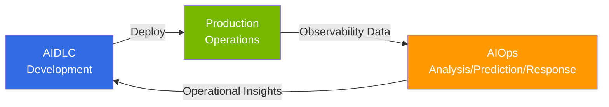

import { CoreTechStack } from '@site/src/components/AiopsIntroTables';

# AIOps: AI Approach for Operational Feedback Loops

> **Reading time**: ~3 minutes

AIOps (AI for IT Operations) is **an approach for efficiently building feedback loops for continuous improvement in production environments** after developing software with [AIDLC](/docs/aidlc). Beyond simply applying AI to monitoring, it automates feedback loops across operations — from observability data to predictive scaling, anomaly detection, and auto-remediation.

## Relationship with AIDLC

While AIDLC focuses on **"how to build"** (development methodology), AIOps focuses on **"how to operate and improve"** (operational feedback loops). These are independent domains, but they form a circular structure where operational data collected by AIOps feeds back as input for development improvement after software developed with AIDLC is deployed to production.

## Foundation: AWS Open Source Strategy

The core premise of this guide is AWS's open source strategy. AWS provides essential Kubernetes ecosystem tools as Managed Add-ons (22+), Community Add-ons Catalog, and managed open source services (AMP, AMG, ADOT), delegating operational burden to AWS while maintaining open source flexibility and portability.

Building on this foundation, **Kiro and MCP (Model Context Protocol)** have emerged as key AIOps tools. Kiro enables programmatic automation through Spec-driven development, and AWS MCP servers (50+ GA) perform EKS cluster control, CloudWatch metric analysis, and cost optimization directly within the development workflow.

<CoreTechStack />

:::info Learning Path
Read **1 → 2 → 3** in order to follow the complete journey from AIOps strategy to autonomous operations.

1. [AIOps Strategy Guide](./aiops-introduction.md) — Overall direction and AWS open source strategy
2. [Intelligent Observability Stack](./aiops-observability-stack.md) — Build 3-Pillar + AI analysis data foundation
3. [Predictive Scaling & Auto-Recovery](./aiops-predictive-operations.md) — Achieving autonomous operations
:::

## References

- [Proactive EKS Monitoring with CloudWatch](https://aws.amazon.com/blogs/containers/proactive-amazon-eks-monitoring-with-amazon-cloudwatch-operator-and-aws-control-plane-metrics/)
- [AWS MCP Servers (50+ GA)](https://github.com/awslabs/mcp)
- [Kagent - Kubernetes AI Agent](https://github.com/kagent-dev/kagent)
- [Strands Agents SDK](https://github.com/strands-agents/sdk-python)
