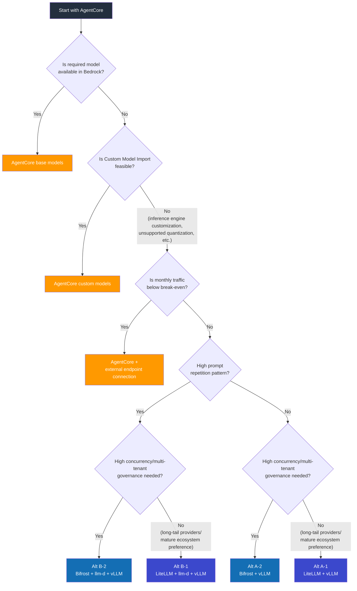

# Inference Platform Benchmark: Bedrock AgentCore vs EKS Self-Hosted

> **Written**: 2026-03-18 | **Status**: Plan

## Objective

Set Bedrock AgentCore as the default inference platform and quantitatively validate when and under what conditions EKS self-hosting becomes necessary. Also compare performance/cost differences based on LLM gateway (LiteLLM vs Bifrost) and cache-aware routing (llm-d) combinations in EKS self-hosting.

:::info Base Assumption
**Bedrock AgentCore is the default choice.** As a managed service, AWS handles build time, operational burden, and scaling. Open-source/custom models are also supported via Custom Model Import, so model support itself is not a reason for self-hosting. Self-hosting is justified only when **inference engine-level control, large-scale cost optimization, or cache routing** is required.
:::

---

## Comparison Targets

| Configuration | Description | Validation Purpose |
|--------------|-------------|-------------------|
| **Baseline. AgentCore (Base Models)** | Use Bedrock-provided models immediately | Reference point |
| **Baseline+. AgentCore (Custom Models)** | Serve custom models via Custom Model Import | Custom model performance/cost in managed environment |
| **Alt A-1. EKS + LiteLLM + vLLM** | LiteLLM gateway, standard load balancing | Self-hosting based on existing ecosystem |
| **Alt A-2. EKS + Bifrost + vLLM** | Bifrost gateway, standard load balancing | Validate high-performance gateway effect |
| **Alt B-1. EKS + LiteLLM + llm-d + vLLM** | LiteLLM + cache-aware routing | Validate llm-d additional effect |
| **Alt B-2. EKS + Bifrost + llm-d + vLLM** | Bifrost + cache-aware routing | Validate optimal combination |

### Architecture Configuration

```
Baseline:   Client → AgentCore Gateway → Bedrock Inference (base models)
Baseline+:  Client → AgentCore Gateway → Bedrock Inference (Custom Import models)

Alt A-1:    Client → LiteLLM  → kgateway (RoundRobin) → vLLM Pods
Alt A-2:    Client → Bifrost  → vLLM Pods (Bifrost load balancing)

Alt B-1:    Client → LiteLLM  → llm-d (Prefix-Cache Aware) → vLLM Pods
Alt B-2:    Client → Bifrost  → llm-d (Prefix-Cache Aware) → vLLM Pods
```

:::tip llm-d Connection Method
Since llm-d provides an OpenAI-compatible endpoint, both LiteLLM and Bifrost can integrate simply by pointing `base_url` to the llm-d service. Gateway selection and llm-d integration are independent.
:::

---

## LLM Gateway Comparison: LiteLLM vs Bifrost

Gateway selection directly impacts platform performance and operations in EKS self-hosting.

| Item | LiteLLM (Python) | Bifrost (Go) |
|------|:----------------:|:------------:|
| **Gateway Overhead** | hundreds us/req | ~11 us/req (40~50x faster) |
| **Memory Footprint** | baseline | ~68% smaller |
| **Provider Support** | 100+ | 20+ (native major providers) |
| **Cost Tracking** | built-in | built-in (hierarchical: key/team/customer) |
| **Observability** | Langfuse native integration | built-in (request tracking, Prometheus) |
| **Semantic Caching** | built-in | built-in (~5ms hit) |
| **Guardrails** | built-in | built-in |
| **MCP Tool Filtering** | limited | built-in (per Virtual Key) |
| **Governance (Virtual Keys)** | API Key management | hierarchical (key/team/customer budget/permissions) |
| **Rate Limiting** | built-in | hierarchical (key/team/customer) |
| **Fallback/Load Balancing** | built-in | built-in |
| **Web UI** | built-in | built-in (real-time monitoring) |
| **Langfuse Integration** | native plugin (config-only integration) | via OTel or Langfuse OpenAI SDK wrapper (app level) |
| **Community/References** | mature (16k+ GitHub stars) | growing (3k+ GitHub stars) |

### Why Gateway Overhead Matters in Agentic AI

Agents make multiple sequential LLM calls within a single task. Gateway overhead accumulates per call:

```
Agent 1 task = LLM call → tool → LLM call → tool → LLM call → response
               (gateway)         (gateway)         (gateway)

LiteLLM:  ~300us x 5 calls = ~1.5ms cumulative
Bifrost:  ~11us  x 5 calls = ~0.055ms cumulative

Ratio to inference time (hundreds of ms ~ seconds): 1~3% vs 0.01~0.1%
```

While negligible in single requests, tail latency differences can emerge in high-concurrency + agent multi-call environments.

---

## AgentCore Coverage

| Area | AgentCore Provides | Self-Hosting Requires |
|------|-------------------|----------------------|
| Inference (Base Models) | Claude, Llama, Mistral, etc. immediate use | vLLM + GPU + model deployment |
| Inference (Custom Models) | Custom Model Import / Marketplace | vLLM + GPU + model deployment |
| Scaling | automatic (managed) | Karpenter + HPA/KEDA |
| Agent Runtime | Agent Runtime built-in | LangGraph / Strands direct build |
| MCP Connection | MCP connector built-in | MCP server direct deployment/operation |
| Guardrails | Bedrock Guardrails | gateway built-in (Bifrost/LiteLLM) |
| Observability | CloudWatch integration | Langfuse + Bifrost/LiteLLM built-in + Prometheus |
| Security | IAM native, VPC integration | Pod Identity + NetworkPolicy |
| Operations | none (managed) | GPU monitoring, model updates, incident response |

---

## Validation Questions

| # | Question | Scenario |
|---|----------|----------|
| Q1 | Does AgentCore base model performance meet production SLA? | 1 |
| Q2 | How does Custom Model Import performance compare to direct vLLM serving? | 2 |
| Q3 | What are Custom Model Import constraints? (quantization, batch strategy, etc.) | 2 |
| Q4 | At what traffic scale does self-hosting become cost-effective? | 7 |
| Q5 | Can AgentCore handle agent workflow complexity? | 5 |
| Q6 | Is llm-d cache optimization effective enough to reverse cost differences? | 3, 6 |
| Q7 | What is AgentCore responsiveness under burst traffic? | 9 |
| Q8 | Is AgentCore isolation sufficient in multi-tenant environments? | 6 |
| Q9 | Is LiteLLM vs Bifrost gateway overhead significant in actual measurements? | 4 |
| Q10 | Does Bifrost + llm-d combination operate stably? | 4 |

---

## Test Environment

```
Region: us-east-1

Baseline (AgentCore base models):
  - Bedrock Claude 3.5 Sonnet (on-demand + provisioned)
  - Bedrock Llama 3.1 70B (on-demand)
  - AgentCore Agent Runtime + MCP connector
  - Bedrock Guardrails, CloudWatch

Baseline+ (AgentCore custom models):
  - Llama 3.1 70B fine-tuned model → Custom Model Import
  - Same AgentCore runtime

Alt A-1 (EKS + LiteLLM + vLLM):
  - EKS v1.32, Karpenter v1.2
  - g5.2xlarge (A10G) x 4, vLLM v0.7.x
  - Llama 3.1 70B (AWQ 4bit)
  - LiteLLM v1.60+ → kgateway (RoundRobin)
  - Langfuse v3.x + Prometheus

Alt A-2 (EKS + Bifrost + vLLM):
  - Same EKS/vLLM configuration
  - Bifrost (latest) → vLLM (Bifrost load balancing)
  - Bifrost built-in observability + Prometheus

Alt B-1 (EKS + LiteLLM + llm-d + vLLM):
  - Alt A-1 + llm-d v0.3+

Alt B-2 (EKS + Bifrost + llm-d + vLLM):
  - Alt A-2 + llm-d v0.3+
  - Bifrost base_url → llm-d service endpoint

Load generation: Locust + LLMPerf
```

---

## Test Scenarios

### Scenario 1: Simple Inference — AgentCore Base Performance

- Different prompts each time, input 500 / output 1000 tokens
- Concurrency: 1, 10, 50, 100, 200
- Target: Baseline (base models)
- **Validation**: Does AgentCore TTFT, TPS meet production SLA?

### Scenario 2: Custom Model Import vs Direct vLLM Serving

- Same model (Llama 3.1 70B) serving in Baseline+ vs Alt A-1/A-2
- Input 500 / output 1000 tokens, concurrency: 1, 10, 50, 100
- Measure: TTFT, TPS, E2E Latency
- **Validation**: Custom Import performance differences and constraints
  - Quantization option comparison (Import support range vs vLLM AWQ/GPTQ/FP8)
  - Batch size / concurrent processing control availability
  - Model update time requirements (Import redeployment vs vLLM rolling update)

### Scenario 3: Repeated System Prompts — Caching Effects

- 3 system prompts (2000 tokens each) fixed + user input only changes
- Concurrency: 10, 50, 100
- Target: Baseline (prompt caching) vs Alt A-1/A-2 vs Alt B-1/B-2 (llm-d)
- **Validation**: Bedrock prompt caching vs llm-d prefix caching vs Bifrost semantic caching, TTFT/cost comparison

### Scenario 4: Gateway Overhead — LiteLLM vs Bifrost

- Use LiteLLM and Bifrost as gateways for same vLLM backend
- Concurrency: 1, 10, 50, 100, 500, 1000
- llm-d presence combinations: A-1 vs A-2, B-1 vs B-2
- Measure: Gateway additional latency (p50/p95/p99), memory usage, CPU usage, error rate
- **Validation**:
  - Q9 — Does gateway overhead create meaningful differences at high concurrency?
  - Q10 — Does Bifrost → llm-d connection operate stably?
  - Cumulative overhead difference in agent multi-calls (5 turns)

### Scenario 5: Multi-turn Agent Workflow

- 5-turn conversation + 3 tool calls (web search, DB query, calculation)
- AgentCore: Agent Runtime + MCP connector
- EKS: LangGraph + MCP server (Bifrost MCP tool filtering vs LiteLLM)
- **Validation**: AgentCore Agent Runtime complex workflow handling capability, customization limits

### Scenario 6: Multi-tenant

- 5 tenants, each with different system prompts/guardrail policies
- AgentCore: IAM-based isolation
- EKS + LiteLLM: API Key-based isolation
- EKS + Bifrost: Virtual Key hierarchical governance (team/customer budget, permissions)
- EKS + llm-d: Per-tenant cache routing
- **Validation**: AgentCore isolation level vs EKS, Bifrost Virtual Key governance effect

### Scenario 7: Break-even Point Exploration

- Gradual load increase: 1, 5, 10, 30, 50, 100 req/s
- Calculate monthly cost for 6 configurations at each level
- **Validation**: Derive exact cost crossover point

### Scenario 8: Long-running Operations (24h)

- 30 req/s, maintain for 24 hours
- Total cost, stability (error rate), performance variance
- **Validation**: AgentCore cost predictability vs EKS GPU idle cost

### Scenario 9: Burst Traffic

- Normal 10 req/s → 5 minutes at 100 req/s → back to 10 req/s
- **Validation**: AgentCore throttling/queuing behavior vs EKS Karpenter scale-out delay

---

## Measurement Metrics

| Category | Metric | Baseline | Baseline+ | A-1 (LiteLLM) | A-2 (Bifrost) | B-1 (LiteLLM+llm-d) | B-2 (Bifrost+llm-d) |
|----------|--------|:--------:|:---------:|:-----:|:------:|:-----:|:------:|
| **Performance** | TTFT (p50/p95/p99) | O | O | O | O | O | O |
| | TPS (output tokens/sec) | O | O | O | O | O | O |
| | E2E Latency | O | O | O | O | O | O |
| | Throughput (req/s) | O | O | O | O | O | O |
| | Cold Start | O | O | O | O | O | O |
| **Gateway** | Gateway additional latency | - | - | O | O | O | O |
| | Gateway memory usage | - | - | O | O | O | O |
| | Gateway CPU usage | - | - | O | O | O | O |
| **Caching** | Bedrock prompt caching savings rate | O | O | - | - | - | - |
| | Semantic cache hit rate | - | - | - | O | - | O |
| | KV Cache Hit Rate | - | - | - | - | O | O |
| **Cost** | Monthly total cost (by traffic) | O | O | O | O | O | O |
| | Effective cost per token | O | O | O | O | O | O |
| | Idle cost | - | - | O | O | O | O |
| **Governance** | Tenant isolation level | O | O | O | O | O | O |
| | Budget/Rate Limit precision | O | O | O | O | O | O |
| **Operations** | Build time | O | O | O | O | O | O |
| | Failure recovery time | O | O | O | O | O | O |
| | Required personnel/skillset | O | O | O | O | O | O |

---

## Cost Simulation

### Fixed Costs (Monthly)

| Item | Baseline | Baseline+ | A-1/A-2 | B-1/B-2 |
|------|:--------:|:---------:|:-------:|:-------:|
| GPU instances (g5.2xlarge x4) | - | - | ~$4,800 | ~$4,800 |
| EKS cluster | - | - | $73 | $73 |
| llm-d (CPU Pod) | - | - | - | ~$50 |
| Gateway (LiteLLM/Bifrost) | - | - | ~$50 | ~$50 |
| Langfuse (self-hosted) | - | - | ~$100 | ~$100 |
| Bedrock provisioned | Calculated separately | Calculated separately | - | - |

### Variable Costs

| Item | Baseline | Baseline+ | A-1/A-2 | B-1/B-2 |
|------|----------|-----------|---------|---------|
| Billing method | per token | per token | GPU time allocation | GPU time allocation |
| Cache savings | prompt caching discount | prompt caching discount | semantic caching (Bifrost) | KV cache + semantic caching |
| Idle cost | none (on-demand) | none (on-demand) | GPU idle charges | GPU idle charges |

### Expected Cost Curve

```
Monthly Cost
  ^
  |  AgentCore on-demand
  |          \
  |           \                      / A-1 (LiteLLM+vLLM)
  |            \                    / A-2 (Bifrost+vLLM)
  |             \                  /
  |    AgentCore \                /  B-1 (LiteLLM+llm-d)
  |    provisioned\              /  / B-2 (Bifrost+llm-d)
  |                \            / / /
  |                 \          / / /
  |                  \        / / /
  |                   X      / /  <-- Break-even point
  |                  / \    / /
  |  EKS fixed cost/---\--/-/----------
  |               /     \/
  +-------------------------------------------> Traffic (req/s)
       5    10    30    50    100
```

| Traffic Range | Recommendation | Reason |
|--------------|---------------|--------|
| Below break-even | **AgentCore on-demand** | No GPU fixed cost, immediate start |
| Near break-even | **AgentCore provisioned** | Discounted throughput, still managed |
| Above break-even + varied prompts | **Alt A-2 (Bifrost)** | Low overhead, governance |
| Above break-even + repeated prompts | **Alt B-2 (Bifrost+llm-d)** | Cache effect + low overhead |

---

## Decision Flowchart



---

## Conditions Justifying EKS Self-Hosting

:::warning Only consider self-hosting when AgentCore is insufficient
EKS self-hosting is justified when one or more of the following conditions apply.
:::

| Condition | Reason |
|-----------|--------|
| Fine-grained inference engine control | vLLM scheduling, batch strategy, quantization (AWQ/GPTQ/FP8) free choice |
| Large-scale traffic cost optimization | Cost per token reversal above break-even point |
| KV cache routing | TTFT/GPU efficiency maximization with llm-d prefix cache |
| Multi-tenant governance | Fine-grained budget/permission control per team/customer with Bifrost Virtual Key |
| Immediate latest model adoption | Use community latest models before Bedrock Import |
| Data sovereignty / airgap | Environments where Bedrock API calls are impossible |

---

## Observability Stack Configuration

Observability stack varies based on gateway selection in EKS self-hosting.

### LiteLLM-based (A-1, B-1)

```
Application (Langfuse SDK) ──→ Langfuse Server (Trace/Span)
LiteLLM ──→ Langfuse Server (native integration, request/cost logs)
vLLM + llm-d ──→ Prometheus → Grafana (GPU, KV cache metrics)
```

### Bifrost-based (A-2, B-2)

```
Application (Langfuse SDK) ──→ Langfuse Server (Trace/Span)
Bifrost (OTel Plugin) ──→ OTLP Collector ──→ Langfuse Server (gateway-level trace)
Bifrost ──→ Prometheus → Grafana (cost/token/latency metrics)
Bifrost ──→ Bifrost Web UI (real-time monitoring)
vLLM + llm-d ──→ Prometheus → Grafana (GPU, KV cache metrics)
```

:::note Langfuse is needed regardless of gateway
Bifrost's built-in observability monitors the gateway layer (request/cost/latency). Complete agent workflow tracing (multi-call connections, prompt quality evaluation, session tracking) is handled by Langfuse. The two layers are complementary, not replacements.
:::

---

## Result Report Structure (Planned)

| Section | Content |
|---------|---------|
| Executive Summary | Clear distinction between "when AgentCore is sufficient" and "when self-hosting is needed" |
| AgentCore Base Performance | Base model TTFT, TPS, Throughput benchmarks |
| Custom Import vs vLLM | Same model performance/cost/constraint comparison |
| Gateway Comparison | LiteLLM vs Bifrost overhead, governance, stability |
| Caching Strategy Comparison | Bedrock prompt caching vs Bifrost semantic caching vs llm-d prefix caching |
| Agent Runtime Comparison | AgentCore Runtime vs LangGraph features/flexibility |
| Cost Break-even | 6-configuration cost graph by traffic range + crossover points |
| Observability Stack | Observability configuration comparison by gateway |
| Decision Guide | Workload characteristics → optimal configuration flowchart |
| Migration Path | Tasks and risks when transitioning AgentCore → EKS |
