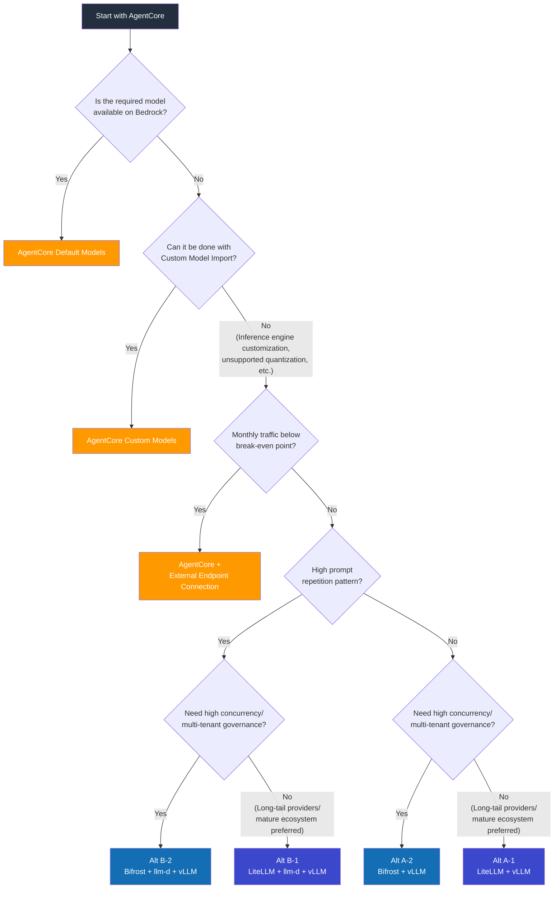

# Inference Platform Benchmark: Bedrock AgentCore vs EKS Self-Managed

> **Created**: 2026-03-18 | **Status**: Plan

## Objective

Set Bedrock AgentCore as the default inference platform and quantitatively validate when and under what conditions self-managed EKS becomes necessary. Also compare performance/cost differences across LLM gateway (LiteLLM vs Bifrost) and cache-aware routing (llm-d) combinations for self-managed EKS.

:::info Default Premise
**Bedrock AgentCore is the default choice.** As a managed service, AWS handles build time, operational burden, and scaling. Open-source/custom models are also supported via Custom Model Import, so model support alone does not justify self-management. Self-management is only justified when **inference engine-level control, large-scale cost optimization, or cache routing** is required.
:::

---

## Comparison Targets

| Configuration | Description | Validation Purpose |
|------|------|----------|
| **Baseline. AgentCore (Default Models)** | Immediately use Bedrock-provided models | Reference point |
| **Baseline+. AgentCore (Custom Models)** | Serve custom models via Custom Model Import | Custom model performance/cost in managed environment |
| **Alt A-1. EKS + LiteLLM + vLLM** | LiteLLM gateway, standard load balancing | Self-managed with existing ecosystem |
| **Alt A-2. EKS + Bifrost + vLLM** | Bifrost gateway, standard load balancing | High-performance gateway effect validation |
| **Alt B-1. EKS + LiteLLM + llm-d + vLLM** | LiteLLM + cache-aware routing | Validate llm-d added value |
| **Alt B-2. EKS + Bifrost + llm-d + vLLM** | Bifrost + cache-aware routing | Validate optimal combination |

### Architecture Configuration

```
Baseline:   Client → AgentCore Gateway → Bedrock Inference (Default Models)
Baseline+:  Client → AgentCore Gateway → Bedrock Inference (Custom Import Models)

Alt A-1:    Client → LiteLLM  → kgateway (RoundRobin) → vLLM Pods
Alt A-2:    Client → Bifrost  → vLLM Pods (Bifrost load balancing)

Alt B-1:    Client → LiteLLM  → llm-d (Prefix-Cache Aware) → vLLM Pods
Alt B-2:    Client → Bifrost  → llm-d (Prefix-Cache Aware) → vLLM Pods
```

:::tip llm-d Connection Method
llm-d provides OpenAI-compatible endpoints, so both LiteLLM and Bifrost can integrate simply by pointing their `base_url` to the llm-d service. Gateway selection and llm-d integration are independent.
:::

---

## LLM Gateway Comparison: LiteLLM vs Bifrost

The gateway choice directly impacts platform performance and operations for self-managed EKS.

| Item | LiteLLM (Python) | Bifrost (Go) |
|------|:-----------------:|:------------:|
| **Gateway Overhead** | Hundreds of us/req | ~11 us/req (40-50x faster) |
| **Memory Footprint** | Baseline | ~68% smaller |
| **Provider Support** | 100+ | 20+ (major providers native) |
| **Cost Tracking** | Built-in | Built-in (hierarchical: key/team/customer) |
| **Observability** | Langfuse native integration | Built-in (request tracing, Prometheus) |
| **Semantic Caching** | Built-in | Built-in (~5ms hit) |
| **Guardrails** | Built-in | Built-in |
| **MCP Tool Filtering** | Limited | Built-in (per Virtual Key) |
| **Governance (Virtual Keys)** | API Key management | Hierarchical (key/team/customer budget/permissions) |
| **Rate Limiting** | Built-in | Hierarchical (key/team/customer) |
| **Fallback/Load Balancing** | Built-in | Built-in |
| **Web UI** | Built-in | Built-in (real-time monitoring) |
| **Langfuse Integration** | Native plugin (configuration only) | Via OTel or Langfuse OpenAI SDK wrapper (app level) |
| **Community/References** | Mature (16k+ GitHub stars) | Growing (3k+ GitHub stars) |

### Why Gateway Overhead Matters for Agentic AI

Agents make multiple sequential LLM calls within a single task. Gateway overhead accumulates with each call:

```
Agent 1 task = LLM call → Tool → LLM call → Tool → LLM call → Response
               (gateway)        (gateway)        (gateway)

LiteLLM:  ~300us x 5 calls = ~1.5ms cumulative
Bifrost:  ~11us  x 5 calls = ~0.055ms cumulative

As ratio of inference time (hundreds of ms to seconds): 1-3% vs 0.01-0.1%
```

Negligible for single requests, but high concurrency + agent multi-call environments may show tail latency differences.

---

## AgentCore Provided Scope

| Area | AgentCore Provided | Required for Self-Managed |
|------|---------------------|----------------------|
| Inference (Default Models) | Claude, Llama, Mistral, etc. ready to use | vLLM + GPU + model deployment |
| Inference (Custom Models) | Custom Model Import / Marketplace | vLLM + GPU + model deployment |
| Scaling | Automatic (managed) | Karpenter + HPA/KEDA |
| Agent Runtime | Built-in Agent Runtime | LangGraph / Strands self-managed |
| MCP Connection | Built-in MCP Connector | Deploy/operate MCP servers |
| Guardrails | Bedrock Guardrails | Gateway built-in (Bifrost/LiteLLM) |
| Observability | CloudWatch integration | Langfuse + Bifrost/LiteLLM built-in + Prometheus |
| Security | IAM native, VPC integration | Pod Identity + NetworkPolicy |
| Operations | None (managed) | GPU monitoring, model updates, incident response |

---

## Validation Questions

| # | Question | Scenario |
|---|------|----------|
| Q1 | Does AgentCore default model performance meet production SLAs? | 1 |
| Q2 | How does Custom Model Import performance compare to direct vLLM serving? | 2 |
| Q3 | What are Custom Model Import constraints? (quantization, batch strategy, etc.) | 2 |
| Q4 | At what traffic scale does self-management become cost-effective? | 7 |
| Q5 | Can AgentCore handle complex agent workflow requirements? | 5 |
| Q6 | Is llm-d cache optimization effective enough to reverse cost differences? | 3, 6 |
| Q7 | How responsive is AgentCore during burst traffic? | 9 |
| Q8 | Is AgentCore isolation sufficient for multi-tenant environments? | 6 |
| Q9 | Is the LiteLLM vs Bifrost gateway overhead significant in practice? | 4 |
| Q10 | Does the Bifrost + llm-d combination operate stably? | 4 |

---

## Test Environment

```
Region: us-east-1

Baseline (AgentCore Default Models):
  - Bedrock Claude 3.5 Sonnet (on-demand + provisioned)
  - Bedrock Llama 3.1 70B (on-demand)
  - AgentCore Agent Runtime + MCP Connector
  - Bedrock Guardrails, CloudWatch

Baseline+ (AgentCore Custom Models):
  - Llama 3.1 70B fine-tuned model → Custom Model Import
  - Same AgentCore runtime

Alt A-1 (EKS + LiteLLM + vLLM):
  - EKS v1.32, Karpenter v1.2
  - g5.2xlarge (A10G) x 4, vLLM v0.7.x
  - Llama 3.1 70B (AWQ 4bit)
  - LiteLLM v1.60+ → kgateway (RoundRobin)
  - Langfuse v3.x + Prometheus

Alt A-2 (EKS + Bifrost + vLLM):
  - Same EKS/vLLM configuration
  - Bifrost (latest) → vLLM (Bifrost load balancing)
  - Bifrost built-in observability + Prometheus

Alt B-1 (EKS + LiteLLM + llm-d + vLLM):
  - Alt A-1 + llm-d v0.3+

Alt B-2 (EKS + Bifrost + llm-d + vLLM):
  - Alt A-2 + llm-d v0.3+
  - Bifrost base_url → llm-d service endpoint

Load Generation: Locust + LLMPerf
```

---

## Test Scenarios

### Scenario 1: Simple Inference — AgentCore Baseline Performance

- Different prompt each time, input 500 / output 1000 tokens
- Concurrency: 1, 10, 50, 100, 200
- Target: Baseline (default models)
- **Validation**: Do AgentCore TTFT, TPS meet production SLAs?

### Scenario 2: Custom Model Import vs vLLM Direct Serving

- Same model (Llama 3.1 70B) served on Baseline+ vs Alt A-1/A-2
- Input 500 / output 1000 tokens, concurrency: 1, 10, 50, 100
- Measured: TTFT, TPS, E2E Latency
- **Validation**: Performance differences and constraints of Custom Import
  - Quantization option comparison (Import supported range vs vLLM AWQ/GPTQ/FP8)
  - Batch size / concurrent processing control availability
  - Model update turnaround time (Import redeployment vs vLLM rolling update)

### Scenario 3: Repeated System Prompts — Caching Effect

- 3 fixed system prompts (2000 tokens each) + only user input varies
- Concurrency: 10, 50, 100
- Target: Baseline (prompt caching) vs Alt A-1/A-2 vs Alt B-1/B-2 (llm-d)
- **Validation**: Bedrock prompt caching vs llm-d prefix caching vs Bifrost semantic caching, TTFT/cost comparison

### Scenario 4: Gateway Overhead — LiteLLM vs Bifrost

- LiteLLM and Bifrost each used as gateway for the same vLLM backend
- Concurrency: 1, 10, 50, 100, 500, 1000
- With/without llm-d combinations: A-1 vs A-2, B-1 vs B-2
- Measured: Gateway added latency (p50/p95/p99), memory usage, CPU usage, error rate
- **Validation**:
  - Q9 — Does gateway overhead create significant differences at high concurrency?
  - Q10 — Does Bifrost → llm-d connection operate stably?
  - Cumulative overhead difference for agent multi-call (5 turns)

### Scenario 5: Multi-turn Agent Workflow

- 5-turn conversation + 3 tool calls (web search, DB query, calculation)
- AgentCore: Agent Runtime + MCP Connector
- EKS: LangGraph + MCP Server (Bifrost MCP tool filtering vs LiteLLM)
- **Validation**: AgentCore Agent Runtime complex workflow handling capability, customization limits

### Scenario 6: Multi-tenant

- 5 tenants, each with different system prompts/guardrail policies
- AgentCore: IAM-based isolation
- EKS + LiteLLM: API Key-based isolation
- EKS + Bifrost: Virtual Key hierarchical governance (per team/customer budget, permissions)
- EKS + llm-d: Per-tenant cache routing
- **Validation**: AgentCore isolation level vs EKS, Bifrost Virtual Key governance effectiveness

### Scenario 7: Break-even Point Discovery

- Gradual load increase: 1, 5, 10, 30, 50, 100 req/s
- Monthly cost calculation for 6 configurations at each level
- **Validation**: Derive precise cost crossover point

### Scenario 8: Extended Operation (24h)

- 30 req/s, maintained for 24 hours
- Total cost, stability (error rate), performance variance
- **Validation**: AgentCore cost predictability vs EKS GPU idle costs

### Scenario 9: Burst Traffic

- Normal 10 req/s → 100 req/s for 5 min → back to 10 req/s
- **Validation**: AgentCore throttling/queuing behavior vs EKS Karpenter scale-out delay

---

## Measured Metrics

| Category | Metric | Baseline | Baseline+ | A-1 (LiteLLM) | A-2 (Bifrost) | B-1 (LiteLLM+llm-d) | B-2 (Bifrost+llm-d) |
|----------|--------|:--------:|:---------:|:-----:|:------:|:-----:|:------:|
| **Performance** | TTFT (p50/p95/p99) | O | O | O | O | O | O |
| | TPS (output tokens/sec) | O | O | O | O | O | O |
| | E2E Latency | O | O | O | O | O | O |
| | Throughput (req/s) | O | O | O | O | O | O |
| | Cold Start | O | O | O | O | O | O |
| **Gateway** | Gateway Added Latency | - | - | O | O | O | O |
| | Gateway Memory Usage | - | - | O | O | O | O |
| | Gateway CPU Usage | - | - | O | O | O | O |
| **Caching** | Bedrock Prompt Caching Savings | O | O | - | - | - | - |
| | Semantic Cache Hit Rate | - | - | - | O | - | O |
| | KV Cache Hit Rate | - | - | - | - | O | O |
| **Cost** | Monthly Total Cost (per traffic level) | O | O | O | O | O | O |
| | Effective Cost per Token | O | O | O | O | O | O |
| | Idle Cost | - | - | O | O | O | O |
| **Governance** | Tenant Isolation Level | O | O | O | O | O | O |
| | Budget/Rate Limit Precision | O | O | O | O | O | O |
| **Operations** | Build Time | O | O | O | O | O | O |
| | Disaster Recovery Time | O | O | O | O | O | O |
| | Required Personnel/Skill Set | O | O | O | O | O | O |

---

## Cost Simulation

### Fixed Costs (Monthly)

| Item | Baseline | Baseline+ | A-1/A-2 | B-1/B-2 |
|------|:--------:|:---------:|:-------:|:-------:|
| GPU Instances (g5.2xlarge x4) | - | - | ~$4,800 | ~$4,800 |
| EKS Cluster | - | - | $73 | $73 |
| llm-d (CPU Pod) | - | - | - | ~$50 |
| Gateway (LiteLLM/Bifrost) | - | - | ~$50 | ~$50 |
| Langfuse (self-hosted) | - | - | ~$100 | ~$100 |
| Bedrock Provisioned | Separate calculation | Separate calculation | - | - |

### Variable Costs

| Item | Baseline | Baseline+ | A-1/A-2 | B-1/B-2 |
|------|----------|-----------|---------|---------|
| Billing Method | Per token | Per token | GPU time allocation | GPU time allocation |
| Cache Savings | Prompt caching discount | Prompt caching discount | Semantic caching (Bifrost) | KV cache + semantic caching |
| Idle Cost | None (on-demand) | None (on-demand) | Charged during GPU idle | Charged during GPU idle |

### Expected Cost Curve

```
Monthly Cost
  ^
  |  AgentCore On-Demand
  |          \
  |           \                      / A-1 (LiteLLM+vLLM)
  |            \                    / A-2 (Bifrost+vLLM)
  |             \                  /
  |    AgentCore \                /  B-1 (LiteLLM+llm-d)
  |    Provisioned\              /  / B-2 (Bifrost+llm-d)
  |                \            / / /
  |                 \          / / /
  |                  \        / / /
  |                   X      / /  <-- Break-even point
  |                  / \    / /
  |  EKS Fixed Cost-/---\--/-/----------
  |               /     \/
  +-------------------------------------------> Traffic (req/s)
       5    10    30    50    100
```

| Traffic Range | Recommendation | Reason |
|------------|------|------|
| Below break-even | **AgentCore On-Demand** | No GPU fixed costs, instant start |
| Around break-even | **AgentCore Provisioned** | Discounted throughput, still managed |
| Above break-even + diverse prompts | **Alt A-2 (Bifrost)** | Low overhead, governance |
| Above break-even + repeated prompts | **Alt B-2 (Bifrost+llm-d)** | Cache effect + low overhead |

---

## Decision Flowchart



---

## Conditions Justifying EKS Self-Management

:::warning Only consider self-management when AgentCore is insufficient
Self-managed EKS is justified when one or more of the following conditions apply.
:::

| Condition | Reason |
|------|------|
| Fine-grained inference engine control | Free choice of vLLM scheduling, batch strategy, quantization (AWQ/GPTQ/FP8) |
| Large-scale traffic cost optimization | Cost per token reversal above break-even point |
| KV cache routing | Maximize TTFT/GPU efficiency with llm-d prefix cache |
| Multi-tenant governance | Fine-grained per-team/customer budget/permission control with Bifrost Virtual Keys |
| Immediate latest model adoption | Use community latest models before Bedrock Import |
| Data sovereignty / Air-gapped | Environments where Bedrock API calls are impossible |

---

## Observability Stack Configuration

The observability stack differs based on gateway choice for self-managed EKS.

### LiteLLM-based (A-1, B-1)

```
Application (Langfuse SDK) ──→ Langfuse Server (Trace/Span)
LiteLLM ──→ Langfuse Server (native integration, request/cost logs)
vLLM + llm-d ──→ Prometheus → Grafana (GPU, KV cache metrics)
```

### Bifrost-based (A-2, B-2)

```
Application (Langfuse SDK) ──→ Langfuse Server (Trace/Span)
Bifrost (OTel Plugin) ──→ OTLP Collector ──→ Langfuse Server (gateway-level traces)
Bifrost ──→ Prometheus → Grafana (cost/token/latency metrics)
Bifrost ──→ Bifrost Web UI (real-time monitoring)
vLLM + llm-d ──→ Prometheus → Grafana (GPU, KV cache metrics)
```

:::note Langfuse is needed regardless of gateway
Bifrost's built-in observability monitors the gateway layer (requests/cost/latency). Full agent workflow tracing (connecting multi-calls, prompt quality evaluation, session tracking) is handled by Langfuse. The two layers are complementary, not replacements.
:::

---

## Result Report Structure (Planned)

| Section | Content |
|------|------|
| Executive Summary | Clear distinction between "when AgentCore is sufficient" and "when self-management is needed" |
| AgentCore Baseline Performance | Default model TTFT, TPS, Throughput baselines |
| Custom Import vs vLLM | Same model performance/cost/constraint comparison |
| Gateway Comparison | LiteLLM vs Bifrost overhead, governance, stability |
| Caching Strategy Comparison | Bedrock prompt caching vs Bifrost semantic caching vs llm-d prefix caching |
| Agent Runtime Comparison | AgentCore Runtime vs LangGraph capabilities/flexibility |
| Cost Break-even | 6-configuration cost graph per traffic range + crossover points |
| Observability Stack | Per-gateway observability configuration comparison |
| Decision Guide | Workload characteristics → optimal configuration flowchart |
| Migration Path | Work and risks when transitioning from AgentCore → EKS |
