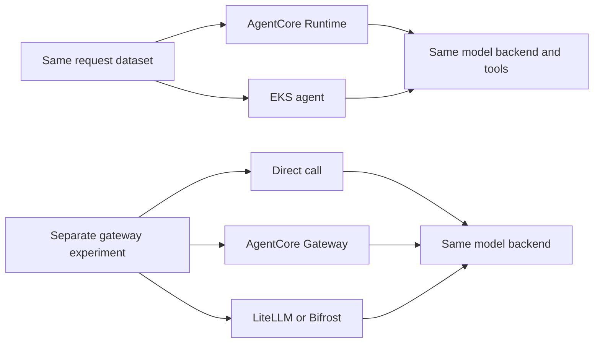
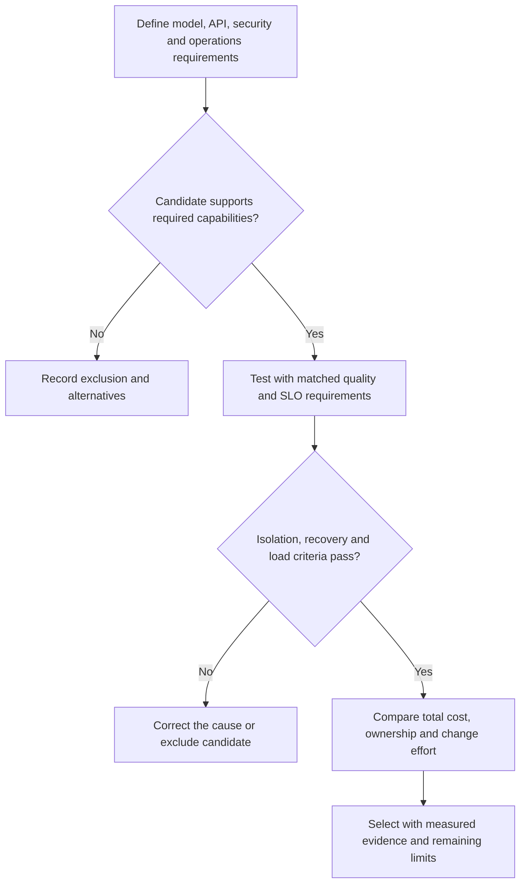

:::info Verification status
This is an experiment plan. No deployment, load test or cost measurement has been performed. Service responsibilities and support boundaries were reviewed against official documentation on 2026-09-19. The execution region, versions and model are not yet selected.
:::

## Objective

Before choosing AgentCore or EKS for an agent service, separate the components being compared. AgentCore Runtime hosts agent code, model servers perform inference, and gateways authenticate and forward requests. Changing all three together makes it difficult to explain a performance difference.

This plan compares runtime hosting, model serving and gateways independently, then tests a complete workflow using validated combinations. It does not assume that one product is always faster or cheaper.

## Comparison Targets

| Experiment | Variable | Controls | Decision evidence |
| --- | --- | --- | --- |
| R: Agent execution | AgentCore Runtime / the same agent hosted on EKS | Framework, code, model backend, tools and requests | Startup, waiting, execution, recovery and session behavior |
| M: Model serving | Bedrock Custom Model Import / EKS model server | A checkpoint and tokenizer supported by both, inputs/outputs and quality criteria | TTFT, generation speed, sustainable throughput and billing |
| G: Gateway | Direct call / AgentCore Gateway / LiteLLM / Bifrost | Backend, protocol, authentication, policy, load and network path | Added latency, error handling, access control and operating cost |

Comparing a managed model with a different open-weight model is a separate **product-selection experiment**. Different models have different quality and compute requirements; their results do not isolate runtime performance.

### Architecture Configuration


```mermaid
flowchart LR
    C[Same request dataset] --> R1[AgentCore Runtime]
    C --> R2[EKS agent]
    R1 --> B[Same model backend and tools]
    R2 --> B
    G[Separate gateway experiment] --> G1[Direct call]
    G --> G2[AgentCore Gateway]
    G --> G3[LiteLLM or Bifrost]
    G1 --> M[Same model backend]
    G2 --> M
    G3 --> M
```

R and G are independent experiments, not a mandatory chain containing every box. Evaluate llm-d cache/load-aware routing as an additional EKS model-serving experiment rather than changing it together with the gateway.

## LLM Gateway Comparison: LiteLLM vs Bifrost

LiteLLM and Bifrost are candidates for G. AgentCore Gateway also supports model-based inference routing and belongs in the candidate set. Similar feature names do not establish equivalent authentication, licensing, backend or streaming behavior. The table below is a **test contract for each candidate**, not a verified product support matrix.

| Capability to test | Acceptance condition |
| --- | --- |
| API and streaming | Preserve the selected model's input, error, tool-call, cancellation and stream-completion semantics |
| Authentication and authorization | Reject invalid tokens, cross-tenant model/tool access and bypass paths |
| Budgets and rate limits | Record enforcement scope and concurrent-request overshoot |
| Retries and fallback | Observe retry count, duplicate charges, failure after partial output and model changes |
| Cache | Verify tenant/authorization/model scope, expiry, invalidation and incorrect answer reuse |
| Observability and operations | Trace requests; measure errors, CPU/memory; verify log redaction and upgrade procedures |

Provider counts, GitHub stars and claims such as “40–50 times faster” are not performance evidence for this plan. If a vendor benchmark is cited, include its version, load, enabled features and independent reproduction status.

### Why Gateway Overhead Matters for Agentic AI

Multiple model calls can create multiple gateway traversals. Tool calls do not necessarily traverse that gateway, however, and parallel-call latency cannot simply be added. Use traces to establish the actual serial path, loops and retries.

Compare the same backend directly and through each gateway. Match network distance, TLS reuse, authentication, policy and observability before attributing added latency to the gateway.

## AgentCore Provided Scope

| Layer | Responsibility and reviewed support | Conditions still to verify |
| --- | --- | --- |
| AgentCore Runtime | Hosts agent code, including frameworks such as LangGraph and Strands | Code, permissions, sessions, networking, versions and operating policy |
| Runtime microVM | Isolated sessions; documented duration up to eight hours | Lifecycle, platform version, startup and resume behavior |
| Runtime Instances | AWS-managed EC2 execution in the account; GPU and long-running sessions, documented up to 14 days | Capacity provider, instances, region, shared execution and billing |
| AgentCore Gateway | Tool, agent and model connectivity; MCP conversion, passthrough and inference routing | Target types, protocols, authentication and policy support |
| Bedrock model API | Inference for supported models | Model, region, quota, API and pricing |
| Bedrock Custom Model Import | Imports and serves custom checkpoints with supported architectures | Weight format/size, context, API, region and CMU billing |

Custom Model Import is a separate Bedrock feature, not a model server built into AgentCore Runtime. LangGraph can run on Runtime, so “AgentCore Runtime vs LangGraph” compares different layers. Managed services still require application permissions, data policy, model evaluation and incident response.

## Validation Questions

| Question | Experiment and evidence |
| --- | --- |
| Does the same agent produce equivalent outcomes in both environments? | R: outputs, tool calls, session recovery and quality evaluation |
| Can the same model be served on both sides? | M: supported architecture, checkpoint, precision and tokenizer, followed by deployment validation |
| What costs and constraints does a gateway add? | G: latency, errors, resources and charges with equivalent policies |
| Does caching help this workload? | Separate hit/miss, quality, isolation and cost for each cache type |
| Where do costs differ with load? | Throughput that meets the SLO and actual billing units |
| Is behavior predictable during failures and bursts? | Quotas, timeouts, retries, recovery and duplicate work |

## Test Environment

Before execution, freeze the following in one manifest referenced by both language reports.

| Item | Required record |
| --- | --- |
| Deployment scope | Account role, region, dedicated cluster/namespace, network distance and cost limit |
| Runtime | Compute type, platform version, image digest, framework and SDK versions |
| Model | Checkpoint revision, tokenizer/chat template, precision and maximum input/output lengths |
| EKS model server | EKS/node/driver/CUDA/server versions, GPU count/memory, replica TP/PP placement |
| Gateway and routing | Product/version/features, authentication, TLS, retries, cache, routing/disaggregation |
| Data | Dataset hash, anonymization, length distributions, arrival pattern and evaluation answers |
| Cost | Price date, region, purchase option, currency, billing units and observation period |

The earlier “Llama 4 Maverick 70B” label was incorrect and has been removed. Select an identical checkpoint supported by both backends, not models with similar names. The reviewed Custom Model Import architecture list does not include Llama 4, so do not assume support. GPU memory across nodes is also not automatically combined for one replica; establish model partitioning and communication before selecting the GPU count.

## Test Scenarios

### Scenario 1: Simple Inference — AgentCore Baseline Performance

For R, have the same agent call the same model backend once. Measure client request to first response and completion, and separate Runtime startup, agent execution and model wait using traces. Report active, new and resumed sessions separately.

### Scenario 2: Custom Model Import vs vLLM Direct Serving

Begin M by selecting an importable model. Check architecture, weights, context and region restrictions against official documentation and the actual import result. If precision or chat templates cannot be matched, document the difference and evaluate quality equivalence separately. Unsupported combinations are excluded with a reason, not assigned a performance score of zero.

### Scenario 3: Repeated System Prompts — Caching Effect

Prompt/prefix caches reuse processing of an input prefix. Semantic response caches reuse an answer to a similar question and may skip inference entirely. Their hit ratios are therefore not interchangeable.

Bedrock prompt caching has model/API-specific support, minimum lengths, TTLs and pricing; repeating input does not guarantee a hit. Collect actual cache usage fields. For EKS prefix routing, keep model replicas and cache settings fixed while changing routing. Evaluate semantic caching separately for correctness, freshness and tenant isolation.

### Scenario 4: Gateway Overhead — LiteLLM vs Bifrost

In G, connect the direct path, AgentCore Gateway, LiteLLM and Bifrost to the same backend. Separate common-feature comparisons from runs with product-specific additions enabled. Measure end-to-end latency, gateway processing and upstream wait, CPU/memory, errors, retries and cancellation.

Changing `base_url` alone does not establish compatibility. Validate authentication, API format, model identifiers, tool calls and streaming first. Adding llm-d is a separate experiment after this comparison.

### Scenario 5: Multi-turn Agent Workflow

Extend R using the same framework, code, model and tool responses. Separate repeatable runs with fixed tool responses from runs against live external tools. Report completion, quality, duplicate tool execution, session recovery and serial/parallel call counts.

### Scenario 6: Multi-tenant

Test denied cross-tenant access to models, tools, memory, caches and traces as well as successful authorized requests. A tenant ID in a cache key does not by itself prove authorization isolation. Include permission changes, session reuse, revoked users and concurrent budget overshoot.

### Scenario 7: Break-even Point Discovery

Calculate total cost by load for configurations meeting the same quality, SLO and availability targets. Record requests, tokens, input/output ratio, cache hits, idle time and replica changes. Do not assume self-hosting must become cheaper above a particular traffic level.

### Scenario 8: Extended Operation (24h)

Twenty-four hours is the observation period, not an assumed single-session lifetime. Test stop, resume and replacement within the compute type's lifecycle limits. Collect memory growth, connection leaks, quotas, token renewal, log costs and recovered state.

### Scenario 9: Burst Traffic

Replay the same arrival trace and verify that the load generator achieves it. Separate autoscaling delay, quota/throttling, queues/timeouts and retry amplification. Match the initial state and warm capacity or document their differences.

## Measured Metrics

| Metric | Definition and reporting condition |
| --- | --- |
| TTFT | Client request start to first valid output token; explicitly define connection/authentication/queue inclusion |
| ITL and per-request generation | Streaming token intervals and output tokens divided by generation time for each request |
| Aggregate throughput | Successful requests/s and output tokens/s over the observation window; errors/cancellations separate |
| E2E and quality | Completion p50/p95/p99, answer correctness, tool execution and task completion |
| Gateway | Added cost relative to the direct path; processing separated from backend wait |
| Cache | Actual hit/miss, reused tokens, incorrect answers and tenant boundaries by cache type |
| Resources and operations | CPU/memory/GPU/queues, startup/recovery, change and response work |
| Cost | Total billing-period cost and cost per successful request/valid output token |

Report run counts, duration, distributions and uncertainty. Latency calculated only from successful requests is not a complete service assessment. Measured values are not yet available for this table.

## Cost Simulation

### Fixed Costs (Monthly)

Include the EKS control plane, required nodes/always-on replicas, storage, load balancers and observability infrastructure. Add the applicable capacity charges for Runtime Instances or reserved/minimum capacity when selected. Do not use unsupported constants such as “Langfuse $100” without deployment size and pricing evidence.

### Variable Costs

| Layer | Cost basis |
| --- | --- |
| AgentCore Runtime | Actual CPU, memory, instance or other billing units for the compute type/platform version |
| AgentCore Gateway | Features and call volume, separate from model inference charges |
| Bedrock model API | Selected model's input, output, cache and throughput-option pricing |
| Custom Model Import | CMUs per model copy and actual billed duration/windows |
| EKS serving | Node/GPU runtime, scaling, storage/network, observability and operations |

Do not model Custom Model Import as universally token-priced or free while idle. Official guidance describes five-minute billing windows from the first successful inference call. With a per-CMU-minute rate, use consistent units: **CMUs × billed minutes × rate per minute**, summed across intervals when copy counts change. Validate against the actual region/CMU-version prices and billing records.

### Expected Cost Curve

There is no measured cost curve yet. The earlier diagram in which total cost decreased with growing traffic and its unsupported recommendation bands have been removed.

```text
Total cost = runtime + gateway + model inference
           + cluster/compute + storage/network + observability + operations
Cost per successful request = total cost / successful requests
Cost per million output tokens = total cost * 1,000,000 / valid output tokens
```

Count overlapping items only once. A lower cost per token or request does not necessarily mean a lower monthly total. Annotate replica growth and changes to discounts, caching or batching. Do not mix future pricing terms with those available on the review date.

## Decision Flowchart


```mermaid
flowchart TD
    A[Define model, API, security and operations requirements] --> B{Candidate supports required capabilities?}
    B -->|No| C[Record exclusion and alternatives]
    B -->|Yes| D[Test with matched quality and SLO requirements]
    D --> E{Isolation, recovery and load criteria pass?}
    E -->|No| F[Correct the cause or exclude candidate]
    E -->|Yes| G[Compare total cost, ownership and change effort]
    G --> H[Select with measured evidence and remaining limits]
```

## Conditions Justifying EKS Self-Management

Consider EKS when the service requires direct control over model serving, GPU placement, networking or routing. First establish support for the required model, precision, distributed execution and policies in the actual configuration. High traffic or repeated prefixes alone do not guarantee lower cost.

Avoiding external model API calls differs from a complete air gap. Ordinary EKS operation involves connectivity to AWS control-plane, authentication, image and other required services. Labeling a deployment “EKS” does not resolve a disconnected-environment requirement; verify the operating model's connectivity first.

## Observability Stack Configuration

Propagate request IDs and trace context across clients, Runtime, gateways, model servers and tools. Use common formats such as OpenTelemetry where supported, validating SDK/exporter compatibility. Select tools against observability requirements rather than making a particular vendor mandatory for every configuration.

### LiteLLM-based (A-1, B-1)

Connect supported gateway callbacks/exporters with application traces. A-1/B-1 remain in this heading to preserve identifiers from the earlier plan; the current design records G and optional llm-d results separately.

### Bifrost-based (A-2, B-2)

Verify the selected version's metric, trace and integration paths, then compare the same dashboard measures. A-2/B-2 are also legacy identifiers, not preselected recommendations. Restrict prompt, response and tool-argument logging to the approved redaction, retention and access policy.

## Result Report Structure (Planned)

The report will first present R/M/G manifests, support verification, original run artifacts and aggregation methods. It will then compare complete-workflow quality, isolation, recovery, load and costs. Mark unexecuted and unsupported features as `not_run` and `unsupported`; do not substitute performance numbers for either status.

Record failure conditions, operating responsibilities and excluded workloads as well as advantages. The current deliverable is the plan and the official evidence below. Performance winners and break-even points remain unverified.

- [AgentCore Runtime compute types, frameworks and sessions](https://docs.aws.amazon.com/bedrock-agentcore/latest/devguide/agents-tools-runtime.html)
- [AgentCore Gateway tool, agent and model connectivity](https://docs.aws.amazon.com/bedrock-agentcore/latest/devguide/gateway.html)
- [Custom Model Import support](https://docs.aws.amazon.com/bedrock/latest/userguide/model-customization-import-model.html)
- [Custom Model Import billing units](https://docs.aws.amazon.com/bedrock/latest/userguide/import-model-calculate-cost.html)
- [Bedrock prompt caching](https://docs.aws.amazon.com/bedrock/latest/userguide/prompt-caching.html)
- [AgentCore pricing](https://aws.amazon.com/bedrock/agentcore/pricing/)
- [llm-d routing and model-server responsibilities](https://github.com/llm-d/llm-d)
