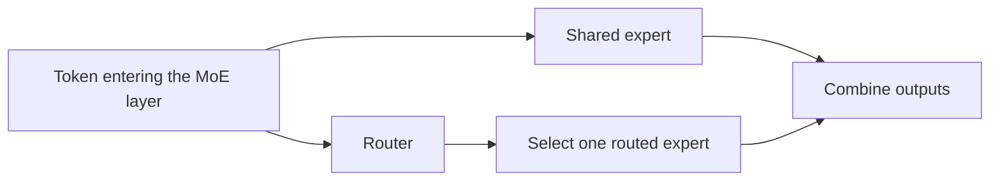

## Overview

Choosing an instance for Llama 4 serving on EKS starts with checking model fit, then measuring response time and cost under equivalent request and quality conditions. This document records specifications and test conditions for comparing NVIDIA GPUs with AWS Trainium2 and Inferentia2.

:::info Measurement status
The repository does not contain raw requests, repeated-run results or a pinned execution configuration that can validate the previous performance tables. Those tables also included a projection disclaimer, conflicting Korean/English costs and inconsistent arithmetic. Their values and rankings have been removed. The hardware and model specifications below are source-backed facts; TTFT, throughput and cost comparisons remain **pending measurement**.
:::

## Test Environment

The candidate specifications are listed below. Aggregate accelerator memory alone does not establish model compatibility or performance.

| Candidate | Accelerators | Accelerator memory | Network specification |
| --- | --- | --- | --- |
| A: p5.48xlarge | Eight H100 GPUs | 8 × 80GB = 640GB | Up to 3,200Gbps |
| B: p4d.24xlarge | Eight A100 GPUs | 8 × 40GB = 320GB | 400Gbps |
| C: g6e.48xlarge | Eight L40S GPUs | 8 × 48GB = 384GB | 400Gbps |
| D: trn2.48xlarge | 16 Trainium2 chips | 96GB per chip; specified as 1.5TB total | 3,200Gbps |
| E: inf2.48xlarge | 12 Inferentia2 chips | 12 × 32GB = 384GB | 100Gbps |

Sources: [P5][p5], [P4][p4], [G6e][g6e], [Trn2][trn2] and [Inf2][inf2]. Units follow each product specification. L40S uses [PCIe Gen4 x16][l40s], not Gen5. The network figures are neither token-generation rates nor measurements of communication between GPUs.

Before execution, pin account/region/AZ, EKS/OS/driver versions, node count, image digest, model revision, precision, TP/EP placement and maximum context length. Input 512/output 128 tokens is an **initial proposal**; test long inputs and the service's actual request distribution separately. Record weight downloads, compilation and warm-up separately from steady-state inference.

## Test Model

| Item | Llama 4 Scout | Llama 4 Maverick |
| --- | --- | --- |
| Official Instruct checkpoint | `meta-llama/Llama-4-Scout-17B-16E-Instruct` | `meta-llama/Llama-4-Maverick-17B-128E-Instruct` |
| Total parameters | 109B | 400B |
| Active parameters per token | 17B | 17B |
| Routed experts | 16 | 128 |
| Official model context limit | 10M tokens | 1M tokens |
| BF16 weight arithmetic | Approximately 218GB | Approximately 800GB |

Source: [Meta model card][model-card]. Weight estimates use B = 10⁹ parameters and two bytes per parameter, excluding KV cache, buffers and quantization metadata. A model's context limit does not mean every runtime/hardware configuration can accommodate it.

### Llama 4 MoE Architecture Characteristics

MoE selects part of the expert computation for each token. Llama 4 uses a shared expert plus **one routed expert** selected by the router. Describing this as selecting two of the 16 routed experts is incorrect.[^routing]



Fewer active parameters do not eliminate storage for the other experts' weights. Scout's BF16 weights cannot all reside on one 80GB H100, and Maverick's BF16 weights exceed the 640GB across eight H100 GPUs. Quantization, distributed placement or offload must be included in the configuration and cost comparison.

The April 2025 [vLLM Llama 4 announcement][vllm-llama4] describes eight-H100 examples with 1M context for Scout BF16 and roughly 430K for Maverick **FP8**. These are historical configuration examples, not universal runtime limits or results reproduced by this repository.

## Measurements and Result Status {#benchmark-results}

| Item | Current status | Evidence needed |
| --- | --- | --- |
| TTFT and ITL | Pending | Per-request timestamps, output tokens, errors and timeouts |
| Throughput and concurrency | Pending | Actual request counts, successful output tokens and measurement windows |
| Memory and accelerator use | Pending | Worker time series, batch and context settings |
| Cost | Pending | Cost and successful output tokens over the same period, with a pricing basis |

### 1. Time to First Token (TTFT)

Measure from request start to the first output token. Distinguish client measurements, which include queues and networking, from server processing time. Keep cold starts separate from steady state, and cache hits separate from misses. Retain per-request distributions and sample counts.

### 2. Inter-Token Latency (ITL)

Measure intervals between successive output tokens in a streaming response. Calculating only an average after the response completes can hide pauses. Separate first-token time from ITL and document measurement resolution when a streaming chunk contains several tokens.

### 3. Inference Throughput

Calculate aggregate throughput as **successfully delivered output tokens ÷ measurement seconds**. Report input tokens, per-request generation speed and totals across replicas separately. Hold context, precision and output quality constant. Quickly failing requests must not count as useful throughput.

### 4. Concurrent Request Scaling

Starting with 1, 4, 8, 16 and 32 concurrent requests is an initial plan. At each step record actual concurrency, queues, TTFT/ITL, errors and memory use. Include a separate fixed-arrival-rate test to distinguish server behavior from a load generator that submits fewer requests when responses slow down.

Do not confuse a single output stream with aggregate throughput across requests. For example, a single stream with a constant 8ms ITL produces approximately 125 tokens/s during token generation. Reporting that alongside 4,200 tokens/s for one request requires evidence explaining the different measurement boundaries.

### 5. Cost Efficiency

Use cost and successful output tokens from the same measurement period.

```text
Cost per 1M output tokens
  = period cost / successful output tokens × 1,000,000

Using hourly cost and steady-state throughput
  = hourly cost × 1,000,000 / (output tokens/s × 3,600)
```

Record pricing region/date/purchase option and replica count. State whether nodes, EKS, storage, networking, idle time and compilation are included. The billed resource boundary must match the resources producing the throughput. Without those records, no candidate can be declared the cheapest per token.

## Conditions for Interpreting Results {#analysis-and-key-findings}

### GPU vs Custom Silicon Trade-offs

| Decision | What to verify |
| --- | --- |
| Model fit | Checkpoint, operators, precision and multimodal inputs supported by the selected backend |
| Memory and communication | Full weights and KV cache fit the worker layout; TP/EP communication bottlenecks |
| Operations | Compilation, startup, upgrades and recovery time/procedures |
| Service quality | Equivalent evaluation data and TTFT/ITL/error requirements |
| Cost and capacity | Available regional capacity and actual utilization |

This neither makes a CUDA kernel directly portable to Neuron nor implies that Neuron cannot serve Llama 4. The [NxD Inference model list][neuron-models] includes Scout and Maverick. A listed model architecture does not establish every instance, precision and context combination.

### MoE Architecture Performance Impact

Expert selection, weight placement, batch size and memory bandwidth interact. Active parameter count alone does not predict speed or cost relative to a dense model. KV cache size also depends on attention configuration, context and KV precision; MoE by itself does not establish better cache efficiency.

The [MetaShuffling article][metashuffling] describes a particular MoE kernel implementation and test conditions. It is not evidence that every vLLM deployment automatically uses that optimization. Test its effect only after verifying integration in the selected backend.

## Workload Decision Criteria {#recommendations-by-workload}

### Scenario Selection Guide

| Workload | First requirement to check |
| --- | --- |
| Interactive service | TTFT, ITL and errors at the target arrival rate |
| Long-document processing | Long-input memory, prefill time and concurrent capacity |
| Batch work | Cost per successful output token within the quality requirement and deadline |
| Multiple models | Model placement, replacement time and resource isolation |
| Variable traffic | Startup/compilation, idle cost and quality during scale-out |

No candidate is a validated winner in this comparison yet. After measurement, compare cost among candidates that meet the workload's quality and latency requirements.

## Configuration Notes

### vLLM Deployment Settings

Save the official checkpoint name/revision, container digest, driver/CUDA combination, precision, TP/EP, maximum context and batch settings. Start with short requests to validate loading, output and memory before expanding context and load. This document does not report an executed installation or a successfully started model.

### Neuron SDK Compatibility Notes

Neuron has different generations of vLLM integration. Do not combine installation commands, settings or feature tables from the [legacy NxD Inference guide][neuron-vllm] and the [vLLM Neuron plugin][neuron-plugin]. Select an SDK/plugin/runtime combination and verify its model and input support. Adding one device option to a GPU `vllm serve` command does not establish an equivalent Neuron deployment.

### Cost Optimization Strategies

Quantization, larger batches and Spot capacity are separate test conditions. Each can affect output quality, latency, interruption/recovery and idle cost. Use costs from runs that meet the service requirements rather than assuming a fixed savings percentage.

## References

- [Meta Llama 4 model card][model-card]
- [vLLM Llama 4 announcement — 2025-04-05][vllm-llama4]
- [MetaShuffling implementation and test conditions][metashuffling]
- [AWS Neuron supported models][neuron-models]
- [NVIDIA L40S specifications][l40s]

[model-card]: https://github.com/meta-llama/llama-models/blob/main/models/llama4/MODEL_CARD.md
[vllm-llama4]: https://vllm.ai/blog/2025-04-05-llama4
[metashuffling]: https://pytorch.org/blog/metashuffling-accelerating-llama-4-moe-inference/
[p5]: https://aws.amazon.com/ec2/instance-types/p5/
[p4]: https://aws.amazon.com/ec2/instance-types/p4/
[g6e]: https://aws.amazon.com/ec2/instance-types/g6e/
[trn2]: https://aws.amazon.com/ec2/instance-types/trn2/
[inf2]: https://aws.amazon.com/ec2/instance-types/inf2/
[l40s]: https://www.nvidia.com/en-us/data-center/l40s/
[neuron-models]: https://awsdocs-neuron.readthedocs-hosted.com/en/latest/libraries/nxd-inference/developer_guides/model-reference.html
[neuron-vllm]: https://awsdocs-neuron.readthedocs-hosted.com/en/latest/libraries/nxd-inference/developer_guides/vllm-user-guide.html
[neuron-plugin]: https://github.com/vllm-project/vllm-neuron
[^routing]: [MetaShuffling's shared and routed expert description][metashuffling].
