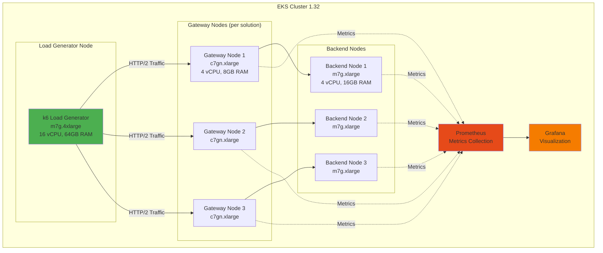

# Gateway API Implementation Performance Benchmark Plan

> 📅 **Written**: 2026-02-12 | **Last Modified**: 2026-02-14 | ⏱️ **Reading Time**: ~5 min

A systematic benchmark plan to objectively compare 5 Gateway API implementations in identical Amazon EKS environments. Quantitatively identify each solution's strengths and weaknesses to make data-driven architectural decisions.

:::tip Related Documentation
This benchmark plan targets the 5 solutions analyzed in the [Gateway API Adoption Guide](/docs/infrastructure-optimization/gateway-api-adoption-guide).
:::

## 1. Benchmark Objectives

This benchmark aims to objectively compare 5 Gateway API implementations in identical EKS environments, quantitatively identifying each solution's strengths and weaknesses to enable data-driven architecture decisions.

**Core Questions:**
- Which solution is fastest? (throughput, latency)
- Which solution has the best resource efficiency? (performance per CPU/Memory)
- Which solution scales best in large environments?
- What are the trade-offs of each solution?

## 2. Test Environment Design

## 3. Test Scenarios

### 1. Basic Throughput (Throughput Test)

**Objective:** Measure maximum RPS (Requests Per Second)

Increase concurrent connections from 100, 500, 1000, 5000 to measure maximum throughput for each solution.

### 2. Latency Profile

**Objective:** Measure P50/P90/P99/P99.9 latency

Measure response time distribution under constant load to compare tail latency.

### 3. TLS Performance

**Objective:** Measure TLS termination throughput and handshake time

Measure TLS termination performance and handshake overhead in HTTPS traffic.

### 4. L7 Routing Complexity

**Objective:** Performance changes when applying header-based routing and URL rewrite

Measure the impact of complex routing rules on performance.

### 5. Scaling Test

**Objective:** Performance changes as Route count increases (10, 50, 100, 500 routes)

Measure routing performance and memory usage with many HTTPRoutes.

### 6. Resource Efficiency

**Objective:** Throughput per CPU/Memory usage

Compare efficiency of each solution under identical resource constraints.

### 7. Failure Recovery

**Objective:** Traffic impact during controller restart

Measure downtime and recovery time when Gateway controller restarts.

### 8. gRPC Performance

**Objective:** gRPC streaming throughput

Measure gRPC protocol support and performance.

## 4. Measurement Metrics

| Metric | Unit | Measurement Method |
|--------|------|-------------------|
| **RPS (Requests Per Second)** | req/s | k6 summary or Prometheus rate() |
| **Latency (P50/P90/P99)** | ms | k6 histogram_quantile or Grafana |
| **Error Rate** | % | (failed requests / total requests) × 100 |
| **CPU Usage** | % | Prometheus container_cpu_usage_seconds_total |
| **Memory Usage** | MB | Prometheus container_memory_working_set_bytes |
| **Connection Setup Time** | ms | k6 http_req_connecting |
| **TLS Handshake Time** | ms | k6 http_req_tls_handshaking |
| **Network Throughput** | Mbps | Prometheus rate(container_network_transmit_bytes_total) |

## 5. Expected Results (Theoretical Analysis)

Expected strengths/weaknesses for each solution:

**AWS Native (ALB + NLB)**
- **Strengths**: Fully managed, auto-scaling, AWS integration
- **Weaknesses**: Latency increase from ALB hop, cost
- **Expected Performance**: Medium (throughput 10K RPS, P99 50ms)

**Cilium Gateway API (ENI mode)**
- **Strengths**: eBPF best performance, native routing, Hubble visibility
- **Weaknesses**: Configuration complexity, learning curve
- **Expected Performance**: Best (throughput 30K RPS, P99 15ms)

**NGINX Gateway Fabric**
- **Strengths**: Proven NGINX engine, stability, rich features
- **Weaknesses**: High memory usage
- **Expected Performance**: Good (throughput 20K RPS, P99 25ms)

**Envoy Gateway**
- **Strengths**: Rich L7 features, extensibility, observability
- **Weaknesses**: Resource overhead
- **Expected Performance**: Medium-Good (throughput 15K RPS, P99 30ms)

**kGateway (Solo.io)**
- **Strengths**: AI routing, enterprise features
- **Weaknesses**: Enterprise license required
- **Expected Performance**: Medium-Good (throughput 18K RPS, P99 28ms)

## 6. Benchmark Execution Plan

| Phase | Content | Tools | Time Required |
|-------|---------|-------|--------------|
| 1. Environment Setup | EKS cluster and 5 solutions deployed separately | eksctl, Helm | 2 days |
| 2. Basic Tests | Throughput, Latency measurement | k6, Prometheus | 1 day |
| 3. TLS Tests | HTTPS performance measurement | k6 (TLS) | 0.5 days |
| 4. L7 Tests | Complex routing rule testing | k6 (custom) | 0.5 days |
| 5. Scale Tests | Route count increase testing | kubectl, k6 | 1 day |
| 6. Resource Measurement | CPU/Memory profiling | Prometheus, Grafana | 1 day |
| 7. Results Analysis | Data analysis and report writing | Jupyter, Matplotlib | 2 days |

:::info
Benchmark results will be updated in this document upon completion. For related network benchmarks, see [CNI Performance Comparison](./cni-performance-comparison.md).
:::

---

---

## Related Documentation

- [Gateway API Adoption Guide](/docs/infrastructure-optimization/gateway-api-adoption-guide) — Detailed comparison analysis of 5 solutions
- [CNI Performance Comparison Benchmark](./cni-performance-comparison.md) — VPC CNI vs Cilium network performance
- [Infrastructure Performance Benchmark](./infrastructure-performance.md) — Comprehensive infrastructure performance testing
