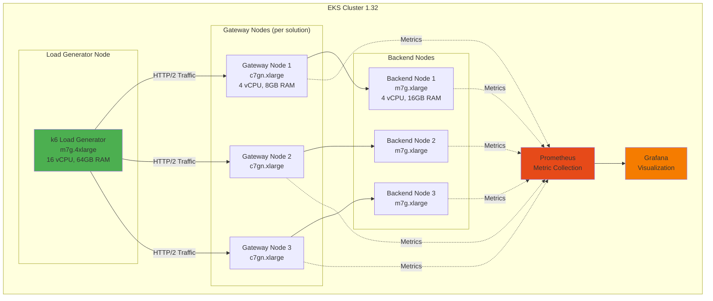

# Gateway API Implementation Performance Benchmark Plan

> 📅 **Created**: 2026-02-12 | **Updated**: 2026-02-14 | ⏱️ **Reading time**: ~5 min

A systematic benchmark plan for objectively comparing 5 Gateway API implementations in the same Amazon EKS environment. The goal is to quantitatively identify each solution's strengths and weaknesses to enable data-driven architecture decisions.

:::tip Related Document
This benchmark plan targets the 5 solutions compared in the [Gateway API Adoption Guide](/docs/eks-best-practices/networking-performance/gateway-api-adoption-guide).
:::

## 1. Benchmark Objective

This benchmark aims to objectively compare 5 Gateway API implementations in the same EKS environment, quantitatively identifying each solution's strengths and weaknesses.

**Key Questions:**
- Which solution is the fastest? (throughput, latency)
- Which solution has the best resource efficiency? (performance relative to CPU/Memory)
- Which solution scales best in large-scale environments?
- What are the trade-offs for each solution?

## 2. Test Environment Design

## 3. Test Scenarios

### 1. Basic Throughput (Throughput Test)

**Purpose:** Measure maximum RPS (Requests Per Second)

Measures maximum throughput for each solution by increasing concurrent connections from 100, 500, 1000, to 5000.

### 2. Latency Profile

**Purpose:** Measure P50/P90/P99/P99.9 latency

Measures response time distribution under steady load to compare tail latencies.

### 3. TLS Performance

**Purpose:** Measure TLS termination throughput and handshake time

Measures TLS termination performance and handshake overhead for HTTPS traffic.

### 4. L7 Routing Complexity

**Purpose:** Measure performance impact of header-based routing and URL rewrite

Measures the impact of complex routing rules on performance.

### 5. Scaling Test

**Purpose:** Measure performance changes as route count increases (10, 50, 100, 500 routes)

Measures routing performance and memory usage with many HTTPRoutes.

### 6. Resource Efficiency

**Purpose:** Throughput relative to CPU/Memory usage

Compares efficiency of each solution under the same resource constraints.

### 7. Failure Recovery

**Purpose:** Traffic impact during controller restart

Measures downtime and recovery time when a Gateway controller restarts.

### 8. gRPC Performance

**Purpose:** gRPC streaming throughput

Measures gRPC protocol support and performance.

## 4. Measured Metrics

| Metric | Unit | Measurement Method |
|------|------|-----------|
| **RPS (Requests Per Second)** | req/s | k6 summary or Prometheus rate() |
| **Latency (P50/P90/P99)** | ms | k6 histogram_quantile or Grafana |
| **Error Rate** | % | (failed requests / total requests) x 100 |
| **CPU Usage** | % | Prometheus container_cpu_usage_seconds_total |
| **Memory Usage** | MB | Prometheus container_memory_working_set_bytes |
| **Connection Setup Time** | ms | k6 http_req_connecting |
| **TLS Handshake Time** | ms | k6 http_req_tls_handshaking |
| **Network Throughput** | Mbps | Prometheus rate(container_network_transmit_bytes_total) |

## 5. Expected Results (Theoretical Analysis)

Expected strengths/weaknesses per solution:

**AWS Native (ALB + NLB)**
- **Strengths**: Fully managed, auto-scaling, AWS integration
- **Weaknesses**: Latency increase from ALB hop, cost
- **Expected Performance**: Medium (throughput 10K RPS, P99 50ms)

**Cilium Gateway API (ENI mode)**
- **Strengths**: Best eBPF performance, native routing, Hubble visibility
- **Weaknesses**: Configuration complexity, learning curve
- **Expected Performance**: Highest (throughput 30K RPS, P99 15ms)

**NGINX Gateway Fabric**
- **Strengths**: Proven NGINX engine, stability, rich features
- **Weaknesses**: Higher memory usage
- **Expected Performance**: High (throughput 20K RPS, P99 25ms)

**Envoy Gateway**
- **Strengths**: Rich L7 features, extensibility, observability
- **Weaknesses**: Resource overhead
- **Expected Performance**: Medium-high (throughput 15K RPS, P99 30ms)

**kGateway (Solo.io)**
- **Strengths**: AI routing, enterprise features
- **Weaknesses**: Enterprise license required
- **Expected Performance**: Medium-high (throughput 18K RPS, P99 28ms)

## 6. Benchmark Execution Plan

| Phase | Description | Tools | Duration |
|------|------|------|-----------|
| 1. Environment Setup | Deploy EKS cluster and 5 solutions separately | eksctl, Helm | 2 days |
| 2. Basic Tests | Measure throughput, latency | k6, Prometheus | 1 day |
| 3. TLS Tests | Measure HTTPS performance | k6 (TLS) | 0.5 day |
| 4. L7 Tests | Test complex routing rules | k6 (custom) | 0.5 day |
| 5. Scale Tests | Test route count increase | kubectl, k6 | 1 day |
| 6. Resource Measurement | CPU/Memory profiling | Prometheus, Grafana | 1 day |
| 7. Result Analysis | Data analysis and report writing | Jupyter, Matplotlib | 2 days |

:::info
Benchmark execution results will be updated in this document. For related network benchmarks, see [CNI Performance Comparison](./cni-performance-comparison.md).
:::

---

## Related Documents

- [Gateway API Adoption Guide](/docs/eks-best-practices/networking-performance/gateway-api-adoption-guide) — Detailed comparison of 5 solutions
- [CNI Performance Comparison Benchmark](./cni-performance-comparison.md) — VPC CNI vs Cilium network performance
- [Infrastructure Performance Benchmark](./infrastructure-performance.md) — Comprehensive infrastructure performance testing
