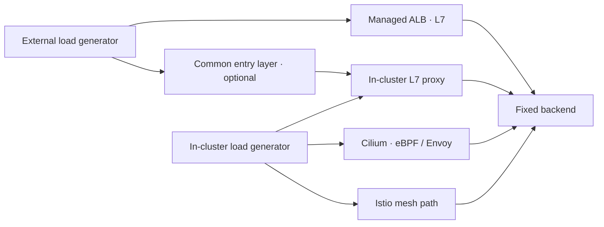

Choosing a Gateway API implementation requires comparing the actual traffic path, policy extensions, and operational responsibilities as well as API support. This report compares representative architectures, reanalyzes published conformance evidence, and defines a feature and performance test procedure for EKS.

:::info Evidence boundary
We analyzed **10 upstream reports covering 27 profiles**. Locally executed tests exercise **the measurement kit and response validation**, not an installed Gateway controller. **No EKS performance measurements of these implementations have been collected.** There is no RPS, P99, or cost ranking. Raw evidence and execution records are in the [benchmark kit][kit].
:::

## 1. Benchmark Objective

The comparison should answer specific engineering questions:

- Can the required routes, filters, and policies be expressed through standard APIs?
- Which traffic path meets the required arrival rate and SLO for the same request contract?
- How do configuration changes, failures, and certificate rotation affect existing connections and new requests?
- Which components, resources, and costs remain the operator's responsibility?

### Representative architectures

| Implementation | Control plane and actual request path | Distinctions to test |
| --- | --- | --- |
| **AWS Load Balancer Controller** | A controller configures managed **ALB L7** or **NLB L4** routing | AWS integration, ACM certificates, managed scaling. ALB and NLB are separate paths; controller CPU is not load balancer CPU |
| **Envoy Gateway** | A control plane deploys and configures Envoy proxies | Isolation and resource use of per-Gateway versus shared proxy fleets; policy extensions |
| **NGINX Gateway Fabric** | Separate control-plane and NGINX data-plane pods communicate over secure gRPC | NGINX build/edition, configuration updates, forwarding to Pod endpoints |
| **kgateway** | Gateway API resources and policies become Envoy configuration | Separate OSS from vendor extensions. The reviewed OSS repository is Apache-2.0; an enterprise license is not a blanket requirement |
| **Kong KIC + Kong Gateway** | KIC supplies configuration; Kong Gateway handles requests | KIC/proxy versions, router flavor, plugins, edition, and their operational costs |
| **Traefik Proxy** | The Kubernetes Gateway provider supplies proxy configuration | Entrypoints, provider options, and Experimental-channel scope |
| **Cilium Gateway API** | eBPF/TPROXY interception reaches **per-node Envoy for L7** | CNI, security policy, and observability integration; eBPF alone neither processes all L7 traffic nor proves superior performance |
| **Istio** | Envoy ingress Gateway; ambient adds ztunnel/HBONE and optional waypoint paths | Separate ingress from mesh, recording waypoint placement, traffic enrollment, and added hops |

The table follows [project architecture references](#architecture-sources). Features from different versions and deployment modes must not be combined under a single product name. **VPC Lattice** uses a separate `aws-application-networking-k8s` controller and managed service network. It is a separate comparison track, not an ALB/NLB mode.[^lattice]

### Evidence levels

| Evidence | Status in this report | What it establishes |
| --- | --- | --- |
| Upstream conformance | Pinned YAML reanalysis complete | API behavior reported for that version and profile |
| Local fixture | Execution records provided | Request generation, response assertions, failure detection |
| Installed implementation feature tests | `not_run` | Requires testing the actual controller and proxy |
| Installed implementation performance | `not_run`; measurements `null` | Throughput, latency, efficiency, and cost conclusions pending |

## 2. Test Environment Design

### Compare equivalent traffic paths


```mermaid
flowchart LR
    E["External load generator"] --> A["Managed ALB · L7"]
    A --> B["Fixed backend"]
    E --> N["Common entry layer · optional"]
    N --> P["In-cluster L7 proxy"]
    P --> B
    I["In-cluster load generator"] --> P
    I --> C["Cilium · eBPF / Envoy"]
    C --> B
    I --> M["Istio mesh path"]
    M --> B
```

Compare **managed edge**, **in-cluster proxies**, and **CNI/mesh integration** in separate groups. Do not combine direct proxy measurements with requests that traverse an NLB. An NLB L4 forwarding test and an Envoy L7 test behind an NLB are different experiments. Lattice needs a separate service-network, DNS, and authentication path.

Where a common entry layer is used, keep that layer, target mode, and AZ placement consistent. If switching CNI or enrolling workloads in a mesh affects other candidates, use separate clusters and record the environmental differences.

### Record before execution

| Area | Required records |
| --- | --- |
| Environment | AWS account/profile/region, dedicated cluster/namespace, Kubernetes/OS/kernel/CPU architecture, node types/count/AZs, CNI/MTU/kube-proxy mode |
| Implementation | Controller/proxy image digests, Gateway API version/channel, GatewayClass/controllerName, chart/flags/policies, configuration checksum |
| Request path | Internal/external generator placement, ingress hops, target type, cross-AZ traffic, client→gateway and gateway→backend protocols, TLS termination |
| Workload | Method, payload/response size, compression, connection reuse, timeout/retry, expected status/body/backend ID, route count and request distribution |
| Experiment | Run ID, source revision, tool versions, warm-up/measurement/drain windows, arrival rate/VUs/repetitions/order, SLO, stop conditions, cost limit |

Select and pin measurement versions after checking compatibility at deployment time. The historical conformance cohort below is not a recommendation for new installations. Managed data-plane CPU and memory are not directly observable and must be marked `not_observable`.

## 3. Test Scenarios

### Pass feature checks first

Verify the `GatewayClass → Gateway → Route → Backend` relationship and applicable `observedGeneration`, `Accepted`, `Programmed`, and `ResolvedRefs` conditions. Correlate requests and backend IDs to establish that responses actually traversed the Gateway under test. Calling an echo endpoint alone does not verify a Gateway.

| Test group | Requests and expected behavior | Distinctions to verify |
| --- | --- | --- |
| Standard routing | Exact/prefix paths, hostname, header, weighted backends; boundary and mismatch cases | `/prefix-other` must not match `/prefix`; unauthorized attachment and references must be rejected |
| Filters and backends | Rewritten path/query, request/response header changes, timeout, mirroring | Declared Extended support versus observed behavior; separate mirrored traffic from primary requests |
| TLS and protocols | Certificate/SNI, termination/passthrough, HTTP/1.1, HTTP/2, gRPC | Both protocol legs, certificate lifecycle, backend TLS policy |
| Implementation policies | Authentication, rate limit, plugins, observability | Standard API versus custom CRDs, OSS/commercial scope, added hops |
| AI extensions | Model selection, inference endpoints, admission/rate limit, streaming | Extension version and backend contract; separate token generation time from Gateway overhead |

The last two groups are not assumed to be common capabilities. Preserve `pass`, `fail`, `unsupported`, `skipped`, and `not_run` with evidence. A field absent from an upstream report is `not_reported`.

### 1. Basic Throughput (Throughput Test)

Use `constant-arrival-rate` to schedule a fixed number of **operation starts per second**. The basic HTTP test makes one GET per iteration with no redirects or retries. VUs provide execution capacity to maintain that schedule; concurrency is not a measurement of maximum RPS.[^k6]

The initial **proposal** is 10/50/100 requests/s for each eligible HTTP protocol, repeated three times. Each repetition has 60 seconds of warm-up, 180 seconds of measurement, and a separate drain window covering request timeouts. Two supported protocols produce 18 measurement windows. Adjust the plan to the dedicated environment's capacity and budget before running it, then expand only after low-rate validity checks pass.

Report the **highest tested arrival rate that met the SLO**. Do not call it maximum throughput without a valid failure bracket and evidence that the generator had spare capacity.

### 2. Latency Profile

At the same arrival rate, retain successes, errors, and timeouts and report P50/P90/P95/P99 for each run. This plan withholds P99.9 below 100,000 observations; reaching that count alone does not guarantee statistical precision.

Define the measurement population by **request start time** and follow late completions through drain. Filtering only by completion timestamp can exclude slow boundary requests. Never average repeated P99 values. A combined distribution requires raw observations or histograms with identical bucket boundaries.

### 3. TLS Performance

Test connection reuse and new connections separately. Record TLS version, certificate chain, client→gateway ALPN, and backend TLS. `http_req_duration` excludes initial DNS and connection establishment, so retain connection and handshake metrics separately.

The reviewed LBC version uses ACM configuration/discovery; do not apply another implementation's `certificateRefs` configuration unchanged.[^lbc] A request that negotiates HTTP/1.1 when HTTP/2 was expected is not an eligible HTTP/2 result.

The NLB L4 plan requires separate clients for TCP connection/echo, UDP sequence numbers/loss/jitter, and TLS passthrough SNI/backend certificates. Do not rank HTTP RPS against UDP packet throughput. The current HTTP kit does not execute these L4 cases.

### 4. L7 Routing Complexity

Add simple paths, hostname/header matching, rewrites, and policies in controlled stages. At each stage verify status, body, backend ID, and transformed paths and headers. An 80:20 distribution needs sample counts and confidence intervals; insufficient samples remain `inconclusive`. Session affinity or correlated choices also invalidate an independent-selection assumption.

### 5. Scaling Test

Route counts of 10/50/100/500 are **proposed test sizes**. Hold rule distribution and backend count constant, and measure steady-state requests separately from configuration convergence. Retain application time, condition updates, and time to the first correct response. Resource acceptance alone does not prove that the data plane is serving the new configuration.

### 6. Resource Efficiency

Collect the control plane, proxy, backend, and generator separately. Include Cilium agent/CNI/Envoy placement and relevant mesh tunnels/waypoints. Divide successful requests by the measured CPU-seconds of the declared components over the same window.

ALB/NLB/Lattice cannot receive an equivalent proxy-container CPU allocation. Assess those paths separately using observable service metrics, costs with explicit usage/period/region, and operating responsibilities. This report contains no price estimates.

### 7. Failure Recovery

Test controller restart, proxy replacement, backend termination, and certificate rotation separately. Existing connection survival and new Route reconciliation are distinct outcomes. Record error windows, recovery time, connection drain, and interruption of long-lived streams.

Run only after the dedicated target, timing, and stop limits are established. Retain previous configuration/images/certificates. Recovery stops load generation, restores the change, then rechecks resource status and the response contract.

### 8. gRPC Performance

Separate unary, server-streaming, client-streaming, and bidirectional cases. Verify gRPC status, message content/count/order, time to first message, inter-message gaps, and completion in addition to HTTP status.

AI-service SSE needs its own client that verifies first event, progressive delivery, interruption, and completion. A completed ordinary HTTP GET is not a streaming test. This kit does not yet include gRPC/SSE load clients; both remain `not_run`.

## 4. Measured Metrics

| Metric | Unit | Definition and boundary |
| --- | --- | --- |
| Arrivals/completions/successes | operations/s or requests/s | Separate scheduled, started, completed, successful, failed, timed-out, interrupted, and dropped work; declare requests per iteration |
| Request duration | ms | `http_req_duration` excludes initial DNS/TCP/TLS setup; define whole-operation time separately |
| Connection/TLS | ms | `http_req_connecting`, `http_req_tls_handshaking`; distinguish reused connections with zero samples |
| Errors/drops | count, % | Declare denominator; `dropped_iterations` counts work that never started |
| CPU | cores | `sum(rate(container_cpu_usage_seconds_total[window]))`; percentages require an explicit core denominator |
| Memory | MiB | `container_memory_working_set_bytes / 1024 / 1024`; retain time series |
| Network | Mbps | Apply `rate()` to each counter, then sum × 8 / 1,000,000; avoid duplicated interfaces |
| Reconciliation/recovery | ms or s | Define start/end events and distinguish control plane from data plane |

Pin collection settings with the [cAdvisor metric definitions](https://github.com/google/cadvisor/blob/master/docs/storage/prometheus.md) and [Prometheus functions](https://prometheus.io/docs/prometheus/latest/querying/functions/) used for counter rates and quantiles.

**Acceptance gates** require correct response contracts, no drops or interruptions, verified protocol, generator/backend bottleneck checks, and retained raw data/configuration/exit codes. Keep failed load levels with their failure reason; do not rank their apparently fast responses. Interleave or randomize candidate order across repetitions and verify stabilization/cooldown. Final SLOs must come from workload requirements; this report does not invent a universal P99 pass threshold.

## 5. Validation Results and Measurement Status {#5-expected-results-theoretical-analysis}

### Reanalysis of published conformance

We pinned `kubernetes-sigs/gateway-api` commit `112584e6624e32a9c9ec6a818a735506fc33eb49` and verified SHA-256 hashes of 10 reports. The [source manifest and original files][upstream] and [derived analysis JSON][analysis] retain API version, channel, mode, report time, reference release, and provenance differences. This is **reanalysis of upstream-executed tests**, not our EKS execution.

The following six members share **Gateway API v1.4.0 / experimental / default**. HTTP/gRPC/TLS numbers are **passed Core test counts** in the respective Gateway profiles; each has zero Core failures and skips.

| Implementation and reported version | HTTP / gRPC / TLS Core | Interpretation boundary |
| --- | --- | --- |
| Envoy Gateway `v1.6.0` | 33 / 13 / 11 | Report predates reference-release publication; not independent verification of the final image |
| Cilium `1.19.0-pre.2` | 33 / 13 / 11 | Prerelease evidence, not a stable 1.19 result |
| NGINX Gateway Fabric `v2.3.0` | 33 / 13 / 11 | Recorded version/profile only |
| kgateway `v2.1.0` | 33 / 13 / 11 | OSS report; separate vendor extensions |
| Istio `1.28` | 33 / 13 / 11 | YAML omits patch; report predates reference `1.28.0` publication |
| Traefik `v3.6` | 33 / 13 / 11 | YAML omits patch; report predates reference `v3.6.0` publication |

The pinned Cilium source starts with `<Right>apiVersion` rather than `apiVersion`. Frozen bytes and hashes remain unchanged, and `source_metadata_issues` records the defect. The profile statistics remain upstream-reported values; they do not establish valid source metadata.

Common Core success does not imply identical Extended support. NGF declares `HTTPRouteBackendProtocolH2C` unsupported in this cohort despite gRPC Core success. Envoy/Istio declare `HTTPRouteCORS` supported; Cilium/NGF/kgateway/Traefik declare it unsupported. NGF's `BackendTLSPolicy` declaration does not turn its absence in another report into evidence of non-support.

Keep the following supplemental records separate because their path, API version, or mode differs.

| Separate evidence | Reported Core result | Comparison boundary |
| --- | --- | --- |
| VPC Lattice controller `v2.0.1`, API v1.4.0 | HTTP 10 passed / 23 skipped, `partial` | Managed service-network path |
| AWS LBC `v3.2.0`, API v1.5.0 standard | HTTP 23 passed / 10 skipped, `partial` | Reproduction uses ALB, not NLB |
| Kong KIC `v3.4.0`, API v1.2.1, expressions | HTTP 33 passed; gRPC 11 passed / 1 skipped | Fixed router flavor |
| Same KIC, traditional_compatible | HTTP 32 passed / 1 skipped; gRPC 10 passed / 2 skipped | Do not merge with expressions |

Missing v1.4.0 LBC/KIC reports in the selected tree mean `not_verified`. A `partial` result with zero failures is not full success. Adding Core and Extended counts does not produce a feature-support percentage or a performance score.[^conformance]

### Locally executed validation

The prior execution report records the run at **2026-09-19 00:08 UTC**. Pinned Python 3.13.15 and k6 2.2.0 images ran on an arm64 Docker VM with 10 CPUs and 8,217,317,376 bytes RAM, shared with three existing containers. The backend was limited to 1 CPU/256 MiB and the generator to 1 CPU/512 MiB, using an internal network only. These are declared limits, not utilization measurements. The published artifacts omit the original Docker info/inspect and before/after inventories, so actual limit enforcement, isolation and cleanup were not independently reverified.

| Check | Observed result | Outcome |
| --- | --- | --- |
| Echo, controlled status, controlled delay | Three feature probes passed | Fixture contract met |
| HTTP/1.1, 5 arrivals/s × 5 seconds, three repetitions | 26 / 26 / 25 requests; zero drops and response-contract failures | First two `boundary-tolerated`; third `exact` |
| Incorrect expected body | 26 failed body checks | k6 exit 99; validator rejected |
| Delayed fixture with insufficient generator capacity | Four requests; 37 dropped arrivals | k6 exit 99; validator rejected |
| Redirect override / skipped setup | Zero requests in both cases | Guards rejected execution; exits 107 / 108 |
| Resource cleanup | The derived report records test-resource removal and retention of three existing containers | Original before/after inventories unavailable |

The first two nominal runs observed 26 requests against 25 planned, or 104%. The validator classifies ±1 and 95–105% delivery as an **explicit boundary-tolerance policy** only when at least 20 arrivals were planned. This is not proof that timer races caused every discrepancy. Dropped arrivals remain unacceptable.

[Raw execution records, exit codes, and the hash manifest](https://github.com/devfloor9/engineering-playbook/tree/main/scripts/benchmarks/gateway-api-benchmark/results/local-20260919) retain per-run timing statistics. The historical Python probe incorrectly retains the k6 digest in `generator_image`. New configuration generation sets both the Python version and image digest; the evidence README records the erratum without changing old raw files or hashes. The k6 artifacts are summaries rather than request-level latency data, so their percentiles cannot be independently recomputed. Five-second fixture timings are not product performance plots or rankings. These runs did not test a Gateway, TLS, gRPC/SSE, Kubernetes state, or resource utilization.

### Installed implementation measurements pending

| Target | Feature measurements | Performance/efficiency | Prerequisites |
| --- | --- | --- | --- |
| ALB / NLB | `not_run` | `null` | Dedicated AWS/EKS target, service configuration, cost limit |
| Envoy / NGF / kgateway / Kong / Traefik | `not_run` | `null` | Pinned deployment, independent proxy/generator/backend capacity |
| Cilium / Istio | `not_run` | `null` | CNI/mesh path and isolated environment |
| VPC Lattice | `not_run` | `null` | Service network, associations, authentication path |

At this stage, **API evidence and the measurement procedure are prepared**. There is no evidence yet for implementation speed or cost superiority.

## 6. Benchmark Execution Plan

### Reproduction

From the repository root, run source analysis and kit regression checks:

```bash
npm run test:gateway-benchmark
```

For a local arm64 Docker fixture check, choose a new output directory. Two pinned images are required. The runner creates and removes only its bounded containers and internal network, with no published host ports.

```bash
python3 scripts/benchmarks/gateway-api-benchmark/run-local.py \
  --output /tmp/gateway-fixture-new-run
```

The [kit README][kit] describes pinned images, output formats, limits, and individual commands. `cases.routes.example.json` is an unmeasured feature-contract example and deploys no Gateway. Review its expectations against the actual configuration and add resource-status evidence before use.

### EKS execution stages

| Stage | Deliverable | Completion criterion |
| --- | --- | --- |
| 1. Confirm environment | Account/profile/region/cluster/namespace, versions, capacity, budget, change/recovery scope | Dedicated target and operational limits established |
| 2. Verify features | Resource conditions, path evidence, standard/Extended/custom-policy results | Response contracts pass with explicit support and skip reasons |
| 3. Establish HTTP baseline | Protocol/rate repetitions, raw metrics, exit codes, resource time series | Generator validity, response correctness, and SLO can be assessed |
| 4. Extend scenarios | TLS, route scale, failures, gRPC/SSE | Scenario-specific clients, telemetry, and recovery validated |
| 5. Update report | Group-specific plots/tables, failure points, operating trade-offs | Every number traceable to raw execution evidence |

[Issue #80](https://github.com/devfloor9/engineering-playbook/issues/80) tracks live measurements. Local fixture results do not complete the installed-Gateway stages.

## Related Documents

- [Gateway API Adoption Guide](/docs/eks-best-practices/networking-performance/gateway-api-adoption-guide) — adoption decisions and configuration
- [CNI Performance Comparison Benchmark](./cni-performance-comparison.md)
- [Infrastructure Performance Benchmark](./infrastructure-performance.md)

### Architecture references {#architecture-sources}

- [AWS LBC v3.2 Gateway guide][lbc-guide], [ALB conformance setup](https://github.com/kubernetes-sigs/aws-load-balancer-controller/blob/0fb5e3b7d70421a9a2a144d78b2c384d1e77600f/conformance/README.md)
- [Envoy Gateway deployment modes](https://github.com/envoyproxy/gateway/blob/26ebf49e9d21ddb25521b55181b20f24b4cf102a/site/content/en/latest/tasks/operations/deployment-mode.md)
- [NGINX Gateway Fabric architecture](https://github.com/nginx/nginx-gateway-fabric/blob/bd209359a3910ffe9b19ccc12f849a294f07e427/docs/architecture/README.md)
- [kgateway architecture](https://github.com/kgateway-dev/kgateway/blob/919cae66255332a968f06f810bd2844bb817bbe0/devel/architecture/overview.md), [license](https://github.com/kgateway-dev/kgateway/blob/919cae66255332a968f06f810bd2844bb817bbe0/LICENSE)
- [Kong KIC architecture](https://developer.konghq.com/kubernetes-ingress-controller/architecture/)
- [Traefik Gateway provider](https://github.com/traefik/traefik/blob/06db5168c0d936a0716cbede56bc2cd332be0d4f/docs/content/reference/install-configuration/providers/kubernetes/kubernetes-gateway.md)
- [Cilium ingress/Gateway path](https://github.com/cilium/cilium/blob/ffc86daa5139485001e26bcb2e4dc4126f6dd2b7/Documentation/network/servicemesh/ingress-reference.rst)
- [Istio ingress](https://istio.io/v1.28/docs/tasks/traffic-management/ingress/gateway-api/), [ambient path](https://istio.io/v1.28/docs/ambient/architecture/data-plane/), [waypoint enrollment](https://istio.io/v1.28/docs/ambient/usage/waypoint/)

[kit]: https://github.com/devfloor9/engineering-playbook/tree/main/scripts/benchmarks/gateway-api-benchmark
[upstream]: https://github.com/devfloor9/engineering-playbook/tree/main/scripts/benchmarks/gateway-api-benchmark/results/upstream
[analysis]: https://github.com/devfloor9/engineering-playbook/blob/main/scripts/benchmarks/gateway-api-benchmark/results/upstream/analysis.json
[lbc-guide]: https://github.com/kubernetes-sigs/aws-load-balancer-controller/blob/0fb5e3b7d70421a9a2a144d78b2c384d1e77600f/docs/guide/gateway/gateway.md
[^lbc]: [LBC Gateway resources, certificates, and L4/L7 boundaries][lbc-guide].
[^lattice]: [VPC Lattice controller v2.0.1 concepts](https://github.com/aws/aws-application-networking-k8s/blob/5aa1b84459ed1cfda3354607a4788d0111950304/docs/concepts/concepts.md).
[^conformance]: [Conformance reporting rules at the pinned snapshot](https://github.com/kubernetes-sigs/gateway-api/blob/112584e6624e32a9c9ec6a818a735506fc33eb49/conformance/reports/README.md).
[^k6]: [k6 constant-arrival-rate](https://grafana.com/docs/k6/latest/using-k6/scenarios/executors/constant-arrival-rate/), [HTTP metric definitions](https://grafana.com/docs/k6/latest/using-k6/metrics/reference/).
