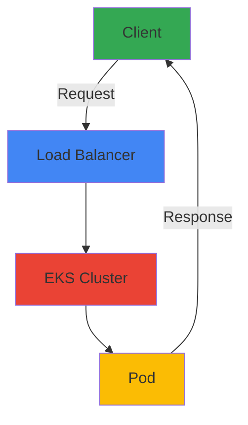

# Contributing Guide

> 📅 **Written**: 2025-02-05 | ⏱️ **Reading time**: ~12 min

## Overview

The Engineering Playbook is a community-driven project that shares Amazon EKS architecture and operational best practices. This guide clearly explains documentation writing standards, formatting rules, and the PR process so anyone can contribute easily.

**Ways to Contribute:**
- Write new documentation
- Improve and translate existing documentation
- Add code examples and use cases
- Fix errors and provide feedback

## Getting Started

### 1. Fork and Clone Repository

```bash
# Fork the repository (via GitHub web interface)
# Clone your forked repository

git clone https://github.com/[your-username]/engineering-playbook.git
cd engineering-playbook
git remote add upstream https://github.com/devfloor9/engineering-playbook.git
```

### 2. Create a Branch

Create a branch with a clear name:

```bash
# Add new documentation
git checkout -b docs/category/topic-name

# Improve existing documentation
git checkout -b docs/improve/topic-name

# Fix a bug
git checkout -b fix/issue-description
```

**Branch Naming Conventions:**
- `docs/[category]/[topic]` - Add new documentation
- `docs/improve/[topic]` - Improve documentation
- `fix/[description]` - Fix bugs
- `translate/[language]/[topic]` - Translation work

### 3. Set Up Development Environment

```bash
# Install dependencies
npm install

# Run local server (port 3000)
npm start

# Test build
npm run build
```

## Documentation Writing Guide

### Frontmatter Requirements

Every document must start with frontmatter in the following format:

```yaml
---
title: "Document Title"
sidebar_label: "Sidebar Label (English)"
description: "Brief description within 150 characters"
tags: [eks, kubernetes, tag1, tag2]
category: "[performance-networking|observability-monitoring|genai-aiml|hybrid-multicloud|security-compliance]"
date: YYYY-MM-DD
authors: [your-github-username]
difficulty: "[beginner|intermediate|advanced]"
estimated_time: "15 minutes"
prerequisites:
  - "Required prerequisite knowledge 1"
  - "Required prerequisite knowledge 2"
related_docs:
  - "../related/document.md"
sidebar_position: [number]
---
```

**Frontmatter Field Description:**

| Field | Required | Description |
|-------|----------|-------------|
| `title` | ✅ | Document title written in English |
| `sidebar_label` | ✅ | English sidebar label |
| `description` | ✅ | Description in 120-150 character range (SEO optimization) |
| `tags` | ✅ | 2-5 related tags |
| `category` | ✅ | One of 5 categories |
| `date` | ✅ | Creation date (YYYY-MM-DD) |
| `authors` | ✅ | Array of GitHub usernames |
| `difficulty` | ✅ | Difficulty level (beginner/intermediate/advanced) |
| `estimated_time` | ✅ | Estimated reading time |
| `prerequisites` | ⭕ | Array of prerequisite knowledge |
| `related_docs` | ⭕ | Array of related document paths |
| `sidebar_position` | ⭕ | Sorting order in sidebar |

:::info Tip
`sidebar_position` determines the order within a category. For new documents, typically use the largest number + 1.
:::

### Document Structure

All technical documents should follow this structure:

```markdown
# Document Title

> 📅 **Written**: YYYY-MM-DD | ⏱️ **Reading time**: ~X min

## Overview

Briefly explain the purpose and content of the document in 2-3 concise paragraphs.

## Goals

You will learn the following from this document:

- [ ] Learning goal 1
- [ ] Learning goal 2
- [ ] Learning goal 3

## Prerequisites

- Required tool or knowledge 1
- Required tool or knowledge 2

## Architecture Overview

[System architecture description and diagram]

## Step-by-Step Implementation Guide

### Step 1: [Step Title]

[Step description and code examples]

## Monitoring and Verification

[How to verify implementation results]

## Troubleshooting

### Issue: [Issue Description]

**Symptoms:**
- Symptom description

**Causes:**
- Cause analysis

**Solution:**
```bash
# Solution command
```

## Best Practices

- ✅ Recommended practice 1
- ✅ Recommended practice 2
- ❌ Practice to avoid 1
- ❌ Practice to avoid 2

## References

- [Official documentation link]
- [Related blog post]

---

**Last Updated:** YYYY-MM-DD
**Reviewer:** [Reviewer name]
**Version:** 1.0
```

### English Writing Rules

**Language Usage:**
- Use polite, professional language
- Use English technical terms with clear explanations
- Write clear and concise sentences

**Example:**

❌ **Bad Example:**
```
This document covers DNS optimization. Pods may experience performance degradation when performing DNS queries.
```

✅ **Good Example:**
```
This document covers DNS optimization. Pods may experience performance degradation when performing DNS queries. Understanding these issues and implementing best practices can significantly improve cluster performance.
```

### Code Example Writing

**YAML Files:**
```yaml
# Comment in English
apiVersion: v1
kind: ConfigMap
metadata:
  name: example-config
  namespace: default
data:
  key: "value"
```

**Bash Commands:**
```bash
# Descriptive comment
kubectl apply -f config.yaml

# Verify result
kubectl get pods -n namespace
```

**Copy-Paste Ready Code:**
- All commands must be actually tested
- Clearly mark variables (e.g., `${NAMESPACE}`)
- Include expected output in comments

:::warning Important
Code examples must be executable. Code validation is performed during PR review.
:::

### Using Mermaid Diagrams

Docusaurus supports Mermaid diagrams by default:



**Diagram Types:**
- **Flowchart**: Processes and workflows
- **Sequence**: Interactions between systems
- **Class**: Architecture structure
- **Gantt**: Timelines and schedules

:::tip Diagram Guide
- Use English labels
- Use consistent colors (blue: processing, green: input, red: output)
- Split complex diagrams into multiple smaller ones
:::

### Admonitions (Alert Boxes)

Highlight important information in your document:

```markdown
:::tip Tip
This is a helpful tip.
:::

:::info Information
This is reference information.
:::

:::warning Warning
This is a warning to be careful about.
:::

:::danger Danger
This is a dangerous operation. Be careful!
:::
```

## Category-Specific Guides

### 5 Main Categories

#### 1. Performance & Networking
**Topics Covered:**
- EKS DNS performance optimization
- Network performance tuning
- Load balancing and Ingress patterns
- Cilium and network security

**Example Documents:**
- `docs/performance-networking/coredns-monitoring-optimization.md`
- `docs/performance-networking/fast-scaling-architecture.md`

:::tip Writing Tip
Include specific metrics and benchmarks in performance-related documents.
:::

#### 2. Observability & Monitoring
**Topics Covered:**
- Logging and tracing
- Metrics collection and analysis
- Prometheus, Grafana setup
- Alerting and dashboards
- AI/ML workload monitoring

**Example Documents:**
- `docs/observability-monitoring/node-monitoring-agent.md`
- `docs/observability-monitoring/gitops-cluster-operation.md`

:::tip Writing Tip
Include actual queries and dashboard configuration examples in monitoring documents.
:::

#### 3. GenAI & AI/ML
**Topics Covered:**
- GPU resource management and optimization
- LLM integration and routing
- Model serving and inference
- Cost optimization
- Workflow orchestration

**Example Documents:**
- `docs/genai-aiml/genai-platform.md`
- `docs/genai-aiml/gpu-resource-management.md`

:::tip Writing Tip
Include specific figures related to GPU utilization, cost, and performance in AI/ML documents.
:::

#### 4. Hybrid & Multi-Cloud
**Topics Covered:**
- EKS hybrid node configuration
- Cloud bursting architecture
- Multi-cloud management
- Edge computing

**Example Documents:**
- See `docs/hybrid-multicloud/` directory

:::tip Writing Tip
Clearly explain integration methods between on-premises and cloud environments.
:::

#### 5. Security & Compliance
**Topics Covered:**
- RBAC and IAM permission management
- Network security policies
- Encryption and secure communication
- Monitoring and auditing
- Compliance (HIPAA, PCI-DSS, etc.)

**Example Documents:**
- See `docs/security-compliance/` directory

:::warning Important
Security documents must undergo security review. Do not disclose sensitive information.
:::

## PR Process

### Step 1: Write Commit Message

Write clear and structured commit messages:

```bash
# Format: [Type]: [Description]

# Examples
git commit -m "docs: Add EKS DNS optimization guide"
git commit -m "docs: Improve CoreDNS caching configuration examples"
git commit -m "fix: Correct incorrect command in documentation"
```

**Commit Types:**
- `docs:` - Add new documentation or modify existing documentation
- `fix:` - Fix errors
- `refactor:` - Improve documentation structure
- `translate:` - Translation work
- `chore:` - Configuration file or tool changes

### Step 2: Push and Create PR

```bash
# Get latest upstream
git fetch upstream
git rebase upstream/main

# Push changes
git push origin your-branch-name

# Create PR on GitHub
# Use PR template for writing
```

### Step 3: Write PR Template

When creating a new PR, use the following template:

```markdown
## 📝 Change Description

Briefly describe what you changed in this PR.

## 🎯 PR Type

- [ ] Add new documentation
- [ ] Improve existing documentation
- [ ] Add translation
- [ ] Fix bug
- [ ] Other: _____

## 📄 Related Issue

#123 (Include GitHub issue number if applicable)

## ✅ Checklist

- [ ] Frontmatter information verified
- [ ] All code examples tested
- [ ] Internal links verified
- [ ] External links validated
- [ ] Spelling and grammar reviewed
- [ ] Table of contents structure appropriate
- [ ] Screenshots/images included (if applicable)

## 📖 Preview

(Optional) Include key sections of the document for review.
```

### Step 4: Await Review and Apply Feedback

**Review Process:**
1. Automated checks run (link verification, metadata validation, build test)
2. Minimum 1 maintainer review required
3. Reflect requested changes
4. Merge after approval

:::info Note
Responding quickly to reviewer requests speeds up PR merging.
:::

## Style Guide

### Text Formatting

**Header Hierarchy:**
```markdown
# H1: Document Title (use only 1)
## H2: Main Section
### H3: Subsection
#### H4: Detailed Explanation
```

:::warning Important
Use H1 only once for the document title. Start sections with H2.
:::

**Text Emphasis:**
```markdown
**Bold text** - Important terms or emphasis
*Italic text* - Additional explanation
`Inline code` - Variables, commands, filenames
```

**Lists:**
```markdown
# Ordered list
1. First
2. Second
3. Third

# Unordered list
- Item 1
- Item 2
- Item 3

# Checklist
- [ ] Incomplete
- [x] Complete
```

### Images and Media

**Image Storage Location:**
```
/static/img/docs/[category]/[document-name]/image-name.png
```

**Include Images:**
```markdown

```

**Image Guidelines:**
- Screenshots: PNG format
- Resolution: Maximum 1920px width
- File size: Minimize (compression recommended)
- Alt text: Mandatory
- Filename: English lowercase, hyphen-separated

:::warning Note
Alt text is mandatory for accessibility. Clearly describe image content for screen reader users.
:::

### Write Tables

```markdown
| Header 1 | Header 2 | Header 3 |
|----------|----------|----------|
| Content 1 | Content 2 | Content 3 |
| Content 4 | Content 5 | Content 6 |
```

**Table Alignment:**
```markdown
| Left Aligned | Center Aligned | Right Aligned |
|:------------|:---------------:|---------------:|
| Content 1 | Content 2 | Content 3 |
```

## Quality Checklist

Before submitting a PR, verify the following items:

### Technical Accuracy
- [ ] All code examples tested
- [ ] Command executability verified
- [ ] Configuration file validity validated
- [ ] Version compatibility checked
- [ ] Latest information reflected

### Document Structure
- [ ] Frontmatter information complete
- [ ] Header hierarchy appropriate
- [ ] Section logical flow
- [ ] Internal links working
- [ ] External links valid

### Content Quality
- [ ] Clear explanations
- [ ] Practical examples
- [ ] Best practices included
- [ ] Troubleshooting guide
- [ ] Reference links

### Language and Style
- [ ] English spelling and grammar correct
- [ ] Consistent tone and manner
- [ ] Clear technical terminology
- [ ] Professional writing
- [ ] Unnecessary words removed

### Accessibility
- [ ] Image alt text included
- [ ] Sufficient color contrast
- [ ] Clear header structure
- [ ] Meaningful link text

## Frequently Asked Questions (FAQ)

### Q: What content should I contribute?

**A:** We welcome the following types of contributions:
- New EKS-related technical information
- Real operational experience sharing
- Fixes for existing documentation errors
- Better examples or explanations
- English translations

### Q: Can documentation be rejected?

**A:** The following cases require review:
- Unverified technical accuracy
- Security risks
- Outside project scope
- Significant duplication of existing documentation

You can work with reviewers to improve the content.

### Q: How do I contribute translations?

**A:** To contribute translations:
1. Add `.en` suffix to original filename (e.g., `guide.en.md`)
2. Mark English in frontmatter
3. Merge after translation quality review

### Q: How do I get recognized as a contributor?

**A:** When your PR is merged, you are automatically shown in GitHub's contributors list.
You can also add your name to the `authors` field in the document.

### Q: How do I handle large changes?

**A:** For large-scale changes:
1. First create a GitHub Issue to share your idea
2. Discuss with maintainers
3. Start work after approval
4. Split into multiple PRs if necessary

## Additional Resources

### Tools and References

- **Docusaurus**: https://docusaurus.io/
- **Markdown Guide**: https://www.markdownguide.org/
- **Mermaid Syntax**: https://mermaid-js.github.io/mermaid/
- **AWS Documentation Style**: https://docs.aws.amazon.com/styleguide/

### Community

- **GitHub Issues**: [Report issues and discuss](https://github.com/devfloor9/engineering-playbook/issues)
- **GitHub Discussions**: [General questions and ideas](https://github.com/devfloor9/engineering-playbook/discussions)

## Acknowledgments

Thank you to everyone who contributes to this project. Your knowledge and experience sharing enriches our community.

---

**Last Updated:** 2025-02-05
**Version:** 1.0
**Maintained by:** DevFloor Community
