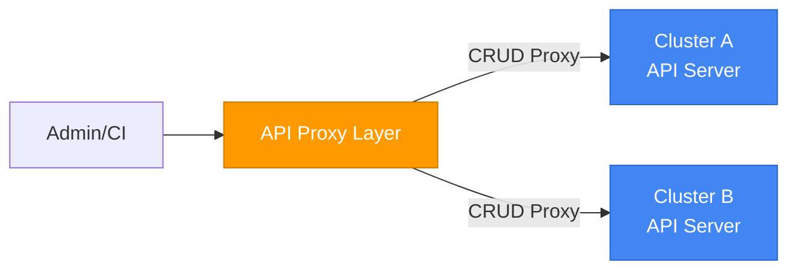
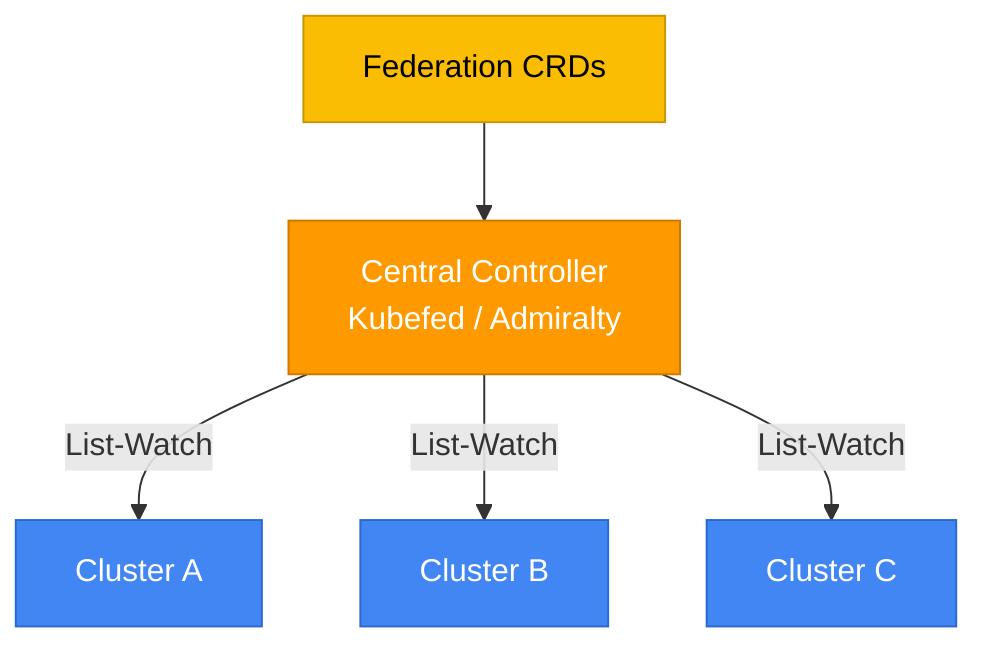
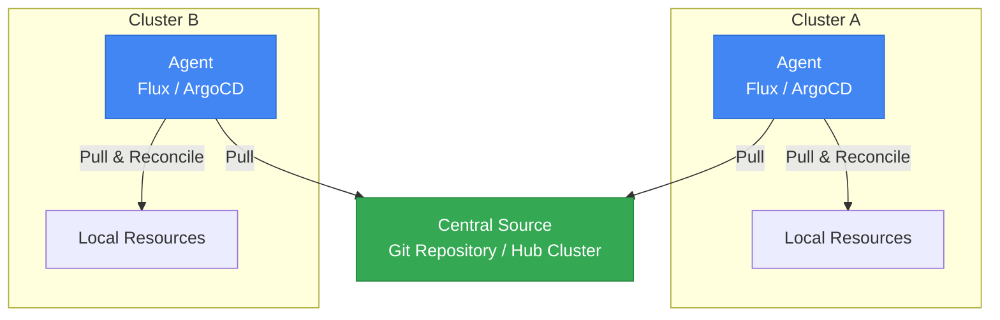
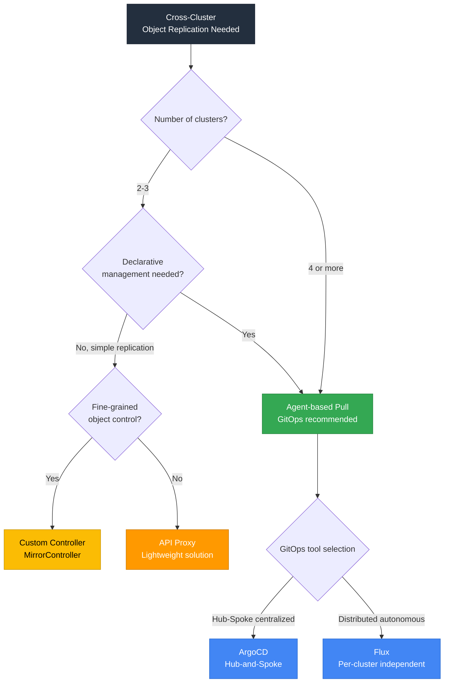
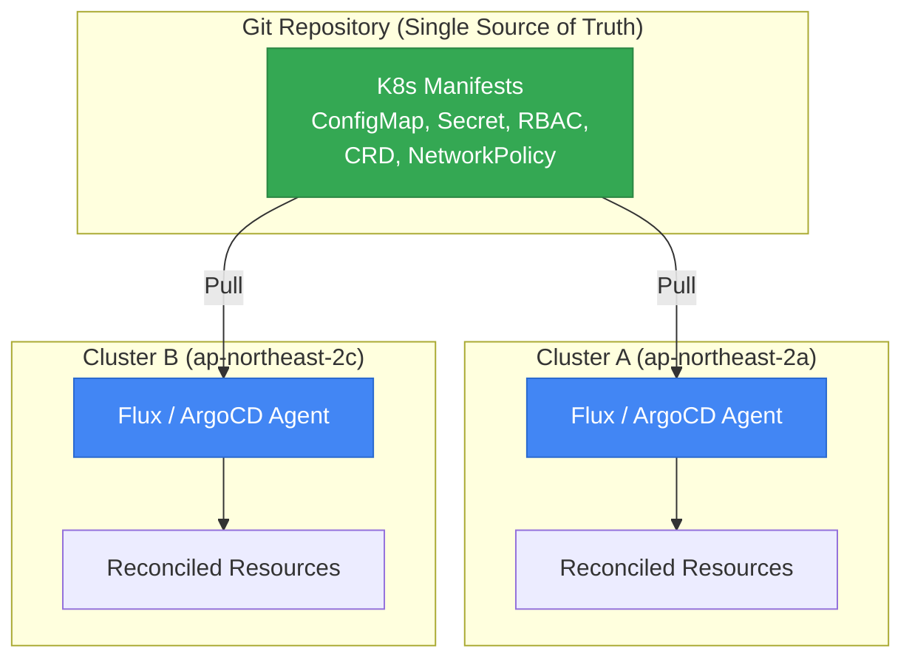
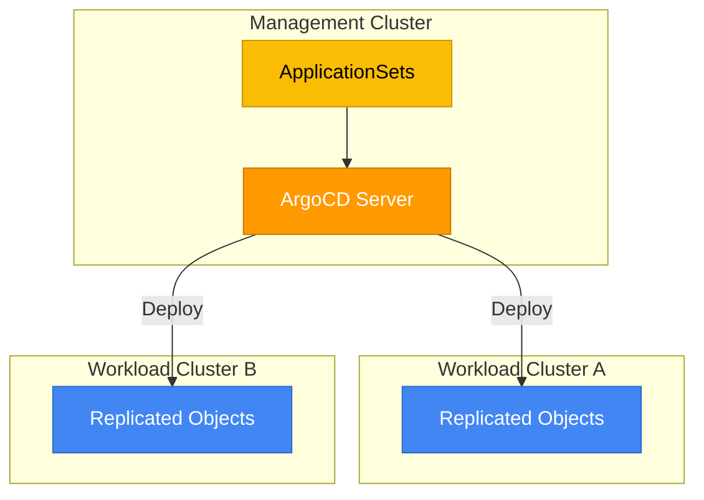
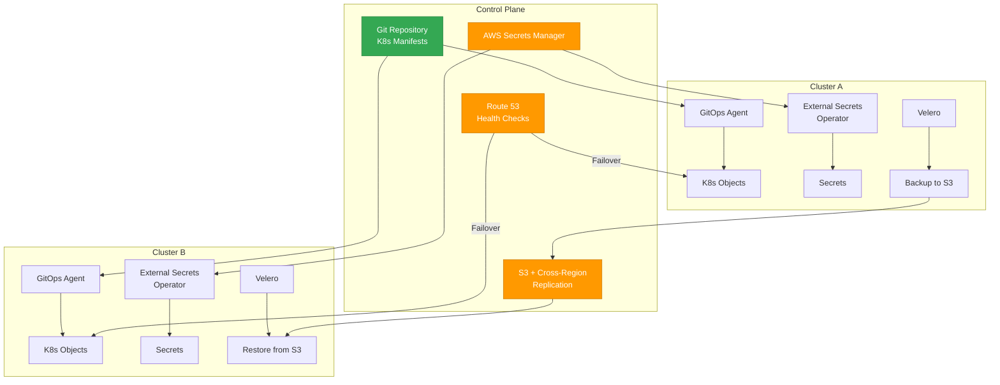

# Cross-Cluster Object Replication (HA) Architecture Guide

> **Written**: 2026-03-24 | **Updated**: 2026-03-24 | **Reading time**: ~12 min

> **Reference Environment**: EKS 1.32+, ArgoCD 2.13+, Flux v2.4+, Velero 1.15+

## 1. Overview

Relying on a single EKS cluster in production means a cluster failure brings down the entire service. **Cross-Cluster Object Replication** is a strategy that ensures high availability by consistently replicating Kubernetes objects (ConfigMaps, Secrets, RBAC, CRDs, NetworkPolicies, etc.) across multiple clusters.

### Current State

EKS does not provide managed Cross-Cluster Object Replication. Therefore, you must implement it yourself by **combining open-source tools and architecture patterns**. This guide compares the pros and cons of each pattern and provides selection criteria based on workload types.

### Scope of This Guide

| Included | Not Included |
|----------|-------------|
| K8s object replication (ConfigMap, Secret, CRD, RBAC, etc.) | Application data replication (DB replicas) |
| GitOps-based declarative synchronization | Service mesh-based traffic routing |
| Stateful object backup/restore (Velero) | Storage layer replication (EBS, EFS) |
| DNS failover strategies | Application-level HA patterns |

---

## 2. Multi-Cluster Architecture Pattern Comparison

There are three core patterns for implementing Cross-Cluster Object Replication.

### Pattern 1: API Proxy (Push Model)

A central routing layer directly proxies CRUD requests to each cluster's API Server.

- **How it works**: Direct API calls from a central point to each cluster
- **Pros**: Lightweight and intuitive
- **Cons**: Credential security vulnerabilities, no multi-cluster Watch support, increasing connection complexity

### Pattern 2: Multi-cluster Controller (Kubefed-style)

A central controller monitors each cluster's state via Informer-based List-Watch and synchronizes through CRDs.

- **How it works**: Central controller monitors and synchronizes each cluster's state
- **Pros**: Dynamic cluster discovery, federation policies
- **Cons**: Watch event overflow at ~10+ clusters, Informer cache size limits, plaintext credential storage risk

:::warning Kubefed Project Status
Kubefed (v2) is effectively in maintenance mode by the Kubernetes SIG. It is not recommended for new projects.
:::

### Pattern 3: Agent-based Pull Model (Recommended)

Agents in each cluster pull the desired state from a central source (Git or hub cluster) and reconcile locally. This follows the same principle as kubelet receiving Pod specs and running them locally.

- **How it works**: Each cluster agent independently pulls the desired state and reconciles locally
- **Pros**: High scalability, eventual consistency, local operation continues even during central failures
- **Cons**: Requires agent deployment on all clusters

### Pattern Comparison Summary

| Aspect | API Proxy | Multi-cluster Controller | Agent-based Pull |
|--------|-----------|--------------------------|-------------------|
| **Operation** | Central → Cluster Push | Central Watch + CRD Sync | Cluster → Central Pull |
| **Scalability** | Low (proportional to connections) | Medium (~10 clusters) | High (hundreds of clusters) |
| **Complexity** | Low | High | Medium |
| **Security** | Weak (many credentials) | Weak (plaintext storage) | Strong (agent local permissions) |
| **Fault Isolation** | Low | Medium | High |
| **Drift Detection** | None | Partial | Built-in |
| **Recommended For** | PoC, small scale | Legacy environments | **Production (recommended)** |

### Decision Flowchart

---

## 3. Recommended Approach Architectures

### Option A: GitOps (Flux / ArgoCD) — Recommended for Most Use Cases

Uses a Git repository as the Single Source of Truth, with GitOps agents in each cluster independently pulling and reconciling.

**Key Benefits:**

- **Drift Detection**: Automatically detects and recovers when cluster state differs from Git
- **Audit Trail**: All change history is recorded as Git commits
- **Declarative Management**: Define the desired state and let agents reconcile
- **Fault Isolation**: An agent failure in one cluster does not affect others

**Active-Active Configuration:**

Both clusters independently pull from the same Git repo. DNS (Route 53) distributes traffic, and if one cluster fails, the remaining cluster immediately handles all traffic.

**Active-Passive Configuration:**

Only the Active cluster has its GitOps agent enabled. The Passive cluster keeps its agent in Suspended state, activating it during failover.

### Option B: ArgoCD Hub-and-Spoke Model

Install ArgoCD on a Management Cluster and deploy to multiple workload clusters via ApplicationSets.

**HA Strategies:**

| Strategy | Description | Suitable Scenario |
|----------|-------------|-------------------|
| **Active-Passive Mirroring** | Deploy ArgoCD in two regions; Passive keeps controllers disabled. Manual Scale-Up during failover | Environments with low DR requirements |
| **Active-Active Sync Windows** | Two ArgoCD instances sync during non-overlapping time windows (Sync Windows feature) | Active-Active requiring conflict prevention |

:::info ApplicationSets Generator
Using ArgoCD ApplicationSets' `Cluster Generator`, applications can be automatically deployed to all clusters registered with ArgoCD. When a new cluster is added, replication starts immediately without additional configuration.
:::

### Option C: Custom Controller (MirrorController Pattern)

When fine-grained control over object replication is needed, develop a dedicated controller to manage synchronization between source and target clusters.

**Use Cases:**

- Selective replication of only objects with specific Labels/Annotations
- Object transformation during replication (e.g., Namespace changes, field modifications)
- Custom conflict resolution logic

**Pros and Cons:**

| Pros | Cons |
|------|------|
| Clear separation of concerns | Additional operational overhead |
| Reduced core logic complexity | Potential synchronization delays |
| Fine-grained replication policy control | Increased debugging complexity |
| Custom conflict resolution | Requires in-house development/maintenance |

---

## 4. Active-Active vs Active-Passive Decision

### Comparison Table

| Aspect | Active-Active | Active-Passive |
|--------|---------------|----------------|
| **Object Sync** | Both clusters independently pull from same Git source | Only Active reconciles; Passive stands by |
| **Failover Time** | Near-zero (both already serving) | Minutes (Passive activation required) |
| **Conflict Resolution** | Write conflicts possible — prevention via Sync Windows needed | No conflicts — single writer |
| **Operational Complexity** | High (object IDs, DNS, state synchronization) | Low (standard failover model) |
| **Cost** | High (full capacity on both sides) | Low (Passive can run at reduced capacity) |
| **Suitable Scenario** | Multi-region HA, global load balancing | DR, cost-sensitive HA |

### Recommended Mode by Workload Type

---

## 5. Supporting Tool Stack

Object replication alone cannot achieve complete Cross-Cluster HA. Combine the following tools to build the full stack.

| Tool | Role | Notes |
|------|------|-------|
| **Flux / ArgoCD** | K8s object replication (GitOps) | Core replication mechanism |
| **Route 53** | DNS-based failover/load balancing | Health Check + Failover Routing |
| **Global Accelerator** | Anycast IP-based global routing | For multi-region Active-Active |
| **Velero** | Stateful object backup/restore (PV, etcd) | Combined with S3 Cross-Region Replication |
| **External Secrets Operator** | Secret synchronization | AWS Secrets Manager → both clusters |
| **Crossplane / ACK** | AWS resource definition sync | Manage IaC as K8s objects |

### Tool Combination Architecture

---

## 6. Current Limitations and Future Outlook

There are features in the EKS multi-cluster management space that are not yet available as managed services.

| Area | Current State | Alternative |
|------|---------------|-------------|
| **Managed ClusterSets** | Not released | RAM (Resource Access Manager) for Cross-Account grouping |
| **Built-in Cross-Cluster Replication** | Not released | GitOps (Flux/ArgoCD) |
| **Multi-Region EKS Cluster** | Not released | Independent clusters per region + GitOps sync |
| **Managed ArgoCD** | In development | Self-managed ArgoCD installation |

:::tip Practical Approach
Until these features are released, the GitOps + supporting tool stack combination is the most mature and proven approach. Already about 10% of EKS customers have adopted GitOps based on Flux/ArgoCD.
:::

---

## 7. Recommended Production Combinations

Final recommended tool combinations for eliminating single-cluster dependency.

| Purpose | Recommended Tool | Configuration |
|---------|------------------|---------------|
| **K8s Object Replication** | GitOps (Flux or ArgoCD) | Both clusters pull from the same Git repo |
| **Stateful Data Protection** | Velero + S3 Cross-Region Replication | Scheduled backup + cross-region replication |
| **Secret Synchronization** | External Secrets Operator | AWS Secrets Manager as shared source |
| **DNS Failover** | Route 53 Health Checks | Active-Active or Failover Routing |
| **CRD/Custom Resources** | Include in GitOps repo | Managed identically to standard K8s objects |
| **AWS Resource Definitions** | Crossplane or ACK | Sync IaC natively in K8s |

### Implementation Priority

1. **P0**: Deploy GitOps agents + design Git repo structure
2. **P1**: Configure External Secrets Operator + Route 53 Health Checks
3. **P2**: Establish Velero backup policies + S3 Cross-Region Replication
4. **P3**: AWS resource sync with Crossplane/ACK (as needed)

---

## 8. Related Documents

- [EKS High Availability Architecture Guide](/docs/eks-best-practices/operations-reliability/eks-resiliency-guide) — Failure Domain response strategies by layer
- [GitOps-based Cluster Operations](/docs/eks-best-practices/operations-reliability/gitops-cluster-operation) — Flux/ArgoCD operations guide

---

## 9. References

- [ArgoCD ApplicationSets](https://argo-cd.readthedocs.io/en/stable/operator-manual/applicationset/) — Multi-cluster automatic deployment
- [ArgoCD Sync Windows](https://argo-cd.readthedocs.io/en/stable/user-guide/sync_windows/) — Active-Active conflict prevention
- [Flux Multi-Tenancy](https://fluxcd.io/flux/guides/repository-structure/) — Multi-cluster repo structure
- [Velero Documentation](https://velero.io/docs/) — Cluster backup/restore
- [External Secrets Operator](https://external-secrets.io/) — External secret synchronization
- [Crossplane](https://www.crossplane.io/) — K8s native IaC
- [AWS Route 53 Health Checks](https://docs.aws.amazon.com/Route53/latest/DeveloperGuide/health-checks-creating.html) — DNS failover
