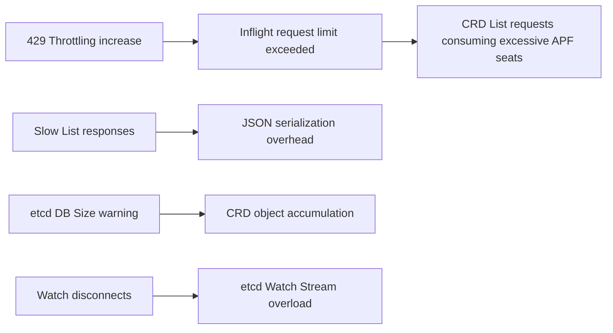

# EKS Control Plane Deep Dive — CRD at Scale Comprehensive Guide

> **Written**: 2026-03-24 | **Reading time**: ~25 min

When operating CRD-based platforms on EKS, the Control Plane is the first bottleneck. This guide covers Control Plane internals, CRD impacts, Provisioned Control Plane (PCP), and monitoring strategies.

---

## 1. EKS Control Plane Internal Architecture

### 1.1 Physical Infrastructure Layout

```
EKS Control Plane (AWS Managed)
├── kube-apiserver (min 2, multi-AZ)
├── kube-controller-manager
├── kube-scheduler
├── etcd (distributed key-value store)
└── Network Load Balancer (API Server endpoint)
```

- Components distributed across multiple AZs for HA
- Single API Server endpoint exposed via NLB
- Fully managed by AWS, separate from customer VPC

### 1.2 etcd — The Heart of the Control Plane

| Characteristic | Description | CRD Impact |
|---------------|-------------|------------|
| **DB Size Limit** | Standard 8GB, Provisioned 16GB | More CRD objects increase DB size |
| **Request Size Limit** | Single object max 1.5MB | Large CR specs approach the limit |
| **Watch Stream** | Real-time change propagation | Load increases with more CRD controller Watches |
| **RAFT Consensus** | Majority agreement for writes | Latency in write-heavy CRD patterns |

:::info etcd Architecture Evolution
AWS continues improving the EKS etcd layer for **predictable performance**, **data durability**, and **availability**.
:::

---

## 2. Control Plane Auto-Scaling

EKS **automatically vertically scales** Control Plane instances based on API Server load, etcd load, scheduling load, and data plane size.

:::warning Key Insight
Standard tier etcd DB Size is **fixed at 8GB**. This is the first bottleneck for CRD-heavy platforms — auto-scaling CPU/Memory does not expand etcd capacity.
:::

---

## 3. EKS Provisioned Control Plane (PCP)

GA at re:Invent 2025. Set a **performance floor** by selecting a tier.

| Tier | etcd DB | SLA | Hourly Price |
|------|---------|-----|-------------|
| Standard | 8GB | 99.95% | $0.10 |
| **XL** | **16GB** | **99.99%** | $1.65 |
| **2XL** | **16GB** | **99.99%** | $3.40 |
| **4XL** | **16GB** | **99.99%** | $6.90 |
| **8XL** | **16GB** | **99.99%** | $13.90 |

| Feature | Standard | XL+ |
|---------|----------|-----|
| API Server horizontal scaling (>2) | Limited to 2 | Yes |
| etcd DB Size 16GB | Fixed 8GB | 16GB |
| etcd Event Sharding | No | Yes |
| 99.99% SLA | 99.95% | 99.99% |

:::tip Why Provisioned for CRD Platforms
The first limit in CRD platforms is **etcd DB Size**. Provisioned doubles it to 16GB and offloads event pressure via Event Sharding.
:::

```bash
aws eks create-cluster --name prod \
  --role-arn arn:aws:iam::012345678910:role/eks-service-role \
  --resources-vpc-config subnetIds=subnet-xxx,securityGroupIds=sg-xxx \
  --control-plane-scaling-config tier=XL

aws eks update-cluster-config --name example \
  --control-plane-scaling-config tier=XL
```

---

## 4. Impact of CRDs on Control Plane

### 4.1 Impact on etcd

| Factor | Mechanism | Severity |
|--------|-----------|----------|
| **DB Size Growth** | CRD objects occupy etcd storage | High |
| **Watch Stream Load** | Controllers create Watch streams | High |
| **Request Size** | Objects approach 1.5MB limit | Medium |
| **List Call Cost** | JSON encoding (not protobuf) | High |

### 4.2 Impact on API Server

1. **JSON vs Protobuf**: CRDs use JSON — List/Watch performance significantly degraded
2. **APF**: List requests can occupy up to 10 seats
3. **Watch Cache**: Defaults to 100



:::danger CRD Load Formula
**Control Plane Load = CRD Type Count x Object Size x Controller Pattern (List/Watch Frequency)**
:::

---

## 5. EKS Control Plane Monitoring

Four observability dimensions:

1. **CloudWatch Vended Metrics** (automatic, free, v1.28+)
2. **Prometheus Endpoints** (KCM/KSH/etcd, manual)
3. **Control Plane Logging** (5 log types to CloudWatch)
4. **Cluster Insights** (automatic health/upgrade checks)

```bash
kubectl get --raw=/apis/metrics.eks.amazonaws.com/v1/kcm/container/metrics
kubectl get --raw=/apis/metrics.eks.amazonaws.com/v1/ksh/container/metrics
kubectl get --raw=/apis/metrics.eks.amazonaws.com/v1/etcd/container/metrics

aws eks update-cluster-config --name my-cluster \
  --logging '{"clusterLogging":[{"types":["api","audit","authenticator","controllerManager","scheduler"],"enabled":true}]}'
```

| Channel | Cost | Setup | PCP Support |
|---------|------|-------|-------------|
| CloudWatch Vended Metrics | Free | Automatic (v1.28+) | Tier usage metrics |
| Prometheus Endpoint | Free | Manual | Extensible |
| Control Plane Logging | CW rates | Manual | — |
| Cluster Insights | Free | Automatic | Future tier recommendations |

---

## 6. CRD Design Best Practices

1. **Minimize Object Size** — Keep CR specs small, offload large data
2. **Manage CRD Count** — Consolidate similar resources, clean unused CRDs
3. **Controller Optimization** — SharedInformer, pagination, Exponential Backoff
4. **Keep K8s Current** — K8s 1.33+ Streaming List
5. **Cluster Architecture** — Separate CRD clusters from workload clusters

---

## 7. Recommendations & Adoption Roadmap

| Profile | Tier | Monthly Cost |
|---------|------|-------------|
| ≤10 CRDs | Standard | ~$73 |
| 10-30 CRDs | **XL** | ~$1,204 |
| 30+ CRDs | **2XL** | ~$2,482 |
| Large AI/ML | **4XL** | ~$5,037 |

| Phase | Timeline | Activities |
|-------|----------|-----------|
| **1: Basic** | 1 week | CloudWatch alarms, Control Plane Logging |
| **2: Prometheus** | 2 weeks | AMP Scraper, Grafana dashboards |
| **3: PCP** | 1 week | Select and apply PCP tier |
| **4: Optimize** | Ongoing | Insights, tier adjustments, controller tuning |

---

:::info References
- [Amazon EKS Provisioned Control Plane](https://docs.aws.amazon.com/eks/latest/userguide/provisioned-control-plane.html)
- [EKS Control Plane Metrics](https://docs.aws.amazon.com/eks/latest/userguide/control-plane-metrics.html)
- [EKS Best Practices — Control Plane](https://docs.aws.amazon.com/eks/latest/best-practices/control-plane.html)
- [Amazon EKS Introduces Provisioned Control Plane](https://aws.amazon.com/blogs/containers/amazon-eks-introduces-provisioned-control-plane/)
- [Managing etcd Database Size on Amazon EKS Clusters](https://aws.amazon.com/blogs/containers/managing-etcd-database-size-on-amazon-eks-clusters)
- [Amazon EKS Enhances Kubernetes Control Plane Observability](https://aws.amazon.com/blogs/containers/amazon-eks-enhances-kubernetes-control-plane-observability/)
- [API Priority and Fairness](https://kubernetes.io/docs/concepts/cluster-administration/flow-control/)
- [etcd Performance Best Practices](https://etcd.io/docs/v3.5/op-guide/performance/)
- [Grafana Dashboard: EKS Control Plane](https://grafana.com/grafana/dashboards/21192-eks-control-plane/)
:::
