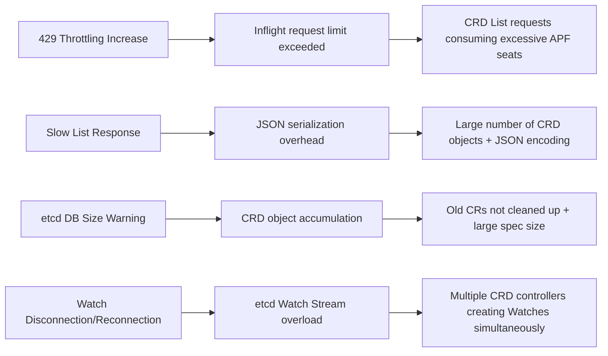

# EKS Control Plane Deep Dive — Comprehensive Guide to CRD at Scale

> 📅 **Created**: 2026-03-24 | ⏱️ **Reading time**: ~25 min

When operating CRD (Custom Resource Definition) based platforms on EKS, the Control Plane becomes the first bottleneck. This guide provides practical strategies for **understanding how the Control Plane operates**, **identifying the specific impact of CRDs**, and **proactively responding through Provisioned Control Plane (PCP) and monitoring**.

---

## Table of Contents

1. [EKS Control Plane Internal Architecture](#1-eks-control-plane-internal-architecture)
2. [Automatic Scaling — VAS](#2-automatic-scaling--vas)
3. [EKS Provisioned Control Plane (PCP)](#3-eks-provisioned-control-plane-pcp)
4. [Impact of CRDs on Control Plane](#4-impact-of-crds-on-control-plane)
5. [EKS Control Plane Monitoring](#5-eks-control-plane-monitoring)
6. [CRD Design Best Practices](#6-crd-design-best-practices)
7. [Comprehensive Recommendations & Adoption Roadmap](#7-comprehensive-recommendations--adoption-roadmap)

---

## 1. EKS Control Plane Internal Architecture

### 1.1 Physical Infrastructure Structure

The EKS Control Plane runs in a dedicated VPC managed by AWS. It is independent infrastructure separated from customer worker nodes.

```
EKS Control Plane (AWS Managed)
├── Control Plane Instances (CPI): 2~6 instances (distributed across AZs)
│   ├── kube-apiserver
│   ├── kube-controller-manager
│   ├── kube-scheduler
│   └── etcd (runs on same instance as API Server)
├── Network Load Balancer: 1 instance (API Server endpoint)
└── Route53 Records
```

Key points:
- Control Plane instances are **distributed across 3 AZs** to ensure high availability
- etcd runs **colocated on the same instance** as the API Server
- A single API Server endpoint is exposed to customers through an NLB

### 1.2 etcd — The Heart of the Control Plane

etcd is a distributed key-value store that stores all Kubernetes state (Pods, Services, CRD objects, etc.). Why it becomes the critical bottleneck for Control Plane performance:

| Characteristic | Description | CRD Impact |
|------|------|---------|
| **DB Size Limit** | Standard tier 10GB, XL and above 20GB | More CRD objects increase DB size |
| **Request Size Limit** | Max 1.5MB per single object | Large specs in CRs can approach the limit |
| **Watch Stream** | Real-time propagation of changes | More CRD controllers adding Watches increase load |
| **RAFT Consensus** | Majority consensus required for writes | Latency occurs with write-heavy CRD patterns |

:::info etcd Architecture Evolution
AWS is working on replacing etcd's consensus layer with an internal service called Journal. This is expected to deliver **predictable performance** (consistent latency), **zero data loss guarantee**, and **enhanced availability**.
:::

---

## 2. Automatic Scaling — VAS

### 2.1 VAS Operation Principles

EKS automatically vertically scales Control Plane instances through **VAS (Vertical Autoscaling Service)**. VAS evaluates the following metrics in **3-minute cycles**:

| Signal Source | Metric | Description |
|---------|--------|------|
| EC2 Internal | CPU Utilization | Control Plane instance CPU |
| EC2 Internal | Memory Utilization | Control Plane instance memory |
| K8s Metrics | Inflight Requests | API Server concurrent request count |
| K8s Metrics | Scheduler QPS | Pod scheduling throughput |
| K8s Metrics | etcd DB Size | etcd database size |
| Data Plane | Worker Node Count | Proactive scale-up based on node count |

### 2.2 Scaling Policies

- **Scale Up**: **Immediate scale-up** when CPU/Memory exceeds 80% or K8s metric watermarks are exceeded
- **Scale Down**: CPU/Memory below 30% → **1-hour cooldown** before scale-down in Standard mode (conservative)

### 2.3 Instance Bundle Ladder

VAS scales instances following this ladder:

```
2 vCPU → 4 vCPU → 8 vCPU → 16 vCPU → 32 vCPU → 64 vCPU → 96 vCPU
                                                    ↑
                                            Standard tier maximum
```

Most clusters start at **2 vCPU** and automatically scale up based on load.

### 2.4 Detailed Parameters by Bundle

| Bundle | Max Objects | Inflight/Mutating | Watch Cache | etcd DB |
|------|------------|-------------------|-------------|---------|
| 2cpu x 2 | 1,200 | 50/100 | 20/30 | 10GB |
| 4cpu x 2 | 1,600 | 54-65/100 | 40/40 | 10GB |
| 8cpu x 2 | 2,000 | 62-79/100 | 60/60 | 10GB |
| 16cpu x 2 | 2,400 | 78-108/108 | 100/100 | 10GB |
| 32cpu x 2 | 3,100 | 100-167/167 | 180/180 | 10GB |
| 64cpu x 2 | 3,800 | 100-283/283 | 340/340 | 10GB |
| 96cpu x 2 | 4,500 | 100-400/400 | 500/500 | 10GB |
| 96cpu x 3 | 6,750 | 400/400 | 500/500 | 10GB |
| 96cpu x 6 | 13,500 | 400/400 | 500/500 | 10GB |

VAS automatically adjusts `--max-requests-inflight`, `--max-mutating-requests-inflight`, `--default-watch-cache-size`, `--kube-api-qps/burst` etc. per bundle.

:::warning Key Insight
In Standard tier, etcd DB Size is **always fixed at 10GB**. In platforms with many CRD objects, this limit becomes the first bottleneck. No matter how much VAS scales up CPU/Memory, etcd capacity does not increase.
:::

---

## 3. EKS Provisioned Control Plane (PCP)

### 3.1 Overview

**EKS Provisioned Control Plane (PCP)** was released as GA at re:Invent 2025. It allows customers to directly select the Control Plane scaling tier (T-Shirt Size) to set a **performance floor**.

Previously, you could only rely on VAS automatic scaling, but with PCP you can **proactively secure a minimum guaranteed performance level**.

### 3.2 Two Operating Modes

| Mode | Description |
|------|------|
| **Standard** (Dynamic mode) | Same as before. VAS automatically scales within 2 vCPU ~ 32 vCPU range. 1-hour scale-down cooldown |
| **Provisioned** (Provisioning mode) | Customer selects desired tier among XL/2XL/4XL/8XL. VAS never scales down below that tier. Can automatically scale up above tier if needed |

### 3.3 Tier Specifications and Pricing

| Tier | Max Objects | Inflight | Watch Cache | etcd DB | SLA | Hourly Price | CPI Configuration |
|------|-----------|----------|-------------|---------|-----|----------|---------|
| Standard | 1,200 ~ 3,100 | 50 ~ 100 | 20 ~ 180 | 10GB | 99.95% | $0.10 | 2 x 2~32 vCPU |
| **XL** | ~3,800 | ~283 | ~340 | **20GB** | **99.99%** | $1.75 | 2 x 64 vCPU |
| **2XL** | ~4,500 | ~400 | ~500 | **20GB** | **99.99%** | $3.50 | 2 x 96 vCPU |
| **4XL** | ~6,750 | ~400 | ~500 | **20GB** | **99.99%** | $7.00 | 3 x 96 vCPU |
| **8XL** | ~13,500 | ~400 | ~500 | **20GB** | **99.99%** | $14.00 | 6 x 96 vCPU |

### 3.4 PCP Core Design Principles

1. **Avoid scale-ups caused by internal resources (CPU/Memory) invisible to customers** — Scaling should first be triggered by K8s metrics (inflight requests, scheduler QPS, etcd DB size) that are billing criteria
2. **Availability > Price** — Both customers and EKS prioritize availability over cost
3. **Standard tier guarantees at least upstream K8s default values**

### 3.5 Features Available Only in XL and Above Tiers

| Feature | Standard | XL and Above |
|------|----------|--------|
| API Server horizontal scaling (2+ instances) | 2 instance limit | Possible (4XL: 3 instances, 8XL: 6 instances) |
| etcd DB Size 20GB | 10GB fixed | 20GB |
| etcd Event Sharding | Not available | Available (separates event objects into separate etcd partition) |
| 99.99% SLA | 99.95% | 99.99% |

:::tip Why XL and Above is Recommended for CRD Platforms
The first limit reached in CRD-based platforms is **etcd DB Size**. The 10GB limit in Standard tier is quickly exhausted in environments with many CRD objects. XL and above expand to 20GB (2x), and can also separate event object load through Event Sharding.
:::

### 3.6 CLI/API Usage

**Specify tier when creating cluster:**

```bash
aws eks create-cluster --name prod \
  --role-arn arn:aws:iam::012345678910:role/eks-service-role \
  --resources-vpc-config subnetIds=subnet-xxx,securityGroupIds=sg-xxx \
  --control-plane-scaling-config tier=XL
```

**Change tier for existing cluster:**

```bash
aws eks update-cluster-config --name example \
  --control-plane-scaling-config tier=XL
```

**Check update progress:**

```bash
aws eks describe-update --name example --update-id <update-id>
# Response: { "update": { "type": "ScalingTierConfigUpdate", "status": "Successful" } }
```

**Check cluster information:**

```bash
aws eks describe-cluster --name example
# Response includes controlPlaneScalingConfig.tier field
```

### 3.7 PCP-Related Cluster Attributes

| Attribute | Description |
|------|------|
| `controlPlaneScalingConfig.tier` | Currently provisioned tier (Standard/XL/2XL/4XL/8XL) |
| Control Plane Scaling Tier - Provisioned (CPSTP) | Tier provisioned by customer through PCP feature |
| Control Plane Scaling Tier - Consumed (CPSTC) | Current actual Control Plane tier (reached by automatic scaling or PCP) |

---

## 4. Impact of CRDs on Control Plane

When operating CRD-based platforms, you must accurately understand the impact on the Control Plane. The impact is divided into two main axes: **etcd** and **API Server**.

### 4.1 Impact on etcd (Most Important)

| Impact Factor | Mechanism | Impact Level |
|---------|---------|-------|
| **DB Size Growth** | CRD objects occupy etcd storage | High |
| **Watch Stream Load** | CRD controllers create Watch streams increasing etcd gRPC load | High |
| **Request Size** | Individual CRD objects can approach 1.5MB limit | Medium |
| **List Call Cost** | CRDs use JSON encoding (not protobuf) → performance bottleneck | High |

**etcd DB Size Limits (by PCP tier):**

| Tier | DB Size Limit | Single Object Limit |
|------|-----------|--------------|
| Standard | 10GB (20GB EBS) | 1.5MB (unchangeable) |
| XL and Above | 20GB | 1.5MB (unchangeable) |

### 4.2 Impact on API Server

CRD-related API Server performance issues:

1. **JSON vs Protobuf**: CRDs use JSON serialization, so **List/Watch performance is significantly degraded** compared to built-in resources
2. **APF (API Priority and Fairness)**: List requests can occupy up to 10 seats by the Work Estimator, quickly reaching inflight request limits
3. **Watch Cache**: CRD Watch Cache capacity defaults to 100, same as built-in resources

### 4.3 Symptom-to-Cause Mapping

Mapping symptoms and their causes in actual production environments:



:::danger CRD Load Formula
**Control Plane Load = Number of CRD Types x Object Size x Controller Pattern (List/Watch frequency)**

You must manage all three factors. Even with few CRD types, the same problem occurs if objects are large or controllers are inefficient.
:::

---

## 5. EKS Control Plane Monitoring

EKS provides **4 dimensions of Observability** for the Control Plane:

```
┌─────────────────────────────────────────────────────────────────────┐
│                 EKS Control Plane Observability                      │
├──────────────────┬──────────────────┬────────────────┬──────────────┤
│ ① CloudWatch     │ ② Prometheus     │ ③ Control      │ ④ Cluster    │
│    Vended Metrics│    Metrics       │    Plane       │    Insights  │
│                  │    Endpoint      │    Logging     │              │
├──────────────────┼──────────────────┼────────────────┼──────────────┤
│ AWS/EKS namespace│ KCM/KSH/etcd    │ API/Audit/     │ Upgrade      │
│ (automatic, free)│ (Prometheus      │ Auth/CM/Sched  │ Readiness    │
│                  │  compatible      │ (CloudWatch    │ Health Issues│
│                  │  K8s API)        │  Logs)         │ Addon Compat │
├──────────────────┼──────────────────┼────────────────┼──────────────┤
│ v1.28+ automatic │ v1.28+ manual    │ All versions   │ All versions │
│                  │ configuration    │                │ automatic    │
└──────────────────┴──────────────────┴────────────────┴──────────────┘
```

### 5.1 CloudWatch Vended Metrics (Automatic, Free)

For K8s 1.28+ clusters, core Control Plane metrics are automatically published to the CloudWatch `AWS/EKS` namespace at no additional cost.

**Key Vended Metrics:**

| Component | Metric | Description | Priority |
|---------|--------|------|-------|
| API Server | `apiserver_request_total` | Total API requests | Required |
| API Server | `apiserver_request_total_4xx` | 4xx error requests | Required |
| API Server | `apiserver_request_total_5xx` | 5xx error requests | Required |
| API Server | `apiserver_request_total_429` | 429 Throttling requests | Required |
| API Server | `apiserver_request_duration_seconds` | API request latency | Recommended |
| API Server | `apiserver_storage_size_bytes` | etcd storage size (before defrag) | Required |
| Scheduler | `scheduler_schedule_attempts_total` | Total scheduling attempts | Recommended |
| Scheduler | `scheduler_schedule_attempts_SCHEDULED` | Successful scheduling count | Required |
| Scheduler | `scheduler_schedule_attempts_UNSCHEDULABLE` | Unschedulable count | Recommended |

**PCP-Exclusive Additional Metrics:**

| Metric | Description | Usage |
|--------|------|------|
| `apiserver_flowcontrol_current_executing_seats_total` | API Server current concurrent execution seats | Monitor API Request Concurrency against tier limit |
| `etcd_mvcc_db_total_size_in_use_in_bytes` | etcd DB actual usage size | Monitor Cluster Database Size against tier limit |
| `apiserver_storage_size_bytes` | Storage size before defrag | Alternative etcd DB size metric |

### 5.2 Prometheus-Compatible Metrics Endpoint

You can scrape not only API Server metrics but also **KCM (Kube-Controller-Manager)**, **KSH (Kube-Scheduler)**, and **etcd** metrics.

**Metrics Endpoint Paths:**

```bash
# API Server metrics (existing)
kubectl get --raw=/metrics

# Kube-Controller-Manager metrics
kubectl get --raw=/apis/metrics.eks.amazonaws.com/v1/kcm/container/metrics

# Kube-Scheduler metrics
kubectl get --raw=/apis/metrics.eks.amazonaws.com/v1/ksh/container/metrics

# etcd metrics
kubectl get --raw=/apis/metrics.eks.amazonaws.com/v1/etcd/container/metrics
```

**Prometheus Scraping Configuration Example:**

```yaml
scrape_configs:
  - job_name: 'kcm-metrics'
    honor_labels: true
    kubernetes_sd_configs:
      - role: endpoints
    scheme: https
    metrics_path: /apis/metrics.eks.amazonaws.com/v1/kcm/container/metrics
    tls_config:
      ca_file: /var/run/secrets/kubernetes.io/serviceaccount/ca.crt
    bearer_token_file: /var/run/secrets/kubernetes.io/serviceaccount/token
    relabel_configs:
      - source_labels:
          [__meta_kubernetes_namespace, __meta_kubernetes_service_name,
           __meta_kubernetes_endpoint_port_name]
        action: keep
        regex: default;kubernetes;https
```

**Required RBAC Permissions:**

```yaml
rules:
  - apiGroups: ["metrics.eks.amazonaws.com"]
    resources: ["kcm/metrics", "ksh/metrics", "etcd/metrics"]
    verbs: ["get"]
```

**KCM/KSH Metrics Particularly Useful for CRD Operations:**

| Metric | Source | Description |
|--------|------|------|
| `workqueue_depth` | KCM | Work queue depth per controller — check CRD controller load |
| `workqueue_adds_total` | KCM | Total items added to queue |
| `workqueue_retries_total` | KCM | Retry count — identify CRD controller error rate |
| `scheduler_pending_pods` | KSH | Number of pending Pods |
| `scheduler_scheduling_duration_seconds` | KSH | Scheduling latency |
| `apiserver_flowcontrol_current_executing_seats` | API Server | Current execution seats per APF — check CRD List request impact |

**Amazon Managed Prometheus (AMP) Integration:**

Using EKS's **Agentless Collector (Poseidon)**, you can automatically collect Control Plane metrics to an AMP workspace without installing Prometheus in the cluster.

```
EKS Console → Observability tab → Add scraper → Select AMP Workspace
```

### 5.3 Control Plane Logging

EKS can export 5 types of Control Plane logs to CloudWatch Logs:

| Log Type | Description | CRD Use Case |
|---------|------|------------|
| API Server (api) | API request/response logs | Analyze CRD API call patterns |
| Audit (audit) | Audit logs of who did what | Track CRD changes, security audit |
| Authenticator | IAM authentication logs | Debug authentication issues |
| Controller Manager | KCM diagnostic logs | Analyze CRD controller errors |
| Scheduler | Scheduler decision logs | Analyze Pod scheduling issues |

**Activation Method:**

```bash
aws eks update-cluster-config --name my-cluster \
  --logging '{"clusterLogging":[{"types":["api","audit","authenticator","controllerManager","scheduler"],"enabled":true}]}'
```

**CloudWatch Logs Insights Query Example — Analyze CRD-related API Call Patterns:**

```sql
-- Analyze CRD-related API call patterns
fields @timestamp, userAgent, verb, requestURI
| filter requestURI like /customresourcedefinitions/
| stats count(*) by verb, userAgent
| sort count(*) desc
| limit 20
```

### 5.4 Cluster Insights

EKS Cluster Insights automatically scans clusters to detect potential issues and provide recommendations:

| Category | Description | Frequency |
|---------|------|------|
| Upgrade Insights | Detect items that may cause issues during K8s version upgrade | 24 hours + manual |
| Configuration Insights | Detect cluster configuration errors | 24 hours + manual |
| Addon Compatibility | Check if EKS Addons are compatible with next K8s version | 24 hours |
| Cluster Health Issues | Current cluster health status issues | 24 hours |

```bash
aws eks list-insights --cluster-name my-cluster
aws eks describe-insight --cluster-name my-cluster --id <insight-id>
```

### 5.5 EKS Console Observability Dashboard

The EKS Console includes an integrated Observability Dashboard:

```
EKS Console → Select Cluster → Observability tab
├── Health and Performance Summary (summary cards)
├── Cluster Health Issues (health issue list)
├── Control Plane Monitoring
│   ├── Metrics (CloudWatch-based graphs)
│   │   ├── API Server Request Types (Total, 4XX, 5XX, 429)
│   │   ├── etcd Database Size
│   │   └── Kube-Scheduler Scheduling Attempts
│   ├── CloudWatch Log Insights (predefined queries)
│   └── Control Plane Logs (CloudWatch links)
└── Upgrade Insights (upgrade readiness status)
```

### 5.6 Monitoring Channel Comparison Table

| Channel | Cost | Setup | Data Type | PCP Support |
|------|------|------|----------|---------|
| CloudWatch Vended Metrics | Free (AWS/EKS) | Automatic (v1.28+) | Core K8s metrics (time series) | Includes tier usage metrics |
| Prometheus Endpoint | Free (scraping) | Manual configuration required | Detailed KCM/KSH/etcd metrics | Extensible |
| Control Plane Logging | CloudWatch standard pricing | Manual activation | Logs (API/Audit/Auth/CM/Sched) | — |
| Cluster Insights | Free | Automatic | Cluster health/upgrade recommendations | PCP tier recommendations (future) |
| EKS Console Dashboard | Free | Automatic | Visualized metrics + log queries | Displays tier information |

---

## 6. CRD Design Best Practices

### 6.1 Minimize Object Size

- Keep each CR instance's **spec size as small as possible** (etcd 1.5MB request limit)
- Separate large data into **ConfigMap or external storage references**
- Include only necessary information in status field — move history or log-type data externally

### 6.2 Manage Number of CRDs

- More CRD types proportionally increase API Server **Watch Cache** and etcd **Watch Stream**
- When possible, **consolidate similar resources into a single CRD** (leverage subresource patterns)
- Always clean up unused CRDs

### 6.3 Controller Optimization

| Pattern | Correct Usage | Usage to Avoid |
|------|-----------|-------------|
| **Watch resourceVersion** | Use `resourceVersion` correctly | Prohibit `resourceVersion=""` usage (refetches entire list) |
| **List Calls** | Always use **pagination** | Retrieve entire List at once |
| **Informer** | Use client-go's **SharedInformer** pattern | Each controller creating independent Watches |
| **Reconnection** | Apply **Exponential Backoff** when Watch disconnects | Immediately retry connection (thundering herd) |

### 6.4 Keep K8s Version Up-to-Date

- **K8s 1.33+** supports **Streaming List**, greatly improving large-scale List performance
- Use the latest K8s version when possible to benefit from Control Plane performance improvements

### 6.5 Cluster Architecture Recommendations

**Separate Clusters by Workload:**
- When there are many CRDs: Separate **Core CRD cluster** / **Workload execution cluster**
- Platform CRDs and tenant workloads in the same cluster affect each other

**Namespace-Based Isolation:**
- Limit **object count per namespace** through Kubernetes `ResourceQuota`
- Prevent **"object explosion"** due to incorrect automation or bugs

---

## 7. Comprehensive Recommendations & Adoption Roadmap

### 7.1 PCP Tier Selection Guide by CRD Scale

| Workload Profile | Recommended Tier | Key Reason | Monthly Cost (Estimate) |
|--------------|---------|---------|------------|
| Less than 10 CRDs, small-scale operations | Standard | Basic automatic scaling is sufficient | ~$73 |
| 10~30 CRDs, medium-scale operations | **XL** | Secure etcd 20GB, 99.99% SLA | ~$1,277 |
| 30+ CRDs + multiple controllers | **2XL** | inflight 4,500+, KCM QPS 500 | ~$2,555 |
| Large-scale AI/ML pipelines + CRDs | **4XL** | Horizontal scaling of 3+ API Servers | ~$5,110 |

### 7.2 Core Alert Configuration

| Alert Name | Metric | Threshold | Severity | Response Action |
|---------|--------|-------|-------|---------|
| API Throttling | `apiserver_request_total_429` | > 10/min for 5 min | Critical | Review PCP tier upgrade |
| API Server Errors | `apiserver_request_total_5xx` | > 5/min for 3 min | Critical | Check Control Plane logs |
| etcd DB Usage | `apiserver_storage_size_bytes` | > 8GB (Standard) / > 16GB (XL+) | Warning | Clean up unnecessary CRD resources |
| Scheduling Failures | `scheduler_schedule_attempts_UNSCHEDULABLE` | > 0 for 10 min | Warning | Check node resources |
| API Concurrency | `apiserver_flowcontrol_current_executing_seats_total` | > 80% of tier limit | Warning | Review higher tier provisioning |

### 7.3 Recommended Integrated Monitoring Stack

```
Integrated Monitoring Architecture
│
[1] CloudWatch Vended Metrics (automatic)
│   → Set up AWS/EKS namespace alarms
│   → Utilize Console Observability Dashboard
│
[2] Prometheus Endpoint (manual configuration)
│   → AMP Agentless Scraper or Self-hosted Prometheus
│   → Monitor CRD controllers with KCM workqueue metrics
│   → Configure Grafana dashboards
│
[3] Control Plane Logging (manual activation)
│   → Must activate audit + controllerManager logs
│   → Analyze CRD-related API call patterns
│
[4] Cluster Insights (automatic)
    → Always check before upgrades
    → PCP tier recommendations (future)
```

### 7.4 Phased Adoption Roadmap

| Phase | Duration | Key Activities |
|------|------|---------|
| **Phase 1: Basic Setup** | 1 week | Set up CloudWatch alarms, activate Control Plane Logging (audit + controllerManager) |
| **Phase 2: Prometheus Integration** | 2 weeks | Configure AMP Scraper, collect KCM/KSH metrics, Grafana dashboards |
| **Phase 3: Apply PCP** | 1 week | Select appropriate PCP tier after analyzing workload profile (XL and above recommended) |
| **Phase 4: Optimization** | Ongoing | Utilize Cluster Insights, adjust tier based on monitoring data, tune CRD controllers |

### 7.5 Final Summary — Response Strategies by Key Challenge

| Challenge | Leverage EKS Features | CRD Design Response |
|------|-----------|------------|
| **etcd Overload from CRDs** | XL and above: etcd 20GB + Event Sharding + VAS automatic scaling | Apply XL+ tier, minimize CR object size |
| **API Server Performance Degradation** | Guaranteed inflight requests per PCP tier + APF priority management | Optimize controller List/Watch patterns, use latest K8s version |
| **Scheduling Limits** | API Server horizontal scaling in 4XL/8XL (up to 6 instances) | Proactively provision higher tier when workload growth predicted |
| **Control Plane Stability** | Multi-AZ, 99.99% SLA (XL+) | XL and above recommended for production clusters |
| **Cost Predictability** | Fixed price per PCP tier ($0.10 ~ $14.00/hr) | Select appropriate tier matching workload profile |
| **Lack of Visibility** | 4 monitoring channels (Vended Metrics, Prometheus, Logging, Insights) | Phased monitoring adoption Phase 1~4 |

---

:::info References
- [Amazon EKS Provisioned Control Plane Official Documentation](https://docs.aws.amazon.com/eks/latest/userguide/provisioned-control-plane.html)
- [EKS Control Plane Metrics](https://docs.aws.amazon.com/eks/latest/userguide/control-plane-metrics.html)
- [EKS Cluster Insights](https://docs.aws.amazon.com/eks/latest/userguide/cluster-insights.html)
- [Kubernetes API Priority and Fairness](https://kubernetes.io/docs/concepts/cluster-administration/flow-control/)
- [etcd Performance Best Practices](https://etcd.io/docs/v3.5/op-guide/performance/)
:::
