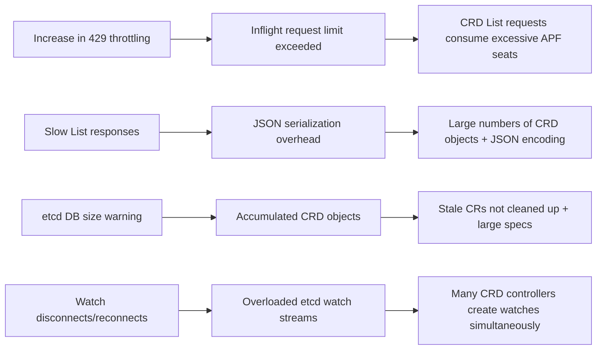

When operating platforms based on Custom Resource Definitions (CRDs) on EKS, the control plane is the first point to become a bottleneck. This guide explains **how the control plane works**, **the specific impact of CRDs**, and practical strategies for **responding proactively with Provisioned Control Plane (PCP) and monitoring**.

---

## Contents

1. [EKS Control Plane Internal Architecture](#1-eks-control-plane-internal-architecture)
2. [Control Plane Auto-Scaling](#2-control-plane-auto-scaling)
3. [EKS Provisioned Control Plane (PCP)](#3-eks-provisioned-control-plane-pcp)
4. [Impact of CRDs on Control Plane](#4-impact-of-crds-on-control-plane)
5. [EKS Control Plane Monitoring](#5-eks-control-plane-monitoring)
6. [CRD Design Best Practices](#6-crd-design-best-practices)
7. [Recommendations & Adoption Roadmap](#7-recommendations--adoption-roadmap)

---

## 1. EKS Control Plane Internal Architecture

### 1.1 Physical Infrastructure Layout

The EKS control plane runs in a dedicated VPC managed by AWS. Its infrastructure is independent of the customer's worker nodes.

```text
EKS Control Plane (AWS Managed)
├── kube-apiserver (at least 2, distributed across multiple AZs)
├── kube-controller-manager
├── kube-scheduler
├── etcd (distributed key-value store)
└── Network Load Balancer (API Server endpoint)
```

Key points:
- Control plane components are **distributed across multiple AZs** for high availability.
- Customers access a single API server endpoint through an NLB.
- AWS fully manages the control plane in an environment separate from the customer VPC.

### 1.2 etcd — The Heart of the Control Plane

etcd is the distributed key-value store that holds all Kubernetes state, including Pods, Services, and CRD objects. The following characteristics make it a key control plane performance bottleneck:

| Characteristic | Description | CRD Impact |
|------|------|---------|
| **DB Size Limit** | Standard tier: 8GB; Provisioned tier: 16GB | More CRD objects increase database size |
| **Request Size Limit** | Maximum of 1.5MB per object | CRs with large specs can approach the limit |
| **Watch Stream** | Propagates changes in real time | Each additional watch from a CRD controller increases load |
| **RAFT Consensus** | Writes require agreement from a majority | Write-heavy CRD patterns introduce latency |

:::info etcd Architecture Evolution
AWS continues to improve the EKS etcd layer, with work on **predictable performance** (consistent latency), **data durability**, and **availability**.
:::

---

## 2. Control Plane Auto-Scaling

### 2.1 How Auto-Scaling Works

EKS **automatically scales control plane instances vertically**. Resources for the API server, etcd, and other components adjust to workload demand. The main scaling signals are:

- **API server load**: Number of inflight requests and request latency
- **etcd load**: Database size and number of watch streams
- **Scheduling load**: Number of Pods waiting to be scheduled
- **Data plane size**: Proactive scale-up based on worker node count

### 2.2 Scaling Characteristics

- **Scale up**: Automatically scales up when increased load is detected.
- **Scale down**: Scales down conservatively after load decreases to avoid abrupt reductions.
- Standard mode has an upper scaling limit, which Provisioned mode can extend.

:::warning Key Insight
In the Standard tier, etcd database size is **fixed at 8GB**. This limit is the first bottleneck for platforms with many CRD objects. Increasing CPU and memory through auto-scaling does not expand etcd capacity.
:::

---

## 3. EKS Provisioned Control Plane (PCP)

### 3.1 Overview

**EKS Provisioned Control Plane (PCP)** became generally available at re:Invent 2025[^1]. It allows customers to select a control plane scaling tier, or T-shirt size, to establish **pre-allocated capacity**.

[^1]: The 8XL tier and 99.99% SLA guarantee were added in March 2026.

PCP provisions the selected tier’s capacity in advance. Actual API throughput and latency depend on request types, controller patterns, and the Kubernetes version, so workload validation is required.

### 3.2 Two Operating Modes

| Mode | Description |
|------|------|
| **Standard** (dynamic mode) | Existing behavior: scales automatically with load and scales down conservatively when load decreases |
| **Provisioned** (provisioned mode) | Customers select XL, 2XL, 4XL, or 8XL. There is no automatic transition between tiers; an administrator changes the tier or configures separate automation |

### 3.3 Tier Specifications and Pricing

| Tier | etcd DB | SLA | Hourly Price |
|------|---------|-----|----------|
| Standard | 8GB | 99.95% | $0.10 |
| **XL** | **16GB** | **99.99%** | $1.65 |
| **2XL** | **16GB** | **99.99%** | $3.40 |
| **4XL** | **16GB** | **99.99%** | $6.90 |
| **8XL** | **16GB** | **99.99%** | $13.90 |

> Standard’s $0.10/hour is the Kubernetes standard-support charge. Provisioned row prices are **tier charges added to** standard/extended-support charges. Refer to [AWS EKS Pricing](https://aws.amazon.com/eks/pricing/) for current prices.

The [official tier specifications](https://docs.aws.amazon.com/eks/latest/userguide/eks-provisioned-control-plane.html) give Standard an 8 GB etcd limit and XL, 2XL, 4XL, and 8XL the same 16 GB limit. GB follows the official documentation’s unit. Raising a Provisioned tier does not increase etcd capacity. Check the Kubernetes-version-specific API concurrency and scheduling settings.

### 3.4 Features Available Only in Provisioned Tiers

| Feature | Standard | XL and Above |
|------|----------|--------|
| Pre-allocated API concurrency capacity | Automatic capacity adjustment with load | Capacity selected by Kubernetes version and tier |
| 16GB etcd database | Fixed at 8GB | 16GB |
| etcd Event Sharding | Unavailable | Available (separates event objects into a dedicated etcd partition) |
| 99.99% SLA | 99.95% | 99.99% |

:::tip Why Provisioned for CRD Platforms
**etcd database size** is the first limit reached by CRD-based platforms. The Standard tier's 8GB limit can be exhausted quickly in environments with many CRD objects. Provisioned tiers double the capacity to 16GB, and Event Sharding can isolate the load from event objects.
:::

:::info Detailed Sizing Guidance
For Kubernetes parameters by tier (API server inflight requests and scheduler QPS), the APF seat calculation formula, a 10K-node sizing example, customer examples, and ClusterLoader2 performance validation, refer to the **[PCP Tier Sizing & Performance Validation Guide](./eks-pcp-tier-sizing-validation)**.
:::

### 3.5 CLI/API Usage {#36-cliapi-usage}

**Specify a tier when creating a cluster:**

```bash
aws eks create-cluster --name prod \
  --role-arn arn:aws:iam::012345678910:role/eks-service-role \
  --resources-vpc-config subnetIds=subnet-xxx,securityGroupIds=sg-xxx \
  --control-plane-scaling-config tier=XL
```

**Change the tier of an existing cluster:**

```bash
aws eks update-cluster-config --name example \
  --control-plane-scaling-config tier=XL
```

**Check update progress:**

```bash
aws eks describe-update --name example --update-id <update-id>
# Response: { "update": { "type": "ScalingTierConfigUpdate", "status": "Successful" } }
```

**Check cluster information:**

```bash
aws eks describe-cluster --name example
# The response includes the controlPlaneScalingConfig.tier field
```

> **Note:** The CLI flag syntax (`--control-plane-scaling-config tier=XL`) may vary by AWS CLI version. Refer to the [AWS CLI Command Reference - EKS](https://docs.aws.amazon.com/cli/latest/reference/eks/) for the current syntax.

### 3.6 PCP Cluster Properties {#37-pcp-cluster-properties}

| Property | Description |
|------|------|
| `controlPlaneScalingConfig.tier` | Currently provisioned tier (Standard/XL/2XL/4XL/8XL) |

---

## 4. Impact of CRDs on Control Plane

Operating a CRD-based platform requires an accurate understanding of its control plane impact. The two main areas are **etcd** and the **API server**.

### 4.1 Impact on etcd

etcd is the most important area of impact.

| Factor | Mechanism | Impact |
|---------|---------|-------|
| **DB Size Growth** | CRD objects occupy etcd storage | High |
| **Watch Stream Load** | CRD controllers create watch streams, increasing etcd gRPC load | High |
| **Request Size** | Individual CRD objects can approach the 1.5MB limit | Medium |
| **List Call Cost** | CRDs use JSON encoding rather than protobuf, creating a performance bottleneck | High |

**etcd database size limits by PCP tier:**

| Tier | DB Size Limit | Per-Object Limit |
|------|-----------|--------------|
| Standard | 8GB | 1.5MB (cannot be changed) |
| Provisioned (XL and above) | 16GB | 1.5MB (cannot be changed) |

### 4.2 Impact on API Server

CRD-related API server performance issues include:

1. **JSON vs Protobuf**: CRDs use JSON serialization, which **significantly reduces List/Watch performance** compared with built-in resources.
2. **API Priority and Fairness (APF)**: The work estimator can assign up to 10 seats to a List request, quickly consuming the inflight request limit.
3. **Watch Cache**: The default watch cache capacity for CRDs is 100, the same as for built-in resources.

### 4.3 Mapping Symptoms to Causes

The following diagram maps operational symptoms to their causes:


```mermaid
flowchart LR
    A[Increase in 429 throttling] --> B[Inflight request limit exceeded]
    B --> C[CRD List requests consume excessive APF seats]

    D[Slow List responses] --> E[JSON serialization overhead]
    E --> F[Large numbers of CRD objects + JSON encoding]

    G[etcd DB size warning] --> H[Accumulated CRD objects]
    H --> I[Stale CRs not cleaned up + large specs]

    J[Watch disconnects/reconnects] --> K[Overloaded etcd watch streams]
    K --> L[Many CRD controllers create watches simultaneously]
```

:::danger CRD Load Formula
**Control Plane Load = CRD Type Count x Object Size x Controller Pattern (List/Watch Frequency)**

All three factors require management. Even with few CRD types, large objects or inefficient controllers can cause the same problems.
:::

---

## 5. EKS Control Plane Monitoring

EKS provides **four dimensions of observability** for the control plane:

```text
┌──────────────────────────────────────────────────────────────────────────────────────────┐
│                            EKS Control Plane Observability                               │
├──────────────────────┬──────────────────────┬──────────────────────┬─────────────────────┤
│ ① CloudWatch         │ ② Prometheus         │ ③ Control Plane      │ ④ Cluster           │
│   Vended Metrics     │   Metrics Endpoint   │   Logging            │   Insights          │
├──────────────────────┼──────────────────────┼──────────────────────┼─────────────────────┤
│ AWS/EKS namespace    │ KCM/KSH/etcd         │ API/Audit/           │ Upgrade readiness   │
│ (automatic, free)    │ (Prometheus-         │ Auth/CM/Sched        │ Health issues       │
│                      │ compatible K8s API)  │ (CloudWatch Logs)    │ Addon compatibility │
├──────────────────────┼──────────────────────┼──────────────────────┼─────────────────────┤
│ v1.28+, automatic    │ v1.28+, manual       │ All versions         │ All versions, auto  │
└──────────────────────┴──────────────────────┴──────────────────────┴─────────────────────┘
```

### 5.1 CloudWatch Vended Metrics (Automatic, Free)

For clusters running Kubernetes 1.28 or later, key control plane metrics are automatically published to the CloudWatch `AWS/EKS` namespace at no additional charge.

**Key vended metrics:**

| Component | Metric | Description | Priority |
|---------|--------|------|-------|
| API Server | `apiserver_request_total` | Total API requests | Essential |
| API Server | `apiserver_request_total_4XX` | Requests with 4xx errors | Essential |
| API Server | `apiserver_request_total_5XX` | Requests with 5xx errors | Essential |
| API Server | `apiserver_request_total_429` | Requests throttled with 429 responses | Essential |
| API Server | `apiserver_request_duration_seconds_GET_P99` | GET request latency at p99 | Recommended |
| etcd | `etcd_mvcc_db_total_size_in_bytes` | Physical file size, including unused space; not the quota-enforcement metric | Recommended |
| Scheduler | `scheduler_schedule_attempts_total` | Total scheduling attempts | Recommended |
| Scheduler | `scheduler_schedule_attempts_SCHEDULED` | Successful scheduling attempts | Essential |
| Scheduler | `scheduler_schedule_attempts_UNSCHEDULABLE` | Unschedulable attempts | Recommended |

**Tier utilization metrics:**

| Metric | Description | Usage |
|--------|------|------|
| `apiserver_flowcontrol_current_executing_seats` | Currently executing concurrent seats on the API server | Monitor against the tier's API Request Concurrency limit |
| `etcd_mvcc_db_total_size_in_use_in_bytes` | Actual etcd database space in use | Monitor against the tier's Cluster Database Size limit |
| `etcd_mvcc_db_total_size_in_bytes` | Physical etcd file size | Compare with actual usage to identify unused space |

These names follow the [CloudWatch `AWS/EKS` metrics](https://docs.aws.amazon.com/eks/latest/userguide/cloudwatch.html). Prometheus `apiserver_storage_size_bytes` also measures physical file size, which differs from actual usage used for quota enforcement. Use `etcd_mvcc_db_total_size_in_use_in_bytes` for usage alarms. Check whether the cluster exposes that metric through Prometheus; otherwise, use its CloudWatch value.

### 5.2 Prometheus-Compatible Metrics Endpoints

In addition to API server metrics, metrics from **kube-controller-manager (KCM)**, **kube-scheduler (KSH)**, and **etcd** can also be scraped.

**Metrics endpoint paths:**

```bash
# API Server metrics (existing endpoint)
kubectl get --raw=/metrics

# Kube-Controller-Manager metrics
kubectl get --raw=/apis/metrics.eks.amazonaws.com/v1/kcm/container/metrics

# Kube-Scheduler metrics
kubectl get --raw=/apis/metrics.eks.amazonaws.com/v1/ksh/container/metrics

# etcd metrics
kubectl get --raw=/apis/metrics.eks.amazonaws.com/v1/etcd/container/metrics
```

**Example Prometheus scrape configuration:**

```yaml
scrape_configs:
  - job_name: 'kcm-metrics'
    honor_labels: true
    kubernetes_sd_configs:
      - role: endpoints
    scheme: https
    metrics_path: /apis/metrics.eks.amazonaws.com/v1/kcm/container/metrics
    tls_config:
      ca_file: /var/run/secrets/kubernetes.io/serviceaccount/ca.crt
    bearer_token_file: /var/run/secrets/kubernetes.io/serviceaccount/token
    relabel_configs:
      - source_labels:
          [__meta_kubernetes_namespace, __meta_kubernetes_service_name,
           __meta_kubernetes_endpoint_port_name]
        action: keep
        regex: default;kubernetes;https
```

**Required RBAC permissions:**

```yaml
rules:
  - apiGroups: ["metrics.eks.amazonaws.com"]
    resources: ["kcm/metrics", "ksh/metrics", "etcd/metrics"]
    verbs: ["get"]
```

**KCM/KSH metrics particularly useful for CRD operations:**

| Metric | Source | Description |
|--------|------|------|
| `workqueue_depth` | KCM | Work queue depth per controller; indicates CRD controller load |
| `workqueue_adds_total` | KCM | Total items added to the queue |
| `workqueue_retries_total` | KCM | Retry count; indicates CRD controller error rates |
| `scheduler_pending_pods` | KSH | Number of pending Pods |
| `scheduler_scheduling_duration_seconds` | KSH | Scheduling latency |
| `apiserver_flowcontrol_current_executing_seats` | API Server | Currently executing seats by APF; indicates the impact of CRD List requests |

**Amazon Managed Prometheus (AMP) integration:**

The EKS **Agentless Collector (Poseidon)** can automatically collect control plane metrics into an AMP workspace without installing Prometheus in the cluster.

```text
EKS Console → Observability tab → Add scraper → Select AMP Workspace
```

### 5.3 Control Plane Logging

EKS can export five types of control plane logs to CloudWatch Logs:

| Log Type | Description | CRD Use Case |
|---------|------|------------|
| API Server (api) | API request/response logs | Analyze CRD API call patterns |
| Audit (audit) | Audit logs recording who did what | Track CRD changes and perform security audits |
| Authenticator | IAM authentication logs | Debug authentication issues |
| Controller Manager | KCM diagnostic logs | Analyze CRD controller errors |
| Scheduler | Scheduler decision logs | Analyze Pod scheduling issues |

**Enable logging:**

```bash
aws eks update-cluster-config --name my-cluster \
  --logging '{"clusterLogging":[{"types":["api","audit","authenticator","controllerManager","scheduler"],"enabled":true}]}'
```

**Example CloudWatch Logs Insights query to analyze CRD-related API call patterns:**

```sql
-- Analyze CRD-related API call patterns
fields @timestamp, userAgent, verb, requestURI
| filter requestURI like /customresourcedefinitions/
| stats count(*) by verb, userAgent
| sort count(*) desc
| limit 20
```

### 5.4 Cluster Insights

EKS Cluster Insights automatically scans clusters to detect potential issues and provide recommendations:

| Category | Description | Frequency |
|---------|------|------|
| Upgrade Insights | Detects items that could cause issues during a Kubernetes version upgrade | Every 24 hours + manual |
| Configuration Insights | Detects cluster configuration errors | Every 24 hours + manual |
| Addon Compatibility | Checks whether EKS add-ons are compatible with the next Kubernetes version | Every 24 hours |
| Cluster Health Issues | Reports current cluster health issues | Every 24 hours |

```bash
aws eks list-insights --cluster-name my-cluster
aws eks describe-insight --cluster-name my-cluster --id <insight-id>
```

### 5.5 EKS Console Observability Dashboard

The EKS console includes an integrated observability dashboard:

```text
EKS Console → Select cluster → Observability tab
├── Health and Performance Summary (summary cards)
├── Cluster Health Issues (list of health issues)
├── Control Plane Monitoring
│   ├── Metrics (CloudWatch-based graphs)
│   │   ├── API Server Request Types (Total, 4XX, 5XX, 429)
│   │   ├── etcd Database Size
│   │   └── Kube-Scheduler Scheduling Attempts
│   ├── CloudWatch Log Insights (predefined queries)
│   └── Control Plane Logs (CloudWatch links)
└── Upgrade Insights (upgrade readiness)
```

### 5.6 Monitoring Channel Comparison

| Channel | Cost | Setup | Data Type | PCP Support |
|------|------|------|----------|---------|
| CloudWatch Vended Metrics | Free (AWS/EKS) | Automatic (v1.28+) | Key Kubernetes metrics (time series) | Includes tier usage metrics |
| Prometheus Endpoint | Free (scraping) | Manual configuration required | Detailed KCM/KSH/etcd metrics | Extensible |
| Control Plane Logging | Standard CloudWatch rates | Manual enablement | Logs (API/Audit/Auth/CM/Sched) | — |
| Cluster Insights | Free | Automatic | Cluster health and upgrade recommendations | PCP tier recommendations (future) |
| EKS Console Dashboard | Free | Automatic | Visualized metrics + log queries | Displays tier information |

---

## 6. CRD Design Best Practices

### 6.1 Minimize Object Size

- Keep each CR instance's **spec as small as possible**, within the etcd 1.5MB request limit.
- Move large data into **ConfigMaps or external storage references**.
- Include only necessary information in the status field; keep history and log data externally.

### 6.2 Manage CRD Count

- As the number of CRD types grows, the API server **watch cache** and etcd **watch streams** grow proportionally.
- Where possible, **consolidate similar resources into one CRD** using a subresource pattern.
- Remove unused CRDs.

### 6.3 Optimize Controllers

| Pattern | Correct Usage | Usage to Avoid |
|------|-----------|-------------|
| **Watch resourceVersion** | Use `resourceVersion` correctly | Do not use `resourceVersion=""` (retrieves the full list again) |
| **List Calls** | Always use **pagination** | Retrieving the entire list in one call |
| **Informer** | Use the client-go **SharedInformer** pattern | Creating independent watches for each controller |
| **Reconnection** | Apply **exponential backoff** when a watch disconnects | Reconnecting immediately (thundering herd) |

### 6.4 Keep Kubernetes Versions Current

- **Kubernetes 1.33+** supports **Streaming List**, significantly improving large-scale List performance.
- Use the latest Kubernetes version where possible to benefit from control plane performance improvements.

### 6.5 Cluster Architecture Recommendations

**Separate clusters by workload:**
- For large CRD deployments, separate the **core CRD cluster** from **workload execution clusters**.
- Platform CRDs and tenant workloads affect each other when they share a cluster.

**Namespace-based isolation:**
- Use Kubernetes `ResourceQuota` to **limit object counts per namespace**.
- Prevent **runaway object creation** caused by faulty automation or bugs.

---

## 7. Recommendations & Adoption Roadmap

### 7.1 PCP Tier Selection by CRD Scale

Do not select a tier from node count alone. Narrow the candidates using the conditions below, then validate API latency, APF seat utilization, and scheduling rate under representative peak load.

| Validation Condition | Mode/Tier to Consider | Check |
|---|---|---|
| Standard meets latency and throughput targets with sufficient etcd headroom | Standard | Default choice for most use cases |
| Pre-allocated capacity, 16 GB etcd, or a 99.99% SLA is required | Provisioned XL or above | Validate that XL meets actual peak demand |
| XL API concurrency or scheduling capacity is insufficient | 2XL | Compare with the tier specifications for the Kubernetes version |
| 2XL capacity does not meet the target | 4XL or 8XL | 8XL still has 16 GB etcd and may have the same scheduling setting as 4XL |

### 7.2 Control Plane Metrics Reference by Scale {#control-plane-metrics-reference-by-scale}

Do not use unsupported industry averages for QPS, object counts, or latency by node count to select a tier. Separate published capacity limits from operating targets measured for your own workload.

| Metric | Measurement | Decision Basis |
|---|---|---|
| **etcd DB Size** | Collect actual usage and physical file size separately | Compare actual usage with the 8 GB Standard or 16 GB Provisioned limit |
| **etcd Object Count** | Count and size by resource | Investigate growth and retention rather than infer a tier from counts alone |
| **API QPS** (requests/second) | Request rate by verb and resource | Validate APF costs by request type and peak demand |
| **API Request Latency** (p99) | Latency distribution by verb | Compare with the service’s own latency target |
| **429 Throttle** | Fraction of requests returning 429 and duration | Investigate APF, client retries, and request patterns |
| **Watch Connections** | Long-running WATCH request count | Check reconnect storms and changes by controller |
| **CRD Types** | Installed CRDs and CR counts | Do not infer capacity or performance from type counts alone |
| **Controller Reconciliations/Second** | Rate, processing time, and queue depth by controller | Distinguish retry storms from processing delays |

:::info How to Measure
- **Actual etcd usage**: CloudWatch `etcd_mvcc_db_total_size_in_use_in_bytes`; distinguish it from physical file size
- **API QPS**: Rate of `apiserver_request_total` (separate by verb where possible)
- **429 throttling**: `apiserver_request_total{code="429"}`; investigate immediately if nonzero
- **Watch connections**: `apiserver_longrunning_requests{verb="WATCH"}`; proportional to controller and node counts
- **Reconciliation rate**: Rate of `controller_runtime_reconcile_total` for each controller
:::

:::warning etcd Size Alert Thresholds
These are **illustrative operating thresholds**, not AWS default alarms. For the example calculation, GB is converted to 10⁹ bytes. Adjust thresholds for usage growth and response time so action occurs before the limit is reached.
- **Standard (8 GB)**: Warning at 6 GB; Critical at 7.2 GB
- **XL/2XL/4XL/8XL (16 GB)**: Warning at 12 GB; Critical at 14.4 GB
- Remove unused CRs and retained data, and investigate object growth. Standard can move to Provisioned, but **raising a Provisioned tier does not increase the etcd limit**. Consider external data storage or separate clusters if usage continues to grow.
:::

### 7.3 Key Alarm Configuration

The following thresholds and durations are operating examples. For one-minute CloudWatch metrics, use `Sum` for request/scheduling counts and `Maximum` for etcd usage. Do not interpret missing data as zero usage. Tune these examples to your SLOs and normal load.

| Alarm Name | Metric | Threshold | Severity | Response |
|---------|--------|-------|-------|---------|
| API Throttling | `apiserver_request_total_429` | > 10/minute for 5 minutes | Critical | Investigate APF, retries, and request load before changing capacity |
| API Server Errors | `apiserver_request_total_5XX` | > 5/minute for 3 minutes | Critical | Check control plane logs |
| etcd DB Usage | `etcd_mvcc_db_total_size_in_use_in_bytes` | > 6 GB (Standard) / > 12 GB (Provisioned) | Warning | Remove unnecessary CRD resources |
| etcd DB Headroom | `etcd_mvcc_db_total_size_in_use_in_bytes` | > 7.2 GB (Standard) / > 14.4 GB (Provisioned) | Critical | Restrain growth, clean up data, or consider separation before reaching the limit |
| Scheduling Failures | `scheduler_schedule_attempts_UNSCHEDULABLE` | > 0 for 10 minutes | Warning | Check node resources |
| API Concurrency | `apiserver_flowcontrol_current_executing_seats` | > 80% of tier seats for the Kubernetes version | Warning | Consider provisioning a higher tier |

### 7.4 Recommended Integrated Monitoring Stack {#73-recommended-integrated-monitoring-stack}

```text
Integrated Monitoring Architecture
│
[1] CloudWatch Vended Metrics (automatic)
│   → Configure alarms in the AWS/EKS namespace
│   → Use the console observability dashboard
│
[2] Prometheus Endpoint (manual configuration)
│   → AMP Agentless Scraper or self-hosted Prometheus
│   → Monitor CRD controllers with KCM workqueue metrics
│   → Configure Grafana dashboards
│
[3] Control Plane Logging (manual enablement)
│   → Enable audit + controllerManager logs as a requirement
│   → Analyze CRD-related API call patterns
│
[4] Cluster Insights (automatic)
    → Review before every upgrade
    → PCP tier recommendations (future)
```

### 7.5 Phased Adoption Roadmap {#74-phased-adoption-roadmap}

| Phase | Duration | Main Activities |
|------|------|---------|
| **Phase 1: Basic Setup** | 1 week | Configure CloudWatch alarms and enable control plane logging (audit + controllerManager) |
| **Phase 2: Prometheus Integration** | 2 weeks | Configure AMP Scraper, collect KCM/KSH metrics, and create Grafana dashboards |
| **Phase 3: PCP Adoption** | 1 week | Analyze the workload profile and select an appropriate PCP tier (XL or above recommended) |
| **Phase 4: Optimization** | Ongoing | Use Cluster Insights, adjust tiers based on monitoring data, and tune CRD controllers |

### 7.6 Summary of Responses to Key Challenges {#75-summary-of-responses-to-key-challenges}

| Challenge | EKS Capabilities | CRD Design Response |
|------|-----------|------------|
| **etcd Overload from CRDs** | Provisioned tier: 16GB etcd + Event Sharding | Reduce CR object size and retention; consider Provisioned based on actual storage usage |
| **API Server Performance Degradation** | API concurrency capacity by Kubernetes version and PCP tier + APF priority management | Validate API throughput and latency under representative peak load; optimize controller List/Watch patterns |
| **Scheduling Limits** | Scheduling settings by Kubernetes version and PCP tier | Validate scheduling throughput under representative peak load before selecting capacity |
| **Control Plane Stability** | Multi-AZ and 99.99% SLA (Provisioned) | Select Standard or Provisioned based on SLOs and the need for pre-allocated capacity |
| **Cost Predictability** | Kubernetes support charges plus the selected PCP tier’s hourly charge | Select a tier that matches the workload profile |
| **Limited Visibility** | Four monitoring channels (Vended Metrics, Prometheus, Logging, Insights) | Introduce monitoring through Phases 1–4 |

---

:::info References

**AWS Official Documentation:**
- [Amazon EKS Provisioned Control Plane](https://docs.aws.amazon.com/eks/latest/userguide/eks-provisioned-control-plane.html)
- [EKS Control Plane Metrics](https://docs.aws.amazon.com/eks/latest/userguide/view-raw-metrics.html)
- [CloudWatch EKS Metrics — Names and Statistics](https://docs.aws.amazon.com/eks/latest/userguide/cloudwatch.html)
- [EKS Best Practices — Control Plane](https://docs.aws.amazon.com/eks/latest/best-practices/control-plane.html)
- [EKS Cluster Insights](https://docs.aws.amazon.com/eks/latest/userguide/cluster-insights.html)
- [EKS Pricing](https://aws.amazon.com/eks/pricing/)

**AWS Blogs:**
- [Amazon EKS Introduces Provisioned Control Plane](https://aws.amazon.com/blogs/containers/amazon-eks-introduces-provisioned-control-plane/)
- [Managing etcd Database Size on Amazon EKS Clusters](https://aws.amazon.com/blogs/containers/managing-etcd-database-size-on-amazon-eks-clusters)
- [Amazon EKS Enhances Kubernetes Control Plane Observability](https://aws.amazon.com/blogs/containers/amazon-eks-enhances-kubernetes-control-plane-observability/)
- [Proactive EKS Monitoring with CloudWatch Operator](https://aws.amazon.com/blogs/containers/proactive-amazon-eks-monitoring-with-amazon-cloudwatch-operator-and-aws-control-plane-metrics/)

**re:Invent 2025:**
- [CNS429: Under the Hood — Architecting EKS for Scale and Performance](https://www.youtube.com/watch?v=eFrSL5efkk0) — Control plane internals and scaling to 100k nodes

**Kubernetes Upstream:**
- [API Priority and Fairness](https://kubernetes.io/docs/concepts/cluster-administration/flow-control/)
- [Consistent Reads from Cache (v1.31 Beta)](https://kubernetes.io/blog/2024/08/15/consistent-read-from-cache-beta/) — Reduces etcd load
- [API Streaming (v1.31)](https://kubernetes.io/blog/2024/12/17/kube-apiserver-api-streaming/) — Addresses LIST memory overhead
- [CRD Watch 10-15x Memory Issue (#124680)](https://github.com/kubernetes/kubernetes/issues/124680) — CRD watches use 10–15 times more memory than built-in resources

**etcd:**
- [etcd Performance Best Practices](https://etcd.io/docs/v3.5/op-guide/performance/)
- [etcd System Limits (1.5MB)](https://etcd.io/docs/v3.5/dev-guide/limit/)

**Monitoring:**
- [Grafana Dashboard: EKS Control Plane](https://grafana.com/grafana/dashboards/21192-eks-control-plane/)
:::
