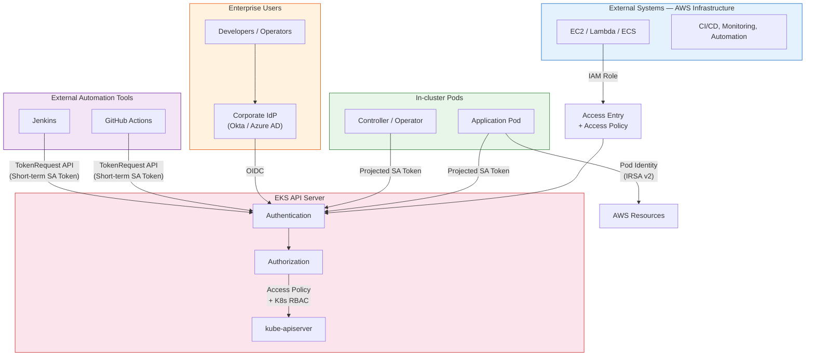

# EKS API Server Authentication/Authorization Guide

> 📅 **Created**: 2026-03-24 | ⏱️ **Reading time**: ~20 min

## Overview

The EKS cluster API Server is accessed not only by kubectl users but also by various **Non-Standard Callers**:

- **CI/CD Pipelines**: Deployment and resource management from GitHub Actions, Jenkins, ArgoCD, etc.
- **Monitoring Systems**: Metadata queries from Prometheus, Datadog, Grafana, etc.
- **Automation Tools**: Resource creation/modification from Terraform, Ansible, custom controllers, etc.
- **Enterprise Users**: kubectl access by developers and operators

This document provides best practices for selecting **Authentication (AuthN)** methods and configuring **Authorization (AuthZ)** for each scenario.

---

## 1. EKS API Server Authentication Method Comparison

EKS supports the following 5 authentication methods:

| # | Authentication Method | Suitable Use Cases | Recommendation |
|---|---------------------|-------------------|----------------|
| ① | **IAM** (aws-iam-authenticator) | Systems running on AWS infrastructure, kubectl users | ⭐⭐⭐ Top recommended |
| ② | **EKS Pod Identity** (IRSA v2) | Pods running inside EKS clusters | ⭐⭐⭐ Optimal for Pod-based workloads |
| ③ | **Kubernetes Service Account Token** | In-cluster automation, CI/CD pipelines | ⭐⭐ Can be used for external systems |
| ④ | **External OIDC Identity Provider** | Enterprise IdP integration (Okta, Azure AD, Google, etc.) | ⭐⭐⭐ Optimal for enterprise SSO integration |
| ⑤ | **x509 Client Certificate** | Legacy systems requiring certificate-based authentication | ⭐ Limited (no CRL support) |

---

## 2. Recommended Access Methods by Non-Standard Caller Type

### CASE A: External Systems Running on AWS Infrastructure (EC2, Lambda, ECS, etc.)

**→ IAM Role + Access Entry (Top Recommendation)**

```bash
# 1. Set Authentication Mode to API_AND_CONFIG_MAP or API
aws eks update-cluster-config --name <your-cluster> \
    --access-config '{"authenticationMode": "API_AND_CONFIG_MAP"}'

# 2. Create Access Entry for external system IAM Role
aws eks create-access-entry \
    --cluster-name <your-cluster> \
    --principal-arn arn:aws:iam::<account-id>:role/<external-system-role> \
    --type STANDARD

# 3. Associate Access Policy granting only necessary permissions
aws eks associate-access-policy \
    --cluster-name <your-cluster> \
    --principal-arn arn:aws:iam::<account-id>:role/<external-system-role> \
    --policy-arn arn:aws:eks::aws:cluster-access-policy/AmazonEKSViewPolicy \
    --access-scope '{"type": "namespace", "namespaces": ["monitoring", "app-system"]}'
```

**Advantages:**

- **IaC Compatible** — Manageable via CloudFormation, Terraform
- **Fine-grained control** with IAM Condition Keys (`eks:authenticationMode`, `eks:namespaces`, etc.)
- **Scope restriction** by Namespace or Cluster range
- **CloudTrail** auditing for all API access
- **5 EKS predefined Access Policies** + custom K8s RBAC support

**Token Generation from External Systems:**

```bash
# Generate K8s token with IAM credentials
aws eks get-token --cluster-name <your-cluster> \
    --role-arn arn:aws:iam::<account-id>:role/<external-system-role>
```

This token is a base64-encoded Pre-signed STS `GetCallerIdentity` URL, validated by `aws-iam-authenticator`.

---

### CASE B: API Server Access from Pods Inside EKS Cluster

**→ EKS Pod Identity (IRSA v2) (Top Recommendation)**

```bash
# Create Pod Identity Association
aws eks create-pod-identity-association \
    --cluster-name <your-cluster> \
    --namespace app-system \
    --service-account app-controller \
    --role-arn arn:aws:iam::<account-id>:role/<controller-role>
```

**Advantages:**

- **No IAM OIDC Provider creation needed** (resolves IRSA v1's 100 global limit)
- **Trust Policy** requires only single service principal `pods.eks.amazonaws.com`
- **Automatic Session Tags** (`eks-cluster-name`, `kubernetes-namespace`, `kubernetes-pod-name`, etc.) → ABAC support
- **Cross-account Role Chaining** support (`targetRoleArn` + `externalId`)
- Supports up to **5,000 associations** per cluster (default, can increase to 20K)

**Integration with K8s API Server Access:**

After receiving AWS resource access permissions via Pod Identity, authentication to the K8s API Server uses **Projected Service Account Token**. This token is automatically mounted to the Pod:

```yaml
# Projected Service Account Token auto-mounted to Pod
volumes:
- name: kube-api-access
  projected:
    sources:
    - serviceAccountToken:
        audience: "https://kubernetes.default.svc"
        expirationSeconds: 3600
        path: token
```

---

### CASE C: Integration with Enterprise IdP (Okta, Azure AD, Google, etc.)

**→ OIDC Identity Provider Integration**

```bash
# Connect external OIDC Identity Provider
aws eks associate-identity-provider-config \
    --cluster-name <your-cluster> \
    --oidc '{
        "identityProviderConfigName": "corporate-idp",
        "issuerUrl": "https://your-idp.example.com/oauth2/default",
        "clientId": "<your-client-id>",
        "usernameClaim": "email",
        "groupsClaim": "groups",
        "groupsPrefix": "oidc:"
    }'
```

:::warning Caution
- Only **1 OIDC Identity Provider per cluster** can be connected
- Issuer URL must be **publicly accessible**
- Authorization managed via K8s RBAC (Role/ClusterRole + RoleBinding/ClusterRoleBinding)
- **K8s 1.30+**: OIDC Provider URL and Service Account Issuer URL must be different
:::

---

### CASE D: External Automation Tools (CI/CD, Monitoring) Outside Cluster

**→ Utilize Projected Service Account Token (TokenRequest API)**

Even outside the cluster, you can issue and use short-term tokens via the Kubernetes TokenRequest API:

```bash
# Generate short-term token via TokenRequest API (dedicated ServiceAccount for external system)
kubectl create token ci-pipeline-sa \
    --namespace ci-system \
    --audience "https://kubernetes.default.svc" \
    --duration 1h
```

**Advantages:**

- Token **not stored in etcd** (security)
- **Expiration time** configurable (max 24 hours)
- **Audience specification** possible (separation by purpose)
- Much safer than Legacy Service Account Token

---

## 3. Authentication Mode Migration

To use Access Entry, you must set Authentication Mode to `API_AND_CONFIG_MAP` or `API`.

### Migration Path

```
CONFIG_MAP → API_AND_CONFIG_MAP → API
    (one-way, no rollback)
```

| Mode | Access Entry API | aws-auth ConfigMap | Recommendation |
|------|:---:|:---:|--------------|
| `CONFIG_MAP` | ❌ Not available | ✅ Used | Legacy |
| `API_AND_CONFIG_MAP` | ✅ Available | ✅ Used | ⭐ Migration period |
| `API` | ✅ Available | ❌ Ignored | ⭐⭐ Final goal |

### Migration Steps

```bash
# Step 1: Check current Authentication Mode
aws eks describe-cluster --name <your-cluster> \
    --query 'cluster.accessConfig.authenticationMode'

# Step 2: Switch to API_AND_CONFIG_MAP (existing aws-auth also maintained)
aws eks update-cluster-config --name <your-cluster> \
    --access-config '{"authenticationMode": "API_AND_CONFIG_MAP"}'

# Step 3: Migrate existing aws-auth ConfigMap entries to Access Entry
# (Create Access Entry for each mapRoles/mapUsers entry in aws-auth)

# Step 4: Switch to API mode after all migration complete
aws eks update-cluster-config --name <your-cluster> \
    --access-config '{"authenticationMode": "API"}'
```

:::danger Caution
Authentication Mode changes are **one-way**. Once switched to `API`, you cannot roll back to `API_AND_CONFIG_MAP`. Always confirm that all aws-auth entries have been migrated to Access Entry before switching.
:::

---

## 4. Authentication in EKS Auto Mode

EKS Auto Mode is an operational mode that delegates cluster infrastructure management to AWS, with important differences in authentication/authorization.

### Auto Mode Authentication Characteristics

| Item | Standard Mode | Auto Mode |
|------|:---:|:---:|
| Default Authentication Mode | `CONFIG_MAP` | `API` |
| aws-auth ConfigMap | Supported | **Not supported** |
| Access Entry | Optional | **Only method** |
| Pod Identity | Supported | Supported |
| OIDC Identity Provider | Supported | Supported |

### Auto Mode Key Points

- **Access Entry is the only authentication management method**: Since aws-auth ConfigMap cannot be used, all IAM principal cluster access must be managed through Access Entry.
- **Cluster creator auto-registered**: The IAM principal that created the cluster is automatically granted `AmazonEKSClusterAdminPolicy`.
- **Full Pod Identity support**: Pod Identity Association for per-Pod IAM role assignment works identically in Auto Mode.
- **Automatic node IAM role management**: In Auto Mode, node IAM roles are automatically managed by AWS, eliminating the need for separate node role Access Entry configuration.

### Auto Mode + Pod Identity Combination Pattern

```bash
# Pod Identity setup in Auto Mode cluster (same as Standard Mode)
aws eks create-pod-identity-association \
    --cluster-name <your-auto-mode-cluster> \
    --namespace app-system \
    --service-account app-controller \
    --role-arn arn:aws:iam::<account-id>:role/<controller-role>
```

### Authentication Considerations When Connecting Hybrid Nodes

When using Auto Mode with Hybrid Nodes:

- Hybrid Nodes acquire IAM credentials via **IAM Roles Anywhere** or **SSM**
- Create Access Entry for that IAM role with `--type EC2_LINUX` or `--type HYBRID_LINUX`
- Hybrid Nodes' kubelet automatically uses IAM-based tokens when authenticating to API Server

```bash
# Create Access Entry for Hybrid Nodes
aws eks create-access-entry \
    --cluster-name <your-cluster> \
    --principal-arn arn:aws:iam::<account-id>:role/<hybrid-node-role> \
    --type HYBRID_LINUX
```

---

## 5. Authorization Best Practices

### 5.1 EKS Access Policy (Managed)

| Policy Name | Description | Use Scenario |
|------------|-------------|--------------|
| `AmazonEKSClusterAdminPolicy` | Cluster-wide administrator | Platform administrator |
| `AmazonEKSAdminPolicy` | Namespace administrator | Team administrator |
| `AmazonEKSEditPolicy` | Resource creation/modification | Developer |
| `AmazonEKSViewPolicy` | Read-only | Monitoring systems, external queries |

### 5.2 Custom K8s RBAC (Fine-grained Control)

For external systems querying only CRD metadata:

```yaml
apiVersion: rbac.authorization.k8s.io/v1
kind: ClusterRole
metadata:
  name: metadata-reader
rules:
- apiGroups: ["your-app.io"]  # CRD API group
  resources: ["*"]
  verbs: ["get", "list", "watch"]
- apiGroups: [""]
  resources: ["namespaces", "pods", "services"]
  verbs: ["get", "list"]
---
apiVersion: rbac.authorization.k8s.io/v1
kind: ClusterRoleBinding
metadata:
  name: external-system-reader
subjects:
- kind: User
  name: arn:aws:iam::<account-id>:role/<external-system-role>  # IAM Role ARN
  apiGroup: rbac.authorization.k8s.io
roleRef:
  kind: ClusterRole
  name: metadata-reader
  apiGroup: rbac.authorization.k8s.io
```

:::tip Access Policy and Custom RBAC Combination
Grant basic permissions with Access Policy and add custom RBAC for more fine-grained control. Both methods work as a **union**.
:::

---

## 6. Comprehensive Recommended Architecture



### Access Path Summary

| Caller Type | Authentication Method | Authorization Method | Example |
|-------------|---------------------|---------------------|---------|
| External systems on AWS infrastructure | IAM Role → Access Entry | Access Policy (namespace scope) | CI/CD, monitoring, automation |
| In-cluster Pods | Projected SA Token | K8s RBAC | Controller, Operator |
| Enterprise users | Corporate IdP → OIDC | K8s RBAC (Group-based) | Developer kubectl access |
| External automation tools | TokenRequest API → Short-term SA Token | K8s RBAC | GitHub Actions, Jenkins |

---

## 7. Security Best Practices Checklist

| Principle | Specific Action |
|-----------|----------------|
| **Least Privilege** | Restrict Access Policy scope to namespace, fine-grained verb/resource control with custom RBAC |
| **Short-term Credentials** | Projected SA Token (max 24h), IAM Token (auto-refresh), **Prohibit Legacy SA Token use** |
| **Audit Trail** | Enable `audit` log in Control Plane Logging, track Access Entry changes with CloudTrail |
| **IaC Automation** | Manage Access Entry with CloudFormation/Terraform, prohibit manual ConfigMap editing |
| **Regional STS** | Always set `AWS_STS_REGIONAL_ENDPOINTS=regional` in external systems |
| **Authentication Mode** | Switch to `API_AND_CONFIG_MAP` then ultimately migrate to `API` |

:::info Key Message
When external systems need to access the API Server, **IAM Role + Access Entry** is the safest and most manageable access method. Set Authentication Mode to `API_AND_CONFIG_MAP`, grant each external system a dedicated IAM Role, then grant namespace-scoped least privilege with Access Entry and Access Policy. Use **OIDC Identity Provider** for enterprise users, **Pod Identity** for in-cluster Pods, and **TokenRequest API** for external CI/CD to safely cover all scenarios.
:::

---

## References

- [EKS Access Management - AWS Official Documentation](https://docs.aws.amazon.com/eks/latest/userguide/access-entries.html)
- [EKS Pod Identity - AWS Official Documentation](https://docs.aws.amazon.com/eks/latest/userguide/pod-identities.html)
- [EKS Auto Mode - AWS Official Documentation](https://docs.aws.amazon.com/eks/latest/userguide/automode.html)
- [Authenticating users from an OIDC identity provider](https://docs.aws.amazon.com/eks/latest/userguide/authenticate-oidc-identity-provider.html)
- [Kubernetes TokenRequest API](https://kubernetes.io/docs/reference/kubernetes-api/authentication-resources/token-request-v1/)
