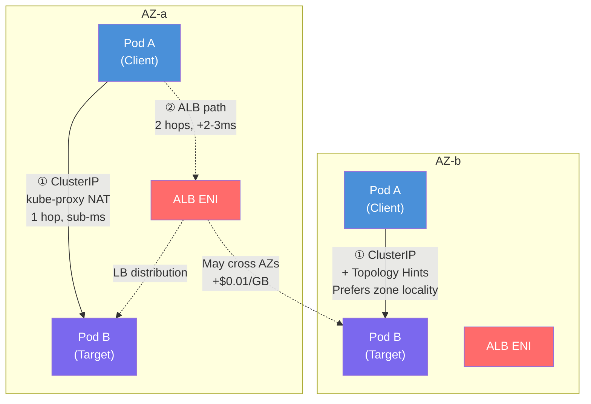
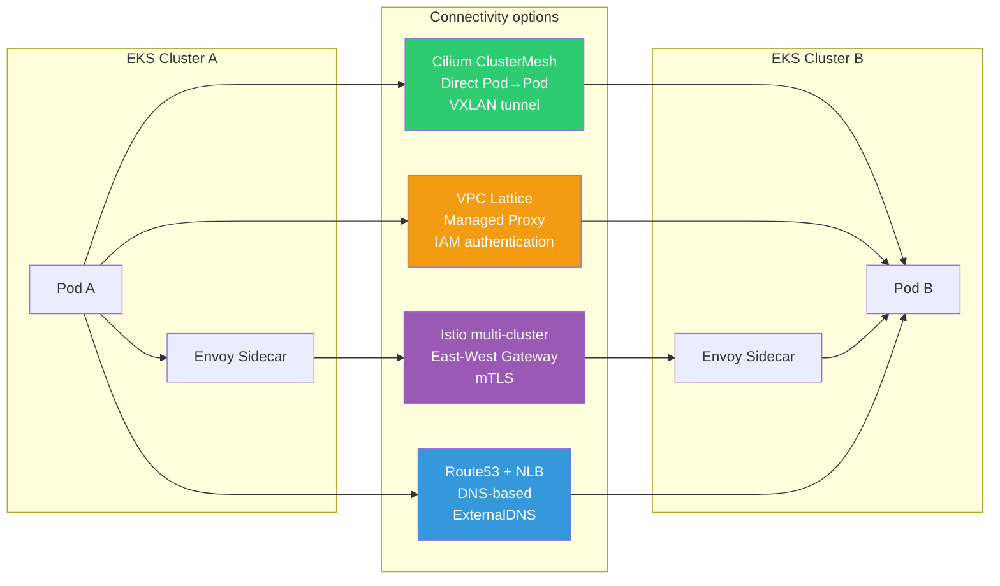

import { ServiceTypeComparison, LatencyCostComparison, CostSimulation, ScenarioMatrix } from '@site/src/components/EastWestTrafficTables';

## Overview

Latency and reduction percentages shown below are illustrative planning assumptions, not measurements from this document. Cost estimates depend on region, charged traffic direction, billing units, and usage; verify current rates before budgeting.

This guide describes how to optimize internal service-to-service communication (East-West traffic) on Amazon EKS for **minimum latency** and **cost efficiency**. It progresses from a single cluster to multiple Availability Zones (AZs), then to multi-cluster and multi-account environments.

Additional hops and cross-AZ transfers can affect East-West latency and cost. Measure the effect for the actual path, load, and service billing model. This guide explains options from **Kubernetes-native features (Topology Aware Routing and InternalTrafficPolicy) to Cilium ClusterMesh, AWS VPC Lattice, and the Istio service mesh**, along with the conditions needed to compare them.

### Background and Challenges

East-West traffic faces the following challenges with default Kubernetes networking:

- **No AZ awareness**: Default ClusterIP Services distribute traffic across Pods throughout the cluster randomly (iptables) or in round-robin order (IPVS), without considering AZs
- **Unnecessary cross-AZ traffic**: When Pods span multiple AZs, traffic can be sent randomly to another AZ, increasing latency and cost
- **Cross-AZ data transfer charges**: Approximately $0.01/GB is charged in each direction between AZs in the same Region
- **DNS lookup latency**: Cross-AZ DNS queries to centralized CoreDNS and issues caused by exceeding QPS limits
- **Additional hops through load balancers**: Using internal ALBs/NLBs for East-West traffic adds unnecessary network hops and fixed costs

### Key Benefits

The optimization strategies in this guide are expected to provide the following improvements:

| Item | Improvement |
|------|----------|
| Network latency | Same-AZ routing with Topology Aware Routing, achieving sub-ms p99 latency |
| Cost savings | Approximately $100 saved at 10 TB/month by eliminating cross-AZ traffic |
| Operational simplicity | Optimize service-to-service communication with ClusterIP, without load balancers |
| DNS performance | NodeLocal DNSCache reduces DNS lookup latency from several milliseconds to sub-ms |
| Scalability | A consistent path to multi-cluster and multi-account environments |

### Optimization Strategies for L4 and L7 Traffic

East-West traffic requires different optimization approaches at the transport layer (L4) and the application layer (L7):

- **L4 traffic (TCP/UDP)**: The priority is a direct connection path without additional protocol processing. Designing for 1-hop Pod-to-Pod communication without unnecessary proxies or load balancers minimizes latency. For StatefulSet services such as databases, a Headless Service allows clients to connect directly to target Pods through DNS round-robin.

- **L7 traffic (HTTP/gRPC)**: Application-layer proxies provide advanced traffic control, such as content-based routing and retries. An ALB or Istio sidecar enables L7 features including path-based routing, gRPC method routing, and circuit breakers. However, packet inspection and processing in L7 proxies increase load and latency, which can be excessive for simple traffic patterns.

---

## Prerequisites

### Required Knowledge

- Kubernetes networking fundamentals (Service, Endpoint, kube-proxy)
- AWS VPC networking (subnets, AZs, ENIs)
- DNS resolution mechanisms (CoreDNS, /etc/resolv.conf)

### Required Tools

| Tool | Version | Purpose |
|------|------|------|
| kubectl | 1.27+ | Manage cluster resources |
| eksctl | 0.170+ | Create and manage EKS clusters |
| AWS CLI | 2.x | Inspect AWS resources |
| Helm | 3.12+ | Deploy charts, such as NodeLocal DNSCache |
| AWS Load Balancer Controller | 2.6+ | Integrate ALBs/NLBs when required |

### Environment Requirements

| Item | Requirement |
|------|----------|
| EKS version | 1.27+ (Topology Aware Routing support) |
| VPC CNI | v1.12+ or Cilium (for ClusterMesh scenarios) |
| AZ configuration | At least 2 AZs in the same Region |
| IAM permissions | EKS cluster administration and ELB creation/management permissions |

---

## Architecture

### Architecture Overview: Single-Cluster Traffic Paths

The following diagram compares the ClusterIP and internal ALB paths:



:::info Key Differences

- **ClusterIP path**: Pod → kube-proxy (iptables/IPVS NAT) → target Pod (1 hop)
- **Internal ALB path**: Pod → AZ-local ALB ENI → target Pod (2 hops)
- Topology Aware Routing can improve zone locality; hints and fallback behavior do not guarantee same-AZ routing
:::

### Multi-Cluster Connectivity Options



### Kubernetes Service Type Comparison

Performance and cost vary with the connectivity method used between services:

<ServiceTypeComparison />

:::tip Service Type Selection

- **Default**: ClusterIP + Topology Aware Routing
- **StatefulSet**: Headless Service
- **When L7 features are required**: Internal ALB (IP mode)
- **When external L4 exposure is required**: Internal NLB (IP mode)
:::

### Instance Mode vs IP Mode

When using an internal load balancer, the differences between instance mode and IP mode affect traffic paths:

- **Instance mode**: LB → NodePort → kube-proxy → Pod. The kube-proxy on the node receiving the NodePort traffic forwards packets to a node in another AZ that hosts the target Pod, **creating cross-AZ communication**
- **IP mode**: LB → Pod IP directly, bypassing an intermediate node. IP targeting alone does not guarantee same-AZ routing; load balancer cross-zone configuration and target availability still determine AZ selection.

:::warning Instance Mode Considerations
Instance mode increases cross-AZ traffic through NodePort. AWS best practices recommend **IP mode** where possible for internal load balancers to reduce unnecessary inter-AZ traffic. IP mode requires the AWS Load Balancer Controller.
:::

### Architecture Decisions

:::info Technology Selection Criteria

**Why choose ClusterIP as the default?**

- A native Kubernetes feature with no additional cost
- The lowest latency through 1-hop communication
- AZ awareness when combined with Topology Aware Routing
- Straightforward integration with service meshes and Gateway API

**Why use internal ALBs selectively?**

- Ongoing hourly charges ($0.0225/h) plus LCU charges
- An additional network hop adds 2-3ms of RTT overhead
- Suitable for transitional use, such as EC2→EKS migration
:::

---

## Implementation

### Step 1: Enable Topology Aware Routing

In a multi-AZ environment, processing requests within the same AZ can reduce latency and transfer charges. Topology Aware Routing allocates endpoint sets to zones through EndpointSlice hints. An assigned zone is not necessarily the endpoint’s physical zone, and kube-proxy falls back to all endpoints when safeguards are not satisfied. It therefore does not guarantee elimination of cross-AZ traffic. See the [official routing conditions](https://kubernetes.io/docs/concepts/services-networking/topology-aware-routing/).

```yaml
apiVersion: v1
kind: Service
metadata:
  name: my-service
  namespace: production
  annotations:
    # Enable Topology Aware Routing
    service.kubernetes.io/topology-mode: Auto
spec:
  selector:
    app: my-app
  ports:
    - name: http
      port: 80
      targetPort: 8080
      protocol: TCP
  type: ClusterIP
```

**Verification:**

```bash
# Check whether topology hints are set on EndpointSlices
kubectl get endpointslices -n production -l kubernetes.io/service-name=my-service -o yaml

# Inspect the hints field in the output
# hints:
#   forZones:
#     - name: ap-northeast-2a
```

:::warning Topology Aware Routing Requirements

- Routing works best with **at least three endpoints per zone**; this is guidance, not a guarantee.
- The allocation heuristic considers each zone’s share of **node allocatable CPU**, not just equal Pod counts.
- Safeguards can disable hints because of insufficient endpoints, projected overload, or missing node zone/CPU information.
:::

### Step 2: Configure InternalTrafficPolicy Local

This feature narrows the scope further than Topology Aware Routing, forwarding traffic only to endpoints running on the same local node. It eliminates network hops between nodes, and therefore between AZs, minimizing latency and bringing cross-AZ costs close to zero.

```yaml
apiVersion: v1
kind: Service
metadata:
  name: my-local-service
  namespace: production
spec:
  selector:
    app: my-app
  ports:
    - name: http
      port: 80
      targetPort: 8080
  type: ClusterIP
  # Forward traffic only to endpoints on the same node
  internalTrafficPolicy: Local
```

:::danger InternalTrafficPolicy: Local Considerations
If a node has no ready local target endpoint, **requests from that node fail**. Every node that originates calls needs a ready target Pod. Zone-level spread constraints and preferred PodAffinity do not guarantee placement on the same node.
:::

:::info Topology Aware Routing vs InternalTrafficPolicy
The fields can coexist, but kube-proxy does not use topology hints when `internalTrafficPolicy: Local` is set.

- **Multi-AZ environments**: Consider Topology Aware Routing to improve zone locality.
- **Frequent same-node calls**: Use InternalTrafficPolicy(Local) when node co-location and ready local endpoints can be assured.
:::

### Step 3: Pod Topology Spread Constraints

Topology Aware Routing needs enough ready endpoints per zone. The nine-replica example assumes three eligible zones with sufficient capacity. `maxSkew` alone guarantees neither the number of zones nor the number of ready endpoints.

```yaml
apiVersion: apps/v1
kind: Deployment
metadata:
  name: my-app
  namespace: production
spec:
  replicas: 9
  selector:
    matchLabels:
      app: my-app
  template:
    metadata:
      labels:
        app: my-app
    spec:
      # Distribute evenly across AZs
      topologySpreadConstraints:
        - maxSkew: 1
          topologyKey: topology.kubernetes.io/zone
          whenUnsatisfiable: DoNotSchedule
          labelSelector:
            matchLabels:
              app: my-app
        # Distribute across nodes (optional)
        - maxSkew: 1
          topologyKey: kubernetes.io/hostname
          whenUnsatisfiable: ScheduleAnyway
          labelSelector:
            matchLabels:
              app: my-app
      containers:
        - name: my-app
          image: my-app:latest
          ports:
            - containerPort: 8080
          resources:
            requests:
              cpu: 100m
              memory: 128Mi
```

**Co-location with Pod Affinity:**

This Pod spec fragment prefers the same node as service B. A preferred rule does not enforce co-location and cannot guarantee availability with InternalTrafficPolicy(Local).

```yaml
spec:
  affinity:
    podAffinity:
      # Prefer nodes that host service B
      preferredDuringSchedulingIgnoredDuringExecution:
        - weight: 100
          podAffinityTerm:
            labelSelector:
              matchLabels:
                app: service-b
            topologyKey: kubernetes.io/hostname
```

:::tip Autoscaling Considerations
During HPA scale-out, Spread Constraints can distribute new Pods. During **scale-in, however, the controller removes arbitrary Pods without considering AZ balance**, which can disrupt the distribution. Use the Descheduler to rebalance Pods when this occurs.
:::

### Step 4: Deploy NodeLocal DNSCache

DNS lookup delays and failures can unexpectedly increase latency in microservice environments. NodeLocal DNSCache runs a DNS cache agent on each node as a DaemonSet, substantially reducing DNS response times.

The download below is a **template**, not an immediately deployable manifest. Follow the [official NodeLocal DNSCache setup](https://kubernetes.io/docs/tasks/administer-cluster/nodelocaldns/) to substitute the DNS IP/domain and select the kube-proxy iptables/IPVS configuration before applying it. IPVS also requires the kubelet clusterDNS change described there.

```bash
# Download and deploy the NodeLocal DNSCache manifest
curl -fsSLo nodelocaldns.yaml https://raw.githubusercontent.com/kubernetes/kubernetes/v1.32.0/cluster/addons/dns/nodelocaldns/nodelocaldns.yaml
```

Alternatively, use a Helm chart:

```bash
helm repo add deliveryhero https://charts.deliveryhero.io/
helm install node-local-dns deliveryhero/node-local-dns \
  --namespace kube-system \
  --set config.localDnsIp=169.254.20.10
```

**How NodeLocal DNSCache works:**

```yaml
# Configure each Pod's /etc/resolv.conf to point to the local cache
# nameserver 169.254.20.10 (NodeLocal DNS IP)
# Cache frequently queried DNS records within the node
```

**Benefits:**

- p99 DNS lookup latency: several milliseconds → sub-ms
- Reduced CoreDNS QPS load
- Tens of milliseconds saved in DNS wait time in environments with more than 10,000 Pods
- Lower cross-AZ DNS charges

:::tip When to Use NodeLocal DNSCache
The official AWS blog recommends NodeLocal DNSCache for **clusters with many nodes**, together with CoreDNS scale-out. Account for the CPU and memory consumed by an additional daemon on each node when evaluating it for the workload size.
:::

### Step 5: Configure Internal Load Balancers in IP Mode (When Required)

Configure an internal ALB in IP mode when L7 features are required or during the transition from EC2 to EKS:

**Internal NLB (IP mode):**

```yaml
apiVersion: v1
kind: Service
metadata:
  name: my-service-nlb
  namespace: production
  annotations:
    # Use the AWS Load Balancer Controller
    service.beta.kubernetes.io/aws-load-balancer-type: external
    service.beta.kubernetes.io/aws-load-balancer-nlb-target-type: ip
    service.beta.kubernetes.io/aws-load-balancer-scheme: internal
    # Disable cross-zone load balancing to keep traffic AZ-local
    service.beta.kubernetes.io/aws-load-balancer-attributes: load_balancing.cross_zone.enabled=false
spec:
  type: LoadBalancer
  selector:
    app: my-app
  ports:
    - name: http
      port: 80
      targetPort: 8080
      protocol: TCP
```

**Internal ALB (Ingress resource):**

```yaml
apiVersion: networking.k8s.io/v1
kind: Ingress
metadata:
  name: my-service-alb
  namespace: production
  annotations:
    kubernetes.io/ingress.class: alb
    alb.ingress.kubernetes.io/scheme: internal
    alb.ingress.kubernetes.io/target-type: ip
    alb.ingress.kubernetes.io/healthcheck-path: /health
spec:
  rules:
    - host: my-service.internal
      http:
        paths:
          - path: /
            pathType: Prefix
            backend:
              service:
                name: my-service
                port:
                  number: 80
```

### Step 6: Istio Service Mesh (Optional)

Introduce Istio selectively when security requirements such as mTLS or Zero Trust, or advanced traffic management requirements, apply.

:::tip Selecting a Service Mesh
The [Service Mesh Comparison Guide](./service-mesh/index.md) covers the choice among Istio, Cilium, Linkerd, and VPC Lattice. This document focuses on latency and cost optimization after adoption.
:::

**Key benefits of Istio:**

- **Locality-based routing**: Use locality information between Envoy sidecars to route to instances in the same AZ or geographic location
- **Transparent mTLS**: Mutual TLS encryption without application code changes
- **Advanced traffic management**: Retries, timeouts, circuit breakers, and canary deployments

**Performance overhead (Istio 1.30):**

| Metric | Value |
|--------|------|
| CPU per sidecar | ~0.2 vCPU (at 1000 rps) |
| Memory per sidecar | ~60 MB (at 1000 rps) |
| Additional latency (p99) | ~5ms (two proxy traversals: client + server) |
| Performance impact | Average throughput reduction of 5–10% |

:::warning Istio Adoption Considerations

- Sidecar resource consumption can increase EC2 costs
- Enabling mTLS further increases CPU usage
- Requires control plane (Istiod) management and familiarity with CRDs (VirtualService, DestinationRule)
- More complex debugging, including sidecars and the control plane
- Evaluate mesh adoption carefully for **highly latency-sensitive services**
:::

```yaml
# Example Istio Locality Load Balancing configuration
apiVersion: networking.istio.io/v1beta1
kind: DestinationRule
metadata:
  name: my-service
spec:
  host: my-service.production.svc.cluster.local
  trafficPolicy:
    outlierDetection:
      consecutive5xxErrors: 5
      interval: 30s
      baseEjectionTime: 30s
    connectionPool:
      tcp:
        maxConnections: 100
      http:
        h2UpgradePolicy: DEFAULT
        maxRequestsPerConnection: 10
```

### Multi-Cluster Connection Strategies

Services distributed across multiple clusters or AWS accounts require a cross-cluster connectivity strategy.

#### Cilium ClusterMesh

Cilium ClusterMesh is a multi-cluster networking capability of the Cilium CNI that connects multiple clusters as one network. It enables direct Pod-to-Pod communication through eBPF without a separate gateway or proxy.

```bash
# Enable ClusterMesh (Cilium CLI)
cilium clustermesh enable --context cluster1
cilium clustermesh enable --context cluster2

# Connect the clusters
cilium clustermesh connect --context cluster1 --destination-context cluster2

# Check status
cilium clustermesh status --context cluster1
```

**Advantages:** Lowest latency, no additional per-request charges, and transparent service discovery
**Disadvantages:** Requires Cilium CNI in every cluster and Cilium operational expertise

#### AWS VPC Lattice

Amazon VPC Lattice is a fully managed application networking service that provides consistent service connectivity, IAM-based authentication, and monitoring across multiple VPCs and accounts.

```yaml
# Integrate with Lattice through Kubernetes Gateway API
apiVersion: gateway.networking.k8s.io/v1beta1
kind: Gateway
metadata:
  name: my-lattice-gateway
  annotations:
    application-networking.k8s.aws/lattice-vpc-association: "true"
spec:
  gatewayClassName: amazon-vpc-lattice
  listeners:
    - name: http
      protocol: HTTP
      port: 80
```

**Pricing model:** $0.025/hour per service + $0.025/GB + $0.10 per million requests
**Suitable for:** Dozens or more microservices distributed across multiple accounts with centralized security controls

#### Istio Multi-Cluster Mesh

An existing Istio deployment can be extended into a multi-cluster service mesh. Flat networks allow direct Envoy-to-Envoy communication; separate networks communicate through an East-West Gateway.

**Advantages:** Full service mesh capabilities across cluster boundaries, global mTLS, and cross-cluster failover
**Disadvantages:** The highest operational complexity of the four options, including certificate management and sidecar synchronization

#### Route53 + ExternalDNS

The simplest multi-cluster connectivity approach registers each cluster's services in a Route53 Private Hosted Zone and accesses them through DNS.

ExternalDNS IAM permissions, private hosted zone filtering and VPC associations, and AWS Load Balancer Controller must already be configured. Adapt the selector and ports to the actual workload.

```yaml
apiVersion: v1
kind: Service
metadata:
  name: my-service
  namespace: production
  annotations:
    external-dns.alpha.kubernetes.io/hostname: my-service.internal.example.com
    service.beta.kubernetes.io/aws-load-balancer-scheme: internal
    service.beta.kubernetes.io/aws-load-balancer-nlb-target-type: ip
spec:
  type: LoadBalancer
  loadBalancerClass: service.k8s.aws/nlb
  selector:
    app: my-app
  ports:
    - name: http
      port: 80
      targetPort: 8080
```

**Suitable for:** 2-3 clusters, infrequent service calls, or disaster recovery configurations

---

## Latency and Cost Comparison of Key Options

### Performance and Cost Comparison by Option

<LatencyCostComparison />

### Cost Simulation for 10 TB/Month of East-West Traffic

Assumptions: An EKS cluster spanning 3 AZs in the same Region, using 10,240 GB of total service-to-service traffic for the illustrative calculation (approximately 10 TB)

<CostSimulation />

:::tip Key Cost Optimization Insights

- **InternalTrafficPolicy Local** ensures node-local traffic for the lowest latency at $0 cost. Pod Affinity and co-location are required
- **For 20 or more services across multiple accounts**, Lattice simplifies operations at an additional cost
- A **hybrid strategy** is the most economical option for most workloads: deploy ALBs only on specific paths requiring L7 features or WAF, and retain ClusterIP paths elsewhere
:::

---

## Verification and Monitoring

### Verify Topology Aware Routing

```bash
# Check EndpointSlice hints
kubectl get endpointslices -n production -l kubernetes.io/service-name=my-service \
  -o jsonpath='{range .items[*].endpoints[*]}{.addresses}{"\t"}{.zone}{"\t"}{.hints.forZones[*].name}{"\n"}{end}'

# Expected output:
# ["10.0.1.15"]    ap-northeast-2a    ap-northeast-2a
# ["10.0.2.23"]    ap-northeast-2b    ap-northeast-2b
# ["10.0.3.41"]    ap-northeast-2c    ap-northeast-2c
```

```bash
# Check whether Pods are evenly distributed across AZs
kubectl get pods -l app=my-app -o wide | awk '{print $7}' | sort | uniq -c

# Expected output:
# 2 ip-10-0-1-xxx.ap-northeast-2.compute.internal  (AZ-a)
# 2 ip-10-0-2-xxx.ap-northeast-2.compute.internal  (AZ-b)
# 2 ip-10-0-3-xxx.ap-northeast-2.compute.internal  (AZ-c)
```

### Monitoring: Internal ALB

Monitor services that use ALBs with CloudWatch metrics:

| Metric | Target | Warning | Critical |
|--------|------|------|------|
| `TargetResponseTime` | Below 100ms | 100-300ms | Above 300ms |
| `HTTPCode_ELB_5XX_Count` | 0 | 1-10/min | Above 10/min |
| `HTTPCode_Target_5XX_Count` | 0 | 1-5/min | Above 5/min |
| `ActiveConnectionCount` | Normal range | 80% of capacity | 90% of capacity |

```bash
# Analyze the causes of 5xx errors in ALB access logs
# Use the error_reason field to identify 502/504 root causes
aws logs filter-log-events \
  --log-group-name /aws/alb/my-internal-alb \
  --filter-pattern "elb_status_code=5*"
```

### Monitoring: ClusterIP (Without a Load Balancer)

ClusterIP Services do not have ELB metrics, so separate instrumentation is required:

- **Service mesh**: L7 metrics through Istio/Linkerd or Envoy sidecars
- **eBPF-based tools**: TCP reset and 5xx statistics through Hubble, Cilium, or Pixie
- **Application level**: 5xx counts through Prometheus/OpenTelemetry

```yaml
# Example Prometheus ServiceMonitor
apiVersion: monitoring.coreos.com/v1
kind: ServiceMonitor
metadata:
  name: my-service-monitor
spec:
  selector:
    matchLabels:
      app: my-app
  endpoints:
    - port: metrics
      interval: 15s
      path: /metrics
```

### Cross-AZ Cost Monitoring

```bash
# Check Regional Data Transfer costs in the AWS Cost and Usage Report
aws ce get-cost-and-usage \
  --time-period Start=2026-02-01,End=2026-02-28 \
  --granularity MONTHLY \
  --metrics "BlendedCost" \
  --filter '{"Dimensions":{"Key":"USAGE_TYPE","Values":["APN2-DataTransfer-Regional-Bytes"]}}'
```

:::tip Using Kubecost
Kubecost can visualize cross-AZ traffic costs by namespace. The `RegionalDataTransferCost` metric identifies which service-to-service interactions generate the highest cross-AZ costs.
:::

---

## Scenario Recommendation Matrix

The following combinations are recommended based on service characteristics, security requirements, and operational complexity:

<ScenarioMatrix />

:::info Hybrid Strategy
Real environments often **combine strategies**. For example:

- Within a cluster: ClusterIP + Topology Hints
- Services outside the mesh: Optimize with InternalTrafficPolicy
- Between clusters: Connect through Lattice
- Specific L7 paths: Deploy ALBs selectively
:::

---

## EC2→EKS Migration Guide

### Migration Strategy by Stage

During the transition from EC2 to EKS, a gradual cutover using an internal ALB is recommended:

**Stage 1: Start with ClusterIP inside EKS**

```bash
# Use the DNS name http://service.namespace.svc.cluster.local for EKS service-to-service communication
# Preserve code portability
```

**Stage 2: Serve traffic from EC2 and EKS simultaneously**

```yaml
# Configure two target groups on the internal ALB
# EC2 Instance TG + EKS Pod TG (AWS LB Controller)
# Use weighted listener rules for gradual cutover (for example, 90/10)
apiVersion: elbv2.k8s.aws/v1beta1
kind: TargetGroupBinding
metadata:
  name: my-service-tgb
spec:
  serviceRef:
    name: my-service
    port: 80
  targetGroupARN: arn:aws:elasticloadbalancing:ap-northeast-2:123456789012:targetgroup/my-eks-tg/xxx
  targetType: ip
```

**Stage 3: Remove the ALB after moving 100% to EKS**

After the service has fully migrated to EKS, remove the ALB and return to ClusterIP to eliminate ongoing ALB charges.

:::tip Core Migration Principles

- **Steady state**: Use ClusterIP for the lowest cost and latency
- **Transition**: Use an internal ALB for dual EC2/EKS routing with weighted target groups
- **After cutover**: Remove the ALB to eliminate the cost line item entirely
:::

---

## Troubleshooting

### Issue: Topology Aware Routing Does Not Work

**Symptoms:**

```
The hints field in EndpointSlices is empty
Traffic is still distributed across AZs
```

**Diagnosis:**

```bash
# Check EndpointSlice status
kubectl get endpointslices -n production -l kubernetes.io/service-name=my-service -o yaml

# Check Pod distribution across AZs
kubectl get pods -l app=my-app -o json | \
  jq -r '.items[] | "\(.spec.nodeName) \(.status.podIP)"' | \
  while read node ip; do
    zone=$(kubectl get node $node -o jsonpath='{.metadata.labels.topology\.kubernetes\.io/zone}')
    echo "$zone $ip"
  done | sort | uniq -c
```

**Resolution:**

1. Check ready endpoints per zone and each zone’s share of node allocatable CPU. Routing generally works best with at least three endpoints per zone.
2. Add `topologySpreadConstraints` and check eligible zones and capacity.
3. Check the EndpointSlice controller safeguards.
   - Allocation considers allocatable CPU proportions and overload thresholds.
   - There is no rule that disables hints when one AZ holds 50% of endpoints. The approximately 50% figure in the official documentation describes the chance of failing to allocate hints when there are fewer than three endpoints per zone.

### Issue: Traffic Drops with InternalTrafficPolicy Local

**Symptoms:**

```
Service calls from certain nodes fail with connection refused or timeout
kubectl logs shows "no endpoints available"
```

**Diagnosis:**

```bash
# Check whether the local node has a target Pod
kubectl get pods -l app=target-service -o wide

# Inspect endpoints for the specific node
kubectl get endpoints my-local-service -o yaml
```

**Resolution:**

1. Deploy the target service to every node with a DaemonSet
2. Use PodAffinity to require callers and targets to run on the same node
3. Alternatively, remove InternalTrafficPolicy and switch to Topology Aware Routing at the AZ level

```yaml
# Alternative: Switch to Topology Aware Routing
apiVersion: v1
kind: Service
metadata:
  name: my-service
  annotations:
    service.kubernetes.io/topology-mode: Auto
spec:
  # Remove internalTrafficPolicy: Local
  selector:
    app: my-app
  ports:
    - name: http
      port: 80
      targetPort: 8080
```

### Issue: Cross-AZ Costs Do Not Decrease

**Symptoms:**

```
Regional Data Transfer costs in AWS Cost Explorer do not decrease after enabling Topology Aware Routing
```

**Diagnosis:**

```bash
# Inspect the actual traffic path (when using Cilium Hubble)
hubble observe --namespace production --protocol TCP \
  --to-label app=target-service --output json | \
  jq '.source.labels, .destination.labels'

# Check whether traffic traverses a NAT Gateway
kubectl exec -it test-pod -- traceroute target-service.production.svc.cluster.local
```

**Resolution:**

1. **Deploy a separate NAT Gateway in each AZ** to avoid cross-AZ traffic for external communication
2. Verify that the NLB/ALB uses **IP mode**
3. Check whether CoreDNS runs in another AZ → deploy NodeLocal DNSCache
4. Use Kubecost to identify the sources of cross-AZ traffic by namespace

### Issue: NodeLocal DNSCache Problems

**Symptoms:**

```
DNS resolution fails after deploying NodeLocal DNSCache
Pods cannot resolve external domains
```

**Resolution:**

```bash
# Check NodeLocal DNS Pod status
kubectl get pods -n kube-system -l k8s-app=node-local-dns

# Test DNS resolution
kubectl exec -it test-pod -- nslookup kubernetes.default.svc.cluster.local
kubectl exec -it test-pod -- nslookup google.com

# Inspect resolv.conf
kubectl exec -it test-pod -- cat /etc/resolv.conf
# Verify that the nameserver is 169.254.20.10 (the NodeLocal IP)
```

:::danger Production Considerations
When changing network settings in production, use a **canary deployment**, starting with a small set of services, and compare performance metrics before and after the change. Topology Aware Routing and InternalTrafficPolicy changes immediately alter traffic paths, so maintain heightened monitoring during the change.
:::

---

## Conclusion

### Key Takeaways

:::tip Architecture Selection Guide

**1. Low cost and ultra-low latency**

- ClusterIP + Topology Aware Routing + NodeLocal DNSCache
- Add InternalTrafficPolicy(Local) when required
- At 10 TB/month, save approximately $98 compared with ALB and $400+ compared with VPC Lattice

**2. L4 reliability and static IP requirements**

- Internal NLB (IP mode)
- Review costs closely when traffic exceeds 5 TB/month

**3. L7 routing, WAF, and per-method gRPC control**

- Internal ALB + K8s Gateway API
- Deploy only on required paths to avoid increasing LCU consumption

**4. Enterprise-wide Zero Trust and multi-cluster environments**

- Limit transitions from Istio Ambient to sidecars to workloads that require them
- Overhead decreases in the order: sidecars → node proxies (Ambient) → sidecarless (eBPF)

**5. Multiple accounts and more than 50 services**

- Reduce complexity with managed VPC Lattice and IAM policies

:::

### Next Steps

Review the following after implementation:

- [ ] Enable Topology Aware Routing and verify EndpointSlice hints
- [ ] Ensure even AZ distribution with Pod Topology Spread Constraints
- [ ] Deploy NodeLocal DNSCache and verify improved DNS response times
- [ ] Set up a cross-AZ cost monitoring dashboard with Kubecost or CUR
- [ ] Identify unnecessary internal load balancers and evaluate a switch to ClusterIP
- [ ] Plan ALB removal for services that have completed migration

---

## References

1. [AWS Elastic Load Balancing Pricing - LCU/NLCU Rates](https://aws.amazon.com/elasticloadbalancing/pricing/)
2. [AWS Data Transfer Pricing - Cross-AZ $0.01/GB](https://aws.amazon.com/ec2/pricing/on-demand/#Data_Transfer)
3. [AWS ELB Best Practices - Latency Optimization](https://docs.aws.amazon.com/elasticloadbalancing/latest/application/application-load-balancers.html)
4. [AWS Network Load Balancer](https://aws.amazon.com/elasticloadbalancing/network-load-balancer/)
5. [AWS VPC Lattice Pricing](https://aws.amazon.com/vpc/lattice/pricing/)
6. [Istio 1.30 Performance and Scalability](https://istio.io/latest/docs/ops/deployment/performance-and-scalability/)
7. [Kubernetes NodeLocal DNSCache](https://kubernetes.io/docs/tasks/administer-cluster/nodelocaldns/)
8. [Kubernetes Topology Aware Routing](https://kubernetes.io/docs/concepts/services-networking/topology-aware-routing/)
9. [Cilium ClusterMesh Documentation](https://docs.cilium.io/en/stable/network/clustermesh/)
10. [AWS EKS Best Practices - Cost Optimization](https://docs.aws.amazon.com/eks/latest/best-practices/cost-opt.html)
11. [Kubernetes Pod Topology Spread Constraints](https://kubernetes.io/docs/concepts/scheduling-eviction/topology-spread-constraints/)

### Related Documents (Internal)
- [Service Mesh Comparison Guide](./service-mesh/index.md) — Selection criteria for Istio, Cilium, Linkerd, and VPC Lattice
- [GAMMA Initiative](./service-mesh/gamma-initiative.md) — Standardizing East-West traffic with Gateway API
