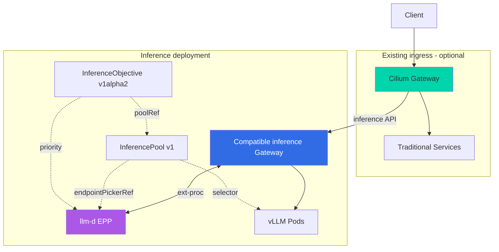

import Tabs from '@theme/Tabs';
import TabItem from '@theme/TabItem';
import { EksRequirementsTable, InstanceTypeTable, LatencyComparisonTable, AlgorithmComparisonTable } from '@site/src/components/GatewayApiTables';

:::info
This document is a deep-dive guide for the [Gateway API Adoption Guide](/docs/eks-best-practices/networking-performance/gateway-api-adoption-guide). It provides a practical guide for combining Cilium ENI mode with Gateway API for high-performance networking.
:::

Cilium ENI mode is a high-performance networking solution that directly utilizes AWS Elastic Network Interfaces to assign VPC IP addresses to pods. Combined with Gateway API, it achieves both standardized L7 routing and eBPF-based ultra-low latency processing.

## 1. What is Cilium ENI Mode?

Cilium ENI mode directly uses AWS ENI to assign VPC IP addresses to pods. Key features:

- **AWS ENI Direct Use**: Each pod receives a real VPC IP, fully integrating with AWS networking (Security Groups, NACLs, VPC Flow Logs)
- **eBPF-based High-Performance Networking**: 10x+ performance improvement over iptables with minimal CPU overhead
- **Native Routing**: No overlay encapsulation (VXLAN/Geneve), using VPC routing tables directly

## 2. Architecture Overview

NLB (L4) → eBPF TPROXY (transparent proxy) → Cilium Envoy (L7 Gateway) → Backend Pods (ENI IPs)

### Key Components

1. **NLB**: Managed L4 load balancer, microsecond latency
2. **eBPF TPROXY**: XDP-level packet interception, lock-free per-CPU processing
3. **Cilium Envoy**: L7 processing, HTTPRoute/TLSRoute implementation
4. **Cilium Operator**: ENI lifecycle management, IP pool management
5. **Cilium Agent** (DaemonSet): eBPF program management, CNI plugin
6. **Hubble**: Real-time network flow observability, L7 protocol visibility

## 3. Prerequisites

<EksRequirementsTable />

## 4. Installation Flow

For new clusters: disable VPC CNI → install Gateway API CRDs → install Cilium via Helm → create Gateway resources.

For existing clusters: **downtime required** (5-10 min) for VPC CNI removal and Cilium installation.

## 5. Gateway API Resource Configuration

Standard HTTPRoute, traffic splitting (canary), header-based routing, URL rewrite, and role separation patterns are all supported identically to other Gateway API implementations.

## 6. Performance Optimization

- **NLB + Cilium Envoy**: ~3.5ms total vs ~15ms with ALB+NGINX
- **Prefix Delegation**: 16x fewer ENI attach operations
- **BPF tuning**: Pre-allocated maps, Maglev load balancing
- **XDP acceleration**: 10x packet filtering, 80% CPU reduction for DDoS

<LatencyComparisonTable />
<AlgorithmComparisonTable />
<InstanceTypeTable />

## 7. Operations & Observability

Hubble provides real-time flow observation, service maps, L7 protocol visibility (HTTP, gRPC, Kafka, DNS), and Prometheus metric export.

## 8. BGP Control Plane v2

For hybrid environments needing on-premises to EKS traffic routing via BGP. Not required when using NLB in pure AWS environments.

## 9. Hybrid Nodes Architecture and AI/ML Workloads

### 9.2 Deployment option: Cilium + Gateway + llm-d

Using Cilium as the CNI and supporting InferencePool in Cilium Gateway are separate capabilities. The diagram shows an **optional topology that retains existing Cilium ingress and adds a compatible inference Gateway**. Validate the cost/latency of two proxy hops and timeout, retry, streaming, and authentication-header handling. Cloud/hybrid node placement is illustrative; validate CNI/IPAM and Pod connectivity for each node environment separately.

llm-d [v0.8.1 Gateway Mode](https://github.com/llm-d/llm-d/blob/v0.8.1/docs/architecture/core/router/proxy.md) can also handle traditional Services and InferencePools through one compatible Gateway. The EPP is an endpoint-selection service, not a second Gateway.



### 9.3 Alternative architectures

| Option | Components | Selection conditions / trade-offs |
|--------|------------|-----------------------------------|
| **Retain existing ingress** | Cilium CNI + Cilium Gateway + compatible inference Gateway/EPP | Preserve ingress ownership; operate an additional Gateway, policies, and observability |
| **Single compatible Gateway** | Cilium CNI + Gateway supporting InferencePool/EPP integration | Route traditional Services and inference pools through one Gateway; verify implementation/version support and security policies |
| **Direct Cilium Gateway integration** | Cilium CNI + Cilium Gateway + EPP | Select only after verifying InferencePool backends and EPP integration in that Cilium release; Envoy usage alone does not establish support |

The [Cilium v1.18.0 Gateway API documentation](https://github.com/cilium/cilium/blob/v1.18.0/Documentation/network/servicemesh/gateway-api/gateway-api.rst) does not establish the InferencePool/EPP integration required here. This guide does not claim to have validated direct Cilium integration. Installing a CRD alone does not make a Gateway controller support a new backend kind.

### 9.4 Gateway API Inference Extension resources

The baseline is llm-d v0.8.1 (2026-06-26), router v0.9.0, GIE v1.5.0, and Gateway API v1.5.1. `InferencePool` is the GIE `inference.networking.k8s.io/v1` API; `InferenceObjective` is the llm-d `llm-d.ai/v1alpha2` alpha policy API. `InferenceModel` is the historical name of the earlier policy API. Old v1alpha1 examples and predicted GA dates are not current deployment guidance.

Primary schemas: [llm-d v0.8.1](https://github.com/llm-d/llm-d/releases/tag/v0.8.1), [InferencePool v1](https://github.com/kubernetes-sigs/gateway-api-inference-extension/blob/v1.5.0/config/crd/bases/inference.networking.k8s.io_inferencepools.yaml), [InferenceObjective v1alpha2](https://github.com/llm-d/llm-d-router/blob/v0.9.0/config/crd/bases/llm-d.ai_inferenceobjectives.yaml), [HTTPRoute v1](https://github.com/kubernetes-sigs/gateway-api/blob/v1.5.1/config/crd/standard/gateway.networking.k8s.io_httproutes.yaml).

Define images, model arguments, replica counts, and GPU requests in workloads such as Deployment/LeaderWorkerSet. The Pool connects Pod labels, ports, and the EPP; the Objective expresses request priority.

This example defines routing resources only. It requires an existing `llm-d` namespace, `inference-gateway` Gateway, `inference-epp` Service (EPP on port 9002 configured for `gpu-pool`), and model-server Pods labeled `app: vllm` listening on port 8000. Install Gateway API v1.5.1, the GIE v1.5.0 InferencePool CRD, the router v0.9.0 InferenceObjective CRD, and compatible controllers.

```yaml
apiVersion: inference.networking.k8s.io/v1
kind: InferencePool
metadata:
  name: gpu-pool
  namespace: llm-d
spec:
  selector:
    matchLabels:
      app: vllm
  targetPorts:
    - number: 8000
  endpointPickerRef:
    name: inference-epp
    kind: Service
    port:
      number: 9002
    failureMode: FailClose
---
apiVersion: llm-d.ai/v1alpha2
kind: InferenceObjective
metadata:
  name: interactive
  namespace: llm-d
spec:
  poolRef:
    group: inference.networking.k8s.io
    kind: InferencePool
    name: gpu-pool
  priority: 10
---
apiVersion: gateway.networking.k8s.io/v1
kind: HTTPRoute
metadata:
  name: inference-route
  namespace: llm-d
spec:
  parentRefs:
    - name: inference-gateway
  rules:
    - matches:
        - path:
            type: PathPrefix
            value: /v1
      backendRefs:
        - group: inference.networking.k8s.io
          kind: InferencePool
          name: gpu-pool
          port: 8000
```

`priority: 10` is an illustrative policy that prioritizes requests over priority 0 requests in the same pool. When using [flow control](https://github.com/llm-d/llm-d/blob/v0.8.1/docs/architecture/core/router/epp/flow-control.md), enable the EPP `flowControl` feature gate and have a trusted authentication layer set `x-llm-d-inference-objective: interactive`. Creating the Objective alone does not automatically classify all requests. Validate or replace externally supplied headers to prevent clients from self-assigning priority. This value does not reserve dedicated GPUs or define a Pod `PriorityClass`.

---

## Related Documents

- **[Gateway API Adoption Guide](/docs/eks-best-practices/networking-performance/gateway-api-adoption-guide)**
- **[llm-d + EKS Deployment Guide](/docs/agentic-ai-platform/model-serving/inference-frameworks/llm-d-eks-automode)**
- [Cilium Official Documentation](https://docs.cilium.io/)
- [Gateway API Inference Extension](https://gateway-api.sigs.k8s.io/geps/gep-3567/)
