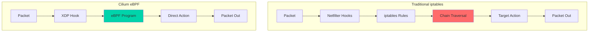
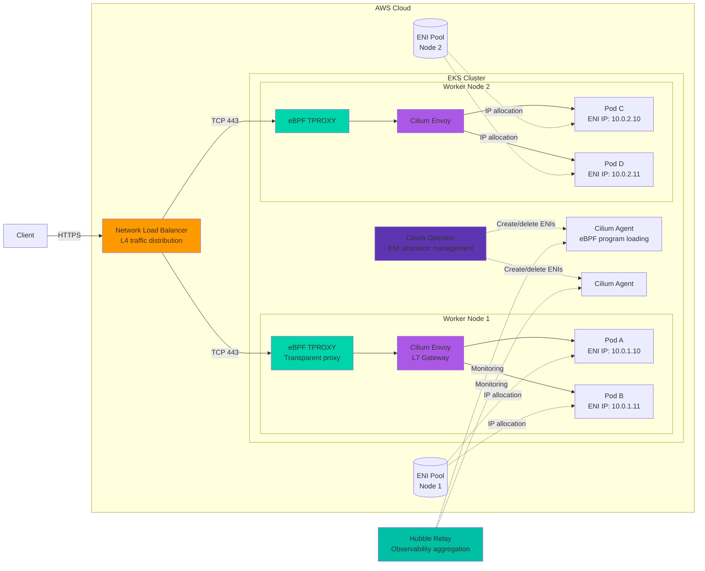
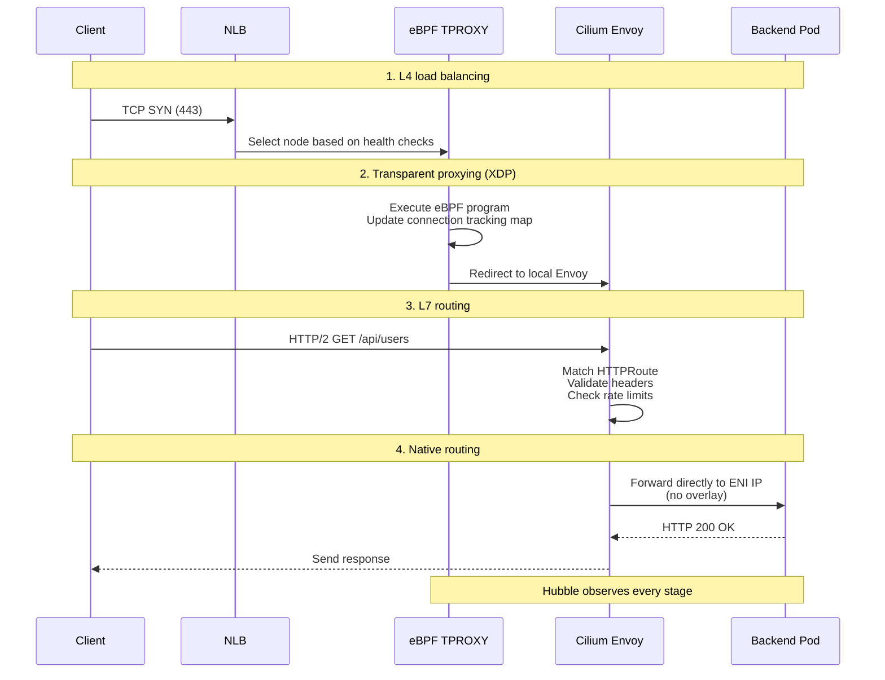
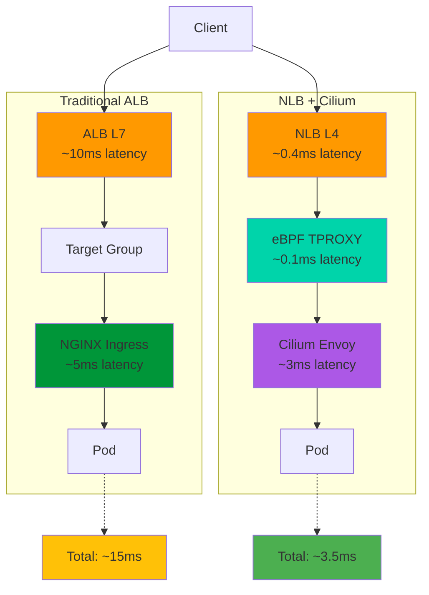
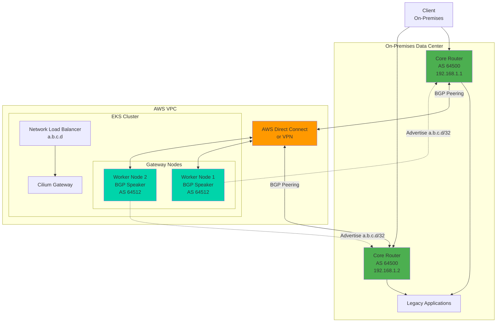
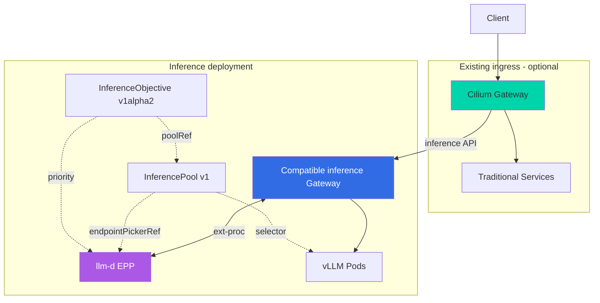

import Tabs from '@theme/Tabs';
import TabItem from '@theme/TabItem';
import { EksRequirementsTable, InstanceTypeTable, LatencyComparisonTable, AlgorithmComparisonTable } from '@site/src/components/GatewayApiTables';

:::info
This document extends the [Gateway API Adoption Guide](/docs/eks-best-practices/networking-performance/gateway-api-adoption-guide). It provides practical guidance for combining Cilium ENI mode and Gateway API to configure high-performance networking.
:::

Cilium ENI mode is a high-performance networking solution that uses AWS Elastic Network Interfaces directly to assign VPC IP addresses to Pods. Combined with Gateway API, it provides standardized L7 routing and eBPF-based ultra-low-latency processing.

## 1. What is Cilium ENI Mode?

Cilium ENI mode is a high-performance networking solution that uses AWS Elastic Network Interfaces directly to assign VPC IP addresses to Pods. Unlike traditional overlay networks, ENI mode provides the following capabilities.

### Key Features

**Direct use of AWS ENIs**<br/>
Each Pod receives an actual VPC IP address, integrating directly with the AWS networking stack. This enables native AWS networking features, including Security Groups, NACLs, and VPC Flow Logs, at the Pod level.

**High-performance networking with eBPF**<br/>
Cilium uses eBPF (extended Berkeley Packet Filter) in the Linux kernel to process packets at the kernel level. This provides more than a 10-fold performance improvement over traditional iptables-based solutions while minimizing CPU overhead.



**Native routing without overlay overhead**<br/>
ENI mode uses VPC routing tables directly, without overlay encapsulation such as VXLAN or Geneve. This minimizes network hops and prevents MTU issues caused by encapsulation.

:::tip
Cilium ENI mode is the recommended configuration for achieving the highest performance on AWS EKS. According to Datadog benchmarks, ENI mode reduces latency by 40% and improves throughput by 35% compared with overlay mode.
:::

## 2. Architecture Overview

The architecture combining Cilium ENI mode and Gateway API consists of the following components.



### Key Components

**1. Network Load Balancer (NLB)**
- AWS managed L4 load balancer
- Ultra-low latency, measured in microseconds
- Cross-Zone Load Balancing support
- Static IP or Elastic IP allocation
- TLS passthrough mode support

**2. eBPF TPROXY (Transparent Proxy)**
- Intercepts packets at the XDP (eXpress Data Path) layer
- Ultra-low-latency processing through kernel bypass
- Manages connection tracking tables as eBPF maps
- Independent processing per CPU core with a lock-free design

**3. Cilium Envoy (L7 Gateway)**
- L7 processing engine based on Envoy Proxy
- Implements Gateway API resources such as HTTPRoute and TLSRoute
- Dynamic listener and route configuration through the xDS API
- Request/response transformation, header manipulation, and rate limiting

**4. Cilium Operator**
- Orchestrates ENI creation and deletion
- Manages IP address pools, including Prefix Delegation
- Synchronizes policies across the cluster
- Manages CiliumNode CRD status

**5. Cilium Agent (DaemonSet)**
- Loads and manages eBPF programs on each node
- Implements the CNI plugin
- Tracks endpoint status
- Enforces network policies

**6. ENI (Elastic Network Interface)**
- AWS VPC network interface
- Maximum ENI count depends on the instance type (for example, 3 for m5.large)
- Maximum IP count per ENI is limited (for example, 10 per ENI for m5.large)
- Up to 16 /28 blocks per ENI with Prefix Delegation

**7. Hubble (Observability)**
- Real-time visibility into network flows
- Automatic service dependency map generation
- L7 protocol visibility (HTTP, gRPC, Kafka, DNS)
- Prometheus metric export

### Four Stages of Traffic Flow



**Stage 1: L4 load balancing (NLB)**
- Receives TCP connection requests from clients
- Selects healthy nodes based on target group health checks
- Maintains connection affinity with a flow hash algorithm based on the 5-tuple

**Stage 2: Transparent proxying (eBPF TPROXY)**
- Intercepts packets at the XDP hook and looks up the connection tracking map
- Transparently redirects new connections to the local Envoy listener
- Reads destination information from the map for fast forwarding of existing connections
- Completes all processing in kernel space without context switches

**Stage 3: L7 routing (Cilium Envoy)**
- Parses HTTP/2 and extracts request headers
- Matches HTTPRoute rules by path, header, and query parameter
- Transforms requests through URL rewrites and header addition/removal
- Enforces rate limiting and authentication/authorization policies

**Stage 4: Native routing**
- Forwards directly to the backend Pod's ENI IP address
- Uses VPC routing tables without VXLAN/Geneve encapsulation
- Does not require disabling EC2 instance source/destination checks
- Returns response packets along the same path in reverse

:::info
In this architecture, Cilium Envoy serves as the Gateway API `GatewayClass` implementation. The Cilium Operator detects changes to `HTTPRoute` resources and dynamically updates the Envoy configuration on each node.
:::

## 3. Prerequisites

The following requirements must be met to deploy Cilium ENI mode successfully.

### EKS Cluster Requirements

<EksRequirementsTable locale="en" />

:::warning
When creating a cluster, use the `--bootstrapSelfManagedAddons false` flag. This prevents automatic installation of the AWS VPC CNI and allows a clean Cilium deployment.

On an existing cluster, removing the VPC CNI interrupts Pod networking, so **downtime is required**.
:::

### VPC and Subnet Requirements

**IP address availability**<br/>
In ENI mode, each Pod uses an actual VPC IP address, so sufficient IP address space is required.

```bash
# Formula for calculating the required number of IP addresses
Total_required_IPs = (Worker_nodes × Max_Pods_per_node) + Headroom(20%)

# Example: 10 nodes, up to 110 Pods per node
# Total required IPs = (10 × 110) × 1.2 = 1,320
# Recommended subnet: /21 (2,048 IPs) or larger
```

**Subnet configuration**
- At least 1 subnet per Availability Zone (AZ)
- Required subnet tags:
  ```
  kubernetes.io/role/internal-elb = 1
  kubernetes.io/cluster/<cluster-name> = shared
  ```
- Both public and private subnets are supported
- Private subnets are recommended for stronger security

**VPC settings**
- Enable DNS hostnames: `enableDnsHostnames: true`
- Enable DNS support: `enableDnsSupport: true`
- Configure the correct domain name in the DHCP option set

### IAM Permissions

The Cilium Operator and nodes require the following IAM permissions to manage ENIs.

```json
{
  "Version": "2012-10-17",
  "Statement": [
    {
      "Effect": "Allow",
      "Action": [
        "ec2:CreateNetworkInterface",
        "ec2:AttachNetworkInterface",
        "ec2:DeleteNetworkInterface",
        "ec2:DetachNetworkInterface",
        "ec2:DescribeNetworkInterfaces",
        "ec2:DescribeInstances",
        "ec2:ModifyNetworkInterfaceAttribute",
        "ec2:AssignPrivateIpAddresses",
        "ec2:UnassignPrivateIpAddresses",
        "ec2:DescribeSubnets",
        "ec2:DescribeSecurityGroups",
        "ec2:CreateTags"
      ],
      "Resource": "*"
    }
  ]
}
```

**Configure IRSA (IAM Roles for Service Accounts)**

```bash
# Create an IAM role for the Cilium Operator
eksctl create iamserviceaccount \
  --name cilium-operator \
  --namespace kube-system \
  --cluster <cluster-name> \
  --role-name CiliumOperatorRole \
  --attach-policy-arn arn:aws:iam::aws:policy/AmazonEKS_CNI_Policy \
  --approve

# Attach an additional inline policy
aws iam put-role-policy \
  --role-name CiliumOperatorRole \
  --policy-name CiliumENIPolicy \
  --policy-document file://cilium-eni-policy.json
```

**Add permissions to the node IAM role**

```bash
# Get the node group's IAM role ARN
NODE_ROLE=$(aws eks describe-nodegroup \
  --cluster-name <cluster-name> \
  --nodegroup-name <node-group-name> \
  --query 'nodegroup.nodeRole' \
  --output text)

# Attach the policy
aws iam attach-role-policy \
  --role-name $(echo $NODE_ROLE | cut -d'/' -f2) \
  --policy-arn arn:aws:iam::aws:policy/AmazonEKS_CNI_Policy
```

:::tip EKS Auto Mode and Cilium

**EKS Auto Mode** (GA in December 2024) is a new EKS operating mode that automates node provisioning, compute capacity management, and security patching.

**Compatibility with Cilium:**
- ✅ **Compatible**: EKS Auto Mode does not restrict the choice of CNI plugin
- ✅ **Karpenter integration**: Auto Mode node provisioning is based on Karpenter and integrates naturally with Cilium ENI mode
- ⚠️ **Consideration**: Auto Mode defaults to `--bootstrapSelfManagedAddons false`, avoiding VPC CNI conflicts
- 📊 **Monitoring**: Auto Mode managed monitoring can be used alongside Hubble metrics

**Recommendations:**
- New projects: Use EKS Auto Mode with Cilium ENI
- Existing clusters: Cilium does not need to be redeployed when migrating from manual management to Auto Mode
:::

## 4. Installation Flow

The installation procedure for Cilium ENI mode depends on whether the cluster is new or existing.

### New Cluster (Recommended)

A new cluster allows Cilium to be deployed before the VPC CNI is installed, providing a clean installation without downtime.

**Step 1: Create an EKS cluster with the VPC CNI disabled**

```bash
# Create a cluster with eksctl
cat <<EOF > cluster-config.yaml
apiVersion: eksctl.io/v1alpha5
kind: ClusterConfig

metadata:
  name: cilium-gateway-cluster
  region: ap-northeast-2
  version: "1.32"

vpc:
  cidr: 10.0.0.0/16
  nat:
    gateway: HighlyAvailable  # Redundant NAT Gateways

# Disable automatic VPC CNI installation (required)
addonsConfig:
  autoApplyPodIdentityAssociations: false

managedNodeGroups:
  - name: ng-1
    instanceType: m7g.xlarge
    desiredCapacity: 3
    minSize: 3
    maxSize: 10
    volumeSize: 100
    privateNetworking: true
    iam:
      withAddonPolicies:
        autoScaler: true
        albIngress: true
        cloudWatch: true
    labels:
      role: worker
    tags:
      nodegroup-name: ng-1

# Disable kube-proxy; Cilium replaces it
kubeProxy:
  disable: true
EOF

# Create the cluster (takes 10-15 minutes)
eksctl create cluster -f cluster-config.yaml --bootstrapSelfManagedAddons false
```

:::warning
The `--bootstrapSelfManagedAddons false` flag is **required**. Without it, the VPC CNI is installed automatically and conflicts with Cilium.
:::

**Step 2: Install Gateway API CRDs**

```bash
# Install Gateway API v1.5.1 standard CRDs
kubectl apply -f https://github.com/kubernetes-sigs/gateway-api/releases/download/v1.5.1/standard-install.yaml

# Verify the installation
kubectl get crd | grep gateway
```

**Example output:**
```
gatewayclasses.gateway.networking.k8s.io         2026-02-12T00:00:00Z
gateways.gateway.networking.k8s.io               2026-02-12T00:00:00Z
httproutes.gateway.networking.k8s.io             2026-02-12T00:00:00Z
referencegrants.gateway.networking.k8s.io        2026-02-12T00:00:00Z
```

**Step 3: Add the Cilium Helm repository**

```bash
helm repo add cilium https://helm.cilium.io/
helm repo update
```

**Step 4: Install Cilium with Helm**

```yaml
# cilium-values.yaml
# Enable ENI mode
eni:
  enabled: true
  awsEnablePrefixDelegation: true  # /28 Prefix Delegation
  awsReleaseExcessIPs: true        # Automatically release unused IPs
  updateEC2AdapterLimitViaAPI: true
  iamRole: "arn:aws:iam::123456789012:role/CiliumOperatorRole"

# Set the IPAM mode to ENI
ipam:
  mode: "eni"
  operator:
    clusterPoolIPv4PodCIDRList:
      - 10.0.0.0/16  # Same as the VPC CIDR

# Enable native routing
routingMode: native
autoDirectNodeRoutes: true
ipv4NativeRoutingCIDR: 10.0.0.0/16

# Replace kube-proxy
kubeProxyReplacement: true
k8sServiceHost: <API_SERVER_ENDPOINT>  # EKS API server address
k8sServicePort: 443

# Enable Gateway API
gatewayAPI:
  enabled: true
  hostNetwork:
    enabled: false  # Set to false when using an NLB

# Hubble observability
hubble:
  enabled: true
  relay:
    enabled: true
    replicas: 2
  ui:
    enabled: true
    replicas: 1
    ingress:
      enabled: false  # Expose through a separate HTTPRoute
  metrics:
    enabled:
      - dns
      - drop
      - tcp
      - flow
      - port-distribution
      - icmp
      - httpV2:exemplars=true;labelsContext=source_ip,source_namespace,source_workload,destination_ip,destination_namespace,destination_workload,traffic_direction

# Operator high availability
operator:
  replicas: 2
  rollOutPods: true
  prometheus:
    enabled: true
    serviceMonitor:
      enabled: true

# Agent settings
prometheus:
  enabled: true
  serviceMonitor:
    enabled: true

# Security hardening
policyEnforcementMode: "default"
encryption:
  enabled: false  # Disable when using AWS VPC's own encryption
  type: wireguard  # Enable WireGuard when required

# Performance optimization
bpf:
  preallocateMaps: true
  mapDynamicSizeRatio: 0.0025  # Use 0.25% of memory
  monitorAggregation: medium
  lbMapMax: 65536  # Load balancer map size

# Maglev load balancing
loadBalancer:
  algorithm: maglev
  mode: dsr

# XDP acceleration (requires a supported NIC)
enableXDPPrefilter: true
```

```bash
# Get the EKS API server endpoint
API_SERVER=$(aws eks describe-cluster \
  --name cilium-gateway-cluster \
  --query 'cluster.endpoint' \
  --output text | sed 's/https:\/\///')

# Install the Helm chart
helm install cilium cilium/cilium \
  --version 1.19.0 \
  --namespace kube-system \
  --values cilium-values.yaml \
  --set k8sServiceHost=${API_SERVER} \
  --wait
```

**Step 5: Install CoreDNS**

CoreDNS may not yet be present because kube-proxy was disabled when installing Cilium.

```bash
# Deploy CoreDNS
kubectl apply -f https://raw.githubusercontent.com/cilium/cilium/v1.17/examples/kubernetes/addons/coredns/coredns.yaml

# Check CoreDNS Pods
kubectl get pods -n kube-system -l k8s-app=kube-dns
```

**Step 6: Verify the installation**

```bash
# Install the Cilium CLI (macOS)
brew install cilium-cli

# Alternatively, for Linux/macOS
CILIUM_CLI_VERSION=$(curl -s https://raw.githubusercontent.com/cilium/cilium-cli/main/stable.txt)
curl -L --remote-name-all https://github.com/cilium/cilium-cli/releases/download/${CILIUM_CLI_VERSION}/cilium-linux-amd64.tar.gz{,.sha256sum}
sudo tar xzvfC cilium-linux-amd64.tar.gz /usr/local/bin
rm cilium-linux-amd64.tar.gz{,.sha256sum}

# Check Cilium status (wait up to 5 minutes)
cilium status --wait

# Test connectivity (takes approximately 2-3 minutes)
cilium connectivity test
```

**Example healthy output:**
```
    /¯¯\
 /¯¯\__/¯¯\    Cilium:             OK
 \__/¯¯\__/    Operator:           OK
 /¯¯\__/¯¯\    Envoy DaemonSet:    OK
 \__/¯¯\__/    Hubble Relay:       OK
    \__/       ClusterMesh:        disabled

DaemonSet         cilium             Desired: 3, Ready: 3/3, Available: 3/3
Deployment        cilium-operator    Desired: 2, Ready: 2/2, Available: 2/2
Deployment        hubble-relay       Desired: 2, Ready: 2/2, Available: 2/2
Containers:       cilium             Running: 3
                  cilium-operator    Running: 2
                  hubble-relay       Running: 2
```

**Step 7: Create Gateway resources**

```yaml
# gateway-resources.yaml
---
apiVersion: gateway.networking.k8s.io/v1
kind: GatewayClass
metadata:
  name: cilium
spec:
  controllerName: io.cilium/gateway-controller
---
apiVersion: gateway.networking.k8s.io/v1
kind: Gateway
metadata:
  name: cilium-gateway
  namespace: default
  annotations:
    # Annotations for NLB creation
    service.beta.kubernetes.io/aws-load-balancer-type: "nlb"
    service.beta.kubernetes.io/aws-load-balancer-scheme: "internet-facing"
    service.beta.kubernetes.io/aws-load-balancer-backend-protocol: "tcp"
    service.beta.kubernetes.io/aws-load-balancer-cross-zone-load-balancing-enabled: "true"
    service.beta.kubernetes.io/aws-load-balancer-nlb-target-type: "ip"  # Use ENI IPs directly
spec:
  gatewayClassName: cilium
  listeners:
    - name: http
      protocol: HTTP
      port: 80
      allowedRoutes:
        namespaces:
          from: All
    - name: https
      protocol: HTTPS
      port: 443
      allowedRoutes:
        namespaces:
          from: All
      tls:
        mode: Terminate
        certificateRefs:
          - kind: Secret
            name: tls-cert
---
apiVersion: v1
kind: Secret
metadata:
  name: tls-cert
  namespace: default
type: kubernetes.io/tls
stringData:
  tls.crt: |
    -----BEGIN CERTIFICATE-----
    MIIBIjANBgkqhkiG9w0BAQEFAAOCAQ8AEXAMPLECERTIFICATE
    -----END CERTIFICATE-----
  tls.key: |
    -----BEGIN EC PARAMETERS-----
    MIIBIjANBgkqhkiG9w0BAQEFAAOCAQ8AEXAMPLEKEYDATA
    -----END EC PARAMETERS-----
```

```bash
# Deploy the Gateway
kubectl apply -f gateway-resources.yaml

# Check Gateway status
kubectl get gateway cilium-gateway -o yaml
```

**Gateway ready status:**
```yaml
status:
  conditions:
    - type: Accepted
      status: "True"
      reason: Accepted
    - type: Programmed
      status: "True"
      reason: Programmed
  addresses:
    - type: IPAddress
      value: "a1234567890abcdef.elb.ap-northeast-2.amazonaws.com"
```

### Existing Cluster (Downtime Required)

On an existing cluster, removing the VPC CNI and replacing it with Cilium temporarily interrupts Pod networking.

:::danger Downtime Warning
This process **interrupts Pod networking across the entire cluster**. For production environments, a blue-green cluster cutover or a scheduled maintenance window is strongly recommended.

Expected downtime: **5-10 minutes**, depending on cluster size
:::

**Step 1: Create backups**

```bash
# Back up the current network configuration
kubectl get -A pods -o yaml > backup-pods.yaml
kubectl get -A services -o yaml > backup-services.yaml
kubectl get -A ingress -o yaml > backup-ingress.yaml

# Back up the VPC CNI configuration
kubectl get daemonset aws-node -n kube-system -o yaml > backup-aws-node.yaml
```

**Step 2: Remove the VPC CNI**

```bash
# Delete the aws-node DaemonSet
kubectl delete daemonset aws-node -n kube-system

# Delete kube-proxy; Cilium replaces it
kubectl delete daemonset kube-proxy -n kube-system
```

**Step 3: Add node taints (optional safeguard)**

```bash
# Add a NoSchedule taint to every node
kubectl get nodes -o name | xargs -I {} kubectl taint node {} key=value:NoSchedule
```

**Step 4: Install Cilium using the new-cluster procedure**

Follow Steps 2-7 in the "New Cluster" section above.

**Step 5: Restart Pods**

```bash
# Restart Pods in all namespaces (rolling restart)
kubectl get namespaces -o jsonpath='{.items[*].metadata.name}' | \
  xargs -n1 -I {} kubectl rollout restart deployment -n {}

# Restart DaemonSets as well
kubectl get daemonsets -A -o jsonpath='{range .items[*]}{.metadata.namespace}{" "}{.metadata.name}{"\n"}{end}' | \
  while read ns ds; do
    kubectl rollout restart daemonset $ds -n $ns
  done
```

**Step 6: Verify networking**

```bash
# Test Pod-to-Pod communication
kubectl run test-pod --image=nicolaka/netshoot --rm -it -- /bin/bash
# Inside the Pod:
ping 10.0.1.10  # Another Pod's ENI IP
curl http://kubernetes.default.svc.cluster.local

# Test DNS resolution
nslookup kubernetes.default.svc.cluster.local

# Test external communication
curl https://www.google.com
```

## 5. Gateway API Resource Configuration

The following examples configure practical routing scenarios with Cilium Gateway API.

### Basic HTTPRoute

```yaml
# basic-httproute.yaml
apiVersion: gateway.networking.k8s.io/v1
kind: HTTPRoute
metadata:
  name: example-route
  namespace: production
spec:
  parentRefs:
    - name: cilium-gateway
      namespace: default
  hostnames:
    - "api.example.com"
  rules:
    - matches:
        - path:
            type: PathPrefix
            value: /api/v1
      backendRefs:
        - name: api-service
          port: 8080
          weight: 100
      filters:
        - type: RequestHeaderModifier
          requestHeaderModifier:
            add:
              - name: X-Backend-Version
                value: "v1"
```

### Traffic Splitting (Canary Deployment)

```yaml
# canary-httproute.yaml
apiVersion: gateway.networking.k8s.io/v1
kind: HTTPRoute
metadata:
  name: canary-route
  namespace: production
spec:
  parentRefs:
    - name: cilium-gateway
      namespace: default
  hostnames:
    - "api.example.com"
  rules:
    - matches:
        - path:
            type: PathPrefix
            value: /api/v2
      backendRefs:
        - name: api-v2-stable
          port: 8080
          weight: 90  # 90% of traffic
        - name: api-v2-canary
          port: 8080
          weight: 10  # 10% of traffic
```

### Header-Based Routing

```yaml
# header-based-route.yaml
apiVersion: gateway.networking.k8s.io/v1
kind: HTTPRoute
metadata:
  name: header-route
  namespace: production
spec:
  parentRefs:
    - name: cilium-gateway
  hostnames:
    - "api.example.com"
  rules:
    # Route beta users to the new version
    - matches:
        - headers:
            - type: Exact
              name: X-User-Type
              value: beta
      backendRefs:
        - name: api-v2-beta
          port: 8080

    # Route regular users to the stable version
    - matches:
        - path:
            type: PathPrefix
            value: /
      backendRefs:
        - name: api-v1-stable
          port: 8080
```

### URL Rewrite

```yaml
# url-rewrite-route.yaml
apiVersion: gateway.networking.k8s.io/v1
kind: HTTPRoute
metadata:
  name: rewrite-route
  namespace: production
spec:
  parentRefs:
    - name: cilium-gateway
  hostnames:
    - "api.example.com"
  rules:
    - matches:
        - path:
            type: PathPrefix
            value: /old-api
      filters:
        - type: URLRewrite
          urlRewrite:
            path:
              type: ReplacePrefixMatch
              replacePrefixMatch: /new-api
      backendRefs:
        - name: new-api-service
          port: 8080
```

### Role Separation Guide

The following configuration implements role separation, a key benefit of Gateway API, in Cilium.

```yaml
# role-separation-example.yaml

# 1. Platform team: Manage GatewayClass (cluster-admin)
---
apiVersion: gateway.networking.k8s.io/v1
kind: GatewayClass
metadata:
  name: production-gateway
spec:
  controllerName: io.cilium/gateway-controller
  parametersRef:
    group: ""
    kind: ConfigMap
    name: gateway-config
    namespace: kube-system

---
# Platform team: Manage Gateway infrastructure (infra namespace)
apiVersion: gateway.networking.k8s.io/v1
kind: Gateway
metadata:
  name: shared-gateway
  namespace: infra
  annotations:
    service.beta.kubernetes.io/aws-load-balancer-type: "nlb"
    service.beta.kubernetes.io/aws-load-balancer-nlb-target-type: "ip"
spec:
  gatewayClassName: production-gateway
  listeners:
    - name: https
      protocol: HTTPS
      port: 443
      allowedRoutes:
        namespaces:
          from: All  # Allow attachment from all namespaces
      tls:
        mode: Terminate
        certificateRefs:
          - kind: Secret
            name: wildcard-tls-cert
            namespace: infra

---
# 2. Development team A: Manage HTTPRoute (team-a namespace)
apiVersion: gateway.networking.k8s.io/v1
kind: HTTPRoute
metadata:
  name: team-a-route
  namespace: team-a
spec:
  parentRefs:
    - name: shared-gateway
      namespace: infra  # Cross-namespace reference
  hostnames:
    - "team-a.example.com"
  rules:
    - matches:
        - path:
            type: PathPrefix
            value: /
      backendRefs:
        - name: team-a-service
          port: 8080

---
# 3. Development team B: Manage HTTPRoute (team-b namespace)
apiVersion: gateway.networking.k8s.io/v1
kind: HTTPRoute
metadata:
  name: team-b-route
  namespace: team-b
spec:
  parentRefs:
    - name: shared-gateway
      namespace: infra
  hostnames:
    - "team-b.example.com"
  rules:
    - matches:
        - path:
            type: PathPrefix
            value: /
      backendRefs:
        - name: team-b-service
          port: 9090

---
# Allow cross-namespace references (created by the platform team)
apiVersion: gateway.networking.k8s.io/v1beta1
kind: ReferenceGrant
metadata:
  name: allow-team-routes
  namespace: infra
spec:
  from:
    - group: gateway.networking.k8s.io
      kind: HTTPRoute
      namespace: team-a
    - group: gateway.networking.k8s.io
      kind: HTTPRoute
      namespace: team-b
  to:
    - group: gateway.networking.k8s.io
      kind: Gateway
      name: shared-gateway
```

**RBAC configuration:**

```yaml
# rbac-platform-team.yaml
---
apiVersion: rbac.authorization.k8s.io/v1
kind: ClusterRole
metadata:
  name: gateway-infrastructure-admin
rules:
  - apiGroups: ["gateway.networking.k8s.io"]
    resources: ["gatewayclasses", "gateways"]
    verbs: ["create", "delete", "get", "list", "patch", "update", "watch"]
  - apiGroups: [""]
    resources: ["secrets"]
    verbs: ["get", "list", "watch"]

---
apiVersion: rbac.authorization.k8s.io/v1
kind: ClusterRoleBinding
metadata:
  name: platform-team-gateway
roleRef:
  apiGroup: rbac.authorization.k8s.io
  kind: ClusterRole
  name: gateway-infrastructure-admin
subjects:
  - kind: Group
    name: platform-team
    apiGroup: rbac.authorization.k8s.io

---
# rbac-dev-team.yaml
apiVersion: rbac.authorization.k8s.io/v1
kind: Role
metadata:
  name: httproute-manager
  namespace: team-a
rules:
  - apiGroups: ["gateway.networking.k8s.io"]
    resources: ["httproutes"]
    verbs: ["create", "delete", "get", "list", "patch", "update", "watch"]

---
apiVersion: rbac.authorization.k8s.io/v1
kind: RoleBinding
metadata:
  name: team-a-httproute
  namespace: team-a
roleRef:
  apiGroup: rbac.authorization.k8s.io
  kind: Role
  name: httproute-manager
subjects:
  - kind: Group
    name: team-a-developers
    apiGroup: rbac.authorization.k8s.io
```

## 6. Performance Optimization

The following tuning options aim to maximize performance in Cilium ENI mode.

### Benefits of NLB + Cilium Envoy



**Latency comparison:**

<LatencyComparisonTable locale="en" />

### ENI and IP Management Optimization

**Enable Prefix Delegation**<br/>
Allocate /28 blocks of 16 IP addresses at a time instead of individual IP addresses to reduce ENI attachment overhead.

```yaml
# cilium-values.yaml (ENI section)
eni:
  awsEnablePrefixDelegation: true

  # Automatically release excess unused IPs to reduce costs
  awsReleaseExcessIPs: true

  # Minimum reserved IP count per node
  minAllocate: 10

  # Preallocated IP count for Pod scale-out
  preAllocate: 8
```

**Benefits:**
- Up to a 16-fold reduction in ENI attachments
- 30-50% shorter Pod startup time
- Fewer AWS API calls, helping avoid rate limits

**Check ENI/IP limits by instance type:**

```bash
# Query limits with the AWS CLI
aws ec2 describe-instance-types \
  --instance-types m7g.xlarge \
  --query 'InstanceTypes[0].NetworkInfo.{MaxENI:MaximumNetworkInterfaces,IPv4PerENI:Ipv4AddressesPerInterface}'

# Example output:
# {
#   "MaxENI": 4,
#   "IPv4PerENI": 15
# }
# With Prefix Delegation: 4 ENIs × 16 IPs/prefix = up to 64 Pods
```

### BPF Tuning

**Enable map preallocation**<br/>
Preallocate eBPF maps at startup instead of allocating them dynamically to eliminate latency jitter.

```yaml
# cilium-values.yaml
bpf:
  preallocateMaps: true  # Preallocate maps

  # Adjust map sizes to twice the defaults
  lbMapMax: 65536        # Maximum load balancer backend count
  natMax: 524288         # Maximum NAT connection tracking entries
  neighMax: 524288       # Maximum neighbor table entries
  policyMapMax: 16384    # Maximum policy entries

  # Monitor aggregation level (CPU usage vs visibility)
  monitorAggregation: medium  # none, low, medium, maximum

  # Connection tracking (CT) table sizes
  ctTcpMax: 524288
  ctAnyMax: 262144
```

**Calculate memory usage:**
```bash
# Estimated memory usage = sum of (map size × entry size)
# lbMapMax (65536 × 128B) = 8MB
# natMax (524288 × 64B) = 32MB
# Total estimated memory: ~100-200MB/node
```

### Routing Optimization

**Maglev load balancing algorithm**<br/>
Developed by Google, Maglev uses consistent hashing to preserve connection affinity as much as possible when backends change.

```yaml
# cilium-values.yaml
loadBalancer:
  algorithm: maglev  # Default: random
  mode: dsr          # Direct Server Return

  # Maglev table size (must be a prime number)
  maglev:
    tableSize: 65521  # Recommended: 65521 (prime)
    hashSeed: "JLfvgnHc2kaSUFaI"  # Unique seed per cluster
```

**Algorithm comparison:**

<AlgorithmComparisonTable locale="en" />

**XDP acceleration (eXpress Data Path)**<br/>
XDP processes packets at the network driver level, bypassing the kernel networking stack entirely.

```yaml
# cilium-values.yaml
# Enable the XDP prefilter for DDoS protection and early dropping of invalid packets
enableXDPPrefilter: true

# Select the XDP mode
xdp:
  mode: native  # native (highest performance) or generic (compatibility)
```

**Check XDP support:**
```bash
# Run on the node
ethtool -i eth0 | grep driver
# Supported drivers: ixgbe, i40e, mlx4, mlx5, ena (AWS Nitro)

# Verify that XDP is enabled
ip link show eth0 | grep xdp
```

**Performance improvements:**
- More than a 10-fold improvement in packet filtering performance
- 80% lower CPU usage during DDoS mitigation
- Full support with the AWS ENA driver on Nitro instances

### Instance Type Considerations

**Recommended instances for network performance:**

<InstanceTypeTable locale="en" />

**Reasons to choose Graviton4 (8g series):**
- 40% better price-performance than x86
- 60% improvement in energy efficiency
- eBPF JIT optimization
- Full compatibility with Cilium
- Graviton5 (M9g/M9gd, GA in June 2026): ~25% better performance than M8g

**When to choose Network Optimized instances (n series):**
- Dedicated Gateway nodes
- Traffic of 100,000 RPS or more
- Sub-1ms latency requirements

:::tip
A hybrid configuration is recommended: a dedicated Gateway node group using the `c7gn` series, with general workloads on the `m7g` series.

```yaml
# Example nodeSelector
nodeSelector:
  role: gateway
  instance-type: c7gn.xlarge
```
:::

## 7. Operations & Observability

This section covers operations using Hubble, Cilium's observability tool.

### Hubble Observability

**Observe flows in real time**

```bash
# Install the Hubble CLI
brew install hubble

# Alternatively, download it directly
HUBBLE_VERSION=$(curl -s https://raw.githubusercontent.com/cilium/hubble/master/stable.txt)
curl -L --remote-name-all https://github.com/cilium/hubble/releases/download/$HUBBLE_VERSION/hubble-linux-amd64.tar.gz{,.sha256sum}
sudo tar xzvfC hubble-linux-amd64.tar.gz /usr/local/bin

# Set up port forwarding
cilium hubble port-forward &

# Stream flows in real time across all namespaces
hubble observe --all

# Filter flows for a specific Pod
hubble observe --pod default/frontend-5d5c7b6d8-abc12

# Filter HTTP traffic only
hubble observe --protocol http

# Monitor dropped packets
hubble observe --verdict DROPPED

# Observe traffic between specific namespaces
hubble observe --from-namespace production --to-namespace database
```

**Example output:**
```
Feb 12 10:23:45.123: default/frontend-abc12:8080 -> default/backend-xyz34:9090 http-request FORWARDED (HTTP/2 GET /api/users)
Feb 12 10:23:45.127: default/backend-xyz34:9090 <- default/frontend-abc12:8080 http-response FORWARDED (HTTP/2 200 4.2ms)
Feb 12 10:23:45.130: default/frontend-abc12 -> 8.8.8.8:53 dns-request FORWARDED (A query example.com)
Feb 12 10:23:45.145: 8.8.8.8:53 -> default/frontend-abc12 dns-response FORWARDED (A 93.184.216.34)
```

**Generate a service map**

```bash
# Generate a service dependency map in GraphViz format
hubble observe --all --output jsonpb | \
  hubble-flow-graph > service-map.dot

# Convert to a PNG image
dot -Tpng service-map.dot -o service-map.png

# Open the real-time web UI
cilium hubble ui
# Open http://localhost:12000 in a browser
```

**L7 protocol visibility**

```bash
# Statistics by HTTP method
hubble observe --protocol http --output json | \
  jq -r '.l7.http.method' | \
  sort | uniq -c | sort -rn

# HTTP response code distribution
hubble observe --protocol http --output json | \
  jq -r '.l7.http.code' | \
  sort | uniq -c | sort -rn

# Trace gRPC method calls
hubble observe --protocol grpc

# Kafka topic traffic
hubble observe --protocol kafka
```

### Prometheus Metrics

**Agent metrics (per node)**

```promql
# Packets processed per second
rate(cilium_forward_count_total[5m])

# Dropped packet ratio
rate(cilium_drop_count_total[5m]) / rate(cilium_forward_count_total[5m])

# eBPF map utilization
cilium_bpf_map_ops_total

# NAT table utilization
cilium_nat_max_entries_used / cilium_nat_max_entries_total * 100

# Inter-node latency (P99)
histogram_quantile(0.99, rate(cilium_network_round_trip_time_seconds_bucket[5m]))
```

**Gateway metrics (Envoy)**

```promql
# Requests per second (RPS)
rate(envoy_http_downstream_rq_total{envoy_cluster_name="cilium-gateway"}[5m])

# P95 response latency
histogram_quantile(0.95, rate(envoy_http_downstream_rq_time_bucket[5m]))

# 5xx error rate
sum(rate(envoy_http_downstream_rq_xx{envoy_response_code_class="5"}[5m]))
/
sum(rate(envoy_http_downstream_rq_xx[5m]))

# Backend connection failures
rate(envoy_cluster_upstream_cx_connect_fail[5m])

# Active connection count
envoy_http_downstream_cx_active
```

**ENI metrics**

```promql
# ENIs in use per node
cilium_operator_eni_attached

# Available IP address count
cilium_operator_eni_available_ips

# IP allocation rate
rate(cilium_operator_eni_ip_allocations[5m])

# ENI allocation errors
rate(cilium_operator_eni_allocation_errors[5m])
```

### Grafana Dashboards

**Import official dashboards**

```bash
# Official Cilium dashboard (Grafana ID: 16611)
# In Grafana, go to Dashboards > Import and enter 16611

# Alternatively, download the JSON file directly
curl -o cilium-dashboard.json https://grafana.com/api/dashboards/16611/revisions/latest/download

# Hubble dashboard (Grafana ID: 16612)
curl -o hubble-dashboard.json https://grafana.com/api/dashboards/16612/revisions/latest/download
```

**Key dashboard panels:**
- Network Throughput (in/out bytes per second)
- Packet Drop Rate by Reason
- Connection Rate (new connections per second)
- NAT Table Utilization
- eBPF Map Pressure
- Gateway Request Rate and Latency
- Top Talkers (most active pods)
- Service Dependency Map

### Source IP Preservation

NLB IP target mode automatically preserves the client IP, which can also be inspected through additional headers in Envoy.

**Add the X-Forwarded-For header**

```yaml
# gateway-with-xff.yaml
apiVersion: gateway.networking.k8s.io/v1
kind: Gateway
metadata:
  name: cilium-gateway
  annotations:
    # NLB IP target mode (source IP preservation)
    service.beta.kubernetes.io/aws-load-balancer-nlb-target-type: "ip"

    # Add the X-Forwarded-For header through Envoy
    service.beta.kubernetes.io/aws-load-balancer-proxy-protocol: "*"
spec:
  gatewayClassName: cilium
  listeners:
    - name: https
      protocol: HTTPS
      port: 443
      tls:
        mode: Terminate
        certificateRefs:
          - name: tls-cert
```

**Read the client IP in the backend (Python example)**

```python
from flask import Flask, request

app = Flask(__name__)

@app.route('/api/info')
def get_client_ip():
    # First choice: X-Forwarded-For header (proxy chain)
    if 'X-Forwarded-For' in request.headers:
        client_ip = request.headers['X-Forwarded-For'].split(',')[0].strip()

    # Second choice: X-Envoy-External-Address (added by Envoy)
    elif 'X-Envoy-External-Address' in request.headers:
        client_ip = request.headers['X-Envoy-External-Address']

    # Third choice: Direct connection (NLB IP target mode)
    else:
        client_ip = request.remote_addr

    return {
        "client_ip": client_ip,
        "headers": dict(request.headers)
    }
```

### Key Verification Commands

```bash
# 1. Check Cilium status
cilium status --wait

# 2. Check Gateway status
kubectl get gateway cilium-gateway -o jsonpath='{.status.conditions[?(@.type=="Programmed")].status}'
# Output: True

# 3. Check HTTPRoute status
kubectl get httproute -A -o wide

# 4. Inspect Envoy listeners
kubectl exec -n kube-system ds/cilium -- cilium envoy admin listeners

# 5. Check backend endpoints
kubectl exec -n kube-system ds/cilium -- cilium service list

# 6. Check ENI allocation status
kubectl get ciliumnodes -o jsonpath='{range .items[*]}{.metadata.name}{"\t"}{.status.eni.available}{"\t"}{.status.ipam.used}{"\n"}{end}'

# 7. Monitor flows for 30 seconds
hubble observe --all --since 30s

# 8. Verify network policies
cilium endpoint list

# 9. Inspect BPF map statistics
kubectl exec -n kube-system ds/cilium -- cilium bpf metrics list

# 10. Test connectivity
cilium connectivity test --test egress-gateway,to-cidr
```

## 8. BGP Control Plane v2

Cilium BGP Control Plane v2 advertises LoadBalancer IPs through BGP in on-premises data centers and hybrid environments.

:::info
BGP is not required when AWS EKS uses an NLB. It is useful, however, when hybrid cloud environments need traffic routing between on-premises systems and EKS.
:::

### CiliumBGPPeeringPolicy CRD

```yaml
# bgp-peering-policy.yaml
apiVersion: cilium.io/v2alpha1
kind: CiliumBGPPeeringPolicy
metadata:
  name: bgp-policy
spec:
  # Select the nodes that participate in BGP peering
  nodeSelector:
    matchLabels:
      role: gateway

  # Configure BGP virtual routers
  virtualRouters:
    - localASN: 64512  # AS number of the EKS cluster
      exportPodCIDR: false  # Do not advertise Pod CIDRs in ENI mode

      # Select Services to advertise
      serviceSelector:
        matchLabels:
          bgp-advertise: "true"

      # BGP peers (on-premises routers)
      neighbors:
        - peerAddress: 192.168.1.1/32  # Peer router IP
          peerASN: 64500                # Peer AS number
          eBGPMultihopTTL: 10

          # Connection maintenance timers
          connectRetryTimeSeconds: 120
          holdTimeSeconds: 90
          keepAliveTimeSeconds: 30

        - peerAddress: 192.168.1.2/32
          peerASN: 64500
          eBGPMultihopTTL: 10
```

### LoadBalancer IP Advertisement

```yaml
# service-with-bgp.yaml
apiVersion: v1
kind: Service
metadata:
  name: gateway-service
  namespace: default
  labels:
    bgp-advertise: "true"  # Advertise through BGP
  annotations:
    # Use an NLB on EKS
    service.beta.kubernetes.io/aws-load-balancer-type: "nlb"

    # Cilium BGP configuration
    io.cilium/bgp-announce: "true"
    io.cilium/bgp-local-pref: "100"
spec:
  type: LoadBalancer
  selector:
    app: cilium-gateway
  ports:
    - name: https
      port: 443
      targetPort: 443
      protocol: TCP
```

### Hybrid Environment Support



**Traffic flow:**
1. An on-premises client sends a request to an EKS service IP (a.b.c.d)
2. The on-premises core router looks up the BGP routing table
3. Traffic is forwarded through Direct Connect/VPN to an EKS Gateway node
4. Cilium Gateway processes the request and routes it to a backend Pod

**Check BGP status:**

```bash
# Check BGP peer status
kubectl get ciliumbgppeeringstatus

# Inspect advertised routes
kubectl exec -n kube-system ds/cilium -- cilium bgp routes

# Check peer connection status
kubectl exec -n kube-system ds/cilium -- cilium bgp peers
```

**Example output:**
```
Local AS   Peer AS   Peer Address   Status    Uptime    Prefixes
64512      64500     192.168.1.1    Established  2h34m     1
64512      64500     192.168.1.2    Established  2h34m     1

Advertised Routes:
10.0.100.50/32 via 172.31.1.10 (self)
```

---

## 9. Hybrid Nodes Architecture and AI/ML Workloads

When EKS Hybrid Nodes combine cloud and on-premises infrastructure, including dedicated GPU data centers, Cilium plays a key role in unifying the CNI and observability.

### 9.1 Why Cilium Is Needed for Hybrid Nodes

The AWS VPC CNI **runs only on EC2 instances inside a VPC**. When on-premises GPU servers join a cluster through EKS Hybrid Nodes, they cannot use the VPC CNI, which results in separate CNIs for cloud and on-premises nodes.

There are three main approaches to CNI configuration in a hybrid node environment.

| Category | VPC CNI + Calico | VPC CNI + Cilium | Cilium Only (Recommended) |
|------|-----------------|-----------------|-------------------|
| Cloud node CNI | VPC CNI | VPC CNI | Cilium ENI mode |
| On-premises node CNI | Separate Calico installation | Separate Cilium installation | Cilium VXLAN/Native |
| On-premises networking | Calico VXLAN/BGP | Cilium VXLAN or BGP | Cilium VXLAN or BGP |
| CNI unification | ❌ 2 CNIs | ❌ 2 CNIs | ✅ Single CNI |
| Network policy engine | Separate engines (VPC CNI + Calico) | Separate engines (VPC CNI + Cilium) | Single eBPF engine |
| Observability | CloudWatch + separate tools | CloudWatch + Hubble (on-premises only) | Unified Hubble (entire cluster) |
| Gateway API | Separate implementation required | Cilium Gateway API on-premises only | Built-in Cilium Gateway API |
| eBPF acceleration | ❌ Not supported in the cloud | ❌ Not supported in the cloud | ✅ eBPF on all nodes |
| Operational complexity | High (2 CNIs + 2 policy engines) | Medium (2 CNIs, reusing Cilium expertise) | Low (single stack) |

:::warning Overlay Networking on On-Premises Nodes
Regardless of the CNI, **overlay networking (VXLAN/Geneve) is the default for on-premises nodes**. Without AWS VPC routing tables on-premises, communication between Pod CIDRs requires encapsulation.

Removing the overlay requires **BGP peering**. Advertising Pod CIDRs to on-premises routers through Cilium BGP Control Plane v2 enables native routing, provided that the on-premises network equipment supports BGP.
:::

:::info Admission Webhook Routing Issues and Solutions
For the EKS control plane, located in an AWS VPC, to reach webhook Pods on hybrid nodes, the Pod CIDRs must be routable. The [official AWS documentation](https://docs.aws.amazon.com/eks/latest/userguide/hybrid-nodes-webhooks.html) describes two approaches.

**When Pod CIDRs are routable:**

- Advertise on-premises Pod CIDRs through BGP (recommended), static routes, or custom routing

**When Pod CIDRs are not routable (without BGP):**

- **Run webhooks on cloud nodes** (the official AWS recommendation) — Pin webhook Pods to cloud nodes with `nodeSelector` or `nodeAffinity`. The API server can access them directly within the VPC
- **Use Cilium overlay (VXLAN) mode as the only CNI across the cluster** — See the [reference article](https://medium.com/@the.jfnadeau/eks-cilium-as-the-only-cni-driver-with-simplified-hybrid-nodes-and-admission-webhooks-routing-1f351d11f9dd). Overlay mode requires only unicast communication between node IPs, allowing the API server to reach webhook Pods through VXLAN tunnels. This sacrifices the benefits of ENI native routing on cloud nodes
:::

:::tip IPAM Considerations for a Cilium-Only Configuration
Cilium's `ipam.mode=eni` **works only on AWS EC2 instances**. There are three ways to implement a Cilium-only configuration in a hybrid cluster that includes on-premises nodes.

1. **ClusterMesh (recommended)**: Operate separate cloud clusters (ENI mode) and on-premises clusters (cluster-pool mode), connected through [Cilium ClusterMesh](https://docs.cilium.io/en/stable/network/clustermesh/). This provides unified observability while using IPAM optimized for each environment.
2. **Multi-pool IPAM**: Assign different IPAM pools based on node labels within a single cluster (Cilium 1.15+). Use an ENI pool for cloud nodes and cluster-pool for on-premises nodes.
3. **Unified cluster-pool IPAM**: Use `cluster-pool` + VXLAN throughout, without ENI mode. This is the simplest option, but it loses the benefits of ENI native routing in the cloud.
:::

### 9.2 Deployment option: Cilium + Gateway + llm-d {#92-권장-아키텍처-cilium--cilium-gateway-api--llm-d}

Using Cilium as the CNI and supporting InferencePool in Cilium Gateway are separate capabilities. The following is an **optional topology that retains the existing Cilium ingress and adds a compatible inference Gateway**. Validate the cost and latency of two proxy hops, as well as timeout, retry, streaming, and authentication header forwarding behavior. Cloud and hybrid node locations are illustrative; validate each node's CNI/IPAM and Pod connectivity separately.

llm-d's [v0.8.1 Gateway Mode](https://github.com/llm-d/llm-d/blob/v0.8.1/docs/architecture/core/router/proxy.md) can also handle ordinary Services and InferencePools through a single compatible Gateway. The EPP is an endpoint selection service, not a second Gateway.



### 9.3 Alternative architectures

| Option | Configuration | Selection Criteria / Trade-offs |
|------|------|----------------------|
| **Retain existing ingress** | Cilium CNI + Cilium Gateway + compatible inference Gateway/EPP | Preserves ingress ownership; requires managing an additional Gateway, policies, and observability |
| **Single compatible Gateway** | Cilium CNI + a Gateway that supports InferencePool/EPP integration | Routes ordinary Services and inference pools through the same Gateway; verify support and security policies for the specific implementation and version |
| **Direct integration with Cilium Gateway** | Cilium CNI + Cilium Gateway + EPP | Choose only after verifying InferencePool backends and EPP integration in the specific Cilium release; using Envoy alone does not establish support |

The [Cilium v1.18.0 Gateway API documentation](https://github.com/cilium/cilium/blob/v1.18.0/Documentation/network/servicemesh/gateway-api/gateway-api.rst) does not establish that the InferencePool/EPP integration required here has been verified. This document does not claim to have validated direct Cilium integration. Installing a CRD alone does not enable a Gateway controller to handle a new backend kind.

### 9.4 Gateway API Inference Extension resources {#94-gateway-api-inference-extension-미래-방향}

The baseline is llm-d v0.8.1 (2026-06-26), router v0.9.0, GIE v1.5.0, and Gateway API v1.5.1. `InferencePool` is the GIE `inference.networking.k8s.io/v1` API, while `InferenceObjective` is llm-d's `llm-d.ai/v1alpha2` alpha policy API. `InferenceModel` is the historical name of the earlier policy API. Older v1alpha1 examples and planned GA dates are not current deployment guidance.

Primary schemas: [llm-d v0.8.1](https://github.com/llm-d/llm-d/releases/tag/v0.8.1), [InferencePool v1](https://github.com/kubernetes-sigs/gateway-api-inference-extension/blob/v1.5.0/config/crd/bases/inference.networking.k8s.io_inferencepools.yaml), [InferenceObjective v1alpha2](https://github.com/llm-d/llm-d-router/blob/v0.9.0/config/crd/bases/llm-d.ai_inferenceobjectives.yaml), [HTTPRoute v1](https://github.com/kubernetes-sigs/gateway-api/blob/v1.5.1/config/crd/standard/gateway.networking.k8s.io_httproutes.yaml).

Define images, model arguments, replica counts, and GPU requests in workloads such as Deployments or LeaderWorkerSets. The Pool connects those Pods through labels, ports, and the EPP; the Objective expresses request priority.

This example defines routing resources only. It requires an existing `llm-d` namespace, `inference-gateway` Gateway, `inference-epp` Service (with an EPP on port 9002 configured to integrate with `gpu-pool`), and model server Pods with the `app: vllm` label and port 8000. It also requires Gateway API v1.5.1, the InferencePool CRD from GIE v1.5.0, the InferenceObjective CRD from router v0.9.0, and compatible controllers.

```yaml
apiVersion: inference.networking.k8s.io/v1
kind: InferencePool
metadata:
  name: gpu-pool
  namespace: llm-d
spec:
  selector:
    matchLabels:
      app: vllm
  targetPorts:
    - number: 8000
  endpointPickerRef:
    name: inference-epp
    kind: Service
    port:
      number: 9002
    failureMode: FailClose
---
apiVersion: llm-d.ai/v1alpha2
kind: InferenceObjective
metadata:
  name: interactive
  namespace: llm-d
spec:
  poolRef:
    group: inference.networking.k8s.io
    kind: InferencePool
    name: gpu-pool
  priority: 10
---
apiVersion: gateway.networking.k8s.io/v1
kind: HTTPRoute
metadata:
  name: inference-route
  namespace: llm-d
spec:
  parentRefs:
    - name: inference-gateway
  rules:
    - matches:
        - path:
            type: PathPrefix
            value: /v1
      backendRefs:
        - group: inference.networking.k8s.io
          kind: InferencePool
          name: gpu-pool
          port: 8000
```

`priority: 10` is an example policy that expresses higher processing priority than requests with priority 0 in the same pool. When using [flow control](https://github.com/llm-d/llm-d/blob/v0.8.1/docs/architecture/core/router/epp/flow-control.md), enable the `flowControl` feature gate in the EPP and have a trusted authentication layer set the `x-llm-d-inference-objective: interactive` header. Creating an Objective alone does not automatically apply it to every request. Validate and reset the header so external users cannot raise their priority arbitrarily. This value does not reserve dedicated GPUs or act as a Pod `PriorityClass`.

---

## Related Documents

- **[Gateway API Adoption Guide](/docs/eks-best-practices/networking-performance/gateway-api-adoption-guide)** - Complete Gateway API migration guide
- **[llm-d + EKS Deployment Guide](/docs/agentic-ai-platform/model-serving/inference-frameworks/llm-d-eks-automode)** - Configure the llm-d distributed inference stack
- **[Cilium Documentation](https://docs.cilium.io/)** - Official Cilium project documentation
- **[Cilium Gateway API Documentation](https://docs.cilium.io/en/stable/network/servicemesh/gateway-api/gateway-api/)** - Guide to the Cilium Gateway API implementation
- **[Gateway API Inference Extension](https://gateway-api.sigs.k8s.io/geps/gep-3567/)** - Gateway API extensions for AI/ML inference
- **[AWS EKS Best Practices](https://aws.github.io/aws-eks-best-practices/)** - EKS best practices guide
- **[Introduction to eBPF](https://ebpf.io/)** - eBPF technology overview and learning resources
