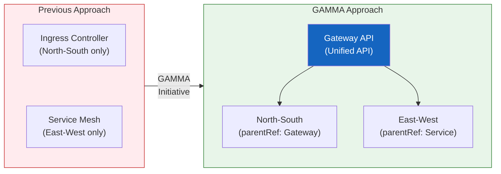

import {
  GammaInfographic,
  GammaSupportTable,
} from '@site/src/components/GatewayApiTables';

# GAMMA Initiative — The Future of Service Mesh Integration

## 4.1 What is GAMMA?

**GAMMA (Gateway API for Mesh Management and Administration)** is an initiative that extends Gateway API into the service mesh domain.

- **GA achieved**: Gateway API v1.1.0 (October 2025)
- **Unified scope**: North-South (ingress) + East-West (service mesh) traffic
- **Core concept**: Previously, ingress controllers and service meshes had entirely separate configuration systems — GAMMA unifies them under a single API
- **Role-based configuration**: Applies Gateway API's role separation principles equally to mesh traffic

With GAMMA, cluster operators no longer need to learn and manage two different APIs. Both ingress and mesh can be managed with the same Gateway API resources.



## 4.2 Core Goals & Mesh Configuration Patterns

<GammaInfographic />

## 4.3 GAMMA Support Status

<GammaSupportTable />

:::tip GAMMA in AWS Environments
In AWS environments, **VPC Lattice + ACK** can implement GAMMA patterns without sidecars. Provides fully managed service mesh capabilities including IAM-based mTLS, CloudWatch/X-Ray observability, and fault injection through AWS FIS.
:::

## 4.4 Advantages of GAMMA

### 1. Reduced Learning Curve
Teams only need to learn one API (Gateway API) to manage both ingress and mesh.

### 2. Configuration Consistency
Manage both North-South/East-West traffic with the same YAML structure and patterns.

```yaml
# Ingress (North-South)
spec:
  parentRefs:
    - kind: Gateway
      name: external-gateway

# Mesh (East-West)
spec:
  parentRefs:
    - kind: Service
      name: backend-service
```

### 3. Role-Based Separation
Clear responsibility separation — infra teams manage Gateways, dev teams manage HTTPRoutes — applies equally to mesh traffic.

### 4. Vendor Neutrality
Multiple mesh implementations can be managed with the same API, preventing vendor lock-in.
